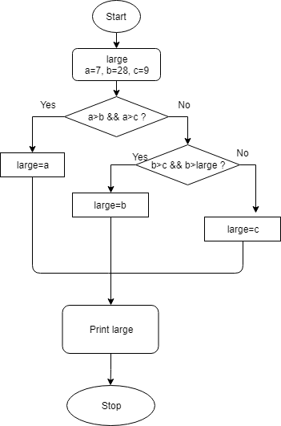
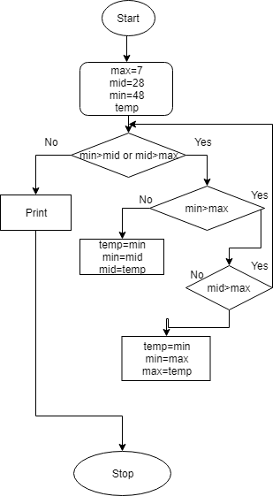
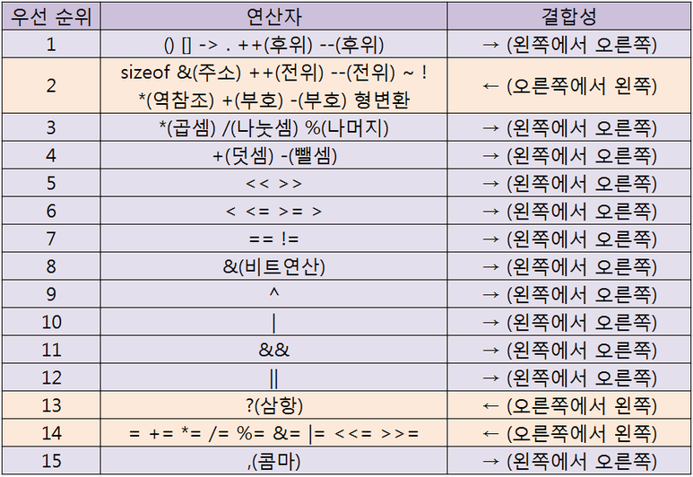
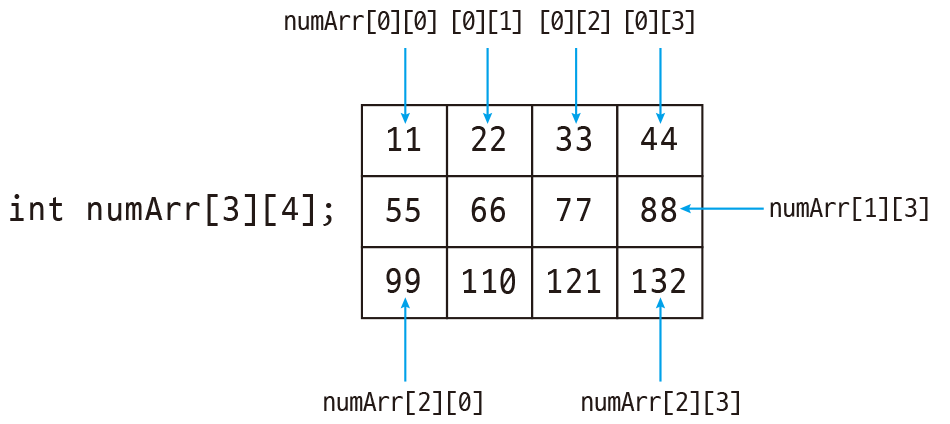

# 안드로이드 및 웹 프레임워크 전문개발자 양성과정
#### 이용섭 강사 ( 010-7242-9424 / argus10@hanmail.net )

### [2019-03-04]
+ 분석 - 설계 - 구현
+ '분석'과 '설계'단계를 완벽하게 구현할 줄 알아야, 구현(코딩)이 원할하다.

#### 1. 과정소개
  + 목표 : "안드로이드 개발 및 프레임워크 개발자 과정"
  + 안드로이드 개발
    - PC : 1.SE(Standard Edition) + 2.Web
    - 스마트폰 : Application
    - "Web + App"를 개발하는 것이 목표.
  + 프레임워크
    - PC에서의 웹 프레임워크를 개발하는 것이 목표.

1. JAVA언어 학습
  + 기본언어의 JAVA를 통해서, 안드로이드를 개발한다.
  + JAVA의 기초를 다지고 다른 언어로 배우는 것이 좋다.
    - "언어 공통요소"학습 : 어떤 언어든지, 공통적인 요소가 있다.
      - '문법' : 기억장소(단일기억장소), 제어구조, 연산자,순차구조, 제어구조, 반복구조... 등
      - '문제풀이능력'
    - "여러개의 값(배열)"학습 : a[]=[10,20,30,40,50];
    - "객체지향 특성"학습 : 클래스, 메서드, 오브젝트
    - "다양한 클래스 라이브러리"학습
    - "네트워크(Network)"학습
    - "데이타베이스(DataBase)"학습

2. Database
  + MS-SQL, mySQL, Oracle.... 기본적인 SQL문법 학습
  + "Oracle 데이터베이스" 학습
  + "Java의 JDBC" 학습

3. Web Program
  + 웹 프로토콜 "http" 학습
  + http에 대한 통신규약, html에 대한 이해 학습
  + "서블릿" + "JSP"에 대한 이해와 학습

4. Android(안드로이드)

5. 프레임워크(FrameWork)
  + 웹 프로그램을 효율적으로 관리하는 학습
  + "Spring" 프로그램을 학습


#### 2. 간단 TEST
----------------------------------------------

### [2019-03-05]
#### 1. Review(Q&A)
#### 2. JAVA 개발환경 설치
  + JDK + Eclipse
  1. "컴파일러"와 "실행기", "디버거", "클래스라이브러리"가 필요하다. -> JDK
  2. GUI의 편리한 환경.... 개발통합환경 -> Eclipse
  3. JDK 8.0설치 후, path지정.
  4. 환경변수 %JAVA_HOME%\bin 추가
  5. 환경변수 JAVA_HOME설정
  6.

#### 3. 컴퓨터의 기본기능과 프로그램
  1. 값들을 저장한다. (a=10)
  2. CPU(중앙처리장치)가 '요리(?)'=ALU 역할.

#### 4. 기억장소
  + 변수, 상수, 객체...

#### 5. 세가지 제어구조(Control Unit의 역할)
  + 순차구조, 선택구조, 반복구조

#### 6. 연산자소개
  + "사칙연산", "비교연산자"

#### 7. 문제풀이연습
#### 8. Summary / Close
------------------------------------------------

### [2019-03-06]
#### 1. Review
  + 프로그램 - 명령어의 모음
    - 기억장소(값=데이터)와 세가지(순차, 선택, 반복...제어문)구조 그리고 연산자만을 사용함

  1. JAVA개발환경설치
    + JDK 1.8 설치
      - 컴파일러(/bin) : javac.exe
      - 실행기(/bin) : java.exe
      - 디버거(/bin) : jdb.exe
      - 압축(/bin) : jre.exe
      - 클래스라이브러리 : `*.jar`
  2. 통합개발환경설치 : Eclipse
  3. 컴퓨터의 기본기능
    1. 입력 : 클래스 라이브러리로 준비되어 있다. System.in.*
    2. 저장 : 기억장소(내부+외부)
    3. 제어 : 순차, 선택, 반복
    4. 연산 : 연산자를 통한 연산작업
    5. 출력 : 클래스 라이브러리로 준비되어 있다. System.out.*
  4. 자료형
    1. 대표자료형
      + 문자열 String = "TEXT"
      + 단수문자 char = 'A'
      + 정수 int = 0.72 ~ -527
      + 실수 double = 0.0, 0.234
      + 논리 boolean = true, false
  5. 변수선언규칙
    + 자료형 변수명[=값];

#### 2. 기억장소(변수사용규칙과 자료형)
  + 자료형
    + 자료형(DataType) = 데이타(값)의 종류를 구분해 놓은 것.
      1. 문자데이터
        + 복수문자(문자열) : "A", "ABC", "전주" - String [""-ok]
        + 단수문자 : 'A', '1', '강' - char [''-error]
      2. 숫자데이터
        + 정수 : 0, -127, 365... int
        + 실수 : 0.0, 3.45... double
      3. 논리데이터
        - 논리 : true, false... boolean

  + 메모리 즉 기억장소에 보관(저장)되고 사용되어지면 '변수'라고 부른다.
  + 저장 위치를 불러오기?
    1. 절대주소 : 메모리상의 절대적주소(address)
    2. 상대주소 : 임의의 기준점으로부터의 상대적주소
    3. 의미화주소 : 변수명으로 사용하는 주소
  + 변수명의 역할
    - 값이 저장된 위치의 별칭. 메모리(값이 저장된) 위치를 식별해주는 역할.
    - 변수명 작성규칙 : 역할에 부합되는 의미있는 명칭을 부여(사용)하자.
      - 변수명은 소문자로 사용하자
      - 한글 풀어쓰기 금지
      - 약어사용 자제
      - 의미있는 단어를 두 글자 이상사용시 대문자 사용 (scoreSum)
  + 변수선언규칙
    - 변수선언
      - 자료형 변수명;
      - 자료형 변수명 = 초기값;
    - 변수정의 : 기억장소가 확보되고 유효값이 저장
      1. 선언만된 변수는 R-Value(값 읽어서 사용하는 표현)로 사용할 수 없다.
      2. 변수가 정의되는 시점은 유효한 값이 최초로 지정될 때이다.
      3. L-Value(값을 변경하는 표현)는 선언된 변수이면, 모두 사용할 수 있다.
      4. 변수를 정의하는 방법
        1. 초기값지정. (int score = 50;)
        2. 치환대입연산자사용. (int score; score = 5;)
        3. 키보드로 입력한것. (System.in ~)
      5. 변수사용
        1.

#### [실습]
  + Eclipse 사용법
    1. 프로그램 전체실행 : Run\Run메뉴 사용
    2. 필요에 따라 1라인씩 디버깅하며 실행 : Run\Debug메뉴 사용
      ... 이때 처음 시작할 위치를 break pointㄹ 지정해야 한다.

  1. 변수와 자료형
    1. 리터럴(literal) : 프로그램 소스값 직접 값이 표현되었을때 리터럴 값이라고 한다
      + "JICA" 문자열 리터럴
      + 'A' 문자 리터럴
      + 100 정수(int) 리터럴
      + 3.14159 실수(double) 리터럴
      + true / false 논리(boolean) 리터럴
    2. 변수(variable) : 프로그램에서 값을 저장하고 사용(읽거나 변경)하는 기억장소
      + 상수(constant) : 값이 저장되어있고, 변경할 수 없는 기억장소
      + 변수명의 역할 : 값이 저장된 위치를 식별하기 위하여 사용자가 지정하는 명칭(의미화주소)
      + 변수명을 지정할때의 관례적 규칙
        - 저장되는 값의 역할에 맞는 의미있는 명칭을 사용하자.
        - 소문자로 작성하는 것을 원칙으로 하되 두 단어 이상을 사용할 때는 두 번째 단어의 첫글자는 대문자로 사용하자.
        - 한글 풀어쓰기 금지.
        - 지나친 약어 사용은 자제하자.
      + 변수의 선언과 정의
        - 변수선언 형식 : 자료형 변수명 [=초기값];
        - 선언 : 시스템 내부에 어떤 종류의 값을 어떤 명칭으로 사용할 것이라고 알려주는 것. 단, 기억장소는 확보되지 않는다. [String name;]
        - 정의 : 기억장소가 확보되고 유효한 값이 최초로 저장되는 것. [name="홍길동"]
          - 변수를 정의하는 3가지 방법
            1. 선언시 초기값 지정
            2. 대입연산자 즉, 치환연산자(=) 사용
            3. 키보드로 입력(READ)
        - 변수 선언시 초기값을 지정하면 변수의 선언과 정의가 동시에 이루어진 것이다. [String name="장길산"]
    3. 변수의 사용시 L-Value, R-Value로 표현
      1. R-Value : 변수에 저장된 값을 읽어오는 표현
```java
      int a, b=10, c;
      System.out.println(b); //b = R-Value
      a = b + 5; //a = L-Value
      if( a > 20 ) {
        실행문장
      }
      a = a + b; // a = 25... R+L-Value 동시에 사용
      c = 100; // 실행문
```
      2. L-Value : 표현식에서 대입연산자 왼쪽에 변수가 나타나는 표현으로 값이 변경된다.
```java
      c = 100;
      c = a + b;
      c = 입력받는 표현식
```
    + 선언만 된 변수는 R-Value로 사용할 수 없다.
    + 반드시 R-Value는 정의된 변수만 사용할 수 있다.
    + 선언된 변수는 언제든지 L-Value로 사용될 수 있다.


  2. 표준입력과 표준출력
    1. 표준 출력 : System.out 객체의 메서드를 사용한다.
```java
    System.out.println(리터럴값이나 변수);
```
    2. 표준 입력 : System.in 객체의 메서드를 사용하면 한글자밖에 입력받지 못하므로 다양한 값을 입력받기 위해 다음의 방법을  사용한다.
```java
    import java.util.Scanner;

    public static void main(String[] args) {
    		String title;
    		int score;
    		double height;
    		char grade;
    		boolean pass;
    		String pass_y;

    		//입력 전용 객체선언 및 생성
    		Scanner scanner = new Scanner(System.in);

        try {
    		System.out.print("성명입력: ");
    		title = scanner.nextLine(); //문자열을 입력받을때 사용

    		System.out.print("점수입력: ");
    		score = scanner.nextInt(); //정수값을 입력받을때 사용

    		System.out.print("몸무게입력: ");
    		height = scanner.nextDouble(); //실수값을 입력받을때 사용

    		scanner.nextLine(); // scanner라인을 지우기
    		System.out.print("학점입력: ");  //true,false등 논리값을 입력받을때 사용
    		grade = scanner.nextLine().charAt(0); //단수문자를 입력받을 때 사용

    		System.out.print("합격여부입력: ");
    		pass = scanner.nextBoolean();
    		if (pass==true) {  //합격여부 true일때, "합격"으로 변환저장.
    			pass_y="합격";
    		}
    		else {
    			pass_y="불합격";
    		}

    		System.out.println(title + "," + score + "," + height + "," + grade + "," + pass_y);
      }
      finally {
        scanner.close();
      }
    	}
    }
```

#### 3. 세가지 제어구조(순차, 선택, 반복)
  1. 순차구조
  - 위에서 아래로/좌에서 우로 차례대로 명령어를 실행한다.
  2. 선택구조
  - 단순선택구조
  - 양자택일(2中1)선택구조
  - 다중선택구조
  3. 반복구조
  - 특정문장을 주어진 조건이 참인 동안 반복 실행
  - for / while

#### 4. 연산자
  1. 산술연산자 : `+, -, *, /, %(나머지연산자)`
  2. 관계연산자 : >, >=, <, <=, ==, !=
  3. 논리연산자 : &&, ||, !|

#### 5. 문제풀이과정
+ 문제제시) 두 정수가 주어졌을때, 큰 수를 출력하고, 두 수의 합계가 100보다 크면 합계를 출력하시오.
```java
int a=5, b=7;
if ( a > b ) {
  System.out.println("큰수 :" + a);
}
else {
  System.out.println("큰수 :" + b);
}

if ( a+b > 100 ) {
  System.out.println("합계 :" + a+b);
}
```
  1. 문제이해
- 최종결과와 결과를 만들기위한 조건을 검토해 본다.

  2. 처리과정
- 큰수결정
- 합께계산
- 합계출력여부결정
- 큰수출력
- 합계출력 or 패스
- 끝

  3. 순서도(플로우차트)
- 기억장소, 세가지 제어구조, 연산자만을 사용하여 수행할 기능을 약속된 기호로 나열한다.

  4. 자바언어로 코딩
- 순서도를 보고 자바코딩을 수행한다.


문제제시) 1~5까지 출력하시오.
  1. 문제이해
- 숫자 값을 가진 변수를 계속 변화시켜 5를 출력
  2. 처리과정
- 숫자가 5보다 작을 동안 반복
  + 숫자출력
  + 숫자증가
  + 끝
  3. 순서도
  4. 코딩
```java
  int number = 1;
  while ( number <= 5 ) {
    System.out.print(a + " ");
    number = number + 1;  // or number += 1
  }
```


#### 6. Summary / Close
  1. 변수선언의 위치가 꼭 상단이어야 하는가?
  2. Scanner 선언 후에...Close함수를 써야하는가? (1.5까지는 필요, 1.7부터는 필요X)

#### [과제]
1. 두 변수만 사용하여 내용값을 교환하라.
```java
  int a = 5;
  int b = 7;

  a = a ^ b;
  b = a ^ b;
  a = a ^ b;

  System.out.println(a+","+b);   // 7,5
```

2. 세 숫자가 주어졌을 때,
  1. 가장 큰수 구하기
```java
    int a=10, b=2, c=5;
    if ( a > b && a > c) {
      System.out.println("가장 큰수 : " + a);
    } else if ( b > a && b > c) {
      System.out.println("가장 큰수 : " + b);
    } else {
      System.out.println("가장 큰수 : " + c);
    }
```

  2. 중간수 구하기
```java
    int a=10, b=2, c=5;
    if ( a > b && a < c) {
      System.out.println("중간수 : " + a);
    } else if ( b > a && b < c) {
      System.out.println("중간수 : " + b);
    } else {
      System.out.println("중간수 : " + c);
    }
```

3. 1~100숫자에서 홀수 합계 구하면 출력
```java
int number = 1;
int sum = 0;

while ( number <= 100 ) {
	if ( number % 2 == 1 ) {
		sum += number;
	}
	number += 1;
}
System.out.print(sum);
```
--------------------------------------------------------------

### [2019-03-07]
#### 1. Review
  + 컴파일러언어 - (번역) Java, c c++
  + 인터프리터언어 - (동시통역) Javasscript

  + 언어 공통적인 문법
    - 자료형과 변수
      - 문자, 숫자(정수+실수) 등의 저장을 변수에.
      - 선언(R-Value)&저장(L-Value)을 통해 사용.
    - 제어문
      - 제어구조(제어문-Control Statement)
      1. 순차구조
      2. 선택구조 - 다중선택
      3. 반복구조 - for, while, do~ while
    - 연산자
      - 산술연산자 : +, - , `*`, /, %
      - 관계연산자 : >, <, >=, <=, ==,!=
      - 논리연산자 : &&, ||, !

#### 2. 기본 자료형과 참조형
  + 변수의 종류
    1. 일반변수 - 기본자료형으로 확보되는 변수
    2. 참조변수 - 배열, 클래스로 만들어진 객체
  + 변수가 선언&정의되면 결정되는 것들
    - 자료형(int), 기억장소크기(4byte), 값의 저장방식(양수:부호비트 절대값/음수:부호비트 2의보수값)
  + 모든 연산은 같은 자료형끼리만 가능하다. 자료형이 다르면 연산이 불가능하다. 하지만, 컴퓨터 내부에서 계산상의 더 큰 자료형으로 변환 후 계산한다. (자동형변환=캐스트연산)


#### [실습]
  + 자료형(Data Type) : 컴퓨터 내부적으로 표현되어지는 값들의 종류를 구분해 놓은 것.
  + 자료형의 종류
    1. 기본자료형(Primitive Data type)

|구분          |크기  |값의 범위                        |값의 저장방식                           |
|:-------------|:----:|:-------------------------------:|:--------------------------------------:|
|정수형 int    |4byte |-2147483648~0~2147483647 약+-21억|양수(부호와절대값), 음수(-와 2의 보수)  |
|실수형 double |8byte |소숫점 15자리까지 정확히 저장    |부호와 지수부 및 가수부로 변환되어 저장 |
|논리형 boolean|1byte |true, false                      |0:false, 1:true                         |
|문자 char     |2byte |0~65535의 값을 표현(Unicode값)   |                                        |


    2. 참조형(Reference Data type)
      - 문자열 String
```java
  int a = 10;    // a라는 장소에 10이 저장
  String name = "홍길동";   // name이라는  이름의 참조값(실제로 저장된 곳)에 저장된다.
```
      - 배열
```java
  int arr[] = {10, 20, 30, 40, 50};  // arr 참조값---> |10 |20 |30 |40 |50 |
```
      - 클래스와 객체
```java
  Scanner scanner = new Scanner(System.in);
  //scanner 참조값---> 키보드입력에 필요한 여러 값들이 저장되어 있음.
```

  + 클래스(class)는 데이터(값)과 메서드(Mathod)로 구성되어 있다.
  + 클래스는 벰버변수(Field)와 Method로 구성되어 있다.
```java
public class Test {
	public static void main(String[] args) {
    swap1();  // 메서드 swap1호출
    swap2();  // 메서드 swap2호출
	}
  public static void swap1() {
    // swap1 내용
  }
  public static void swap2() {
    // swap2 내용
  }
}
```
  + 메서드는 특정기능을 수행하는 명령어들의 모음
  + "static"이라는 구문이 있어야 '객체'없이 동작한다. 없으면, 객체생성해야 함.


#### 3. 선택구조
- 문제) 세 숫자가 주어졌을 때, 가장 큰 수 구하기
  + 1. 문제이해
  + 2. 처리과정
    - 먼저 두 수를 비교하여, 큰수를 찾는다.
    - 나머지 수와 비교하여 큰수 결정. (가장 큰수 결정)
    - 결과를 출력.
  + 3. 순서도 - 구체적인 방법
  + 


#### [실습]
```java
int large; //가장큰수
int num1 = 7, num2 = 29, num3 = 58; //주어진 수

	// 1. 두수를 비교하여 큰 수 결정
	if(num1>num2) {   //num1이 큰수
	//2.나머지수와 비교하여 가장큰수 결정
	 if(num1>num3) {
		   large=num1;
	    }else {
		      large=num3;
	      }
   } else {          //num2이 큰수
			//2.나머지수와 비교하여 가장큰수 결정
		if(num2>num3) {
				large=num2;
		}else {
			large=num3;
		}
	}
		//3.결과출력
	System.out.println(num1+","+num2+","+num3+" 중에서 가장 큰수는 "+large);


//1.두수를 비교하여 큰 수를 결정
if(num1>num2) {
	large=num1;
} else {
	large=num2;
}

//2.큰수(large)와 나머지 수를 비교하여 가장 큰 수 결정
if(large<num3) {
	large=num3;
}

//3.결과출력
System.out.printf("주어진 세수 %d,%d,%d 중에서 가장큰수는 %d입니다.%n",num1,num2,num3,large);


//1.num1이 가장 큰 수인지 판별
if(num1>num2 && num1>num3) {
		large=num1;
} else if(num2>num1 && num2>num3) { //2.num2이 가장 큰 수 인지 판별
		large=num2;
} else {    //나머지는 무조건 num3이 가장 큰 수
		large=num3;
}
//3.결과출력
System.out.printf("%d(은)는 %d %d %d 중에서 가장 큰수입니다.%n",large,num1,num2,num3);
```
```java
//양자택일 if
if(조건){
        참일때 수행 문장;
}else{
       거짓일때 수행 문장;
}
//다중선택 if (else if문)
if(조건1) {
  조건1을 만족할때 수행할 문장;
}else if(조건2){
  조건2을 만족할때 수행할 문장;
}else if(조건3){
  조건3을 만족할때 수행할 문장;
}else if(조건4){
  조건4을 만족할때 수행할 문장;
}else{
  위의 모든 조건이 거짓일때 수행할 문장;
}
```

#### 4. 반복구조
+ 다른각도로 풀어보자
  - 1.문제이해 : min, middle, max를 정하자.
  - 2.처리과정
    * 주어진 세 수를
    * min < middle < max
      - min > middle이면, 내용교환
      - middle > max이면, 내용교환
    * min, middle, max 출력
  - 3.순서도
  - 

##### [while 반복구문]
```java
public static void minMidMax() {
		int min=29, mid=7, max=58;
		int temp;

		//1. min<mid 그리고 mid<max가 될때까지 반복
		while(min>mid || mid>max) {
			if(min>mid) {
				temp=min;
				min=mid;
				mid=temp;
			}

			if(mid>max) {
				temp=mid;
				mid=max;
				max=temp;				
			}
		}

		//결과출력
		System.out.printf("%d %d %d 순서입니다.%n", min, mid, max);
	}
}
```

+ 반복구조
  - 선체크 반복
    * 규칙적 반복 : for문(빈도가 높음)
    * 불규칙적 반복 : while문(가끔)
  - 후체크 반복 : dowhile문(거의X)

##### [for 반복구문]
+ [for문]
```java
for(반복제어변수 초기화; 반복조건; 반복제어동안 수행작업) {
  수행할 작업;
}
```

+ 증감연산자 : ++, --
+ 결합연산자 : +=, -=, `*=`, /=, %=

```java
int number = 1;
int sum = 0;
for(number=1; number<=100; number+=2) {
			sum += number;
		}
		System.out.printf("1부터 100까지 홀수의 합은 %d입니다.",sum);
```

[반복구조를 표현하는 제어문]
+ 1. 선체크 반복
  - 1) 규칙적 반복 ==> for문
```java
for(반복제어변수초기화; 반복조건; 반복제어변수증감) {
  수행할 기능
}

int sum = 0;
int number;
for(number=1; number<=100; number+=2) {
	sum += number;  //수행할 기능
}
System.out.println("홀수합계 : " + sum);

```
  - 2) 불규칙적 반복 ==> while문
```java
반복제어변수 초기화
while(반복조건) {
  수행할 기능
  반복제어변수증감
}

int sum = 0;
int number;
number=1;   //반복제어변수 초기화
while(number <= 100) { //반복조건
	sum += number;  //수행할 기능
	number +=2;    //반복제어변수 증감
}
System.out.println("홀수합계 : " + sum);
```
+ 2. 후체크 반복 ==> do while문
```java
do{
  반복내용
} while(반복조건);
```

###### [3/7 과제]
+ 성명과 세 점수를 입력받아, 총점과 평균 그리고 학점을 출력하시오. 단, 평균이 90.0이상이면 'A', 80.0이상이면 'B'... 60.0이하이면 'F'. 출력하시오.
+ 1부터 100까지 숫자 중, 3의 배수와 5의 배수를 제외한 홀수의 합계를 계산하여 출력하시오.
+ 1+(1+2)+(1+2+3)+(1+2+3+4)+...+(1+2+3+...+9+10)의 합을 계산하여 출력하시오.
+ 숫자를 입력받아(1~20) 해당 숫자의 Factorial를 계산하시오.


#### 5. 관계연산자와 논리연산자
#### 6. 문제풀이
#### 7. Summary / Close

--------------------------------------------------------------------

### [2019-03-08]
#### 1. Review
##### 자료형 : 값들의 종류
+ 1) 기본자료형
  - 음수와 양수의 메모리 상태가 다르다. (음수는 보수를 취해서 계산)
  - 실수(float-4byte / double-8byte)
  - 정수(short-2byte / int-4byte / long-8byte)
```java
System.out.println(0101); //8진수 65를 표현
System.out.println(0x41); //16진수 65를 표현
System.out.println(10L); //10을 long(8byte)로 표현

float f1 = 3.1415;  //error
float f1_2 = 3.1415F; //ok
double f2 = 3.1415; //ok
```

+ 2) 참조형
```java
char grade = 'A';  //기본형 변수
String name = "홍길동";  //참조형 변수
```
+ "홍길동"은 실제로 어딘가 저장되어 32bit로 저장되어 있고, 주소값만 name에 있다.


#### 2. 자료형
+ 문자 char - 2byte_유니코드값(0~65535)
+ 정수 int로 표현되는 21억까지의 숫자가 넘는다면, 'long' 변수를 사용해야 한다.
+ 등가비교는 '정수형', '문자'끼리하는 것을 권장.

#### 3. 제어문
##### [실습]
+ 키보드로 입력받는 과정
  - name = scanner.nextLine();
  - 성명입력 : ABC엔터  ---------  |65|66|67|13|10|||||||||||...|||||| (키보드 버퍼)
  - name이라는 버퍼에 "ABC"가 들어감. 이후 키보드 버퍼 클린......||||||||||

  - score = scanner.nextInt();
  - 입력 : 70엔터  ---------  |7|0|13|10|||||||||||...|||||| (키보드 버퍼)
  - score라는 변수에 숫자70을 만들어 들어감. 이후 키보드 버퍼 클린...|||||

+ 다중선택구조는 Java언어에서
  - 1) else if문 - 어떠한 다중선택구조로 모두 표현할 수 있다.
  - 2) switch case문 - 조건이 문자나 정수의 등가비교(==)일때만 사용한다.
```java
int temp = (int)average / 10;
switch (temp) {
case 10: grade = 'A';break;   // grade = 'A';break; 생략가능
case 9:	grade = 'A';break;
case 8:	grade = 'B';break;
case 7:	grade = 'C';break;
case 6:	grade = 'D';break;
default : grade = 'F';break;  // break; 생략가능
}
System.out.printf("총점:%4d,평균:%6.2f,학점:%2c%n",	total, average, grade);
```

+ 반복문
  - 규칙적인 반복 ==> for문
  - 불규칙적인 반복 ==> while문

#### 4. 연산자
```java
remain3 != 0 && remain1 != 0;
!(remain3 == 0) || remain3 == 0);
//둘다 같은 표현
```
#### 5. 문제풀이
```java
//1~20까지의 숫자를 입력받아 Factorial을 구하여 출력하시오.
long factorial = 1L;
int inputNumber;
//입력전용객체 선언 및 생성
Scanner scanner = new Scanner(System.in);
//1. 숫자입력
System.out.println("Factorial을 계산할 값을 입력하시오(1~20)");
inputNumber = scanner.nextInt();
//2. factorial계산
for(int number=1; number<=inputNumber; number++) {
	factorial *= number; //factorial = factorial * number;
}
//3. 결과출력
System.out.printf("%d! = %d%n", inputNumber, factorial);


//성명과 세 점수를 입력받아 총점, 평균, 학점을 구하여 출력하시오.
int total;
double average;
char grade;
String name;
int score1, score2, score3;
//입력전용객체 선언 및 생성
Scanner scanner = new Scanner(System.in);
//1.성명과 세점수 입력
System.out.print("성명입력 : ");
name = scanner.nextLine();
System.out.print("점수1입력 : ");
score1 = scanner.nextInt();
System.out.print("점수2입력 : ");
score2 = scanner.nextInt();
System.out.print("점수3입력 : ");
score3 = scanner.nextInt();
//2.총점과 평균계산
total = score1 + score2 + score3;
average = total / 3.0;
//3.학점결정(계산)
int temp = (int)average / 10;
switch (temp) {
case 10: grade = 'A';break;   // grade = 'A';break; 생략가능
case 9:	grade = 'A';break;
case 8:	grade = 'B';break;
case 7:	grade = 'C';break;
case 6:	grade = 'D';break;
default : grade = 'F';break;  // break; 생략가능
}
//4.결과출력
System.out.printf("총점:%4d,평균:%6.2f,학점:%2c%n",	total, average, grade);


//1부터 100까지 숫자 중, 3의 배수와 5의 배수를 제외한 홀수의 합계를 계산하여 출력하시오.
int sum=0, number, remain3, remain5;
for(number=1; number<=100; number+=2) {
	remain3 = number % 3;
	remain5 = number % 5;
	if(remain3 != 0 && remain5 != 0) {
		sum += number;
		System.out.print(number+" ");
	}
}
System.out.println(sum);


//1+(1+2)+(1+2+3)+(1+2+3+4)+...+(1+2+3+...+9+10)의 합을 계산하여 출력하시오.
// 1.while문으로 코딩하기
int sum=0; //최종합
int number=1; //항
int subSum = 0; //항의 값
int subNumber; //항의 값을 계산하기 위한 값

while(number<=10) {
//항의 값을 계산
	subNumber = 1;
	subSum = 0;
	while(subNumber<=number) {
		subSum += subNumber;
		subNumber++;
	}
	//총합 누적
	sum += subSum;
	//중간결과 출력
	//System.out.println(number+","+subSum+","+sum);
	number++;
}
System.out.printf("총 합은 %d입니다.%n", sum);


// 2.for문 코딩하기
int i=1, j, sum=0, total=0;
for(i=1; i<=10; i++) {
	for(j=1; j<=i; j++) {
		sum += j;
	}
	total += sum;
	//System.out.println(i+","+j);
}
System.out.printf("총합은 : %d입니다.%n", sum);
```
#### 6. Summary / Close
#### [과제]
+ 교제 1~4장 읽어오기
+ 오늘까지 실습한 문제를 복습해보기

-------------------------------------------------------------------

### [2019-03-11]
#### 1. Review
+ 기초문법(언어공통요소)
+ 문제풀이
  - 일처리과정을 기억장소(자료형, 변수), 세가지 제어구조(제어물), 연산자를 이용하여 작성.

#### 2. 교재살펴보기
+ 자바언어의 특징_"운영체제에 독립적이다."
  - "운영체제에 독립적이다." - JVM(Java Virtual Machine)
  - "네트워크와 부산처리를 지원한다."
  - "멀티쓰레드를 지원한다."
  - "동적 로딩(Dynabic Loading)을 지원한다." - `*.dll`
+ 패키지(package)소개
  - Jva언어에서 패키지(package)는 관련된 클래스(class)들을 모아놓은 것이다.
  - 이클립스에서 Java Project를 만들면 자동으로 default 패키지가 생긴다. 클래스 생성시 패키지 지정이 없으면 deafualt 패키지에 속하는 클래스가 된다. 여러클래스를 효율적으로 관리하기 위해 사용자가 패키지를 만들어 사용할 수 있다.
  - 패키지만들기
    - 1) File - New - package ... 패키지명 지정하면 생성.
    - 2) 클래스생성시 해당 클래스가 속할 패키지를 지정한다.
  - 패키지 명칭은 여러계층으로 작성한다. com.jica.chap02
  - 패키지 명칭은 유일해야 하므로 이름이 겹치지 않게 하기 위해 일반적으로 회사의 도메인명칭을 거꾸러 작성하기를 권장한다.
  - 물리적으로 패키지를 작성하면 소스 디렉토리에 계층구조로 표현된다.
  - 패키지에 속한 java파일은 프로그램소스 첫줄에 패키지 선언부가 있어서 해당파일이 속한 패키지를 package com.jica.dhap03;
#### 3. 2장 자료형
+ 변수의 선언과 초기화
+ 변수의 내용값 교환
+ 값을 출력할때 문자열과 +기호를 결합사용하여 출력할수 있다.

+ 자료형(변수의 타입)
  - 1) 프로그램 소스에 값이 직접 표현되면, Litteral이라고 한다.
  - 2) 값을 저장하여 사용할때 변수를 이요한다.
  - 3) 변수 선언시 반드시 자료형을 지정한다.
+ 값의 종류 ==> 자료형
  - 문자열 String 4
  - 문자 char 2
  - 정수 int 4 약+-21억, long 8 ...., short 2 -32768~0~32767, byte 1 -128~0~127
  - 실수 double 8 소숫점이하 15자리, float 4 소숫점이하 7자리
  - 논리값 boolean 1  true/false
+ 일반변수와 참조변수
  - 일반변수는 위의 자료형중 기본형(primitive type) 값을 가지는 변수
  - 참조변수는 배열이나 객체의 위치정보(주소:address)를 값을 가지는 변수 무조건 크기는 4byte)
```java
String title = "전주정보문화진흥원";
int scores[] = new int[]{50,70,90,800,88};
Scnner scanner = new Scanner(System.in);
Date today = new Date();
```

+ 정수값을 프로그램소스에 직접 리터럴형태로 표현할때 대부분의 경우 십진수값을 표현하지만 특수한 경우에는 8진수, 16진수, 2진수 등으로도 표현할 수 있다.

|리터럴값|진법    |접두어|
|:-------|:------:|:----:|
|100     |십진수  |없음  |
|0100    |8진수   |0     |
|0x100   |16진수  |0x    |
|0b100   |2진수   |0b    |

+ 접미어를 사용하여 int형과 long을 구분한다.
  - 100          ==>    int형
  - 100l, 100L   ==>    long형
+ 정수를 리터럴값으로 표현할때 자릿수가 길면 복잡해 보인다.
  - 만약 275486이라는 숫자를 용이하게 판독하기 위해 일상생활에서는 세자리 숫자마다 콤마(,)를 사용한다.
  - 위와 비슷한 효과로 int, long값을 표현할때 `_`를 사용할 수 있다.(Java 5.0부터)
```java
long value = 100000000000L;     // ok
long value2 = 100_000_000_000L; // ok
```
+ 실수형데이터를 표현할때 float와 double을 명시적으로 지정하기 위해 f와d를 사용할수 있다.
```java
float phi = 3.1415f;    // ok
double phi2 = 3.1415;   //double phi2 = 3.1415d; ok
```
+ 자료형이 다른 값을 저장할때는
  - 1. 같은자료인가(문자, 정수, 실수)
  - 2. l-value 기억장소크기 >= r-value 기억장소크기 ok
```java
int i = 'A';    //ok
long l = 123;   //ok
double d = 3.14f;  // ok

int j = 0x123456789;  // 16진수 정수 => int의 표현범위를 벗어난값이므로 long형 정수써야함
// 0001 0010 0011 0100 0101 0110 0111 1000 | 1001

byte b = 127; //ok l-value는 byte형이고 r-value는 int 리터럴이지만 값이 범위가 byte형으로 저장할 수 있다.
byte b = 128; //error 범위를 벗어나서...
short s = 0x1234;

char ch3 = 'J'; //ok
String name2 = "Java"; //ok
// 주의할점
String str = ""; //ok 빈 문자열
char ch4 = '';  //error 빈 문자표현은 없다.
char ch5 = ' '; //ok 공백문자 즉, 코드값 32
```
+ String 즉, 문자열은 기본자료형이 아니라 참조형이라고 했다.
  - 참조형 변수는 new 표현으로 생성할 수도 있다.
```java
String name3 = "안드로이드";   //ok
String name4 = new String("안드로이드");  //ok
```

+ 문자열과 기본자료형을 +연산자로 연결시키면 최종적으로 문자열이 된다.
```java
String title = "Java" + 5.0;  // "Java5.0"
```
+ 논리값 true, false
```java
System.out.println(true);    // true 값이 출력
System.out.println(true+""); // "true" 문자열 출력
```
+ null도 예약어 이다.
  - null 참조형 변수에 아직 유효한 값이 저장되지 않았다는 의미로 사용된다.
  - 그러나 null은 자료형은 아니다.
```java
String title2;
System.out.println(title2);  //error

String title2 = null;
System.out.println(title2);  //ok

System.out.println(null); //error
System.out.println("null"); //ok
```

+ System.out.println() 사용법
+ System.out.printf() 사용법
  - System.out.printf("%d %s %f %c %n등의 형식지정자와 출력할문자열", 형식지정자);

|출력할 값          | 형식지정자      |
|:------------------|:---------------:|
|문자열(String)     |%s               |
|단순문자(char)     |%c               |
|정수(10/8/16/2진수)|%d, %o, %x, %b   |
|실수               |%f               |
```java
System.out.printf("%s %c %d %f", "Java", 'A', 78, 3.14);

System.out.println('\'');		     //  '''처럼 할 수 없다.
System.out.println("abc\t123\b456"); // \b에 의해 3이 지워진다.
// \t tap키....\b BackSpace
System.out.println('\n');		     //  개행(new line)문자 출력하고 개행
System.out.println("\"Hello\"");	 //  큰따옴표를 출력하려면 이렇게 한다.
System.out.println("c:\\");
```
+ 문자값 중에서 특수제어기능을 수행하는 몇몇개의 특수문자를 표현하는 방법

|          |    |
|:---------|----|
|tab       |\t  |
|backspace |\b  |
|endter    |\n\r|
|\         |\\  |
|'         |\'  |
|"         |\"  |

+ 정수형 기억장소의 overflow
  - 각 정수형의 기억장소의 크기에 따라 표현할 수 있는 값의 범위가 정해져있다.
  - 그 범위를 벗어나면 에러가 발생하지는 않지만, 잘못된 값이 저장되어 이용됨. (=overflow)

+ 형변환?
  - Java언어는 변수가 한번 선언될대 자료형이 결정디면해당변수는 프로그램이 끝날때까지 자료형을 변경시킬수 없는 언어이다.
  - 필요에 따라 일시적으로 자료형이 변경된 효과를 얻는것을 형변환(캐스트:cast 연산)이라고 한다.
  - 컴파일러 내부에서 자동으로 변환되는 것을 자동형변환이라고 한다.
  - 이때 문자형--->정수--->실수로 자동형변환 될 수 있다.
  - 또, 기억장소의 크기 작은 자료형이 큰 자료형으로 자동형변환 된다.
  - byte -> short -> int -> long -> folat -> double

#### [오늘의 문제]
+ 피보나치수열 구하기
#### 4. 3장 연산자
#### 5. 4장 조건문과 제어문
#### 6. 배열 사용법
#### 7. 배열을 이용한 문제풀이
#### 8. Summary / Close


-------------------------------------------------------------------

### [2019-03-12]
```
1) Scanner
2) Integer.toBinaryString() ==> 정수값이 메모리 2진수형태로 저장된 모습을 확인하고 싶을때
3) Math.round()             ==> 숫자 반올림을 손쉽게 하고 싶을때
4) Math.random() ==> 0.0 ~ 1.0 사이의 임의의 double형 숫자가 생성.

     클래스명.메서드호출();
```

#### 1. 3장 연산자
+ 1. 연산을 수행하는 기호
+ 2. 연산자 : CPU가 수행하는 기능을 프로그램에서 사용할 수 있도록 특수문자를 이용하여 제공한다.
  - 연산자(operator)는 연산을 대표하는 기호
  - 피연산자(operand)는 연산에 참여하는 값(리터럴, 변수, 계산의 결과값)
+ 피연산자의 갯수에 따라 '단항연산자', '이항연산자', '삼항연산자'로 구분할 수 있다.
+ 연산의 성격에 따라 '산술연산자', '관계(비교)연산자', '논리연산자', '기타연산자'로 구분할 수 있다.

+ 0. 단항연산자(우선순위0)
  - ++, --, +, -, ~, !, (type)variable
+ 1. 산술연산자
  - `*`, /, %  (우선순위1)
  - +, -       (우선순위2)
  - >>, <<     (우선순위3)
+ 2. 관계연산자
  - <, <=, >, >= (우선순위4)
  - ==, !=       (우선순위5)
+ 3. 논리연산자
  - &, ^, |      (우선순위6)
  - &&, ||       (우선순위7)
+ 4. 삼항연산자
  - ?:           (우선순위8)
+ 5. 대입연산자와 결합연산자
  - =            (우선순위9)
  - +=, -=, `*=`, /=, %=, ~=, >>=, <<=  (우선순위10)
  - &=, ^=, |=   (우선순위11)
+ 6. 기타 연산자
  - instanceof

+ 대부분의 연산자는 변수나 값 전체를 대상으로 연산을 수행하지만, 몇몇개의 특수한 연산자는 변수의 비트(bit)값을 대상으로 연산을 수행한다. 이러한 연산자를 비트연산자라고 한다.
  - ~  1의 보수 연산자
  - >> 비트값을 오른쪽으로 이동(shift)
  - << 비트값을 왼쪽으로 이동(shift)
  - &  비트 논리곱
  - |  비트 논리합
  - ^  배타적 논리합(XOR)
  - ~=, <<=, >>=, &=, ^=, |=

+ 모든 연산자의 우선순위를 외워서 적용하는 것은 어려움이 있으므로 개략적으로 단항, 산술, 관계, 논리, 삼항연산자, 대입/결합연산자 순정도 기억하고 표현할때는 먼저 수행할 연산을 괄호('(')를 이용하여 명시적으로 나타내주자.

+ 연산자의 우선순위가 동일한 연산자 하나의 표현에 동시에 사용되었을때 수행되는 순서(규칙)을 '결합규칙'이라고 한다.
  - 산술연산은 '왼쪽에서 오른쪽으로'하지만, 대입연산에서는 '오른쪽에서 왼쪽으로' 한다.
  - 

+ 모든 연산자는 자료형이 동일해야 실행될 수 있다. 자료형이 다르면 같은 자료형으로 자동형변환이 발생할 수 있다.
  - 자동형변환은 작은 자료형이 큰 자료형으로 변환되는 기능이다.
+ float, double 내부적인 저장내용이 유효자릿수 이후에는 쓰레기 값이 저장될수 있으므로 가극적 등가비교 하지 않기를 권장한다.
```java
// 굳이 쓰려면, 다음과 같이 사용하자.
if( 0.1 - 0.1f > 0000000001) {
  System.out.print("두 숫자는 다르다.");
} else {
  System.out.print("두 숫자는 같다.");
}
```
+ 실수형끼리의 등가비교 사용을 자제하자.

+ 문자형 비교
  - String 변수는 참조변수이다.
  - 
  - String 변수를 등가비교(==)하면 메모리 상태에 따라 결과값이 다르게 나타나므로 주소(위치정보)를 비교하지 말고 내용값을 비교할때 equals()메서드를 사용한다.
  - 문자열 비교는 등가비교(==)를 사용하면 위치정보(주소)가 같은지를 비교하고, 문자열객체.equals("문자열")를 사용하면 내용값이 같은지를 비교한다.
  - 앞으로 equals()메서드 사용.
```java
 문자열.equals("문자열");
```
+ 논리연산자
  - 일반 논리 연산자
  - && 논리곱 and 두개 모두 참일때 결과값이 참
  - || 논리합 or  두개값 중 하나라도 참이면 결과값이 참
  - !  부 정  not 반대 결과값
  - 논리합 즉, or 연산자 ||는 표현식에서 앞의 조건이 참이면, 뒤의 조건은 평가하지 않고 True표현
  - 논리곱 즉, and연산자 &&는 표현식에서 앞의 조건이 거짓이면 뒤의 조건은 평가하지 않고 False표현

+ 비트연산자 : 비트값을 대상으로 연산을 수행한다.
  - 특별한 경우에만 사용하고 일반적으로 잘 사용하지 않는다.
  - ~       1의 보수연산자
  - >>  비트값을 오른쪽으로 이동시키는 연산자 (shift)  => 나눗셈효과
  - <<  비트값을 왼쪽으로 이동시키는 연산자 (shift) => 곱셈효과
  - &, |, ^ 비트를 대상으로한 논리 연산자
  - 비트 and 연산자 & : 양쪽비트값이 모두 1이면 1, 아니면 0
  - 비트 or  연산자 | : 두 비트값중 하나라도 1이면 1, 아니면 0
  - 비트차 연산자   ^ : 두 비트값이 같으면 0, 다르면 1

+ 삼항연산자 if문을 1줄로 간결하게 표현하는 효과가 있다.
```java
  (조건) ? 참일때 실행문장 : 거짓일때 실행문장;
```

#### 2. 4장 조건문과 제어문
```java
score = Interger.parseInt(tmp); //입력받은 문자열(tmp)을 숫자로 변환
```
+ 1) 단순조건
```java
     if(조건){
              참일때 수행 문장;
     }
```
+ 2) 양자택일선택
```java
     if(조건){
             참일때 수행 문장;
     }else{
            거짓일때 수행 문장;
     }
```
+ 3) 다중선택   else if 문
```java
     if(조건1){
            조건1이 참일때 수행문장;
     }else if(조건2){
            조건2가 참일때 수행문장;
     }else if(조건3){
            조건3이 참일때 수행문장;
     }
     ....
     }else{
            위의 모든 조건이 거짓일때 수행문장;
     }
```
+ 다중선택 switch case문
  - else if구문이 실수형과 대소비교로 이루어져 있을때, 좀더 빠른속도로 처리되도록 변경시킬수 있다. switch case문을 이용한다 ==> 문자, 정수의 등가비교 조건
```java
  switch(변수){
     case 값1 : 수행할 문장;break;
     case 값2 : 수행할 문장;break;
     ....
     default : 수행할 문장;break;
     }
```

+ 4) 선택구조안에 또다른 선택구조를 표현하면 중첩 if문이라고 한다.
```java
     if(조건1){
        if(조건2){
        }else{
        }
     }else{
     }               
```

```java
//아래의 코드는 컴퓨터가 1,2,3중에서 임의의 숫자를 발생시키는 코드다.
com = (int)(Math.random() * 3) + 1;  // 1,2,3중 하나가 com에 저장됨
```
+ Math.random() ==> 0.0 ~ 1.0 사이의 임의의 double형 숫자가 생성.
```java
switch(user-com) {
		case 2: case -1:
			System.out.println("당신이 졌습니다.");
			break;
		case 1: case -2:
			System.out.println("당신이 이겼습니다.");
			break;
		case 0:
			System.out.println("비겼습니다.");
  }
```

#### [오늘의 문제]
+ 1) 500까지 숫자중 중심수 구하기
+ 2) 숫자합계
+ 3) 년월일을 입력받아 해당년도의 몇번째 날짜인가 계산하기

-------------------------------------------------------------

### [2019-03-13]
#### 1. Review
+ 자료형, 변수
  - 일반변수(일반변수)
  - 참조형변수(문자열, 배열, 클래스와 객체)
+ 연산자
  - 단항 : +, -, ~, ++, -- !
  - 이항
    - 산술 : `*`, /, %, +, -, <<, >>
    - 관계 : >, >=, <, <=, ==, !=
    - 논리 : &&, ||, &, |, ^
  - 삼항 : `___?___:___`
  - 대입 : =, +=, -=, `*=`,
+ 제어문
  - 선택문
  - 반복문

#### 2. 조건문과 반복문
+ Statement(문)
  - 1) 제어문(Control statement)
  - 2) 분기문(brench statement) : bresk, contiunue, return, goto

+ 1. 선택문
  - 1) if
  - 2) if else
  - 3) else if
  - 4) switch case문
    - if구문이 실수형과 대소비교로 이루어져 있을때 좀더 빠른속도로 처리되도록 변경시킬수 있다면 swich case 문을 이용한다 ==>문자,정수의 등가비교 조건
```java
switch(변수){
   case 값1 : 수행할 문장;break;
   case 값2 : 수행할 문장;break;
   ....
   default : 수행할 문장;break;
   }
```
+ 2. 반복문(Java언어의 모든 반복문은 조건이 참인동안 반복하고 거짓이면 탈출한다.)
  - 1) for반복 -- 규칙적인 반복
    - for문 안에 조건이2개 이상... 변수증감이 두개이상을 ','로 할 수 있으나, 좋은 표현은 아니다.
```java
for(int i=1; i<=5; i++) {
  System.out.println(i);
}

int i;                     // i 6
for(i=1; i<=5; i++){   
   System.out.println(i);  // 1 2 3 4 5
}
==>
  for(반복제어변수 초기값; 반복조건 ; 반복제어변수증감){
    수행할 기능;
  }
```

------------------------------------------------------------------

### [2019-03-14]
#### 1. Review
#### 2. 문제풀이
#### 3. 배열 도입
+ 배열(Array)
  - 배열은 동일한 성격을 가진 기억장소의 모임(집합)이다.
  - 하나의 명칭으로 여러개의 기억장소를 접근할 수 있다.
    - 1) 배열선언 --- 배열명의 성격만 지정했을뿐 생성되지는 않았다.
      - `자료형 배열명 [];`
    - 2) 배열생성 --- 실제 자료형값을 저장할 공간이크기만큼 확보되고 자료형에 따라 초기값이 자동으로 저장된다.
|                             |      |
|:----------------------------|:----:|
|정수(byte, short, int, long) | 0    |
|실수(float, double)          | 0.0  |
|논리(boolean)                | false|
|문자(char)                   | 공백 |
|문자열(String)               | null |

      - `배열명 = new 자료형[크기] / scores = new int[5];`
      - 생성된 메모리 공간의 시작위치정보가 배열명에 저장된다.(참조값)
    - 3) 이후 배열요소표현을 사용하여 값을 사용한다.
      - 배열요소 ==> 배열명[첨자]
      - '첨자'는 반드시 정수, 0~크기-1, literal, 변수, 계산식
      - 배열요소는 단일기억장소 즉, 일반변수가 수행하는 기능을 모두 수행할 수 있다.
    - 4) 배열명 즉, 참조변수에 null을 저장할 수 있다.(더이상 배열요소값을 사용하지 않는다는 뜻)
    - 5) 배열선언과 동시에 생성하고 초기값을 지정하는 방법
      - 방법1)
      - 방법2)
```java
System.out.println(scores[0])
scores[1] = 70;
scores[2] = scores[3] + scores[4];
if( scores[3] > 50 ){
   ...
}
scores[4] = scanner.nextInt();
```


```java
int score[]; //배열선언
score = new int[5] //배열의 생성
// 배열초기화
score[0] = 70;
score[1] = 80;
score[2] = 90;
score[3] = 85;
score[4] = 50;

// 배열을 선언과 동시에 초기화
int score[] = {70, 80, 90, 85, 50}
```
+ 배열의 길이? => `배열명.length`
```java
public static void main(String[] args) {
		// 점수 5개를 저장하기위한 배열 선언
		int scores[];   // 또는 int []scores;    또는 int[] scores;   모두 ok

		// 배열생성은 new 키워드를 반드시 사용해야 한다.
		scores = new int[5];
		/*
		 * 1) int값을 저장할 공간 5개 즉, 4byte짜리 5개를 연속적으로 확보하고 확보된 공간에 0을 저장한다.
		 * 2) scores라는 참조변수에 확보된 공간의 시작주소를 저장한다.
		 */

		//배열명을 직접 출력시키면 이상한 값이 나온다. 이 값을 참조값이라고 기억하자.
		System.out.println("배열명 scores : "+scores);

		/*
		 * 확보된 배열에 저장된 값을 개별적으로 접근할때 배열요소를 사용한다.
		 * 배열요소는 배열에 저장된 실제값 하나, 하나를 의미한다.
		 * 배열요소는 다음의 규칙으로 표현한다.
		 *
		 * 배열명[첨자]
		 * 		----> 0~배열크기 -1까지의 정수값
		 * 			1) 정수 literal
		 * 			2) 정수 변수
		 * 			3) 정수 결과값을 나타내는 계산식
		 */
		System.out.println(scores[0]);
		System.out.println(scores[1]);
		int i = 2;
		System.out.println(scores[i]);   //2번째 요소값
		System.out.println(scores[i+2]); //3번째 요소값
		System.out.println(scores[i*2]); //4번째 요소값

		//배열요소에 개별적으로 접근하여 값을 저장하자.
		scores[0] = 70;
		scores[1] = 80;
		scores[2] = 90;
		scores[3] = 85;
		scores[4] = 60;
		//scores[5] = 88;  // 컴파일시 error가 발생하지 않지만, 실행시 run time error발생한다.

		int total = 0;   //총점
		//for 반복문을 차례대로 접근하자.
		for(int j=0; j<5; j++) {
			total += scores[j];
			System.out.print(scores[j]+" ");
		}
		System.out.println();

		double average = total /5.0;
		System.out.println("총점 : "+total+", 평균 : "+average);

		//확보된 배열의 크기(요소의 갯수)를 알고 싶다면 배열명.length를 사용한다.
		System.out.println("score배열의 크기 : "+scores.length);
	}

}
```
#### [오늘의 문제]
+ 1) 교제 5장 182~192page까지 정독하고 실습해보시오.
+ 2) char배열에 'A', 'B', 'C', 'D', 'E'를 저장한 후, 이 배열을 이용하여 다음모양을 출력하시오.
  - A B C D E
  - E A B C D
  - D E A B C
  - C D E A B
  - B C D E A

#### 4. 배열요소와 첨자(index)
#### 5. 배열을 이용한 문제풀이
#### 6. Summary / Close

------------------------------------------------------------------

### [2019-03-15]
#### 1. Review
#### 2. 1차원배열
+ 첨자(index) 사용 실습
```java
int a[] = new int[10];
		//a 0x100 ------>  [0,0,0,0,0,0,0,0,0,0]

		//배열명 자체는 참조변수 이므로 위치벙보 즉, 주소를 저장하고 있다.
		//해당 주소에 가면 실제값 즉, 배열요소들이 있다.
		System.out.println("배열명 : "+a); //위치정보 즉, 주소가 이상한 형태로 출력.

		//배열의 크기는 생성할때 즉, 메모리를 할당받을때 결정된다.
		//배열의 크기 ==> 배열명.length
		System.out.println("a배열의크기 즉, 요소의 갯수 : " + a.length);

		//1) 10, 20, 30, ...., 100까지 차례대로 저장하자.
		for(int i=0; i<10; i++) {
			a[i]=(i+1)*10;
		}

		//2) 순서대로 출력
		for (int i = 0; i < a.length; i++) {
			System.out.print(a[i]+" ");
		}
		System.out.println();

		//3) 저장된 역순으로 출력하시오.
		for (int j = 9; j >=0; j--) {
			System.out.print(a[j]+" ");
		}
		System.out.println();

		//4) 60,70,80,90,100,10,20,30,40,50순으로 출력하시오.
		//      0   1  2   3  4  5  6  7  8  9   
		//a 0x100 ------------>[10,20,30,40,50,60,70,80,90,100]
		//                      60,70,80,90,100,10,20,30,40,10
		int temp ; //교환용 임시변수
		for(int i=0; i<5; i++) {
			temp = a[i];
			a[i] = a[i+5];
			a[i+5] = temp;
		}

		for(int i=0; i<a.length; i++) {
			System.out.print(a[i] +" ");
		}
		System.out.println();

		//5) 배열요소값을 다음상태로 만들어서 출력하시오.
		for (int i = 0; i < a.length; i++) {
			a[i]=(i+1)*10;
		}
		for (int i = 0; i < a.length/2; i++) {
			temp=a[i];
			a[i]=a[9-i];
			a[9-i]=temp;
		}
		for(int i=0; i<a.length; i++) {
			System.out.print(a[i] +" ");
		}
		System.out.println();
	}
```
#### 3. 문자열배열
+ 메서드(method) : 특정기능을 수행하는 명령어의 모음
+ 클래스는 멤버변수(field)와 메서드로 구성되어 있다.
```java
public static void main(String[] args) {
	int num[] = { 1, 2, 3, 4, 5, 6, 7, 8 };
	// 1. 전체요소 출력
	printTitle(); // 메서드 호출
  // 문제 테이블 만들기
  char ch[] = { 'A', 'B', 'C', 'D', 'E' };
	printCharArray(ch, null);
	// 0 1 2 3 4
	// ch 0x200 ------------>[A, A, B, C, D]
	// 2. 나머지줄을 만들어서 출력
	for (int count = 1; count <= ch.length - 1; count++) {
		// 1) 마지막 요소 임시 기억
		char temp = ch[ch.length - 1];
		// 2) 나머지 요소를 뒤로 이동
		for (int j = ch.length - 1; j >= 1; j--) {
			ch[j] = ch[j - 1];
		}
		// 3) 첫요소 기억
		ch[0] = temp;

		// 배열전체요소 출력
		printCharArray(ch, null);
	}
	char arr[] = { 'J', 'e', 'o', 'n', 'j', 'u', ' ', 'J', 'I', 'C', 'A' };
	printCharArray(arr, null);
	printTitle();
	printCharArray(null, num);
}
// 1차원 문자배열의 모든 요소값을 출력시키는 메서드
private static void printCharArray(char data[], int data2[]) {
	if (data != null) {
		// 전체요소 출력
		for (int i = 0; i < data.length; i++) {
			System.out.print(data[i] + " ");
		}
		System.out.println();
	} else {
		// 전체요소 출력
		for (int i = 0; i < data2.length; i++) {
			System.out.print(data2[i] + " ");
		}
		System.out.println();
	}
}
	System.out.println("JICA 전주정보문화산업진흥원");
	System.out.println("-----------------------------");
}
```

#### 4. 정렬(sort)
+ 순서대로 데이터를 나열하는 것. (오름차순/내림차순)
+ 다양한 정렬방법이 있으나, 제일 많이 사용되는 방법은 선택/버블정렬이다.
##### 4.1. 선택정렬(selection sort)
+ 오름차순(asending sort)
+ 내림차순(desending sort)
##### 4.2. 버블정렬(bubble sort)
##### 4.3. 쉘(shell)/삽입(insert)/퀵(quick) 정렬

##### [오늘의 과제]
+ 오늘 학습내용 복습
+ 192~197page까지 교재를 정독해보고 실습.


-----------------------------------------------------------

### [2019-03-18]
#### 1. Review
+ 배열(Array) - 같은 성격을 가진(자료형) 기억장소 모임
+ 배열명은 참조변수다.
```java
// 5명의 성명과 점수(국어, 영어, 수학)를 입력받아
// 개인초점, 개인평균을 출력하고
// 과목별 평균도 출력하시오.
int total=0;
double average;
char grade;
//과목총점
//int korTotal, engTotal, mathTotal;
int subjectTotal[] = new int [3];
//과목평균
double subjectAverage[] = new double[3];
//입력받아 저장할 변수
String name;
// int score1, score2, score;  // 개별변수로 점수를 저장
int scores[] = new int[3];     // 1차원배열에 점수저장
//입력전용객체 선언 및 생성
Scanner scanner = new Scanner(System.in);
//과목별 총점을 누적할 배열
for(int i=0; i<5; i++) {
	//1.성명과 세점수 읽기
	System.out.print("성명 입력 : ");
	name = scanner.nextLine();
  System.out.println("3개 점수를 입력하시오 ");
	for(int j=0; j<3; j++) {
		scores[j] = scanner.nextInt();
	}
	scanner.nextLine(); //강제로 키보드 버퍼의 내용을 읽는다.(비우는 효과)
	System.out.println(name+","+scores[0]+","+scores[1]+","+scores[2]);
//2.개인총점계산을 계산하면서 과목총점을 누적하자
total = 0;
for (int j = 0; j < scores.length; j++) {
	total += scores[j];
	subjectTotal[j] += scores[j];
}
//3.개인평균계산
average = total / 3.0;
system.out.println(total+","+average);
}
//과목별 평균계산
System.out.println("과목별 평균 : ");
for (int j = 0; j < scores.length; j++) {
	subjectAverage[j] = (double)subjectTotal[j] / 5;
	System.out.printf("%6.2f ",subjectAverage[j]);
}
System.out.println();
```

#### 2. 버블정렬(bubble sort)
+ 인접한 두 항의 값을 계속비교해 나간다.
```java
int a[] = new int[5];
// 정렬의 대상이 되는 데이터 준비 - 난수(1~100까지의 임의의 수)
for (int i = 0; i < 5; i++) {
	a[i] = (int) (Math.random() * 100);
}
// 배열요소를 전체출력하려면
// 1) 개별요소 접근
//for (int i = 0; i < a.length; i++) {
//	System.out.print(a[i]+" ");
//}
// 2) for문을 간결하게 사용할수도 있다. (빠른 for문)
//for (int i : a) {
//	System.out.print(i+" ");
//}
// 3) 전체배열요소값을 문자열로 만들어서 출력
System.out.println("정렬전 데이터 : "+Arrays.toString(a));
System.out.println();

//버블정렬
for (int i = 0; i < a.length-1; i++) {
	for (int j = 0; j < (a.length-1)-i; j++) {
		if (a[j]>a[j+1]) {
			int temp = a[j];
			a[j] = a[j+1];
			a[j+1] = temp;
		}
	}
}
System.out.println("정렬후 데이터 : "+Arrays.toString(a));
```

#### 3. 검색(Search)
  + 대량의 데이터에서 특정데이터의 위치를 알아내는 것.
  + 메서드(method)는 특정기능을 수행하는 명령어 모음
    - 메서드의 구성
```java
리턴값 메서드명(인자정보) {
   실행코드;
   ....
 }
```
  + 1) 메서드명 : 수행하는 기능을 대표하는 명칭
  + 2) 인자정보 : 메서드를 호출할때 전달해 주는 값(없으면 아무것도 기술X)
  + 3) 리턴값 : 메서드가 기능수행을 마치고 되돌아 갈때 돌려주는 값(없으면 void)
```java
public static void main(String[] args) {
	// 메서드호출
	printTitle();
	printNumber(3);
	int cnt = 10;
	printNumber(cnt);
	printNumber(cnt + 5);
	int number1 = 78, number2 = 43;
	int max;
	max = maxNumber(number1, number2);
	System.out.println("큰수 : " + max);
}
// 호출시 정수값 2개를 전달받고 기능수행 후 정수값을 리턴하는 메서드
public static int maxNumber(int a, int b) {
	int large;
	if( a > b) {
		large = a;
	}else{
		large = b;
	}
	return large;
}
// 호출시 정수값을 전달받고 리턴값은 없는 메서드
public static void printNumber(int count) {
	for (int i = 1; i <= count; i++) {
		System.out.print(i + " ");
	}
	System.out.println();
}
// 인자정보도 없고 리턴값도 없는 메서드
public static void printTitle() {
	System.out.println("JICA 전주정보문화산업진흥원");
}
```
##### 3.1. 순차검색
+ 가장 단순하게 차례로 비교
+ 앞부분부터 차례로 비교하여 원하는 위치를 찾는것.
```java
public static void main(String[] args) {
	// 원본데이터
	int data[] = { 7, 26, 45, 12, 4, 98, 67, 15, 80, 54 };
	int key; // 검색할 값
	int pos = -1; // 검색결과(위치)
	// 입력전용객체 선언 및 생성
	Scanner scanner = new Scanner(System.in);
	// 1.검색할 값을 입력받는다.
	System.out.print("검색할 값 입력 ==> ");
	key = scanner.nextInt();
	// 2.찾았거나 자료의 끝까지 반복
	pos = foundNumber(data,key);
	// 3.결과출력
	if (pos!=-1) {
		System.out.println(key + " 의 위치는 " + pos + "입니다.");
	} else {
		System.out.println(key + " 값은 존재하지 않습니다. " + pos);
	}
}

public static int foundNumber(int data[], int key) {
	int rValue = -1;
	for (int i = 0; i < data.length; i++) {
		if (key==data[i]) {
			rValue = i;
			break;
		}
	}
	return rValue;
}
```
##### 3.2. 이진검색(Binary Search)
+ 검색을 하기 전, 반드시 정렬되어있어야 함.
+ 정렬된 데이터에서 중앙위치값을 비교해 나가는 것.
  - low = 하한값의 위치
  - high = 상한값의 위치
  - middle = 검색위치((low+high)/2)

#### 4. 다차원 배열
```java
int a[][] = new int[2][3];  // [행] [열]
a.length // 2
a[0].length // 3
a[1].length // 3
int number=0;
for(int i=0; i<2; i++) {  //행반복
  for(int j=0; j<3; j++) { //열반복
    a[i][j] = number++;
  }
}
```
#### [오늘의 과제]
1. 교재 196~205page 예제 학습 및 실습진행
2. 선택정렬과 버블정렬을 개선해보자.
  1. 선택정렬개선 ( 교환횟수 개선 )
  2. 버블정렬개선 ( 반복횟수 개선 )

#### 5. Summary / Close

-----------------------------------------------------------

### [2019-03-19]
#### 1. Review
##### [어제 과제풀이]
```java
/*선택정렬 개선
기본형 : 선택된 i번째값과 j번째값을 차례로 비교하며 값교환
개선형 : k번째에 현재까지 가장작은 값의 위치를 기억시키면서 j번째값과 차례로
비교한다. 마지막에 i번째와 k번째 값교환.
*/
int a[] = { 7, 4, 2, 3, 8 };
for (int i = 0; i < a.length-1; i++) {
	int k = i;  // k는 가장작은값의 위치
	for (int j = i+1; j < a.length; j++) {
		if (a[k]>a[j]) {
			k = j;
		}
	}
	// 마지막에 i번째와 k번째값 교환
	int temp = a[i];
	a[i] = a[k];
	a[k] = temp;
}
System.out.println("정렬후 : "+Arrays.toString(a));


/*버블정렬 개선(인접한 두값 비교)
기본형 : j번째와 j+1번째 값을 차례로 비교
개선형 : 한번도 값을 교환하지 않으면 이미 정렬된것이므로 반복을 중간에 탈출시킨다.
*/
int a[] = { 7, 4, 2, 3, 8 };
for (int i = 0; i < a.length-1; i++) {
	boolean swaped = false;
	for (int j = 0; j < a.length-1-i; j++) {
		if (a[j]>a[j+1]) {
			int temp = a[j];
			a[j] = a[j+1];
			a[j+1] = temp;
			swaped = true;
		}
	}
	if(!swaped) break;
}
System.out.println("정렬후 : "+Arrays.toString(a));
```

#### 2. 문자열과 문자배열
```java
int score[] = {10,20,30,40,50};
char[] abc = { 'A', 'B', 'C', 'D'};
char[] num = { '0', '1', '2', '3', '4', '5', '6', '7', '8', '9'};
//char배열명을 직접출력하면 참조값을 출력하지 않고 내용값을 연속적으로 출력해 준다.
System.out.println(score); // 참조값 출력 "I@63nb34"
System.out.println(abc);   // 내용값을 차례로 출력  "ABCD"
System.out.println(num);   // 내용값을 차례로 출력  "0123456789"


//문자열 변수도 참조변수다.
//참조변수는 4byte 부호없는 정수값을 가진다(주소값:위치정보)
  String name = "홍길동";
  String title = "JICA 전주정보문화산업진흥원"
  //name  0x100 --------------->"홍길동"
  //title 0x200 --------------->"JICA 전주정보문화산업진흥원"

  String names[] = new String[3];
  //names 0x300 --------------->[0x400,0x500,0x600]
  names[0] = "이순신";         //  |     |      |---->"고주몽"
  names[1] = "장길산";         //  |     |-->"장길산"
  names[2] = "고주몽";         //  |-->"이순신"

  //위의 코드는 다음과 동일하다.
  String names[] = {"이순신","장길산","고주몽"};
```

+ char배열과 String(문자열)의 관계
  - 1) char 배열은 단순히 문자값을 차례로 모아놓은 1차원배열이다.
  - 2) String(문자열) ==> Java언어에서 제공하는 클래스이다.
    - 클래스는 멤버변수(field)와 메서드로 구성되어 있다.
    - 메서드 : 저장된 값을 이용하여 특정기능을 수행하는 코드들
    - 멤버변수 : 값을 저장
```java
class String{
    char value[];
    다양한 메서드들....
}
String title = "JICA";
```

```java
String src = "ABCDE";
//객체명.메서드()
//src.length()    문자열내부의 문자 갯수를 알려준다.
//src.charAt(정수) 해당번째 문자값을 알려준다.
for(int i=0; i < src.length(); i++) {
  char ch = src.charAt(i); // src의 i번째 문자를 ch에 저장
  System.out.println("src.charAt("+i+"):"+ ch);
}
char[] chArr = src.toCharArray();  // String을 char[]로 변환
System.out.println(chArr); // char배열(char[])을 출력
```

+ 자바코드가 실행될때, main()메서드에 전달되는 인자값의 의미가 무엇인가?
```java
void main(String[] args)
//JAM에 의해서 main()메서드가 호출될때 전달되는 인자값.
//지금까지는 인자값을 전달하지 않았으므로 args는 아무값도 없었다.

int a[] = new int[5];  //ok       a.length ==> 5
int b[] = new int[1];  //ok       b.length ==> 1
int c[] = new int[0];  //ok       c.length ==> 0
int d[];               //선언만 했다. d.length ==> error   
```
+ 자바프로그램을 작성한 후 실행시킬때 main()메서드로 전달해주는 값을 명령행 인자라고 부른다.(커맨드 라인 인자값)
+ 명령행 인자는 공백 즉, 사이뜨게로 구분하고 모든 값은 문자열로 전달된다.
+ 이런 값을 저장하기 위해 main()메서드의 인자정보가 String[] args이다.
  - 이클립스에서는 Run - Arguments 에서 인자값을 미리 넣고 RUN!
  - DOS의 커맨드라인에서는 'java 파일명 인자값'

#### 3. 다차원 배열예제(교재)
+ 1차원배열 ---> 단층건물   1호, 2호, 3호
+ 2차원배열 ---> 여러층이 있는 건물  2층3호, 4층1호
+ 3차원배열 ---> 같은형태의 건물이여러개 가동2층3호, 다동4층2호

+ 2차원배열
  - 1) 선언 int numArr[][];
  - 2) 정의 numArr = new int[3][4];  //3행4열짜리 2차원배열 생성

  - numArr.length  ==> 3
  - numArr[0].length  ==> 4
  - 배열요소 ==> 배열명[행][열]
```java
//선언과 동시에 초기값 지정이 가능하다.
int score[][] = new int[][]{{10,20,30},
                            {50,60,70},
                            {80,90,85},
                            {88,95,96}};

int score[][] = {{10,20,30},
                 {50,60,70},
                 {80,90,85},
                 {88,95,96}};

//전체배열요소를 접근할때 일반적으로 다음형태의 코딩을 많이 사용한다.
for(int i=0; i<4; i++) {    // 행반복 i
  for(int j=0; j<3; j++) {  // 열반복 j
    ...
    a[i][j]
    ...
  }
}
```

+ 가변배열
  - 지금까지 2차원배열을 언급할때 행요소의 갯수를 모두 같게 했다.
  - 그러나 각 행마다 열요소의 갯수를 다르게 할수도 있다. 이러한 배열을 가변배열이라 한다.
```java
int a[][] = new int[4][];  // 행은 4개인데, 열요소의 갯수가 지정되지X
a[0] = new int[5];
a[1] = new int[2];
a[2] = new int[3];
a[3] = new int[4];
```

#### [오늘의 과제]
+ 2차원 배열 char ch[][] = new char[5][5];을 이용하여, 다음을 저장한 후 출력하시오.
+ 2차원 5행5열 배열에 X모양으로 출력.
+ 2차원 5행5열 배열에 8모양으로 출력.
+ 2차원 5행5열 배열에 체크모양으로 출력.
+ 2차원 5행5열 배열에 모레시계모양으로 출력.
+ 2차원 5행5열 배열에 ◆모양으로 출력.
+ 2차원 5행5열 배열에 1~25까지 차례로 출력. (순서대로)
+ 2차원 5행5열 배열에 1~25까지 차례로 출력. (지그재그)
+ 2차원 5행5열 배열에 1~25까지 차례로 출력. (행부터 아래로시작)
+ 2차원 5행5열 배열에 1~25까지 차례로 출력. (달팽이모양으로)
+ 2차원 5행5열 배열에 1~25까지 차례로 출력. (왼쪽위부터 삼격형모양으로)
-----------------------------------------------------------

### [2019-03-20]

#### 1. Review
#### 2. 객체지향 프로그램(Object Oriented Programming)
+ 가급적 프로그램을 작성할때 객체(Object)를 사용하여 모든 기능이 이루어지도록 프로그램을 작성하는 것.
+ 과거에는 또다른 프로그램 작성기법으로 구조적 프로그래밍이 있었다.
+ 여기에서는 프로그램을 함수(function)로 조직하여 주로 작성했다.(대표적 C언어)
+ 객체(object) : 실제로 존재하는 유,무형의 실체
  - 유형의 실체(사람 개개인, 모니터 하나하나, ....)
  - 무형의 실체(개념을 정의하고 값을 지정한 형태가 없는 것들 : 날짜, 시간, 속도..)
  - 현실세계는 다양한 객체(objet) 등의 상호작용에 의해서 이루어진다.
+ 클래스(class) : 현실세계의 유,무형의 객체를 컴퓨터 내부에서 문제해결을 하기위해 상태적특성(값으로 표현되고 식별되는것)과 행위적특성(기능)으로 공통점을 추출하여 개념을 정리한것.

+ 클래스(class) : 객체를 생성하는 틀(template)
  - 클래스의 구성요소(member) ==> 멤버변수(필드) + 메서드
+ 객체(object) : 클래스를 사용하여 메모리에 생성된 실체(instance)

```java
class student {
}
public static void main(String args[]) {
    student obj = new student;
}
```

```java
//객체를 사용하지 않고 프로그램을 작성
//main()메서드 내부에서만 사용하는 변수 - 지역변수(local variable)
int large;
int number1 = 5;
int number2 = 7;

if(number1 > number2) {
	large = number1;
}else {
	large = number2;
}

System.out.printf("두수 %d,%d 중에서 큰수는 %d 입니다.%n", number1number2,large);


//위 코드를 클래스로 구성해보자.
public class ObjectTest2 {
//두수가 주어졌을때 큰수를 구하여 출력하시오.
	public static void main(String[] args) {

//		객체를 사용하는 방법으로 문제를 해결해 보자.
//		 1) 클래스를 만들고
//		 2) 클래스를 이용하여 객체를 생성하고
		LargeNumber obj = new LargeNumber();

//		 3) 객체에 메세지를 전달
		obj.number1 = 5;
		obj.number2 = 7;
		obj.calculate();
		obj.print();
	}
}
//두수가 주어졌을때 크수를 구하여 출력하는 기능을 가진 클래스를 만든다.
//클래스의 멤버는 멤버변수 즉, 필드와 메서드로 구성되어 있다.
class LargeNumber {
	// 상태값으로 표현되는 요소 --> 멤버변수(member variable) ==> 필드(Field)
	int number1, number2;
	int large;
	// 행위로 표현되는 요소:실제실행될 기능 ---> 메서드(method)
	void calculate() { // 큰수 구하기 기능
		//현재의 메서드에서만 사용하는 변수가 필요하다면 직접 선언해서 사용할 수 있다.
		//int max; //지역변수
		//메서드 내부에서는 멤버변수를 마음대로 사용할 수 있다.
		if (number1 > number2) {
			large = number1;
		} else {
			large = number2;
		}
	}
	void print() { // 큰수(large)를 출력하는 기능
		System.out.printf("%d,%d 중에서 큰수는 %d 입니다.%n", number1, number2, large);
	}
}
```
+ 객체지향방법 : 반드시 아래의 방법으로 해결
  - 1. 클래스 만들기
    - 문제해결에 필요한 변수들 ==> 멤버변수로 작성
    - 실행할 코드              ==> 기능별로 분류해서 메서드로 작성
  - 2. 클래스를 이용하여 객체 생성
    - `클래스명 객체명 = new 클래스명();`
  - 3. 객체에 메세지 전달
    - `객체명.멤버변수 = 값;`
    - `객체명.메서드();`

##### 2.1. 클래스
+ 클래스작성연습)
  - 성명과 세점수가 주어졌을때 총점,평균,학점을 계산하여 출력하는 프로그램을 작성하시오.
+ 1. 클래스 만들기
```
 클래스명   Score
 멤버변수   성명, 점수3개, 총점, 평균, 학점
 메서드     총점계산 메서드
            평균계산 메서드
            학점계산 메서드
            성적출력메서드            
```
+ 2. 클래스로 객체 생성
+ 3. 객체에 메세지 전달
```
객체명.메서드();  ==> 객체를 생성한후 호출하는 메서드는 static을 붙이지 않는다.
                        static을 사용하면 객체생성없이 호출하는 메서드이다.
```

```java
//Score.java

//1명의 성적처리를 수행하는 클래스
public class Score {
	// 멤버변수(Field)는 지금까지 학습한 모든 자료형이 가능하다(배열포함).
	String name;
	int data[] = new int[3];
	int total;
	double average;
	char grade;

  //세점수를 지정하는 메서드
  	void setData(String Name, int kor, int eng, int math) {
  		name = Name;
  		data[0] = kor;
  		data[1] = eng;
  		data[2] = math;
  	}

	// 총점 메서드
	void calTotal() {
		total = 0;
		for (int i = 0; i < data.length; i++) {
			total += data[i];
		}
	}

	// 평균계산 메서드
	void calAverageCal() {
		average = total / 3.0;
	}

	// 학점계산 메서드
	void calGrade() {
		if (average >= 90.0) {
			grade = 'A';
		} else if(average >= 80.0) {
			grade = 'B';
		} else if(average >= 80.0) {
			grade = 'c';
		} else if(average >= 70.0) {
			grade = 'D';
		} else {
			grade = 'F';
		}
	}
	// 성적처리결과를 출력하는 메서드
	void display() {
//		System.out.printf("%s의 총점은 %d, 평균은 %f, 학점은 %c입니다.%n",
//				name, total, average, grade);
		System.out.println("성명 : "+name);
		System.out.print("점수 : ");
		for (int i = 0; i < data.length; i++) {
			System.out.print(data[i]+" ");
		}
		System.out.println();
		System.out.printf("총점 : %d, 평균 : %6.2f, 학점 : %c%n", total, average, grade);
		System.out.println("--------------------------------------------------");
	}
}

///////////////////////////////////////////
//ScoreTest.java
public class ScoreTest {
	public static void main(String[] args) {
		// 성적처리를 수행하는 객체 선언 및 생성
		Score score = new Score();
		//객체가 생성된 이후에는 어떠한 멤버변수의 접근이나
		//메서드의 호출이 가능하다.
		//단, 원하는 결과를 얻기위해 필요한 멤버를 순서있게 사용하자.
		score.name = "홍길동";
		score.data[0] = 70;
		score.data[1] = 80;
		score.data[2] = 90;
		score.calTotal();
		score.calAverageCal();
		score.calGrade();
		score.display();

		Score score2 = new Score();
		score2.setData("이순신", 100, 95, 98);
		score2.calTotal();
		score2.calAverageCal();
		score2.calGrade();
		score2.display();

		//객체명.멤버변수 = 값 표현을 이용하여 외부에서 객체에 값을 직접지정할 수 있지만
		//논리적으로 살펴보면 잘못된 접근이다.
		//이유는 학점은 평균으로 계산되어야 하는데 아래코드는 이를
		score2.grade = 'F';  
		score2.display();
	}
}
```

+ 클래스 작성 연습) TV를 클래스로 표현하고 싶다.
  - TV가 가진 모든 상태값이 모든 기능을 다 표현하는 것이 아니라 관심있는 요소만을 추출하여 멤버변수와 메서드로 나타낸다  ===> 추상화
```java
class 클래스명{
  멤버변수들;
  ...
  메서드들(){

  }
}
```

#### [오늘의 과제]
+ 오늘 실습한 예제코드 복습하기
+ 교재 230~240page 정독하고 실습해 보기
+ 은행계좌 클래스를 만들어서 테스트해보자.


-----------------------------------------------------------

### [2019-03-21]

#### 1. Review
+ 현실에서 존재하는 유,무형의 실체들이 곧 객체이다.
+ 공통적 특성(특징)을 가진것들을 '분류화'를 클래스라고 생각할 수 있다.
+ 특성은 '상태(값)', '행위(기능)'로 분류할 수 있는데, 이를 클래스명!
+ 클래스(Class)
  - 객체를 정의해 놓은 것.
  - 객체를 생성하는 틀(template)
+ 객체(Object)
  - 현실세계를 구성하는 유무형의 실체
  - 프로그램에서는 클래스의 인스턴스가 객체이다.
+ 메세지(Message)
  - 객체간의 상호작용을 위한 수단
  - 객체의 멤버(멤버변수, 메서드)를 사용하는 것
```java
객체명.멤버변수;
객체명.메서드();
```

+ Java 문법에서
  - 1) 클래스의 구성원(멤버-member)은 멤버변수와 메서드이다.
  - 2) 멤버변수를 자바에서는 필드(field)라고 부른다.
  - 3) 필드의 역할에 따라 다음으로 구분한다.
    - 인스턴스 멤버변수
    - static 멤버변수(클래스 멤버변수)
    - fimal 멤버변수
  - 4) 메서드도 다음으로 구분한다.
    - 일반 메서드
    - static 메서드(클래스 메서드)
    - final 메서드
  - 5) 객체생성시 생성되는 객체의 멤버변수에 사용자가 지정하는 초기값을 부여할수 있다. 객체가 생성될때(new) 자동적으로 호출되어 수행되는 메서드를 생성자(constructor)라고 부른다.
    - 어쨋든 생성자도 특수한 형태의 메서드이다.
    - 생성자는 반드시, 클래스명과 동일한 명칭을 사용해야 한다(문법).
+ 메서드를 사용할때 리턴값이 없는 메서드 즉, 리턴값이 void로 명시된 메서드는 단독으로만 사용할 수 있다.
+ 리턴값이 있는 메서드는 단독으로 사용할 수도 있고 다음의 표현에서도 사용가능하다.
  - 1) 리턴값을 변수에 대입할수도 있고
```java
int respMoney = account1.withdraw(100000);
```
  - 2) 직접 출력시킬수도 있고
```java
System.out.println(account1.withdraw(100000));
```
  - 3) 조건식 즉, 조건문이나 반복문에 사용될 수 있다.
```java
if (account1.withdraw(100000) >= 0) {
  ....
}
```

+ 은행 입/출금 시스템 코딩하기
```java
//Account.java
// 은행계좌클래스
public class Account {
	String owner;    //소유주
	String accountId;  //계좌번호
	String password;   //비밀번호
	int balance;
	//예금하다
	void deposit(int money) {
		balance += money;
	}
	//인출하다
	int withdraw(int money) {
	  int withdrawal;
		if (balance >= money) {  //정상인출
			balance -= money;
			withdrawal = money;  //return money;
		} else {                //잔고가 부족하여 인출할 수 없을때
			withdrawal = 0;  //return money;
		}
		return withdrawal;
	}
	//현재의 계좌상태정보 알려주기
	void display() {
		System.out.println("계좌번호 : "+accountId);
		System.out.println("비밀번호 : "+"****");
		System.out.println("소유주   : "+owner);
		System.out.println("잔    액 : "+balance+"원");
		System.out.println("--------------------------------");
	}
}
///////////////////////////////////////////////////////////
//AccountTest.java
public class AccountTest {
	public static void main(String[] args) {
		// 은행계좌객체 생성
		Account account1 = new Account();
		// 은행계좌객체가 유효하게 사용될수 있도록 초기값을 지정한다.
		account1.owner = "홍길동";
		account1.accountId = "367-21-0083-921";
		account1.password = "1234";
		account1.display();
		// 예금하다
		account1.deposit(1000000);
		account1.display();
		// 인출하다.
		account1.withdraw(300000);
		System.out.println("인출금액 : " + account1.withdraw(200000));
		account1.display();
		if (account1.withdraw(700000) > 0) {
			System.out.println("정상적으로 인출되었습니다.");
		} else {
			System.out.println("잔고가 부족하여 인출하지 못했습니다.");
		}
	}
}
```


#### 2. 메서드
+ 메서드(method)는 특정 작업을 수행하는 일련의 문장들의 모음
+ 메서드의 작성
```java
//메서드
리턴값자료형 메서드명(인자정보) {  // 메서드 선언부
  .....                            // 메서드 구현부(정의부)
  메서드호출시 수행될 코드;
  .....
}
//메서드명 : 기능을 대효하는 의미있는 이름으로 사용자 지정
//인자정보 : 해당 메서드를 호출할때 전달해주는 값
// 1.전달해주는 값이 없으면 아무것도 기술하지 않는다.
add() {
  ...
}
// 2.전달해주는 값이 있다면 다음의 형태로 작성한다.
// 자료형 변수명, 자료형 변수명, 자료형 변수명, ...
// 이때 전달받은 값을 저장하는 변수를 매개변수(parameter)라고 부른다
//변수명은 자유롭게 지정할수 있다. 또 매개변수를 메서드의 수행을 마치면 메모리에서 사라진다.

//메서드 내부에서 필요하다면 변수를 선언해서 사용할수도 있다. 이러한 변수를 지역변수라고 한다.
add(int a, int b, int c, int d) {  // a,b는 매개변수
  int result;                           // result 지역변수
  ...
}
////////////////////////////////////////////////
//리턴값 : 메서드 수행을 마치고 호울한 곳으로되돌려 주는 값
// 1.메서드의 수행을 마치고 그 결과값을 메서드 자체에서만 사용하고 끝나면 리턴값은 없다. 이때 void를 사용한다.
void add(int a, int b) {
  int result;
  result = a+b;
  System.out.println("합계 : "+result);
}

// 2.메서드 수행의 결과값을 메서드를 호출한 곳으로 전달해줄 때는 리턴값이 있다고 한다. 리턴값이 있을 때는 전달해주는 값의 자료형을 선언부에 기술한다.
// 리턴값은 매개변수와 다르게 단 한개의 값만 리턴할 수 있다.
int add(int a, int b) {
  int sum;
  sum = a+b;
  return sum;
}


//두수의 합계를 계산하는 메서드 작성
void add(int a, int b) {
  int result;
  result = a+b;
  System.out.println("합계 : "+result);
}
```

+ Method Test
```java
public class MethodTest {
	public static void main(String[] args) {
		//클래스를 이용하여 객체 생성
		MyNumber obj = new MyNumber();

		//메서드 호출
		obj.printTitle();
		obj.printMessage("현재 메서드 사용법을 학습하고 있습니다.");
		obj.printMessage("메서드 호출시 전달하는 값을 매개변수라고 부릅니다.");
		obj.printMessage("오늘날짜는 2019/03/21 입니다.");

		//obj.add();            // error 호출형식 선언된 형식과 다르므로 에러이다.
		//obj.add(10);          // error 호출할때는 인자의 갯수를 일치시켜야 한다.
		//obj.add("ABC", 30);   // error 호출할때는 자료형을 일치시켜야 한다.

		obj.add(10, 20);        // ok
		int x = 100, y = 200;
		obj.add(x, y);          // ok
		int a = 76, b = 48;
		obj.add(a, b);          // ok

		obj.add2(x, y);         // ok
		int k = obj.add2(x, y);
		System.out.println("합계 : "+k);
		if (obj.add2(a,b)%2 == 0) {
			System.out.println("합계가 짝수입니다.");
		} else {
			System.out.println("합계가 홀수입니다.");
		}

		//여기까지의 코드에서 obj는 여러메서드를 가지고 있다.
		//이 메서드들은 멤버변수를 사용하지 않고 자기 기능을 수행할수 있는 메서드들이다.
		//지금까지의 메서드들은 객체생성없이도 호출하여 사용할수 있다.
		//이럴때 static 키워드를 붙여서 static을 만들면 객체생성없이
		//클래스명.메서드()형태를 호출할 수 있다.
		//----------------------------------------------
		obj.display();
		int value = Integer.parseInt("23");
		double value2 = Math.random();
		//위 코드를 보고 유추해 보면
		//class Integer{
		// ...
		// static int parseInt(String arg) {
		//    ...
		//     return 정수값;
		//  }
		//}
		//
		//class Math{
		// ...
		//  static double random(){
		//    ...
		//     return 실수값;
		//   }
		// }

	}
}

class MyNumber{
	int num1, num2;
	int result;
	//인자정보도 없고 리턴값도 없는 메서드
	static void printTitle() {
		System.out.println("JICA 전주정보문화 산업진흥원");
	}
	//인자정보가 1개이고 리턴값은 없는 메서드
	static void printMessage(String msg) {
		System.out.println(msg);
	}
	//인자정보가 2개인 리턴값은 없는 메서드
	static void add(int a, int b) {
		int sum = a+b;
		System.out.println("두수 합계 : "+sum);
	}
	//인자정보가 2개이고 리턴값이 있는 메서드
	static int add2(int a, int b) {
		int sum;
		sum = a + b;
		return sum;
	}
	//인자정보가 없고 리턴값도 없는 메서드
	void add3() {
		//멤버변수를 사용하여 기능을 수행
		result = num1 + num2;
	}
	void display() {
		System.out.printf("num1:%d, num2:%d, result:%d%n", num1, num2, result);
	}
}
```
+ static을 사용하면 멤버변수를 사용할 수 없다!!
+ static을 사용하면 다른 클래스에서 만들어진 메서드를 사용할 수 있다.
```java
MyNumber obj2 = new MyNumber();
		obj2.display();
		obj2.num1 = 43;
		obj2.num2 = 56;
		obj2.add3();
		obj2.display();
		//위의 display()와 ass3()은 일반메서드이다.
		//그러므로 객체명.메서드() 형태로만 호출하여 사용한다.
```
+ 메서드의 종류
  - 1) 일반메서드
    - 멤버변수를 사용하여 기능을 수행하는 메서드이다.
    - 반드시 객체를 생성한 후 호출할수 있는 메서드이다.
```java
객체명.메서드();
```
  - 2) static 메서드
    - 멤버변수를 사용하지 않고 수행되는 메서드이다. 즉, 멤버변수를 사용하면 에러발생
    - 객체생성 없이도 호출하여 사용할 수 있다.
```java
클래스명.메서드();    //--- 적극권장
```
  - 3) final 메서드
```java
final void test() {
  System.out.println("final메서드 입니다.");
}
```
#### 3. 멤버변수
+ 멤버변수의 종류
  - 1) 일반멤버변수 즉, instance 멤버변수
    - 객체생성시 메모리에 확보되는 멤버변수
    - 클래스로 객체를 여러개 만들었다면 인스턴스 멤버변수도 여러개 만들어진다.
    - 즉 객체마다 별도로 가지고 있다.
  - 2) static 멤버변수 즉, 클래스 멤버변수
    - static 키워드를 가진 멤버변수이다.
    - 객체가 생성되기도 전에 메모리에 1개 만들어지고 여러객체를 생성했을때 여러 객체에서 공동으로 사용한다.
```java
//사용법
클래스명.멤버변수();  //-----적극권장
객체명.멤버변수();
```
    - 언제 static멤버변수가 유용한가?
      - 특정클래스로 만들어진 여러객체에서 공용으로 사용하는 멤버변수일때, 이를 static 멤버변수로 지정한다.
```java
//Card.java
// 1장의 카드를 표현하는 클래스
// 무늬 : SPADE, HEART, CLOVER, DIAMOND
// 숫자 : 1~10, J(11), Q(12), K(13)
// 크기 : 폭과 높이

public class Card {
	//일반멤버변수 즉, instance변수는 개별 객체마다 존재
	String kind;
	int number;

	//static멤버변수 즉, class변수는 객체를 생성하기도 전에 1개 미리 만들어지고
	//이후 생성하는 모든 객체에서 공용으로 사용된다.
	static int width = 50;
	static int height = 100;

	void display() {
		String strNumber = "";
		if(number <= 10) {
			strNumber = number + "";
		} else if (number == 11){
			strNumber = "J";
		} else if (number == 12){
			strNumber = "Q";
		} else if (number == 13){
			strNumber = "K";
		}
		System.out.println(kind+","+strNumber+","+width+","+height);
	}
}

//////////////////////////////////////////////////////////////////////
//VariableTest.java
public class VariableTest {

	public static void main(String[] args) {
		System.out.println(" 폭  : "+Card.width);
		System.out.println("높이 : "+Card.height);
		//아래의 코드에서 객체를 생성하기도 전에 width, height 멤버변수는
		//이미 메모리에 만들어져 있다.

		Card card1 = new Card();
		card1.kind = "SPADE";
		card1.number = 5;
		card1.display();

		Card card2 = new Card();
		card2.kind = "DIAMOND";
		card2.number = 12;
		card2.display();

		Card card3 = new Card();
		card3.kind = "CLOVER";
		card3.number = 9;
		card3.display();
    // width, height를 별도로 지정하지 않아도,
    // Card.java의 static멤버변수를 공동으로 사용한다.

    //static멤버변수는 객체명으로 접근할수 있고
		System.out.println(card3.width+","+card3.height);  //<---비추
		//클래스명으로 접근할수도 있지만 둘중 클래스 명으로 접근하기를 권장한다.
		System.out.println(Card.width+","+Card.width);  //<---권장
	}
}
```
```java
//Card.java
//카드의 폭과 높이를 별도로 출력하는 메서드를 만들어보자.
static void displaySize() {
	System.out.println("폭 : "+Card.width+", 높이 : "+Card.height);
}
//VariableTest.java
//객체생성전에 static 메서드 호출
	Card.displaySize();
```
  - 3) final 멤버변수(상수)
    - final 키워드를 가진 멤버변수로 객체생성시 멤버변수에 값이 지정되면 이후에는 읽을수만 있고 변경은 불가능한 멤버변수
```java
//Card.java
final static int width = 50;
static final int height = 100;
//final로 가진 변수들은 변경불가
```

#### 4. 생성자(Constructor)
+ 객체가 생성직후에 자동으로 호출되어 객체가 올바르게 사용될 수 있도록 준비하는 실행 코드이다.
+ 일반적으로 멤버변수에 초기값을 지정하는 코드를 많이 사용한다.
+ 반드시 클래스명과 동일한 명칭의 메서드로 작성한다 이때 리턴값에 대한 표현은 없다.
```java
//Card.java
//인자가 없는 생성자
Card() {
	System.out.println("인자가 없는 생성자가 작동했습니다.");
}
//Card()객체가 생성될때마다 반영된다.
//인자가 있는 생성자
Card(String str, int num) {
	kind = str;
	number = num;
}
Card(String a, String v) {
}
//main()에서 Card(String, int)형식, Card(String, String)의 2가지로 바로 실행가능.
```
#### [오늘의 과제]
+ 교재학습(객체배열X) : 246~(249)~260page, 277~282page 정독하고 학습.

#### 5. 실습
#### 6. Summary / Close


-----------------------------------------------------------


### [2019-03-22]

#### 1. Review
#### 2. 생성자(Constructor)
#### 3. 오버로딩(Overloading)

#### 6. 실습

#### 7. Summary / Close
