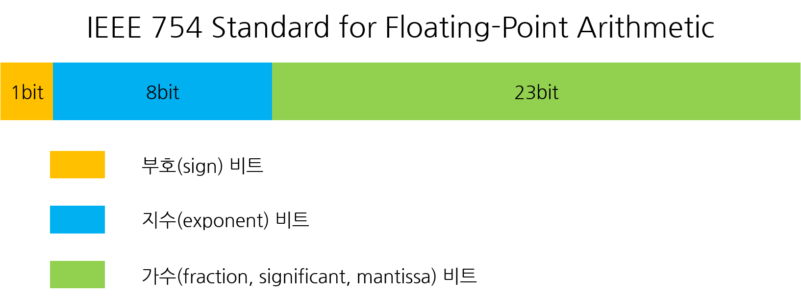

# 안드로이드 및 웹 프레임워크 전문개발자 양성과정
#### 이용섭 강사 ( 010-7242-9424 / argus10@hanmail.net )

### [2019-03-04]
+ 분석 - 설계 - 구현
+ '분석'과 '설계'단계를 완벽하게 구현할 줄 알아야, 구현(코딩)이 원할하다.

#### 1. 과정소개
  + 목표 : "안드로이드 개발 및 프레임워크 개발자 과정"
  + 안드로이드 개발
    - PC : 1.SE(Standard Edition) + 2.Web
    - 스마트폰 : Application
    - "Web + App"를 개발하는 것이 목표.
  + 프레임워크
    - PC에서의 웹 프레임워크를 개발하는 것이 목표.

1. JAVA언어 학습
  + 기본언어의 JAVA를 통해서, 안드로이드를 개발한다.
  + JAVA의 기초를 다지고 다른 언어로 배우는 것이 좋다.
    - "언어 공통요소"학습 : 어떤 언어든지, 공통적인 요소가 있다.
      - '문법' : 기억장소(단일기억장소), 제어구조, 연산자,순차구조, 제어구조, 반복구조... 등
      - '문제풀이능력'
    - "여러개의 값(배열)"학습 : a[]=[10,20,30,40,50];
    - "객체지향 특성"학습 : 클래스, 메서드, 오브젝트
    - "다양한 클래스 라이브러리"학습
    - "네트워크(Network)"학습
    - "데이타베이스(DataBase)"학습

2. Database
  + MS-SQL, mySQL, Oracle.... 기본적인 SQL문법 학습
  + "Oracle 데이터베이스" 학습
  + "Java의 JDBC" 학습

3. Web Program
  + 웹 프로토콜 "http" 학습
  + http에 대한 통신규약, html에 대한 이해 학습
  + "서블릿" + "JSP"에 대한 이해와 학습

4. Android(안드로이드)

5. 프레임워크(FrameWork)
  + 웹 프로그램을 효율적으로 관리하는 학습
  + "Spring" 프로그램을 학습


#### 2. 간단 TEST
----------------------------------------------

### [2019-03-05]
#### 1. Review(Q&A)
#### 2. JAVA 개발환경 설치
  + JDK + Eclipse
  1. "컴파일러"와 "실행기", "디버거", "클래스라이브러리"가 필요하다. -> JDK
  2. GUI의 편리한 환경.... 개발통합환경 -> Eclipse
  3. JDK 8.0설치 후, path지정.
  4. 환경변수 %JAVA_HOME%\bin 추가
  5. 환경변수 JAVA_HOME설정
  6.

#### 3. 컴퓨터의 기본기능과 프로그램
  1. 값들을 저장한다. (a=10)
  2. CPU(중앙처리장치)가 '요리(?)'=ALU 역할.

#### 4. 기억장소
  + 변수, 상수, 객체...

#### 5. 세가지 제어구조(Control Unit의 역할)
  + 순차구조, 선택구조, 반복구조

#### 6. 연산자소개
  + "사칙연산", "비교연산자"

#### 7. 문제풀이연습
#### 8. Summary / Close
------------------------------------------------

### [2019-03-06]
#### 1. Review
  + 프로그램 - 명령어의 모음
    - 기억장소(값=데이터)와 세가지(순차, 선택, 반복...제어문)구조 그리고 연산자만을 사용함

  1. JAVA개발환경설치
    + JDK 1.8 설치
      - 컴파일러(/bin) : javac.exe
      - 실행기(/bin) : java.exe
      - 디버거(/bin) : jdb.exe
      - 압축(/bin) : jre.exe
      - 클래스라이브러리 : `*.jar`
  2. 통합개발환경설치 : Eclipse
  3. 컴퓨터의 기본기능
    1. 입력 : 클래스 라이브러리로 준비되어 있다. System.in.*
    2. 저장 : 기억장소(내부+외부)
    3. 제어 : 순차, 선택, 반복
    4. 연산 : 연산자를 통한 연산작업
    5. 출력 : 클래스 라이브러리로 준비되어 있다. System.out.*
  4. 자료형
    1. 대표자료형
      + 문자열 String = "TEXT"
      + 단수문자 char = 'A'
      + 정수 int = 0.72 ~ -527
      + 실수 double = 0.0, 0.234
      + 논리 boolean = true, false
  5. 변수선언규칙
    + 자료형 변수명[=값];

#### 2. 기억장소(변수사용규칙과 자료형)
  + 자료형
    + 자료형(DataType) = 데이타(값)의 종류를 구분해 놓은 것.
      1. 문자데이터
        + 복수문자(문자열) : "A", "ABC", "전주" - String [""-ok]
        + 단수문자 : 'A', '1', '강' - char [''-error]
      2. 숫자데이터
        + 정수 : 0, -127, 365... int
        + 실수 : 0.0, 3.45... double
      3. 논리데이터
        - 논리 : true, false... boolean

  + 메모리 즉 기억장소에 보관(저장)되고 사용되어지면 '변수'라고 부른다.
  + 저장 위치를 불러오기?
    1. 절대주소 : 메모리상의 절대적주소(address)
    2. 상대주소 : 임의의 기준점으로부터의 상대적주소
    3. 의미화주소 : 변수명으로 사용하는 주소
  + 변수명의 역할
    - 값이 저장된 위치의 별칭. 메모리(값이 저장된) 위치를 식별해주는 역할.
    - 변수명 작성규칙 : 역할에 부합되는 의미있는 명칭을 부여(사용)하자.
      - 변수명은 소문자로 사용하자
      - 한글 풀어쓰기 금지
      - 약어사용 자제
      - 의미있는 단어를 두 글자 이상사용시 대문자 사용 (scoreSum)
  + 변수선언규칙
    - 변수선언
      - 자료형 변수명;
      - 자료형 변수명 = 초기값;
    - 변수정의 : 기억장소가 확보되고 유효값이 저장
      1. 선언만된 변수는 R-Value(값 읽어서 사용하는 표현)로 사용할 수 없다.
      2. 변수가 정의되는 시점은 유효한 값이 최초로 지정될 때이다.
      3. L-Value(값을 변경하는 표현)는 선언된 변수이면, 모두 사용할 수 있다.
      4. 변수를 정의하는 방법
        1. 초기값지정. (int score = 50;)
        2. 치환대입연산자사용. (int score; score = 5;)
        3. 키보드로 입력한것. (System.in ~)
      5. 변수사용
        1.

#### [실습]
  + Eclipse 사용법
    1. 프로그램 전체실행 : Run\Run메뉴 사용
    2. 필요에 따라 1라인씩 디버깅하며 실행 : Run\Debug메뉴 사용
      ... 이때 처음 시작할 위치를 break pointㄹ 지정해야 한다.

  1. 변수와 자료형
    1. 리터럴(literal) : 프로그램 소스값 직접 값이 표현되었을때 리터럴 값이라고 한다
      + "JICA" 문자열 리터럴
      + 'A' 문자 리터럴
      + 100 정수(int) 리터럴
      + 3.14159 실수(double) 리터럴
      + true / false 논리(boolean) 리터럴
    2. 변수(variable) : 프로그램에서 값을 저장하고 사용(읽거나 변경)하는 기억장소
      + 상수(constant) : 값이 저장되어있고, 변경할 수 없는 기억장소
      + 변수명의 역할 : 값이 저장된 위치를 식별하기 위하여 사용자가 지정하는 명칭(의미화주소)
      + 변수명을 지정할때의 관례적 규칙
        - 저장되는 값의 역할에 맞는 의미있는 명칭을 사용하자.
        - 소문자로 작성하는 것을 원칙으로 하되 두 단어 이상을 사용할 때는 두 번째 단어의 첫글자는 대문자로 사용하자.
        - 한글 풀어쓰기 금지.
        - 지나친 약어 사용은 자제하자.
      + 변수의 선언과 정의
        - 변수선언 형식 : 자료형 변수명 [=초기값];
        - 선언 : 시스템 내부에 어떤 종류의 값을 어떤 명칭으로 사용할 것이라고 알려주는 것. 단, 기억장소는 확보되지 않는다. [String name;]
        - 정의 : 기억장소가 확보되고 유효한 값이 최초로 저장되는 것. [name="홍길동"]
          - 변수를 정의하는 3가지 방법
            1. 선언시 초기값 지정
            2. 대입연산자 즉, 치환연산자(=) 사용
            3. 키보드로 입력(READ)
        - 변수 선언시 초기값을 지정하면 변수의 선언과 정의가 동시에 이루어진 것이다. [String name="장길산"]
    3. 변수의 사용시 L-Value, R-Value로 표현
      1. R-Value : 변수에 저장된 값을 읽어오는 표현
```java
      int a, b=10, c;
      System.out.println(b); //b = R-Value
      a = b + 5; //a = L-Value
      if( a > 20 ) {
        실행문장
      }
      a = a + b; // a = 25... R+L-Value 동시에 사용
      c = 100; // 실행문
```
      2. L-Value : 표현식에서 대입연산자 왼쪽에 변수가 나타나는 표현으로 값이 변경된다.
```java
      c = 100;
      c = a + b;
      c = 입력받는 표현식
```
    + 선언만 된 변수는 R-Value로 사용할 수 없다.
    + 반드시 R-Value는 정의된 변수만 사용할 수 있다.
    + 선언된 변수는 언제든지 L-Value로 사용될 수 있다.


  2. 표준입력과 표준출력
    1. 표준 출력 : System.out 객체의 메서드를 사용한다.
```java
    System.out.println(리터럴값이나 변수);
```
    2. 표준 입력 : System.in 객체의 메서드를 사용하면 한글자밖에 입력받지 못하므로 다양한 값을 입력받기 위해 다음의 방법을  사용한다.
```java
    import java.util.Scanner;

    public static void main(String[] args) {
    		String title;
    		int score;
    		double height;
    		char grade;
    		boolean pass;
    		String pass_y;

    		//입력 전용 객체선언 및 생성
    		Scanner scanner = new Scanner(System.in);

        try {
    		System.out.print("성명입력: ");
    		title = scanner.nextLine(); //문자열을 입력받을때 사용

    		System.out.print("점수입력: ");
    		score = scanner.nextInt(); //정수값을 입력받을때 사용

    		System.out.print("몸무게입력: ");
    		height = scanner.nextDouble(); //실수값을 입력받을때 사용

    		scanner.nextLine(); // scanner라인을 지우기
    		System.out.print("학점입력: ");  //true,false등 논리값을 입력받을때 사용
    		grade = scanner.nextLine().charAt(0); //단수문자를 입력받을 때 사용

    		System.out.print("합격여부입력: ");
    		pass = scanner.nextBoolean();
    		if (pass==true) {  //합격여부 true일때, "합격"으로 변환저장.
    			pass_y="합격";
    		}
    		else {
    			pass_y="불합격";
    		}

    		System.out.println(title + "," + score + "," + height + "," + grade + "," + pass_y);
      }
      finally {
        scanner.close();
      }
    	}
    }
```

#### 3. 세가지 제어구조(순차, 선택, 반복)
  1. 순차구조
  - 위에서 아래로/좌에서 우로 차례대로 명령어를 실행한다.
  2. 선택구조
  - 단순선택구조
  - 양자택일(2中1)선택구조
  - 다중선택구조
  3. 반복구조
  - 특정문장을 주어진 조건이 참인 동안 반복 실행
  - for / while

#### 4. 연산자
  1. 산술연산자 : `+, -, *, /, %(나머지연산자)`
  2. 관계연산자 : >, >=, <, <=, ==, !=
  3. 논리연산자 : &&, ||, !|

#### 5. 문제풀이과정
+ 문제제시) 두 정수가 주어졌을때, 큰 수를 출력하고, 두 수의 합계가 100보다 크면 합계를 출력하시오.
```java
int a=5, b=7;
if ( a > b ) {
  System.out.println("큰수 :" + a);
}
else {
  System.out.println("큰수 :" + b);
}

if ( a+b > 100 ) {
  System.out.println("합계 :" + a+b);
}
```
  1. 문제이해
- 최종결과와 결과를 만들기위한 조건을 검토해 본다.

  2. 처리과정
- 큰수결정
- 합께계산
- 합계출력여부결정
- 큰수출력
- 합계출력 or 패스
- 끝

  3. 순서도(플로우차트)
- 기억장소, 세가지 제어구조, 연산자만을 사용하여 수행할 기능을 약속된 기호로 나열한다.

  4. 자바언어로 코딩
- 순서도를 보고 자바코딩을 수행한다.


문제제시) 1~5까지 출력하시오.
  1. 문제이해
- 숫자 값을 가진 변수를 계속 변화시켜 5를 출력
  2. 처리과정
- 숫자가 5보다 작을 동안 반복
  + 숫자출력
  + 숫자증가
  + 끝
  3. 순서도
  4. 코딩
```java
  int number = 1;
  while ( number <= 5 ) {
    System.out.print(a + " ");
    number = number + 1;  // or number += 1
  }
```


#### 6. Summary / Close
  1. 변수선언의 위치가 꼭 상단이어야 하는가?
  2. Scanner 선언 후에...Close함수를 써야하는가? (1.5까지는 필요, 1.7부터는 필요X)

#### [과제]
1. 두 변수만 사용하여 내용값을 교환하라.
```java
  int a = 5;
  int b = 7;

  a = a ^ b;
  b = a ^ b;
  a = a ^ b;

  System.out.println(a+","+b);   // 7,5
```

2. 세 숫자가 주어졌을 때,
  1. 가장 큰수 구하기
```java
    int a=10, b=2, c=5;
    if ( a > b && a > c) {
      System.out.println("가장 큰수 : " + a);
    } else if ( b > a && b > c) {
      System.out.println("가장 큰수 : " + b);
    } else {
      System.out.println("가장 큰수 : " + c);
    }
```

  2. 중간수 구하기
```java
    int a=10, b=2, c=5;
    if ( a > b && a < c) {
      System.out.println("중간수 : " + a);
    } else if ( b > a && b < c) {
      System.out.println("중간수 : " + b);
    } else {
      System.out.println("중간수 : " + c);
    }
```

3. 1~100숫자에서 홀수 합계 구하면 출력
```java
int number = 1;
int sum = 0;

while ( number <= 100 ) {
	if ( number % 2 == 1 ) {
		sum += number;
	}
	number += 1;
}
System.out.print(sum);
```
--------------------------------------------------------------

### [2019-03-07]
#### 1. Review
  + 컴파일러언어 - (번역) Java, c c++
  + 인터프리터언어 - (동시통역) Javasscript

  + 언어 공통적인 문법
    - 자료형과 변수
      - 문자, 숫자(정수+실수) 등의 저장을 변수에.
      - 선언(R-Value)&저장(L-Value)을 통해 사용.
    - 제어문
      - 제어구조(제어문-Control Statement)
      1. 순차구조
      2. 선택구조 - 다중선택
      3. 반복구조 - for, while, do~ while
    - 연산자
      - 산술연산자 : +, - , `*`, /, %
      - 관계연산자 : >, <, >=, <=, ==,!=
      - 논리연산자 : &&, ||, !

#### 2. 기본 자료형과 참조형
  + 변수의 종류
    1. 일반변수 - 기본자료형으로 확보되는 변수
    2. 참조변수 - 배열, 클래스로 만들어진 객체
  + 변수가 선언&정의되면 결정되는 것들
    - 자료형(int), 기억장소크기(4byte), 값의 저장방식(양수:부호비트 절대값/음수:부호비트 2의보수값)
  + 모든 연산은 같은 자료형끼리만 가능하다. 자료형이 다르면 연산이 불가능하다. 하지만, 컴퓨터 내부에서 계산상의 더 큰 자료형으로 변환 후 계산한다. (자동형변환=캐스트연산)


#### [실습]
  + 자료형(Data Type) : 컴퓨터 내부적으로 표현되어지는 값들의 종류를 구분해 놓은 것.
  + 자료형의 종류
    1. 기본자료형(Primitive Data type)

|구분          |크기  |값의 범위                        |값의 저장방식                           |
|:-------------|:----:|:-------------------------------:|:--------------------------------------:|
|정수형 int    |4byte |-2147483648~0~2147483647 약+-21억|양수(부호와절대값), 음수(-와 2의 보수)  |
|실수형 double |8byte |소숫점 15자리까지 정확히 저장    |부호와 지수부 및 가수부로 변환되어 저장 |
|논리형 boolean|1byte |true, false                      |0:false, 1:true                         |
|문자 char     |2byte |0~65535의 값을 표현(Unicode값)   |                                        |



    2. 참조형(Reference Data type)
      - 문자열 String
```java
  int a = 10;    // a라는 장소에 10이 저장
  String name = "홍길동";   // name이라는  이름의 참조값(실제로 저장된 곳)에 저장된다.
```
      - 배열
```java
  int arr[] = {10, 20, 30, 40, 50};  // arr 참조값---> |10 |20 |30 |40 |50 |
```
      - 클래스와 객체
```java
  Scanner scanner = new Scanner(System.in);
  //scanner 참조값---> 키보드입력에 필요한 여러 값들이 저장되어 있음.
```

  + 클래스(class)는 데이터(값)과 메서드(Mathod)로 구성되어 있다.
  + 클래스는 벰버변수(Field)와 Method로 구성되어 있다.
```java
public class Test {
	public static void main(String[] args) {
    swap1();  // 메서드 swap1호출
    swap2();  // 메서드 swap2호출
	}
  public static void swap1() {
    // swap1 내용
  }
  public static void swap2() {
    // swap2 내용
  }
}
```
  + 메서드는 특정기능을 수행하는 명령어들의 모음
  + "static"이라는 구문이 있어야 '객체'없이 동작한다. 없으면, 객체생성해야 함.


#### 3. 선택구조
- 문제) 세 숫자가 주어졌을 때, 가장 큰 수 구하기
  + 1. 문제이해
  + 2. 처리과정
    - 먼저 두 수를 비교하여, 큰수를 찾는다.
    - 나머지 수와 비교하여 큰수 결정. (가장 큰수 결정)
    - 결과를 출력.
  + 3. 순서도 - 구체적인 방법
  + 


#### [실습]
```java
int large; //가장큰수
int num1 = 7, num2 = 29, num3 = 58; //주어진 수

	// 1. 두수를 비교하여 큰 수 결정
	if(num1>num2) {   //num1이 큰수
	//2.나머지수와 비교하여 가장큰수 결정
	 if(num1>num3) {
		   large=num1;
	    }else {
		      large=num3;
	      }
   } else {          //num2이 큰수
			//2.나머지수와 비교하여 가장큰수 결정
		if(num2>num3) {
				large=num2;
		}else {
			large=num3;
		}
	}
		//3.결과출력
	System.out.println(num1+","+num2+","+num3+" 중에서 가장 큰수는 "+large);


//1.두수를 비교하여 큰 수를 결정
if(num1>num2) {
	large=num1;
} else {
	large=num2;
}

//2.큰수(large)와 나머지 수를 비교하여 가장 큰 수 결정
if(large<num3) {
	large=num3;
}

//3.결과출력
System.out.printf("주어진 세수 %d,%d,%d 중에서 가장큰수는 %d입니다.%n",num1,num2,num3,large);


//1.num1이 가장 큰 수인지 판별
if(num1>num2 && num1>num3) {
		large=num1;
} else if(num2>num1 && num2>num3) { //2.num2이 가장 큰 수 인지 판별
		large=num2;
} else {    //나머지는 무조건 num3이 가장 큰 수
		large=num3;
}
//3.결과출력
System.out.printf("%d(은)는 %d %d %d 중에서 가장 큰수입니다.%n",large,num1,num2,num3);
```
```java
//양자택일 if
//다중선택 if (else if문)
if(조건1) {
  조건1을 만족할때 수행할 문장;
}else if(조건2){
  조건2을 만족할때 수행할 문장;
}else if(조건3){
  조건3을 만족할때 수행할 문장;
}else if(조건4){
  조건4을 만족할때 수행할 문장;
}else{
  위의 모든 조건이 거짓일때 수행할 문장;
}
```


#### 4. 반복구조
+ 다른각도로 풀어보자
  - 1.문제이해 : min, middle, max를 정하자.
  - 2.처리과정
    * 주어진 세 수를
    * min < middle < max
      - min > middle이면, 내용교환
      - middle > max이면, 내용교환
    * min, middle, max 출력
  - 3.순서도
  - 

##### [while 반복구문]
```java
public static void minMidMax() {
		int min=29, mid=7, max=58;
		int temp;

		//1. min<mid 그리고 mid<max가 될때까지 반복
		while(min>mid || mid>max) {
			if(min>mid) {
				temp=min;
				min=mid;
				mid=temp;
			}

			if(mid>max) {
				temp=mid;
				mid=max;
				max=temp;				
			}
		}

		//결과출력
		System.out.printf("%d %d %d 순서입니다.%n", min, mid, max);
	}
}
```

+ 반복구조
  - 선체크 반복
    * 규칙적 반복 : for문(빈도가 높음)
    * 불규칙적 반복 : while문(가끔)
  - 후체크 반복 : dowhile문(거의X)

##### [for 반복구문]
+ [for문]
```java
for(반복제어변수 초기화; 반복조건; 반복제어동안 수행작업) {
  수행할 작업;
}
```

+ 증감연산자 : ++, --
+ 결합연산자 : +=, -=, `*=`, /=, %=

```java
int number = 1;
int sum = 0;
for(number=1; number<=100; number+=2) {
			sum += number;
		}
		System.out.printf("1부터 100까지 홀수의 합은 %d입니다.",sum);
```

[반복구조를 표현하는 제어문]
+ 1. 선체크 반복
  - 1) 규칙적 반복 ==> for문
```java
for(반복제어변수초기화; 반복조건; 반복제어변수증감) {
  수행할 기능
}

int sum = 0;
int number;
for(number=1; number<=100; number+=2) {
	sum += number;  //수행할 기능
}
System.out.println("홀수합계 : " + sum);

```
  - 2) 불규칙적 반복 ==> while문
```java
반복제어변수 초기화
while(반복조건) {
  수행할 기능
  반복제어변수증감
}

int sum = 0;
int number;
number=1;   //반복제어변수 초기화
while(number <= 100) { //반복조건
	sum += number;  //수행할 기능
	number +=2;    //반복제어변수 증감
}
System.out.println("홀수합계 : " + sum);
```
+ 2. 후체크 반복 ==> do while문
```java
do{
  반복내용
} while(반복조건);
```

###### [3/7 과제]
+ 성명과 세 점수를 입력받아, 총점과 평균 그리고 학점을 출력하시오. 단, 평균이 90.0이상이면 'A', 80.0이상이면 'B'... 60.0이하이면 'F'. 출력하시오.
+ 1부터 100까지 숫자 중, 3의 배수와 5의 배수를 제외한 홀수의 합계를 계산하여 출력하시오.
+ 1+(1+2)+(1+2+3)+(1+2+3+4)+...+(1+2+3+...+9+10)의 합을 계산하여 출력하시오.
+ 숫자를 입력받아(1~20) 해당 숫자의 Factorial를 계산하시오.


#### 5. 관계연산자와 논리연산자
#### 6. 문제풀이
#### 7. Summary / Close
