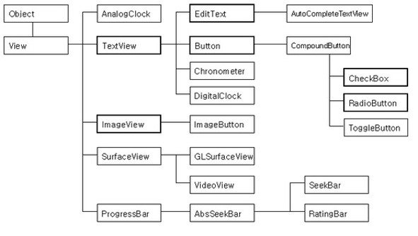
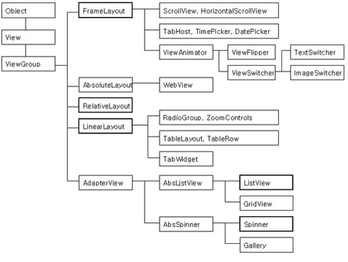

### [2019-06-10]

#### 1. Review
+ Java ----(JDBC)----- Oracle ------- WebProgram(HTML/JavaScript/Savlet/JSP)


#### 2. Android
+ 대부분이 Android Studio를 통한 개발로 이루어짐.

+ Android Studio
  1. Editor + 화면구성(직접개체생성-배치 or 툴사용-개체생성-배치)
  2. 컴파일(Android SDK) ---> 실행도구


##### 2.1. 개발환경설치

0) Java SDK설치

1) 전통적인 방법
```
   Eclipse + plug-in
           + Android SDK(클래스 라이브러리) - 도움말(Reference)
           + AVD(가상기기-시뮬레이터) | 실제기기 
```
2) Android Studio(안드로이드 통합개발환경)
```
   개발자 사이트(http://developer.android.com/studio)
   android-studio-ide-181.5014246-windows.exe 다운받아 실행
   1) tool 자체 필요내용(editor, 디자인도구, 시뮬레이터)
   2) 최신 Android SDK설치 ----> 도움말문서
   3) AVD tool , SDK tool
```
3) 프로젝트 만들기
```
   특이점)Java를 컴파일/실행코드를 만들때 Gradle을 이용하여  Project 관리
```

+ 참고) 안드로이드 버전
```
코드네임                               버전                        내부 build-version
---------------------------------------------------------------------------------------
컵케이크(Cupcake)                      -Android 1.5                API Lavel 3
도넛(Donut)                            -Android 1.6                4
이클레어(프랑스어: Eclair 에클레르[*]) -Android 2.0~2.1            5,6,7
프로요(Froyo, 프로즌 요구르트)         -Android 2.2                8
진저브레드(Gingerbread, 생강빵)        -Android 2.3                ....
허니콤(Honeycomb, 허니콤 토피)         -Android 3.0
아이스크림 샌드위치(Ice Cream Sandwich)-Android 4.0
젤리빈(Jelly Bean)                     -Android 4.1~4.3
킷캣(KitKat)                           -Android 4.4
롤리팝(Lollipop)                       -Android 5.0~5.1
마시멜로(Marshmallow)                  -Android 6.0                23
누가(Nougat)                           -Android 7.0~7.1            24,25
오레오(Oreo)                           -Android 8.0~8.1            26,27
파이(Pie)                              -Android 9.0                28,29

Android Studio를 설치하면 최신  Android SDK, 즉 현재로서는 Android 9.0(API Lavel 29)가 자동 설치된다. 자신의 기기(Device-Phone)에 맞는 SDK Manager를 이용하여 설치하기를 권장한다.
```


+ Android 플랫폼 구조
```
----------------------------------------------------------------------------
0. H/W - CPU(ARM process)
------------------------------
- O/S - Linux 커널계층
- 내부 라이브러리 계층 -- 자바가상머신
- 안드로이드 Framework계층 -- 안드로이드 클래스 라이브러리  <------|
- Application ==> 여기가 우리가 개발할 APP(앱) --------------------|
----------------------------------------------------------------------------

프로젝트 - Application개발
    *.java -------자바컴파일러----------------------------> *.class --|(*.dex 가상머신용)
    *.xml(디자인 tool의 결과물) ----(aapt.exe 컴파일)-----> *.aapt    |*.apk => 실행
    기타 리소스(resource) --------------------------------> 그대로 ---|
```


+ Android의 특징
```
1. 어플리케이션프레임워크제공
   -마법사를 통해 개발프로젝트의 성격에 맞는 기본적인 프레임워크를 제공
   -컴포넌트들의 재활용 및 교체 가능
   -자바 언어를 이용하여 개발

2. Dalvik  가상머신
  -안드로이드용 가상머신, 모바일 장치에 최적화

3. 최적화된 그래픽
   -기본적으로2D 그래픽 라이브러리를 제공한다.
   -OpenGL ES 1.0 스팩에 기반한 3D 그래픽 라이브러리를 제공한다.

4. SQLite
   -데이터를 저장하고 검색하기 위해 SQLite를 사용 한다.
   -일종의 데이터베이스 시스템이다.

5. 미디어 지원
    -오디오, 비디오, 정지 화상 포멧 지원
    -MPEG4,  H.264,  MP3,  AAC,  AMR,  JPG, PNG, GIF 등

6. 기타 지원사항
   -하드웨어 의존적이지만, 다음 항목에 대해 지원 가능하다.
   -GSM 테크놀로지, 블루투스, EDGE, 3G, WiFi, 
     카메라, GPS, 나침반, 가속도계

7. 풍부한 개발환경
   - 디바이스 에뮬레이터, 디버깅 도구, 메모리 및 성능 프로파일링,
      Eclipse IDE
```


##### 2.2. project구조
+ 실제 프로젝트 폴더의 구조와 개발화면의 구조가 다르다.

1. 개발화면에서의 프로젝트 구조
```
  app : 프로젝트 관련 모든 작업내용
        manifests
          AndroidManifest.xml(폰에 현재 프로젝트를 설치할때 현재App에 대한 정보(4대구성요소,권한)를 Android시스템에게 제공)
        
        java(소스 프로그램이 위치)
          com.jica.firstandroid
               Android  App의 4대구성요소에 대한 Java Code
                   1.Activity,
                   2.Broadcast Rreciver,
                   3.Service,
                   4.Contents Provider
        
        res(자바코드에서 사용하는 자원(resource)을 모아 놓은곳) : 주의점(모든화일명은 소문자로만 기술되어야 한다)
          drawable  - 이미지화일 (*.jpg, *.png ... *.xml)
          layout    - Activity의 화면구성을 디자인 tool을 사용했을때 결과물이 저장(xml)
          mipmap    - 런처이미지(스마트폰의 바탕화면에서 App을 식별하는 아이콘)
          values    - 값으로 표현될 내용을 저장해 놓고 Java Code나 layout에서 사용
                      값의 종류(용도)에 따라 화일명이 정해져 있다.

        참고) Java Code에서 res의 자원을 접근할때는 R.리소스종류.리소스식별자
            기타의 장소에서 res의 자원을 접근할때는 @리소스종류.리소스식별자
  
  Gradle Scripts : 프로젝트관리(컴파일/링크/설치/테스트-디버깅)에 필요한 정보를 설정(외부라이브러리 사용시)
      build.gradle(Project:프로젝트명)
      build.gradle(Module:app)

    화면하단의 탭구성 <- App개발도중에 실행중 상태정보 제공하는 창
```


2. 프로젝트를 실행
```
    - AVD( AVD Manager를 이용하여 AVD를 생성)
     - 실제기기( 1. 컴퓨터에서 스마트폰 인식 : 자동인식, 모델번호별 USB 드라이버 설치해서 인식-권장)
                 2. 스마트폰 설정메뉴 - 개발자옵션(없으면 폰정보에 빌드버전을 여러번 클릭) - USB 디버깅 ON )

참고사항) -- UI객체의 사용법
    1. Java Code에서는 생성자, 멤버변수, 메서드(set/get, 일반메서드, ...)
    2. 디자인 tool에서 즉, xml문서에서 접근 ----^
                                                속성(attribute)

```


##### 2.3. 4대 구성요소 (Intent:인텐트..정보교환)
1. Activity
2. Broadcast Receiver
3. Service (Background 기능)
4. Contents Provider


##### 2.4. Activity와 View
+ Activity : 화면구성요소를 관리하는 안드로이드 App의 구성요소
  - 보여지는 모든 화면요소(View)를 관리 : 추가/수정/삭제
  - 화면요소의 기능에 따른 분류
    1) 위젯(wiget) --> 특정 기능을 가졌다.
    2) 레이아웃(layout) --> 특정 기능보다는 구성요소 자체의 위치및 크기설정 즉, 화면배치에 그 기능이 집중된 위젯을 말함.
    *** 화면구성은 먼저 레이아웃을 결정하고,
        레이아웃내부에 위젯을 정해진 방식대로 배치하여 구성한다.


  - 화면구성 방법
    1) Java Code로 작성
    2) 디자인 Tool 사용(*.xml)  ==> 우선 학습내용.
    3) 두 방법을 함께 사용


  - LinearLayout을 이용한 화면구성
    1) 순차적으로(수평,수직) 내부 구성요소를 배치하는 Layout


  - TextView : 문자열을 보여주는 위젯


  - 액티비티에의해 보여지는 모든 구성요소들은 최상위 클래스로 View를 상속받아 작동
```
                             Object
                             View
                                    단일기능위젯(계층구조)
               ViewGroup            TextView, ImageView, Button, EditText, Checkbox,                            RadioButton
                xxxLayout
                ^           AdapterView(여러건의 데이터를 다양하게 관리)
                (복합위젯)      ListView
                                ExpandableListView
                                Spinner
                                GridView

    모든 보여지는 요소의 최상위 클래스는 View 클래스이다.
    View의 속성값은 향후 우리가 학습할 모든 위젯에서 공통적으로 사용하는 속성이된다.
    -------------------------------------------------------------------------------
        Java Code                       Design Tool
        ==================================================
        생성자
        멤버변수     
        set/get메서드  --------------->  xml attribute
        메서드
    -------------------------------------------------------------------------------

```

+ view계층구조


+ viewgroup-layout계층구조



##### 2.5. View의 공통속성
```
View의 속성중 자주 사용하는 속성값들(중요)
=============================================================
멤버변수       (80 ~ 90%)                xml속성
-----------------------------------------------------------------------------
1) id      setId(속성명), getId()       android:id = 속성명       객체식별
2) backtround                           android:background         배경색
                                ----------------------------------------------
                                        색상지정 #AARRGGBB, #RRGGBB
3) width       ?                        android:layout_width       폭
   height      ?                        android:layout_height      크기
                                ----------------------------------------------
                                        1. 부모크기만큼 : MATCH_PARENT
                                        2. 자신의 내용물만큼 : WRAP_CONTENT
                                        3. 값지정 ==> dp(기본), px, dp, sp(글자크기), in, mm, ...

4) padding                              android:padding          경계선과 내용과 여백

5) gravity                              android:gravity           내용물의 위치(여백)
                                    ----------------------------------------------
                                            top         ldft   h_center   right
                                            v_center
                                            bottom
                                            
6) margine                              android:layout_margin    부모뷰or형제뷰 간격

7) layout gravity                       android:layout_gravity   부모뷰에게 자신의 위치!!

8) visibility                           android:visibility       가시성


속성값의 종류
- 자체 속성 : 독단적으로 값을 사용
    JavaCode에서 사용할수 있도록 set/get메서드가 제공된다.

- layout 속성 : 현재의 위젯이 어느 layout의 구성요소가 되느냐에 따라 달라지는 값
    JavaCode에서 set/get메서드 아닌, 별도방법 즉, layoutParam을 사용하여 별도로 설정.
1) text    setText("예제")              android:text = "예제"
```


#### 3. 실습
+ 묻지도 따지지도 말고 교재 35~57page까지만 그대로 실습!!
  + ConstraintLayout을 사용하여 화면 구성
  + 버튼 이벤트처리
  + 안드로이드에 이미 설치되어 있는 웹브라우저호출, 전화걸기 호출기능


#### 4. Summary / Close


-----------------------------------------------------------


### [2019-06-11]

#### 1. Review

#### 2. Activity와 View
+ 버튼에 이벤트를 줄수 있는 3가지 방법


+ MainActivity.java(BookHello_Project)
```java
package com.jica.bookhello;

import androidx.appcompat.app.AppCompatActivity;

import android.content.Intent;
import android.graphics.Color;
import android.net.Uri;
import android.os.Bundle;
import android.util.Log;
import android.view.View;
import android.widget.Button;
import android.widget.LinearLayout;
import android.widget.Toast;

public class MainActivity extends AppCompatActivity implements View.OnClickListener{
    LinearLayout rootLayout;
    Button btnMessage2;
    Button btnMessage3;
    Button btnCallBrowser, btnCallPhone;

    //생성자
    public MainActivity(){
        Log.d("TAG", "BookHello 앱의 MainActivity객체 생성됨!");
    }

    @Override
    protected void onCreate(Bundle savedInstanceState) {
        super.onCreate(savedInstanceState);

        Log.d("TAG","MainActivity::onCreate(Bundle)...");

        //화면구성내용을 resource file에서 가져온다
        //내부적으로 실행되는 내용
        //1) 지정된 layout화일의 모든 내용을 참조하여 객체생성 및 구조결정
        //2) 지정된 layout화일의 root element 객체를 액티비티와 연걸
        setContentView(R.layout.activity_main);

        //참고) tool내에서 생성하는 모든 자원들은 자동으로 식별자를 부여한다.
        //      이러한 식별자들만 정의해 놓는 내부화일 R.java화일이 만들어져서 사용된다.

        //버튼 이벤트 처리방법
        //1) 교재 -- button 리소스의 onClick속성사용(메서드명 작성)
        //2) 일반적인 이벤트 처리 방법 - Java의 AWT방식과 유사


        //UI객체 찿기 - findViewById(id)
        rootLayout = findViewById(R.id.layoutRoot);
        btnMessage2 = findViewById(R.id.btnMessage2);
        btnMessage3 = findViewById(R.id.btnMessage3);
        btnCallBrowser = findViewById(R.id.btnCallBrowser);
        btnCallPhone = findViewById(R.id.btnCallPhone);

        //배경색 바꾸기
        rootLayout.setBackgroundColor(Color.WHITE);

        //두번째 버튼 클릭시 이벤트핸들러 설정 - 방법2)
        //MyOnClickListener btnHandler = new MyOnClickListener();
        //btnMessage2.setOnClickListener(btnHandler);

        btnMessage2.setOnClickListener(new MyOnClickListener());


        //세번째 버큰 클릭시 이벤트핸들러 설정 - 방법3)
        btnMessage3.setOnClickListener(new View.OnClickListener(){

            @Override
            public void onClick(View view) {
                Log.d("TAG","세번째 버튼이 클릭되었습니다");
                Toast.makeText(getApplicationContext(),"세번째 버튼이 클릭되었습니다.", Toast.LENGTH_SHORT).show();
            }
        });

        //브라우저호출,전화걸기 클릭시 이벤트핸들러 설정 - 방법4)
        btnCallBrowser.setOnClickListener(this);
        btnCallPhone.setOnClickListener(this);

    }

    //버튼을 클릭했을때 작동할 메서드 - 방법1)
    public void onButton1Clicked(View view){
        System.out.println("consol 화면에 정보 출력");
        Log.v("TAG","logcat에 정보를 출력 verbose");
        Log.d("TAG","logcat에 정보를 출력 debug");

        //스마트폰 화면에 간단 메세지 출력(잠시나타났다가 사라지는 메서지)--> Toast
        Toast.makeText(this,"버튼이 클릭되었습니다.",Toast.LENGTH_SHORT).show();

    }

    //브라우저호출,전화걸기 버튼클릭시 동작할 이벤트핸들러 메서드 - 방법4)
    @Override
    public void onClick(View view) {
        //어느버튼이 클릭되어서 호출되었는지를 판단하는 방법 2가지
        /* 방법1)
        Button curButtton = (Button)view;
        if(curButtton == btnCallBrowser){
            Log.d("TAG", "웹브라우저 호출버튼이 클릭되었습니다.");
        }else{ //btnCallPhone
            Log.d("TAG", "전화걸기 버튼이 클릭되었습니다.");
        }
        */

        //인자로 전달된 객체의 id값을 구하여 비교--방법2)
        int curId = view.getId();
        Log.d("TAG", "현재 id값 : " + curId);
        if(curId == R.id.btnCallBrowser){
            Log.d("TAG", "웹브라우저 호출버튼이 클릭되었습니다.");

            //실제 웹브라우저(외부) 호출
            //Intent(String action, Uri uri) -- 암시적 인텐트
            Intent intent = new Intent(Intent.ACTION_VIEW, Uri.parse("http://m.naver.com"));
            startActivity(intent);

       }else{ //R.id.btnCallPhone
            Log.d("TAG", "전화걸기 버튼이 클릭되었습니다.");

            //전화걸기 기능 호출
            Intent intent = new Intent(Intent.ACTION_VIEW, Uri.parse("tel:010-7242-9424"));
            startActivity(intent);
        }
    }

    //방법2)
    class MyOnClickListener implements View.OnClickListener{

        @Override
        public void onClick(View view) {
            Log.d("TAG","두번째 버튼이 클릭되었습니다.");

            //외부클래스객체를 지칭할때 : 외부클래스명.this ==> MainActivity.this
            Toast toast = Toast.makeText(getApplicationContext(),"두번째 버튼이 클릭되었습니다.", Toast.LENGTH_SHORT );
            toast.show();
        }
    }
}
```


#### 3. 기본위젯과 배치관리자
1. 배치관리자 -- xxxLayout
   - LinearLayout
   - RelativeLayout
   - FrameLayout
   - TableLayout
   - GridLayout
   - ConstraintLayout

2. 기본위젯(단일기능 위젯)
   - TextView, EditText, Button, ImageView, Checkbox, RadioButton,


+ 실습1)
  + 1. MainActivity에서 다른 Activity를 호출해 보자
  + 2. 현재화면 구성내용을 바꾸어 보자.
  - res폴더에 정의된 식별자를 사용하여 값을 이용할때
    1) Java Code에서 R.color.colorPrimary
    2) res폴더내부에서  @color/colorPrimary 
    - res폴더의 values폴더는 종류에 따라 식별자명=값의 형태로 
      - 문자열(strings.xml), 색상코드(colors.xml), 스타일과 테마(styles.xml)
      - 별도의 파일에 값이 저장된다


##### [오늘의 과제]
+ 수업 후 실습 (교재 70~85 Page)

#### 4. 실습
#### 5. Summary / Close


-----------------------------------------------------------


### [2019-06-12]

#### 1. Review
1. Activity의 생명주기 (생성 -> 사용 -> 소멸)
2. View의 공통속성 -> 위젯(widget)
   1. 자체속성 ..... android:속성명=값
   2. layout속성 ... android:layout.속성명
3. Event처리 방법


#### 2. Activity와 View
##### Activity 생명주기
+ 기본으로 사용하는 AppComatActivity의 상속계층구조
```
javajava.lang.Object
   ↳	android.content.Context
 	   ↳	android.content.ContextWrapper
 	 	   ↳	android.view.ContextThemeWrapper
 	 	 	   ↳	android.app.Activity
 	 	 	 	   ↳	android.support.v4.app.FragmentActivity
 	 	 	 	 	   ↳	android.support.v7.app.AppCompatActivity
```


+ 액티비티 생명주기 관련 메서드들
```
- 생성 ------> 생성자()
             onCreate(Bundle)
             onStart() <-- onRestart()
             onResume()<-| |
                         | |
- 사용자 <---> 활성화    | |
          || onPause() --| |
 강제종료 || onStop() -----|
             onDestroy()
                  |
                소멸(정상소멸-사용자 백버튼 클릭, ProCode-finish())
                        |--> 스마트폰 회전(가로모드, 세로모드)
```


+ onCreate(Bundle) 메서드의 인자로 전달되는 Bundle의 역할
  - 안드로이드 시스템에 의해 액티비티가 소멸되었다가 다시 생성되어야 할때
                            ================
                            1) 회전
                            2) 강제종료

  - 이전의 상태정보를 복구할 목적으로 만들어 놓은 것이다.


+ Bundle객체에 임시 상태정보를 저장하거나
    - 아래의 메서드는 정상 종료시는 작동하지 않는다.
    - 위의 안드로이드 시스템에 의해 액티비티가 소멸되고
    - 다시 생성될 필요가 있을때만 동작한다.
```
    protected void onSaveInstanceState(Bundle outState)
    protected void onRestoreInstanceState(Bundle outState)
```


##### 뷰(View) : 화면에 보여지는 모든 요소(객체)
1) Layout(레이아웃) : 구성요소를 배치하는데 기능이 집중된 View
2) Widget(위젯) : 특정 기능을 수행하는 View


```
Object
    View
        단일기능위젯(계층구조)
        TextView, ImageView, Button, EditText, Checkbox, RadioButton

        ViewGroup
            xxxLayout : 배치관리자
                복합위젯
            AdapterView : 대량의 데이터를 관리하는 복합
                ListView, Gallery, GridView
                    ExpandableListView, Spinner
=======================================================================
    View ------- 기능위젯(TextView, Button)
    상속            실제 화면구성에서 사용하는 관계(포함)
    Viewgroup -- 레이아웃(LinearLayout)
=======================================================================

    모든 View 즉, 위젯들은 자신만의 속성(멤버변수)들을 가지고 있다.
    모든 View가 공통으로 가지고 있는 속성을 상위클래스인 View클래스에 있다.

```


+ View의 속성(xml - attribute, java - 멤버변수)
         ==== 속성의 종류
            1) 자체 속성    android:속성명
            2) layout 속성  android:layout_속성명


1. id : 개체를 식별하는 값
   1. 식별자 : 정수값(자동생성-R.java)-R.id.id명
   2. 사용 : Java code => R.id.id명 / res내부 => @id/id명
   3. Java Code => getId()

2. View의 크기 : 폭, 높이 ==> match_parent, wrap_content, 직접지정(기본단위:dp,..)
   - Java Code에서의 기본단위는 pixel단위이다.
   - layout_width
   - layout_height


+ 참고) res폴더에는 새로운 폴더를 앞으로 만들어 나갈것이다.
  - 아무이름이나 상요하지 않고 미리 정해진 명칭들이 있다.
  - res폴더의 모든 명칭은(폴더명, 파일명)은 소문자이어야 한다.


3. 마진(margin) 속성 : 부모뷰나 형제뷰간의 간격
   - layout_margin
   - layout_marginLeft, layout_marginRight
   - layout_marginTop, layout_marginBottom
   


4. 패딩(padding)속성 : 내용물과 현재뷰의 간격
   - padding
   - paddingLeft, paddingRight
   - paddingTop, paddingBottom


##### 전체영역, 내용물, 여백, padding, margin의 관계
```
```
+ 전체영역에 내용물을 표시하고 남는 공간이 있다면 -- 여백
+ 테두리선과 내용물간의 간격을 설정 -- padding
+ 그리고 남은 공간에서의 내용물의 위치 설정 -- gravity

+ 현재의 위젯과 바깥 즉, 부모위젯이나 형제위젯과의 간격 -- layoutMargin


5. 배경색(background)
   - #AARRGGBB, #RRGGBB, #ARGB, #RGB


##### 자주사용하는 Layout(결론:ConstraintLayout, LinearLayout이 제일 많이 사용)
1. LinearLayout : 순서대로 구성요소(위젯) 배치
2. RelativeLayout : 부모뷰나 형제뷰를 기준으로 구성요소의 위치 결정
3. FrameLayout : 구성요소를 겹쳐서 배치
4. TableLayout : TableRow를 이용하여 행담위로 규격화시켜 배치
5. GridLayout : row, column(엑셀화면-표현식)으로 규격화시켜 배치
--------------------------
5. ConstraintLayout : 부모뷰나 형제뷰를 기준으로 구성요소의 위치결정
                        추가적으로 기준이 되는 요소(가이드라인)를 추가.


##### LinearLayout : 좌-->우, 위-->아래로 순차적으로 위젯을 배치한다.
+ 중요한 속성
    1) orientation  : 방향
    2) gravity      : 내부 내용물 즉, 위젯의 위치설정
    3) baselineAligned : 글자를 내용물로 하는 위젯이 옆으로 배치될때
                        글자의 baseline에 맞추어 위젯의 위치를 자동으로 맞춰준다.
    ----------------------------------------------------
    
    LinearLayout 내부에 존재하는 위젯의 Layout 속성
        1) layout_width, layout_height ---|
        2) layout_margin -----------------| 모든 layout에서 공통사용
        3) layout_weight ---> LinearLayout내부의 위젯에만 존재하는 속성으로
                                화면을 차지할 비중을 지정한다.
                                (1) layout_weight 속성에 값을 지정X- > 원래크기 영역
                                (2) 값을 지정할때 특정위젯 1, 나머지영역 독차지
                                (3) 몇개의 위젯 1, 영역을 공평하게 나눠서 차지.
                                (4) 모든 위젯에 서로다른 값지정, 비율로나눠서 차지.
        4) layout_gravity --> LinearLayout내부의 위젯에만 존재하는 속성
                             부모위젯의 고유배치방식(좌-우,위-아래)에 영향X 영역요청
    --------------------------------------------------
    위의 layout속성들은 set/get 메서드가 존재하지 않으므로
    java code로 객체를 만들때는 특별한 방법을 상요하여 해당 특성ㅇ르 지정해야한다.


##### LinearLayout을 Java Code로 작성하기
  
+ Linear2Activity.java
```java
package com.jica.basicwidget;

import android.graphics.Color;
import android.support.v7.app.AppCompatActivity;
import android.os.Bundle;
import android.widget.Button;
import android.widget.LinearLayout;

public class Linear2Activity extends AppCompatActivity {

    @Override
    protected void onCreate(Bundle savedInstanceState) {
        super.onCreate(savedInstanceState);

        //UI xml파일 전개
        //setContentView(R.layout.activity_linear2);

        //직접 코드로 화면구성
        //1.LinearLayout객체 생성
        LinearLayout linearLayout = new LinearLayout(this);
        linearLayout.setOrientation(LinearLayout.VERTICAL);
        linearLayout.setBackgroundColor(Color.GREEN);

        //2.버튼객체생성
        Button button = new Button(this);
        button.setText("Java Code로 작성");
        button.setTextSize(30);  //pixel
        button.setTextColor(Color.RED);

        //3.버튼을 LinearLayout에 등록
        linearLayout.addView(button);

        //4.LinearLayout을 액티비티에 연결
        setContentView(linearLayout);
    }
}
```


##### [오늘의 과제]
+ ConstraintLayout
+ 별도의 Activity를 만들되 좋아하는 영화배우 프로필 화면 만들기
+ 


#### 3. 실습
#### 4. Summary / Close


-----------------------------------------------------------


### [2019-06-13]

#### 1. Review
+ 데이터 복구
  1) 임시정보
  2) 반영구정보
     1) java file i/o
     2) sharedPreforence -> put(키,값) / getXXX(키)
     3) 데이터베이스(sqlite)


#### 2. 기본위젯과 배치관리자

##### layout속성들을 표현하는 Java class들도 뷰의 계층구조와 유사하게 계층구조를 형성하고 있다.
```
[뷰의 상속계층구조]
Object
    View
        ViewGroup
            LinearLayout

    layout속성을 표현하는 LayoutParams의 상속계층구조
    --------------------------------------------------
    java.lang.Object
   ↳	android.view.ViewGroup.LayoutParams  ----  [layout_height/layout_width]
 	   ↳	android.view.ViewGroup.MarginLayoutParams
                    -- [layout_margin
                        layout_marginBottom	
                        layout_marginLeft
                        layout_marginRight
                        layout_marginTop]
 	 	   ↳	android.widget.LinearLayout.LayoutParams
                    --- [layout_gravity/layout_weight]

```

+ 참고) xml로 화면을 디자인한것은 정적인 화면구성이다.
  + 만일 실행시 화면구성요소에 대한 변화가 필요하다면 (추가/삭제),
  + 코드로 작성해야 한다.


##### 영구정보를 저장하고 사용하는 방법
+ 영구정보 : 정상적으로 액티비티가 종료되었을때 현재의 작업내용(상태정보)이 이후에 다시 액티비티를 실행시켰을때 이용할 수 있도록 영속성을 가지는 정보를 관리하는 것을 말한다.

+ 방법)
  1) java언어 file i/o
  2) SharedPreference 사용 (키-값)
  3) SQLite(데이터베이스)


##### 액티비티 호출시 정보를 전달하거나 작업결과를 되돌려 받는 방법
1. 액티비티 호출시 정보전달
[호출하는 액티비티]
   - Intent 생성
     - Intent intent = new Intent(this, AgumentActivity.class);

   - Intent 객체에 정보 저장 ==> putExtra("키",값);
     - intent.putExtra("title", "기생충");
     - intent.putExtra("poster", R.drawable.prasite);
     - intent.putExtra("actor", "봉준호");
     - intent.putExtra("director", "송강호");

   - 액티비티 호출
     - startActivity(intent);


[호출하는 액티비티] - ArgumentActivity
   - OnCreate(), onResum()메서드에서 정보 얻기
     - Intent intent = getIntent();
   
   - 전달된 인자정보를 intent객체에 getXXXExtra(키,[디폴트값])
     - title = intent.getStringExtra("title");
     - posterId = intent.getIntExtra("poster",-1);
     - actor = intent.getStringExtra("actor");
     - director = intent.getStringExtra("director");
   
   - 인자값을 목적에 맞게 사용


2. 액티비티에 작업한 결과내용을 호출한 액티비티에서 사용하기[내일]


+ Sub3Activity.java
```java
package com.jica.basicwidget;

import android.content.Intent;
import android.support.v7.app.AppCompatActivity;
import android.os.Bundle;
import android.view.View;
import android.widget.RadioGroup;

public class Sub3Activity extends AppCompatActivity {

    RadioGroup grMovie;

    String movieTitles[] = {"알라딘", "기생충", "맨인블랙", "천로역전", "이웃집토토로"};
    int moviePosterIds[] = {R.drawable.aladdin, R.drawable.parasite, R.drawable.meninblack, R.drawable.the_pilgrim, R.drawable.totoro};
    String moviesActors[] = {"메나마수드, 웰 스미스",
            "송강호, 이선균",
            "크리스 헴스워스, 테사 톰슨",
            "폰 라이스 데이비스",
            "토토로"};
    String moviesDirectors[] = {"가이리치", "봉준호", "F.게리 그레이","로버트 페르난데스", "미야자키 하야오"};


    @Override
    protected void onCreate(Bundle savedInstanceState) {
        super.onCreate(savedInstanceState);
        setContentView(R.layout.activity_sub3);

        grMovie = findViewById(R.id.grMovie);
    }

    public void onMovieDetail(View view) {
        int curId = grMovie.getCheckedRadioButtonId();
        int index = 0;
        Intent intent = new Intent(this, AgumentActivity.class);

        //액티비티 호출시 정보를 전달하고 싶다면 Intent의 extra속성에 전달
        switch (curId) {
            case R.id.rbAladdin:
                index = 0;
                break;
            case R.id.rbParasite:
                index = 1;
                break;
            case R.id.rbMeninblack:
                index = 2;
                break;
            case R.id.rbPilgrim:
                index = 3;
                break;
            case R.id.rbTotoro:
                index = 4;
                break;
        }
       intent.putExtra("title", movieTitles[index]);
       intent.putExtra("poster", moviePosterIds[index]);
       intent.putExtra("actor", moviesActors[index]);
       intent.putExtra("director", moviesDirectors[index]);
       startActivity(intent);
    }
}
```

+ AgumentActivity.java
```java
package com.jica.basicwidget;

import android.content.Intent;
import android.support.v7.app.AppCompatActivity;
import android.os.Bundle;
import android.widget.ImageView;
import android.widget.TextView;

public class AgumentActivity extends AppCompatActivity {
    //UI객체
    TextView tvtitle, tvActor, tvDirector;
    ImageView ivPoster;

    //UI객체에 내용값 - 호출될때 인자로 전달됨
    String title, actor, director;
    int posterId;

    @Override
    protected void onCreate(Bundle savedInstanceState) {
        super.onCreate(savedInstanceState);

        //UI xml 전개
        setContentView(R.layout.activity_agument);

        //UI객체 참조값 얻기
        tvtitle = findViewById(R.id.tvTitle);
        ivPoster = findViewById(R.id.ivPoster);
        tvActor = findViewById(R.id.tvActors);
        tvDirector = findViewById(R.id.tvDirector);

        //현재의 액티비티가 호출될때 전달한 인자값 얻기
        Intent intent = getIntent();
       Intent intent;

       title = intent.getStringExtra("title");
       posterId = intent.getIntExtra("poster",-1);
       actor = intent.getStringExtra("actor");
       director = intent.getStringExtra("director");

        tvtitle.setText(title);
        ivPoster.setImageResource(posterId);
        tvActor.setText(actor);
        tvDirector.setText(director);
    }
}
```


##### [오늘의 과제]
+ 액티비티 호출시, putExtra에 사용자가 만든 객체를 전달할 수 있는 방법
+ MovieInfo 객체를 넘겨주는 방법 찾기~!!!
```
public class MovieInfo implements Serializable {
    private String title;
    private int posterId;
    private String actor;
    private String director;

    public MovieInfo() {
    }
}
//////////////////////////////////////
MovieInfo m = new MovieInfo();
intent.putExtra("info", m);
/////////////////////////////////////
intent.getStringExtra("info");
```
+ 현재 예제의 MainActivity와 ScrollView을 사용하여 메뉴항목이 늘어나 보이도록 변경.


##### RelativeLayout(상대레이아웃)
+ 부모뷰나 형제뷰를 기준으로 현재뷰(위젯)의 위치를 설정한다.
```
java.lang.Object
   ↳	android.view.View
 	   ↳	android.view.ViewGroup
 	 	   ↳	android.widget.RelativeLayout


android:layout_above	
android:layout_alignBaseline
android:layout_alignBottom	
android:layout_alignEnd	
android:layout_alignLeft
android:layout_alignParentBottom	
android:layout_alignParentEnd	
android:layout_alignParentLeft	
android:layout_alignParentRight	
android:layout_alignParentStart	
android:layout_alignParentTop	
android:layout_alignRight	
android:layout_alignStart	
android:layout_alignTop	
android:layout_alignWithParentIfMissing	
android:layout_below	
android:layout_centerHorizontal	
android:layout_centerInParent	
android:layout_centerVertical	
android:layout_toEndOf	
android:layout_toLeftOf	
android:layout_toRightOf
android:layout_toStartOf


java.lang.Object
   ↳	android.view.ViewGroup.LayoutParams
 	   ↳	android.view.ViewGroup.MarginLayoutParams
 	 	   ↳	android.widget.RelativeLayout.LayoutParams

```


##### TableLayout : 행단위(TableRow)의 위젯배치
```
java.lang.Object
   ↳	android.view.View
 	   ↳	android.view.ViewGroup
 	 	   ↳	android.widget.LinearLayout
 	 	 	   ↳	android.widget.TableLayout


java.lang.Object
   ↳	android.view.ViewGroup.LayoutParams
 	   ↳	android.view.ViewGroup.MarginLayoutParams
 	 	   ↳	android.widget.LinearLayout.LayoutParams
 	 	 	   ↳	android.widget.TableLayout.LayoutParams


 java.lang.Object
↳	android.view.ViewGroup.LayoutParams
  ↳	android.view.ViewGroup.MarginLayoutParams
	   ↳	android.widget.LinearLayout.LayoutParams
            ↳	android.widget.TableLayout.LayoutParams   layout_span, layout_column
```


+ TableLayout에서 중요속성(셀을 확장하거나, 합치는 속성)
  - 여분의 공간이 있으면 몇번째 셀이 나머지공간을 차지하라는 설정
    - android:stretchColumns="0,1,2"
  - 공간이 부족할때 특정컬럼을 자동으로 축소하라는 설정
    - android:shrinkColoumns
  - TableLayout내부의 layout속성
    - android:layout_span --------- 현재위젯의 폭을 확장
    - android:layout_column ------- 현재위젯을 몇번째 


#### 3. 실습
#### 4. Summary / Close


-----------------------------------------------------------


### [2019-06-14]

#### 1. Review

#### 2. Activity 호출 (정보받기)
##### 액티비티 호출시 정보를 전달하거나 작업결과를 되돌려 받는 방법
1. 액티비티 호출시 정보전달
[호출하는 액티비티]
   - Intent 생성
     - Intent intent = new Intent(this, AgumentActivity.class);

   - Intent 객체에 정보 저장 ==> putExtra("키",값);
     - intent.putExtra("title", "기생충");
     - intent.putExtra("poster", R.drawable.prasite);
     - intent.putExtra("actor", "봉준호");
     - intent.putExtra("director", "송강호");

   - 액티비티 호출
     - startActivity(intent);


[호출하는 액티비티] - ArgumentActivity
   - OnCreate(), onResum()메서드에서 정보 얻기
     - Intent intent = getIntent();
   
   - 전달된 인자정보를 intent객체에 getXXXExtra(키,[디폴트값])
     - title = intent.getStringExtra("title");
     - posterId = intent.getIntExtra("poster",-1);
     - actor = intent.getStringExtra("actor");
     - director = intent.getStringExtra("director");
   
   - 인자값을 목적에 맞게 사용


1. 액티비티에 작업한 결과내용을 호출한 액티비티에서 사용하기
```
        Sub4Activity  ------------------------->  InputActivity
                                                 성명, 나이, 점수 입력
성명, 나이, 점수 사용  <------------------------
``` 
```
    1) 액티비티 호출시
        - startActivityForResult(Intent객체);
    2) InputActivity에서 작업후 자신이 
        - Intent객체를 생성하여 정보를 저장
        - setResult(Intent객체, 결과코드)
        - finish();
    3) @Overrride
       onActivityResult(int 요청코드, int 결과코드, Intent 객체) {
           .... Intent객체로부터 정보 추출 사용           
       }
```


+ 위의 액티비티 호출관련 내용은.... 교재 246 ~ 260 Page 
+ Inttent에 대한 상세 설명......... 교재 280 Page ~


#### 3. FrameLayout : 내부구성요소들을 겹쳐서 보여준다.
+ 그대로 사용할때는 의미가 없다.
    - 내부 구성요소의 Visibility 속성을 사용하여 1개의 구성요소만 보이게하고
    - 나머지 구성요소는 보이지 않도록 하는 방법으로 응용한다.
```
java.lang.Object
   ↳	android.view.View
 	   ↳	android.view.ViewGroup
 	 	   ↳	android.widget.FrameLayout


java.lang.Object
   ↳	android.view.ViewGroup.LayoutParams              layout_width, layout_height
 	   ↳	android.view.ViewGroup.MarginLayoutParams    layout_margin,....
 	 	   ↳	android.widget.FrameLayout.LayoutParams  layout_gravity

```


+ 참고) 현재의 Project에 사용자가 추가한 이미지는
    - R.drawable.이미지식별자
    - 안드로이드 플랫폼 자체에서 내장하여 제공하는 자원(Resource)
        - android.R.자원종류.식별자
        - 자바코드에서 --> android.R.drawable.이미지식별자
        - res 내부에서 --> @android:drawable/식별자
    - 실제로 존재하는 장소는?
        - C:\Users\사용자명\AppData\Local\Android\res


#### 4. Layout전개
+ Inflation(전개) : xml로 화면의 일부내용만을 디자인 해놓고, 프로그램이 작동중에 화면내용이 필요한 시점에서 xml를 전개(inflation)시켜 현재화면에 반영하여 사용하는 것.
    - 원래는 Java Code로 UI객체를 생성, 속성설정, 화면연결(Activity연결)해서 사용.
    - 이는 너무 복잡하기때문에 손쉽게 xml로 미리 만들어 놓았다가 사용하기위함.

```
onCreate(Bundle si){
  super.onCreate(si);

  setContenView(R.layout.activity_main); ---->1) inflation
                                              2) Activity에 연결
}
```

+ Inflation은 LinearLayout일때가 가장 사용하기 손쉽다.


```
1) LayoutInflator 구하기
    (1) LayoutInflater layoutInflater
                       = (LayoutInflater)getSystemService(Context.LAYOUT_INFLATER_SERVICE);
    (2) View.inflate()메서드를 사용할 것이므로
        LayoutInflater를 구하지 않는다.
    (3) LayoutInflater layoutInflater = getLayoutInflater();


2) 전개(inflate)
   LinearLayout webToonLinearLayout =
                   (LinearLayout)LinelayoutInflater.inflate(R.layout.weebtoon, rootLinearLayout, false);
                            -----------------  ----------------  -----
                            전개할 xml화일      전개후 연결시킬    연결여부
                                               부모뷰
                View.inflate(

3) 전개된 객체들의 상태값을 원하는 내용으로 변경
   TextView tvTitle = webToonLinearLayout.findViewById(R.id.xxx)
   tvTitle.setTitle("제목");
   ...

4) 화면 UI반영
   루트layout객체.addView(webToonLinearLayout)
```


#### 5. 실습
#### 6. Summary / Close


-----------------------------------------------------------


### [2019-06-17]

#### 1. Review

#### 2. 토스트와 대화상자
1. 토스트(toast) : 간단한 알림메세지
    - 잠시 나타났다가 사라진다.
    - 기본 모양과 위치가 정해져 있다.
    - 모양과 위치 변경이 가능하다.


2. 외부라이브러리로 스낵바를 사용하여 기능을 대체할 수 있다.
    - 디자인 라이브러리를 프로젝트에 추가해야 한다.


+ BookToastActivity.java
```java
package com.jica.dialogactionbar;

import android.content.Context;
import android.os.Bundle;
import android.support.design.widget.Snackbar;
import android.support.v7.app.AppCompatActivity;
import android.view.Gravity;
import android.view.LayoutInflater;
import android.view.View;
import android.view.ViewGroup;
import android.widget.EditText;
import android.widget.TextView;
import android.widget.Toast;

public class BookToastActivity extends AppCompatActivity {
    EditText editText;
    EditText editText2;

    @Override
    protected void onCreate(Bundle savedInstanceState) {
        super.onCreate(savedInstanceState);

        //UI xml 전개
        setContentView(R.layout.activity_book_toast);

        //UI 객체얻기
        editText = findViewById(R.id.editText);
        editText2 = findViewById(R.id.editText2);
    }

    public void onButtonTosat(View view) {
        Toast.makeText(this,"기본 토스트입니다.",Toast.LENGTH_SHORT).show();
        //기본토스트에 내부적으로 설정된 위치값
        //setGravity(Gravity.CENTER_HORIZONTAL|Gravity.BOTTOM, 0, -100);
    }

    public void onButton1Clicked(View v) {
        try {
            Toast toastView = Toast.makeText(this, "위치가 바뀐 토스트 메시지입니다.", Toast.LENGTH_LONG);

            //x,y 위치값을 입력하지 않으면 아래 코드에서 예외가 발생하므로 아무일도 하지 않는다.
            int xOffset = Integer.parseInt(editText.getText().toString());
            int yOffset = Integer.parseInt(editText2.getText().toString());

            //토스트의 위치를 변경시킨다.
            toastView.setGravity(Gravity.TOP | Gravity.TOP, xOffset, yOffset);

            toastView.show();
        } catch (NumberFormatException e) {
            e.printStackTrace();
        }
    }

    public void onButton2Clicked(View v) {
        //LayoutInflater 구하기
//        LayoutInflater layoutInflater
//                = (LayoutInflater)getSystemService(Context.LAYOUT_INFLATER_SERVICE);
        LayoutInflater inflater = getLayoutInflater();

        //방법2
        View layout = inflater.inflate(
                R.layout.toastborder,
                (ViewGroup) findViewById(R.id.toast_layout_root));

        TextView text = layout.findViewById(R.id.text);

        //시스템 내부의 토스트 객체를 사용하지 않고 직접 Toast생성
        Toast toast = new Toast(this);
        text.setText("모양 바꾼 토스트");   //토스트에 의해 보여질 내용
        toast.setView(layout);           //토스트와 뷰 연결

        //토스트의 위치설정정
       toast.setGravity(Gravity.CENTER, 0, -100);
        toast.setDuration(Toast.LENGTH_SHORT);

        toast.show();

    }

    public void onButton3Clicked(View v) {
        Snackbar.make(v, "스낵바입니다.", Snackbar.LENGTH_LONG).show();
    }
}
```

```
토스트나 스낵바는 잠시 나왔다가 사라진다. 즉 사용자의 확인을 100% 보장할 수 없다.
중요한 정보에 대한 사용자의 확인이나 추가적인 데이터의 입력이 필요할때, 대화상자(Dialog)를 사용한다.

일반적인 사용법은 Java AWT의 Dialog와 비슷하지만(모달대화상자),
기본적인 작동구조가 Modalless이다.
```


+ 대화상자 
    - 아이콘 + 제목 + 메세지 내용 + 버튼

+ Android Dialog는...
    - 제목 + 메세지 내용만 제공.... 거의 쓸모가 없다.
    
+ Android AlertDialog를 사용한다.
    - 직접생성
    - AlertDialog.Builder로 생성(권장)
    - 버튼은 기본 3가지 제공
        1. 기본버튼
        2. 긍정버튼
        3. 부정버튼


+ 목록대화상자
    - setMassage(String)에 의한 문자내용을 확인
    
    - setItems(목록)를 사용하여 목록에서 항목을 선택하게 한다.
    - setSingleItems()
    - setMultiItems() 를 사용하여 목록에서 항목을 선택하게 한다.
    
    - setView(사용자화면) -- 사용자가 선택하거나 입력하도록 자유롭게 화면설계.


+ AlertDialogActivity.java
```java
package com.jica.dialogactionbar;

import android.app.AlertDialog;
import android.app.Dialog;
import android.content.DialogInterface;
import android.content.res.Resources;
import android.support.v7.app.AppCompatActivity;
import android.os.Bundle;
import android.util.Log;
import android.view.View;
import android.widget.CheckBox;
import android.widget.EditText;
import android.widget.LinearLayout;
import android.widget.TextView;
import android.widget.Toast;

public class AlertDialogActivity extends AppCompatActivity {
    String foods[] = {"짜장면", "짬뽕", "탕수육", "우동"};
    int mSelect = 0;
    boolean mSelects[] = {false,true,false,false};

    @Override
    protected void onCreate(Bundle savedInstanceState) {
        super.onCreate(savedInstanceState);

        //UI xml 전개
        setContentView(R.layout.activity_alert_dialog);

    }

    public void onDialog(View view) {
        Dialog dialog = new Dialog(this);

        //대화상자의 메시지 - 내용물을 사용자가 직접 생성
        TextView tvMessage = new TextView(this);
        tvMessage.setText("대화상자 메세지입니다.");
        dialog.setContentView(tvMessage);

        //대화상자 제목
        dialog.setTitle("대화상자 제목");

        //아이콘이나 버튼을 추가하는 기능이 없다.

        //대화상자 보이기
        dialog.show();

        //이후 대화상자는 대화상자이외의 화면영역을 터치하거나
        //백 버튼을 누르면 사라진다.
    }

    public void onAlertDialog(View view){
        AlertDialog.Builder builder = new AlertDialog.Builder(this);
        builder.setTitle("AlertDialog");
        builder.setIcon(android.R.drawable.btn_star);
        builder.setMessage("AlertDialog입니다.");

        //버튼은 3가지 형태가 제공된다.
        //기본버튼, 긍정버튼, 부정버튼
        builder.setNeutralButton("기본버튼",null);

        //대화상자의 버튼 클릭시만 대화상자가 종료하도록 설정
        builder.setCancelable(false);

        //Dialog 객체 생성하면서 Builder 삽입.
        AlertDialog dialog = builder.create();

        //대화상자 보이기
        dialog.show();
    }

    public void onAlertDialog2(View view){
        AlertDialog.Builder builder = new AlertDialog.Builder(this)
                .setTitle("AlertDialog")
                .setIcon(android.R.drawable.btn_star)
                .setMessage("AlertDialog입니다.")

        //버튼은 3가지 형태가 제공된다.
        //기본버튼, 긍정버튼, 부정버튼
                .setNeutralButton("기본버튼",null)
                .setPositiveButton("긍정버튼", null)
                .setNegativeButton("부정버튼",null)

        //대화상자의 버튼 클릭시만 대화상자가 종료하도록 설정
                .setCancelable(false);

        //Dialog 객체 생성하면서 Builder 삽입.
        AlertDialog dialog = builder.create();

        //대화상자 보이기
        dialog.show();

        //Java에서는 대화상자가 보이면 이곳 즉, 이후의 코드는 실행되지 않는
        //모달 대화상자였다. 안드로이드는 그렇지 않다.
        //여기의 코드가 실행된다.
        Log.d("TAG","안드로이드의 대화상자는 모달리스 입니다.");
    }


    public void onAlertDialog3(View view){
        AlertDialog.Builder builder = new AlertDialog.Builder(this)
                .setTitle("AlertDialog")
                .setIcon(android.R.drawable.btn_star)
                .setMessage("버튼의 이벤트핸들러 작성법입니다.")

                //버튼은 3가지 형태가 제공된다.
                //기본버튼, 긍정버튼, 부정버튼
                .setNeutralButton("확인", new DialogInterface.OnClickListener() {
                    @Override
                    public void onClick(DialogInterface dialog, int which) {
                        Toast.makeText(getApplicationContext(),"대화상자에서 '확인'을 클릭했습니다.",Toast.LENGTH_SHORT).show();
                    }
                })
                .setPositiveButton("예", new DialogInterface.OnClickListener() {
                    @Override
                    public void onClick(DialogInterface dialog, int which) {
                        Toast.makeText(getApplicationContext(),"대화상자에서 '예'를 클릭했습니다.",Toast.LENGTH_SHORT).show();
                    }
                })
                .setNegativeButton("아니오", new DialogInterface.OnClickListener() {
                    @Override
                    public void onClick(DialogInterface dialog, int which) {
                        Toast.makeText(getApplicationContext(),"대화상자에서 '아니오'를 클릭했습니다.",Toast.LENGTH_SHORT).show();
                    }
                })

                //대화상자의 버튼 클릭시만 대화상자가 종료하도록 설정
                .setCancelable(false);

        //Dialog 객체 생성하면서 Builder 삽입.
        AlertDialog dialog = builder.create();

        //대화상자 보이기
        dialog.show();

        //Java에서는 대화상자가 보이면 이곳 즉, 이후의 코드는 실행되지 않는
        //모달 대화상자였다. 안드로이드는 그렇지 않다.
        //여기의 코드가 실행된다.
        Log.d("TAG","안드로이드의 대화상자는 모달리스 입니다.");
    }

    public void onDoSomething(View view) {
        //어떤 기능을 수행
        try {
            Thread.sleep(3000);
        } catch (InterruptedException e) {
            e.printStackTrace();
        }
        boolean isError = true;
        if (isError) {
            new AlertDialog.Builder(this)
                    .setTitle("Error 발생")
                    .setMessage("에러메세지를 상세히 설명.... 종료합니다.")
                    .setCancelable(false)
                    .setPositiveButton("종료", new DialogInterface.OnClickListener() {
                        @Override
                        public void onClick(DialogInterface dialog, int which) {
                            finish();   //현재 액티비티 종료
                        }
                    })
                    .show();

        } else {
            Toast.makeText(this,"정삭적으로 작업을 마침!",Toast.LENGTH_SHORT).show();
        }

    }

    //목록대화상자/선택대화상자
    //사용자정의 대화상자

    public void onItemDialog (View view){
        AlertDialog.Builder builder = new AlertDialog.Builder(this);

        builder.setTitle("음식을 선택하세요");
        builder.setIcon(android.R.drawable.btn_plus);
        /*
        builder.setItems(foods, new DialogInterface.OnClickListener() {
            //목록 중 하나를 선택했을때의 이벤트 처리
            @Override
            public void onClick(DialogInterface dialog, int i) {
                //---선택한 항목의 목록 순서                 --
                String curItem = foods[i];
                Toast.makeText(getApplicationContext(),curItem+"을 선택했습니다.",Toast.LENGTH_SHORT).show();
            }
        });
        */

        builder.setItems(R.array.foods, new DialogInterface.OnClickListener() {
            @Override
            public void onClick(DialogInterface dialog, int i) {
                //res/values/arrays.xml내용중 foods배열 내용 가져오기
                Resources res = getResources();
                String foods[] = res.getStringArray(R.array.foods);
                String curItem = foods[i];
                Toast.makeText(getApplicationContext(),curItem+"을 선택했습니다.",Toast.LENGTH_SHORT).show();
            }
        });
        builder.setNegativeButton("취  소",null);

        AlertDialog alertDialog = builder.create();
        alertDialog.show();
    }

    public void onSingleDialog (View view){
        AlertDialog.Builder builder = new AlertDialog.Builder(this);

        builder.setTitle("음식을 선택하세요");
        builder.setIcon(android.R.drawable.btn_plus);

        //항목선택시 대화상자가 종료하지 않는다.
        builder.setSingleChoiceItems(foods, -1, new DialogInterface.OnClickListener() {
            @Override
            public void onClick(DialogInterface dialog, int i) {
                //---선택한 항목의 목록 순서                 --
                mSelect = i;
            }
        });

        builder.setPositiveButton("확  인", new DialogInterface.OnClickListener() {
            @Override
            public void onClick(DialogInterface dialog, int which) {
                Toast.makeText(getApplicationContext(),"최종적으로 선택한 항목은"+foods[mSelect]+"입니다.",Toast.LENGTH_SHORT).show();
                finish();
            }
        });

        builder.setNegativeButton("취  소",null);

        AlertDialog alertDialog = builder.create();
        alertDialog.show();
    }

    public void onMultiDialog (View view){
        AlertDialog.Builder builder = new AlertDialog.Builder(this);

        builder.setTitle("음식을 선택하세요");
        builder.setIcon(android.R.drawable.btn_plus);

        //항목선택시 대화상자가 종료하지 않는다.
        builder.setMultiChoiceItems(foods, mSelects, new DialogInterface.OnMultiChoiceClickListener() {
            @Override
            public void onClick(DialogInterface dialog, int i, boolean isChecked) {
                mSelects[i] = isChecked;
            }
        });

        builder.setPositiveButton("확  인", new DialogInterface.OnClickListener() {
            @Override
            public void onClick(DialogInterface dialog, int which) {
                String str = "";
                for (int pos=0; pos<mSelects.length; pos++){
                    if (mSelects[pos]){
                        str += foods[pos]+" ";
                    }
                }
                Toast.makeText(getApplicationContext(), "최종적으로 선택한 항목은" + str + "입니다.", Toast.LENGTH_SHORT).show();
                finish();
            }
        });

        builder.setNegativeButton("취  소",null);

        AlertDialog alertDialog = builder.create();
        alertDialog.show();
    }

    public void onUserDialog(View view){
        AlertDialog.Builder builder = new AlertDialog.Builder(this);

        builder.setTitle("상품정보를 입력하세요")
                .setIcon(R.mipmap.ic_launcher);


        //대화상자에 보여질 xml전개
        final LinearLayout linearLayout = (LinearLayout)View.inflate(getApplicationContext(),R.layout.dialog_product,null);

        //대화상자에 연결
        builder.setView(linearLayout);
//        builder.setView(R.layout.dialog_product);
        builder.setPositiveButton("확 인", new DialogInterface.OnClickListener() {
            @Override
            public void onClick(DialogInterface dialog, int which) {
                EditText etProductName = linearLayout.findViewById(R.id.etProductName);
                EditText etProductValue = linearLayout.findViewById(R.id.etProductValue);
                CheckBox cbPayMent = linearLayout.findViewById(R.id.cbPayment);

                String productName = etProductName.getText().toString();
                int productQuantity = 0;
                try{
                    productQuantity = Integer.parseInt(etProductValue.getText().toString());
                }catch (Exception e) {
                    //토스트/아무일도 하지 않음.
                    return;
                }

                String payment = (cbPayMent.isChecked() ? "착불결제" : "선결제");

                String message = "구입 물건 정보 : "+productName+", 품목 : "+productQuantity+", 결제정보 : "+payment;
                Toast.makeText(getApplicationContext(),message,Toast.LENGTH_SHORT).show();
            }
        });
        builder.setNegativeButton("취 소", new DialogInterface.OnClickListener() {
            @Override
            public void onClick(DialogInterface dialog, int which) {
                Toast.makeText(getApplicationContext(),"주문을 취소하였습니다.",Toast.LENGTH_SHORT).show();
            }
        });

        AlertDialog alertDialog = builder.create();
        alertDialog.show();
    }
}
```


#### 3. AdapterView
1. 어댑터뷰(AdapterView)
    - AdapterView의 상속계층구조
```
Object
    View
        ViewGroup
            AdapterView
                ...
                ListView, Spinner, GridView
                    ExpandableListView
                RecyclerView
```

    - 주로 대용량의 데이터를 화면 스크롤을 통해 사용자에게 제공(선택)한다.
```
    ListView -- 여러항목을 관리
    항목뷰1  |
    항목뷰2  |<------>  Adapter[중계역할]  <-------->  원본데이터
    항목뷰3  |
    ...
    항목뷰n
```


#### 4. 실습
#### 5. Summary / Close


-----------------------------------------------------------


### [2019-06-18]

#### 1. Review

#### 2. 커스텀 ListView만들기
1. 리스트뷰에 보여지는 항목뷰가 단순한 문자열이 아니라, 복잡한 형태의 다양한 정보를 제공한다면... 아래의 작업절차에 따라 '커스텀리스트뷰'를 구현한다.
   1. 항목뷰를 별도의 layout파일로 작성
   2. 어댑터 생성 ==> 위의 항목뷰에 데이터를 연동시켜야 하므로
      class MyAdapter extends BaseAdapter{
          @Override
          BaseAdapter의 추상(abstract)메서드 재정의
      }
   3. 커스텀 클래스 - 1건의 데이터정보

참고) 특정클래스의 메서드가 사용자에 의해 호출되는 것이 아니라, 내부적인 작동구조에 의해 시스템에 의해 호출되는 메서드를 callback(콜백) 메서드라고 부른다.


+ ListViewExamActivity.java
```java
package com.jica.adapterview;

import android.graphics.Color;
import android.graphics.drawable.ColorDrawable;
import android.support.v7.app.AppCompatActivity;
import android.os.Bundle;
import android.util.Log;
import android.view.View;
import android.widget.AdapterView;
import android.widget.ArrayAdapter;
import android.widget.Button;
import android.widget.EditText;
import android.widget.ListView;
import android.widget.TextView;
import android.widget.Toast;

import java.util.ArrayList;

public class ListViewExamActivity extends AppCompatActivity {
    //UI 객체
    ListView listView;
    //원본데이터
    ArrayList<String> data;
    //ListView와 원본 데이터를 연동시키는 어댑터
    ArrayAdapter<String> adapter;

    Button btnAdd, btnRemove;
    EditText itemName;

    @Override
    protected void onCreate(Bundle savedInstanceState) {
        super.onCreate(savedInstanceState);

        //UI xml 전개
        setContentView(R.layout.activity_list_view_exam);

        //UI 객체 참조값 얻기
        listView = findViewById(R.id.listView);
        btnAdd = findViewById(R.id.btnAdd);
        btnRemove = findViewById(R.id.btnRemove);
        itemName = findViewById(R.id.etItemName);

        //원본 데이터 만들기
        data = new ArrayList<String>();
        data.add("고조선");
        data.add("부여");
        data.add("옥저");
        data.add("동예");
        data.add("고구려");

        //어댑터 생성(1.항목뷰UI
        adapter = new ArrayAdapter<String>(this,
                                            android.R.layout.simple_list_item_1,
                                            data);

        //res/arrays/array_string사용할수도 있다.
//        final ArrayAdapter<CharSequence> adapter = ArrayAdapter.createFromResource(this,
//                                                    R.array.country,
//                                                    android.R.layout.simple_list_item_1);

        //ListView에 어댑터 설정
        listView.setAdapter(adapter);

        //ListView의 메서드 사용
        listView.setDivider(new ColorDrawable(Color.RED));
        listView.setDividerHeight(2);

        //ListView의 항목뷰를 클릭했을때의 이벤트 핸들러
        listView.setOnItemClickListener(new AdapterView.OnItemClickListener() {
            @Override
            public void onItemClick(AdapterView<?> adapterView, View view, int position, long id) {
                Toast.makeText(getApplicationContext(),position+" 번째 항목을 클릭했습니다.",Toast.LENGTH_SHORT).show();
                Log.d("TAG","클릭한 항목명 : "+data.get(position));
                TextView textView = (TextView)view;
                String item = textView.getText().toString();
                Log.d("TAG","클릭한 항목명 : "+item);

                ListView curListView = (ListView)adapterView;
                int itemCount = curListView.getChildCount();
                Log.d("TAG","현재 ListView의 항목 갯수 : "+itemCount);
            }
        });

        //버튼 클릭시 항목 추가
        btnAdd.setOnClickListener(new View.OnClickListener() {
            @Override
            public void onClick(View v) {
                String item = itemName.getText().toString();

                //원본 데이터에 항목추가
                data.add(item);

                //adapter에게 원본 항목에 변화가 생겼으므로 이를 ListView에 반영하도록 한다.
                adapter.notifyDataSetChanged();

                //text항목 리셋
                itemName.setText("");

                Toast.makeText(getApplicationContext(),item+" 항목이 추가되었습니다.",Toast.LENGTH_SHORT).show();
            }
        });

        //버튼 클릭시 항목 삭제
        btnRemove.setOnClickListener(new View.OnClickListener() {
            @Override
            public void onClick(View v) {
                String item = itemName.getText().toString();

                //원복 데이터에 항목삭제
                data.remove(item);

                //adapter에게 원본 항목에 변화가 생겼으므로 이를 ListView에 반영하도록 한다.
                adapter.notifyDataSetChanged();

                //text항목 리셋
                itemName.setText("");

                Toast.makeText(getApplicationContext(),item+" 항목이 삭제되었습니다.",Toast.LENGTH_SHORT).show();
            }
        });
    }
}
```

+ ListViewExam2Activity.java
```java
package com.jica.adapterview;

import android.graphics.Color;
import android.graphics.drawable.ColorDrawable;
import android.os.Bundle;
import android.support.v7.app.AppCompatActivity;
import android.util.Log;
import android.view.View;
import android.widget.AdapterView;
import android.widget.ArrayAdapter;
import android.widget.Button;
import android.widget.EditText;
import android.widget.ListView;
import android.widget.TextView;
import android.widget.Toast;

import java.util.ArrayList;

public class ListViewExam2Activity extends AppCompatActivity {
    //UI 객체
    ListView listView;
    //원본데이터
    ArrayList<String> data;
    //ListView와 원본 데이터를 연동시키는 어댑터
    ArrayAdapter<String> adapter;

    Button btnAdd, btnRemove;
    EditText itemName;

    @Override
    protected void onCreate(Bundle savedInstanceState) {
        super.onCreate(savedInstanceState);

        //UI xml 전개
        setContentView(R.layout.activity_list_view_exam2);

        //UI 객체 참조값 얻기
        listView = findViewById(R.id.listView);
        btnAdd = findViewById(R.id.btnAdd);
        btnRemove = findViewById(R.id.btnRemove);
        itemName = findViewById(R.id.etItemName);

        //원본 데이터 만들기
        data = new ArrayList<String>();
        data.add("First");
        data.add("Second");
        data.add("Third");


        //어댑터 생성(1.항목뷰UI
        adapter = new ArrayAdapter<String>(this,
                                            android.R.layout.simple_list_item_single_choice,
                                            data);

        //ListView에 어댑터 설정
        listView.setAdapter(adapter);

        //ListView Choice mode 설정
        listView.setChoiceMode(ListView.CHOICE_MODE_SINGLE);


        //버튼 클릭시 항목 추가
        btnAdd.setOnClickListener(new View.OnClickListener() {
            @Override
            public void onClick(View v) {
                String item = itemName.getText().toString();
                if (item.length() != 0){
                    //원본에 추가
                    data.add(item);
                    //선택항목 초기화(체크X)
                    listView.clearChoices();
                    //TextView 초기화
                    itemName.setText("");
                    //변화된 데이터로 싱크
                    adapter.notifyDataSetChanged();
                }
            }
        });

        //버튼 클릭시 항목 삭제
        btnRemove.setOnClickListener(new View.OnClickListener() {
            @Override
            public void onClick(View v) {
                //선택한 항목삭제
                int pos = listView.getCheckedItemPosition();

                if (pos != ListView.INVALID_POSITION) {
                    //원본에서 제거
                    data.remove(pos);
                    //선택항목 초기화(체크X)
                    listView.clearChoices();
                    //변화된 데이터로 싱크
                    adapter.notifyDataSetChanged();
                }
            }
        });
    }
}
```
+ ListViewExam3Activity.java
```java
package com.jica.adapterview;

import android.os.Bundle;
import android.support.v7.app.AppCompatActivity;
import android.util.SparseBooleanArray;
import android.view.View;
import android.widget.ArrayAdapter;
import android.widget.Button;
import android.widget.EditText;
import android.widget.ListView;

import java.util.ArrayList;

public class ListViewExam3Activity extends AppCompatActivity {
    //UI 객체
    ListView listView;
    //원본데이터
    ArrayList<String> data;
    //ListView와 원본 데이터를 연동시키는 어댑터
    ArrayAdapter<String> adapter;

    Button btnAdd, btnRemove;
    EditText itemName;

    @Override
    protected void onCreate(Bundle savedInstanceState) {
        super.onCreate(savedInstanceState);

        //UI xml 전개
        setContentView(R.layout.activity_list_view_exam3);

        //UI 객체 참조값 얻기
        listView = findViewById(R.id.listView);
        btnAdd = findViewById(R.id.btnAdd);
        btnRemove = findViewById(R.id.btnRemove);
        itemName = findViewById(R.id.etItemName);

        //원본 데이터 만들기
        data = new ArrayList<String>();
        data.add("First");
        data.add("Second");
        data.add("Third");


        //어댑터 생성(1.항목뷰UI
        adapter = new ArrayAdapter<String>(this,
                                            android.R.layout.simple_list_item_multiple_choice,
                                            data);

        //ListView에 어댑터 설정
        listView.setAdapter(adapter);

        //ListView Choice mode 설정
        listView.setChoiceMode(ListView.CHOICE_MODE_MULTIPLE);


        //버튼 클릭시 항목 추가
        btnAdd.setOnClickListener(new View.OnClickListener() {
            @Override
            public void onClick(View v) {
                String item = itemName.getText().toString();
                if (item.length() != 0){
                    //원본에 추가
                    data.add(item);
                    //선택항목 초기화(체크X)
                    listView.clearChoices();
                    //TextView 초기화
                    itemName.setText("");
                    //변화된 데이터로 싱크
                    adapter.notifyDataSetChanged();
                }
            }
        });

        //버튼 클릭시 항목 삭제
        btnRemove.setOnClickListener(new View.OnClickListener() {
            @Override
            public void onClick(View v) {
                //선택한 항목삭제
                SparseBooleanArray sb = listView.getCheckedItemPositions();

                if (sb.size() != 0){
                    for (int i=listView.getCount()-1; i>=0; i--){
                        if (sb.get(i)){
                            data.remove(i);
                        }
                    }
                    listView.clearChoices();
                    adapter.notifyDataSetChanged();
                }
            }
        });
    }
}
```
  
+ WebToonActivity.java
```java
package com.jica.adapterview;

import android.support.v7.app.AppCompatActivity;
import android.os.Bundle;
import android.view.View;
import android.widget.AdapterView;
import android.widget.ListView;
import android.widget.Toast;

import java.util.ArrayList;

public class WebToonActivity extends AppCompatActivity {
    ListView lvWebToon;    //ListView
    WebToonAdapter adapter;   //원본데이터
    ArrayList<Item> data;   //Adapter

    @Override
    protected void onCreate(Bundle savedInstanceState) {
        super.onCreate(savedInstanceState);

        //UI xml 전개
        setContentView(R.layout.activity_web_toon);

        //UI 참조값 얻기
        lvWebToon = findViewById(R.id.lvWebToon);

        //원본 data 만들기
        makeData();

        //Adapter -- 사용자정의 Adapter
        adapter = new WebToonAdapter(getApplicationContext(),R.layout.webtoon,data);

        //ListView에 Adpater연결
        lvWebToon.setAdapter(adapter);

        //항목클릭시 이밴트핸들러 설정
        lvWebToon.setOnItemClickListener(new AdapterView.OnItemClickListener() {
            @Override
            public void onItemClick(AdapterView<?> parent, View view, int position, long id) {
                Toast.makeText(getApplicationContext(),position+"번째 항목 클릭함",Toast.LENGTH_SHORT).show();
            }
        });
    }

    public void makeData() {
        if (data != null){
            data.clear();
        }else{
            data = new ArrayList<Item>();
        }
        //.... 여러건의 data 추가
        data.add(new Item(R.drawable.w253, "253화 승부1",8.99, "19.6.11") );
        data.add(new Item(R.drawable.w252, "252화 세미나5",6.91, "19.6.10") );
        data.add(new Item(R.drawable.w251, "251화 세미나4",8.12, "19.6.09") );
        data.add(new Item(R.drawable.w250, "250화 세미나3",8.5, "19.6.08") );
        data.add(new Item(R.drawable.w249, "249화 세미나2",4.6, "19.6.07") );
        data.add(new Item(R.drawable.w248, "248화 세미나1",8.55, "19.6.06") );
        data.add(new Item(R.drawable.w247, "247화 성장",8.99, "19.6.05") );
        data.add(new Item(R.drawable.w246, "246화 장례식3",6.91, "19.6.04") );
        data.add(new Item(R.drawable.w245, "245화 장례식2",8.12, "19.6.03") );
        data.add(new Item(R.drawable.w244, "244화 장례식1",8.5, "19.6.02") );
        data.add(new Item(R.drawable.w243, "243화 신년마무리",4.6, "19.6.01") );
        data.add(new Item(R.drawable.w242, "242화 신년6",8.55, "19.5.30") );
        data.add(new Item(R.drawable.w241, "241화 신년5",8.55, "19.5.29") );
    }
}
```  

+ WebToonAdapter.java
```java
package com.jica.adapterview;

import android.content.Context;
import android.util.Log;
import android.view.LayoutInflater;
import android.view.View;
import android.view.ViewGroup;
import android.widget.BaseAdapter;
import android.widget.ImageView;
import android.widget.LinearLayout;
import android.widget.TextView;

import java.util.ArrayList;

public class WebToonAdapter extends BaseAdapter {
    Context context;
    int layoutId;
    ArrayList<Item> data;

    LayoutInflater layoutInflater;

    public WebToonAdapter() {
    }

    public WebToonAdapter(Context context, int layoutId, ArrayList<Item> data) {
        this.context = context;
        this.layoutId = layoutId;
        this.data = data;

        //xml UI 전개할 객체
        layoutInflater = (LayoutInflater)context.getSystemService(Context.LAYOUT_INFLATER_SERVICE);

        Log.d("TAG", "WebToonAdapter::WebToonAdapter(Context,int,ArryList)");
    }

    @Override
    public int getCount() {
        //원본 데이터의 갯수를 알려주는 기능
        Log.d("TAG","WebToonAdapter::getCount().....");
        return data.size();
    }

    @Override
    public Object getItem(int position) {
        //index(position)번째의 원본데이터를 리턴
        Log.d("TAG","WebToonAdapter::getItem().....");
        return data.get(position);
    }

    @Override
    public long getItemId(int position) {
        //index(position)번째 원본 데이타의 id
        Log.d("TAG","WebToonAdapter::getItemId().....");
        return position;
    }

    @Override
    public View getView(int position, View convertView, ViewGroup parent) {
        //position : 순서
        //convertView : 항목뷰
        //parent : ListView-부모뷰

        //index(position)번째의 항목뷰를 완성하여 리턴한다.
        Log.d("TAG","WebToonAdapter::getView(int,View,ViewGroup).....");

        LinearLayout linearLayout = (LinearLayout)convertView;

        //내부적으로 위/아래 스크롤시 View를 재상요하도록 설계
        if (linearLayout == null) {
            //xml을 전개하여 만든다.
            linearLayout = (LinearLayout) layoutInflater.inflate(layoutId,parent,false);
            Log.d("TAG","항목뷰 객체를 신규생성함!");
        } else {
            Log.d("TAG","항목뷰 객체를 재사용함!");
        }

        //UI 객체에 원본데이터 값들을 설정한다.
        Item curItem = data.get(position);

        ImageView ivWebToon = linearLayout.findViewById(R.id.ivWebToon);
        ivWebToon.setImageResource(curItem.getImgId());

        TextView tvWebToonTitle = linearLayout.findViewById(R.id.tvWebToonTitle);
        tvWebToonTitle.setText(curItem.getTitle());

        TextView tvWebToonGrade = linearLayout.findViewById(R.id.tvWebToonGrade);
        tvWebToonGrade.setText(curItem.getGrade()+"");

        TextView tvWebToonDate = linearLayout.findViewById(R.id.tvWebToonDate);
        tvWebToonDate.setText(curItem.getDate());

        return linearLayout;
    }
}
```  


+ SpinnerActivity.java
```java
package com.jica.adapterview;

import android.os.Bundle;
import android.support.v7.app.AppCompatActivity;
import android.view.View;
import android.widget.AdapterView;
import android.widget.ArrayAdapter;
import android.widget.Spinner;
import android.widget.Toast;

public class SpinnerActivity extends AppCompatActivity {
    Spinner spYear;

    //원본데이타
    String strYear[];

    //어탭터
    ArrayAdapter<String> adapter;

    //Spinner : 단순목록에서 선택(Java AWT에서 Choice와 유사)
    boolean isFirst = true;
    @Override
    protected void onCreate(Bundle savedInstanceState) {
        super.onCreate(savedInstanceState);
        //UI xml 전개
        setContentView(R.layout.activity_spinner);

        //UI객체 참조값 얻기
        spYear = findViewById(R.id.spYear);
        spYear.setPrompt("년도를 선택하세요");

        //원본데이타 만들기
        strYear = new String[30];
        for(int i=0; i<strYear.length; i++){
            strYear[i] = (i+1990) + " 년";
        }

        //어댑터 생성
        adapter = new ArrayAdapter<String>(getApplicationContext(),
                android.R.layout.simple_spinner_item,
                strYear);

        adapter.setDropDownViewResource(android.R.layout.simple_spinner_dropdown_item);

        //Spinner에 어댑터 연결
        spYear.setAdapter(adapter);

        //Spinner에서 항목클릭시 이벤트 핸들러 설정
        spYear.setOnItemSelectedListener(new AdapterView.OnItemSelectedListener() {
            @Override
            public void onItemSelected(AdapterView<?> adapterView, View view, int i, long l) {
                //최초작동시 1번은 자동호출된다.
                if (isFirst){
                    isFirst = false;
                    return;
                }

                Toast.makeText(getApplicationContext(),
                        i + " 번째 항목 " + strYear[i] + "선택됨", Toast.LENGTH_SHORT).show();
            }

            @Override
            public void onNothingSelected(AdapterView<?> adapterView) {

            }
        });
    }
}
```


+ 


#### 3. 쓰레드(Tread)
1. 안드로이드에서 쓰레드도 자바(Java)에서의 쓰레드작업과 동일하다.
```
유일한 차이점은 쓰레드작업결과를 UI객체에 반영시키려고 하면 Error발생
이때는 Main Thread ==> 지금 현재 화면에 보이는 액티비티와 연결되어 있다.

방법1) 
class MyThread extends Thread {
    ...
    public void run() {
        여기에서 실행되는 코드가
        OS가 인지하는 쓰레드이다.

        //UI객체의 내용값 변경 불가
        Handler에게 메세지를 보낸다.
    }
}
MyThread mt = new MyThread();
mt.start();


방법2)
class MyRunnable implemnts Runnable {
    public void run() {
        여기에서 실행되는 코드가 
        OS가 인지하는 쓰레드이다.
    }
}
MyRunnable mr = new MyRunnable();
Thread thread = new Thread(mr);
thread.start();
```


##### 안드로이드에서 쓰레드를 쓰려면!!! Handler 사용!!


#### 3. 실습
#### 4. Summary / Close


-----------------------------------------------------------


### [2019-06-19]

#### 1. Review

#### 2. RecyclerView
+ RecyclerView는 ListView, GridView의 기능을 새롭게 제공한다.
```
<기존의 Adapter와는 다른 상속계층구조를 가졌다.>
java.lang.Object
   ↳	android.view.View
 	   ↳	android.view.ViewGroup
 	 	   ↳	android.widget.AdapterView<android.widget.ListAdapter>
 	 	 	   ↳	android.widget.AbsListView
 	 	 	 	   ↳	android.widget.ListView


ListView          BaseAdapter
GridView  <---->   ↳ ArrayAdapter   <==>   원본데이터(배열, ArrayList, SQLite, NetDown)
Spinner               ↳ UserAdapter
                        ||
                    1건의 항목뷰(신규생성,재사용) getView

---------------------------------------------------------------------------

<RecyclerView 상속계층구조>
java.lang.Object
   ↳	android.view.View
 	   ↳	android.view.ViewGroup
 	 	   ↳	androidx.recyclerview.widget.RecyclerView


RecyclerView   <--->    RecyclerView.Adapter  <===>  원본데이터
                               ||
              ViewHolder,  1건의 항목뷰
                            신규생성 - onCreateHolderView()
                            재사용 - onBindViewHolder()     ......따로제공
``` 


+ RecyclerViewActivity.java
```java
package com.jica.adapterview;

import android.support.v7.app.AppCompatActivity;
import android.os.Bundle;
import android.support.v7.widget.GridLayoutManager;
import android.support.v7.widget.LinearLayoutManager;
import android.support.v7.widget.RecyclerView;
import android.support.v7.widget.Toolbar;
import android.view.View;
import android.widget.LinearLayout;
import android.widget.Toast;

public class RecyclerViewActivity extends AppCompatActivity {

    @Override
    protected void onCreate(Bundle savedInstanceState) {
        super.onCreate(savedInstanceState);

        //UI xml 전개
        setContentView(R.layout.activity_recycler_view);

        //UI 객체 참조값 얻기
        RecyclerView recyclerView = findViewById(R.id.recyclerView);

        //RecyclerView의 항목뷰를 위/아래, 좌/우... 배치 결정
        LinearLayoutManager layoutManager = new LinearLayoutManager(this, LinearLayoutManager.VERTICAL, false);
        recyclerView.setLayoutManager(layoutManager);

        //할일
        /*
        1) 1건의 데이터 ==> Person.java
        2) 원본데이터는 Adapter에서 관리
        3) 1건의 항목뷰 ==> xml파일로 작성(Person_item.xml)
        4) Adapter 만들기
         */
        PersonAdapter adapter = new PersonAdapter();

        adapter.addItem(new Person("김민수", "010-1000-1000"));
        adapter.addItem(new Person("김하늘", "010-2000-2000"));
        adapter.addItem(new Person("홍길동", "010-3000-3000"));
        adapter.addItem(new Person("김민수2", "010-1000-1000"));
        adapter.addItem(new Person("김하늘2", "010-2000-2000"));
        adapter.addItem(new Person("홍길동2", "010-3000-3000"));
        adapter.addItem(new Person("김민수3", "010-1000-1000"));
        adapter.addItem(new Person("김하늘3", "010-2000-2000"));
        adapter.addItem(new Person("홍길동3", "010-3000-3000"));
        adapter.addItem(new Person("김민수4", "010-1000-1000"));
        adapter.addItem(new Person("김하늘4", "010-2000-2000"));
        adapter.addItem(new Person("홍길동4", "010-3000-3000"));

        //어댑터를 RecyclerView에 연결
        recyclerView.setAdapter(adapter);

        //항목선택시의 이밴트핸들러 설정에 사용자가 직접개입해야 한다.
        //의외로 코드가 복잡하다. ==> RecyclerViewActivity2.java

        //교재를 통해 클릭될 수 있도록 변형해보자!!
    }
}
```

+ PersonAdapter.java
```java
import android.support.annotation.NonNull;
import android.support.v7.widget.RecyclerView;
import android.util.Log;
import android.view.LayoutInflater;
import android.view.View;
import android.view.ViewGroup;
import android.widget.TextView;

import java.util.ArrayList;

public class PersonAdapter extends RecyclerView.Adapter<PersonAdapter.ViewHolder> {
    ArrayList<Person> items = new ArrayList<Person>();

    @NonNull
    @Override
    public ViewHolder onCreateViewHolder(@NonNull ViewGroup viewGroup, int viewType) {
        LayoutInflater inflater = LayoutInflater.from(viewGroup.getContext());
        View itemView = inflater.inflate(R.layout.person_item, viewGroup, false);
        Log.d("TAG","PersonAdapter::onCreateViewHolder(ViewGroup, int");
        return new ViewHolder(itemView);
    }

    @Override
    public void onBindViewHolder(@NonNull ViewHolder viewHolder, int position) {
        Person item = items.get(position);
        viewHolder.setItem(item);
        Log.d("TAG","PersonAdapter::onBindViewHolder(ViewHolder, int)...."+position);
    }

    @Override
    public int getItemCount() {
        Log.d("TAG","PersonAdapter::getItemCount()");
        return items.size();
    }

    public void addItem(Person item) {
        items.add(item);
    }

    public void setItems(ArrayList<Person> items) {
        this.items = items;
    }

    public Person getItem(int position) {
        return items.get(position);
    }

    public void setItem(int position, Person item) {
        items.set(position, item);
    }

    static class ViewHolder extends RecyclerView.ViewHolder {
        TextView textView;
        TextView textView2;

        public ViewHolder(View itemView) {
            super(itemView);

            textView = itemView.findViewById(R.id.textView);
            textView2 = itemView.findViewById(R.id.textView2);
        }

        public void setItem(Person item) {
            textView.setText(item.getName());
            textView2.setText(item.getMobile());
        }
    }
}
```


#### 3. ExpandableListView
+ 예제를 통한 각자 분석


#### 4. Thread
1. 안드로이드에서 쓰레드도 자바(Java)에서의 쓰레드작업과 동일하다.
```
유일한 차이점은 쓰레드작업결과를 UI객체에 반영시키려고 하면 Error발생
이때는 Main Thread ==> 지금 현재 화면에 보이는 액티비티와 연결되어 있다.

Activity에서 메서드를 생성해서 기능을 작동시키거나
이벤트핸들러를 설정해서 수행되는 모든 기능은 main Thread에서 관여하는 기능
====================================================================
방법1) 
class MyThread extends Thread {
    ...
    public void run() {
        여기에서 실행되는 코드가
        OS가 인지하는 쓰레드이다.

        //UI객체의 내용값 변경 불가
        Handler에게 메세지를 보낸다.
    }
}
MyThread mt = new MyThread();
mt.start();


방법2)
class MyRunnable implemnts Runnable {
    public void run() {
        여기에서 실행되는 코드가 
        OS가 인지하는 쓰레드이다.
    }
}
MyRunnable mr = new MyRunnable();
Thread thread = new Thread(mr);
thread.start();
====================================================================
```

+ 안드로이드에서의 쓰레드는 화면 UI도 정상적으로 작동하면서 재부적으로 다른 기능도 동시에 수행되도록 만드는 것 <=== 쓰레드 사용

+ 안드로이드 쓰레드의 제한 : 작업 쓰레드 내부에서 UI요소를 변경할수 X.


##### 4.1. Handler
```
                                      ----------------
  Process ----------> main Thread ---- ||||||||||||||||--|   메세지큐
                          |           ----------------   |
                       Activity            루퍼(Looper)  |
                          |                              v
                      -----------                 이벤트처리메서드 호출
                      |          |     Handler
           사용자<===>|    UI     |       handleMessage(Message msg){
                      |          |             ....msg에서 정보를 추출하여 UI에 반영
                      |          |        }
              Event   |          | ======> 작업쓰레드
                      |          |         run(){
                      -----------             실행코드
                                              1) 메세지 생성후 정보저장
                                              2) - Handler를 사용하여 메세지 전달
                                                   mainHandler.sendMessage(message객체);
                                                 - Handler를 사용하여 직접수행할 코드를 전달하여 실행시킬수 있다.
                                                   mainHandler.post(Runnable객체) ;
                                           }
```
+ 쓰레드 관련 클래스
  + 1) Handler : 작업쓰레드에서 전송한 Message객체를 사용하여 UI갱신
```
class MyHandler extends Handler {
    public void handleMessage(Message msg){

    }
}

MyHandler handler = new MyHandler();
...
작업쓰레드의 run()메서드 내부에서 작업결과를 전송하는 방법
1) handler.sendEmptyMessage(what);
2) Message 객체를 생성한 후 정보를 저장.
   handler.sendMessage(Message객체);
3) 실행할 기능을 Runnable 객체에 작성한 후,
   handler.post(Runnable객체);
   handler.postDelayed(Runnable객체,지연시간);

```
  

  + 2) Message : 작업쓰레드의 결과값을 Handler를 이용하여 전달
    + Message()
    + 주요내부 멤버변수
      + int what ==> 어느 쓰레드에서 보낸 메세지인지 식별.
      + int arg1 --> 작업쓰레드의 결과값이 단순한 정수값일때 손쉽게 전달
      + int arg2 ---|
      + Object obj ==> 사용자정의 객체를 만들어서 여기에 값을 담아 전달
```
<Message 객체 생성방법>
1) Message msg = new Message();
2) Message msg = Message.obtain();
   Message msg = Message.obtain(핸들러 객체, int);
                ...
3) Message msg = 핸들러객체.obtainMessage();
                ...


2)와 3)의 방법은 내부적으로 Message를 재사용 -- 메모리를 효율적으로 사용.
```

+ 현재는 작업쓰레드에서 main Thread로 메세지를 전송하고 있다.
  + 상황에 따라서는 main Thread가 작업쓰레드에게 메세지를 전송하는 특별한 경우도 있다.
  + 이때는 작업쓰레드 전담 Looper를 만들어서 작업을 한다.
  + (교재 485~488page 예제) - 생략


##### 4.2. AsyncTask
+ 쓰레드를 명시적으로 사용하지 않고 UI객체도 동시에 변형시키는 방법
  + 내부적으로 작업쓰레드가 안드로이드 시스템에 의해 만들어지고 사용된다.
  + 이때 사용되는 것이 AsyncTask클래스(실무적으로 많이 사용됨)
```
1) 쓰레드 작동 전 작업
2) 쓰레드 작업내용
3) UI 갱신 전담
4) 쓰레드 작업 후 마무리
5) 쓰레드 중간 취소시 작업
```


##### [오늘의 할일]
+ 교재 431~435page의 소스를 반영시키자.


#### 5. 실습
#### 6. Summary / Close


-----------------------------------------------------------


### [2019-06-20]

#### 1. Review
+ Thread
  + Thread extends  -> UI변경 X
    + Handler 객체를 만들어, 이 객체를 통해 UI변경가능
    + Message 객체(or what전달)를 만들어 내용을 전달(sendMessage(msg)/sendEmptyMessage(what))
    + Looper를 통해 전달된 Message를 사용.
  + Runnable implements
  + 


#### 2. AsyncTask 사용법
+ 쓰레드를 명시적으로 사용하지 않고 UI객체도 동시에 변형시키는 방법
  + 내부적으로 작업쓰레드가 안드로이드 시스템에 의해 만들어지고 사용된다.
  + 이때 사용되는 것이 AsyncTask클래스(실무적으로 많이 사용됨)
```
1) 쓰레드 작동 전 작업 -- 준비작업 onPreExcute() == UI갱신가능
2) 쓰레드 작업내용              doInBackground() == UI갱신 불가능
                                        ||
                                    publishProgress
                                        | 호출(OS)
3) UI 갱신 전담          --         onProgressUpdate() == UI갱신가능
4) 쓰레드 작업 후 마무리 -- 마무리작업 onPostExecute() == UI갱신가능
5) 쓰레드 중간 취소시 작업


java.lang.Object
   ↳	android.os.AsyncTask<Params, Progress, Result>

    Params : 최초로 AsyncTask객체를 execute()메서드로 실행시킬때 전달한는 값의 자료형
             doInbackground()의 인자값 자료형이 된다.

    Progress : doInbackground()내부에서 작업결과를 UI에 반영시키기 위해
               publishProgress(값) 사용시 인자값의 자료형
               onProgressUpdate(인자)메서의 인자값의 자료형

    Result : doInbackground()가 작업을 마치고 최종적으로 리턴해주는 값의 자료형
             이값은 onPostExecute(인자값)의 인자값으로 전달된다.
    ===================================================================


    task = new BackgroundTask();
    task.execute(인자들);
                 -----
                   |
                   |----------------------|               |------> doInbackground()메서드의 리턴값 자료형
                                          v             -------
 class BackgroundTask extends AsyncTask<Integer,Integer,Integer>  {
                                        ------- ------------------v
                                           |     publishProgress(인자)
        @Override                          v
        protected Integer doInBackground(Integer... integers) {
            ...실행코드
            publishProgress(value); //UI갱신
            ...실행코드

            return value;
        }

        @Override
        protected void onProgressUpdate(Integer... values) {
        }

        @Override
        protected void onPostExecute(Integer integer) {
        }

 }
```

+ AsyncTask의 가변인자 예제
```java
import android.os.AsyncTask;

public class MyAsyncTask extends AsyncTask<String, Integer, Double> {
    @Override
    protected Double doInBackground(String... strings) {
        //....
        publishProgress(100);
        //....
        return new Double(3.14);
    }

    @Override
    protected void onProgressUpdate(Integer... values) {
        super.onProgressUpdate(values);
    }

    @Override
    protected void onPostExecute(Double aDouble) {
        super.onPostExecute(aDouble);
    }
}
```


+ AsyncTaskActivity.java
```java
```


#### 3. Menu와 ActionBar
+ 메뉴(Menu)
  + 초창기 안드로이드 : 스마트폰 하단의 메뉴버튼(현재 시스템메뉴)
  + 현재 안드로이드 : 스마트폰의 하단 => 시스템메뉴(내부에 활성화되어있는 액티비티)
    + 액티비티 화면 상단의 오른쪽(:) <----------- 클릭(액티비티의 메뉴)
    + 자주사용되는 메뉴항목을 (타이틀바) 액션바로 사용하면 아이콘으로 메뉴항목을 표시한다.
    + 액티비티 화면의 위젯을 롱클릭시 팝업상태의 메뉴 <---컨텍스트 메뉴
      1. 옵션메뉴
      2. 액션바영역의 아이콘
      3. Context메뉴


+ Activity는 메뉴를 위한 메서드를 가지고 있다.

```
@Override
    public boolean onCreateOptionsMenu(Menu menu) 
    인자로 전달된 menu객체에 메뉴내용설정
        1) JavaCode
        2) res\menu\ xxx_menu.xml --> 메뉴를 전개

@Override
    public boolean onOptionsItemSelected(MenuItem item) 
    옵션메뉴의 메뉴항목을 클릭하면 호출된다.
    여기에서 수행할 기능 작성
```

+ OptionMenu2Activity.java
```java
package com.jica.dialogactionbar;

import android.support.v7.app.AppCompatActivity;
import android.os.Bundle;
import android.view.Menu;
import android.view.MenuInflater;
import android.view.MenuItem;
import android.view.SubMenu;
import android.widget.Toast;

public class OptionMenu2Activity extends AppCompatActivity {

    @Override
    protected void onCreate(Bundle savedInstanceState) {
        super.onCreate(savedInstanceState);
        setContentView(R.layout.activity_option_menu2);
    }

    @Override
    public boolean onCreateOptionsMenu(Menu menu) {
        super.onCreateOptionsMenu(menu);
        //java code로 메뉴생성
        //add(int groupId, int itemId, int order, CharSequence charSequence);
        MenuItem item = menu.add(0,1,0,"짜장");
        item.setIcon(R.drawable.menu_refresh);
        item.setShowAsAction(MenuItem.SHOW_AS_ACTION_ALWAYS);

        menu.add(0,2,0,"짬뽕").setIcon(R.drawable.menu_search);

        SubMenu etc = menu.addSubMenu("기타");
        etc.add(0,3,0,"우동");
        etc.add(0,4,0,"만두");

        return true;
    }

    @Override
    public boolean onOptionsItemSelected(MenuItem item) {
        switch (item.getItemId()){
            case 1 :
                Toast.makeText(this,"짜장은 달콤해",Toast.LENGTH_SHORT).show();
                return true;
            case 2 :
                Toast.makeText(this,"짬뽕은 매워요",Toast.LENGTH_SHORT).show();
                return true;
            case 3 :
                Toast.makeText(this,"우동은 시원해",Toast.LENGTH_SHORT).show();
                return true;
            case 4 :
                Toast.makeText(this,"만두는 공짜일때가 좋아",Toast.LENGTH_SHORT).show();
                return true;
        }
        return true;
    }
}
``` 


##### ContextMenu
```
개별위젯.registForContext메뉴(개별위젯);
        |             //롱클릭~
    public void onCreateContextMenu(ContextMenu menu, View view,
                                             ContextMenu.ContextMenuInfo menuInfo){
        위젯(View)에 따라 ContextMenu를 설정
    }

    public boolean onContextItemSelected(MenuItem item){
        컨텍스트메뉴클릭시의 구현 코드
    }
```

+ ContextMenuActivity.java
```java
package com.jica.dialogactionbar;

import android.graphics.Color;
import android.support.v7.app.AppCompatActivity;
import android.os.Bundle;
import android.view.ContextMenu;
import android.view.MenuItem;
import android.view.View;
import android.widget.Button;
import android.widget.EditText;
import android.widget.ImageView;
import android.widget.Toast;

public class ContextMenuActivity extends AppCompatActivity {
    Button btnConfirm;
    EditText etWord;
    ImageView ivLogo;

    @Override
    protected void onCreate(Bundle savedInstanceState) {
        super.onCreate(savedInstanceState);

        //UI xml
        setContentView(R.layout.activity_context_menu);

        //UI 참조값
        btnConfirm = findViewById(R.id.btnConfirm);
        etWord = findViewById(R.id.stWord);
        ivLogo = findViewById(R.id.ivLogo);

        //개별 위젯에 context메뉴를 등록한다.
        registerForContextMenu(btnConfirm);
        registerForContextMenu(etWord);
        registerForContextMenu(ivLogo);
    }

    @Override
    public void onCreateContextMenu(ContextMenu menu, View view, ContextMenu.ContextMenuInfo menuInfo) {
        super.onCreateContextMenu(menu, view, menuInfo);

        if (view == btnConfirm) {
            menu.setHeaderTitle("버튼 컨텍스트메뉴");
            menu.add(0,1,0,"Red");
            menu.add(0,2,0,"Green");
            menu.add(0,3,0,"Blue");
        }

        if (view == etWord){
            menu.add(0,4,0,"번역하기");
            menu.add(0,5,0,"필기체로 인식");
        }

        if (view == ivLogo){
            menu.add(0,6,0,"흑백으로 변환");
            menu.add(0,7,0,"이미지 우로 90도회전");
        }
    }

    @Override
    public boolean onContextItemSelected(MenuItem item) {
        switch (item.getItemId()){
            case 1 :
                btnConfirm.setTextColor(Color.RED); break;
            case 2 :
                btnConfirm.setTextColor(Color.GREEN); break;
            case 3 :
                btnConfirm.setTextColor(Color.BLUE); break;
            case 4 :
                //원래는 여기서 입력한 단어를 읽어서
                //Naver공용 번역 API를 사용하여 네트웍으로 전송하여 번역된 단어를 받아온다.
                Toast.makeText(this,"번역했습니다.",Toast.LENGTH_SHORT).show(); break;
            case 5 :
                Toast.makeText(this,"필기체로 인식했습니다.",Toast.LENGTH_SHORT).show(); break;
            case 6 :
                //여기 이미지 조작기능을 이용하여 흑백이미지를 만드는 로직
                Toast.makeText(this,"흑백 이미지로 변환했습니다.",Toast.LENGTH_SHORT).show(); break;
            case 7 :
                //여기 이미지 조작기능을 이용하여 이미지를 회전하는 로직
                Toast.makeText(this,"이미지를 회전했습니다.",Toast.LENGTH_SHORT).show(); break;
        }
        return true;
    }
}
```

+ 교재 323page 이후의 응용 예제는 Fragment 학습후 살펴보자.


#### 4. SQLite 사용법
+ SQLite : ah모바일기기(아이폰, 안드로이드)긱에 기본으로 제공되는 경량화된 데이타베이스(내부-파일시스템)
    + 표준 SQL명령을 그대로 사용
      + DDL, Query, DML, DTL
    + 데이터베이스 파일(*.DB)
    + 테이블(dictionary)
      + 순번 _id       NUMBER    ----------->  Integer PK
      + 영어단어 eng  VARCHAR2(10)  -------->  TEXT
      + 한글단어 kor  VARCHAR2(20)  -------->  TEXT
    + =========> 기기 data/data/com.jica.sqlite/datavases/이름.DB


+ 안드로이드에서는 SQLite를 관리하기 위해, SQLiteDatabase 클래스를 제공한다.
    + SQLiteOpenHelper클래스도 제공(데이터베이스파일 및 테이블생성, 오픈작업 쉽게)


+ 교재 537page 확인


#### 5. 실습
#### 6. Summary / Close


-----------------------------------------------------------


### [2019-06-21]

#### 1. Review

#### 2. SQLite 사용법
+ 안드로이드에서는 SQLite관리하기 위해 SQLiteDatabase 클래스를 제공해준다.

```
   java.lang.Object
      ↳	android.database.sqlite.SQLiteClosable
    	   ↳	android.database.sqlite.SQLiteDatabase
```


   + 1) SQLite에 대한 모든 관리는 SQLiteDatabase클래스로 제공된다.
```
        관리하는 기능을 다양한 메서드로 제공
        create()
        openDataBase()
        execSQL(sql)     ---  SELECT문을 제외한 SQL명령
        rawQuery(sql)    ---  SELECT문

        ===> Query,DML명령을 별도의 메서드로 제공해준다.
        insert(),update(),delete()
        ....
```


   + 2) 데이타베이스화일 및 테이블생성 그리고 OPEN을 손쉽게 하도록 지원하기 위해
```
      SQLiteOpenHelper클래스도 제공
        //다양한 생성자 =====> 데이타베이스화일을 생성
        SQLiteOpenHelper()
        ....
        //Open 메서드
        SQLiteDatabase	getReadableDatabase() ---------|필요할때 내부적으로 호출
        SQLiteDatabase	getWritableDatabase()          |
                                                       |
        //추상메서드 =====>테이블생성,구조변경,삭제 <--|
        abstract void	onCreate(SQLiteDatabase db)
        abstract void	onUpgrade(SQLiteDatabase db, int oldVersion, int newVersion)


      class MyDBHelper extends SQListOpenHelper{
          public MyDBHelper(Context ){
             super( context , 데이타베이스화일명  , null  , 버전번호  ); //상위클래스 생성자 호출
          }

          @Override
          void	onCreate(SQLiteDatabase db){
             테이블생성,테이블삭제, 연습용데이타 추가
          }

          @Override
          void	onUpgrade(SQLiteDatabase db, int oldVersion, int newVersion){
             테이블의 구조 변경
          }

      }
```

+ JDBC program에서는 SELECT문의 결과값을 ResultSet에 담아왔다.
  + SQLite에서는 Cursor에 담아야 한다.


+ 참고) SQLite 데이터베이스 관리tool  ==>  sqlitestudio


##### 교재 예제
1) 데이타베이스/테이블 만들기 /삭제하기
   Activity상위 클래스인 ContextWrapper클래스의 아래메서드를 사용
   SQLiteDatabase openOrCreateDatabase(String name,
                                       int mode,
                                       SQLiteDatabase.CursorFacotry);
   boolean deleteDatabase(String name)
2) 교재예제 BookSQLiteActivty 처럼 Context의 openORCreateDatabse() 하거나
   OpenHelper를 사용하 방법 둘중에 하나를 선택해서 사용하세요.


#### 3. 실습
#### 4. Summary / Close


-----------------------------------------------------------


### [2019-06-24]

#### 1. Review

#### 2. 기본위젯과 배치관리자

#### 5. 기본위젯 사용법과 Event처리

#### 3. Event처리

#### 4. 실습
#### 5. Summary / Close