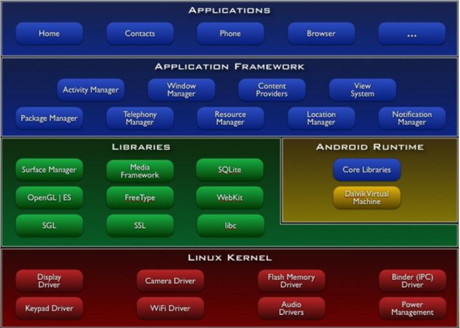

### [2019-06-10]

#### 1. Review
+ Java ----(JDBC)----- Oracle ------- WebProgram(HTML/JavaScript/Savlet/JSP)


#### 2. Android
+ 대부분이 Android Studio를 통한 개발로 이루어짐.

+ Android Studio
  1. Editor + 화면구성(직접개체생성-배치 or 툴사용-개체생성-배치)
  2. 컴파일(Android SDK) ---> 실행도구


##### 2.1. 개발환경설치

0) Java SDK설치

1) 전통적인 방법
```
   Eclipse + plug-in
           + Android SDK(클래스 라이브러리) - 도움말(Reference)
           + AVD(가상기기-시뮬레이터) | 실제기기 
```
2) Android Studio(안드로이드 통합개발환경)
```
   개발자 사이트(http://developer.android.com/studio)
   android-studio-ide-181.5014246-windows.exe 다운받아 실행
   1) tool 자체 필요내용(editor, 디자인도구, 시뮬레이터)
   2) 최신 Android SDK설치 
   3) AVD tool , SDK tool
```
3) 프로젝트 만들기
```
   특이점)Java를 컴파일/실행코드를 만들때 Gradle을 이용하여  Project 관리
```

+ 참고) 안드로이드 버전
```
코드네임                               버전                        내부 build-version
---------------------------------------------------------------------------------------
컵케이크(Cupcake)                      -Android 1.5                API Lavel 3
도넛(Donut)                            -Android 1.6                4
이클레어(프랑스어: Eclair 에클레르[*]) -Android 2.0~2.1            5,6,7
프로요(Froyo, 프로즌 요구르트)         -Android 2.2                8
진저브레드(Gingerbread, 생강빵)        -Android 2.3                ....
허니콤(Honeycomb, 허니콤 토피)         -Android 3.0
아이스크림 샌드위치(Ice Cream Sandwich)-Android 4.0
젤리빈(Jelly Bean)                     -Android 4.1~4.3
킷캣(KitKat)                           -Android 4.4
롤리팝(Lollipop)                       -Android 5.0~5.1
마시멜로(Marshmallow)                  -Android 6.0                23
누가(Nougat)                           -Android 7.0~7.1            24,25
오레오(Oreo)                           -Android 8.0~8.1            26,27
파이(Pie)                              -Android 9.0                28,29

Android Studio를 설치하면 최신  Android SDK, 즉 현재로서는 Android 9.0(API Lavel 29)가 자동 설치된다. 자신의 기기(Device-Phone)에 맞는 SDK Manager를 이용하여 설치하기를 권장한다.
```


+ Android 플랫폼 구조
```
----------------------------------------------------------------------------
0. H/W - CPU(ARM process)
------------------------------
- O/S - Linux 커널계층
- 내부 라이브러리 계층 -- 자바가상머신
- 안드로이드 Framework계층 -- 안드로이드 클래스 라이브러리  <------|
- Application ==> 여기가 우리가 개발할 APP(앱) --------------------|
----------------------------------------------------------------------------

프로젝트 - Application개발
    *.java -------자바컴파일러----------------------------> *.class --|(*.dex 가상머신용)
    *.xml(디자인 tool의 결과물) ----(aapt.exe 컴파일)-----> *.aapt    |*.apk => 실행
    기타 리소스(resource) --------------------------------> 그대로 ---|
```


+ Android의 특징
```
1. 어플리케이션프레임워크제공
   -마법사를 통해 개발프로젝트의 성격에 맞는 기본적인 프레임워크를 제공
   -컴포넌트들의 재활용 및 교체 가능
   -자바 언어를 이용하여 개발

2. Dalvik  가상머신
  -안드로이드용 가상머신, 모바일 장치에 최적화

3. 최적화된 그래픽
   -기본적으로2D 그래픽 라이브러리를 제공한다.
   -OpenGL ES 1.0 스팩에 기반한 3D 그래픽 라이브러리를 제공한다.

4. SQLite
   -데이터를 저장하고 검색하기 위해 SQLite를 사용 한다.
   -일종의 데이터베이스 시스템이다.

5. 미디어 지원
    -오디오, 비디오, 정지 화상 포멧 지원
    -MPEG4,  H.264,  MP3,  AAC,  AMR,  JPG, PNG, GIF 등

6. 기타 지원사항
   -하드웨어 의존적이지만, 다음 항목에 대해 지원 가능하다.
   -GSM 테크놀로지, 블루투스, EDGE, 3G, WiFi, 
     카메라, GPS, 나침반, 가속도계

7. 풍부한 개발환경
   - 디바이스 에뮬레이터, 디버깅 도구, 메모리 및 성능 프로파일링,
      Eclipse IDE
```



##### 2.2. project구조
+ 실제 프로젝트 폴더의 구조와 개발화면의 구조가 다르다.

1. 개발화면에서의 프로젝트 구조
```
  app : 프로젝트 관련 모든 작업내용
        manifests
          AndroidManifest.xml(폰에 현재 프로젝트를 설치할때 현재App에 대한 정보(4대구성요소,권한)를 Android시스템에게 제공)
        
        java(소스 프로그램이 위치)
          com.jica.firstandroid
               Android  App의 4대구성요소에 대한 Java Code
                   1.Activity,
                   2.Broadcast Rreciver,
                   3.Service,
                   4.Contents Provider
        
        res(자바코드에서 사용하는 자원(resource)을 모아 놓은곳) : 주의점(모든화일명은 소문자로만 기술되어야 한다)
          drawable  - 이미지화일 (*.jpg, *.png ... *.xml)
          layout    - Activity의 화면구성을 디자인 tool을 사용했을때 결과물이 저장(xml)
          mipmap    - 런처이미지(스마트폰의 바탕화면에서 App을 식별하는 아이콘)
          values    - 값으로 표현될 내용을 저장해 놓고 Java Code나 layout에서 사용
                      값의 종류(용도)에 따라 화일명이 정해져 있다.
  
  Gradle Scripts : 프로젝트관리(컴파일/링크/설치/테스트-디버깅)에 필요한 정보를 설정(외부라이브러리 사용시)
      build.gradle(Project:프로젝트명)
      build.gradle(Module:app)
```

2. 프로젝트를 실행
```
    - AVD( AVD Manager를 이용하여 AVD를 생성)
     - 실제기기( 1. 컴퓨터에서 스마트폰 인식 : 자동인식, 모델번호별 USB 드라이버 설치해서 인식-권장)
                 2. 스마트폰 설정메뉴 - 개발자옵션(없으면 폰정보에 빌드버전을 여러번 클릭) - USB 디버깅 ON )
```


##### 2.3. 4대 구성요소 (Intent:인텐트..정보교환)
1. Activity
2. Broadcast Receiver
3. Service (Background 기능)
4. Contents Provider

##### 2.4. Activity와 View
##### 2.5. View의 공통속성
##### 2.6. Layout
##### 2.7. Event처리

#### 3. 실습
#### 4. Summary / Close


-----------------------------------------------------------


### [2019-06-11]

#### 1. Review

#### 4. 실습
#### 5. Summary / Close