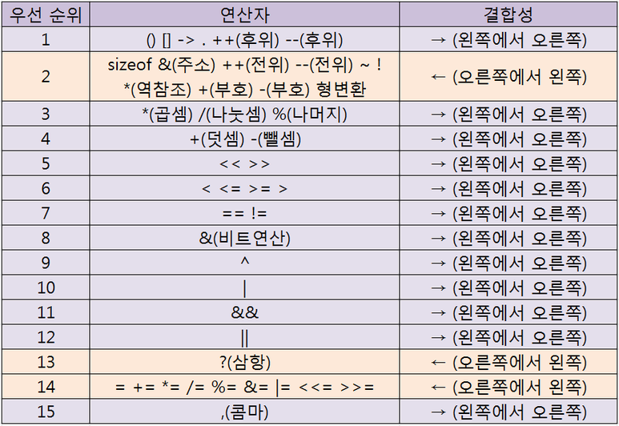

# 안드로이드 및 웹 프레임워크 전문개발자 양성과정
#### 이용섭 강사 ( 010-7242-9424 / argus10@hanmail.net )

### [2019-03-04]
+ 분석 - 설계 - 구현
+ '분석'과 '설계'단계를 완벽하게 구현할 줄 알아야, 구현(코딩)이 원할하다.

#### 1. 과정소개
  + 목표 : "안드로이드 개발 및 프레임워크 개발자 과정"
  + 안드로이드 개발
    - PC : 1.SE(Standard Edition) + 2.Web
    - 스마트폰 : Application
    - "Web + App"를 개발하는 것이 목표.
  + 프레임워크
    - PC에서의 웹 프레임워크를 개발하는 것이 목표.

1. JAVA언어 학습
  + 기본언어의 JAVA를 통해서, 안드로이드를 개발한다.
  + JAVA의 기초를 다지고 다른 언어로 배우는 것이 좋다.
    - "언어 공통요소"학습 : 어떤 언어든지, 공통적인 요소가 있다.
      - '문법' : 기억장소(단일기억장소), 제어구조, 연산자,순차구조, 제어구조, 반복구조... 등
      - '문제풀이능력'
    - "여러개의 값(배열)"학습 : a[]=[10,20,30,40,50];
    - "객체지향 특성"학습 : 클래스, 메서드, 오브젝트
    - "다양한 클래스 라이브러리"학습
    - "네트워크(Network)"학습
    - "데이타베이스(DataBase)"학습

2. Database
  + MS-SQL, mySQL, Oracle.... 기본적인 SQL문법 학습
  + "Oracle 데이터베이스" 학습
  + "Java의 JDBC" 학습

3. Web Program
  + 웹 프로토콜 "http" 학습
  + http에 대한 통신규약, html에 대한 이해 학습
  + "서블릿" + "JSP"에 대한 이해와 학습

4. Android(안드로이드)

5. 프레임워크(FrameWork)
  + 웹 프로그램을 효율적으로 관리하는 학습
  + "Spring" 프로그램을 학습


#### 2. 간단 TEST
----------------------------------------------

### [2019-03-05]
#### 1. Review(Q&A)
#### 2. JAVA 개발환경 설치
  + JDK + Eclipse
  1. "컴파일러"와 "실행기", "디버거", "클래스라이브러리"가 필요하다. -> JDK
  2. GUI의 편리한 환경.... 개발통합환경 -> Eclipse
  3. JDK 8.0설치 후, path지정.
  4. 환경변수 %JAVA_HOME%\bin 추가
  5. 환경변수 JAVA_HOME설정
  6.

#### 3. 컴퓨터의 기본기능과 프로그램
  1. 값들을 저장한다. (a=10)
  2. CPU(중앙처리장치)가 '요리(?)'=ALU 역할.

#### 4. 기억장소
  + 변수, 상수, 객체...

#### 5. 세가지 제어구조(Control Unit의 역할)
  + 순차구조, 선택구조, 반복구조

#### 6. 연산자소개
  + "사칙연산", "비교연산자"

#### 7. 문제풀이연습
#### 8. Summary / Close
------------------------------------------------

### [2019-03-06]
#### 1. Review
  + 프로그램 - 명령어의 모음
    - 기억장소(값=데이터)와 세가지(순차, 선택, 반복...제어문)구조 그리고 연산자만을 사용함

  1. JAVA개발환경설치
    + JDK 1.8 설치
      - 컴파일러(/bin) : javac.exe
      - 실행기(/bin) : java.exe
      - 디버거(/bin) : jdb.exe
      - 압축(/bin) : jre.exe
      - 클래스라이브러리 : `*.jar`
  2. 통합개발환경설치 : Eclipse
  3. 컴퓨터의 기본기능
    1. 입력 : 클래스 라이브러리로 준비되어 있다. System.in.*
    2. 저장 : 기억장소(내부+외부)
    3. 제어 : 순차, 선택, 반복
    4. 연산 : 연산자를 통한 연산작업
    5. 출력 : 클래스 라이브러리로 준비되어 있다. System.out.*
  4. 자료형
    1. 대표자료형
      + 문자열 String = "TEXT"
      + 단수문자 char = 'A'
      + 정수 int = 0.72 ~ -527
      + 실수 double = 0.0, 0.234
      + 논리 boolean = true, false
  5. 변수선언규칙
    + 자료형 변수명[=값];

#### 2. 기억장소(변수사용규칙과 자료형)
  + 자료형
    + 자료형(DataType) = 데이타(값)의 종류를 구분해 놓은 것.
      1. 문자데이터
        + 복수문자(문자열) : "A", "ABC", "전주" - String [""-ok]
        + 단수문자 : 'A', '1', '강' - char [''-error]
      2. 숫자데이터
        + 정수 : 0, -127, 365... int
        + 실수 : 0.0, 3.45... double
      3. 논리데이터
        - 논리 : true, false... boolean

  + 메모리 즉 기억장소에 보관(저장)되고 사용되어지면 '변수'라고 부른다.
  + 저장 위치를 불러오기?
    1. 절대주소 : 메모리상의 절대적주소(address)
    2. 상대주소 : 임의의 기준점으로부터의 상대적주소
    3. 의미화주소 : 변수명으로 사용하는 주소
  + 변수명의 역할
    - 값이 저장된 위치의 별칭. 메모리(값이 저장된) 위치를 식별해주는 역할.
    - 변수명 작성규칙 : 역할에 부합되는 의미있는 명칭을 부여(사용)하자.
      - 변수명은 소문자로 사용하자
      - 한글 풀어쓰기 금지
      - 약어사용 자제
      - 의미있는 단어를 두 글자 이상사용시 대문자 사용 (scoreSum)
  + 변수선언규칙
    - 변수선언
      - 자료형 변수명;
      - 자료형 변수명 = 초기값;
    - 변수정의 : 기억장소가 확보되고 유효값이 저장
      1. 선언만된 변수는 R-Value(값 읽어서 사용하는 표현)로 사용할 수 없다.
      2. 변수가 정의되는 시점은 유효한 값이 최초로 지정될 때이다.
      3. L-Value(값을 변경하는 표현)는 선언된 변수이면, 모두 사용할 수 있다.
      4. 변수를 정의하는 방법
        1. 초기값지정. (int score = 50;)
        2. 치환대입연산자사용. (int score; score = 5;)
        3. 키보드로 입력한것. (System.in ~)
      5. 변수사용
        1.

#### [실습]
  + Eclipse 사용법
    1. 프로그램 전체실행 : Run\Run메뉴 사용
    2. 필요에 따라 1라인씩 디버깅하며 실행 : Run\Debug메뉴 사용
      ... 이때 처음 시작할 위치를 break pointㄹ 지정해야 한다.

  1. 변수와 자료형
    1. 리터럴(literal) : 프로그램 소스값 직접 값이 표현되었을때 리터럴 값이라고 한다
      + "JICA" 문자열 리터럴
      + 'A' 문자 리터럴
      + 100 정수(int) 리터럴
      + 3.14159 실수(double) 리터럴
      + true / false 논리(boolean) 리터럴
    2. 변수(variable) : 프로그램에서 값을 저장하고 사용(읽거나 변경)하는 기억장소
      + 상수(constant) : 값이 저장되어있고, 변경할 수 없는 기억장소
      + 변수명의 역할 : 값이 저장된 위치를 식별하기 위하여 사용자가 지정하는 명칭(의미화주소)
      + 변수명을 지정할때의 관례적 규칙
        - 저장되는 값의 역할에 맞는 의미있는 명칭을 사용하자.
        - 소문자로 작성하는 것을 원칙으로 하되 두 단어 이상을 사용할 때는 두 번째 단어의 첫글자는 대문자로 사용하자.
        - 한글 풀어쓰기 금지.
        - 지나친 약어 사용은 자제하자.
      + 변수의 선언과 정의
        - 변수선언 형식 : 자료형 변수명 [=초기값];
        - 선언 : 시스템 내부에 어떤 종류의 값을 어떤 명칭으로 사용할 것이라고 알려주는 것. 단, 기억장소는 확보되지 않는다. [String name;]
        - 정의 : 기억장소가 확보되고 유효한 값이 최초로 저장되는 것. [name="홍길동"]
          - 변수를 정의하는 3가지 방법
            1. 선언시 초기값 지정
            2. 대입연산자 즉, 치환연산자(=) 사용
            3. 키보드로 입력(READ)
        - 변수 선언시 초기값을 지정하면 변수의 선언과 정의가 동시에 이루어진 것이다. [String name="장길산"]
    3. 변수의 사용시 L-Value, R-Value로 표현
      1. R-Value : 변수에 저장된 값을 읽어오는 표현
```java
      int a, b=10, c;
      System.out.println(b); //b = R-Value
      a = b + 5; //a = L-Value
      if( a > 20 ) {
        실행문장
      }
      a = a + b; // a = 25... R+L-Value 동시에 사용
      c = 100; // 실행문
```
      2. L-Value : 표현식에서 대입연산자 왼쪽에 변수가 나타나는 표현으로 값이 변경된다.
```java
      c = 100;
      c = a + b;
      c = 입력받는 표현식
```
    + 선언만 된 변수는 R-Value로 사용할 수 없다.
    + 반드시 R-Value는 정의된 변수만 사용할 수 있다.
    + 선언된 변수는 언제든지 L-Value로 사용될 수 있다.


  2. 표준입력과 표준출력
    1. 표준 출력 : System.out 객체의 메서드를 사용한다.
```java
    System.out.println(리터럴값이나 변수);
```
    2. 표준 입력 : System.in 객체의 메서드를 사용하면 한글자밖에 입력받지 못하므로 다양한 값을 입력받기 위해 다음의 방법을  사용한다.
```java
    import java.util.Scanner;

    public static void main(String[] args) {
    		String title;
    		int score;
    		double height;
    		char grade;
    		boolean pass;
    		String pass_y;

    		//입력 전용 객체선언 및 생성
    		Scanner scanner = new Scanner(System.in);

        try {
    		System.out.print("성명입력: ");
    		title = scanner.nextLine(); //문자열을 입력받을때 사용

    		System.out.print("점수입력: ");
    		score = scanner.nextInt(); //정수값을 입력받을때 사용

    		System.out.print("몸무게입력: ");
    		height = scanner.nextDouble(); //실수값을 입력받을때 사용

    		scanner.nextLine(); // scanner라인을 지우기
    		System.out.print("학점입력: ");  //true,false등 논리값을 입력받을때 사용
    		grade = scanner.nextLine().charAt(0); //단수문자를 입력받을 때 사용

    		System.out.print("합격여부입력: ");
    		pass = scanner.nextBoolean();
    		if (pass==true) {  //합격여부 true일때, "합격"으로 변환저장.
    			pass_y="합격";
    		}
    		else {
    			pass_y="불합격";
    		}

    		System.out.println(title + "," + score + "," + height + "," + grade + "," + pass_y);
      }
      finally {
        scanner.close();
      }
    	}
    }
```

#### 3. 세가지 제어구조(순차, 선택, 반복)
  1. 순차구조
  - 위에서 아래로/좌에서 우로 차례대로 명령어를 실행한다.
  2. 선택구조
  - 단순선택구조
  - 양자택일(2中1)선택구조
  - 다중선택구조
  3. 반복구조
  - 특정문장을 주어진 조건이 참인 동안 반복 실행
  - for / while

#### 4. 연산자
  1. 산술연산자 : `+, -, *, /, %(나머지연산자)`
  2. 관계연산자 : >, >=, <, <=, ==, !=
  3. 논리연산자 : &&, ||, !|

#### 5. 문제풀이과정
+ 문제제시) 두 정수가 주어졌을때, 큰 수를 출력하고, 두 수의 합계가 100보다 크면 합계를 출력하시오.
```java
int a=5, b=7;
if ( a > b ) {
  System.out.println("큰수 :" + a);
}
else {
  System.out.println("큰수 :" + b);
}

if ( a+b > 100 ) {
  System.out.println("합계 :" + a+b);
}
```
  1. 문제이해
- 최종결과와 결과를 만들기위한 조건을 검토해 본다.

  2. 처리과정
- 큰수결정
- 합께계산
- 합계출력여부결정
- 큰수출력
- 합계출력 or 패스
- 끝

  3. 순서도(플로우차트)
- 기억장소, 세가지 제어구조, 연산자만을 사용하여 수행할 기능을 약속된 기호로 나열한다.

  4. 자바언어로 코딩
- 순서도를 보고 자바코딩을 수행한다.


문제제시) 1~5까지 출력하시오.
  1. 문제이해
- 숫자 값을 가진 변수를 계속 변화시켜 5를 출력
  2. 처리과정
- 숫자가 5보다 작을 동안 반복
  + 숫자출력
  + 숫자증가
  + 끝
  3. 순서도
  4. 코딩
```java
  int number = 1;
  while ( number <= 5 ) {
    System.out.print(a + " ");
    number = number + 1;  // or number += 1
  }
```


#### 6. Summary / Close
  1. 변수선언의 위치가 꼭 상단이어야 하는가?
  2. Scanner 선언 후에...Close함수를 써야하는가? (1.5까지는 필요, 1.7부터는 필요X)

#### [과제]
1. 두 변수만 사용하여 내용값을 교환하라.
```java
  int a = 5;
  int b = 7;

  a = a ^ b;
  b = a ^ b;
  a = a ^ b;

  System.out.println(a+","+b);   // 7,5
```

2. 세 숫자가 주어졌을 때,
  1. 가장 큰수 구하기
```java
    int a=10, b=2, c=5;
    if ( a > b && a > c) {
      System.out.println("가장 큰수 : " + a);
    } else if ( b > a && b > c) {
      System.out.println("가장 큰수 : " + b);
    } else {
      System.out.println("가장 큰수 : " + c);
    }
```

  2. 중간수 구하기
```java
    int a=10, b=2, c=5;
    if ( a > b && a < c) {
      System.out.println("중간수 : " + a);
    } else if ( b > a && b < c) {
      System.out.println("중간수 : " + b);
    } else {
      System.out.println("중간수 : " + c);
    }
```

3. 1~100숫자에서 홀수 합계 구하면 출력
```java
int number = 1;
int sum = 0;

while ( number <= 100 ) {
	if ( number % 2 == 1 ) {
		sum += number;
	}
	number += 1;
}
System.out.print(sum);
```
--------------------------------------------------------------

### [2019-03-07]
#### 1. Review
  + 컴파일러언어 - (번역) Java, c c++
  + 인터프리터언어 - (동시통역) Javasscript

  + 언어 공통적인 문법
    - 자료형과 변수
      - 문자, 숫자(정수+실수) 등의 저장을 변수에.
      - 선언(R-Value)&저장(L-Value)을 통해 사용.
    - 제어문
      - 제어구조(제어문-Control Statement)
      1. 순차구조
      2. 선택구조 - 다중선택
      3. 반복구조 - for, while, do~ while
    - 연산자
      - 산술연산자 : +, - , `*`, /, %
      - 관계연산자 : >, <, >=, <=, ==,!=
      - 논리연산자 : &&, ||, !

#### 2. 기본 자료형과 참조형
  + 변수의 종류
    1. 일반변수 - 기본자료형으로 확보되는 변수
    2. 참조변수 - 배열, 클래스로 만들어진 객체
  + 변수가 선언&정의되면 결정되는 것들
    - 자료형(int), 기억장소크기(4byte), 값의 저장방식(양수:부호비트 절대값/음수:부호비트 2의보수값)
  + 모든 연산은 같은 자료형끼리만 가능하다. 자료형이 다르면 연산이 불가능하다. 하지만, 컴퓨터 내부에서 계산상의 더 큰 자료형으로 변환 후 계산한다. (자동형변환=캐스트연산)


#### [실습]
  + 자료형(Data Type) : 컴퓨터 내부적으로 표현되어지는 값들의 종류를 구분해 놓은 것.
  + 자료형의 종류
    1. 기본자료형(Primitive Data type)

|구분          |크기  |값의 범위                        |값의 저장방식                           |
|:-------------|:----:|:-------------------------------:|:--------------------------------------:|
|정수형 int    |4byte |-2147483648~0~2147483647 약+-21억|양수(부호와절대값), 음수(-와 2의 보수)  |
|실수형 double |8byte |소숫점 15자리까지 정확히 저장    |부호와 지수부 및 가수부로 변환되어 저장 |
|논리형 boolean|1byte |true, false                      |0:false, 1:true                         |
|문자 char     |2byte |0~65535의 값을 표현(Unicode값)   |                                        |


    2. 참조형(Reference Data type)
      - 문자열 String
```java
  int a = 10;    // a라는 장소에 10이 저장
  String name = "홍길동";   // name이라는  이름의 참조값(실제로 저장된 곳)에 저장된다.
```
      - 배열
```java
  int arr[] = {10, 20, 30, 40, 50};  // arr 참조값---> |10 |20 |30 |40 |50 |
```
      - 클래스와 객체
```java
  Scanner scanner = new Scanner(System.in);
  //scanner 참조값---> 키보드입력에 필요한 여러 값들이 저장되어 있음.
```

  + 클래스(class)는 데이터(값)과 메서드(Mathod)로 구성되어 있다.
  + 클래스는 벰버변수(Field)와 Method로 구성되어 있다.
```java
public class Test {
	public static void main(String[] args) {
    swap1();  // 메서드 swap1호출
    swap2();  // 메서드 swap2호출
	}
  public static void swap1() {
    // swap1 내용
  }
  public static void swap2() {
    // swap2 내용
  }
}
```
  + 메서드는 특정기능을 수행하는 명령어들의 모음
  + "static"이라는 구문이 있어야 '객체'없이 동작한다. 없으면, 객체생성해야 함.


#### 3. 선택구조
- 문제) 세 숫자가 주어졌을 때, 가장 큰 수 구하기
  + 1. 문제이해
  + 2. 처리과정
    - 먼저 두 수를 비교하여, 큰수를 찾는다.
    - 나머지 수와 비교하여 큰수 결정. (가장 큰수 결정)
    - 결과를 출력.
  + 3. 순서도 - 구체적인 방법
  + 


#### [실습]
```java
int large; //가장큰수
int num1 = 7, num2 = 29, num3 = 58; //주어진 수

	// 1. 두수를 비교하여 큰 수 결정
	if(num1>num2) {   //num1이 큰수
	//2.나머지수와 비교하여 가장큰수 결정
	 if(num1>num3) {
		   large=num1;
	    }else {
		      large=num3;
	      }
   } else {          //num2이 큰수
			//2.나머지수와 비교하여 가장큰수 결정
		if(num2>num3) {
				large=num2;
		}else {
			large=num3;
		}
	}
		//3.결과출력
	System.out.println(num1+","+num2+","+num3+" 중에서 가장 큰수는 "+large);


//1.두수를 비교하여 큰 수를 결정
if(num1>num2) {
	large=num1;
} else {
	large=num2;
}

//2.큰수(large)와 나머지 수를 비교하여 가장 큰 수 결정
if(large<num3) {
	large=num3;
}

//3.결과출력
System.out.printf("주어진 세수 %d,%d,%d 중에서 가장큰수는 %d입니다.%n",num1,num2,num3,large);


//1.num1이 가장 큰 수인지 판별
if(num1>num2 && num1>num3) {
		large=num1;
} else if(num2>num1 && num2>num3) { //2.num2이 가장 큰 수 인지 판별
		large=num2;
} else {    //나머지는 무조건 num3이 가장 큰 수
		large=num3;
}
//3.결과출력
System.out.printf("%d(은)는 %d %d %d 중에서 가장 큰수입니다.%n",large,num1,num2,num3);
```
```java
//양자택일 if
if(조건){
        참일때 수행 문장;
}else{
       거짓일때 수행 문장;
}
//다중선택 if (else if문)
if(조건1) {
  조건1을 만족할때 수행할 문장;
}else if(조건2){
  조건2을 만족할때 수행할 문장;
}else if(조건3){
  조건3을 만족할때 수행할 문장;
}else if(조건4){
  조건4을 만족할때 수행할 문장;
}else{
  위의 모든 조건이 거짓일때 수행할 문장;
}
```

#### 4. 반복구조
+ 다른각도로 풀어보자
  - 1.문제이해 : min, middle, max를 정하자.
  - 2.처리과정
    * 주어진 세 수를
    * min < middle < max
      - min > middle이면, 내용교환
      - middle > max이면, 내용교환
    * min, middle, max 출력
  - 3.순서도
  - 

##### [while 반복구문]
```java
public static void minMidMax() {
		int min=29, mid=7, max=58;
		int temp;

		//1. min<mid 그리고 mid<max가 될때까지 반복
		while(min>mid || mid>max) {
			if(min>mid) {
				temp=min;
				min=mid;
				mid=temp;
			}

			if(mid>max) {
				temp=mid;
				mid=max;
				max=temp;				
			}
		}

		//결과출력
		System.out.printf("%d %d %d 순서입니다.%n", min, mid, max);
	}
}
```

+ 반복구조
  - 선체크 반복
    * 규칙적 반복 : for문(빈도가 높음)
    * 불규칙적 반복 : while문(가끔)
  - 후체크 반복 : dowhile문(거의X)

##### [for 반복구문]
+ [for문]
```java
for(반복제어변수 초기화; 반복조건; 반복제어동안 수행작업) {
  수행할 작업;
}
```

+ 증감연산자 : ++, --
+ 결합연산자 : +=, -=, `*=`, /=, %=

```java
int number = 1;
int sum = 0;
for(number=1; number<=100; number+=2) {
			sum += number;
		}
		System.out.printf("1부터 100까지 홀수의 합은 %d입니다.",sum);
```

[반복구조를 표현하는 제어문]
+ 1. 선체크 반복
  - 1) 규칙적 반복 ==> for문
```java
for(반복제어변수초기화; 반복조건; 반복제어변수증감) {
  수행할 기능
}

int sum = 0;
int number;
for(number=1; number<=100; number+=2) {
	sum += number;  //수행할 기능
}
System.out.println("홀수합계 : " + sum);

```
  - 2) 불규칙적 반복 ==> while문
```java
반복제어변수 초기화
while(반복조건) {
  수행할 기능
  반복제어변수증감
}

int sum = 0;
int number;
number=1;   //반복제어변수 초기화
while(number <= 100) { //반복조건
	sum += number;  //수행할 기능
	number +=2;    //반복제어변수 증감
}
System.out.println("홀수합계 : " + sum);
```
+ 2. 후체크 반복 ==> do while문
```java
do{
  반복내용
} while(반복조건);
```

###### [3/7 과제]
+ 성명과 세 점수를 입력받아, 총점과 평균 그리고 학점을 출력하시오. 단, 평균이 90.0이상이면 'A', 80.0이상이면 'B'... 60.0이하이면 'F'. 출력하시오.
+ 1부터 100까지 숫자 중, 3의 배수와 5의 배수를 제외한 홀수의 합계를 계산하여 출력하시오.
+ 1+(1+2)+(1+2+3)+(1+2+3+4)+...+(1+2+3+...+9+10)의 합을 계산하여 출력하시오.
+ 숫자를 입력받아(1~20) 해당 숫자의 Factorial를 계산하시오.


#### 5. 관계연산자와 논리연산자
#### 6. 문제풀이
#### 7. Summary / Close

--------------------------------------------------------------------

### [2019-03-08]
#### 1. Review
##### 자료형 : 값들의 종류
+ 1) 기본자료형
  - 음수와 양수의 메모리 상태가 다르다. (음수는 보수를 취해서 계산)
  - 실수(float-4byte / double-8byte)
  - 정수(short-2byte / int-4byte / long-8byte)
```java
System.out.println(0101); //8진수 65를 표현
System.out.println(0x41); //16진수 65를 표현
System.out.println(10L); //10을 long(8byte)로 표현

float f1 = 3.1415;  //error
float f1_2 = 3.1415F; //ok
double f2 = 3.1415; //ok
```

+ 2) 참조형
```java
char grade = 'A';  //기본형 변수
String name = "홍길동";  //참조형 변수
```
+ "홍길동"은 실제로 어딘가 저장되어 32bit로 저장되어 있고, 주소값만 name에 있다.


#### 2. 자료형
+ 문자 char - 2byte_유니코드값(0~65535)
+ 정수 int로 표현되는 21억까지의 숫자가 넘는다면, 'long' 변수를 사용해야 한다.
+ 등가비교는 '정수형', '문자'끼리하는 것을 권장.

#### 3. 제어문
##### [실습]
+ 키보드로 입력받는 과정
  - name = scanner.nextLine();
  - 성명입력 : ABC엔터  ---------  |65|66|67|13|10|||||||||||...|||||| (키보드 버퍼)
  - name이라는 버퍼에 "ABC"가 들어감. 이후 키보드 버퍼 클린......||||||||||

  - score = scanner.nextInt();
  - 입력 : 70엔터  ---------  |7|0|13|10|||||||||||...|||||| (키보드 버퍼)
  - score라는 변수에 숫자70을 만들어 들어감. 이후 키보드 버퍼 클린...|||||

+ 다중선택구조는 Java언어에서
  - 1) else if문 - 어떠한 다중선택구조로 모두 표현할 수 있다.
  - 2) switch case문 - 조건이 문자나 정수의 등가비교(==)일때만 사용한다.
```java
int temp = (int)average / 10;
switch (temp) {
case 10: grade = 'A';break;   // grade = 'A';break; 생략가능
case 9:	grade = 'A';break;
case 8:	grade = 'B';break;
case 7:	grade = 'C';break;
case 6:	grade = 'D';break;
default : grade = 'F';break;  // break; 생략가능
}
System.out.printf("총점:%4d,평균:%6.2f,학점:%2c%n",	total, average, grade);
```

+ 반복문
  - 규칙적인 반복 ==> for문
  - 불규칙적인 반복 ==> while문

#### 4. 연산자
```java
remain3 != 0 && remain1 != 0;
!(remain3 == 0) || remain3 == 0);
//둘다 같은 표현
```
#### 5. 문제풀이
```java
//1~20까지의 숫자를 입력받아 Factorial을 구하여 출력하시오.
long factorial = 1L;
int inputNumber;
//입력전용객체 선언 및 생성
Scanner scanner = new Scanner(System.in);
//1. 숫자입력
System.out.println("Factorial을 계산할 값을 입력하시오(1~20)");
inputNumber = scanner.nextInt();
//2. factorial계산
for(int number=1; number<=inputNumber; number++) {
	factorial *= number; //factorial = factorial * number;
}
//3. 결과출력
System.out.printf("%d! = %d%n", inputNumber, factorial);


//성명과 세 점수를 입력받아 총점, 평균, 학점을 구하여 출력하시오.
int total;
double average;
char grade;
String name;
int score1, score2, score3;
//입력전용객체 선언 및 생성
Scanner scanner = new Scanner(System.in);
//1.성명과 세점수 입력
System.out.print("성명입력 : ");
name = scanner.nextLine();
System.out.print("점수1입력 : ");
score1 = scanner.nextInt();
System.out.print("점수2입력 : ");
score2 = scanner.nextInt();
System.out.print("점수3입력 : ");
score3 = scanner.nextInt();
//2.총점과 평균계산
total = score1 + score2 + score3;
average = total / 3.0;
//3.학점결정(계산)
int temp = (int)average / 10;
switch (temp) {
case 10: grade = 'A';break;   // grade = 'A';break; 생략가능
case 9:	grade = 'A';break;
case 8:	grade = 'B';break;
case 7:	grade = 'C';break;
case 6:	grade = 'D';break;
default : grade = 'F';break;  // break; 생략가능
}
//4.결과출력
System.out.printf("총점:%4d,평균:%6.2f,학점:%2c%n",	total, average, grade);


//1부터 100까지 숫자 중, 3의 배수와 5의 배수를 제외한 홀수의 합계를 계산하여 출력하시오.
int sum=0, number, remain3, remain5;
for(number=1; number<=100; number+=2) {
	remain3 = number % 3;
	remain5 = number % 5;
	if(remain3 != 0 && remain5 != 0) {
		sum += number;
		System.out.print(number+" ");
	}
}
System.out.println(sum);


//1+(1+2)+(1+2+3)+(1+2+3+4)+...+(1+2+3+...+9+10)의 합을 계산하여 출력하시오.
// 1.while문으로 코딩하기
int sum=0; //최종합
int number=1; //항
int subSum = 0; //항의 값
int subNumber; //항의 값을 계산하기 위한 값

while(number<=10) {
//항의 값을 계산
	subNumber = 1;
	subSum = 0;
	while(subNumber<=number) {
		subSum += subNumber;
		subNumber++;
	}
	//총합 누적
	sum += subSum;
	//중간결과 출력
	//System.out.println(number+","+subSum+","+sum);
	number++;
}
System.out.printf("총 합은 %d입니다.%n", sum);


// 2.for문 코딩하기
int i=1, j, sum=0, total=0;
for(i=1; i<=10; i++) {
	for(j=1; j<=i; j++) {
		sum += j;
	}
	total += sum;
	//System.out.println(i+","+j);
}
System.out.printf("총합은 : %d입니다.%n", sum);
```
#### 6. Summary / Close
#### [과제]
+ 교제 1~4장 읽어오기
+ 오늘까지 실습한 문제를 복습해보기

-------------------------------------------------------------------

### [2019-03-11]
#### 1. Review
+ 기초문법(언어공통요소)
+ 문제풀이
  - 일처리과정을 기억장소(자료형, 변수), 세가지 제어구조(제어물), 연산자를 이용하여 작성.

#### 2. 교재살펴보기
+ 자바언어의 특징_"운영체제에 독립적이다."
  - "운영체제에 독립적이다." - JVM(Java Virtual Machine)
  - "네트워크와 부산처리를 지원한다."
  - "멀티쓰레드를 지원한다."
  - "동적 로딩(Dynabic Loading)을 지원한다." - `*.dll`
+ 패키지(package)소개
  - Jva언어에서 패키지(package)는 관련된 클래스(class)들을 모아놓은 것이다.
  - 이클립스에서 Java Project를 만들면 자동으로 default 패키지가 생긴다. 클래스 생성시 패키지 지정이 없으면 deafualt 패키지에 속하는 클래스가 된다. 여러클래스를 효율적으로 관리하기 위해 사용자가 패키지를 만들어 사용할 수 있다.
  - 패키지만들기
    - 1) File - New - package ... 패키지명 지정하면 생성.
    - 2) 클래스생성시 해당 클래스가 속할 패키지를 지정한다.
  - 패키지 명칭은 여러계층으로 작성한다. com.jica.chap02
  - 패키지 명칭은 유일해야 하므로 이름이 겹치지 않게 하기 위해 일반적으로 회사의 도메인명칭을 거꾸러 작성하기를 권장한다.
  - 물리적으로 패키지를 작성하면 소스 디렉토리에 계층구조로 표현된다.
  - 패키지에 속한 java파일은 프로그램소스 첫줄에 패키지 선언부가 있어서 해당파일이 속한 패키지를 package com.jica.dhap03;
#### 3. 2장 자료형
+ 변수의 선언과 초기화
+ 변수의 내용값 교환
+ 값을 출력할때 문자열과 +기호를 결합사용하여 출력할수 있다.

+ 자료형(변수의 타입)
  - 1) 프로그램 소스에 값이 직접 표현되면, Litteral이라고 한다.
  - 2) 값을 저장하여 사용할때 변수를 이요한다.
  - 3) 변수 선언시 반드시 자료형을 지정한다.
+ 값의 종류 ==> 자료형
  - 문자열 String 4
  - 문자 char 2
  - 정수 int 4 약+-21억, long 8 ...., short 2 -32768~0~32767, byte 1 -128~0~127
  - 실수 double 8 소숫점이하 15자리, float 4 소숫점이하 7자리
  - 논리값 boolean 1  true/false
+ 일반변수와 참조변수
  - 일반변수는 위의 자료형중 기본형(primitive type) 값을 가지는 변수
  - 참조변수는 배열이나 객체의 위치정보(주소:address)를 값을 가지는 변수 무조건 크기는 4byte)
```java
String title = "전주정보문화진흥원";
int scores[] = new int[]{50,70,90,800,88};
Scnner scanner = new Scanner(System.in);
Date today = new Date();
```

+ 정수값을 프로그램소스에 직접 리터럴형태로 표현할때 대부분의 경우 십진수값을 표현하지만 특수한 경우에는 8진수, 16진수, 2진수 등으로도 표현할 수 있다.

|리터럴값|진법    |접두어|
|:-------|:------:|:----:|
|100     |십진수  |없음  |
|0100    |8진수   |0     |
|0x100   |16진수  |0x    |
|0b100   |2진수   |0b    |

+ 접미어를 사용하여 int형과 long을 구분한다.
  - 100          ==>    int형
  - 100l, 100L   ==>    long형
+ 정수를 리터럴값으로 표현할때 자릿수가 길면 복잡해 보인다.
  - 만약 275486이라는 숫자를 용이하게 판독하기 위해 일상생활에서는 세자리 숫자마다 콤마(,)를 사용한다.
  - 위와 비슷한 효과로 int, long값을 표현할때 `_`를 사용할 수 있다.(Java 5.0부터)
```java
long value = 100000000000L;     // ok
long value2 = 100_000_000_000L; // ok
```
+ 실수형데이터를 표현할때 float와 double을 명시적으로 지정하기 위해 f와d를 사용할수 있다.
```java
float phi = 3.1415f;    // ok
double phi2 = 3.1415;   //double phi2 = 3.1415d; ok
```
+ 자료형이 다른 값을 저장할때는
  - 1. 같은자료인가(문자, 정수, 실수)
  - 2. l-value 기억장소크기 >= r-value 기억장소크기 ok
```java
int i = 'A';    //ok
long l = 123;   //ok
double d = 3.14f;  // ok

int j = 0x123456789;  // 16진수 정수 => int의 표현범위를 벗어난값이므로 long형 정수써야함
// 0001 0010 0011 0100 0101 0110 0111 1000 | 1001

byte b = 127; //ok l-value는 byte형이고 r-value는 int 리터럴이지만 값이 범위가 byte형으로 저장할 수 있다.
byte b = 128; //error 범위를 벗어나서...
short s = 0x1234;

char ch3 = 'J'; //ok
String name2 = "Java"; //ok
// 주의할점
String str = ""; //ok 빈 문자열
char ch4 = '';  //error 빈 문자표현은 없다.
char ch5 = ' '; //ok 공백문자 즉, 코드값 32
```
+ String 즉, 문자열은 기본자료형이 아니라 참조형이라고 했다.
  - 참조형 변수는 new 표현으로 생성할 수도 있다.
```java
String name3 = "안드로이드";   //ok
String name4 = new String("안드로이드");  //ok
```

+ 문자열과 기본자료형을 +연산자로 연결시키면 최종적으로 문자열이 된다.
```java
String title = "Java" + 5.0;  // "Java5.0"
```
+ 논리값 true, false
```java
System.out.println(true);    // true 값이 출력
System.out.println(true+""); // "true" 문자열 출력
```
+ null도 예약어 이다.
  - null 참조형 변수에 아직 유효한 값이 저장되지 않았다는 의미로 사용된다.
  - 그러나 null은 자료형은 아니다.
```java
String title2;
System.out.println(title2);  //error

String title2 = null;
System.out.println(title2);  //ok

System.out.println(null); //error
System.out.println("null"); //ok
```

+ System.out.println() 사용법
+ System.out.printf() 사용법
  - System.out.printf("%d %s %f %c %n등의 형식지정자와 출력할문자열", 형식지정자);

|출력할 값          | 형식지정자      |
|:------------------|:---------------:|
|문자열(String)     |%s               |
|단순문자(char)     |%c               |
|정수(10/8/16/2진수)|%d, %o, %x, %b   |
|실수               |%f               |
```java
System.out.printf("%s %c %d %f", "Java", 'A', 78, 3.14);

System.out.println('\'');		     //  '''처럼 할 수 없다.
System.out.println("abc\t123\b456"); // \b에 의해 3이 지워진다.
// \t tap키....\b BackSpace
System.out.println('\n');		     //  개행(new line)문자 출력하고 개행
System.out.println("\"Hello\"");	 //  큰따옴표를 출력하려면 이렇게 한다.
System.out.println("c:\\");
```
+ 문자값 중에서 특수제어기능을 수행하는 몇몇개의 특수문자를 표현하는 방법

|          |    |
|:---------|----|
|tab       |\t  |
|backspace |\b  |
|endter    |\n\r|
|\         |\\  |
|'         |\'  |
|"         |\"  |

+ 정수형 기억장소의 overflow
  - 각 정수형의 기억장소의 크기에 따라 표현할 수 있는 값의 범위가 정해져있다.
  - 그 범위를 벗어나면 에러가 발생하지는 않지만, 잘못된 값이 저장되어 이용됨. (=overflow)

+ 형변환?
  - Java언어는 변수가 한번 선언될대 자료형이 결정디면해당변수는 프로그램이 끝날때까지 자료형을 변경시킬수 없는 언어이다.
  - 필요에 따라 일시적으로 자료형이 변경된 효과를 얻는것을 형변환(캐스트:cast 연산)이라고 한다.
  - 컴파일러 내부에서 자동으로 변환되는 것을 자동형변환이라고 한다.
  - 이때 문자형--->정수--->실수로 자동형변환 될 수 있다.
  - 또, 기억장소의 크기 작은 자료형이 큰 자료형으로 자동형변환 된다.
  - byte -> short -> int -> long -> folat -> double

#### [오늘의 문제]
+ 피보나치수열 구하기
#### 4. 3장 연산자
#### 5. 4장 조건문과 제어문
#### 6. 배열 사용법
#### 7. 배열을 이용한 문제풀이
#### 8. Summary / Close


-------------------------------------------------------------------

### [2019-03-12]
```
1) Scanner
2) Integer.toBinaryString() ==> 정수값이 메모리 2진수형태로 저장된 모습을 확인하고 싶을때
3) Math.round()             ==> 숫자 반올림을 손쉽게 하고 싶을때
4) Math.random() ==> 0.0 ~ 1.0 사이의 임의의 double형 숫자가 생성.

     클래스명.메서드호출();
```

#### 1. 3장 연산자
+ 1. 연산을 수행하는 기호
+ 2. 연산자 : CPU가 수행하는 기능을 프로그램에서 사용할 수 있도록 특수문자를 이용하여 제공한다.
  - 연산자(operator)는 연산을 대표하는 기호
  - 피연산자(operand)는 연산에 참여하는 값(리터럴, 변수, 계산의 결과값)
+ 피연산자의 갯수에 따라 '단항연산자', '이항연산자', '삼항연산자'로 구분할 수 있다.
+ 연산의 성격에 따라 '산술연산자', '관계(비교)연산자', '논리연산자', '기타연산자'로 구분할 수 있다.

+ 0. 단항연산자(우선순위0)
  - ++, --, +, -, ~, !, (type)variable
+ 1. 산술연산자
  - `*`, /, %  (우선순위1)
  - +, -       (우선순위2)
  - >>, <<     (우선순위3)
+ 2. 관계연산자
  - <, <=, >, >= (우선순위4)
  - ==, !=       (우선순위5)
+ 3. 논리연산자
  - &, ^, |      (우선순위6)
  - &&, ||       (우선순위7)
+ 4. 삼항연산자
  - ?:           (우선순위8)
+ 5. 대입연산자와 결합연산자
  - =            (우선순위9)
  - +=, -=, `*=`, /=, %=, ~=, >>=, <<=  (우선순위10)
  - &=, ^=, |=   (우선순위11)
+ 6. 기타 연산자
  - instanceof

+ 대부분의 연산자는 변수나 값 전체를 대상으로 연산을 수행하지만, 몇몇개의 특수한 연산자는 변수의 비트(bit)값을 대상으로 연산을 수행한다. 이러한 연산자를 비트연산자라고 한다.
  - ~  1의 보수 연산자
  - >> 비트값을 오른쪽으로 이동(shift)
  - << 비트값을 왼쪽으로 이동(shift)
  - &  비트 논리곱
  - |  비트 논리합
  - ^  배타적 논리합(XOR)
  - ~=, <<=, >>=, &=, ^=, |=

+ 모든 연산자의 우선순위를 외워서 적용하는 것은 어려움이 있으므로 개략적으로 단항, 산술, 관계, 논리, 삼항연산자, 대입/결합연산자 순정도 기억하고 표현할때는 먼저 수행할 연산을 괄호('(')를 이용하여 명시적으로 나타내주자.

+ 연산자의 우선순위가 동일한 연산자 하나의 표현에 동시에 사용되었을때 수행되는 순서(규칙)을 '결합규칙'이라고 한다.
  - 산술연산은 '왼쪽에서 오른쪽으로'하지만, 대입연산에서는 '오른쪽에서 왼쪽으로' 한다.
  - 

+ 모든 연산자는 자료형이 동일해야 실행될 수 있다. 자료형이 다르면 같은 자료형으로 자동형변환이 발생할 수 있다.
  - 자동형변환은 작은 자료형이 큰 자료형으로 변환되는 기능이다.
+ float, double 내부적인 저장내용이 유효자릿수 이후에는 쓰레기 값이 저장될수 있으므로 가극적 등가비교 하지 않기를 권장한다.
```java
// 굳이 쓰려면, 다음과 같이 사용하자.
if( 0.1 - 0.1f > 0000000001) {
  System.out.print("두 숫자는 다르다.");
} else {
  System.out.print("두 숫자는 같다.");
}
```
+ 실수형끼리의 등가비교 사용을 자제하자.

+ 문자형 비교
  - String 변수는 참조변수이다.
  - 
  - String 변수를 등가비교(==)하면 메모리 상태에 따라 결과값이 다르게 나타나므로 주소(위치정보)를 비교하지 말고 내용값을 비교할때 equals()메서드를 사용한다.
  - 문자열 비교는 등가비교(==)를 사용하면 위치정보(주소)가 같은지를 비교하고, 문자열객체.equals("문자열")를 사용하면 내용값이 같은지를 비교한다.
  - 앞으로 equals()메서드 사용.
```java
 문자열.equals("문자열");
```
+ 논리연산자
  - 일반 논리 연산자
  - && 논리곱 and 두개 모두 참일때 결과값이 참
  - || 논리합 or  두개값 중 하나라도 참이면 결과값이 참
  - !  부 정  not 반대 결과값
  - 논리합 즉, or 연산자 ||는 표현식에서 앞의 조건이 참이면, 뒤의 조건은 평가하지 않고 True표현
  - 논리곱 즉, and연산자 &&는 표현식에서 앞의 조건이 거짓이면 뒤의 조건은 평가하지 않고 False표현

+ 비트연산자 : 비트값을 대상으로 연산을 수행한다.
  - 특별한 경우에만 사용하고 일반적으로 잘 사용하지 않는다.
  - ~       1의 보수연산자
  - >>  비트값을 오른쪽으로 이동시키는 연산자 (shift)  => 나눗셈효과
  - <<  비트값을 왼쪽으로 이동시키는 연산자 (shift) => 곱셈효과
  - &, |, ^ 비트를 대상으로한 논리 연산자
  - 비트 and 연산자 & : 양쪽비트값이 모두 1이면 1, 아니면 0
  - 비트 or  연산자 | : 두 비트값중 하나라도 1이면 1, 아니면 0
  - 비트차 연산자   ^ : 두 비트값이 같으면 0, 다르면 1

+ 삼항연산자 if문을 1줄로 간결하게 표현하는 효과가 있다.
```java
  (조건) ? 참일때 실행문장 : 거짓일때 실행문장;
```

#### 2. 4장 조건문과 제어문
```java
score = Interger.parseInt(tmp); //입력받은 문자열(tmp)을 숫자로 변환
```
+ 1) 단순조건
```java
     if(조건){
              참일때 수행 문장;
     }
```
+ 2) 양자택일선택
```java
     if(조건){
             참일때 수행 문장;
     }else{
            거짓일때 수행 문장;
     }
```
+ 3) 다중선택   else if 문
```java
     if(조건1){
            조건1이 참일때 수행문장;
     }else if(조건2){
            조건2가 참일때 수행문장;
     }else if(조건3){
            조건3이 참일때 수행문장;
     }
     ....
     }else{
            위의 모든 조건이 거짓일때 수행문장;
     }
```
+ 다중선택 switch case문
  - else if구문이 실수형과 대소비교로 이루어져 있을때, 좀더 빠른속도로 처리되도록 변경시킬수 있다. switch case문을 이용한다 ==> 문자, 정수의 등가비교 조건
```java
  switch(변수){
     case 값1 : 수행할 문장;break;
     case 값2 : 수행할 문장;break;
     ....
     default : 수행할 문장;break;
     }
```

+ 4) 선택구조안에 또다른 선택구조를 표현하면 중첩 if문이라고 한다.
```java
     if(조건1){
        if(조건2){
        }else{
        }
     }else{
     }               
```

```java
//아래의 코드는 컴퓨터가 1,2,3중에서 임의의 숫자를 발생시키는 코드다.
com = (int)(Math.random() * 3) + 1;  // 1,2,3중 하나가 com에 저장됨
```
+ Math.random() ==> 0.0 ~ 1.0 사이의 임의의 double형 숫자가 생성.
```java
switch(user-com) {
		case 2: case -1:
			System.out.println("당신이 졌습니다.");
			break;
		case 1: case -2:
			System.out.println("당신이 이겼습니다.");
			break;
		case 0:
			System.out.println("비겼습니다.");
  }
```

#### [오늘의 문제]
+ 1) 500까지 숫자중 중심수 구하기
+ 2) 숫자합계
+ 3) 년월일을 입력받아 해당년도의 몇번째 날짜인가 계산하기

-------------------------------------------------------------

### [2019-03-13]
#### 1. Review
+ 자료형, 변수
  - 일반변수(일반변수)
  - 참조형변수(문자열, 배열, 클래스와 객체)
+ 연산자
  - 단항 : +, -, ~, ++, -- !
  - 이항
    - 산술 : `*`, /, %, +, -, <<, >>
    - 관계 : >, >=, <, <=, ==, !=
    - 논리 : &&, ||, &, |, ^
  - 삼항 : `___?___:___`
  - 대입 : =, +=, -=, `*=`,
+ 제어문
  - 선택문
  - 반복문

#### 2. 조건문과 반복문
+ Statement(문)
  - 1) 제어문(Control statement)
  - 2) 분기문(brench statement) : bresk, contiunue, return, goto

+ 1. 선택문
  - 1) if
  - 2) if else
  - 3) else if
  - 4) switch case문
    - if구문이 실수형과 대소비교로 이루어져 있을때 좀더 빠른속도로 처리되도록 변경시킬수 있다면 swich case 문을 이용한다 ==>문자,정수의 등가비교 조건
```java
switch(변수){
   case 값1 : 수행할 문장;break;
   case 값2 : 수행할 문장;break;
   ....
   default : 수행할 문장;break;
   }
```
+ 2. 반복문(Java언어의 모든 반복문은 조건이 참인동안 반복하고 거짓이면 탈출한다.)
  - 1) for반복 -- 규칙적인 반복
    - for문 안에 조건이2개 이상... 변수증감이 두개이상을 ','로 할 수 있으나, 좋은 표현은 아니다.
```java
for(int i=1; i<=5; i++) {
  System.out.println(i);
}

int i;                     // i 6
for(i=1; i<=5; i++){   
   System.out.println(i);  // 1 2 3 4 5
}
==>
  for(반복제어변수 초기값; 반복조건 ; 반복제어변수증감){
    수행할 기능;
  }
```

------------------------------------------------------------------

### [2019-03-14]
#### 1. Review
#### 2. 문제풀이
#### 3. 배열 도입
+ 배열(Array)
  - 배열은 동일한 성격을 가진 기억장소의 모임(집합)이다.
  - 하나의 명칭으로 여러개의 기억장소를 접근할 수 있다.
    - 1) 배열선언 --- 배열명의 성격만 지정했을뿐 생성되지는 않았다.
      - `자료형 배열명 [];`
    - 2) 배열생성 --- 실제 자료형값을 저장할 공간이크기만큼 확보되고 자료형에 따라 초기값이 자동으로 저장된다.
|                             |      |
|:----------------------------|:----:|
|정수(byte, short, int, long) | 0    |
|실수(float, double)          | 0.0  |
|논리(boolean)                | false|
|문자(char)                   | 공백 |
|문자열(String)               | null |

      - `배열명 = new 자료형[크기] / scores = new int[5];`
      - 생성된 메모리 공간의 시작위치정보가 배열명에 저장된다.(참조값)
    - 3) 이후 배열요소표현을 사용하여 값을 사용한다.
      - 배열요소 ==> 배열명[첨자]
      - '첨자'는 반드시 정수, 0~크기-1, literal, 변수, 계산식
      - 배열요소는 단일기억장소 즉, 일반변수가 수행하는 기능을 모두 수행할 수 있다.
    - 4) 배열명 즉, 참조변수에 null을 저장할 수 있다.(더이상 배열요소값을 사용하지 않는다는 뜻)
    - 5) 배열선언과 동시에 생성하고 초기값을 지정하는 방법
      - 방법1)
      - 방법2)
```java
System.out.println(scores[0])
scores[1] = 70;
scores[2] = scores[3] + scores[4];
if( scores[3] > 50 ){
   ...
}
scores[4] = scanner.nextInt();
```


```java
int score[]; //배열선언
score = new int[5] //배열의 생성
// 배열초기화
score[0] = 70;
score[1] = 80;
score[2] = 90;
score[3] = 85;
score[4] = 50;

// 배열을 선언과 동시에 초기화
int score[] = {70, 80, 90, 85, 50}
```
+ 배열의 길이? => `배열명.length`
```java
public static void main(String[] args) {
		// 점수 5개를 저장하기위한 배열 선언
		int scores[];   // 또는 int []scores;    또는 int[] scores;   모두 ok

		// 배열생성은 new 키워드를 반드시 사용해야 한다.
		scores = new int[5];
		/*
		 * 1) int값을 저장할 공간 5개 즉, 4byte짜리 5개를 연속적으로 확보하고 확보된 공간에 0을 저장한다.
		 * 2) scores라는 참조변수에 확보된 공간의 시작주소를 저장한다.
		 */

		//배열명을 직접 출력시키면 이상한 값이 나온다. 이 값을 참조값이라고 기억하자.
		System.out.println("배열명 scores : "+scores);

		/*
		 * 확보된 배열에 저장된 값을 개별적으로 접근할때 배열요소를 사용한다.
		 * 배열요소는 배열에 저장된 실제값 하나, 하나를 의미한다.
		 * 배열요소는 다음의 규칙으로 표현한다.
		 *
		 * 배열명[첨자]
		 * 		----> 0~배열크기 -1까지의 정수값
		 * 			1) 정수 literal
		 * 			2) 정수 변수
		 * 			3) 정수 결과값을 나타내는 계산식
		 */
		System.out.println(scores[0]);
		System.out.println(scores[1]);
		int i = 2;
		System.out.println(scores[i]);   //2번째 요소값
		System.out.println(scores[i+2]); //3번째 요소값
		System.out.println(scores[i*2]); //4번째 요소값

		//배열요소에 개별적으로 접근하여 값을 저장하자.
		scores[0] = 70;
		scores[1] = 80;
		scores[2] = 90;
		scores[3] = 85;
		scores[4] = 60;
		//scores[5] = 88;  // 컴파일시 error가 발생하지 않지만, 실행시 run time error발생한다.

		int total = 0;   //총점
		//for 반복문을 차례대로 접근하자.
		for(int j=0; j<5; j++) {
			total += scores[j];
			System.out.print(scores[j]+" ");
		}
		System.out.println();

		double average = total /5.0;
		System.out.println("총점 : "+total+", 평균 : "+average);

		//확보된 배열의 크기(요소의 갯수)를 알고 싶다면 배열명.length를 사용한다.
		System.out.println("score배열의 크기 : "+scores.length);
	}

}
```
#### [오늘의 문제]
+ 1) 교제 5장 182~192page까지 정독하고 실습해보시오.
+ 2) char배열에 'A', 'B', 'C', 'D', 'E'를 저장한 후, 이 배열을 이용하여 다음모양을 출력하시오.
  - A B C D E
  - E A B C D
  - D E A B C
  - C D E A B
  - B C D E A

#### 4. 배열요소와 첨자(index)
#### 5. 배열을 이용한 문제풀이
#### 6. Summary / Close

------------------------------------------------------------------

### [2019-03-15]
#### 1. Review
#### 2. 1차원배열
+ 첨자(index) 사용 실습
```java
int a[] = new int[10];
		//a 0x100 ------>  [0,0,0,0,0,0,0,0,0,0]

		//배열명 자체는 참조변수 이므로 위치벙보 즉, 주소를 저장하고 있다.
		//해당 주소에 가면 실제값 즉, 배열요소들이 있다.
		System.out.println("배열명 : "+a); //위치정보 즉, 주소가 이상한 형태로 출력.

		//배열의 크기는 생성할때 즉, 메모리를 할당받을때 결정된다.
		//배열의 크기 ==> 배열명.length
		System.out.println("a배열의크기 즉, 요소의 갯수 : " + a.length);

		//1) 10, 20, 30, ...., 100까지 차례대로 저장하자.
		for(int i=0; i<10; i++) {
			a[i]=(i+1)*10;
		}

		//2) 순서대로 출력
		for (int i = 0; i < a.length; i++) {
			System.out.print(a[i]+" ");
		}
		System.out.println();

		//3) 저장된 역순으로 출력하시오.
		for (int j = 9; j >=0; j--) {
			System.out.print(a[j]+" ");
		}
		System.out.println();

		//4) 60,70,80,90,100,10,20,30,40,50순으로 출력하시오.
		//      0   1  2   3  4  5  6  7  8  9   
		//a 0x100 ------------>[10,20,30,40,50,60,70,80,90,100]
		//                      60,70,80,90,100,10,20,30,40,10
		int temp ; //교환용 임시변수
		for(int i=0; i<5; i++) {
			temp = a[i];
			a[i] = a[i+5];
			a[i+5] = temp;
		}

		for(int i=0; i<a.length; i++) {
			System.out.print(a[i] +" ");
		}
		System.out.println();

		//5) 배열요소값을 다음상태로 만들어서 출력하시오.
		for (int i = 0; i < a.length; i++) {
			a[i]=(i+1)*10;
		}
		for (int i = 0; i < a.length/2; i++) {
			temp=a[i];
			a[i]=a[9-i];
			a[9-i]=temp;
		}
		for(int i=0; i<a.length; i++) {
			System.out.print(a[i] +" ");
		}
		System.out.println();
	}
```
#### 3. 문자열배열
+ 메서드(method) : 특정기능을 수행하는 명령어의 모음
+ 클래스는 멤버변수(field)와 메서드로 구성되어 있다.
```java
public static void main(String[] args) {
	int num[] = { 1, 2, 3, 4, 5, 6, 7, 8 };
	// 1. 전체요소 출력
	printTitle(); // 메서드 호출
  // 문제 테이블 만들기
  char ch[] = { 'A', 'B', 'C', 'D', 'E' };
	printCharArray(ch, null);
	// 0 1 2 3 4
	// ch 0x200 ------------>[A, A, B, C, D]
	// 2. 나머지줄을 만들어서 출력
	for (int count = 1; count <= ch.length - 1; count++) {
		// 1) 마지막 요소 임시 기억
		char temp = ch[ch.length - 1];
		// 2) 나머지 요소를 뒤로 이동
		for (int j = ch.length - 1; j >= 1; j--) {
			ch[j] = ch[j - 1];
		}
		// 3) 첫요소 기억
		ch[0] = temp;

		// 배열전체요소 출력
		printCharArray(ch, null);
	}
	char arr[] = { 'J', 'e', 'o', 'n', 'j', 'u', ' ', 'J', 'I', 'C', 'A' };
	printCharArray(arr, null);
	printTitle();
	printCharArray(null, num);
}
// 1차원 문자배열의 모든 요소값을 출력시키는 메서드
private static void printCharArray(char data[], int data2[]) {
	if (data != null) {
		// 전체요소 출력
		for (int i = 0; i < data.length; i++) {
			System.out.print(data[i] + " ");
		}
		System.out.println();
	} else {
		// 전체요소 출력
		for (int i = 0; i < data2.length; i++) {
			System.out.print(data2[i] + " ");
		}
		System.out.println();
	}
}
	System.out.println("JICA 전주정보문화산업진흥원");
	System.out.println("-----------------------------");
}
```

#### 4. 정렬(sort)
+ 순서대로 데이터를 나열하는 것. (오름차순/내림차순)
+ 다양한 정렬방법이 있으나, 제일 많이 사용되는 방법은 선택/버블정렬이다.
##### 4.1. 선택정렬(selection sort)
+ 오름차순(asending sort)
+ 내림차순(desending sort)
##### 4.2. 버블정렬(bubble sort)
##### 4.3. 쉘(shell)/삽입(insert)/퀵(quick) 정렬

##### [오늘의 과제]
+ 오늘 학습내용 복습
+ 192~197page까지 교재를 정독해보고 실습.


-----------------------------------------------------------

### [2019-03-18]
#### 1. Review
+ 배열(Array) - 같은 성격을 가진(자료형) 기억장소 모임
+ 배열명은 참조변수다.
```java
// 5명의 성명과 점수(국어, 영어, 수학)를 입력받아
// 개인초점, 개인평균을 출력하고
// 과목별 평균도 출력하시오.
int total=0;
double average;
char grade;
//과목총점
//int korTotal, engTotal, mathTotal;
int subjectTotal[] = new int [3];
//과목평균
double subjectAverage[] = new double[3];
//입력받아 저장할 변수
String name;
// int score1, score2, score;  // 개별변수로 점수를 저장
int scores[] = new int[3];     // 1차원배열에 점수저장
//입력전용객체 선언 및 생성
Scanner scanner = new Scanner(System.in);
//과목별 총점을 누적할 배열
for(int i=0; i<5; i++) {
	//1.성명과 세점수 읽기
	System.out.print("성명 입력 : ");
	name = scanner.nextLine();
  System.out.println("3개 점수를 입력하시오 ");
	for(int j=0; j<3; j++) {
		scores[j] = scanner.nextInt();
	}
	scanner.nextLine(); //강제로 키보드 버퍼의 내용을 읽는다.(비우는 효과)
	System.out.println(name+","+scores[0]+","+scores[1]+","+scores[2]);
//2.개인총점계산을 계산하면서 과목총점을 누적하자
total = 0;
for (int j = 0; j < scores.length; j++) {
	total += scores[j];
	subjectTotal[j] += scores[j];
}
//3.개인평균계산
average = total / 3.0;
system.out.println(total+","+average);
}
//과목별 평균계산
System.out.println("과목별 평균 : ");
for (int j = 0; j < scores.length; j++) {
	subjectAverage[j] = (double)subjectTotal[j] / 5;
	System.out.printf("%6.2f ",subjectAverage[j]);
}
System.out.println();
```

#### 2. 버블정렬(bubble sort)
+ 인접한 두 항의 값을 계속비교해 나간다.
```java
int a[] = new int[5];
// 정렬의 대상이 되는 데이터 준비 - 난수(1~100까지의 임의의 수)
for (int i = 0; i < 5; i++) {
	a[i] = (int) (Math.random() * 100);
}
// 배열요소를 전체출력하려면
// 1) 개별요소 접근
//for (int i = 0; i < a.length; i++) {
//	System.out.print(a[i]+" ");
//}
// 2) for문을 간결하게 사용할수도 있다. (빠른 for문)
//for (int i : a) {
//	System.out.print(i+" ");
//}
// 3) 전체배열요소값을 문자열로 만들어서 출력
System.out.println("정렬전 데이터 : "+Arrays.toString(a));
System.out.println();

//버블정렬
for (int i = 0; i < a.length-1; i++) {
	for (int j = 0; j < (a.length-1)-i; j++) {
		if (a[j]>a[j+1]) {
			int temp = a[j];
			a[j] = a[j+1];
			a[j+1] = temp;
		}
	}
}
System.out.println("정렬후 데이터 : "+Arrays.toString(a));
```

#### 3. 검색(Search)
  + 대량의 데이터에서 특정데이터의 위치를 알아내는 것.
  + 메서드(method)는 특정기능을 수행하는 명령어 모음
    - 메서드의 구성
```java
리턴값 메서드명(인자정보) {
   실행코드;
   ....
 }
```
  + 1) 메서드명 : 수행하는 기능을 대표하는 명칭
  + 2) 인자정보 : 메서드를 호출할때 전달해 주는 값(없으면 아무것도 기술X)
  + 3) 리턴값 : 메서드가 기능수행을 마치고 되돌아 갈때 돌려주는 값(없으면 void)
```java
public static void main(String[] args) {
	// 메서드호출
	printTitle();
	printNumber(3);
	int cnt = 10;
	printNumber(cnt);
	printNumber(cnt + 5);
	int number1 = 78, number2 = 43;
	int max;
	max = maxNumber(number1, number2);
	System.out.println("큰수 : " + max);
}
// 호출시 정수값 2개를 전달받고 기능수행 후 정수값을 리턴하는 메서드
public static int maxNumber(int a, int b) {
	int large;
	if( a > b) {
		large = a;
	}else{
		large = b;
	}
	return large;
}
// 호출시 정수값을 전달받고 리턴값은 없는 메서드
public static void printNumber(int count) {
	for (int i = 1; i <= count; i++) {
		System.out.print(i + " ");
	}
	System.out.println();
}
// 인자정보도 없고 리턴값도 없는 메서드
public static void printTitle() {
	System.out.println("JICA 전주정보문화산업진흥원");
}
```
##### 3.1. 순차검색
+ 가장 단순하게 차례로 비교
+ 앞부분부터 차례로 비교하여 원하는 위치를 찾는것.
```java
public static void main(String[] args) {
	// 원본데이터
	int data[] = { 7, 26, 45, 12, 4, 98, 67, 15, 80, 54 };
	int key; // 검색할 값
	int pos = -1; // 검색결과(위치)
	// 입력전용객체 선언 및 생성
	Scanner scanner = new Scanner(System.in);
	// 1.검색할 값을 입력받는다.
	System.out.print("검색할 값 입력 ==> ");
	key = scanner.nextInt();
	// 2.찾았거나 자료의 끝까지 반복
	pos = foundNumber(data,key);
	// 3.결과출력
	if (pos!=-1) {
		System.out.println(key + " 의 위치는 " + pos + "입니다.");
	} else {
		System.out.println(key + " 값은 존재하지 않습니다. " + pos);
	}
}

public static int foundNumber(int data[], int key) {
	int rValue = -1;
	for (int i = 0; i < data.length; i++) {
		if (key==data[i]) {
			rValue = i;
			break;
		}
	}
	return rValue;
}
```
##### 3.2. 이진검색(Binary Search)
+ 검색을 하기 전, 반드시 정렬되어있어야 함.
+ 정렬된 데이터에서 중앙위치값을 비교해 나가는 것.
  - low = 하한값의 위치
  - high = 상한값의 위치
  - middle = 검색위치((low+high)/2)

#### 4. 다차원 배열
```java
int a[][] = new int[2][3];  // [행] [열]
a.length // 2
a[0].length // 3
a[1].length // 3
int number=0;
for(int i=0; i<2; i++) {  //행반복
  for(int j=0; j<3; j++) { //열반복
    a[i][j] = number++;
  }
}
```
#### [오늘의 과제]
1. 교재 196~205page 예제 학습 및 실습진행
2. 선택정렬과 버블정렬을 개선해보자.
  1. 선택정렬개선 ( 교환횟수 개선 )
  2. 버블정렬개선 ( 반복횟수 개선 )

#### 5. Summary / Close

-----------------------------------------------------------

### [2019-03-19]
#### 1. Review
##### [어제 과제풀이]
```java
/*선택정렬 개선
기본형 : 선택된 i번째값과 j번째값을 차례로 비교하며 값교환
개선형 : k번째에 현재까지 가장작은 값의 위치를 기억시키면서 j번째값과 차례로
비교한다. 마지막에 i번째와 k번째 값교환.
*/
int a[] = { 7, 4, 2, 3, 8 };
for (int i = 0; i < a.length-1; i++) {
	int k = i;  // k는 가장작은값의 위치
	for (int j = i+1; j < a.length; j++) {
		if (a[k]>a[j]) {
			k = j;
		}
	}
	// 마지막에 i번째와 k번째값 교환
	int temp = a[i];
	a[i] = a[k];
	a[k] = temp;
}
System.out.println("정렬후 : "+Arrays.toString(a));


/*버블정렬 개선(인접한 두값 비교)
기본형 : j번째와 j+1번째 값을 차례로 비교
개선형 : 한번도 값을 교환하지 않으면 이미 정렬된것이므로 반복을 중간에 탈출시킨다.
*/
int a[] = { 7, 4, 2, 3, 8 };
for (int i = 0; i < a.length-1; i++) {
	boolean swaped = false;
	for (int j = 0; j < a.length-1-i; j++) {
		if (a[j]>a[j+1]) {
			int temp = a[j];
			a[j] = a[j+1];
			a[j+1] = temp;
			swaped = true;
		}
	}
	if(!swaped) break;
}
System.out.println("정렬후 : "+Arrays.toString(a));
```

#### 2. 문자열과 문자배열
```java
int score[] = {10,20,30,40,50};
char[] abc = { 'A', 'B', 'C', 'D'};
char[] num = { '0', '1', '2', '3', '4', '5', '6', '7', '8', '9'};
//char배열명을 직접출력하면 참조값을 출력하지 않고 내용값을 연속적으로 출력해 준다.
System.out.println(score); // 참조값 출력 "I@63nb34"
System.out.println(abc);   // 내용값을 차례로 출력  "ABCD"
System.out.println(num);   // 내용값을 차례로 출력  "0123456789"


//문자열 변수도 참조변수다.
//참조변수는 4byte 부호없는 정수값을 가진다(주소값:위치정보)
  String name = "홍길동";
  String title = "JICA 전주정보문화산업진흥원"
  //name  0x100 --------------->"홍길동"
  //title 0x200 --------------->"JICA 전주정보문화산업진흥원"

  String names[] = new String[3];
  //names 0x300 --------------->[0x400,0x500,0x600]
  names[0] = "이순신";         //  |     |      |---->"고주몽"
  names[1] = "장길산";         //  |     |-->"장길산"
  names[2] = "고주몽";         //  |-->"이순신"

  //위의 코드는 다음과 동일하다.
  String names[] = {"이순신","장길산","고주몽"};
```

+ char배열과 String(문자열)의 관계
  - 1) char 배열은 단순히 문자값을 차례로 모아놓은 1차원배열이다.
  - 2) String(문자열) ==> Java언어에서 제공하는 클래스이다.
    - 클래스는 멤버변수(field)와 메서드로 구성되어 있다.
    - 메서드 : 저장된 값을 이용하여 특정기능을 수행하는 코드들
    - 멤버변수 : 값을 저장
```java
class String{
    char value[];
    다양한 메서드들....
}
String title = "JICA";
```

```java
String src = "ABCDE";
//객체명.메서드()
//src.length()    문자열내부의 문자 갯수를 알려준다.
//src.charAt(정수) 해당번째 문자값을 알려준다.
for(int i=0; i < src.length(); i++) {
  char ch = src.charAt(i); // src의 i번째 문자를 ch에 저장
  System.out.println("src.charAt("+i+"):"+ ch);
}
char[] chArr = src.toCharArray();  // String을 char[]로 변환
System.out.println(chArr); // char배열(char[])을 출력
```

+ 자바코드가 실행될때, main()메서드에 전달되는 인자값의 의미가 무엇인가?
```java
void main(String[] args)
//JAM에 의해서 main()메서드가 호출될때 전달되는 인자값.
//지금까지는 인자값을 전달하지 않았으므로 args는 아무값도 없었다.

int a[] = new int[5];  //ok       a.length ==> 5
int b[] = new int[1];  //ok       b.length ==> 1
int c[] = new int[0];  //ok       c.length ==> 0
int d[];               //선언만 했다. d.length ==> error   
```
+ 자바프로그램을 작성한 후 실행시킬때 main()메서드로 전달해주는 값을 명령행 인자라고 부른다.(커맨드 라인 인자값)
+ 명령행 인자는 공백 즉, 사이뜨게로 구분하고 모든 값은 문자열로 전달된다.
+ 이런 값을 저장하기 위해 main()메서드의 인자정보가 String[] args이다.
  - 이클립스에서는 Run - Arguments 에서 인자값을 미리 넣고 RUN!
  - DOS의 커맨드라인에서는 'java 파일명 인자값'

#### 3. 다차원 배열예제(교재)
+ 1차원배열 ---> 단층건물   1호, 2호, 3호
+ 2차원배열 ---> 여러층이 있는 건물  2층3호, 4층1호
+ 3차원배열 ---> 같은형태의 건물이여러개 가동2층3호, 다동4층2호

+ 2차원배열
  - 1) 선언 int numArr[][];
  - 2) 정의 numArr = new int[3][4];  //3행4열짜리 2차원배열 생성

  - numArr.length  ==> 3
  - numArr[0].length  ==> 4
  - 배열요소 ==> 배열명[행][열]
```java
//선언과 동시에 초기값 지정이 가능하다.
int score[][] = new int[][]{{10,20,30},
                            {50,60,70},
                            {80,90,85},
                            {88,95,96}};

int score[][] = {{10,20,30},
                 {50,60,70},
                 {80,90,85},
                 {88,95,96}};

//전체배열요소를 접근할때 일반적으로 다음형태의 코딩을 많이 사용한다.
for(int i=0; i<4; i++) {    // 행반복 i
  for(int j=0; j<3; j++) {  // 열반복 j
    ...
    a[i][j]
    ...
  }
}
```

+ 가변배열
  - 지금까지 2차원배열을 언급할때 행요소의 갯수를 모두 같게 했다.
  - 그러나 각 행마다 열요소의 갯수를 다르게 할수도 있다. 이러한 배열을 가변배열이라 한다.
```java
int a[][] = new int[4][];  // 행은 4개인데, 열요소의 갯수가 지정되지X
a[0] = new int[5];
a[1] = new int[2];
a[2] = new int[3];
a[3] = new int[4];
```

#### [오늘의 과제]
+ 2차원 배열 char ch[][] = new char[5][5];을 이용하여, 다음을 저장한 후 출력하시오.
+ 2차원 5행5열 배열에 X모양으로 출력.
+ 2차원 5행5열 배열에 8모양으로 출력.
+ 2차원 5행5열 배열에 체크모양으로 출력.
+ 2차원 5행5열 배열에 모레시계모양으로 출력.
+ 2차원 5행5열 배열에 ◆모양으로 출력.
+ 2차원 5행5열 배열에 1~25까지 차례로 출력. (순서대로)
+ 2차원 5행5열 배열에 1~25까지 차례로 출력. (지그재그)
+ 2차원 5행5열 배열에 1~25까지 차례로 출력. (행부터 아래로시작)
+ 2차원 5행5열 배열에 1~25까지 차례로 출력. (달팽이모양으로)
+ 2차원 5행5열 배열에 1~25까지 차례로 출력. (왼쪽위부터 삼격형모양으로)
-----------------------------------------------------------

### [2019-03-20]

#### 1. Review
#### 2. 객체지향 프로그램(Object Oriented Programming)
+ 가급적 프로그램을 작성할때 객체(Object)를 사용하여 모든 기능이 이루어지도록 프로그램을 작성하는 것.
+ 과거에는 또다른 프로그램 작성기법으로 구조적 프로그래밍이 있었다.
+ 여기에서는 프로그램을 함수(function)로 조직하여 주로 작성했다.(대표적 C언어)
+ 객체(object) : 실제로 존재하는 유,무형의 실체
  - 유형의 실체(사람 개개인, 모니터 하나하나, ....)
  - 무형의 실체(개념을 정의하고 값을 지정한 형태가 없는 것들 : 날짜, 시간, 속도..)
  - 현실세계는 다양한 객체(objet) 등의 상호작용에 의해서 이루어진다.
+ 클래스(class) : 현실세계의 유,무형의 객체를 컴퓨터 내부에서 문제해결을 하기위해 상태적특성(값으로 표현되고 식별되는것)과 행위적특성(기능)으로 공통점을 추출하여 개념을 정리한것.

+ 클래스(class) : 객체를 생성하는 틀(template)
  - 클래스의 구성요소(member) ==> 멤버변수(필드) + 메서드
+ 객체(object) : 클래스를 사용하여 메모리에 생성된 실체(instance)

```java
class student {
}
public static void main(String args[]) {
    student obj = new student;
}
```

```java
//객체를 사용하지 않고 프로그램을 작성
//main()메서드 내부에서만 사용하는 변수 - 지역변수(local variable)
int large;
int number1 = 5;
int number2 = 7;

if(number1 > number2) {
	large = number1;
}else {
	large = number2;
}

System.out.printf("두수 %d,%d 중에서 큰수는 %d 입니다.%n", number1number2,large);


//위 코드를 클래스로 구성해보자.
public class ObjectTest2 {
//두수가 주어졌을때 큰수를 구하여 출력하시오.
	public static void main(String[] args) {

//		객체를 사용하는 방법으로 문제를 해결해 보자.
//		 1) 클래스를 만들고
//		 2) 클래스를 이용하여 객체를 생성하고
		LargeNumber obj = new LargeNumber();

//		 3) 객체에 메세지를 전달
		obj.number1 = 5;
		obj.number2 = 7;
		obj.calculate();
		obj.print();
	}
}
//두수가 주어졌을때 크수를 구하여 출력하는 기능을 가진 클래스를 만든다.
//클래스의 멤버는 멤버변수 즉, 필드와 메서드로 구성되어 있다.
class LargeNumber {
	// 상태값으로 표현되는 요소 --> 멤버변수(member variable) ==> 필드(Field)
	int number1, number2;
	int large;
	// 행위로 표현되는 요소:실제실행될 기능 ---> 메서드(method)
	void calculate() { // 큰수 구하기 기능
		//현재의 메서드에서만 사용하는 변수가 필요하다면 직접 선언해서 사용할 수 있다.
		//int max; //지역변수
		//메서드 내부에서는 멤버변수를 마음대로 사용할 수 있다.
		if (number1 > number2) {
			large = number1;
		} else {
			large = number2;
		}
	}
	void print() { // 큰수(large)를 출력하는 기능
		System.out.printf("%d,%d 중에서 큰수는 %d 입니다.%n", number1, number2, large);
	}
}
```
+ 객체지향방법 : 반드시 아래의 방법으로 해결
  - 1. 클래스 만들기
    - 문제해결에 필요한 변수들 ==> 멤버변수로 작성
    - 실행할 코드              ==> 기능별로 분류해서 메서드로 작성
  - 2. 클래스를 이용하여 객체 생성
    - `클래스명 객체명 = new 클래스명();`
  - 3. 객체에 메세지 전달
    - `객체명.멤버변수 = 값;`
    - `객체명.메서드();`

##### 2.1. 클래스
+ 클래스작성연습)
  - 성명과 세점수가 주어졌을때 총점,평균,학점을 계산하여 출력하는 프로그램을 작성하시오.
+ 1. 클래스 만들기
```
 클래스명   Score
 멤버변수   성명, 점수3개, 총점, 평균, 학점
 메서드     총점계산 메서드
            평균계산 메서드
            학점계산 메서드
            성적출력메서드            
```
+ 2. 클래스로 객체 생성
+ 3. 객체에 메세지 전달
```
객체명.메서드();  ==> 객체를 생성한후 호출하는 메서드는 static을 붙이지 않는다.
                        static을 사용하면 객체생성없이 호출하는 메서드이다.
```

```java
//Score.java

//1명의 성적처리를 수행하는 클래스
public class Score {
	// 멤버변수(Field)는 지금까지 학습한 모든 자료형이 가능하다(배열포함).
	String name;
	int data[] = new int[3];
	int total;
	double average;
	char grade;

  //세점수를 지정하는 메서드
  	void setData(String Name, int kor, int eng, int math) {
  		name = Name;
  		data[0] = kor;
  		data[1] = eng;
  		data[2] = math;
  	}

	// 총점 메서드
	void calTotal() {
		total = 0;
		for (int i = 0; i < data.length; i++) {
			total += data[i];
		}
	}

	// 평균계산 메서드
	void calAverageCal() {
		average = total / 3.0;
	}

	// 학점계산 메서드
	void calGrade() {
		if (average >= 90.0) {
			grade = 'A';
		} else if(average >= 80.0) {
			grade = 'B';
		} else if(average >= 80.0) {
			grade = 'c';
		} else if(average >= 70.0) {
			grade = 'D';
		} else {
			grade = 'F';
		}
	}
	// 성적처리결과를 출력하는 메서드
	void display() {
//		System.out.printf("%s의 총점은 %d, 평균은 %f, 학점은 %c입니다.%n",
//				name, total, average, grade);
		System.out.println("성명 : "+name);
		System.out.print("점수 : ");
		for (int i = 0; i < data.length; i++) {
			System.out.print(data[i]+" ");
		}
		System.out.println();
		System.out.printf("총점 : %d, 평균 : %6.2f, 학점 : %c%n", total, average, grade);
		System.out.println("--------------------------------------------------");
	}
}

///////////////////////////////////////////
//ScoreTest.java
public class ScoreTest {
	public static void main(String[] args) {
		// 성적처리를 수행하는 객체 선언 및 생성
		Score score = new Score();
		//객체가 생성된 이후에는 어떠한 멤버변수의 접근이나
		//메서드의 호출이 가능하다.
		//단, 원하는 결과를 얻기위해 필요한 멤버를 순서있게 사용하자.
		score.name = "홍길동";
		score.data[0] = 70;
		score.data[1] = 80;
		score.data[2] = 90;
		score.calTotal();
		score.calAverageCal();
		score.calGrade();
		score.display();

		Score score2 = new Score();
		score2.setData("이순신", 100, 95, 98);
		score2.calTotal();
		score2.calAverageCal();
		score2.calGrade();
		score2.display();

		//객체명.멤버변수 = 값 표현을 이용하여 외부에서 객체에 값을 직접지정할 수 있지만
		//논리적으로 살펴보면 잘못된 접근이다.
		//이유는 학점은 평균으로 계산되어야 하는데 아래코드는 이를
		score2.grade = 'F';  
		score2.display();
	}
}
```

+ 클래스 작성 연습) TV를 클래스로 표현하고 싶다.
  - TV가 가진 모든 상태값이 모든 기능을 다 표현하는 것이 아니라 관심있는 요소만을 추출하여 멤버변수와 메서드로 나타낸다  ===> 추상화
```java
class 클래스명{
  멤버변수들;
  ...
  메서드들(){

  }
}
```

#### [오늘의 과제]
+ 오늘 실습한 예제코드 복습하기
+ 교재 230~240page 정독하고 실습해 보기
+ 은행계좌 클래스를 만들어서 테스트해보자.


-----------------------------------------------------------

### [2019-03-21]

#### 1. Review
+ 현실에서 존재하는 유,무형의 실체들이 곧 객체이다.
+ 공통적 특성(특징)을 가진것들을 '분류화'를 클래스라고 생각할 수 있다.
+ 특성은 '상태(값)', '행위(기능)'로 분류할 수 있는데, 이를 클래스명!
+ 클래스(Class)
  - 객체를 정의해 놓은 것.
  - 객체를 생성하는 틀(template)
+ 객체(Object)
  - 현실세계를 구성하는 유무형의 실체
  - 프로그램에서는 클래스의 인스턴스가 객체이다.
+ 메세지(Message)
  - 객체간의 상호작용을 위한 수단
  - 객체의 멤버(멤버변수, 메서드)를 사용하는 것
```java
객체명.멤버변수;
객체명.메서드();
```

+ Java 문법에서
  - 1) 클래스의 구성원(멤버-member)은 멤버변수와 메서드이다.
  - 2) 멤버변수를 자바에서는 필드(field)라고 부른다.
  - 3) 필드의 역할에 따라 다음으로 구분한다.
    - 인스턴스 멤버변수
    - static 멤버변수(클래스 멤버변수)
    - fimal 멤버변수
  - 4) 메서드도 다음으로 구분한다.
    - 일반 메서드
    - static 메서드(클래스 메서드)
    - final 메서드
  - 5) 객체생성시 생성되는 객체의 멤버변수에 사용자가 지정하는 초기값을 부여할수 있다. 객체가 생성될때(new) 자동적으로 호출되어 수행되는 메서드를 생성자(constructor)라고 부른다.
    - 어쨋든 생성자도 특수한 형태의 메서드이다.
    - 생성자는 반드시, 클래스명과 동일한 명칭을 사용해야 한다(문법).
+ 메서드를 사용할때 리턴값이 없는 메서드 즉, 리턴값이 void로 명시된 메서드는 단독으로만 사용할 수 있다.
+ 리턴값이 있는 메서드는 단독으로 사용할 수도 있고 다음의 표현에서도 사용가능하다.
  - 1) 리턴값을 변수에 대입할수도 있고
```java
int respMoney = account1.withdraw(100000);
```
  - 2) 직접 출력시킬수도 있고
```java
System.out.println(account1.withdraw(100000));
```
  - 3) 조건식 즉, 조건문이나 반복문에 사용될 수 있다.
```java
if (account1.withdraw(100000) >= 0) {
  ....
}
```

+ 은행 입/출금 시스템 코딩하기
```java
//Account.java
// 은행계좌클래스
public class Account {
	String owner;    //소유주
	String accountId;  //계좌번호
	String password;   //비밀번호
	int balance;
	//예금하다
	void deposit(int money) {
		balance += money;
	}
	//인출하다
	int withdraw(int money) {
	  int withdrawal;
		if (balance >= money) {  //정상인출
			balance -= money;
			withdrawal = money;  //return money;
		} else {                //잔고가 부족하여 인출할 수 없을때
			withdrawal = 0;  //return money;
		}
		return withdrawal;
	}
	//현재의 계좌상태정보 알려주기
	void display() {
		System.out.println("계좌번호 : "+accountId);
		System.out.println("비밀번호 : "+"****");
		System.out.println("소유주   : "+owner);
		System.out.println("잔    액 : "+balance+"원");
		System.out.println("--------------------------------");
	}
}
///////////////////////////////////////////////////////////
//AccountTest.java
public class AccountTest {
	public static void main(String[] args) {
		// 은행계좌객체 생성
		Account account1 = new Account();
		// 은행계좌객체가 유효하게 사용될수 있도록 초기값을 지정한다.
		account1.owner = "홍길동";
		account1.accountId = "367-21-0083-921";
		account1.password = "1234";
		account1.display();
		// 예금하다
		account1.deposit(1000000);
		account1.display();
		// 인출하다.
		account1.withdraw(300000);
		System.out.println("인출금액 : " + account1.withdraw(200000));
		account1.display();
		if (account1.withdraw(700000) > 0) {
			System.out.println("정상적으로 인출되었습니다.");
		} else {
			System.out.println("잔고가 부족하여 인출하지 못했습니다.");
		}
	}
}
```


#### 2. 메서드
+ 메서드(method)는 특정 작업을 수행하는 일련의 문장들의 모음
+ 메서드의 작성
```java
//메서드
리턴값자료형 메서드명(인자정보) {  // 메서드 선언부
  .....                            // 메서드 구현부(정의부)
  메서드호출시 수행될 코드;
  .....
}
//메서드명 : 기능을 대효하는 의미있는 이름으로 사용자 지정
//인자정보 : 해당 메서드를 호출할때 전달해주는 값
// 1.전달해주는 값이 없으면 아무것도 기술하지 않는다.
add() {
  ...
}
// 2.전달해주는 값이 있다면 다음의 형태로 작성한다.
// 자료형 변수명, 자료형 변수명, 자료형 변수명, ...
// 이때 전달받은 값을 저장하는 변수를 매개변수(parameter)라고 부른다
//변수명은 자유롭게 지정할수 있다. 또 매개변수를 메서드의 수행을 마치면 메모리에서 사라진다.

//메서드 내부에서 필요하다면 변수를 선언해서 사용할수도 있다. 이러한 변수를 지역변수라고 한다.
add(int a, int b, int c, int d) {  // a,b는 매개변수
  int result;                           // result 지역변수
  ...
}
////////////////////////////////////////////////
//리턴값 : 메서드 수행을 마치고 호울한 곳으로되돌려 주는 값
// 1.메서드의 수행을 마치고 그 결과값을 메서드 자체에서만 사용하고 끝나면 리턴값은 없다. 이때 void를 사용한다.
void add(int a, int b) {
  int result;
  result = a+b;
  System.out.println("합계 : "+result);
}

// 2.메서드 수행의 결과값을 메서드를 호출한 곳으로 전달해줄 때는 리턴값이 있다고 한다. 리턴값이 있을 때는 전달해주는 값의 자료형을 선언부에 기술한다.
// 리턴값은 매개변수와 다르게 단 한개의 값만 리턴할 수 있다.
int add(int a, int b) {
  int sum;
  sum = a+b;
  return sum;
}


//두수의 합계를 계산하는 메서드 작성
void add(int a, int b) {
  int result;
  result = a+b;
  System.out.println("합계 : "+result);
}
```

+ Method Test
```java
public class MethodTest {
	public static void main(String[] args) {
		//클래스를 이용하여 객체 생성
		MyNumber obj = new MyNumber();

		//메서드 호출
		obj.printTitle();
		obj.printMessage("현재 메서드 사용법을 학습하고 있습니다.");
		obj.printMessage("메서드 호출시 전달하는 값을 매개변수라고 부릅니다.");
		obj.printMessage("오늘날짜는 2019/03/21 입니다.");

		//obj.add();            // error 호출형식 선언된 형식과 다르므로 에러이다.
		//obj.add(10);          // error 호출할때는 인자의 갯수를 일치시켜야 한다.
		//obj.add("ABC", 30);   // error 호출할때는 자료형을 일치시켜야 한다.

		obj.add(10, 20);        // ok
		int x = 100, y = 200;
		obj.add(x, y);          // ok
		int a = 76, b = 48;
		obj.add(a, b);          // ok

		obj.add2(x, y);         // ok
		int k = obj.add2(x, y);
		System.out.println("합계 : "+k);
		if (obj.add2(a,b)%2 == 0) {
			System.out.println("합계가 짝수입니다.");
		} else {
			System.out.println("합계가 홀수입니다.");
		}

		//여기까지의 코드에서 obj는 여러메서드를 가지고 있다.
		//이 메서드들은 멤버변수를 사용하지 않고 자기 기능을 수행할수 있는 메서드들이다.
		//지금까지의 메서드들은 객체생성없이도 호출하여 사용할수 있다.
		//이럴때 static 키워드를 붙여서 static을 만들면 객체생성없이
		//클래스명.메서드()형태를 호출할 수 있다.
		//----------------------------------------------
		obj.display();
		int value = Integer.parseInt("23");
		double value2 = Math.random();
		//위 코드를 보고 유추해 보면
		//class Integer{
		// ...
		// static int parseInt(String arg) {
		//    ...
		//     return 정수값;
		//  }
		//}
		//
		//class Math{
		// ...
		//  static double random(){
		//    ...
		//     return 실수값;
		//   }
		// }

	}
}

class MyNumber{
	int num1, num2;
	int result;
	//인자정보도 없고 리턴값도 없는 메서드
	static void printTitle() {
		System.out.println("JICA 전주정보문화 산업진흥원");
	}
	//인자정보가 1개이고 리턴값은 없는 메서드
	static void printMessage(String msg) {
		System.out.println(msg);
	}
	//인자정보가 2개인 리턴값은 없는 메서드
	static void add(int a, int b) {
		int sum = a+b;
		System.out.println("두수 합계 : "+sum);
	}
	//인자정보가 2개이고 리턴값이 있는 메서드
	static int add2(int a, int b) {
		int sum;
		sum = a + b;
		return sum;
	}
	//인자정보가 없고 리턴값도 없는 메서드
	void add3() {
		//멤버변수를 사용하여 기능을 수행
		result = num1 + num2;
	}
	void display() {
		System.out.printf("num1:%d, num2:%d, result:%d%n", num1, num2, result);
	}
}
```
+ static을 사용하면 멤버변수를 사용할 수 없다!!
+ static을 사용하면 다른 클래스에서 만들어진 메서드를 사용할 수 있다.
```java
MyNumber obj2 = new MyNumber();
		obj2.display();
		obj2.num1 = 43;
		obj2.num2 = 56;
		obj2.add3();
		obj2.display();
		//위의 display()와 ass3()은 일반메서드이다.
		//그러므로 객체명.메서드() 형태로만 호출하여 사용한다.
```
+ 메서드의 종류
  - 1) 일반메서드
    - 멤버변수를 사용하여 기능을 수행하는 메서드이다.
    - 반드시 객체를 생성한 후 호출할수 있는 메서드이다.
```java
객체명.메서드();
```
  - 2) static 메서드
    - 멤버변수를 사용하지 않고 수행되는 메서드이다. 즉, 멤버변수를 사용하면 에러발생
    - 객체생성 없이도 호출하여 사용할 수 있다.
```java
클래스명.메서드();    //--- 적극권장
```
  - 3) final 메서드
```java
final void test() {
  System.out.println("final메서드 입니다.");
}
```
#### 3. 멤버변수
+ 멤버변수의 종류
  - 1) 일반멤버변수 즉, instance 멤버변수
    - 객체생성시 메모리에 확보되는 멤버변수
    - 클래스로 객체를 여러개 만들었다면 인스턴스 멤버변수도 여러개 만들어진다.
    - 즉 객체마다 별도로 가지고 있다.
  - 2) static 멤버변수 즉, 클래스 멤버변수
    - static 키워드를 가진 멤버변수이다.
    - 객체가 생성되기도 전에 메모리에 1개 만들어지고 여러객체를 생성했을때 여러 객체에서 공동으로 사용한다.
```java
//사용법
클래스명.멤버변수();  //-----적극권장
객체명.멤버변수();
```
    - 언제 static멤버변수가 유용한가?
      - 특정클래스로 만들어진 여러객체에서 공용으로 사용하는 멤버변수일때, 이를 static 멤버변수로 지정한다.
```java
//Card.java
// 1장의 카드를 표현하는 클래스
// 무늬 : SPADE, HEART, CLOVER, DIAMOND
// 숫자 : 1~10, J(11), Q(12), K(13)
// 크기 : 폭과 높이

public class Card {
	//일반멤버변수 즉, instance변수는 개별 객체마다 존재
	String kind;
	int number;

	//static멤버변수 즉, class변수는 객체를 생성하기도 전에 1개 미리 만들어지고
	//이후 생성하는 모든 객체에서 공용으로 사용된다.
	static int width = 50;
	static int height = 100;

	void display() {
		String strNumber = "";
		if(number <= 10) {
			strNumber = number + "";
		} else if (number == 11){
			strNumber = "J";
		} else if (number == 12){
			strNumber = "Q";
		} else if (number == 13){
			strNumber = "K";
		}
		System.out.println(kind+","+strNumber+","+width+","+height);
	}
}

//////////////////////////////////////////////////////////////////////
//VariableTest.java
public class VariableTest {

	public static void main(String[] args) {
		System.out.println(" 폭  : "+Card.width);
		System.out.println("높이 : "+Card.height);
		//아래의 코드에서 객체를 생성하기도 전에 width, height 멤버변수는
		//이미 메모리에 만들어져 있다.

		Card card1 = new Card();
		card1.kind = "SPADE";
		card1.number = 5;
		card1.display();

		Card card2 = new Card();
		card2.kind = "DIAMOND";
		card2.number = 12;
		card2.display();

		Card card3 = new Card();
		card3.kind = "CLOVER";
		card3.number = 9;
		card3.display();
    // width, height를 별도로 지정하지 않아도,
    // Card.java의 static멤버변수를 공동으로 사용한다.

    //static멤버변수는 객체명으로 접근할수 있고
		System.out.println(card3.width+","+card3.height);  //<---비추
		//클래스명으로 접근할수도 있지만 둘중 클래스 명으로 접근하기를 권장한다.
		System.out.println(Card.width+","+Card.width);  //<---권장
	}
}
```
```java
//Card.java
//카드의 폭과 높이를 별도로 출력하는 메서드를 만들어보자.
static void displaySize() {
	System.out.println("폭 : "+Card.width+", 높이 : "+Card.height);
}
//VariableTest.java
//객체생성전에 static 메서드 호출
	Card.displaySize();
```
  - 3) final 멤버변수(상수)
    - final 키워드를 가진 멤버변수로 객체생성시 멤버변수에 값이 지정되면 이후에는 읽을수만 있고 변경은 불가능한 멤버변수
```java
//Card.java
final static int width = 50;
static final int height = 100;
//final로 가진 변수들은 변경불가
```

#### 4. 생성자(Constructor)
+ 객체가 생성직후에 자동으로 호출되어 객체가 올바르게 사용될 수 있도록 준비하는 실행 코드이다.
+ 일반적으로 멤버변수에 초기값을 지정하는 코드를 많이 사용한다.
+ 반드시 클래스명과 동일한 명칭의 메서드로 작성한다 이때 리턴값에 대한 표현은 없다.
```java
//Card.java
//인자가 없는 생성자
Card() {
	System.out.println("인자가 없는 생성자가 작동했습니다.");
}
//Card()객체가 생성될때마다 반영된다.
//인자가 있는 생성자
Card(String str, int num) {
	kind = str;
	number = num;
}
Card(String a, String v) {
}
//main()에서 Card(String, int)형식, Card(String, String)의 2가지로 바로 실행가능.
```
#### [오늘의 과제]
+ 교재학습(객체배열X) : 246~(249)~260page, 277~282page 정독하고 학습.

#### 5. 실습
#### 6. Summary / Close


-----------------------------------------------------------

### [2019-03-22]

#### 1. Review
+ 클래스와 클래스간 관계성을 이용한 프로그램 작성기법에 대해 어제 배웠다.
+ static 메소드에서는 static메소드만 호출가능하다.


+ 일반변수와 참조변수의 차이
  - 일반변수
    - 기본자료형(byte, short, int, long, char, float, double, boolean)을 사용하는 변수
    - 변수 자체에 값이 저장되고 사용된다.
```java
int a = 10;
double b = 3.14;
```
  - 참조변수
    - '배열', '객체'
    - 변수 자체에는 위치정보(주소값)가 저장된다.
    - 실제 데이터는 위치정보를 찾아가면 이곳에 내용값이 있다.
```java
int arr[] = new int[]{10,20,30};
Card card1 = new Card();
```

+  변수가 저장되는 메모리 공간은
  - 1) 스택영역 : 메서드 내부에서 선언하는 변수들이 확보되는 장소
  - 2) 동적영역 : new 키워드에 의해 실제 값이 저장될 장소로 확보되는 장소
  - 3) static 영역 : 클래스의 static멤버변수가 확보되는 장소


#### 2. 생성자(Constructor)
+ 객체가 생성될때 객체를 정상적으로 사용하기 위해 수행하는 준비동작이다.
+ 이때 멤버변수의 초기화를 주로 시행한다.
+ 객체가 생성되는 시점에 초기값을 부여할때 많이 사용한다.

+ 생성자 작성하는 방법
  - 1) 생성자명은 클래스명과 동일해야한다.(문법)
  - 2) 리턴값에 대한 표현은 없다(void도 안됨)

+ 생성자의 종류
  - 1) 아무 생성자도 작성하지 않았을때 ==> 컴파일러가 자동으로 동작시키는 코드가 있다. 이것을 기본생성자(default constructor)라고 부른다. 여기에서 멤버변수의 자료형에 부합하는 초기값을 지정하는 것이다...... 일명 컴파일러가 제공하는 인자가 없는 기본생성자라고 한다.
  - 2) 사용자가 만드는 인자가 없는 생성자
    - new 클래스명()을 실행하면 동작하는 생성자
  - 3) 사용자가 필요에 따라 다양한 인자값을 전달하는 생성자
+ 클래스의 메서드 내부에서 메서드의 매개변수명이나 지역변수명이 멤버변수명과 충돌할때는(같을때) 멤버변수를 지정하고 싶다면 'this.멤버변수'를 사용한다.
```java
//MyDate.java
//년,월,일 정보를 표현한 날짜 클래스
public class MyDate {
	//멤버변수
	int year;
	int month;
	int day;
	//인자가 없는 생성자
	MyDate() {
		System.out.println("MyDate::MyDate()...");
		//생성자는 객체가 생성된 직후에 호출되므로 클래스의 모든 멤버를 접근할수 있다.
		//멤버변수 및 메서드 호출도 가능하다.
		year = 2019;
		month = 1;
		day = 1;
		display();
	}
	//인자가 있는 생성자
	MyDate(int y) {
		System.out.println("MyDate::MyDate(int)...");
		year = y;
		display();
	}
	//인자가 있는 생성자
		MyDate(int year, int month) {
			System.out.println("MyDate::MyDate(int,int)...");
			//매개변수명과 멤버변수명이 동일할때는 매개변수를 사용한다.
			//매개변수가 우선권을 가짐.
			//year = year;
			//month = month;
			//이때 멤버변수를 지정하고 싶다면 this를 사용한다.
			this.year = year;
			this.month = month;
			this.day = 1;
			display();
		}
	//인자가 있는 생성자
	MyDate(int y, int m, int d) {
		System.out.println("MyDate::MyDate(int,int,int)...");
		year = y;
		month = m;
		day = d;
		display();
	}
	void display() {
		System.out.println(year+"/"+month+"/"+day);
		System.out.println("----------------------------------------");
	}
}
///////////////////////////////////////////////////////////////
//ConstructorTest.java
public class ConstructorTest {
  public static void main(String[] args) {
		MyDate today = new MyDate();
		//객체가 생성되는 시점
    //                1) MyDate클래스의 멤버변수값저장할 공간이 확보된다.(객체생성)
		//                2) 인자가 없는 생성자실행
		//                3) 위치정보를 today에 저장
    today.display();
		//객체생성후 유효한 값을 지정
		today.year = 2019;
		today.month = 3;
		today.day = 22;
		today.display();

		MyDate someday = new MyDate(2010);
		MyDate otherday = new MyDate(2018,11);
		MyDate today2 = new MyDate(2019,4,25);
	}
}
```
+ this는 키워드 즉, 예약어이다. 반드시 일반메서드 내부에서만 사용해야 한다. 이유는 this는 객체 자신을 가리키는 참조변수이기 때문이다.
```java
//객체명을 직접출력하면 어떻게 될까?
System.out.println(today);    //결과 : MyDate@15db9742
//위치정보값이 클래스명@16진수 hashcode값 형태로 출력된다.

//생성자 내부에서 this를 직접출력시켜보자
System.out.println(this);    //결과 : MyDate@15db9742
//값이 동일하다.
```
```java
public static void main(String[] args) {
  //this 키워드는 클래스의 일반 메서드 내부에서만 사용할 수 있다.
	System.out.println(this);  //error
  //static 메서드에서는 사용할 수 없다.
}
```
```java
//Card.java
public class Card {
	String kind;
	int number;
	Card() {
		//아무 실행코드가 없다할지라도 타당하다.
		kind = "SPADE";
		number = 1;
	}
	Card(String kind, int number) {
		this.kind = kind;
		this.number = number;
	}
	void display() {
		System.out.println(kind+","+number);
	}
}
///////////////////////////////////////////////////////////////
//ConstructorTest2.java
public class ConstructorTest2 {
	public static void main(String[] args) {
		//사용자가 생성자를 1개도 안만들었을때 다음과 같은 형태로 코딩할 수 있다.
		//생성자를 1개도 만들지 않으면 컴파일러 제공하는 기본생성자가 작동하지만,
		//인자가 있는 생성자를 1개라도 작성하면 컴파일러가 제공하는 기본생성자는 작동되지 않는다.
		//해결방법) 반드시 인자가 없는 생성자를 직접 작성해야 한다.
		Card card = new Card();
		card.kind = "SPADE";
		card.number = 6;
		card.display();

		Card card2 = new Card("DIAMOND", 8);
		card2.display();
    System.out.println("-------------------------------");

		int a = 10;
		int b = a;

		Card card3;  //Card card3 = card2;
		card3 = card2;
		card2.number = 4;
		//card2와 card3이 동일한 참조값을 가지므로 내용값도 함께 변경된다.
		//결국 card2와 card3은 같은 객체이다.
		System.out.println(card2 == card3);   //true
		card2.display();
		card3.display();
	}
}
```
+ 다른 객체(별도의 공간)에 내용값만 같게 할 수는 없을까?
```java
//Card.java
Card(Card card) {
	this.kind = card.kind;
	this.number = card.number;
}
/////////////////////////////////////////////////////////////////
//ConstructorTest2.java
Card card3;  //Card card3 = card2;
card3 = card2;
card2.number = 4;
//card2와 card3이 동일한 참조값을 가지므로 내용값도 함께 변경된다.
//결국 card2와 card3은 같은 객체이다.
System.out.println(card2 == card3);   //true
//card2객체와 동일 내용값을 가진 별도의 객체를 card4로 만들고 싶다.
//이때 사용하는 생성자가 복사생성자(copy)이다.
Card card4 = new Card(card2);
System.out.println(card2 == card4);   //false
```
+ 이클립스에서 생성자 쉽게 만들기?
  - 해당 클래스에서 [오른쪽 버튼]-[Source]-[Generate Constructors  from Superclass...] 클릭하면 인자없는 생성자를 손쉽게 만들 수 있음.
  - 해당 클래스에서 [오른쪽 버튼]-[Source]-[Generate Constructor using Fields...] 클릭하면 손쉽게 인자있는 생성자를 만들 수 있음.
+ 이클립스에서 get/set메서드 쉽게 만들기?
  - 해당 클래스에서 [오른쪽 버튼]-[Source]-[Generate Getter and Setter...] 클릭하면 손쉽게 인자있는 생성자를 만들 수 있음.

+ 기존 객체와 동일한 값을 가지는 객체를 생성하는 생성자 ==> 복사생성자
```java
클래스명(클래스명 변수) {

}
```

#### 3. set/get 메서드
+ 외부에서 직접 멤버변수 등을 변경하지 (가급적) 못하게 하고, 해당 클래스 내의 메서드를 통해서 변경하는 방식으로 하는 방법.
+ 객체를 생성한 후 객체를 사용하는데 있어서 유효성검증을 하면서 사용하기 위해 set/get 메서드를 사용하자.

+ 접근제어자 : 클래스나 클래스의 멤버를 사용할때의 규칙
  - 클래스에서의 접근제어자
    - 1) public : 외부 공개(현재 패키지 이외의 다른 패키지에서 자유롭게 해당 클래스를 사용할 수 있다.)
    - 2) 아무것도 지정하지 않는 것 : 내부 숨김(현재 패키지에서만 자유롭게 사용할 수 있다.)
  - 클래스 멤버(변수)에서의 접근제어자
    - 1) public
    - 2) protected
    - 3) 아무것도 기술하지 않은 것(default, frendly)
    - 4) private
+ private : 객체생성후 객체를 이용하여 멤버에 접근할 수 없다.
  - 일반적으로 데이터를 보호하기 위해 멤버변수에 사용한다.
```java
//MyDate.java
//멤버변수
private int year;
private int month;
private int day;
//////////////////////////////////
//AcccessTest.java
// 멤버접근(메세지 전달)
System.out.println(someday.month);   // 읽기 오류
someday.month = 7;    // 쓰기 오류
someday.display();

someday.month = 14;   // 쓰기 오류 + 문법적오류는 없으나 비정상적인 값을 가진다.
someday.display();
```
+ 객체는 항상 유효한 상태를 유지하고 있어야하는 책임이 있다. 이를 지원하기 위해 접근제어자를 제공한다.
+ 멤버변수에 private을 사용하면 외부에는 직접접근이 불가능하다. 이를 위해서 멤버변수의 값을 읽기만 하는 메서드(get method), 쓰기(변경)
```java
//MyDate.java
//멤버변수
private int year;
private int month;
private int day;
// get 메서드(멤버변수만을 대상으로 값을 읽고 쓰는 메서드들)
int getYear() {	return year;}
int getMonth() {	return month;	}
int getDay() {	return day;	}
// set 메서드(멤버변수만을 대상으로 값을 쓰는 메서드들)
void setYear(int year) {
  if (month >=1 && month <= 12) {this.year = year;}
}
void setMonth(int month) {
  if (month >= 1 && month <= 12) {this.month = month;	}
}
void setDay(int day) {
  if (day >=1 && day <= 31) { this.day = day;}
}
//////////////////////////////////
//AcccessTest.java
// 멤버접근(메세지 전달)
System.out.println(someday.month);   // 읽기 오류
someday.month = 7;    // 쓰기 오류
someday.setMonth(7);  // 쓰기 가능
someday.display();

someday.month = 14;   // 쓰기 오류 + 문법적오류는 없으나 비정상적인 값을 가진다.
someday.setMonth(14); // 쓰기 가능하지만....범위가 벗어남.
//MyDate에 if문을 추가할때 비로소 유효값 사용가능.
someday.display();
```
+ private long balance; 멤버변수가 있다면
  - get메서드 작성규칙
```java
long getBalance() {
  return balance;
}
```
  - set메서드 작성규칙
```java
long setBalance(long balance) {
  this.balance = balance;
}
```

#### page261 오류잡기
+ Data영역
  - 1) static 영역(정적영역) : 클래스의 멤버변수중에서 static멤버변수(클래스멤버변수)
  - 2) Heap 영역(동적영역) : new에 의해 생성된 모든 객체   
  - 3) Stack영역(자동영역) : 메서드내부의 모든 변수

+ 1) 자바프로그램 main()메서드로 시작하고 이후 다양한 메서드를 호출할수 있고
     객체의 메서드를 호출할수 있다.  이때 메서드 내부에서 선언한 변수는 stack영역에
     만들어진다.
```
          |   
sMethod() |  c 1000        (x) 사라짐
  -----------------------
fMethod() |  b 100         (x) 사라짐
  -----------------------
main()    |  a 10
          |------------------
```

+ 메서드 호출시 인자를 전달할때 기본형 전달할때와 참조형 변수 즉, 배열과 객체를 전달할때의 차이점을 이해하자.
  - 기본형 변수 : 내용값을 복사하여 전달한다.
  - 참조혀 변수 : 위치정보 즉, 주소를 복사하여 전달한다.
#### 4. 참조변수의 특성과 메서드의 인자전달
+ 1) 자바프로그램 main()메서드로 시작하고 이후 다양한 메서드를 호출할수 있고 객체의메서드를 호출할 수 있다
```java
//ParameterTest.java
public class ParameterTest {
	public static void main(String[] args) {
		int a = 10;
		pramTest(a);   // 기본자료형 전달
		System.out.println("a : "+a);
	}
	static void pramTest(int a) {
		a = 100;
		System.out.println("a : "+a);  // 100
	}
	//
	//
	// paramTest()    a 100 (x) 리턴되면 메모리에서 사라짐
	// -----------------------
	// main()         a 10
}
//결과
//a : 100
//a : 10
//////////////////////////////////////////////////////


//ParameterTest2.java
import java.util.Arrays;
public class ParameterTest2 {
	public static void main(String[] args) {
		int arr[] = new int[] { 10, 20, 30 };		
		paramTest(arr);   // 참조형 전달 즉, 배열명 전달
		System.out.println(Arrays.toString(arr)); //10 200 30
	}
	static void paramTest(int arr[]) {
		arr[1] = 200;
		System.out.println(Arrays.toString(arr));  //10 200 30
	}
	//
	//                    |-->|-->[10,200,30]                 
	//                    |   |   0x100
	//                    |   |  
	// paramTest()    arr 0x100 (x) 리턴하면 사라짐
	// -----------------------|-
	// main()         arr 0x100
}
//결과
//[10, 200, 30]
//[10, 200, 30]
///////////////////////////////////////////////////////

//ParameterTest3.java
public static void main(String[] args) {
  MyDate someday = new MyDate(2019,3,22);
  paramTest(someday);   // 참조형 전달 즉, 객체를 전달
  someday.display();    // 2019/10/22
}
static void paramTest(MyDate someday) {
  someday.month = 10;
  someday.display();   // 2019/10/22
}
//
//                                   [2019,10,22]                 
//                          |--> |--> 0x100
//                          |    |
// paramTest()    someday 0x200  | (x) 리턴하면 사라짐
// ------------------------------|----
// main()         someday 0x200--|
//
//결과
//2019/10/22
//2019/10/22
```

#### 5. 실습
```java
//객체(Object)에 대한 배열 다루기
//ObjectArrayTest.java
import java.util.Arrays;
public class ObjectArrayTest {
	public static void main(String[] args) {
		Card card = new Card("SPADE",1);
		card.display();
		System.out.println("------------------------------");
		//위의 코드는 Card객체 1개만 만들어서 사용했다.
		//만약 13개의 SPADE카드를 생성하고 싶다면.....?
		Card cards[] = new Card[13];
		for (int i = 0; i < cards.length; i++) {
			cards[i] = new Card("SPADE", i+1);
		}
		//cards 배열의 요소값 하나, 하나 객체라고 생각하면 된다.
		for (int i = 0; i < cards.length; i++) {
			cards[i].display();
		}
	}
}
//13짜리 배열에, '객체(Object)'를 넣었다.
//
/*결과
SPADE,1
------------------------------
SPADE,1
SPADE,2
SPADE,3
SPADE,4
SPADE,5
SPADE,6
SPADE,7
SPADE,8
SPADE,9
SPADE,10
SPADE,11
SPADE,12
SPADE,13
*/
```

#### [오늘의 과제]
+ 어제와 과제와 동일 : 교재 예제를 살펴보고 질문
+ 특히 오늘 실습예제를 차례로 다시 실습해보자.

#### 6. Summary / Close

-----------------------------------------------------------

### [2019-03-25]

#### 1. Review
+ 단일 클래스
+ 클래스간의 관계

#### 2. 객체배열
```java
//String name = "홍길동";
String name = new String("홍길동"); // 문자열객체

//성명을 여러개 관리하고 싶다면
//String names[] = {"홍길동", "이순신", "장길산", "고주몽", "강감찬"};
String names[] = new String[5];
for(int i=0; i<5; i++) {
  name[i] = new String("홍길동"+(i+1));
}
```
+ 클래스 문법 복습
  - 멤버변수의 종류
    - 1) 인스턴스 멤버변수
    - 2) 클래스 멤버변수(static)
    - 3) final 멤버변수
  - 메서드의 종류
    - 1) 인스턴스 메서드
    - 2) 클래스 메서드(static)
    - 3) final 메서드
+ 생성자(constructor) : 객체생성시(new) 메모리에 인스턴스가 확보된 직후에 호출되어 객체의 사용을 준비하는 메서드이다. 주로 멤버변수 초기화기능을 수행한다.
+ 생성자의 종류
  - 1) 컴파일러 제공 디폴트 생성자(인자가 없는 생성자) - 사용자가 인자가 있는 생성자를 1개라도 만들면 제공되지 않는다.
  - 2) 사용자가 만드는 인자가 없는 생성자 -- 반드시 작성하기를 권장.
  - 3) 필요한 생성자를 마음대로 만든다.
+ 생성자에서 또다른 생성자를 호출할때 this(인자정보)를 사용한다. 단, 반드시 첫번째 문장이야 한다.
+ set/get Method : 객체의 멤버변수에 값을 저장하거나 읽어오는 전용메서드
+ 메서드 오버로딩(overloading) : 메서드명은 동일하나 인자정보가 다른 형태의 메서드를 여러개 만들어서 사용하는 기능
```java
//Score.java
//3학년2반학생 1명의 성적처리를 수행하는 클래스
public class Score {
	//클래스 멤버변수(static)
	public static final String title = "3학년 2반";
	//인스턴스 멤버변수
	private String name;
	private int data[];  
	private int total;
	private double average;
	private char grade;
	//생성자
	Score(){
		System.out.println("Score::Score()...");
		data = new int[3];
	}
	Score(String name) {
		this();
		System.out.println("Score::Score(String)...");
		this.name = name;
	}
	Score(String name, int kor, int eng, int math){
		//생성자에서 또다른 생성자를 호출할때 this(인자정보)를 사용한다.
		//다른 생성자를 호출하는 문장을 반드시 첫문장이어야 한다.
		this();
		System.out.println("Score::Score(String,int,int,int)...");
		this.name = name;
		data[0] = kor;
		data[1] = eng;
		data[2] = math;
	}
	//set/get method ==> setter, getter
	public String getName() {
		return name;
	}
	public void setName(String name) {
		this.name = name;
	}
	public int[] getData() {
		return data;
	}
	public void setData(int[] data) {
		//this.data = data;
		this.data[0] = data[0];
		this.data[1] = data[1];
		this.data[2] = data[2];
	}
	public void setData(int kor, int eng, int math) {
		this.data[0] = kor;
		this.data[1] = eng;
		this.data[2] = math;
	}
	public int getTotal() {
		return total;
	}
	public double getAverage() {
		return average;
	}
	public char getGrade() {
		return grade;
	}
	//현재의 클래스의 가장 주된 기능 -- 총점,평균,학점계산
	void display() {
		System.out.println(Score.title + " " + name);
		System.out.print("점수 : " );
		for(int i=0; i<3; i++) {
			System.out.print(data[i] + " ");
		}
		System.out.println();
		System.out.printf("총점 :%d 평균:%6.2f 학점:%c%n", total, average, grade);
		System.out.println("-------------------------");		
	}
	int calTotal() {
		//total = data[0] + data[1] + data[2];
		//this.total = this.data[0] + this.data[1] + this.data[2];
		total = 0;
		//for(int i=0; i<data.length; i++) {
		//	total += data[i];
		//}
		for(int value : data) {
			total += value;
		}
		return total;
	}
	double calAverage() {
		//average = total / 3.0;
		average = (double)total / data.length;
		return average;
	}
	char calGrade() {
		int temp = (int)average / 10;
		switch(temp) {
		case 10 :
		case 9 : grade = 'A'; break;
		case 8 : grade = 'B'; break;
		case 7 : grade = 'C'; break;
		case 6 : grade = 'D'; break;
		default : grade = 'F';		
		}
		return grade;
	}
}

//ScoreArrayTest.java
public class ScoreArrayTest {
	public static void main(String[] args) {
		System.out.println(Score.title);
		Score score = new Score();
		//                             name  data total average grade
		//score 0x100----------------->["이순신",0x150,0  , 0.0, ' ']
		//                                     |-->[100,95,98]
		//객체지향 프로그램에서 멤버변수에 외부에서 직접 접근하는 코드를 권장하지 않는다.
		//일반적을 데이타를 보호하기 위해 인스턴스멤버변수에 private을 사용하여 접근하지 못하게 한다.
		//그래서 아래의 코드가 error이다
		//score.name = "이순신";
		//score.data[0] = 100;
		//score.data[1] = 95;
		//score.data[2] = 98;
		score.setName("이순신");
		int val[]= { 100, 95, 98};
		//score.setData(val);
		score.setData(100,95,98);

		Score score2 = new Score("홍길동", 70, 80, 90);
		//                             name     data total average grade
		//score2 0x200----------------->["홍길동",0x300,0  , 0.0, ' ']
		//                                       |-->[70,80,90]

		Score score3 = new Score("장길산");
		//                             name   data total average grade
		//score3 0x350----------------->["장길산",0x370,0  , 0.0, ' ']
		//                                       |-->[50,70,40]
		//                                       
		score3.setData(50, 70, 40);

		score.calTotal();
		score.calAverage();
		score.calGrade();
		score.display();

		score2.calTotal();		
		score2.calAverage();
		score2.calGrade();
		score2.display();

		score3.calTotal();		
		score3.calAverage();
		score3.calGrade();
		score3.display();
	}
}

//ScoreArrayTest2.java
public class ScoreArrayTest2 {
	public static void main(String[] args) {
		// Score 객체 배열
		//3학년2반 학생 20명(3명)의 성적처리를 하시오
		Score scores[] = new Score[3];
		//                                     |-->[60,80,85]
		//                      |-->["홍길동",0x150,0,0.0,' ']
		//                      |                   |-->[70,95,83]
		//                      |       |-->["장길산",0x350,0,0.0,' ']
		//                      |       |                    |-->[100,98,95]
		//                      |       | 	   |-->["이순신",0x450,0,0.0,'']
		//scores 0x100 ------->[0x200,0x300,0x400]
		scores[0] = new Score();
		scores[0].setName("홍길동");
		scores[0].setData(60,80,85);

		scores[1] = new Score("장길산");
		scores[1].setData(70,95,83);

		scores[2] = new Score("이순신",100,98,95);

		for(int i=0; i<3; i++) {
			scores[i].calTotal();
			scores[i].calAverage();
			scores[i].calGrade();
			scores[i].display();
		}
	}
}
```
#### [교재내용으로 지금까지의 학습내용 정리]
```java
class Variable{
  int iv;   // 멤버변수(인스턴스 변수)
  static int cv;  // 멤버변수(클래스 변수, static  멤버변수)

  void method(int pv) {  // 매개변수(parameter)
    int lv;      // 지역변수(local)
  }
}
```
+ 매개변수를 이용한 메서드 호출에서
  - 1) 기본자료형을 메서드 호출시 전달하면 원본의 내용은 바뀌지 않는다. 즉, 복사본을 전달해 준것이므로 복사본을 작업하면서 아무리 훼손시켜도 끝나고 돌아가면 복사본은 폐기된다. 그러므로 원본의 내용은 바뀌지 않는것이다.
  - 2) 참조변수 즉, 배열이나 객체를 전달하면 원본의 내용이 바뀔수 있다.
  - 3) 메서드의 리턴값 자료형으로 배열이나 클래스(객체)를 사용할 수 있다.
```java
int test(){

}

date test2(){

}
```

+ 재귀호출(recursive call)
  - 메서드가 다른 메서드를 호출하는 것이 일반적이다. 특수한 경우에는 메서드가 자기 자신 메서드를 호출할 수도 있다. 이러한 호출을 재귀호출이라고 한다.
```java
5! == 5 * 4! == 5 * 4 * 3! == 5 * 4 * 3 * 2! == 5 * 4 * 3 * 2 * 1!
```

+ 교재 277page
  - 1. 클래스메서드(static)와 인스턴스 메서드
    - 1) 클래스 메서드 객체 생성없이 호출할 수 있다.
      - 클래스 메서드 내부에서는 클래스변수 즉, static변수나 매개변수, 지역변수만 사용하고 인스턴스 변수는 사용하지 않는다.
      - ```클래스명.클래스메서드()```
    - 2) 인스턴스 메서드는 반드시 객체생성후 호출해야한다.
      - 인스턴스 메서드 내부에는 인스턴스 멤버변수를 주로 사용한다.
      - ```객체명.메서드()```
    - 3) 클래스 메서드에서는 클래스 메서드만 호출할 수 있다.
    - 4) 인스턴스메서드에서는 모든 메서드가 호출 가능하다.
+ 객체를 생성해야 호출이 가능함 - 일반메서드
+ 객체 생성 없이 호출이 가능함 - static 메서드


#### 3. 메서드 간의 호출 관계
```java
public class MainTest {
	public static void main(String[] args) {
		// 모든 객체(배열 혹은 우리가 상요하는 객체)에 null을 대입할 수 있다.
		// 의미는 유효한 값을 가지지 않았다는 뜻이다.
		main(null);
	}
}
///////////////////////////////////////////////////////////////////////////////
// 클래스메서드는 객체생성없이 호출할수 있다.
// 클래스메서드에서는 클래스멤버만 접근할수있다.(클래스멤버변수, 클래스메서드)
///////////////////////////////////////////////////////////////////////////////
public class MyMemberCall {
	int a;    // 인스턴스 변수 -- 객체가 만들어져야만 사용가능.
	static int b; //클래스 변수 -- 객체 생성없이 사용가능.

	void method1() {
		System.out.println(a+","+b);
		method3();  // 일반 메서드 안에서는 인스턴스,클래스 변수 호출 가능.
	}

	static void method2() {
		//System.out.println(a);   // error
		System.out.println(b);     // ok
		//method1(); //error
		method3();  //ok
	}

	static void method3() {
	}
}
```

+ 280page
  - 오버로딩(overloading) : 클래스 내의 메서드중에서 매서드명은 동일하고 인자정보가 다른 여러개의 메서드가 있어도 자동적으로 알아서 작동시켜주는 기능.
  - 인자정보의 자료형, 갯수, 순서가 달라야 한다.
```java
// 오버로딩은 리턴값과는 상관없다.
class Test{
  ....
  void print() {...}
  void print(int a) {...}
  void print(int a, int b) {...}
  void print(double a, double b) {...}
  void print(int a, double b) {...}
  void print(String str) {...}
  int print(String str) {...} //error  //리턴값이 달라서 안됨.
  ....
}

Test t = new Test();
t.print();
t.print(10);
t.print(10,20);
t.print("JICA");
```

+ 교재 287~290page까지의 내용을 생략해도 좋다. ==> 가변인자


#### [오늘의 과제]
+ 수업예제중 Score.java, ScoreArrayTest.java, ScoreArrayTest2.java를 복습해보고 질문하기.
+ 교재 6장 학습하기.

#### 6. 실습

#### 7. Summary / Close


-----------------------------------------------------------

### [2019-03-26]

#### 1. Review

#### 2. 초기화블럭
+ 개체를 생성하면서 초기값을 주는 표현 중 하나.

+ 객체의 멤버변수를 초기화 시키는 방법
  - 1) 명시적 초기화
  - 2) 생성자
  - 3) 초기화블럭

+ 생성자(constructor)
  - 객체가 생성된 직후에 객체를 사용하기위한 준비동작을 수행하는 코드
  - 일반적으로 멤버변수를 초기화시키는 작업을 많이 수행한다.
  - 생성자 내부에서 필요하다면 다른 메서드를 호출할수도 있다.
  - this.멤버변수, this.메서드() 표현도 가능.
  - 다른 생성자를 호출할때는 `this(인자정보);` 단, 반드시 첫번째 실행문장으로 사용해야한다.
  - 생성자는 사용자의 편리성을 위해 여러개 작성할수 있다.
  - 작성규칙
```java
클래스명(인자정보) {
  ....
}
```
  - 리턴값에 대한 표현 자체가 없다.
  - 명칭은 반드시 클래스명과 동일해야 한다.
  - 인자정보를 다양하게 하여 사용자의 편리성을 도모한다. 즉, 여러개의 생성자를 만들수 있다.
  - 생성자는 동적영역(Heap)에 해당 클래스의 멤버변수에 대한 인스턴스가 할당된 직후에 자동으로 호출된다.
  - 클래스 작성시 생성자를 1개도 만들지 않으면 컴파일러가 제공하는 디폴트 생성자(default constructor)가작동한다. 그러나 인자가 있는 생성자를 1개라도 만들면 디폴트 생성자는 제공되지 않으므로 사용자가 명시적으로 인자가 없는 생성자를 만들기를 권장한다.

+ 멤버변수는 선언시 자동으로 초기화되고, 지역변수는 선언시 초기화되지 않는다. 명시적으로 지정해야 한다.
```java
class Init {
	String name;
	int age;
	double height;
	boolean sw;
	char grade;
	// 멤버변수는 메모리에 객체가 확보될때 자동으로 자료형에 따른 초기값을 가진다.
	int x;
	int y = x;

	void method() { //매개변수나 아래의 코드처럼 지역변수는 선언될때 초기화되지 않는다.
		int i;
		int j = i;  //error
	}
}
  ```


+ 객체의 멤버변수를 초기화 시키는 방법
  - 1) 명시적 초기화
    - 클래스를 작성할때 멤버변수에 명시적으로 값을 지정하는 것
  - 2) 생성자를 이용한 멤버변수 초기화
  - 3) 초기화 블럭 초기화
```java
class Test{
  String name = "홍길동";
  int age = 25;
  int score[] = {60, 70, 90};
  int age2 = age;

  //초기화 블럭 초기화
  {
    name = "이순신";
    age = 40;
    ....
  }

  //생성자를 이용한 멤버변수 초기화
  Test(){
    name = "장길산";
    age = 30;
    score = {10,20,30} //error
    score[0] = 10;
    score[1] = 20;
    score[2] = 30;
    age2 = age;
  }
  Test(String name, int age...) {
    this.name = name;
    this.age = age;
  }
}
```

+ 작동순서
  - 1)명시적 초기화 ---> 2)블럭 초기화(static->일반블럭) ----> 3)생성자 초기화
```java
Test t = new Test("을지문덕", 50);
```
+ 초기화 블럭은 객체 생성시 생성자에서 공통적으로 수행할 기능을 작성해 놓으면 생성자 작동 이전에 실행된다.
```java
{
  ....
}
```
+ static 초기화 블럭은 프로그램 시작 직후에 자동으로 실행되어 클래스 멤버변수(static member variable)를 초기화 시키는 코드 작성에 사용된다.
```java
static {
  ....
}
```
+ 초기화블럭의 단계별 사용(InitBlockTest.java)
  - static 초기화블럭은 main()메서드가동작하기 전에 클래스 변수(static멤버변수)가 ㅁ모리에 확보되고 1번만 호출된다. 여기서 클래스변수를 초기화시키면 된다.
  - 만일 클래스변수가 특정기능을 작동시키고 그 결과값이 저장되어야 한다면 명시적 초기화로는 불가능하다.
  - 단, 인스턴스 멤버변수는 접근할수 없다. (마찬가지로 this도 금지)
```java
public class InitBlockTest {
	public static void main(String[] args) {
		Init init = new Init();
		Init init2 = new Init("이순신", 30);
		init.display();
		init2.display();
	}
}

class Init{
  static String title = "JICA";
	String name = "홍길동";
	int age = 25;
	{
		//초기화블럭이다.
		System.out.println("초기화블럭{}입니다.......");
	}

	static {
		//static 초기화블럭이다.
		System.out.println("Static 초기화블럭{}입니다.....");
    name = 30; //error
    title = "전주정보문화진흥원"; //ok ... static만 접근가능
	}

	Init(){
		System.out.println("Init::Init()......");
	}

	Init(String name, int age) {
		this.name = name;
		this.age = age;
		System.out.println("Init::Init(String, int)......");
	}

	void display() {
		System.out.println(name+","+age);
	}
}
////결과///////////////////
/*
Static 초기화블럭{}입니다.....
초기화블럭{}입니다.......
Init::Init()......
초기화블럭{}입니다.......
Init::Init(String, int)......
홍길동,25
이순신,30
*/

```

+ BlockTest.java
```java
class BlockTest {
	static {
		//static 초기화블럭은 무조건 1번 자동으로 실행된다.
		System.out.println("static { }");
	}

	{
		//초기화 블럭은 new에 의해 인스턴스가 생성된 직후, 생성자 작동전에 미리 동작.
		System.out.println("{ }");
	}

	public BlockTest() {     
		System.out.println("생성자");
	}

	public static void main(String args[]) {
		System.out.println("BlockTest bt = new BlockTest(); ");
		BlockTest bt = new BlockTest();

		System.out.println("BlockTest bt2 = new BlockTest(); ");
		BlockTest bt2 = new BlockTest();
	}
}
//////////////////////결과/////////////////////////
/*
static { }
BlockTest bt = new BlockTest();
{ }
생성자
BlockTest bt2 = new BlockTest();
{ }
생성자
*/
```

+ StaticBlockTest.java
```java
class InitTest {
	static int cv = 1;  // 프로그램이 시작하자마자 main()메서드 이전에 초기화된다.
	int iv = 10;    // 객체생성할때 메모리가 할당되고 초기화된다.

	static {	cv = 2;	}

	{
		iv = 20;
	}

	InitTest() {	iv = 30;	}
}

class StaticBlockTest {
	//클래스 변수를 배열로 선언 및 생성.
	static int[] arr = new int[10];
	static {
    //static 블럭에서는 static 멤버변수 접근 가능.
		System.out.println("static 초기화블럭 작동....");
		for(int i=0;i<arr.length;i++) {
			// 1과 10사이의 임의의 값을 배열 arr에 저장한다.
			arr[i] = (int)(Math.random()*10) + 1;
		}
	}

	public static void main(String args[]) {
		System.out.println("main() 작동....");
		for(int i=0; i<arr.length;i++)
			System.out.println("arr["+i+"] :" + arr[i]);

    InitTest init = new InitTest();
    System.out.println(InitTest.cv);
    System.out.println(init.iv);
	}
}
//////////////결과/////////////
/*
static 초기화블럭 작동....
main() 작동....
arr[0] :5
arr[1] :6
arr[2] :2
arr[3] :1
arr[4] :7
arr[5] :3
arr[6] :9
arr[7] :8
arr[8] :6
arr[9] :6
2
30
*/
```
#### 3. 상속과 접근제어자
+ 상속(inheritance) : 기존의 클래스를 재사용하여 클래스를 작성하는 것.
  - 기존 클래스의 소스를 변경시켜서 기능을 추가한다면 update이다.
  - 상속은 기존클래스의 소스를 변경

```java
//UpgradeScore.java
//아래의 코딩표현은 Score클래스 상속받아서 새로운 클래스 UpgradeScore를 만든다.
public class UpgradeScore extends Score {
	//새로운 기능을 위한 멤버변수
	double average;
	char grade;
	//평균 구하기 메서드
	double calAverage() {
		//메서드 내부에서 자신의 멤버뿐만아니라 상위클래스의 모든 멤버도 접근 가능하다.
		average = total / 3.0;
		return average;
	}
	//학점 계산 메서드
	char calGrade() {
		if( average >= 90.0) {
			grade = 'A';
		}else if( average >= 80.0) {
			grade = 'B';
		}else if( average >= 70.0) {
			grade = 'C';
		}else if( average >= 60.0) {
			grade = 'D';
		}else {
			grade = 'F';
		}
		return grade;
	}

	void display() {
		super.display();
		System.out.printf("평균: %6.2f 학점: %c%n", average, grade);
		System.out.println("------------------------");
	}
}

//UpgradeScoreTest.java
public class UpgradeScoreTest {
	public static void main(String[] args) {
		UpgradeScore uscore = new UpgradeScore();
		//uscore 0x100 ------------->["홍길동",80,90,88,258,86.0,'B']
		//                            -----Score---------==UpgradeScore
		uscore.name = "홍길동";  //상위클래스 Score의 모든 멤버 접근가능
		uscore.score1 = 80;    // 멤버변수 접근
		uscore.score2 = 90;
		uscore.score3 = 88;

		uscore.calTotal();     // 메서드 접근
		uscore.display();

		uscore.calAverage();   //하위클래스 UpgradeScore의 멤버 접근
		uscore.calGrade();  
		//아래의 코드는 멤버변수를 직접 접근하여 출력한것
		//System.out.printf("평균: %6.2f 학점: %c%n", uscore.average, uscore.grade);
		uscore.display();
	}
}
```
#### [오늘의 과제]
+ 야구게임만들기

#### 4. 실습

#### 5. Summary / Close


-----------------------------------------------------------

### [2019-03-27]

#### 1. Review
+ 단일클래스 관련 문법
  - 클래스-------(인스턴스화:NEW)-----> 인스턴스(객체)
```java
class 클래스명 {
  //멤버변수(Fields)
  1) 인스턴스 변수;
  2) 클래스 변수(static);
  3) final 변수;

  //메서드(Method)
  1) 인스턴스 초기화 블럭;
    { 모든멤버 사용가능 }
  2) static 초기화 블럭;
    static { static 멤버만 사용가능 }
  3) 생성자();
     - 컴파일러 기본 제공(default) 생성자;
     - 명시적인 인자가 없는 생성자;
     - 인자가 있는 생성자
     - 복사생성자
     //생성자에서 다른 생성자를 호출할때 ==> this(인자정보,...)
  4) 인스턴스 메서드();
  5) 클래스 메서드() static;
  6) final 메서드() ==> 향후 상속에서 하위 클래스를 작설할때 오버라이딩(overriding)을 못하는 메서드;
}
```
##### [외워둘것]
+ 메서드 내부에서는 객체 자신을 표현할때 this를 사용한다.
  - static 키워드와 관련있는 실행코드에서는 this를 사용할 수 없다.
+ 객체 생성없이도 동작하는 내용들은 모두 static키워드를 가졌다.
```java
클래스명.static멤버 ==> 클래스명.static메서드();
                    ==> 클래스명.static멤버변수;
```

+ 여러클래스를 사용하는 방법
  - 상속(inheritance) : 기존에 존재하는 클래스의 기능을 확장(extends)하여 새로운 기능을 가진 클래스를 만들어서 사용하는 방법. 단, 기존 클래스의 코드는 변경하지 않는다.


+ 상위개념과 하위개념의 관계.... 즉, is a 관계(relationship)
```java
class Parent { //기존클래스(부모클래스)
  ....
}

class Child extends Parent { //새로운클래스(자식클래스)
  ....
  //자식클래스 내부에서는 부모클래스의 멤버를 자유롭게 접근가능.
}
```
+
+ 전체와 부분의 관계..... 즉, has a 관계, part of 관계
  - 포함(composite) : 기존의 여러클래스를 구성요소로 하는 새로운 클래스를 만드는 방법.
```java
class Wheel {  //기존클래스
  ...
}

class Car {   //새로운클래스(전체)
  ...
  Wheel wheel = new Wheel();
  ...
}
```

```java
System.out.println("안녕하세요");
////////////////////////////////////////////////
class System {
  ...
  static PrintStream out = new PrintStream();
}
```

+ 앞으로 키보드로 입력받거나, 출력할때 Object()의 toString()을 이용하자!!
  - 해당 클래스에서 [오른쪽 버튼]-[Source]-[Generate toString()...] 클릭하면 toString()을 손쉽게 만들 수 있음.
```java
//Card.java
public class Card {
	String kind;
	int number;

	Card() {
		kind = "SPADE";
		number = 1;
	}

	Card(String kind, int number) {
		this.kind = kind;
		this.number = number;
	}

	public String toString() {
		String str = kind+", "+number;
		return str;
	}
}
//////////////////////////////////////////////////////////////////
//CardTest.java
public class CardTest {
	public static void main(String[] args) {
		Card card = new Card();
		Card card2 = new Card("DIAMOND", 9);

		System.out.println(card);   //card객체가 속한 클래스 Card에 toString()메서드가 존재하면
		System.out.println(card2);  //자동으로 호출되어 작동한다.
    //toString()메서드가 없다면 예전처럼 이상한 형태의 참조변수가 등장한다.
	}
}
```


+ 야구게임을 코딩해서 단일클래스 관련 문법을 실습해보자.
  - 클래스명 : 야구게임(BaseballGame)
  - 멤버변수
    - 맞추기 시도 횟수 : count : int
    - 원본숫자 4개 : src : int[4]
    - 입력숫자 4개 : dest : int[4]
    - 스트라이크갯수 : strikeCount : int
    - 볼의 갯수 : ballCount : int
    - 생성자() : 난수4개를 원본숫자로 준비  Baseball()
    - 생성자(숫자4개) 지정된 숫자를 원본숫자로 준비 Baseball(int,int,int,int)
    - 생성자(숫자4개로 이루어진문자열) Baseball(int[])
    - 맞출숫자지정(입력) userNumber(int,int,int,int) / userNumber(int[]) / userNumber
```java
//Baseball.java
import java.util.Arrays;
import java.util.Scanner;
//가장 재미없는 야구게임을 위한 야구클래스
public class Baseball {
	int count;	//게임시도 횟수
	int src[];  //원본숫자 4개
	int dest[]; //사용자가 시도한 숫자 4개
	int strikeCount; // 스크라이크 갯수
	int ballCount;   // 볼 갯수

	{
		src = new int[4];
		dest = new int[4];		
	}

	//생성자
	Baseball(){
		//src에 1~9까지의 난수 4개를 준비한다.(수정필요 -- 현재는 중복숫가 허용됨)
		for(int i=0; i<src.length; i++) {
			src[i] = (int)(Math.random() * 9) + 1;
		}
	}

	Baseball(String str){ //"7238"
		//전달된 숫자문자열에서 한문자씩 추출하여 숫자로 만들어서 원본배열에 저장
		//String클래스의 charAt()
		//문자 '0'의 코드값이 48
		//    '1'        49
		//    '2'        50
		//    ...
		//    '8'        56
		//    '9'        57
		for(int i=0; i<4;i++) {
			src[i] = str.charAt(i) - 48; // '8' - 48
		}
	}

	//야구게임에서의 시도횟수 읽기
	int getCount() {
		return count;
	}

	//현재의 스트라이크갯수 읽기
	int getStrikeCount() {
		return strikeCount;
	}

	//현재의 볼갯수 읽기
	int getBallCount() {
		return ballCount;
	}
	//키보드로 숫자를 입력받아 배열에 저장한다.
	//아래형태의 메서드는 사용자로부터 직접 입력기능을 수행하고 있다.
	//이러한 형태의 코드는 문법적으로는 타당하지만 객체지향 프로그램에서의
	//클래스의 재사용에서 많은 문제점을 발생시키므로 지양하는것이 좋다.
	//메서드 내부에서는 직접 입력받거나 출력시키지 않는다.
	//해결책으로 직접입력메서드 아예 작성하지 않고 출력메서드 toString()으로 대체시킨다.
	/*
	void inputNumber() {
		Scanner scanner = new Scanner(System.in);

		System.out.print("숫자 4개 입력(ex:4312) : ");
		String inputNumber = scanner.nextLine();

		for(int i=0; i<4;i++) {
			dest[i] = inputNumber.charAt(i) - 48; // '8' - 48
		}
	}
	*/

	void userNumber(String inputNumber) {
		for(int i=0; i<4;i++) {
			dest[i] = inputNumber.charAt(i) - 48; // '8' - 48
		}
		//숫자입력횟수를 1증가
		count++;
	}

	// 스트라이크 판정
	int strike() {
		strikeCount = 0;
		for(int i=0; i<4; i++) {
			if( src[i] == dest[i]) {
				strikeCount++;
			}
		}
		return strikeCount;
	}

	int ball() {
		ballCount = 0;

		// src  7 2 3 8
		// dest 1 2 7 4
		for(int i=0; i<4; i++) {
			for(int j=0; j<4; j++) {
				if(src[i] == dest[j] && i != j) {
					ballCount++;
					break;
				}
			}
		}
		return ballCount;
	}

	//현재객체의 상태값을 문자열로 만들어서 리턴해 준다.
	@Override
	public String toString() {
		return "Baseball [count=" + count + ", src=" + Arrays.toString(src) + ", dest=" + Arrays.toString(dest)
    				+ ", strikeCount=" + strikeCount + ", ballCount=" + ballCount + "]";
	}
	/*
	void display() {
		System.out.println("원본숫자 : " + Arrays.toString(src));
		System.out.println("입력숫자 : " + Arrays.toString(dest));
	}
	*/
}

////////////////////////////////////////////////////////
//BaseballGame.java
import java.util.Scanner;
public class BaseballGame {
	public static void main(String[] args) {		
		//Baseball baseball = new Baseball("7238");
		Baseball baseball = new Baseball();

		System.out.println(baseball); // 원래 참조변수 즉, 배열명이나 객체를
		                              // 출력시키면 이상한 참조값이 출력되어야 하는데
		                              // 현재는 그렇지 않다.  이유는
		                              // toString() 메서드를 작성하면 자동적으로
		                              // 작동되어 그결과값이 출력되기 때문이다.

		//앞으로 사용하지 않을 형태의 코딩 스타일
		//baseball.inputNumber();
		//baseball.display();
		Scanner scanner = new Scanner(System.in);
		String inputNumber = null;
		int count = 0;
		while(baseball.getStrikeCount() != 4) {
			count = baseball.getCount() + 1;
			System.out.print("4개숫자입력("+count+"회) :");
			inputNumber = scanner.nextLine();

			baseball.userNumber(inputNumber); //입력된 4개숫자 지정

			baseball.strike(); // 스트라이크 판정
			baseball.ball();   // 볼판정

			System.out.println(baseball); //현재까지의 결과 출력
			String result = null;
			result =  baseball.getStrikeCount() +"S ";
			result += baseball.getBallCount()+"B";			
			System.out.println("결과 : " + result);
		}
	}
}
```

#### 2. 상속과 포함
+ 상속 관련 문법(교재 315page 예제부터)
  - 상속 : 상위클래스를 상속받아 하위클래스에서 사용
    - 1) 하위클래스내부를 작성할때, 하위클래스의 메서드 내부에서 상위클래스의 멤버를 자유롭게 사용한다.
      - 상위클래스 멤버를 명시적으로 지정할때 `super.상위클래스멤버`를 사용한다.
      - 하위클래스의 생성자에서 상위클래스의 생성자를 명시적으로 호출할때 `super(인자정보)`를 사용한다.

    - 2) 하위클래스로 객체를 생성하면 자동으로 상위클래스의 멤버도 인스턴스가 생성된다. 하위형객체를 사용하여 하위형멤버뿐만아니라 상위형 멤버도 자유롭게 사용한다.
```java
//CaptionTvTest.java
class Tv {
	boolean power; 	// 전원상태(on/off)
	int channel;	// 채널

	void power(){
		power = !power;
	}

	void channelUp(){
		++channel;     
	}

	void channelDown()  {	 
		--channel;	    
	}
}

//Tv클래스를 상속받은 CaptionTv클래스
class CaptionTv extends Tv {
	boolean caption;		// 캡션상태(on/off)

	void displayCaption(String text) {
		//필요하다면 부모클래스 즉, Tv클래스의 멤버를 사용할 수 있다.
		if (caption) {	// 캡션 상태가 on(true)일 때만 text를 보여 준다.
			System.out.println(text);
		}
	}
}

class CaptionTvTest {
	public static void main(String args[]) {
		//상속받은 클래스로 객체를 생성하면 상위클래스의 인스턴스도 만들어진다.
		CaptionTv ctv = new CaptionTv();
		//                        caption  power channel
		// cTv  0x100 ------------>[true, false,11]
		//                       --------- -------------
		//                       CaptionTv     Tv

		//하위클래스의 객체로 하위클래스의 멤버뿐만 아니라
		//상위클래스의 멤버도 접근가능하다.
		ctv.channel = 10;				// 조상 클래스로부터 상속받은 멤버
		ctv.channelUp();				// 조상 클래스로부터 상속받은 멤버
		System.out.println(ctv.channel);//11

		ctv.displayCaption("Hello, World");	 //아무출력도 없음
		ctv.caption = true;				    // 캡션기능을 켠다.
		ctv.displayCaption("Hello, World");	// 캡션을 화면에 보여 준다.
	}
}
```
+ 포함의 예제
  - 상속을 표현할때처럼 2개이상의 클래스가 표현된다.
  - 이때 전체와 부분의 개념을 접근하여 클래스를 구분한다.
  - 예) 만약 모니터화면에 원(circle)을 표현하고 싶다면 2가지 방법으로 표현할수 있을 것이다. 이때 어느 방법이 더 자연스러운가 생각해보자.
    - 원을 표현하기 위해 중심점(x,y)과 반지름(radius)이 필요하다.
```
상속으로 표현)
class Point {
  int x;
  int y;
  생성자와 메서드들...
}

//클래스의 멤버변수로 다른 클래스의 객체가 표현되는 것 ==> 포함관계
class Circle extends Point {
  Point center = new Point();  //이것을 포함관계라고 한다.
  int radius;                  //클래스 내부에 멤버변수로 또다른 객체생성
  생성자와 메서드들...         //반드시 생사를 같이한다.
}
```
```java
//Point.java
class Point {
	int x;
	int y;

	Point() {
		x = 0;
		y = 0;
	}

	Point(int x, int y) {
		this.x = x;
		this.y = y;
	}

	@Override
	public String toString() {
		return "Point [x=" + x + ", y=" + y + "]";
	}
}
///////////////////////////////////////////////////////////////
//Circle.java
class Circle extends Point{
	int radius;  //반지름

	public Circle() {
		super(); //부모클래스의 인자가 없는 생성자 호출
	}

	public Circle(int x, int y) {
		super(x, y); //부모클래스의 인자가 2개인 생성자 호출
	}

	public Circle(int radius, int x, int y) {
		super(x, y); //부모클래스의 인자가 2개인 생성자 호출
		this.radius = radius;
	}
	//원을 그리다
	void draw() {
		System.out.println("중심점 (" + x + "," + y + ") 으로부터 반지름이 " + radius + " 인 원을 그립니다. ");
	}
}
///////////////////////////////////////////////////////////////
//Test.java
public class Test {
	public static void main(String[] args) {
		Point p1 = new Point();
		Point p2 = new Point(300,200);
		//p1 0x100 -------->[0,  0  ]
		//p2 0x200 -------->[300,200]
		System.out.println(p1);
		System.out.println(p2);
		System.out.println("-------------------------");

		Circle c1 = new Circle();
		//             radius  x  y  
		//c1 0x300 ------->[0, 0, 0]
		//             ------  -----  
    //              Circle Point
		Circle c2 = new Circle(100,200);
		//c2 0x400-------->[0, 100, 200]
		Circle c3 = new Circle(80,100,200);
		//c3 0x500-------->[80, 100, 200]
		c1.draw();
		c2.draw();
		c3.draw();
	}
}
```
+ 상속관계는 상위와 하위의 개념이다.(is a 관계...형광등 is a 전등)
+ 포함관계는 부분과 전체의 개념이다.(has a, part of 관계....엔진 part of 자동차)
```java
//위의 코딩을 다시 "포함관계"로 표현해 보자. 그것이 더 타당함.
//Point.java
class Point {
	int x;
	int y;

	Point() {
		x = 0;
		y = 0;
	}

	Point(int x, int y) {
		this.x = x;
		this.y = y;
	}

	@Override
	public String toString() {
		return "Point [x=" + x + ", y=" + y + "]";
	}
}

//Circle.java
public class Circle {
    Point center;  //포함관계 표현 point는 Circle의 구성원이다.
                   //Point center = new Point();
    int radius;  
    //포함관계를 정확히 표현하려면
    //명시적 초기화로 부분에 속하는 객체를 생성하거나
	public Circle() {
		center = new Point();
	}

	public Circle(int radius) {
		this.radius = radius;
		center = new Point();
	}

	public Circle(Point center, int radius) {
		//this.center = center;  참조값을 직접대입하지 않고 내용값을 복사하여 객체를 생성한다.
		this.center = new Point(center.x, center.y);
		this.radius = radius;
	}
	void draw() {
		System.out.println("중심점 (" + center.x + "," + center.y + ") 으로부터 반지름이 " + radius + " 인 원을 그립니다. ");		
	}
}

//Test.java
public class Test {
	public static void main(String[] args) {
		Point point = new Point(100,200);
		//point 0x100 -------->[100,200]
		Circle c1 = new Circle();
		//                       |-->[0,0]
		//                    cen|ter radius
		//c1 0x200------------>[0x300, 0]
		Circle c2 = new Circle(80);
		//                        |-->[0,0]
		//c2 0x400------------>[0x500, 80]
		Circle c3 = new Circle(point, 120);
		//                        |-->[100,200]
		//c30x600 ------------>[0x700, 120]
		c1.draw();
		c2.draw();
		c3.draw();
	}
}
```
#### [오늘의 과제]
+ 공부내용 복습
+ "5명의 성적처리 프로그램" 만들기.(교재 320page DeckTest.java참고)
  - scoreProcess(전체)를 만들고, score(멤버객체)만들기.
  - sort기능을 추가해서 "성적순으로 정렬"하기.

#### 3. 실습
#### 4. Summary / Close


-----------------------------------------------------------

### [2019-03-28]

#### 1. Review
+ 상속과 포함의 차이
```java
//////////<상속관계>////////////////
class Shape {
  String color = "black";
  void draw() {
    System.out.printf("%s%n", color);
  }
}

class Circle extends Shape {
  ....
}

class Triangle extends Shape {
  ....
}
//////////<포함관계>////////////////
class Point {
  int x;
  int y;
  ....
}

class Circle {
  Point center = new Point();
  int radius;
  ....
}

class Triangle {
  Point point[] = new Point[3];
  ....
}
```


+ 교재 예제 DeckTest.java
```java
class DeckTest {
	public static void main(String args[]) {
		System.out.println(Card.KIND_MAX); //객체생성없이 사용할수 있다(static)
		System.out.println(Card.DIAMOND);
		//Card.KIND_MAX = 5;  //값을 변경할수 없다 (final)
		//Card.DIAMOND = 7;
		Card card = new Card();
		//card 0x100----------->[4,1]
		System.out.println(card.toString()); //명시적인 호출
		System.out.println(card); //내부에서 자동으로 toString()메서드를 작동시킨다.

		Card card2 = new Card(Card.DIAMOND,8); //"DIAMOND", 8
		System.out.println(card2);
		System.out.println("---------------------------");
		Deck d = new Deck();	   // 카드 한 벌(Deck)을 만든다.
		//d 0x100-----> [52,0x200]
		//                 |--->[0x201,0x202,null, ...., ..., 0x252] 52개
		//                        |      |         |   |         |
		//                        V      V         V   V         V
		//                      [4,1]  [4,2]    [4,13] [3,1]   [1,13]
		//
		// c 0x201 ---------------^
		d.display();
		System.out.println("--------------------------------");
		Card c = d.pick(0);	   // 섞기 전에 제일 위의 카드를 뽑는다.
		System.out.println(c); // System.out.println(c.toString());과 같다.
		System.out.println("================================");
		d.shuffle();		  // 카드를 섞는다.
		d.display();

		c = d.pick(0);		   // 섞은 후에 제일 위의 카드를 뽑는다.
		System.out.println(c);
	}
}

//Deck클래스
class Deck {
	final int CARD_NUM = 52;	// 카드의 개수
	//현재클래스 Deck과 Card클래스의 관계 ==> 포함
	Card cardArr[] = new Card[CARD_NUM];  // Card객체 배열을 포함

	Deck () {	// Deck의 카드를 초기화한다.
		int i=0;

		for(int k=Card.KIND_MAX; k > 0; k--) {    // k 4        3       2      1
			for(int n=0; n < Card.NUM_MAX ; n++) {// n 01234~12 012~12  012~12 0123~12
				cardArr[i++] = new Card(k, n+1);
			}
		}
	}

	Card pick(int index) {	// 지정된 위치(index)에 있는 카드 하나를 꺼내서 반환
		return cardArr[index];
	}

	Card pick() {			// Deck에서 카드 하나를 선택한다.
		int index = (int)(Math.random() * CARD_NUM);
		return pick(index);
	}

	void shuffle() { // 카드의 순서를 섞는다.
		for(int i=0; i < cardArr.length; i++) {
			int r = (int)(Math.random() * CARD_NUM);

			Card temp = cardArr[i];
			cardArr[i] = cardArr[r];
			cardArr[r] = temp;
		}
	}

	void display() {
		for(int i=0; i<CARD_NUM; i++) {
			System.out.println(cardArr[i]);
		}
	}
} // Deck클래스의 끝

//Card클래스
//Java의 모든 클래스는 상속관계 명시되지 않으면 자동으로 Object 클래스를 상속받는다.
class Card {
	//static final 멤버변수는 1개만 만들어지고 그 내용값을 바꿀수 없다.
	static final int KIND_MAX = 4;	// 카드 무늬의 수
	static final int NUM_MAX  = 13;	// 무늬별 카드 수

	static final int SPADE   = 4;
	static final int DIAMOND = 3;
	static final int HEART   = 2;
	static final int CLOVER  = 1;

	//인스턴스 멤버변수(객체가 생성될때 메모리에 개별적으로 만들어진다)
	int kind;   //String kind;
	int number;

	//사용자가 만든 인자가 없는 생성자
	Card() {
		//생성자에서 다른 생성자를 호출 - 반드시 첫번째 실행문장이어야 한다.
		this(SPADE, 1);
	}

	Card(int kind, int number) {
		this.kind = kind;
		this.number = number;
	}

	//아래의 toString()메서드는 상위클래스 Object의 메서드를 재정의(override) 한것이다.
	//주된 용도는 현재객체의 상태값을 문자열로 만들어서 리턴해주는데 사용된다.
	//만일 kind <= 4, number = 11  
	//         "SPADE"        J   
	@Override
	public String toString() {
		//                  0     1       2        3         4
		//kinds 0x50 ----->["","CLOVER","HEART","DIAMOND","SPADE"]
		String[] kinds = {"", "CLOVER", "HEART", "DIAMOND", "SPADE"};
		//                             
		String numbers = "0123456789XJQK"; // 숫자 10은 X로 표현

		return "kind : " + kinds[this.kind]
			+ ", number : " + numbers.charAt(this.number);
	} // toString()의 끝
} // Card클래스의 끝
```

+ 교재 323page "단일상속"
+ 자바언어는 클래스 상속시 단일상속만 지원한다.(필요하면 포함관계)
  - 상속의 종류
    - 1) 단일상속 : 상위클래스(부모)가 1개
```java
class A { }
class B extends A { }
class C extends B { }
```
    - 2) 다중상속 : 상위클래스(브모)가 2개 이상 가능.(여러개일수 있다.)
```java
class A { }
class B { }
class C extends A, B { }  // 자바언어에서는 허용하지 않음
```

+ 자바의 모든 클래스는 Object클래스를 최상위클래스로 사용한다. 클래스를 만들때 명시적으로 표현하지 않아도 자동적으로 Object를 상속받는다.
```java
class A {   // ==> 실제 컴파일 될때 class A extends Object { }
}
class B extends A { }

public class ObjectTest {
	public static void main(String[] args) {
		A obj = new A();
		System.out.println(obj.toString());  //패키지명+클래스명@16진수숫자
		System.out.println(obj);
	}
}

class A {  }
```

#### 3. 오버로딩(overloading)과 오버라이딩(overriding)
+ 1. 오버로딩 : 클래스의 메서드중 메서드명이 같고 인자정보가 다른 여러개의 메서드를 만드는 기능. 리턴값과는 상관이 없다.
```java
class Test {
  ....
  void print() {....}
  int print() {....}    //에러... 오버로딩은 리턴값은 상관없다.
  void print(int x) {....}
  void print(String s) {....}
  void print(int x, String s) {....}
  ....
}
```
  - 사용자가 동일기능을 쉽게 사용하기 위해
```java
//각기 다른 자료형을 출력하기 위해 print()메서드 다르게 만드는 방법
//첫번째 ===> 메서드명을 다르게 작성 ( C언어와 같은 비객체지향언어에서 사용 )
void printInt(int x)
void printString(String s)
void printDouble(double d)
....
//두번째 ===> 메서드명을 같이 작성하고 인자정보를 다르게 표현하면 컴파일러가 알아서 식별해준다.
void print(int x)
void print(String s)
void print(double d)
....
//이러한 방법이 편리하다. 이를 '오버로딩'이라 함.
```

+ 2. 오버라이딩 : 무조건 상속과 관련이 있다.
  - 상위클래스의 메서드를 하위클래스에서 재정의 하는 것을 말한다.
  - 반드시 오버라이딩은 '메서드명, 인자정보, 리턴값'표현이 동일해야 한다.
  - Why?? ==> 기능을 나타내는 의미는 동일하나 구체적인 내용이 틀릴때 적성한다.
```java
class Point {
  int x, y;
  ....
  String getLocation() {
    return x + "," + y;
  }
}
//3차원 공간에서의 위치
class Point3D {
  int z;
  ....
  @Override
  String getLocation() {
    return x + "," + y + "," + z;
  }
}

Point3D p = new Point3D();
p.getLocation();  // p객체는 getLocation메서드(오버라이딩) 두개중, 하위클래스를 작동시킨다.
//하위 클래스 우선!!
```

+ 상속에서 새롭게 등장하는 키워드(keyword) : super, super()
  - super : 하위클래스의 메서드에서 상위클래스의 멤버를 명시적으로 표현할때 사용. 상위클래스와 하위클래스의 멤버명이 동일할때 사용한다.
```java
class SuperTest {
	public static void main(String args[]) {
		Child c = new Child();
		c.method();
	}
}
class Parent {	int x=10; }
class Child extends Parent {
	void method() {
		/*메서드 내부에서 변수명을 찾아가는 순서
		 * 1) 지역변수나 매개변수명인지 확인한다.
		 * 2) 자신의 멤버변수명 즉, this.x
		 * 3) 상위클래스(부모)의 멤버변수명 즉, super.x
		 */
		System.out.println("x=" + x);
		System.out.println("this.x=" + this.x);
		System.out.println("super.x="+ super.x);
	}
}

class SuperTest2 {
	public static void main(String args[]) {
		Child2 c = new Child2();
		c.method();
	}
}
class Parent2 {	int x=10;}
class Child2 extends Parent2 {
	int x=20;
	void method() {
		System.out.println("x=" + x);
		System.out.println("this.x=" + this.x);
		System.out.println("super.x="+ super.x);
	}
}
```

  - super(인자정보) : 하위클래스의 생성자에서 부모클래스의 생성자를 선별해서 호출할때 사용한다. 만일 super(인자정보)의 표현이 없으면 자동으로 super() 즉 상위클래스의 인자가 없는 생성자를 호출한다.
    - this : 메서드 내부에서 객체 자신을 나타내는 참조값
    - this(인자정보) : 현재의 생성자 내부에서 다른 생성자를 호출할때 사용

+ 생성자호출은 하위클래스의 생성자가 먼저 호출되지만 실제수행되는 생성자는 상위클래스 생성자에서 하위클래스 생성자순으로 동작한다.
```java
//PointTest2.java
class PointTest2 {
	public static void main(String argsp[]) {
		Point3D p3 = new Point3D();
		//p3 0x100-------------->[100,200,300]
		//Point(int,int)
		//Point3D(int,int,int)
		//Point3D()
		System.out.println("p3.x=" + p3.x);
		System.out.println("p3.y=" + p3.y);
		System.out.println("p3.z=" + p3.z);
	}
}

class Point {
	int x=10;
	int y=20;
	Point(){
		System.out.println("Point::Point()....");
	}

	Point(int x, int y) {
		System.out.println("Point::Point(int,int)....");
		this.x = x;
		this.y = y;
	}
}

class Point3D extends Point {
	int z=30;
	Point3D() {
		this(100, 200, 300);	// Point3D(int x, int y, int z)를 호출한다.
		System.out.println("Point3D::Point3D()....");
	}

	Point3D(int x, int y, int z) {
		super(x, y);			// Point(int x, int y)를 호출한다.
		System.out.println("Point3D::Point3D(int,int,int)...");
		this.z = z;
	}
}
```

#### 4. 접근제어자(access modifier)와 패키지(package)
+ 1) 패키지(package) : 관련있는 클래스들을 모아놓은 것.
  - 패키지 내부에 작성되는 클래스는 해당 클래스가 어느패키지에 속해있다고 첫번째 실행문장으로 나타내야 한다. 이를 '패키지선언'이라고 한다.
```java
package 패키지명; <=== 패키지 선언
```
  - 다른패키지에 속해있는 클래스를 사용하려면 import구문사용하여 선언해주어야 한다.
```java
import 패키지명.클래스명; //혹은
import 패키지명.*;
```
+ 2) 접근제어자(access modifier) : 클래스나 클래스의 멤버를 접근할수 있는 범위를 지정한 명칭.
  - 클래스의 접근제어자
    - 1) public   --->  다른 패키지에서도 이 클래스를 사용할 수 있도록 공개.
    - 2) 아무것도X.  --->
  - 같은 패키지에 속한 클래스들은 서로 마음대로 사용할수 있다. 객체를 생성하든 상속, 포함관계를 규정하든 마음대로 쓸수있다는 뜻이다.
  - 멤버(멤버변수, 생성자, 메서드)의 접근제어자
    - 1) public : 다른 패키지에서도 멤버를 사용할 수 있다.
    - 2) protected : 다른 패키지에서 상속받을 때 사용한다.
    - 3) 아무것도X.(default) : 같은 패키지에서만 자유롭게 사용가능.
    - 4) private : 같은(다른) 패키지라도 객체생성 후 외부에서 사용불가능.

+ private : 같은 패키지의 메서드 내부에서만 사용가능.
+ (default) : 같은 패키지에서만 사용가능, 패키지가 달라지면 사용못함.
+ proteced : 같은 패키지에서는 아무것도 없음과 동일, 다른 패키지에서는 상속받은 클래스의 메서드 내부에서만 사용 가능.
+ public : 같은 패키지, 다른 패키지 상속관계 모두에서 사용가능.

+ 접근제어자의 작동범위
  - private < (default) < proteced < public

```java
//LargeNumber.java
//패키지 선언 : 이후에 나타나는 클래스는 com.jica.math패키지에 속한 클래스라는 의미
package com.jica.math;
public class LargeNumber {
	private int number1, number2, large;
	public LargeNumber() {
	}

	public LargeNumber(int number1, int number2) {
		this.number1 = number1;
		this.number2 = number2;
	}

	public int calculate() {
		if (number1 >= number2) {
			large = number1;
		} else {
			large = number2;
		}
		return large;
	}

	@Override
	public String toString() {
		return "LargeNumber [number1=" + number1 + ", number2=" + number2 + ", large=" + large + "]";
	}
}
//////////////////////////////////////////////////////////////////////
//Test.java
//같은 패키지 아닌 곳에서의 접근제어
package com.jica.math;
public class Test {
	public static void main(String[] args) {
    LargeNumber largeNumber = new LargeNumber(15,28);
		largeNumber.calculate();
		System.out.println(largeNumber);

		LargeNumber largeNumber2 = new LargeNumber();
		//largeNumber2.number1 = 5;
		//largeNumber2.number2 = 9;
		largeNumber2.setNumber1(5);  //get/set 이용
		largeNumber2.setNumber2(9);
		largeNumber2.calculate();
		System.out.println(largeNumber2);
		//큰수만 출력하고 싶다면
		System.out.println(largeNumber2.getLarge());
	}
}
//쓰고자 하는 클래스의 멤버들(변수, 메서드 등)에 public을 붙여가 사용가능.
```
```java
//Point.java
package com.jica.math;
public class Point {
	protected int x;
	protected int y;
	public Point() {	}
	public Point(int x, int y) {
		this.x = x;
		this.y = y;
	}
	@Override
	public String toString() {
		return "Point [x=" + x + ", y=" + y + "]";
	}
}
//////////////////////////////////////////////////////////////////////
//Circle.java
import com.jica.math.Point;
public class Circle extends Point {
	int radius;
	public Circle() {	super();	}
	public Circle(int x, int y) {	super(x, y); }
	public Circle(int x, int y, int radius) {
		super(x,y);
		this.radius = radius;
	}
	void draw() {
		System.out.println("중심점("+x+","+y+") 반지름 "+radius+"인 원을 그렸습니다.");
		//상위클래스의 private, 아무것도 하지 않은 멤버는 하위클래스 메서드 내부에서 사용할수 없다.
		//상위클래스의 proteced, public은 멤버는 하위클래스 메서드 내부에서 사용할 수 있다.
	}
}
//proteced부터는 다른 패키지라도 상속되면 사용가능하다.
```

+ 실무적으로 코딩할때는
  - 1) 생성자와 메서드는 모두 public으로 한다.
  - 2) 멤버변수는 자신만 사용할 클래스이면 (default)로 한다.
  - 3) 다른 사람도 함께 사용할 클래스라면 멤버변수는 private으로 숨기고 set/get 메서드로 사용하게 한다.
  - 4) 상속받아서 사용될 클래스라면 private을 proteced로 바꾸어서 사용한다.


#### [오늘의 과제]
+ 지금까지 학습한 내용중 접근제어자 실습
  - 교재 336~353page 실습하기.

#### 5. 실습
#### 6. Summary / Close


-----------------------------------------------------------

### [2019-03-29]

#### 1. Review
+ 오버로딩 : 같은 클래스에서 메서드명은 같고 인자정보가 다른 여러 메서드를 작성하는 기능. 리턴값은 관계없다.
+ 오버라이딩 : 상속관계의 클래스에서 하위클래스에 상위클래스의 메서드와 동일한 메서드(메서드명, 인자정보, 리턴값정보)를 재작성하는 것.
```java
//Point.java
public class Point {
	int x, y;

	String getLocation() {
		return x+","+y;
	}

	void method() {
		System.out.println("Point::method()...");
	}
}
///////////////////////////////////////////////////////////////////
//Point3D.java
public class Point3D extends Point {
	int z;

	@Override
	String getLocation() {
		return x+","+ y+ "," + z;
	}

	String getLocation(String str){
		//...
		return null;
	}

	void method2() {
		System.out.println("Point3D::method2()...");
	}
}
///////////////////////////////////////////////////////////////////
//OverrideTest.java
//다른 패키지에 속한 클래스를 사용하려면 받드시  import구문을 사용하여
//해당 패키지의 클래스 사용한다고 명시적으로 선언해주어야 한다.
//import 패키지명.*;
//import 패키지명.클래스명;
//예외로 java.lang 패키지 내부의 클래스는 자바로 코딩은 누구라도 자주 사용하는 기본적인 클래스
//모아놓았으므로 import구문을 사용하지 않고 사용할수 있도록 허용했다.

public class OverrideTest {
	public static void main(String[] args) {
		String title = new String("JICA");

		Point point = new Point();
		// point 0x100 ---------->[10,20]

		point.x = 10;
		point.y = 20;
		System.out.println(point.getLocation());

		Point3D point3d = new Point3D();
		// point3d 0x200 ------------->[100,200,300]
		point3d.x = 100;
		point3d.y = 200;
		point3d.z = 300;
		System.out.println(point3d.getLocation());
		//                 하위클래스 Point3D의 getLocation() 동작한다.

		//중요) 많이 사용하는 코딩형태
		Point p3 = new Point3D();  //p3은 Point형으로 선언하고
		                           //객체의 생성은 Point3D형으로 했다(ok)
		//p3 0x300 ---------->[1000,2000,0]
		p3.x = 1000;
		p3.y = 2000;
		//p3.z = 3000; // error p3의 자료형이 Point형이므로 z멤버변수는 인식하지 못함
		p3.method();   // ok
		//p3.method2();  // error p3의 자료형이 Point형이므로  method2() 메서드는 인식하지 못함
		System.out.println(p3.getLocation());
		//핵심
		//상위형으로 객체를 선언하고 실제객체를 하위형으로 생성했을때
		//하위형클래스의 메서드에서 오버라이딩된 메서드만 호출할수 있다. 	
	}
}
```
+ 참고사항)
  - 객체지향 플그래밍의 3대 구성요소
    - 1) 클래스(class)
    - 2) 객체(objet)
    - 3) 메세지(Message)
  - 객체지향 프로그래밍의 주요 용어와 개념
    - 1) 추상화
    - 2) 캡슐화
    - 3) 다형성
    - 4) 상속성

#### 2. 다형성(ploymorphism)
+ 포괄적인 의미 : 여러가지 형태를 가질수 있는 능력
+ 자바언어 문법 : 한 타입의 참조변수로 여러타입의 객체를 참조할수 있도록 하는 것.
  - 한타입의 참조변수? --> 상속관계에서의 상위클래스를 의미.
  - 여러타입? --> 상속계층상의 하위클래스의 타입.
```java
class A {...}
class B extends A {...}
class C extends A {...}
class D extends B {...}

A obj = new A();
A obj = new B();
A obj = new C();
A obj = new D();
```
  - 위의 경우 오버라이딩 된 메서드를 활용하라!!
```java
//교재 354page
Tv tv = new Tv();
CaptionTv ctv = new CaptionTv();
//                      power  channel text
//tv  0x100 ------------>[false,  0]
//ctv 0x200 ------------>[false,  0,  null]

tv.power;
tv.channel;
tv.power();
tv.channelUp();
tv.channelDown();  //모두 ok

ctv.power;
ctv.channel;
ctv.power();
ctv.channelUp();
ctv.channelDown();
ctv.text;
ctv.caption();      //모두 ok
/////////////////////////////////////////////////////////////////
//이제 상위형 참조변수에 하위형 객체를 대입하자.(문법적OK)
Tv otv = new CaptionTv();
//otv 0x300 -------------->[false, 0, null];

otv.power;
otv.channel;
otv.power();
otv.channelUp();
otv.channelDown();
otv.text;            //error
otv.caption();       //error
//이때 만일 상위클래스의 메서드를 하위클래스에서
//오버라이딩한 메서드가 있다면 이것이 가능하다.
//이것이 장점이지만, 현재는 오버라이딩한 메서드가 없기에 장점X.
/////////////////////////////////////////////////////////////////
Tv t = new CaptionTv();  <<----- 중요
//상위형 참조변수에 하위형객체를 저장하는 것은 ok
CaptionTv ctv = new Tv();
//하위형 참조변수에 상위형 객체를 저장하는 것은 error
//ctv 0x100 -------------->[false, 0]
ctv.power;      //ok
ctv.channel;    //ok
ctv.text;      //error
//컴파일은 통과하지만 실행시 실제값이 없으므로 실행에러 발생.
```


+ 상위형 참조변수에 하위형 객체저장 (무조건  ok)
+ 하위형 참조변수에 상위형 객체저장 (형변환시켜서 저장해야함.)
+ Object형 참조변수에는 모든 객체를 저장할수 있다.

```java
상위형 참조변수 = new 하위형();   //ok
하위형 참조변수 = new 상위형();   //error
/////////////////////////////////////////////////////////////////
//상위형 참조변수를 하위형 변수에 저장하고 싶다면,             //
//형변환시키면 된다.                                           //
Car car = new Car();                                           //
FireEngine fe = (FireEngine)car; //단, 실행시 error            //
/////////////////////////////////////////////////////////////////
Car car = new FireEngine();                                    //
FireEnginefe = (FireEngine)car; //실행시 정상적으로 작동.      //
/////////////////////////////////////////////////////////////////
```

+ 실습
```java
//Tv.java
public class Tv {
	boolean power;
	int channel;

	void power() {	power = !power;	}
	void channelUp() {	channel++;	}
	void channelDown() {	channel--;	}
}
/////////////////////////////////////////////////////////////////
//CaptionTv.java
public class CaptionTv extends Tv {
	String text;
	void caption() {
		if (power) {	System.out.println(text);	}
	}
}
/////////////////////////////////////////////////////////////////
//PolymophismTest.java
public class PolymophismTest {
	public static void main(String[] args) {
		//참조변수를 상위형(Tv)로 선언하고 실제 객체는 하위형(CaptionTv)으로 생성.
		Tv tv = new CaptionTv();

		tv.power = true;
		tv.channel = 5;
		tv.power();
		tv.power();
		//상위클래스의 멤버(멤버변수, 메서드)만 접근할수 있다.
		//tv.text = "JICA"; //현재 참조변수 tv의 자료형은 Tv이므로
		//text멤버변수는 CaptionTv형이므로 참조할 수 없다.
		//tv.caption();  //error : 동일한 이유
		///////////////////////////////////////////////////////////////

		//참조변수를 하위형(CaptionTv)으로 선언하고 실제 객체는 상위형(Tv)으로 생성해보자
		//문법적으로 허용하지 않는다.
		CaptionTv ctv = new Tv();  //당장 컴파일error
		CaptionTv ctv = (CaptionTv) new Tv();  //컴파일은 ok, 실행error

		ctv.power = true;
		ctv.channel = 5;
		ctv.power();
		ctv.text = "JICA";   //컴파일을 통과할수 있어도 실제 실행시킬 수 없다.
		ctv.caption();       //CaptionTv의 인스턴스가 존재하지 않으므로 실행 error
	}
}
```

+ 교재 361page
```java
//CastingTest2.java
class CastingTest2 {
	public static void main(String args[]) {
		//1. 상위형 참조변수에 하위형객체를 저장할수 있다.
		//2. 하위형 참조변수에 상위형객체를 저장하려면 반드시 형변환(cast 연산)을 해야 한다.
		Car car = new Car();
		Car car2 = null;
		FireEngine fe = null;
		//Car        car  0x100 --------->[null,0]   실제생성된 객체도 상위형이다.
		//Car        car2 null
		//FireEngine fe   null

		car.drive();   //ok		
		fe = (FireEngine)car;		// 8번째 줄. 컴파일은 OK. 실행 시 에러가 발생
		               //잠깐의 눈속임이 아니라 완전히 사기친거다.
		fe.drive();
		fe.water();

		car2 = fe;
		car2.drive();
	}
}
```

+ 헷갈린다면.... 다음 코딩을 기억하라!!!
```java
class CastingTest3 {
	public static void main(String args[]) {
	//1.상위형 참조변수에 하위형객체를 저장할수 있다.
	//2.하위형 참조변수에 상위형객체를 저장하려면 반드시 형변환(cast연산)을 해야한다.
		Car car = new FireEngine();
		car.drive();
		car.stop();
		((FireEngine)car).water();
		System.out.println("---------------------------------");

		FireEngine fe = null;
		fe = (FireEngine)car;
		fe.drive();
		fe.stop();
		fe.water();
		System.out.println("---------------------------------");

		Car car2 = new Car();
		FireEngine fe2 = null;
		fe2 = (FireEngine)car2;  //완전 사기!!  //원래car2객체가 Car객체를 가리킨다.
		fe2.drive();
		fe2.stop();
		fe2.water();
	}
}
```

+ 상속계층에서 형변환이 가능한지 여부를 알아보는 연산자 ==> instanceof
```java
Objcet
  Car
    FireEngine
    Ambulance    

FireEngine fe = new FireEngine();
fe는 FireEngine의 인스턴스이다.      fe instanceof FireEngine //true
fe는 Car의 인스턴스이다.             fe instanceof Car        //true
fe는 Object의 인스턴스이다.          fe instanceof Object     //true
fe는 Ambulance의 인스턴스가 아니다.  fe instanceof Ambulance  //false

//////////////////////////////////////////////////////////////////////
//InstanceofTest.java
class InstanceofTest {
	public static void main(String args[]) {
		FireEngine fe = new FireEngine();

		System.out.println(fe instanceof Object);  //true
		System.out.println(fe instanceof Car);    //true
		System.out.println(fe instanceof FireEngine);  //true
		//System.out.println(fe instanceof Ambulance);  //error... false
		System.out.println("-------------------------------");

		//특정객체를 생성한 클래스정보를 알고싶을때 아래의 코드를 사용할수 있다.
		System.out.println(fe.getClass().getName()); //클래스의 이름을 출력
		Car car = new Car();
		System.out.println(car.getClass().getName());
		Car car2 = new FireEngine();
		System.out.println(car2.getClass().getName());
		////////////////////////////////////////////////////////////////
		if(fe instanceof FireEngine) {System.out.println("This is a FireEngine instance.");	}

		if(fe instanceof Car) {	System.out.println("This is a Car instance.");	}

		if(fe instanceof Object) {	System.out.println("This is an Object instance.");	}

		System.out.println(fe.getClass().getName()); // 클래스의 이름을 출력
	}
}
```

```
 [이것만은 외워두자!]
1. 상위형 참조변수에 하위형 객체저장 (무조건  ok)
2. 하위형 참조변수에 상위형 객체저장 (형변환시켜서 저장해야함.)
3. Object형 참조변수에는 모든 객체를 저장할수 있다.
4. 상속계층에서 형변환이 가능한지 여부를 알아보는 연산자 ==> instanceof
```

+ 다형성은 멤버변수에 적용되지 않는다.
  - 상위클래스와 하위클래스에 동일한 멤버변수가 있으면 현재 참조변수의 자료형에 따라 멤버변수를 사용한다.
+ 다형성은 오버라이딩된 메서드에 적용된다.
  - 상위클래스와 하위클래스에 동일한 메서드가 있으면 자료형을 참조하는 것이 아니라, 실제 메모리에 만들어진 객체가 어느형이냐에 따라 메서드를 적용시킨다.


##### 교재 368page... 실습해보자!!
```java
//PolyArgumentTest.java
class Product {
	int price;			// 제품의 가격
	int bonusPoint;		// 제품구매 시 제공하는 보너스점수

	Product(int price) {
		this.price = price;
		bonusPoint =(int)(price/10.0);	// 보너스점수는 제품가격의 10%
	}
}

class Tv extends Product {
	Tv() {
		// 조상클래스의 생성자 Product(int price)를 호출한다.
		super(100);			// Tv의 가격을 100만원으로 한다.
	}

	public String toString() {	// Object클래스의 toString()을 오버라이딩한다.
		return "Tv";
	}
}

class Computer extends Product {
	Computer() {
		super(200);
	}

	public String toString() {
		return "Computer";
	}
}

class Buyer {			// 고객, 물건을 사는 사람
	int money = 1000;	// 소유금액
	int bonusPoint = 0;	// 보너스점수

	void buy(Product p) {
		if(money < p.price) {
			System.out.println("잔액이 부족하여 물건을 살수 없습니다.");
			return;
		}

		money -= p.price;			// 가진 돈에서 구입한 제품의 가격을 뺀다.
		bonusPoint += p.bonusPoint;	// 제품의 보너스 점수를 추가한다.
		System.out.println(p + "을/를 구입하셨습니다.");
	}
}

class PolyArgumentTest {
	public static void main(String args[]) {
		Buyer b = new Buyer();
		//                           money bonusPoint
		//b   0x100 ---------------->[700,  30      ]
		//                           price bonusPoint
		//tv  0x200 ---------------->[100,   10     ]
		//com 0x300 ---------------->[200,   20     ]  
		Tv tv = new Tv();
		Computer computer = new Computer();

		b.buy(tv);
		System.out.println("-------------");
		b.buy(computer);
		System.out.println("-------------");		

		System.out.println("현재 남은 돈은 " + b.money + "만원입니다.");
		System.out.println("현재 보너스점수는 " + b.bonusPoint + "점입니다.");
	}
}
```

#### 3. 실습
#### 4. Summary / Close


-----------------------------------------------------------

### [2019-04-01]

#### 1. Review
+ 객체배열 : 객체를 요소값(참조값or위치정보...주소)으로 가지는 배열
+ 문자열(String)
  - String name = "홍길동" ;  //String name = Strinf("홍길동");
+ 문자열배열(String [])
```java
Strng names[] = new String[3]
names[0] = new String("홍길동"); //"홍길동"
names[1] = new String("이순신"); //"이순신"
names[2] = new String("장길산"); //"장길산"

//이후 배열요소를 1개의 문자열로 취급해도 된다.
names[1].length ==> 3    
name[0] = new String;
```

+ 특정 클래스(Card)로 객체를 여러개 만들어서 관리해야 한다면 객체배열을 만들어서 사용한다.
```java
Card cards[] = new Card[3];
cards[0] = new Card("SPADE",7);
cards[1] = new Card("CLOVER",9);
cards[2] = new Card("DIAMOND",2);

//cards배열의 요소값 1개를 Card객체 처럼 사용한다.
System.out.println(cards[1]);
System.out.println(cards[1].kind);
System.out.println(cards[1].number);
```

+ 다형성관련 표현으로
```java
class Product {
  ...
}

class Tv extends Product {
  ...
}

class Computer extends Product {
  ....
}

상위형 참조변수 = new 하위형객체();  //ok
Product p = new Tv(); //ok
Product p1 = new Computer();  //ok
//////////////////////////////////////////////////////
==> 오늘 이야기하고 싶은 주제
Product ps[] = new Product[5];
//ps 0x100---------->[null,null,null,null,null]
ps[0] = new Tv();
ps[1] = new Computer();
ps[2] = new Computer();
ps[3] = new Audio();
ps[4] = new Tv();

int i = 1; // i의 변수값은 0~4까지 변경될수 있으므로
           // 아래의 코드에서 모든요소값이 공통으로 가지는 멤버만 사용해야 한다.
           // 멤버변수는 Product의 멤버변수, 메서드는 Overriding된 메서드  
ps[i].멤버  <=== 멤버변수, 메서드
```

#### 2. 추상클래스(abstract class) : 객체생성X
+ 1) 클래스(class)를 만드는 목적 ==> 객체(objet)를 생성하기 위해
+ 2) 클래스의 종류
  - (1) 일반클래스 : 객체를 생성할 수 있는 클래스
  - (2) 추상클래스 : 객체를 생성할 수 없는 클래스
+ 추상클래스는 왜 객체를 생성할 수 없는가? -> 뭔가 부족하기 때문이다.
  - 일반적으로 메서드는 선언부와 본체롤 구성되어 있다.
```java
public void test() ==> 선언부
{==> 본체 : 실행될 코드를 작성하는 부분
    실행코드
}
```
+ 이때 선언부만 있고 본체가 없는 메서드가 있다 이러한 메서드를 추상(abstract)메서드라고 한다. 추상메서드를 작성하려면 반드시 앞부분 abstract로 선언해야 한다.
```java
void test(); //error
abstract void test(); //ok
```
+ 결론적으로 추상메서드를 1개 이상 가진 클래스를 추상클래스라고 하고, 추상클래스는 객체를 생성할 수 없다.
+ 추상클래스는 단독으로 객체를 생성하지 않고, 추상클래스를 상속받는 하위클래스에서 추상메서드를 재정의(overriding)하여 객체를 만든다.

+ 1. 추상클래스 작성방법
  - 1) 무조건 class에 abstract를 사용하면 객체를 생성할 수 없다.
  - 2) 추상메서드를 1개이상 가진 클래스
```java
abstract 리턴값정보 메서드명(인자정보);
```

+ 추상메서드를 1개라도 가지면 객체를 생성할수 없는 추상 클래스가 되므로 클래스 앞에도 반드시 abstract를 사용하여 선언해야 한다.
  - ==> 추상클래스로 객체를 직접생성할수 없고 추상클래스를 상속받은 하위클래스에서 추상메서드를 재정의 하면 객체를 생성할 수 있는 일반클래스가 된다.

+ 추상클래스에 대하여는 여기까지만 문법적으로 학습해도 무방하다.
+ 앞으로 추상클래스를 사용할때는 자바클래스라이브러리 학습시 이미 만들어져 있는 클래스중
#### 3. 인터페이스(interface)
+ 추상클래스(abstract class)는 일반멤버변수와 메서드를 가지고 있고 그중에 한두개의 메서드가 추상메서드이다.
+ 인터페이스는 멤버변수는 모두 public static fainal 특성을 가진 상수이고 메서드는 모든 메서드가 public abstract메서드이다.
  - 그래서 이러한 특성을 가진 클래스를 별도의 명칭을 정해 interface(인터페이스)라고 부른다.
```java
interface Some {
  public static final int Max = 10;
  public static final int MIN = 0;

  public abstract void attack();
  public abstract void move();
  public abstract void play();
  public abstract void stop();
}
```
+ 인터페이스로 직접 객체로 만들수 없다(당연)
  - 객체로 생성하고 싶다면 하위 클래스에서 상속받아 모든 메서드를 다 재정의(override)해야한다. 이것을 구현(implements)이라고 부른다.
```java
class Other implements Some {
  ...
  public void attack() {  ...  }
  public void move() {  ...  }
  public void play(){  ...  }
  public void stop(){  ...  }
}
```
+ 결국 interface의 모든 추상메서드를 재정의한 하위클래스를 만들때는 extends 키워드를 사용하지 않고 implements(구현)하여 만든다.
```java
//abstractTest.java
public class AbstractTest {
	public static void main(String[] args) {
		// 일반 클래스 - Card
		// 추상 클래스 - abstract Card
		/*
		Card card = new Card("SPADE", 5);
		System.out.println(card); // card.toString();
		System.out.println(card.kind);
		System.out.println(card.number);
		*/

		//추상클래스는 직접 객체를 생성할 수 없고 반드시, 하위클래스에서
		//추상메서드를 재정의(override)한 일반클래스를 만든후 생성할 수 있다.
		//Unit unit = new Unit(); //error
		Tank tank = new Tank();
		System.out.println(tank);
		tank.changeMode();
		tank.move();
		System.out.println(tank);
		System.out.println("-------------------------------");

		Unit unit = new Tank();
		unit.move();

		//Runnable r = new Runnable(); //error
		MyRunnable r = new MyRunnable(); //ok
		//Runnable는 interface이므로 재정의하고 써야 한다.
	}
}

class MyRunnable implements Runnable {
	@Override
	public void run() {
		//실행코드작성
	}
}
////////////////////////////////////////////////////////////////
//Unit.java
//스타크래프트 게임에서 사용하는 유닛
abstract class Unit {
	int x,y;  // 좌표

	abstract void move(); // 본체가 없는 메서드는 반드시 abstract를 사용해서 선언해야 한다.

	void stop() {
		System.out.println(x+","+y + " 위치에 정지");
	}
}
////////////////////////////////////////////////////////////////
//Tank.java
class Tank extends Unit{
	String name = "탱크";
	boolean segeMode;

	void changeMode() {
		segeMode = !segeMode;
		if (segeMode) {
			System.out.println("공격력을 강화한 시지모드로 바꾸었습니다.");
		} else {
			System.out.println("이동이 용이한 일반모드로 바뀌었습니다.");
		}
	}
	//상위클래스 Unit의 추상메서드를 재정의
	@Override
	void move() {
		System.out.println("탱크가 움직입니다.");

	}

	@Override
	public String toString() {
		return "Tank [name=" + name + ", segeMode=" + segeMode + "]";
	}
}
```
+ 참고사항으로 인터페이스는 다중상속이 가능하다.
  - 일반클래스의 상속은 '단일상속'만 되고 '다중상속'은 안된다.
+ 383~402page 내용은 생략하고 넘어가도 좋다.
  - 너무 세밀한 문법을 표현하고 있으므로 실용적이지 않다.(즉, 당장은 몰라도 무방하단 내용이다.)

#### 4. 보강
#### 5. Summary / Close


-----------------------------------------------------------

### [2019-04-01]

#### 1. Review
+ 1) 추상클래스 : 객체를 생성할수 없는 클래스
```java
abstract class A{
  //멤버변수

  //메서드들
  //메서드중에서 본체가 없는 메서드 즉, 추상메서드가 1개라도 있으면
  //추상 클래스가 된다.
  abstract void test();
}

A obj = new A(); //추상클래스이므로 객체생성 못함 : error
```
  - 추상클래스 A로는 객체를 생성할 수 있으므로 하위클래스에 상속받아 추상메서드를 재정의(override)하면 일반클래스가 되어 객체를 생성할수 있다.
```java
class B extends A{
  //멤버변수
  //메서드를 필요한 만큼 추가

  //반드시 추상클래스 A의 추상메서드를 재정의해야 한다.
  @Override
  void test(){
     //실행코드
  }
}  

B obj = new B(); //일반클래스이므로 객체생성 가능 : ok
```
+ 2) 인터페이스(interface) : 구성원 모두가...static final 멤버변수, public abstract 추상메서드... 일때.
  - 특정클래스를 만들려고 할때 (1) 멤버변수는 모두 public static final이고, (2) 메서드는 모두 public abstract 메서드일때, 추상클래스로 만들지 않고 interface로 만든다.
```java
interface Abs{
   int MAX = 100;   //자동으로 모든 멤버변수는 public static final로 인식
   int MIN = 0;

   void method1();  //자동으로 모든 메서드를 public abstract로 인식
   void method2();
   void method3();
}  

interface로 객체를 만들려면 새로운 클래스에서 모든 추상메서드를
   재정의하면 된다. 이것을 상속(extends)대신 interface를 구현(implements)했다고 한다.

class Imp implements Abs{
   //필요하다면 멤버변수와 메서드 추가
   //반드시 Abs interface의 모든 추상메서드를 재정의한다.
   public void method1(){
               실행코드1;
   }

   public void method2(){
               실행코드2;
   }

   public void method3(){
               실행코드3;
   }   
}

Imp obj = new Imp();   // ok

//접근지정자의 범위
public > protected > 아무것도 없음 > private
```
+ 메서드를 overriding할때는 접근제어자가 같거나 더 넓은것을 사용할수 있다.


#### 2. 내부 클래스
+ 1) 클래스 내부에서 선언된 클래스
  - 왜 내부클래스를 만드는가?
    - 두클래스가 긴밀한 관계일때 내부에 표현하느 것이 편리(내부클래스의 메서드에서 외부클래스를 접근할수 있다.)하고 다른곳에서 사용하지 않는다면 감출수 있기 때문이다.
+ 2) 내부클래스의 종류
  - 인스턴스 내부 클래스          ==> 자주사용
  - 클래스 내부의 클래스(static)  ==> 거의 사용하지 않음
  - 지역 내부 클래스              ==> 거의 사용하지 않음
  - 익명(anonymous) 내부 클래스   ==> 자주사용(문법표현이 독특한 형태이다.)
```java
//Sales.java
public class Sales {
	static int total;  //판매된 제품의 금액
	Item items [] = new Item[5];

	void sale (Item item) {
		System.out.println(item.title+"제품을 판매했습니다.");
		total += item.price;

		//지역 내부클래스
		class Linner {

		}
	}

	//클래스 내부클래스
	static class Linner {

	}

	//클래스안에 또다른 클래스를 작성했다. 이때 Item 클래스를 내부클래스라고 부른다.
	static class Item {
		String title;
		int price;

		void method() {
			//객체를 생성하면서 이름없는 클래스를 선언/정의하는 것.
			//익명의 내부클래스
			Object obj = new Object() {
				int x;   // 멤버변수
				void test() { //메서드
				}
			};
			//내부클래스의 메서드에서 외부클래스의 멤버를 접근할수 있다.
			//가장 큰 장점이자 특징
			System.out.println("지금까지 total은 "+total+"입니다.");
		}
	}
}

// Item클래스 외부에 작성해 놓았다.
// 만일 Item클래스가 Sales클래스에서만 사용되고 다른곳에서 사용되지 안흔다면
// Sales클래스 내부에 위치할수도 있다.  <==== 내부 클래스(inner class)
//////////////////////////////////////////////////////////////////
//Outer.java
public class Outer {
	private int iv = 0;  //인스턴스 변수
	protected static int cv = 0; //클래스변수(static변수)

	void myMethod() {
		int lv = 0;  //지역변수
	}
}

//내부클래스는 위의 변수선언처럼 사용된다.
class Outer2 {
	//인스턴스 내부클래스
	private class InstanceInner {
	}

	//클래스 내부클래스(static 내부클래스)
	protected static class StaticInner {
	}

	void myMethod() {
		//지역 내부클래스
		class LocalInner {
		}
	}
}
```

+ 3) 내부클래스별 특징
  - 인스턴스 내부클래스는 외부클래스로 객체가 생성되어야 객체를 생성할 수 있다.
  - static 내부클래스는 외부클래스로 객체를 생성하지 않아도 단독으로 객체를 생성할 수 있다.
  - 지역내부클래스는 메서드가 호출되었을때만 객체를 생성할 수 있다.
  - 익명의 내부클래스 사용에는 꼭 익숙해져야한다. 앞으로 많이 나타난다.
```java
//InnerExTest.java
class InnerExTest {
      public static void main(String args[]) {
    	  // 인스턴스 내부 클래스로 객체를 생성해보자
    	  //InnerEx1.InstanceInner ii = inner1.new InstanceInner();
    	  //InnerEx1.InstanceInner ii = new InnerEx1.InstanceInner();  //error
    	  //왜 error인가? 인스턴스 내부클래스를 외부클래스로 객체를 생성하고
    	  //그 객체로부터 생성해야 한다.

    	  InnerEx1 inner1 = new InnerEx1();
    	  InnerEx1.InstanceInner ii = inner1.new InstanceInner(); //ok

    	  //클래스 내부클래스(static 내부클래스)로 객체를 생성해보자.
    	  InnerEx1.StaticInner si = new InnerEx1.StaticInner();

    	  inner1.myMethod();
      }
}

class InnerEx1 {
	InstanceInner ii;

	InnerEx1() {	ii = new InstanceInner();	}

	class InstanceInner {
        int iv = 100;
//      static int cv = 100;            // 에러! static변수를 선언할 수 없다.
        final static int CONST = 100;   // final static은 상수이므로 허용한다.
  }

  static class StaticInner {
        int iv = 200;
        static int cv = 200;       // static클래스만 static멤버를 정의할 수 있다.
  }

  void myMethod() {
	  class LocalInner {
      int iv = 300;
//    static int cv = 300;          // 에러! static변수를 선언할 수 없다.
      final static int CONST = 300; // final static은 상수이므로 허용
    }

	  LocalInner li = new LocalInner();
	  //현재의 메서드가 끝나면 객체도 소멸된다.
  }
}
```

+ 익명의 내부클래스를 사용하는 이유
  - 특정 클래스를 상속받아 객체를 만드는데 단 한번만 객체로 만들어서 사용할때 손쉽게 코딩하는 방법을 지원해주기 위해서 사용한다.

```java
//사용법)
상위클래스형 변수명 = new 상위클래스() {
  //필요한 멤버를 추가하는데
  //일반적으로 상위의 특정메서드를 overriding시킨다.
}

변수명.overriding한메서드();
//위의 형태에서 상위클래스로 사용하는 것은 대부분의 경우
//추상(abstract)클래스이거나 인터페이스(interface)이다.

///////////////////////////////////////////////////////////////////
//AnonymousTest.java
public class AnonymousTest {
	public static void main(String[] args) {
		//B클래스형 객체를 만들고 싶다.
		B b = new B(10,20);
		b.display();

		//A클래스로 객체를 생성하되, 실제객체는 하위객체로 생성
		//단, 해당객체를 1번만 사용할 것이다.
		A a = new B(100,200);
		a.display();

		A obj = new B(1,2);
		A obj2 = new B(1000,2000);
		//B클래스를 이용하여 객체를 여러개 생성하여 사용하는 것.
	}
}

class A {
	int x;

	A () {	}
	A (int x) {	this.x = x;	}

	void display() {
		System.out.println("x: "+x);
	}
}

class B extends A {
	int y;

	B () {	}
	B (int x) {	super(x);	}

	B (int x, int y) {
		super(x);
		this.y = y;
	}

	void display () {
		super.display();
		System.out.println("y: "+y);
	}
}
/////////////////////////////////////////////////////////////////
//AnonymousTest2.java
public class AnonymousTest2 {
	public static void main(String[] args) {
		//A a = new A(10);

		//익명(이름없는 클래스)의 클래스를 이용한
		A a = new A(10) {
			int y = 20;
			void display() {
				super.display();
				System.out.println("y:"+y);
			}
		};
		/*
		 * [위의 코딩내용이 실행되는 절차]
		 * 1) A클래스를 상속받은 이름없는 클래스를 만들되,
		 * 		 멤버변수 y와 메서드 display()를 가지도록 한다.
		 * 2) new A()의 표현은 이름없는 클래스로 객체를 생성한다.
		 * 3) A(10)에 의해 A클래스를 작동시킨다.
		 */
		a.display();
	}
}
//////////////////////////////////////////////////////////////////
//AnonymousTest3.java
public class AnonymousTest3 {
	public static void main(String[] args) {
		//ATest obj = new ATest();  //error

    //익명의 클래스 생성
		ATest obj = new ATest() {

			@Override
			void calculate() {
				int result = x + y;
				super.display();
				System.out.println("합계는 "+result);
			}
		};
		obj.calculate();
    //---------------------------------------------------------

		//Runable interface는 쓰레드를 사용할때 이용하는 인터페이스이다.
		MyRunnable r = new MyRunnable();

		//위와 동일한 기능을 익명의 클래스를 사용하면, 아래와 같이 코딩할 수 있다.
		Runnable r2 = new Runnable() {
			@Override
			public void run() {
				//여기서멀티쓰레딩에 필요한 코드를 작성한다.			
			}
		};    
	}
}

class MyRunnable implements Runnable {
	@Override
	public void run() {
		//여기서멀티쓰레딩에 필요한 코드를 작성한다.
	}
}

//추상클래스
abstract class ATest {
	int x = 10;
	int y = 20;

	void display() {	System.out.println("x:"+x+","+"y:"+y);	}

	abstract void calculate(); //추상메서드
}
```

#### 3. 예외처리(Ecception)
```
교재 8장 예외처리

   소스프로그램(*.java)
   Test.java ---------------->Test.class   -----------> 메모리에 적재(load)하여                
               javac.exe                     java.exe   JVM의 도움을 받아 실행시킨다.
               (컴파일러)                   (자바실행기, 인터프리터) |-->실행결과                
                                                                 1) 정상 결과     ok
               잘못된 문법사용(문법에러, Syntax error)                        2) 잘못된 결과  ==> Logic Error
                                                                 3) 실행중 예기치 못한 상황이 발생해서 프로그램이 중단된것
                                                                    (실행에러, Runtime-error)
                                   ==========================================================================                                   
                                                                 우리가 수행해야할 조치사항을 코딩하는 방법을  예외처리(Exception Handling)라고 한다.
                                   1) 너무 심각한 상황이어서 도저히 개입해서 복구할수 없을 때 : Error
                                   2) 개입해서 최소한 정상적으로 프로그램이 종료하게 만들거나 복구 작업을 수행할 수 있을때 : Exception               
```
+ 자바시스템 프로그램 작동시 발생할수 있는 모든 상황을 종류별로 미리 클래스를 만들어 놓고 해당 상황이 발생했을때 객체를 생성하여 프로그램으로 알려준다.

+ 예외처리 프로그램 작성방법2가지
  - 1) 예외가 발생했을때 상위로 예외를 던져버리는것(throw)
  - 2) 프로그램코드에서 예외트랩을 사용하여 직접 처리하는 방법
```java
try {
  예외발생 가능성이 있는 코드;
} catch (예외클래스 객체명) {
  예외처리코드;
}

//Test2.java
public class Test2 {
	public static void main(String[] args) {
		//대표적인 예외발생 상황
		int number1 = 26;
		int number2 = 0;
		int value = 0;
		try {
			value = number1 / number2;
			//예외가 발생하자 마자 Java시스템이 예외정보를 객체로만들어서 아래의 catch블럭으로 던져준다.
		}catch(ArithmeticException e) {  //
			//예외처리 코드
			System.out.println("number2의 값이 0이므로 나눗셈을 수행할수 없습니다.");
		}
		//모든 컴퓨터 프로그램언어는 0으로 나눗셈을 처리할수 없다. 그런데 0으로 나누는 상황이 발생했다.

		System.out.println("나눗셈의 결과 : " + value);

		int data[] = {7,2,3,8,5};
		int sum = 0;
		for(int i=0; i<=5; i++) {
			try {
				sum += data[i];
			}catch(ArrayIndexOutOfBoundsException e) { //
				System.out.println("첨자범위를 벗어난 합계는 포함되지 않습니다.");
			}
		}
		System.out.println("배열요소의 합계 : " + sum);
	}
}
/////////////////////////////////////////////////////////////////////
//Test3.java
public class Test3 {
	public static void main(String[] args) {
		//대표적인 예외발생 상황
		int number1 = 26;
		int number2 = 0;

		int value = 0;
		try {
			value = number1 / number2;			
			System.out.println("나눗셈의 결과 : " + value);

			int data[] = {7,2,3,8,5};
			int sum = 0;
			for(int i=0; i<=5; i++) {
				sum += data[i];
			}
			System.out.println("배열요소의 합계 : " + sum);
		}catch(ArithmeticException e) {
			System.out.println("0으로 나누는 예외가 발생했습니다.");
		}catch(ArrayIndexOutOfBoundsException e2) {
			System.out.println("배열 첨자범위를 예외가 발생했습니다.");
		}
	}
}
```

+ 예외처리에 관한 학습을 내일 이어 나감.

##### [오늘의 과제]
+ 1) 어제 보강한 내용을 충분히 이해하는것(0401프로젝트의 com.jica.oop패키지 내부의 )
+ 2) 오늘 학습한 예제중 추상클래스, 인터페이스, 내부클래스 예제복습
+ 실습과제) "편의점 문제"
  - 편의점에서 20개의 품목물품을 판매하고 있다.
  - 제품명, 단가  ==>  20개
  - 손님이 와서 제품을 몇개 사겠다고 하면,
  - 1)단가와 금액을 알려준다. 단, 취급하지 않는 품목이면 없다고 알려준다.
  - 2)판매제품의 수량을 누적한다.
  - 업무를 정산할때 제품명, 단가, 판매수량, 판매금액을 출력해준다.

#### 4. 실습
#### 5. Summary / Close


-----------------------------------------------------------

### [2019-04-03]

#### 1. Review
+ 과제 실습(편의점)
```
편의점에서 20개의 품목물품을 판매하고 있다.
     제품명 단가  ==> 20

   손님이 와서 제품을 몇개 사겠다고 하면  1) 단가와 금액을 알려준다
                                                           단, 취금하지 않는 품목이면 없다고 알려준다.  
                             2) 판매제품의 수량을 누적한다.
  업무를 정산할때 제품명,단가,판매수량,판매금액을 출력해준다.

  제품을 표현한 클래스
  class Item{
        제품명
        단가
        판매수량

        생성자 및 메서드를 필요하면 작성        
  }

  class Sales{
     Item items = new item[20];
         필요한 멤버변수

         생성자
         판매하다()    
         검색하다()    
         정산한다()
         필요한 메서드가 있다면 추가()       
  }                    
```

#### 2. 예외처리(Exception Handling)
+ 1) 직접처리 => try..catch 블럭
+ 2) 예외를 던진다. => throw 예외객체


+ 예외처리?
  - 실행중 예기치않은 상황이 발생했을때 프로그램이 종료되는것을 방지하는 예방적 프로그램 코드
```
                                                  컴파일에러
컴파일 에러( 문법(Syntax)에러 )   에러)      *.java ----> *.class
논리적 에러( logic에러 )                     *.class 실행시켰을때 원하는 결과가 나오지 않는 것.
실행 에러( 런타임 에러 )                     *.class 실행시켰을때 갑자기 프로그램이 멈추는 상황
------------------------> 에 대한 예방적 코드
```
  - JAVA언어는 실행중 발생할수 있는 다양한 종류의 예외상황을 표현할 수 있는 클래스들을 미리 준비하고 있다.
    - 1) 심각한 오류 ==> Error
    - 2) 덜 심각한 즉, 복구가능한 미약한 오류 ==> Exception
```
                    Object
                   Throwable
             Error         Exception [반드시 예외처리]
                           IOException
                           ClassNotFoundException
                           FileNotFoundException
                           DataFormatException
                           ...
                           RuntimeException [예외처리 안해도..]
                                IndexOutOfBoundsException
                                NullPointerExeption
                                ClassCastException
                                ArithmeticException
                                .....
```

+ 예외처리 방법
  - 1) 프로그램 코드에서 직접 예외처리 수행
```java
try {
  예외발생 가능코드 --- 실행과정에서 예외가 발생하면 예외객체를 생성하여
  아래의 catch블럭에 전달해준다.
} catch (예외클래스 예외객체){
  예외객체의 내용을 참조하여 복구코드를 작성한다.
} catch (예외클래스 예외객체){

}.....
} finally {
  예외가 발생하든 안하든 무조건 실행하는 코드
}
```

  - 2) 현재의 코드에서 예외처리를 수행하지 않고 발생한 예외를 현재 코드로 호출한 곳으로 전달해 주는 것.(예외를 던진다)
```java
void method() throws 예외클래스 {
  ...
  예외발생 가능코드
  ...
}
////////////////////////////////////////////////
실행문장1
try {
  실행코드2;
} catch(Exception e) {
  복구코드3;
}
실행코드3;

//위의 실행코드에서
//실행문장1 --> 실행코드2(예외가 발생하면)---> 복구코드3 ---> 실행코드3
//실행문장1 --> 실행코드2(예외가 발생하지 않으면) ----------> 실행코드3

실행문장1
try {
  실행코드2;
} catch(Exception e) {
  복구코드3;
} catch(Exception e2) {
  복구코드4;
}
실행코드3;
//위의 문장에서
//실행문장1 --> 실행코드2(예외가 발생하면) --> 복구코드3/4중 하나실행 ---> 실행코드3
//실행문장1 --> 실행코드2(예외가  발생X) --> 실행코드3
//
//catch블럭을 여러개 작성할때는
//예외클래스 상속계층이 낮은순으로 catch block에 기술되어야 한다.
//상속계층이 같다면 상관없다.
```
+ catch block에서 전달된 예외객체를 이용한 좀더 자세한 정보를 얻을 수 있다.
  - getCause()
  - getMessage()
  - 예외객체.printStackTrace();  --> 예외발생 경로출력

+ 사용자가 인위적으로 예외를 발생시킬수도 있다. ( throw 예외객체; )
+ 예외를 던지는 코드는 반드시 다음 2가지 형태중 하나여야 한다.
  - 1) 직접처리
```java
void test() {
  Exception e = new Exception("예외");
  throw e;
} catch (Exception ex) {
  ...
}
```

  - 2) 현재의 코드를 호출한 곳으로 예외 던지기
    - 단, RuntimeException과 그 하위는 throw(s) 구문을 생략해도 된다.
```java
void test() throws Exception {
  Exception e = new Exception("예외");
  throw e;
}
```

```
*****************************************************************
현재까지 예외처리 기법중 반드시 기억해야 할 내용(이것만 기억하자)
*****************************************************************
앞으로 새로운 클래스의 사용법을 배우게 된다
이때 새로운 클래스의 특정 메서드 사용법을 보니,

접근제어자 리턴값 메서드명(인자정보) ===> 형태이면 그냥 사용하면 된다.

그런데

접근제어자 리턴값 메서드명(인자정보) throws 예외클래스 ===> 형태이면 반드시 다음의 2가지중 한가지로 사용하면 된다.
==========================================================
1) try {
  메서드 호출();
} catch (예외클래스 객체) {
  복구코드;
}
==========================================================
2) 메서드호출()표현을 가진 메서드에 throws절 사용
void myMethod() throws 예외클래스 {
  ...
  메서드호출();
  ...
}
==========================================================
3) try catch 블럭에 finally를 사용할 때도 있다.
try{
  예외가능성을 가진 코드;
} catch (  ) {
  예외복구코드;
} finally {
  예외가 발생하든 안하든 무조건 실행되는 코드;
  심지어 try catch에서 return문을 만나도 반드시 수행하고 종료된다.
}
```

##### [오늘의 과제]
+ 1. 오늘 학습내용 복습
+ 2. 오전 실습(편의점)내용 보완해서 계속 작성.


#### 3. 실습
#### 4. Summary / Close


-----------------------------------------------------------

### [2019-04-04]

#### 1. Review
+ 과제 실습(편의점) 과제 마무리
```java
//Item.java
public class Item {
	private String title;   //제품명
	private int price;      //단가
	private int quantity;   //판매 수량

	//생성자 - Constructor
	public Item() {
		super();
	}

	public Item(String title, int price) {
		super();
		this.title = title;
		this.price = price;
	}

	//set/get 메서드
	String getTitle() {
		return title;
	}

	void setTitle(String title) {
		this.title = title;
	}

	int getPrice() {
		return price;
	}

	void setPrice(int price) {
		this.price = price;
	}

	int getQuantity() {
		return quantity;
	}

	//단순히 값을 변경만 하는것이 아니라 값을 누적하는 기능을 수행한다.
	void accumulateQuantity(int quantity) {
		this.quantity += quantity;
	}

	@Override
	public String toString() {
		return "[제품명=" + title + ", 단가=" + price + ", 판매수량=" + quantity + "]\n";
	}
}
/////////////////////////////////////////////////////
//Sales.java
import java.util.Arrays;
public class Sales {
	public static final int MAX = 20;  //취급품목의 최대갯수
	Item items[] = new Item[MAX];      //취급품목
	int currentCount;                  //현재 취급하는 제품의 갯수

	//생성자
	public Sales() {
		super();
		// 이곳에서 취급하는 제품객체를 생성하여 저장
		items[0] = new Item("코카콜라", 800);
		items[1] = new Item("컵라면", 850);
		items[2] = new Item("새우깡", 500);
		items[3] = new Item("삼각김밥", 1000);
		items[4] = new Item("우유", 1500);
		currentCount = 5;
	}

	public void addItem(Item item) {
		//items[currentCount] = item; //권장하지 않음(참조값 복사)

		//동일한 내용을 가진 Item객체를 생성하여 대입한다
		//Item newItem = new Item();
		//newItem.setTitle(item.getTitle());
		//newItem.setPrice(item.getPrice());
		//items[currentCount] = newItem;

		//위의 4줄과 동일한 기능을 아래의 1줄이 수행한다.
		items[currentCount] = new Item(item.getTitle(), item.getPrice());
		currentCount++;
	}

	@Override
	public String toString() {
		return "Sales [items=" + Arrays.toString(items) + ", currentCount=" + currentCount + "]";
	}

	//판매하다
	public int sale(String title, int quantity) {
		//취급품목들에서 제품명으로 검색한다.
		int pos = itemSearch(title);
		if(pos == -1) { //검색실패
			System.out.println("<<" + title + " 은 취급하는 품목이 아닙니다.>>");
			return -1;
		}

		Item item = items[pos];
		System.out.println(title + " 가격은 " + item.getPrice() + " 이고");
		System.out.println("지불하실 총금액은 " + item.getPrice() * quantity + "입니다.");

		//판매수량을 누적
		item.accumulateQuantity(quantity);
		return pos;
	}

	int itemSearch(String title) {
		int pos = -1;
		for(int i=0; i<currentCount; i++) {
			Item item = items[i];
			if(title.equals(item.getTitle())) {
				pos = i;
				break;
			}
		}
		return pos;
	}

	//정산하다
	public void summary() {
		//전체목록은 판매금액순으로 정렬하여 출력시킨다.
	}
}
/////////////////////////////////////////////////////
//SalesTest.java
public class SalesTest {
	public static void main(String[] args) {
		Sales sales = new Sales();
		//1.인스턴스만 만들어졋을때
		//                      items  currentCount
		//sales                [0x200, 0]
		//                       |--->[null,null,null,null,.......]

		//2.인자가 없는 생성자 작동후
		//                      items  currentCount
		//sales 0x100 -------->[0x200, 5]
		//                        |--->[0x300,0x400,0x500,0x600,0x700,0x60,.....]
		//                               |     |     |     |     ...   |-->["맥주",1400,0]
		//                               |     |     |     |-->[...]
		//                               |     |     |-->[...]
		//                               |     |-->["컵라면",850,0]
		//                               |-->["코카콜라",800,0]

		//item 0x50 --------->["맥주",20000,0]
		Item item = new Item("맥주", 1400);		
		sales.addItem(item);

		System.out.println(sales); //sales.toString()

		//판매시작
		sales.sale("새우깡", 2);
		sales.sale("새우깡", 3);
		sales.sale("컵라면", 1);
		sales.sale("맥주", 2);
		sales.sale("풍선껌", 1);
		sales.sale("새우깡", 1);

		System.out.println(sales);

		//문자열 비교시 등가비교(==)가 아닌 String클래스의 equals()메서드를 사용한다.
		//String title = new String("새우깡");
		//System.out.println(title == "새우깡");     //true(x), false
		//System.out.println(title.equals("새우깡"));//true(o)
	}
}
```

#### 2. 자주 사용하는 클래스(java.lang 패키지)
+ java 8.0이후에 모듈이라는 개념이 자바언어에 도입되었다.
  - 이전까지는 클래스라이브러리를 제공할때 패키지로 제공을 했는데, 이것보다 큰개념을 모듈을 만들어서 모듈안에 피키지가 속하도록 되었다.

+ 가장 기본적인 패키지인 java.lang 패키지와 범용적으로 유용한 클래스를 제공하는 java.util 패키지는 java.base모듈 내부에 있다.

+ 도움말문서(API Documentation)
  - 특정 패키지를 클릭하면
  - 1. 개요
  - 2. 패키지에서 제공하는 interface
  - 3. 패키지에서 제공하는 class

##### 2.1. Object 클래스 사용법
+ 1) java.lang패키지
+ 2) 모든클래스의 최상위 클래스이다.
+ 3) 멤버변수는 없고 메서드만 있다.
  - Object의 메서드들은 본래기능이 있는데 대부분 하위클래스에서 재정의(override)해서 사용한다.
+ 4) Object클래스의 메서드를 학습해보자.
```
1. (1등)★★★public String toString() ==> 패키지명.클래스명@16진수hashcode값
우리가 만든 클래스에서 객체의 상태값을 대표하는 문자열을 만들도록 재정의해서 사용한다.


2. (2등)★★★public boolean equals​(Object obj) ==> 객체의 참조값이 같으면 true, 다르면 false.... 등가비교연산자(==)와 동일한 기능을 수행한다. 우리가 만든 클래스에서 재정의하여 내용값이 값으면 true를 리턴하도록 만들어 사용한다.


3. protected Object clone() throws CloneNotSupportedException
==> 객체 복제본을 만드는 기능이다. 단, 사용자가 직접 사용할수는 없다. 이유) 접근제어자가 proteced이므로 그냥 사용할수 없다. 그래서 상속받는 하위클래스에서 호출하여 사용한다.
<우리는 clone() 재정의 할때>
1) Clonable interface를 구현한다고 선언한다.
2) clone()메서드 override
3) clone메서드를 사용할때는 예외처리와 함께 사용한다.(try catch, throw CloneNotSupportedException)

참고사항) 다른메서드에 비해 사용빈도가 빈약하다.


4. public final Class<?> getClass​() ==> 객체를 생성한 클래스정보를 저장한 객체로 리턴하는 메서드이다. 우리가 만든 클래스에서 재정의할수 없다.


5. (3등)★★★public int hashCode​() ==> 모든 객체는 메모리에 생성되는 즉시, 내부적으로 식별하기 위해 유일한 정수값이 부여된다. 이 값을 hashCode라고 한다. 그렇기때문에 모든 객체의 hashCode값은 모두 다르다.
==>> 우리가 만든 클래스에서는 내용값이 같으면 같은 hashCode값을 리턴하도록 재정의해서 사용한다.


===========================================================================
아래의 5가지 메서드는
멀티 쓰레드 프로그램에서 동기화처리에 사용되는 메서드이다.
(그때 사용하면 된다.)

public final void notify​()
public final void notifyAll​()
public final void wait​()
public final void wait​(long timeout) throws InterruptedException
public final void wait​(long timeout, int nanos) throws InterruptedException
===========================================================================
```

```java
//ObjectTest.java
import java.util.Date;

public class ObjectTest {
	public static void main(String[] args) {
		Object obj = new Object();
		Object obj2 = new Object();

		System.out.println(obj.hashCode());   //2018699554
		System.out.println(obj2.hashCode());  //1311053135
		System.out.println(Integer.toHexString(obj.hashCode()));
		System.out.println(Integer.toHexString(obj2.hashCode()));

		System.out.println(obj);
		System.out.println(obj2);

		Card card = new Card();
		Card card2 = new Card();
		System.out.println(card);
		System.out.println(card2);
		//위의 출력된 내용을 이전까지 학습할때 객체의 참조값을 가공해서 출력한 것이라고 설명했다.
		//그런데 정확히 설명하면 출력된 값은 참조값이 아니다. java언어는 참조값을 철저하게 내부에서만 사용한다.
		//자바는 특정 객체가 할당되면, 다음의 형태로 관리한다.
		//참조변수 참조값(정수값)  실제메모리주소(숨겨져있음)
		//  obj       17             0x342564
		//  card      32             0x934523
		// ...
		//위의 코드에서 참조변수 즉, 객체명을 출력하면 나타나는 값은 무엇인가?
		//먼저 Java언어는 메모리에 생성된 모든 객체에 내부적으로 식별하기 위해 부여해주는
		//유일한 정수값이 있다.  이 값을 hashcode라고 부른다.
		//이값을 출력시킬때 나타나는 값이다.
		//내부적으로는 객체 즉, 참조변수를 출력하라고 하면
		//1)toString()메서드가 재정의 되어 있으면 toString()을 실행시켜 그 값을 출력시킨다.
		//2)없으면 상위클래스의 toString()실행시켜 그 값을 출력시킨다.
		//결론적으로 Object클래스의 toString()메서드는 다음코드를 실행시킨다.
		//getClass().getName() + '@' + Integer.toHexString(hashCode())
		//--------------------   ---   -------------------------------
		//패키지명.클래스         @            16진수 hashcode값

		//아래의 Date클래스로 만들어진 today객체는 지금 현재의 년월일시분초밀리초까지의 정보를 자동으로 가진다.
		Date today = new Date();
		System.out.println(today);
	}
}
```
```java
//equals()사용
import java.util.Date;

public class EqualsTest {

	public static void main(String[] args) {
		Value v1 = new Value(100);
		Value v2 = new Value(200);
		Value v3 = new Value(100);

		System.out.println(v1==v2);  //false
		System.out.println(v1==v3);  //false
		System.out.println("------------------------------------");

		//우리가 원하는것은 v1이 가리키는 내용값과 v2가 가리키는 내용값이 같으면 같으것으로 취급하고 싶다면
		//equals()메서드를 재정의하여 사용한다.
		System.out.println(v1.equals(v1));    //true
		System.out.println(v1.equals(null));  //false
		Date today = new Date();
		System.out.println(v1.equals(today)); //false

		System.out.println(v1.equals(v2));  //false(가리키는 곳의 내용값이 다르다.)
		System.out.println(v1.equals(v3));  //true(가리키는 곳의 내용값이 같다.)
	}
}

class Value {
	int value;

	Value(int value){
		this.value = value;
	}

	@Override
	public boolean equals(Object obj) {
		if (this == obj)
			return true;
		if (obj == null)
			return false;
		if (getClass() != obj.getClass())
			return false;
		Value other = (Value) obj;
		if (value != other.value)
			return false;
		return true;
	}


}
////////////////////////////////////////////////////////////
//toString()메서드 사용
package com.jica.chap09.book;

class Card {
	String kind;
	int number;

	Card() {
		this("SPADE", 1);  // Card(String kind, int number)를 호출
	}

	Card(String kind, int number) {
		this.kind = kind;
		this.number = number;
	}

	public String toString() {
		// Card인스턴스의 kind와 number를 문자열로 반환한다.
		//디버깅용
		System.out.println("Card::toString()이 작동함....");
		return "kind : " + kind + ", number : " + number;
	}
}

class CardToString2 {
	public static void main(String[] args) {
		Card c1 = new Card();
		Card c2 = new Card("HEART", 10);
		System.out.println(c1.toString());
		System.out.println(c2.toString());
	}
}

////////////////////////////////////////////////////////////
//clone() 메서드 사용
public class Card implements Cloneable {
	String kind;
	int number;

	@Override
	public String toString() {
		return "Card [kind=" + kind + ", number=" + number + "]";
	}
	//clone()메서드를 재정의 할때는 반드시 현재클래스도 Cloneable 인터페이스를 구현(implements)한다고 선언해야 한다.
	@Override
	protected Object clone() throws CloneNotSupportedException {
		return super.clone();
	}
}

public class CloneTest {
	public static void main(String[] args) {
		// object클래스의 clone()메서드는 객체를 복사하는 메서드이다.
		//단, protected 접근제어자를 가지고 있으므로 직접사용할 수는 없다.
		Card card = new Card();
		card.kind = "SPADE";
		card.number = 1;

		Card card2 = null;
		//card객체를 복제하여 card2에 저장하겠다. 원하는 결과는
		try {
			card2 = (Card)(card.clone());
		} catch (CloneNotSupportedException e) {
			e.printStackTrace();
		}
		System.out.println(card);
		System.out.println(card2);
	}
}
////////////////////////////////////////////////////////////
//getClass() 메서드 사용
public class ClassTest {
	public static void main(String[] args) {
		Card card = new Card();
		card.kind = "SPADE";
		card.number = 1;
		//card객체를 생성한 클래스는 어떤 클래스인가?
		//또 그 클래스는 명칭이 무엇이고 멤버변수는 무엇이있고, 메서드는 무엇이 있는가 등등
		//클래스의 모든 정보를 저장하고 있는 객체
		Class objInfo = card.getClass();
		//위의 objInfo객체에는 Card클래스의 모든 정보가 저장되어 있다.
		//클래스정보를 이용하는 특별한 분야가 있다.
		//이런류의 프로그램을 Reflection 프로그래밍이라고 한다.
		//실행시간에 클래스정보를 추출하여 다양한 기능에 활용될수 있는 프로그램의 한 분야이다.
		System.out.println(objInfo);
	}
}
////////////////////////////////////////////////////////////
//hashCode() 메서드 사용
public class HashCodeTest {
	public static void main(String[] args) {
		Card card = new Card("DIAMOND",5);
		Card card2 = new Card("DIAMOND",5);
		Card card3 = new Card("DIAMOND",5);

		System.out.println(card.hashCode());
		System.out.println(card2.hashCode());
		System.out.println(card3.hashCode());

		String str = "JICA";
		String str2 = new String("JICA");
		System.out.println(str==str2);  //false
		System.out.println(str.equals(str2)); //true

		System.out.println(str.hashCode());
		System.out.println(str2.hashCode());
	}
}
```

+ 독특한 클래스
  - 1) Object -- 자바의 모든 클래스의 조상클래스
  - 2) Class  -- 특정객체를 생성한 클래스에 대한 정보를 표현하는 클래스

###### 문자열 관련 클래스
+ 1) java.lang 패키지의 String, StringBuffer, StringBuilder
+ 2) java.util 패키지의 StringTokenizer, StringJoiner

+ String : 문자열, 상수성격을 가졌다.(상수성격:한번 값이 정해지면 끝까지 변경되지 않는다.)
+ StringBuffer, StringBuilder : 문자열을 수정,추가,삭제등 변경할수도 있다.
```java
//StringTest.java
public class StringTest {
	public static void main(String[] args) {
		System.out.println("Jeonju");
		String str = "Jeonju";
		String str1 = "Jeonju";
		String str2 = new String("Jeonju");
		String str3 = new String("Jeonju");

		System.out.println(str==str1);  //true
		System.out.println(str==str2);  //false
		System.out.println(str2==str3); //false
		System.out.println("-------------------------------------");

		//내용값이 같으면 같다고 판정하자.
		System.out.println(str.equals(str1));  //true
		System.out.println(str.equals(str2));  //true
		System.out.println(str2.equals(str3)); //true

		//모든 문자열은 상수성격을 가진다.
		//즉, 한번 값이 결정되면 그 값이 바뀔수 없다(?).
		str3 = "Gunsan"; //참조값만 바뀐것이다.

		//"Jeonju"의 5번째 글자를 s로 변경하고 싶다거나
		//맨뒤에 글자를 추가한다거나 중간위치에 글자를 삽입하는 기능을 전혀 할수없다.
		//====> 상수성격을 가졌다.(String)

		//이와 대조적으로 StringBuffer, StringBuilder 클래스는
		//그 내용값을 변경시킬수 있다.
		StringBuffer sb = new StringBuffer("Jeonju");
		System.out.println(sb);

		sb.append('J');
		sb.append("ICA");
		sb.insert(6, ' ');
		System.out.println(sb);

		String s = "ABC";
		s = "XYZ";
		s = "JAVA";
	}
}
```
##### [오늘의 과제]
+ 오늘 실습한 내용 복습
+ 편의점문제(정산하다 메서드 작성해보기)

#### 3. 실습
#### 4. Summary / Close


-----------------------------------------------------------

### [2019-04-05]

#### 1. Review
+ 편의점 문제
  - 정산하다 메서드 기능구현(4시이후 분석하여 이해하자)
+ 문자열관련클래스 학습
+ 1) java.lang 패키지의 String, StringBuffer, StringBuilder
+ 2) java.util 패키지의 StringTokenizer, StringJoiner

+ String : 문자열을 나타내는 클래스이다. 실제내부멤버변수로 char[]이 있다.
+ String 클래스로 만들어진 객체의 내부내용을 최초 생성시 결정되면 프로그램 끝까지 그 내용을 변경할 수 없다.
  - 상수성격을 가졌다.(상수성격:한번 값이 정해지면 변경되지 않음.)
  - 다른표현으로변경 불가능한 클래스(immutable)라고도 한다.

```java
String title  = "JICA";
//title 0x200              "JICA"   //JICA문자열 자체의 값은 프로그램 끝까지 변경되지 않는다.
//         |-------------->"Jeonju" //단, 참조변수 title 다른값을 가질수도 있다.
System.out.println(title); //JICA

title = "Jeonju";
System.out.println(title); //Jeonju
```
+ 문자열 비교시 등가비교연산자는 참조값을 비교한다.
+ equals()메서드는 참조값의 내용값을 비교한다.
+ 참고) 에디터에서 class파일 열면 '이진'으로 깨진다. 화일내요을 byte단위로 그대로 보여주는 프로그램 Binary Editor를 활용해야한다. ==>두가지 기능을 동시에 실행하는 프로그램으로 울트라 에디터 혹은 Notepad++ 등 여러가지가 있다.
```java
class StringEx1 {
	public static void main(String[] args) {
		String str1 = "abc";
		String str2 = "abc";

		System.out.println("JICA");
		System.out.println("\"JICA\"");
		System.out.println("---------------------------------------------");
		System.out.println("String str1 = \"abc\";");
		System.out.println("String str2 = \"abc\";");

		System.out.println("str1 == str2 ?  " + (str1 == str2));
		System.out.println("str1.equals(str2) ? " + str1.equals(str2));
		System.out.println();

		String str3 = new String("\"abc\"");
		String str4 = new String("\"abc\"");

		System.out.println("String str3 = new String(\"abc\");");
		System.out.println("String str4 = new String(\"abc\");");

		System.out.println("str3 == str4 ? " + (str3 == str4));
		System.out.println("str3.equals(str4) ? " + str3.equals(str4));
		System.out.println("---------------------------------------------");

		String strA = "";
		String strB = new String();
		String strC = null;

		System.out.println(strA.length()); //ok
		System.out.println(strB.length()); //ok
		System.out.println(strC.length()); //NullPointException발생

		char ch = ' ';      // 빈공백
		char ch2 = '';      // 문법에러
		char ch3 = '\u0000';  //문자형기억장소인데 현재 값이 아무것도 없다.

		int arr[] = new int[3];      //요소갰수가 3개인 정상배열
		int arr2[] = new int[1];     //굳이 배열을 쓰지 않아도 값을 표현할수 있다.
		int arr3[] = new int[0];     //요소갯수가 0개인 정상배열
	}
}
```

#### 2. 자주 사용되는 주요 메서드들
```java
package com.jica.string;
public class StringTest2 {
	public static void main(String[] args) {
		//생성자
		String str = new String();           //빈 문자열
		String str2 = new String("Android");
		String str3 = new String(str2);
		char chs[] = {'j','e','o','n','j','u'};
		String str4 = new String(chs);
		String str5 = new String(chs, 4,2);
		//이외의 byte[]을 인자로 받아들이는 생성자들은 이후에
		//file 입출력인 네트웍으로 데이타를 전송할때 주소 사용한다.

		//str  0x100 -------->""
		//str2 0x200 -------->"Android"
		//str3 0x300 -------->"Android"
		//str4 0x400 -------->"jeonju"
		//str5 0x500 -------->"ju"

		//자주 사용되는 주요 메서드들
		String title = new String("전주 JICA jeonju");
		//                     01 234567890123
		//str 0x700 --------->"전주 JICA jeonju"
		System.out.println(title.length()) ; //14(문자의개수, 한글1글자도 1로취급
		System.out.println(title.isEmpty()); //false
		System.out.println(str.isEmpty());   //true
		System.out.println(title.charAt(0));   //'전'
		System.out.println(title.charAt(9));   // 'e'
		for(int i=0; i<title.length(); i++) {
			char ch = title.charAt(i);
			System.out.println(ch);
		}
		//두문자열의 대소관계 비교
		//public int compareTo​(String anotherString)
		//리턴값이 0  : 두문자열이 같다.
		//리턴값이 양수 : 앞의 문자열이 크다
		//리턴값이 음수 : 뒤의 문자열이 크다
		String subject  = "Java";
		String subject2 = "Java";
		String subject3 = "Job";
		String subject4 = "Jaba";

		System.out.println(subject.compareTo(subject2)); // 0
		System.out.println(subject.compareTo(subject3)); // 'a'의 코드값 97 - 'o'의코드값 111 ==> -14
		System.out.println(subject.compareTo(subject4));  // 20

		String city = "전주";
		String city2 = "군산";
		System.out.println(city.compareTo(city2));

		//특이한 형태의 코드
		System.out.println("Android".length());
		System.out.println("전주".compareTo("군산"));

		//두문자열을 합쳐서 하나의 문자열을 만드는 메서드
    String city4 = city.concat(city2).concat("임실"); //"전주군산임실"
		System.out.println(city3);
		System.out.println(city4);
	}
}
```

```java
public class StringTest3 {
	public static void main(String[] args) {
		//특정 문자열을 포함하고 있는지 여부
		//public boolean contains​(CharSequence s)
		//위의 메서드는 CharSequence를 인자로 사용한다.
		//CarhSequence는 interface이고 이를 String, StringBuffer, StringBuilder클래스가
		//구현해서 만들어졌다.
		//결과적으로 인자정보로 우리는 위의 자료형을 다 사용할수 있다는 의미다.

		String str = "전주 jeonuju 안드로이드 jica Oracle";
		//str문자열 내부에 jica가 포함되어 있는지 알고 싶다.
		String target = "MS SQL";
		if( str.contains(target)) {
			System.out.println(target +" 이(가) 포함되어 있습니다.");
		}else {
			System.out.println(target + " 이(가) 포함되어 있지 않습니다.");
		}

		//문자열을 byte[]배열로 만들어주는 메서드
		//생성자 String(byte[])와 대조적인 역활을 수행한다.

		//public byte[] getBytes​()
		String title = "JICA";
		byte bTitle[] = title.getBytes();

		//String클래스의 hashcode()메서드
		//같은 문자열이면 같은 hashcode()를 리턴한다.
		System.out.println("Jeonju".hashCode());
		String city = new String("Jeonju");
		System.out.println(city.hashCode());

		//문자열 내부에서 단일문자나 문자열의 시작위치를 알려주는 메서드
		/*public int lastIndexOf​(int ch, int fromIndex)
		 * public int lastIndexOf​(String str)
		 * public int lastIndexOf​(String str, int fromIndex)
         * public String substring​(int beginIndex)
		 */
		System.out.println("검색 원본 문자열 : "+str);
		System.out.println(str.indexOf('j'));
		System.out.println(str.indexOf('j',4));
		System.out.println(str.indexOf('j',9));
		System.out.println(str.indexOf('j', 18));  //-1
		//str내부에 'j'문자의 위치를 모두 알아보자.

		System.out.println("검색 원본 문자열 : "+str);
		System.out.println(str.indexOf("jica"));

		//indexOf()는 앞부분부터 차례로 검색
		//lastIndexOf() 뒷부분부터 역순으로 차례로 검색
		//사용법은 indexOf()와 동일하다.
		System.out.println(str.lastIndexOf('j'));

		//문자열내부의 특정문자를 다른문자로 변경하는 메서드
		//"mesquite in your cellar".replace('e', 'o');
        //"mosquito in your collar"
		//"the war of baronets".replace('r', 'y')
        //returns "the way of bayonets"

		//문자열 내부에 특정부분문자열을 다른 부분문자열로 대체시킨다.
		//public String replace​(CharSequence target, CharSequence replacement)
		String str2 = "seoul, busan, jeonju, jeju, kimje";
		System.out.println("str2 : "+str2);
		String str3 = str2.replace("ju", "JICA");
		System.out.println(str3);

		//문자열에서 지정한 위치의 부분문자열을 발췌하는 메서드
		//public String substring​(int beginIndex)
		//public String substring​(int beginIndex, int endIndex)
		String phone = "010-7242-9424";
		String phone2 = phone.substring(4);
		String phone3 = phone.substring(4,8);;
		System.out.println(phone);;
		System.out.println(phone2);;
		System.out.println(phone3);;

		//문자열을 char[]로 만들어준다.
		//public char[] toCharArray​()
		System.out.println("title : "+title);
		char chTitle[] = title.toCharArray();
		System.out.println(Arrays.toString(chTitle));

		//문자열 앞뒤의 공백문자를 제거하는 메서드
		//public String trim​()
		String sample = "  JICA abc ";
		System.out.println("|"+sample+"|");
		String trimSample = sample.trim();
		System.out.println("|"+trimSample+"|");

		/* 기본자료형을 문자열로 만드는 static메서드
		 * static String	valueOf​(boolean b)
		 * static String	valueOf​(char c)
		 * static String	valueOf​(char[] data)
		 * static String	valueOf​(char[] data, int offset, int count)
		 * static String	valueOf​(double d)
		 * static String	valueOf​(float f)
		 * static String	valueOf​(int i)
		 * static String	valueOf​(long l)
		 * static String	valueOf​(Object obj)
		 */
		//기존방법으로 기본자료형 + 문자열 ==> 문자열
		//String strYear = 2019 + "";
		//새로운 방법....
		int year = 2019;
		String strYear = String.valueOf(year);
	}
}
```

+ 교재) String 클래스의 join()와  유사기능을 가진 StringJoiner클래스 사용법
```java
package com.jica.chap09;
import java.util.StringJoiner;
class StringEx5 {
	public static void main(String[] args) throws Exception {
		String str = "가";

		//String클래스의 getBytes()메서드는 문자열을 char[]로 만들어 준다.
		//그런데 문자열이 현재 어느 문자셋을 적용하는지에 결과가 달라질수도 있다.
		//그래서 byte[]로 만들때 아래처럼 문자셋을 지정할수 있도록 했다.
		//-----------------------------------------------------------------------
		byte[] bArr  = str.getBytes("UTF-8");  //한글1글자를 3byte사용
		byte[] bArr2 = str.getBytes("CP949");  //한글1글자를 2byte사용
		System.out.println("UTF-8:" + joinByteArr(bArr));
		System.out.println("CP949:" + joinByteArr(bArr2));
		System.out.println("UTF-8:" + new String(bArr,  "UTF-8"));
		System.out.println("CP949:" + new String(bArr2, "CP949"));
	}

	static String joinByteArr(byte[] bArr) {
		StringJoiner sj = new StringJoiner(":", "[", "]");
		for(byte b : bArr)
			sj.add(String.format("%02X",b));
		return sj.toString();
	}
}
//////////////////////////////////////////////////////
public class FormatTest {
	public static void main(String[] args) {
		String name = "홍길동";
		int score = 85;

		System.out.println(name+","+score);
		System.out.printf("%s,%d%n", name, score);
		String result = String.format("%s,%d", name, score);
		System.out.println(result);

		byte value = -22;
		String hexValue = String.format("%02X", value);
		System.out.println(hexValue);
	}
}
/////////////////////////////////////////////////////
class StringEx6 {
	public static void main(String[] args) {
		int iVal = 100;
		String strVal = String.valueOf(iVal); // int를 String으로 변환한다.

		double dVal = 200.0;
		String strVal2 = dVal + ""; // int를 String으로 변환하는 또 다른 방법

		// 그동안 키보드로 문자열을 입력받아 정수나 실수로 마들때 사용했던 메서드
		// 문자열 "200" -----> 정수 200
		// Interger.parseInt("200") ==> 200
		// Double.parseDouble("200.0") ==> 200.0
		double sum = Integer.parseInt("+" + strVal) + Double.parseDouble(strVal2);
		double sum2 = Integer.valueOf(strVal) + Double.valueOf(strVal2);

		// String클래스의 valueOf()는 기본자료형을 String형으로 만든다.
		// 문자열을 정수로 만드는 메서드 Integer.valueof("문자숫자") ==> 정수
		// 문자열을 실수로 만드는 메서드 Double.valueof("문자숫자") ==> 실수
		System.out.println(String.join("+" + strVal, "+", strVal2, "=") + sum);
		System.out.println(strVal + "+" + strVal2 + "=" + sum2);

		// 실습만 해보고
		// Wrapper 클래스(Byte, Short, Integer, Long, Float, Double, Boolean) 를 학습할때
		// 자세한 사용법을 정리하겠습니다.
	}
}
/////////////////////////////////////////////////////
class StringEx7 {
	public static void main(String[] args) {
		String fullName = "Hello.java";
		// fullName에서 '.'의 위치를 찾는다.
		int index = fullName.indexOf('.');
		// fullName의 첫번째 글자부터 '.'이 있는 곳까지 문자열을 추출한다.
		String fileName = fullName.substring(0, index);
    // '.'의 다음 문자 부터 시작해서 문자열의 끝까지 추출한다.
		// fullName.substring(index+1, fullName.length());의 결과와 같다.
		String ext = fullName.substring(index+1);

		System.out.println(fullName + "의 확장자를 제외한 이름은 " + fileName);
		System.out.println(fullName + "의 확장자는 " + ext);
	}
}
```

##### 4시 이후 과제
+ 오늘 실습내용 복습
  - 교재 예제중 StringEX5.java는 생략해도 좋다.
  - 추후에 차분히 다시 정리해 보자.

+ ```String str = "전주 jeonuju 안드로이드 jica Oracle";``` 일때, str내부에 'j'문자의 위치를 모두 알아보는 프로그램 코드작성.

+ 자신의 주민번호를 검증하는 문제
```java
String idno = "891213-1238235";
//                          ^....검증숫자
1) 891213123823  차례로 곱한다.
   234567892345
----------------------------- 차례로 곱한 합계를 구한다
8 + 18 + 3 + 8 + 5 + 18 + 7 + 16 + 27 + 16 + 6 + 12  ==>  144

2) 132 % 11 ====> 1   11로 나눈 나머지를 구한다.
      11
  11  144
      11
       34
       33
  ------------
        1

3) 11 - 4 ==> 4    구해진 값을 11에서 뺀다.
---> 이때 구해진 결과값이 0~9:그대로사용, 10=>0, 11=>1
즉, 마지막 숫자로 사용.

4) 최종 결과값과 주민번호의 마지막숫자를 비교해서 같아야 조작되지 않은 정상 주민번호다.
================================================
코딩할때 문자열클래스의 메서드를 사용해보자.
String idno = "8912131238235";
차례로 문자 추출 ==> chatAt(0)      char   '8'
                     substring(0,1) String "8"

숫자로 변환 =======> Integer.parseInt("8");  ---> 8 * 2
곱하여서 합계를 계산한다.

전체 합계에서 11로 나누 나머지를 구한다.
```

#### 3. 실습
#### 4. Summary / Close


-----------------------------------------------------------

### [2019-04-08]

#### 1. Review
+ 문제풀이(주민번호검증문제 - com.jica.idno)
  - 4시 이후 자세히 학습(복습)해보기를 권장


#### 2. String Buffer
+ StringBuffer, StringBuilder ==>수정 가능한(mutable) 문자열
--추가,삽입,삭제,변경------
```
==> StringBuffer와 StringBuilder는 동일한 역활을 수행하므로
          생성자나 메서드의 형태가 거의 동일하다.  유일한 차이점 멀티쓰레딩기능을 지원하느냐 마느냐다.
    StringBuilder에는 멀티쓰레딩일때 정상 동작하도록 동기화처리가 되어있다.

String str = new String("JICA");
String strB = new StringBuffer("JICA");

//                            |-->['J','I','C','A'] <== 이값이 변경 불가능
//str  0x100 -------------->[0x50,...]

//                            |-->['J','I','C','A','','','','','','','','','',....]
//strB 0x200 -------------->[0x60,...]          ^
//                                              |-- 실제 문자를 저장하고 있는 공간의 크기를 늘리거나 줄이는 기능을 가지고 있다.
//                                                  특별한 지정이 없으면 16개의 공간확보를 한후
//                                                  사용하는 메서드에 따라 공간크기를 늘리거나 줄인다.
```

+ 참고)
  - 추가(append) : 뒷부분에 추가
  - 삽입(insert) : 맨앞이나 중간에 추가  
  - 삭제(delete) : 지정된 위치의 값을 삭제하거나 검색해서 삭제기능을 수행          

#### 3. Math : 수학관련기능을 제공하는 클래스(관련있는 데이터와 메서드)
+ 모든 메서드가 public static이다.
+ 참고) 다른 패키지 클래스를 사용할때는 import구문을 사용하였다.
  - 특정 클래스의 static멤버를 손쉽게 사용하는 것을 지원하기 위해 static import
```
import static java.lang.Math.*;
import static java.lang.System.*;

Math클래스에
round() : 반올림
ceil() : 무조건 올림
floor() : 버림 기능
.....................을 지원하는 메서드가 있다.
기타 수학함수들 log, 지수, 삼각함수 등등의 함수들이 지원된다.
```

```java
//java.lang패키지의 클래스는 생략해도 사용가능핟.
//import java.lang.Math;
import static java.lang.Math.PI;
import static java.lang.System.out;

public class MathTest {
	public static void main(String[] args) {
		System.out.println("Math.PI ==> "+Math.PI);
		System.out.println("Math.PI ==> "+PI);
		//위처럼 코딩을 해도 PI가 Math.PI로 인식되어 처리되기를 원할때
		//static멤버변수나 메서드는 객체생성없이 클래스이름으로만으로도 접근가능,
		//static import를 사용하여 허용해 준다.

		//어떠한 값을 출력하려면
		//System.out.println("값");
		//위의 코드에서 out객체도 System클래스의 static멤버변수이다.
		System.out.println("static import사용법입니다.");
		out.println("static import사용법입니다.");
	}
}
////////////////////////////////////////////////////////////////////////////
import static java.lang.Math.ceil;
import static java.lang.Math.floor;
import static java.lang.Math.rint;
import static java.lang.Math.round;
import static java.lang.System.out;

class MathEx1 {
	public static void main(String args[]) {
		//Math클래스는 수학계산에 필요한 상수를 가지고 있다.
		System.out.println("Math.PI ==> "+Math.PI);
		System.out.println("Math.E ==> "+Math.E);

		//주요 메서드 사용법
		double val = 90.7552;
		out.println("round("+ val +")=" + round(val));  // 반올림
		//위의 코드는 static import 구문으로 인해 축약(Math, System)해서 사용.

		val *= 100;
		out.println("round("+ val +")=" + round(val));  // 반올림

		out.println("round("+ val +")/100  =" + round(val)/100);  // 반올림
		out.println("round("+ val +")/100.0=" + round(val)/100.0);  // 반올림
		out.println();
		out.printf("ceil(%3.1f)=%3.1f%n",  1.1, ceil(1.1));   // 올림
		out.printf("floor(%3.1f)=%3.1f%n", 1.5, floor(1.5));  // 버림
		out.printf("round(%3.1f)=%d%n",    1.1, round(1.1));  // 반올림
		out.printf("round(%3.1f)=%d%n",    1.5, round(1.5));  // 반올림
		out.printf("rint(%3.1f)=%f%n",     1.5, rint(1.5));   // 반올림
		out.printf("round(%3.1f)=%d%n",   -1.5, round(-1.5)); // 반올림
		out.printf("rint(%3.1f)=%f%n",    -1.5, rint(-1.5));  // 반올림
		out.printf("ceil(%3.1f)=%f%n",    -1.5, ceil(-1.5));  // 올림
		out.printf("floor(%3.1f)=%f%n",   -1.5, floor(-1.5)); // 버림
	}
}
```
+ 래퍼(Wrapper) 클래스 : 기본 자료형을 객체로 표현할때 사용하는 클래스들
```
래퍼클래스의 상속 계층구조
               Object
    Boolean    Character        Number
                      Byte,Short,Integer,Long,Float,Double , BigInteger, BigDecimal
-----------------------------------------------------------------                      
boolean          Boolean
char             Character
byte             Byte
short            Short
int              Integer
long             Long
float            Float
double           Double                        
-----------------------------------------------------------------

1. Character를 제외한 모든 Wrapper클래스는 아래형태의 생성자를 가졌다.
(jdk 7.0이전 사용)
+ 래퍼클래스명(기본자료형) ===> 래퍼클래스형 래퍼클래스명.valueOf(기본자료형)
+ 래퍼클래스명(문자열) ===> 래퍼클래스형 래퍼클래스명.valueOf(기본자료형)

그러나 생성자 대신 static 메서드 valueof()사용을 권장한다.


2. Wrapper클래스 객체는 상수성격을 가진다. 값을 변경할수 없다.

3. []문자열 -----> 숫자로 변환]
byte Byte.parseByte("문자열숫자")
int Integer.parseInt("문자열숫자")
int Integer.parseInt("문자열숫자",10)  //10진수...2,8,16진수로 가능.
short Short.parseShort("문자열숫자")
long Long.parseFloat("문자열숫자")
float Float.parrseFloat("문자열숫자")
double Double.parseDouble("문자열숫자")
---------------------------------------
[문자열 ----> Wrapper클래스 객체]
Byte Byte.valueOf("문자열숫자")
Int Integer.valueOf("문자열숫자")
Short Short.valueOf("문자열숫자")
Long Long.valueOf("문자열숫자")
Float Float.valueOf("문자열숫자")
===========================================================================

int Interger객체.intValue()
byte Byte객체.byteValue()
short Short객체.shortValue()
float Float객체.floatValue()
double Double객체.doubleValue()

4. Wrapper객체와 기본자료형을 하나의 표현식에서 사용할때
필요한 시점에서 자동으로 아래의 기능이 작동한다.
  객체    ---> 기본자료형 (언박싱)
기본자료형 ---> 객체 (오토박싱)

Integer i = new Integer(100)
Integer i = Integer.valueOf(100)
=================================> Integer i = 100;
int sum = i + 5; //ok
```
+ 여기까지가 java.lang패키지의 기본 클래스들이다.
+ 이제 java.lang 혹은 java.util 패키지에서 우리가 자주사용하는 클래스들을 살펴보자.

+ 1) java.util.Arrays
  - Arrays클래스는 배열관련 유용한 기능을 제공해주고 있다.
  - 배열 전체요소값을 문자열로 만들어서 출력할때 사용 ==> Arrays.toString(배열)

+ 2) java.util.Objects
  - 객체관련 유용한 static메서드로 제공해 주고 있다. 기능만 예제로 확인!
=====================================================================
==> 위 두 클래스는 필요한 사람만 가져다 써라!!

+ 3) java.util.Random 클래스
  - 자바에서는 난수를 발생시킬때
```
double Math.random() ==> 0.0 ~ 1.0 사이의 임의값을 발생시켜 준다.

이보다 좀더 다양학 난수발생을 지원하는 클래스를 만들어 놓았다.
단, Ramdom클래스는 객체를 생성하고 사용해야 한다.
```
```java
import java.util.Arrays;
import java.util.Random;

public class RandomTest {
	public static void main(String[] args) {
		// 1~100사이의 난수 5개 발생하여 배열에 저장
		int a[] = new int[5];

		for (int i = 0; i < a.length; i++) {
			a[i] = (int)(Math.random() * 100) + 1;
		}
		System.out.println(Arrays.toString(a));

		int b[] = new int[5];
		Random r = new Random();  //난수발생전용 객체
		for (int i = 0; i < b.length; i++) {
			b[i] = r.nextInt(100) + 1;
		}
		System.out.println(Arrays.toString(b));

		//난수전용 메서드들이다양하게 준비되어있다.
		for (int i = 0; i < b.length; i++) {
			System.out.println(r.nextBoolean());   // nextInt()
			                                       // nextInt(int)
			                                       // nextBoolean()
		}

		System.out.println("--------------------------------------------");
		Random r2 = new Random(100);  //seed값
		for (int i = 0; i < b.length; i++) {
			System.out.println(r2.nextInt(100));
		}
	}
}
///////////////////////////////////////////////////////////////////////
import java.util.Arrays;

class RandomEx3 {
	public static void main(String[] args) {
		for(int i=0; i < 10;i++)
			System.out.print(getRand(5, 10)+",");
		System.out.println();

		int[] result = fillRand(new int[10], new int[]{ 2, 3, 7, 5});

		System.out.println(Arrays.toString(result));
	}

	//아래의 메서드는 저자가 난수와 관련딘 메서드를 만들어 놓은 것이다.
	public static int[] fillRand(int[] arr, int from, int to) {
		for(int i=0; i < arr.length; i++) {
			arr[i] = getRand(from, to);
		}
		return arr;
	}

	//arr : 난수를 발생시켜 저장할 배열
	//data : 발생할 난수의 값들이저장된 배열
	public static int[] fillRand(int[] arr, int[] data) {
		for(int i=0; i < arr.length; i++) {
			arr[i] = data[getRand(0, data.length-1)];
		}
		return arr;
	}

	//from : 난수발생 시작범위 값
	// to  : 난수발생 끝 값
	public static int getRand(int from, int to) {
		return (int)(Math.random() * (Math.abs(to-from)+1)) + Math.min(from, to);
	}
}
```

+ 난수관련 교재예제를 살펴보고 필요할때 해당메서드를 가져다 사용하세요(유용).

+ 505page 이하 정규식 부분은 생략!! (관심있는 사람만~)

#### [반드시 학습해주세요!!!]
+ 1. Object
  - toString() ==> 패키지명.클래스명@16진수 해쉬코드값....@@@ 현재까지의 상태를 대표하는 문자열을 리턴
  - equals() ==> 두객체의 참조값 비교.....@@@ 내용값이 같으면 같은 객체로 취급(true)
  - hashCode() ==> 모든 객체의 hashCode값은 다르다......@@@ 내용값이 같으면 hashCode값도 같도록 리턴


+ 2. 얕은복사와 깊은복사
  - 1) 얕은 복사는 같은 참조값을 가지게 하는것
  - 2) 깊은 복사는 새로운 공간을 확보한 후, 같은 내용값을 복사해서 저장한것


+ 3. 문자열관련 클래스
  - 1) String과 StringBuffer, StringBuilder의 차이점  => 내용값 변경 불가능(immutable)
  - 2) 생성
```java
new String();
new String("JICA");
new String(new char[]{'J','I','C','A'});

String str = new String("Jeonju JICA");
str.charAt(5);  //'u'
str.length();   //11
str.indexOf('o');  //3
str.indexOf("ju"); //4
str.indexOf('x');   // -1

str.compareTo("jeju");  //-32
str.equal("문자열");
str.getBytes();
str.replace('j', 'X');
str.replace("ju", "jjjj");

str.substring(3);
str.substring(3, 7);

str.trim();  //앞뒤 공백제거

String.valueOf(기본자료형값) ==> String객체
```

  - 3) StringBuffer
    - append(), insert(), delete()등의 메서드를 사용하여 내용값을 변경할수 있다.


+ 4. Math클래스
  - Math.PI, Math.E
  - Math.round()
  - Math.floor()
  - Math.random()


+ 5. Wrapper클래스
```
기본형 -----> 객체
int          Integer
byte         Byte
boolean      Boolean
........

생성자(기본형값), 생성자(문자열)  ===(대신)===> 래퍼클래스.valueOf("문자열") / 래퍼클래스.valueOf(기본형)

오토박싱(기본형이 객체형으로 자동으로...), 언박싱(객체가 자동으로 기본형으로...)

//문자열    ------->    숫자
Integer.parseInt("문자열숫자");
Double.parseDouble("문자열숫자");
Byte.parseByte("문자열숫자");
```

+ 6. Object, Arrays 참고만하자.

+ 7. Random 클래스
```
  Random r = Random();
  Random r2 = Random(정수값)

  r.nextInt();
  r2.nextInt();

  //좀더편리하게 정수, 실수, 논리값들도 난수로 발생시킬수 있다.
  nextInt(), nextInt(정수), nextBoolean(), nextDouble()....

  //교재의 예제에서 유용한 샘플은 기억해두자.
```

```java
//Item.java
package com.jica.review;
public class Item {
	String title;
	int price;

	public Item() {
		super();
		// TODO Auto-generated constructor stub
	}

	public Item(String title, int price) {
		super();
		this.title = title;
		this.price = price;
	}

	public int getPrice() {
		return price;
	}

	public void setPrice(int price) {
		this.price = price;
	}

	public String getTitle() {
		return title;
	}

	@Override
	public String toString() {
		return "Item [title=" + title + ", price=" + price + "]";
	}

	@Override
	public int hashCode() {
		final int prime = 31;
		int result = 1;
		result = prime * result + ((title == null) ? 0 : title.hashCode());
		return result;
	}

	@Override
	public boolean equals(Object obj) {
		if (this == obj)
			return true;
		if (obj == null)
			return false;
		if (getClass() != obj.getClass())
			return false;
		Item other = (Item) obj;
		if (title == null) {
			if (other.title != null)
				return false;
		} else if (!title.equals(other.title))
			return false;
		return true;
	}
}
///////////////////////////////////////////////////////////////////////////
//ItemTest.java
package com.jica.review;
public class ItemTest {
	public static void main(String[] args) {
		Item item = new Item("새우깡", 800);
		Item item2 = new Item("콜라", 950);
		Item item3 = new Item("새우깡", 1000);

		System.out.println(item);
		System.out.println(item2.toString());
		System.out.println(item3);

		System.out.println(item==item3);
		System.out.println(item.equals(item3));
		System.out.println(item.hashCode());
		System.out.println(item3.hashCode());
		System.out.println("-----------------------------------------");

		Item item4 = item; // 같은 참조값을 가졌으므로 얕은복사라고 한다.

		//아래의 코드는 별도의 메모리공간에 내용값을 복사해서 가지고 있다.
		Item item5 = new Item(item.title, item.price);
		System.out.println(item4);
		System.out.println(item5);
	}
}
```

#### [오늘 해야할 일]
+ 4/22.... 마지막 과정에서 Project를 진행합니다.
  - 이때 만들고 싶은 app에 대해서 기획해서 발표하고 팀을 결정합니다.
  - 프로젝트 기획서를 작성해 봅시다. 이번주는 자유롭게 생각해보는 시간, 조사하는 시간.

+ 오늘까지의 내용을 복습해주세요.


#### 3. 실습

#### 4. Summary / Close


-----------------------------------------------------------

### [2019-04-09]

#### 1. Review
#### 2. 컬렉션 프레임웍(Collections Framework)
+ 자료구조(Data structure) : 대량의 데이터를 관리하는 방법
  - 1) 저장하는 구조와 저장하는 방법
  - 2) 검색 / 정렬
  - 3) 삽입(추가)
  - 4) 수정
  - 5) 삭제
  - 6) 그외....

+ 물리적으로 데이터를 저장하는 구조가 2가지가 있다.
  - 첫번째 : 배열사용 => 최초생성시 최대크기가 정해져 있다(단점). 첨자가 사용하므로 검색속도가 빠르다(장점).
```
삽입, 삭제에 효율이 떨어진다.
 0 1 2 3 4 5
|7|2|5|8| | |
두번째(3)위치에 9를 삽입하려면 기존데이터를 이동시킨후 저장시켜야 한다.
|7|2|9|5|8| |
첫번째(1)위치에 2를 삭제하려면 뒤쪽의 데이터를 앞으로 이동시켜야 한다.
|7|9|5|8| | |
```
  - 두번째 : Link를 사용하는 방법 ==> 데이터를 저장하기 위해 노드를 이용. 데이터 무한정(장정)/검색속도 느림(단점)
```
데이터 + Link  <==  노드(Node)

메모리가 허용하는 한 무한정의 데이터를 관리할 수 있다.
검색시 link를 차례로 찾아들어가야 하므로 속도가 느리다.
배열과 대조적으로 삽입, 삭제가 용이하다.
-------          -------        -------
7 0x100--------->2 0x200-------->8 null

세번째(2)위치에 9를 삽입하려면 새로운 노드를 확보후 링크만 조정하면 가능

두번째(1)위치에 2를 삭제하려면 이전 노드의 링크만 조정하면 가능

7 0x100--->2 0x400     |-> 5 0x300-----> 8 null
                |      |  
                |-> 9 0x200

    첫번째(1)위치의 2를 삭제하려면  이전노드의 링크만 조정하면 가능                                                        
7 0x400                |-> 5 0x300-----> 8 null
      |                |  
      |-----------> 9 0x200     

```

+ 자료구조의 구분
  - 1) 선형구조 : 순서가 중요한 데이터 관리(처음/마지막, 이전/다음)
    - 순수선형구조 : 데이터의 삽입과 삭제를 자유롭게 수행.  ==> List구조
    - 제한된 선형구조 : 데이터의 삽입과 삭제위치가 제한된다.
      - 스택(stack) ==> 삽입/삭제위치가 하나이다(LIFO:후입선출) : 막다른 골목의 자동차 주차.
      - 큐(queue) ==> 삽입/삭제위치가 별도로 존재(FIFO:선입선출) : 택시정류장의 손님대기줄.

  - 2) 비선형구조 : 순서보다는 계층적 구조가 중요
    - 트리구조(이진트리) : 부모노드, 자식노드, 부모노드는 최대 2개의 자식노드만 가질수 있다.
    - 그래프 구조 : 모든게 트리구조와 동일하나 부모노드가 여러개일수 있다.
      - 네비게이션 길찾기, html문서의 링크, 댐에서의 방류량계산
```

```

+ 위의 기능을 가진 클래스를 Java언어에서 모두 제공하고 있다. 이것을 컬렉션 프레임워크의 클래스라 부른다.
  - 컬렉션(Collection) ==> 대량의 데이터
  - 프레임워크(Framework) ==> 표준화된 설계기법을 적용하여 만들어진 다양한 클래스들의 집합.
    - 개발시 공유가 쉽고 유지보수가 편리... 사용하기 쉽다.
    - interface 3개를 통해 구현. <<interface>> Collection / <<interface>> List / <<interface>> Set
    - 독립적인 <<interface>> Map


```
위의 기능을 가진 클래스를  Java언어에서 모두 제공하고 있다. 이것을 컬렉션 프레임워크의 클래스라고 부른다.
컬렉션(Collection)   ==> 대량의 데이타
프레임워크(Framework) ==> 표준화된 설계기법을 적용하여 만들어진 다양한 클래스들의 집합
                     ----------------> 개발시 공유가 쉽고 유지보수가 편리
                         ||            사용하기 쉽다.                                    
                         ||
                         VV
                             아래처럼 3개의 interface를 제공하여 모든 클래스를 만들었다
                  <<interface>>
                   Collection

             <<interface>>     <<interface>>         <<interface>>   
                 List              Set                   Map
                  ....            ....                   .....
       -----------------------------------------------------------------           
       ArrayList, LinkedList     HashSet, TreeSet    HashMap, TreeMap    
       Stack, Queue
       Vector(예전부터 지원)                             HashTable, Propertis(예전부터지원) : 하위버전 호환성을 위해 학습                   
       -----------------------------------------------------------------                                  

                  선형구조(순수선형,스택,큐)                           key-value의 쌍(pair)으로 데이타관리    
                           순서가 중요                   순서는 중요하지 않다.         검색의 효율성에 집중                                 
                           데이타중복 허용             데이타중복은 불허                       순서는 중요하지 않다.          
                                                       key-중복불러, value-중복허용

```

```java
//ArrayListTest.java
import java.util.ArrayList;
import java.util.Date;
public class ArrayListTest {
	public static void main(String[] args) {
		// ArrayList의 사용법을 학습해보자
		// ArrayList는 순서를 중요시하고 데이터 중복을 허용하는 데이터 집합.
		// 단, 데이터는 반드시객체여야 한다.
		//예전부터 사용하던 방법(각기 다른 종류의 데이터를 저장)
		ArrayList list = new ArrayList();
		list.add(10);      // autoBoxing  ==>  Integer.valueOf(10);
		list.add("홍길동");    //add -> 데이터 추가
		list.add(3.14);
		list.add(new Date());

		System.out.println(list.size());  //데이터 갯수

		//현재까지의 모든 데이터 보기
		System.out.println(list);    // 내부적으로 toString()을 작동.

		list.add(2,"장길산");      // 중간에 데이터를 추가하는 삽입기능
		System.out.println(list);

		//순서번째 데이터 얻기
		System.out.println(list.get(3));  //3번째 데이터 얻기
		//3번째 데이터를 얻어서 변수에 저장하자
		double value = (double)list.get(3); //내부적으로 언박싱작동하여 Double객체가 double형으로~
		System.out.println(value);

		Date someday = (Date)list.get(4);
		System.out.println(someday);

		//list 4번째 데이터값을 55로변경.
		list.set(4, 55);
		System.out.println(list);

		int value2 = (Integer)list.get(4);
		//데이터를 관리할때 몇번째 어떤 자료형의 값이 저장되어있는지 알고 있어야
		//위 코드처럼 사용할 수 있다.
		//그러나 수백개, 수천개, 수만개의 데이터를 관리할때....
		//위 처럼 사용한는 것은 현실적으로 불가능하다.
	}
}
//////////////////////////////////////////////////////////////////////////////
//ArrayListTest2.java
import java.util.ArrayList;
import java.util.Arrays;
import java.util.Collections;
import java.util.Comparator;
public class ArrayListTest2 {
	public static void main(String[] args) {
		//ArrayList nameList = new ArrayList();
		ArrayList<String> nameList = new ArrayList<String>();
		//위 표현은 nameList에 저장되고 관리되는 모든 데이터는 String형이라는 의미다.
		//이후 nameList를 사용하여 String만 취급할수 있다.
		//이때 사용하는 문법을 type parameter라고 한다.

		System.out.println(nameList.size());     //0
		System.out.println(nameList.isEmpty());  //true

		nameList.add("김동민");
		nameList.add("빈태욱");
		nameList.add("서영곤");
		nameList.add("이형준");
		nameList.add(3,"염상민");

		System.out.println(nameList.size());
		System.out.println(nameList);

		nameList.add(nameList.size(),"임성현");
		System.out.println(nameList);

		for (int i = 0; i < nameList.size(); i++) {
			String name = nameList.get(i);
		}

		for (String name : nameList) {
			System.out.println(name);
		}

		//내용값을 변경할때
		nameList.add(4,"홍길동");
		System.out.println(nameList);
		nameList.set(4, "정우람"); //set()메서드를 사용하여 값을 변경
		System.out.println(nameList);

		//기존데이터에서 위치를 검색
		int n = nameList.indexOf("최유리"); //있으면 위치값(index), 없으면 -1
		if (n==-1) {
			nameList.add("최유리");
			System.out.println(nameList);
		}
		System.out.println(nameList.lastIndexOf("이형준"));

		//순서번째의 데이터 삭제
		String rName = nameList.remove(3);  //0~size()-1
		System.out.println(rName+" 데이터가 삭제되었습니다.");

		//검색해서 삭제
		rName = "정우람";
		if (nameList.remove(rName)) {
			System.out.println(rName+" 데이터를 삭제했습니다.");
		} else {
			System.out.println(rName+" 데이터가 존재하지 않습니다.");
		}
		System.out.println(nameList);

		if (!nameList.contains("황남수")) {
			nameList.add(1,"황남수");
		}

		nameList.add(3,"황도연");
		nameList.add("황세연");
		nameList.add(0,"황인우");
		System.out.println("정렬전 : "+nameList);

		//데이터를 정렬하고 싶다면?
		//1) Collections 클래스 : collection객체에게 범용적으로 유용한 메서드를 제공.
		Collections.sort(nameList);
		System.out.println("정렬후 : "+nameList);

		//2) ArrayList의 sort(comparator)
		//만약에 내림차순으로 정렬하고 싶다면? 비교하는 방법을 interface로 전달해주면 된다.
		MyComparator comparator = new MyComparator();
		nameList.sort(comparator);
		System.out.println("정렬후(내림차순) : "+nameList);
		System.out.println("-----------------------------------------------");

		System.out.println(nameList.size());
		//전체요소 삭제
		nameList.clear();
		System.out.println(nameList.size());
		System.out.println(nameList);

		int a[] = {7,2,3,6,9};
		for (int i = 0; i < a.length-1; i++) {
			for (int j = i+1; j < a.length; j++) {
				if (a[i]>a[j]) {
					int temp = a[i];
					a[i] = a[j];
					a[j] = temp;
				}
			}
		}
		System.out.println("정렬후 : " + Arrays.toString(a));
	}
}
//Comparator interface는 정렬시 두값을 비교할때 사용되는 메서드를 가지고 있다.
//int Compare(Object, Object)
class MyComparator implements Comparator {
	@Override
	public int compare(Object o1, Object o2) {
		String name1 = (String)o1;
		String name2 = (String)o2;
		//디버깅용
		System.out.println(name1+", "+name1+"을(를) 비교합니다.");
		return name2.compareTo(name1);
	}
}
//////////////////////////////////////////////////////////////////////////////
//ArrayListTest3.java
import java.util.ArrayList;
import java.util.List;
public class ArrayListTest3 {
	public static void main(String[] args) {
		// "cities에 문자열을 관리하는데 대략 30개쯤 관리할것이다."라고 정보를 제공한 것.
		// 이는 내부적인 효율성을 위해 작성한 것이지, 사용법 자체에는 아무런 차이X.
		ArrayList<String> cities = new ArrayList<String>(30); // 30개의 공간확보????
		cities.add("전주");
		cities.add("고창");
		cities.add("남원");
		// .....
		ArrayList<String> mountain = new ArrayList<String>();
		mountain.add("모악산");
		mountain.add("내장산");
		mountain.add("학산");
		mountain.add("남고산");
		ArrayList<String> cities2 = new ArrayList<String>(cities);
		cities2.add("임실");
		// cities2.addAll(mountain);
		cities2.addAll(2, mountain);
		System.out.println("cities : " + cities);
		System.out.println("cities2: " + cities2);
		System.out.println(cities.size());
		System.out.println(cities2.size());
		// 기존 ArrayList를 분리하자
		// List<E> subList​(int fromIndex,int toIndex)
		List<String> cities3 = cities2.subList(1, 5);
		System.out.println("cities3 : " + cities3);
	}
}
```

+ 실제로 사용하게 되는 클래스 사용법
+ 1. List구조
  - 1) ArrayList
```
//추가/삽입
void	add​(int index, E element)
boolean	add​(E e)

//읽기/쓰기
E	get​(int index)
E	set​(int index, E element)

//검색
int	indexOf​(Object o)
int	lastIndexOf​(Object o)
boolean contains(Object o)  ==> 포함되어 있으면 true, 없으면 false

//정렬
Collections 클래스 sort() ==> 오름차순정렬
void	sort​(Comparator<? super E> c)

//삭제
E	remove​(int index)
boolean	remove​(Object o)
void clear()

//부가정보 얻기
boolean	isEmpty​()
int	size​()

=======> ArrayListTest2.java(여기까지 반드시 이해!!!)
```

```java
/////////////////(실제 ArrayList를 사용할때의 예제)////////////////////////////
//Item.java
public class Item {
	String title;
	int price;
	public Item() {
		super();
		// TODO Auto-generated constructor stub
	}
	public Item(String title, int price) {
		super();
		this.title = title;
		this.price = price;
	}

	@Override
	public int hashCode() {
		final int prime = 31;
		int result = 1;
		result = prime * result + ((title == null) ? 0 : title.hashCode());
		return result;
	}
  //아래처럼 equals()메서드를 재정의 해놓으면
  //사용하기가 편리하다 -- 꼭 재정의하라!!
	@Override
	public boolean equals(Object obj) {
		if (this == obj)
			return true;
		if (obj == null)
			return false;
		if (getClass() != obj.getClass())
			return false;
		Item other = (Item) obj;
		if (title == null) {
			if (other.title != null)
				return false;
		} else if (!title.equals(other.title))
			return false;
		return true;
	}

	@Override
	public String toString() {
		return "Item [title=" + title + ", price=" + price + "]\n";
	}
}
//////////////////////////////////////////////////////////////////////////
//ArrayListTest4.java
public class ArrayListTest4 {
	public static void main(String[] args) {
		Item item = new Item("새우깡", 800);
		Item item2 = new Item("코카콜라", 950);
		System.out.println(item);
		System.out.println(item2);
		System.out.println("--------------------------------------------");

		// Item객체를 여러개 관리하고 싶다.
		ArrayList<Item> items = new ArrayList<Item>();
		items.add(item);
		items.add(item2);
		items.add(1, new Item("김밥", 1200));
		items.add(new Item("커피", 1500));
		items.add(new Item("맥주", 1800));

		System.out.println(items.size());
		System.out.println(items);

		// 검색
		Item sItem = items.get(2);
		System.out.println(sItem);

		// 검색할때도 인자값으로 Item객체를 넘겨주어야 한다.
		Item sItem2 = new Item();
		sItem2.title = "담배";

		int index = items.indexOf(sItem2);
		// 위의 메서드를 사용하면 내부적으로 요소값들을 차례대로 추출하고
		// equals(Object )메서드를 작동시킨다.
		System.out.println("검색결과 index : " + index);

		if (index != -1) { // 검색에 성공했다면
			Item sItem3 = items.get(index);
			System.out.println("가격은 " + sItem3.price + " 입니다.");
		} else {
			System.out.println(sItem2.title+"은 없는 상품입니다.");
		}
	}
}
```
```
대부분의 경우 ArrayList에서 관리하는 내용값은 사용자가 만든 클래스의 객체이다.
-- 편의점 문제에서 20개의 품목을 관리할때
   class Item{
      String title;
      int price;

      //....
   }
   //객체 배열을 이용
   Item items[] = new Item[20];


   //ArrayList를 이용
   ArrayList<Item> items = new ArrayList<Item>();

=====================================================

자바의 예전 버전 즉, 1.0 ~ 1.4까지에서는 ArrayList대신에 Vector클래스를 주로 사용.
그렇지만, 컬렉션프레임워크가 1.5 즉 5.0버전부터 활성화되고 나서는...
거의 Vector클래스를 사용하지 않고 대신에 ArrayList, LinkedList를 사용한다.
Vector클래스의 기능은 ArrayList와 유사하다.(생략)
```

```java
//ArrayListEx1.java
import java.util.ArrayList;
import java.util.Collections;
class ArrayListEx1{
	public static void main(String[] args) {
		//대략 10정도의 데이터를 관리할 것이다.
		ArrayList list1 = new ArrayList(10);
		list1.add(new Integer(5)); //Integer.valueOf(5) 형태 권장.
		list1.add(new Integer(4));
		list1.add(new Integer(2));
		list1.add(new Integer(0));
		list1.add(new Integer(1));
		list1.add(new Integer(3));

		System.out.println("list1 : "+list1);

		ArrayList list2 = new ArrayList(list1.subList(1,4));
		System.out.println("list2 : "+list2);
		System.out.println("-----------------------------------------");

		//사용자가 만든 메서드 호출
		print(list1, list2);

		Collections.sort(list1);	// list1과 list2를 정렬한다.
		Collections.sort(list2);	// Collections.sort(List l)
		print(list1, list2);

		System.out.println("list1.containsAll(list2):" + list1.containsAll(list2));

		list2.add("B");
		list2.add("C");
		list2.add(3, "A");
		print(list1, list2);

		list2.set(3, "AA");
		print(list1, list2);

		// list1에서 list2와 겹치는 부분만 남기고 나머지는 삭제한다.
		System.out.println("list1.retainAll(list2):" + list1.retainAll(list2));
		print(list1, list2);

		//  list2에서 list1에 포함된 객체들을 삭제한다.
		for(int i= list2.size()-1; i >= 0; i--) {
			if(list1.contains(list2.get(i)))
				list2.remove(i);
		}
		print(list1, list2);
	} // main의 끝

	static void print(ArrayList list1, ArrayList list2) {
		System.out.println("list1:"+list1);
		System.out.println("list2:"+list2);
		System.out.println();		
	}
} // class
///////////////////////////////////////////////////////////////////////
//ArrayListEx2.java
import java.util.*;
class ArrayListEx2 {
	public static void main(String[] args) {
		final int LIMIT = 10;	// 자르고자 하는 글자의 개수를 지정한다.
		String source = "0123456789abcdefghijABCDEFGHIJ!@#$%^&*()ZZZ";
		int length = source.length();

		//상위형클래스형으로 하위형 객체를 저장할수 있다.
		List list = new ArrayList(length/LIMIT + 10); // 크기를 약간 여유 있게 잡는다.

		for(int i=0; i < length; i+=LIMIT) {
			if(i+LIMIT < length )
				list.add(source.substring(i, i+LIMIT));
			else
				list.add(source.substring(i));
		}

		for(int i=0; i < list.size(); i++) {
			System.out.println(list.get(i));
		}
	} // main()
}
```
##### [오늘의 과제]
+ 1. 오늘 학습내용 복습/질문
+ 2. 간단한 주소관리기능을 ArrayList로 작성해보기
```java
//간단한 신상명세 - 명함, 주소정보
class Profile {
  성명;
  나이;
  전화번호;
  주소;
  ....
  생성자();
  toString();
  equals();
}

ProfileTest.java
main() 메서드 내부 {
  ArrayList<Profile> profiles = new ArrayList<Profile>();

  Profile p = new Profile("홍길동",25,"010-1235-4367","전북 전주시 완산구 중화산동 521-40")

  //주소록에 정보추가
  profiles.add(p);
  ....

  //여러 메서드는 test해본다.
}
```

#### 3. 실습

#### 7. Summary / Close


-----------------------------------------------------------

### [2019-04-10]

#### 1. Review
+ 주소록관리 프로그램만들기
```
1. 과제
    간단한 주소관리기능을 ArrayList로 작성해보기

   //간단한 신상명세 - 명함,주소정보
   class Profile{
         성명
         나이
         전화번호
         주소
     ...
         생성자
     toString()
     equals()        
   }

   class ProfileManager{
      ArrayList<Profile> profiles = new ArrayList<Profile>();

          생성자()
         주소록추가()
         주소록검색()
         주소록삭제()
         주소록변경()    
   }

   ProfileTest.java
   main()메서드 내부{
      ProfileManager pm = new ProfileManager();

      pm.add(주소정보);
   }
```
+ 4시 이후 추가기능을 자유롭게 작성.


```
------------------------------------------------------
               <<interface>>             |
                Collection               |
                                         |   
      <<interface>>     <<interface>>    |   <<interface>>   
          List              Set          |       Map
           ....            ....          |      .....
-----------------------------------------------------------------           
ArrayList, LinkedList     HashSet, TreeSet    HashMap, TreeMap    
Stack, Queue
Vector(예전부터 지원)                             HashTable, Propertis(예전부터지원) : 하위버전 호환성을 위해 학습                   
-----------------------------------------------------------------                                  

           선형구조(순수선형,스택,큐)                    key-value의 쌍(pair)으로 데이타관리    
           순서가 중요                   순서는 중요하지 않다.         검색의 효율성에 집중                                 
           데이타중복 허용             데이타중복은 불허                       순서는 중요하지 않다.          
                                                key-중복불러, value-중복허용

ArrayList는 내부에 배열을 사용하여 관리한다.
```
+ Iterator : ArrayList 및 향후 학습할 다양한 컬렉션 클래스에서 내부구조와 상관없이 전체 데이타를 처음부터 끝까지 1회 접근하도록 지원해주는 클래스 사용자가 생성하는것이 아니라 컬렉션클래스의 메서드를 사용하면 만들어진다.

#### 2. LinkedList : 내부에 link를 사용하여 데이타를 관리한다.
+ 1) link를 이용하여 순차적으로 접근하므로 접근이 느리다.
+ 2) 추가/삭제시 기존데이터에 영향을 주지 않으므로 속도가 빠르다.
+ ArrayList에 없는 추가 메서드들을 가지고 있다.
  - 처음과 마지막을 지정하는 기능
  - 스택과 큐의 기능을 지원하는 메서드들
    - 스택 --> 추가(push), 삭제(pop),
    - 큐 ----> 추가(offer), 삭제(poll)
+ 스택기능을 지원하는 독자적인 클래스가 존재한다. => Stack()
+ 큐기능을 지원하는 독자적인 클래스가 존재하지X. But! interface로 Queue가 있다. 이 Queue interface를 LinkedList가 구현(implements)해서 가지고 있다.
```java
//LinkedListTest.java
import java.util.ArrayList;
import java.util.LinkedList;
public class LinkedListTest {
	public static void main(String[] args) {
		ArrayList<Integer> ar = new ArrayList<Integer>();
		//                      |-->[10,20,30,0,0,...] 내부데이타를 배열로 관리한다.
		//ar 0x100 --------->[0x200 ,...]
		ar.add(10);
		ar.add(20);
		ar.add(30);
		System.out.println(ar);

		LinkedList<Integer> ll = new LinkedList<Integer>();
		//                     |--> null 10 0x300----> 0x200 20 0x400----> 0x300 30 null
		//                     |    ^--------------------|   ^---------------|
		//ll 0x100---------->[0x200 ,...]
		ll.add(10);
		ll.add(20);
		ll.add(30);
		System.out.println(ll);
	}
}
```
+ 이제 구체적으로 LinkedList의 메서드를 사용해 보자
```java
import java.util.LinkedList;
import java.util.ListIterator;

public class LinkedListTest2 {

	public static void main(String[] args) {
		LinkedList<Item> items = new LinkedList<Item>();

		items.add(new Item("새우깡", 800));
		items.add(new Item("커피", 950));

		items.addFirst(new Item("담배", 4500));
		items.addLast(new Item("우유", 700));
		items.add(1, new Item("라면", 900));

		// items
		// 0x100-------->[["담배",4500],["라면",900],["새우깡",800],["커피",950],["우유",700]]
		System.out.println(items);

		// 기존항목을 제거
		// remove()
		// remove(int index)
		// remove(Object o)
		// removeFirst()
		// removeLast()
		Item deleteItem = new Item();
		deleteItem.title = "라면";

		// 내부적으로 검색해서 제거하므로 Item클래스의 equals()메서드가 동작한다.
//		boolean result = items.remove(deleteItem);
//		if (result) {
//			System.out.println(deleteItem + " 이(가) 제거되었습니다.");
//		} else {
//			System.out.println(deleteItem + " 이(가) 존재하지 않습니다.");
//		}

		System.out.println(items.removeLast() + " 항목이 제거되었습니다.");
		System.out.println(items);

		ListIterator<Item> lit = items.listIterator();
		System.out.println("앞으로 접근----------------------------------");
		while (lit.hasNext()) {
			Item item = (Item) lit.next();
			System.out.println(item);			
		}

		System.out.println("뒤로 접근----------------------------------");
		while (lit.hasPrevious()) {
			Item item = (Item) lit.previous();
			System.out.println(item);
		}
	}
}
```

+ 교재 내용중 Vector관련 소스는 건너뛰어도 상관없다(page 588 ~ 595)

+ LinkedList를 이용한 스택과 큐의 관련메서드들
```
스택(stack) ---> LIFO(후입선출) : 접시쌓기/사용하기
  1) 추가하는 장소와 삭제하는 장소가 동일하다.
  2) 추가:push, 삭제:pop, 마지막에 추가된 값/삭제될 값 읽어오기:peek

큐(queue)  ---> FIFI(선입선출) : 택시정류장의 줄서기
  1) 추가하는장소와 삭제하는 장소가 별개이다.
  2) 추가:put,offer 삭제:get,poll
----------------------------------------------------------------
1) Stack클래스, LickedList메서드
2) Queue 인터페이스, LinkedList가 Queue인터페이스를 구현했다.
----------------------------------------------------------------
Stack클래스

Stack​()
----------------
boolean	empty​()
E	peek​()
E	pop​()
E	push​(E item)
int	search​(Object o)

교재 607page의 예제는 사용자가 직접 Stack기능을 클래스로 만들어본 예(MyStack.java)
교재 609page에서 스택의 실제 사용예 -- 웹브라우저에서 웹사이트방문,앞으로,뒤로가기...
교재 610page에서는 계산힉이 올바른가를 평가할때 스택을 실제 사용하는 예
교재 611page 큐의 실생활에서의 예제 -- CMD명령
```

```java
//StackTest.java
import java.util.Stack;
public class StackTest {
	public static void main(String[] args) {
		Stack<String> stack = new Stack<String>();

		System.out.println(stack.empty());

		stack.push("첫번째");   //추가
		stack.push("두번째");
		stack.push("세번째");
		System.out.println(stack);

		System.out.println(stack.peek());
		System.out.println(stack);

		int pos = stack.search("두번째");
		System.out.println(pos+" 번째에 값이 있습니다.");

		String word = stack.pop();
		System.out.println(stack);
		System.out.println("삭제된 값은 '"+word+"' 입니다.");
		System.out.println(stack.pop());
		System.out.println(stack.pop());
		System.out.println(stack);
	}
}
/////////////////////////////////////////////////////////////////////
//StatckTest2.java
import java.util.LinkedList;
public class StackTest2 {
	public static void main(String[] args) {
		LinkedList<String> stack = new LinkedList<String>();

		System.out.println(stack.isEmpty());

		stack.push("첫번째");   //추가
		stack.push("두번째");
		stack.push("세번째");
		System.out.println(stack);

		System.out.println(stack.peek());
		System.out.println(stack);

		//int pos = stack.search("두번째");
		//System.out.println(pos+" 번째에 값이 있습니다.");

		String word = stack.pop();
		System.out.println(stack);
		System.out.println("삭제된 값은 '"+word+"' 입니다.");
		System.out.println(stack.pop());
		System.out.println(stack.pop());
		System.out.println(stack);
	}
}
/////////////////////////////////////////////////////////////////////
//QueueTest.java
import java.util.LinkedList;
import java.util.Queue;

public class QueueTest {
	public static void main(String[] args) {
		// Queue는 독자적인 클래스가 없고
		//Queue interface가 있다. 이를 LinkedList가 구현(implements)했다.

		//LinkedList<String> queue = new LinkedList<String>();
		Queue<String> queue = new LinkedList<String>();

		//데이터 추가:offer, 데이터 삭제:poll
		queue.offer("첫번째");
		queue.offer("두번째");
		queue.offer("세번째");
		System.out.println(queue);

		System.out.println(queue.poll());
		System.out.println(queue);
	}
}
/////////////////////////////////////////////////////////////////////
//StackQueueEx.java
import java.util.LinkedList;
import java.util.Queue;
import java.util.Stack;

class StackQueueEx {
	public static void main(String[] args) {
		//아래의 st는 Stack클래스로 객체를 생성
		Stack<String> st = new Stack<String>();

		//아래의 q는 LinkedList로 객체를 생성
		Queue<String> q = new LinkedList<String>();	 // Queue인터페이스의 구현체인 LinkedList를 사용

		//스택에 데이터 추가
		st.push("0");
		st.push("1");
		st.push("2");

		//큐에 데이터 추가
		q.offer("0");
		q.offer("1");
		q.offer("2");

		System.out.println("= Stack =");
		while(!st.empty()) {
			System.out.println(st.pop());
		}

		System.out.println("= Queue =");
		while(!q.isEmpty()) {
			System.out.println(q.poll());
		}
	}
}
```

+ 참고)
  - Iterator(단방향), ListIterator(양방향), Enumeration(예전버전)
  - 내부저장구조와 상관없이 전체구성요소를 1회 접근하게 하는 클래스
  - 교재 614page를 읽어보기!!

+ Arrays클래스 사용법 ==> 교재 624page
+ Comparator, Comparable ==> 인터페이스 사용법(내일 review 설명)

```
=====================================================================
ArrayList, LinkedList 사용법만을 꼭 기억합시다(철저히 학습).
=====================================================================
```

#### 3. Set
+ Set은 순서는 중요하지 않다. 중복된 자료는 없다(중복불허)

+ HashSet
  - HashSet은 내부 자료구조로 배열을 사용하면서 배열요소에 값을 저장할때, 특정한 Hash알고리즘을 작동시켜 데이타의 저장위치를 결정한다.
  - HashSet은 내부에 데이타를 저장할때 중복여부를 검사하는 방법으로 equals(),hashcode()메서드를 실행시켜 그값으로 판단한다.
  - 결론) 우리가 만든 클래스의 객체의 HashSet에 저장할때는 반드시 hashCode()메서드를 재정의 하자.    
```java
//HashSetEx3.java
package com.jica.chap11;
import java.util.HashSet;
class HashSetEx3 {
	public static void main(String[] args) {
		HashSet set = new HashSet();
		set.add("abc");
		set.add("abc");
		set.add(new Person("David",10));
		set.add(new Person("David",10));

		System.out.println(set);
	}
}

class Person {
	String name;
	int age;

	Person(String name, int age) {
		this.name = name;
		this.age = age;
	}

	public String toString() {
		return name +":"+ age;
	}
}
//////////////////////////////////////////////////////////////////////////
//HashSetLotto.java
import java.util.HashSet;

class HashSetEx4 {
	public static void main(String[] args) {
		HashSet set = new HashSet();

		set.add(new String("abc"));
		set.add(new String("abc"));
		set.add(new Person2("David", 10));
		set.add(new Person2("David", 10));

		System.out.println(set);
	}
}

class Person2 {
	String name;
	int age;

	Person2(String name, int age) {
		this.name = name;
		this.age = age;
	}

	@Override
	public int hashCode() {
		final int prime = 31;
		int result = 1;
		result = prime * result + age;
		result = prime * result + ((name == null) ? 0 : name.hashCode());
		return result;
	}

	@Override
	public boolean equals(Object obj) {
		if (this == obj)
			return true;
		if (obj == null)
			return false;
		if (getClass() != obj.getClass())
			return false;
		Person2 other = (Person2) obj;
		if (age != other.age)
			return false;
		if (name == null) {
			if (other.name != null)
				return false;
		} else if (!name.equals(other.name))
			return false;
		return true;
	}

	public String toString() {
		return name + ":" + age;
	}
}
```


+ TreeSet
  - 트리(tree) --> 첫번째 저장된 데이터를 root Node라고 한다. 이후 데이터가 추가될때마다 작은 데이터는 왼쪽Node에 큰 데이터는 오른쪽 Node에 저장한다.
```
class Node {
  Node left;  //작은값을 가리키는 노드
  Object data;
  Node right; //큰값을 가리키는 노드
}

50 40 70 85 47의 순서대로 데이타를 트리구조로 저장하면

root Node ---------> v-- 50 --v
                  n 40 --v  n 70 ---v  
                         47        n 80 n


내부구조가 트리구조를 사용한다는것만 알고 있으면 된다.
HashSet보다 좀더 풍부한 메서드들을 가지고 있다.    
```

```java
//TreeSetTest.java
import java.util.TreeSet;
public class TreeSetTest {
	public static void main(String[] args) {
		TreeSet<Integer> ts = new TreeSet<Integer>();
		ts.add(50);  // Integer.valueOf(50)
		ts.add(40);
		ts.add(80);
		ts.add(45);
		ts.add(70);
		ts.add(80);  // 중복 추가안됨.

		System.out.println(ts);

		//트리구조는 자체적으로 수정, 삭제, 추가 할때의 규칙이 있다.
		ts.remove(40);
		System.out.println(ts);
	}
}
///////////////////////////////////////////////////////////////////
//TreeSetLotto.java
import java.util.*;
class TreeSetLotto {
	public static void main(String[] args) {
		Set<Integer> set = new TreeSet<Integer>();

		for (int i = 0; set.size() < 6 ; i++) {
			int num = (int)(Math.random()*45) + 1;
			set.add(num);  // set.add(new Integer(num));
		}
		System.out.println(set);
	}
}
```

##### [오늘의 과제]
+ 1. 수업내용복습
+ 2. com.jica.profile의 ProfileManager클래스에 다양한 메서드를 추가해서 테스트 해보세요.
#### 4. 실습
#### 5. Summary / Close


-----------------------------------------------------------

### [2019-04-11]

#### 1. Review
#### 2. Comparable, Comparator 인터페이스 사용법
+ 두 객체의 동등(등가)비교에 필요한 메서드 ---> equals() Object
+ 두 객체의 대소비교에 필요한 기능은 Object클래스에 없다. 그래서 별도의 인터페이스로 제공해주고 있다.
  - Comparable, Comparator
+ 두 객체를 대소비교할 필요성이 있을때 기본비교방법으로 Comparable 인터페이스를 구현(implements)하여 사용하고 상황에 따른 다른 비교방법이 필요할때는 일시적으로 Comparator 인터페이스를 구현하여 사용한다.
```
<특히 대소비교는 객체의 정렬(Sort)에서 많이 사용된다.
java.lang.Comparable  <==  기본 비교방식 제공

int	compareTo​(T o)
---> 양수 : 현재객체(this)가 크다.
       0  : 현재객체(this)와 인자로 전달된 객체가 같다.
     음수 : 현재객체(this)가 작다.

int	compareTo​(T o1, T o2)
---> 리턴값의 의미는 동일하다.
```

```java
//CompareTest.java
import java.util.ArrayList;
import java.util.Collections;
public class CompareTest {
	public static void main(String[] args) {
		String str = new String("Jeonju");
		String str2 = new String("Jeju");

		System.out.println(str.compareTo(str2));
		//위 코드를 통해 String클래스도 Comparable 인터페이스를 구현했다는것을 알수 있다.

		ArrayList<String> cities = new ArrayList<String>();

		cities.add("전주");
		cities.add("군산");
		cities.add("장수");
		cities.add("남원");
		cities.add("임실");

		//기본정렬방법 즉, 오름차순으로 정렬하고 싶을때는
		//Colletctions.sort() 메서드를 사용한다.
		Collections.sort(cities);  //내부적으로 String 클래스의 compareTo() 메서드가 작동
		System.out.println(cities);
	}
}
/////////////////////////////////////////////////////////////////////////////
//ComparableTest.java
import java.util.ArrayList;
import java.util.Comparator;
public class ComparableTest {
	public static void main(String[] args) {
		Profile p1 = new Profile("최유리", 24, "010-1111-1111", "cyr@daum.net");
		Profile p2 = new Profile("정우람", 27, "010-1234-1234", "jwr@naver.com");		

		ArrayList<Profile> prs = new ArrayList<Profile>();
		prs.add(p1);
		prs.add(p2);
		prs.add(new Profile("임성현", 26, "010-1234-5678", "ish@gmail.com"));
		prs.add(new Profile("이형준", 23, "010-7777-7777", "lhj@naver.com"));
		//prs의 구성요소를 정렬시키고 싶다. 그런데 성명순으로가 아닌 나이순으로 정렬하고 싶다면
		//별도의 비교방법을 제시해주어야 한다. 이때 Comparator를 사용한다.
		AgeComparator c = new AgeComparator();
		//Collections.sort(prs, c);
		prs.sort(c);
		System.out.println(prs);
		//email순으로 정리하고 싶다면
		EmailComparator c2 = new EmailComparator();
		//Collections.sort(prs, c2);
		prs.sort(c2);
		System.out.println(prs);
	}
}

class EmailComparator implements Comparator {
	//email순으로 오름차순 비교
	@Override
	public int compare(Object o1, Object o2) {
		Profile p1 = (Profile)o1;
		Profile p2 = (Profile)o2;		
		return p1.email.compareTo(p2.email);
	}
}

class AgeComparator implements Comparator {
	@Override
	public int compare(Object o1, Object o2) {
		Profile p1 = (Profile)o1;
		Profile p2 = (Profile)o2;		
		return p1.age - p2.age;
	}
}
```


#### 2. Map : key-value의 쌍으로 데이터를 관리
+ 검색효율의 증대에 촛점이 맞추어져 있다.
+ key : 검색의 기준값으로 중복 불허(유일-unique)
+ value : 검색의 내용이다. 중복허용.

+ Map인터페이스 안에 내부클래스 Entry가 있다.
```
public interface Map {
  ....추상메서드
  interface Entry {   <=== Map.Entry
    ....추상메서드
  }
}
```

+ HashMap : 내부에 Hash알고리즘을 적용하여 데이터를 저장하고 관리
```
public class HashMap extends AbstractMap implements Map,.... {
  Entry[] tables;
  ...
  class Entry implements Map.Entry {
    ...
  }
}
```
  - key는 붕복불허, value는 중복허용
  - 데이터 추가 : put(key,value)
  - 데이터 검색 : get(key)
  - 데이터 삭제 : remove(key)
  - 키값의 존재여부 : boolean containsKey(Object o)
  - 키값 전체를 알고싶다. : Set<K> keySet()
  - value값 전체를 알고싶다. : Collection<V> values()
  - key와 value 전체를 알고싶을때 : Set<Map.Entry<K,V> entrySet()

```java
import java.util.HashMap;
public class HashMapTest {
	public static void main(String[] args) {
		//id와 패스워드를 쌍으로 관리하고 싶다.
		HashMap<String, String> map = new HashMap<String, String>();
		//데이터 추가 -- put(key, value)
		System.out.println(map.put("jica", "1234"));    //예전의 value값 리턴
		System.out.println(map.put("jica2", "1234"));   //정상적 추가->null값 리턴
		System.out.println(map.put("jica3", "5678"));
		System.out.println(map.put("jica", "7777"));    //추가않고 동일 key의 value값 변경

		System.out.println(map.size());
		System.out.println(map);

		String pass = map.get("jica3");
		System.out.println("jica3의 패스워드는 "+pass+" 입니다.");

		pass = map.get("jica4");
		System.out.println(pass);  //동일 key의 값이 없으면 null을 리턴한다.
		//기존값 제거
		System.out.println(map.remove("jica3"));  // 해당 데이터를 삭제하고, 삭제한 데이터 value값을 리턴
		System.out.println(map);		
		//없는값 제거
		System.out.println(map.remove("3"));  // 삭제할 데이터 검색후, value값으로 null 리턴
		System.out.println(map);
    //------------------------------------------------------
    map.put("jeonju", "7238");
    map.put("argus", "2222");
    map.put("android", "3333");
    System.out.println(map);
    System.out.println();

    //현재 key값 전체를 알고 싶다.
    Set<String> keys = map.keySet();
    Iterator it = keys.iterator();
    while (it.hasNext()) {
      System.out.println(it.next());
    }
    System.out.println("-------------------------------------------");

    //현재 value값 전체를 알고 싶다.
    Collection<String> values = map.values();
    System.out.println(values);

    Iterator<String> it2 = values.iterator();
    while (it2.hasNext()) {
      System.out.println(it2.next());
    }
    System.out.println("-------------------------------------");

    //key와 value 전체를 알고 싶다면? Set<Map.Entry<K,V>> entrySet()
    Set<Map.Entry<String, String>> entry = map.entrySet();
    Iterator<Map.Entry<String, String>> it3 = entry.iterator();
    while (it3.hasNext()) {
      Map.Entry<String, String> en = it3.next();
      System.out.println("key : "+en.getKey()+" , value : "+ en.getValue());			
    }
	}
}
/////////////////////////////////////////////////////////////////////////
//HashMapEx1.java
package com.jica.chap11;
import java.util.HashMap;
import java.util.Scanner;
class HashMapEx1 {
	public static void main(String[] args) {
		HashMap<String, String> map = new HashMap<String, String>();
		map.put("myId", "1234");
		map.put("asdf", "1111");
		map.put("asdf", "1234");
		System.out.println(map);

		Scanner s = new Scanner(System.in);	// 화면으로부터 라인단위로 입력받는다.

		while(true) {
			System.out.println("id와 password를 입력해주세요.");
			System.out.print("id :");
			String id = s.nextLine().trim();

			System.out.print("password :");
			String password = s.nextLine().trim();
			System.out.println();

			if(!map.containsKey(id)) {
				System.out.println("입력하신 id는 존재하지 않습니다. 다시 입력해주세요.");
				continue;
			} else {
				if(!(map.get(id)).equals(password)) {
					System.out.println("비밀번호가 일치하지 않습니다. 다시 입력해주세요.");
				} else {
					System.out.println("id와 비밀번호가 일치합니다.");						
					break;
				}
			}
		} // while
	} // main의 끝
}
```

+ Page 648의 HashMapEx3.java  <=== 자세히 분석해 볼것(나중에 활용기회가 있다.)
+ 나머지 교재의 TreeMap, Propeties는 생략

#### 3. Windows Programming(GUI Programming)
+ GUI Programming
  - java.awt 패키지  <=======  가장 기본이되는 class들(모든 OS 공통)
  - javax.swing 패키지  

+ 컴퓨터와 상호작용하는 방식
  - 1) CUI(Character User Interface) / CLI(Command Line Interface) => 문자중심, 키보드/모니터 => Text입출력
    - 명령어를 단계적으로 입력해서 처리
  - 2) GUI(Graphic User Interface) => 그림중심, 키보드/마우스/모니터 => Text입출력과 그림형태의 정보표현
    - 키보드나 마우스를 자유롭게 이동시켜 신호를 보낸다.(이벤트 중심 프로그램)
  - ====> Java언어에서는
    - 1) java.awt 패키지 (OS공통기능으로 모든 클래스 구현)
    - 2) javax.swing 패키지 (Java언어 자체적으로 모든 클래스 구현) <---java.awt상속

#### 5. 실습
#### 6. Summary / Close


-----------------------------------------------------------

### [2019-04-12]

#### 1. Review

#### 5. 실습
#### 6. Summary / Close


-----------------------------------------------------------

### [2019-04-15]

#### 1. Review

#### 5. 실습
#### 6. Summary / Close
