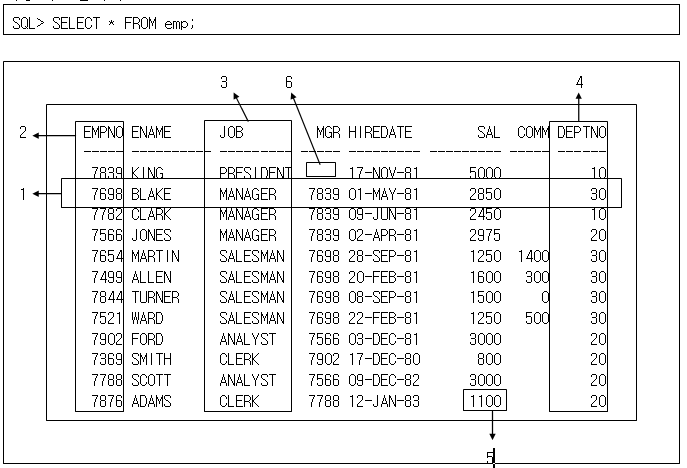

### [2019-04-24]

#### 1. Review
+ 지금까지 자바를 통해 프로그램 개발의 기초를 배워왔다.
+ 프로그램을 작성하는데, 필요한 데이터들은 메모리상에 올려 작동하는 형태.
+ 대량의 데이터를 사용자가 손쉽게 관리하는 전체적인 시스템을 "데이터페이스 시스템"이라고 한다.

#### 2. 데이터베이스(오라클) 개요
+ 한 조직의 응용 시스템에서 공유하기 위해서 통합되어 있고 저장된 운영 데이터의 집합.
  - 통합 데이터 : 최소한의 중복 허용
  - 저장되어진 데이터 : 자료구조를 가지고 있다.(일관성, 일치성, 강건성)
    - 저장되어진 데이터는 변경 시 관련되어진 작업영역에 동일 영향
  - 운용 데이터 : 자료의 조작, 정보의 산출
  - 공유 데이터 : 보안과 권한.

+ 데이타베이스(Database) : 한 조직의 응용 시스템에서 공유하기 위해서 통합되어 있고 저장된 운영 데이터의 집합(SW)

+ 용어설명
  - Table : RDBMS의 기본 Data 저장구조
  - Column : Table의 한 부분으로 Column명과 Data Type을 가지고 있음
  - Row : Table에 있는 필드집합의 하나(레코드의 동의어)
  - Primary key : Table에서 각 row를 유일하게 구분해주는 Column
  - Foreign key : 다른 table과 loin하기 위해 사용되어진 Column
  - Field : Table에서 row와 Column이 교차하는 곳에 있는 data
  - DBMS (Database Management System) : 데이타베이스의 자료를 저장할 구조를 만들고, 조작하고, 값의 일치성을 보장하기 위한  물적자원(하드웨어,소프트웨어)과 인적자원(관리자,분석가,설계가,프로그래머,DBA,OP등) 및  그 관리 체계를 통칭

##### [오라클 학습]
+ 1) 직접 tool을 사용하여 oracle서버에 접속하여 sql명령을 사용하여 db를 조작/운영
  - (1)기본제공 tool : sql*plus(SQL Command Line)  --- Text mode(CUI)
  - (2)외부 tool (다양) : sqldeveloper (그중 하나)  --- Window mode(GUI)
+ 2) Java Application에서의 사용
  - JDBC학습 --> java.sql 패키지의 다양한 클래스 사용

```
오라클을 설치한후 오라클데이타베이스 서버 작동구조
 ==================================================

 tool(sql*plus)            오라클 서버
사 ------------| SQL명령 ------>1)SQL 엔진         실제데이타를 저장/관리 하는 객체
용|		 | 	                            --------------------------------------------------------
자| 		 | <------결과---프로그램실행<--->|테이블(table), 인덱스(index), 시퀀스(sequence) ,.....   |
  |            |                        --------------------------------------------------------
   ------------|
   자체명령
   SQL명령  ==> 명령끝에 세미콜론(;)을 사용한다.
```

##### 명령어 사용
```
--------------------------------------------- sql*plus 자체명령
- SQL> CONNECT
- SQL> SHOW USER  ==> 현재 사용자 즉, 접속자명 보여주기
- SQL> CLEAR SCREEN ==> 화면지우기
- SQL> SET PAGESIZE 50
- SQL> SET LINESIZE 120 ==>화면에대한 설정
- SQL> DESC 테이블명      ==> 테이블 구조 보여주기
***SQL*PLUS자체명령은 앞4글자만 사용해도 된다.
---------------------------------------------- sql명령
- SQL> SELECT * FROM TAB;      ==> 현재 사용자가 사용할 수 있는 테이블 정보 보여달라.
- SQL> SELECT * FROM 테이블명;==> 해당 테이블의 내용을 보여달라
```

```
1.1 관계형 모델의 구성요소
1)	데이터를 저장하는 객체(object) 또는 관계(relation)들의 집합
2)	다른 관계를 생성하기 위해 관계에 가해지는 일련의 연산자 집합
3)	정확성과 일관성을 위한 데이터의 무결성(Integrity)

1.2 관계형 데이터베이스 기능
관계(relation)형 데이터베이스는 정보 저장을 위해 관계나 2차원 테이블을 이용한다.
1)	데이터의 저장을 관리한다.
2)	데이터에 대한 ACCESS을 통제한다.
3)	데이터를 검색 및 수정하기 위한 수단을 제공한다.
```

+ 관계형 모델의 3대 구성요소
  - 1) 자료구조(데이터 저장구조 및 다른 데이터와의 관계)
  - 2) 정보추출에 필요한 기능 ==> 연산자
  - 3) 결함이 없는 데이터 관리 ==> 무결성 제약조건


+ 관계형 데이터베이스의 정리
  - 1)E.F.Codd 박사는 1970년 데이터베이스 시스템용 관계형 모델을 제안
  - 2)제시한 관계형 모델은 관계형 데이터베이스 관리 시스템의 기본이 된다.
  - 3)관계형 모델링은 다음 구성요소를 포함하고 있다.
    - (1)객체(object) 또는 관계(relation)의 집합
    - (2)관계(relation)에 가해지는 연산의 집합
    - (3)정확성 및 일관성을 위한 데이터의 무결성
  - 4)관계형 데이터베이스는 2차원 테이블 형태로 구성된다.
  - 5)각 테이블은 Row와 Column으로 구성되어 있다.
  - 6)각 행의 데이터는 유일하다.
  - 7)각 column은 데이터 무결성을 유지한다.
  - 8)SQL 명령어를 실행함으로 행들의 데이터를 조작 가능하다.
```
[반드시 기억하자!!]
테이블에 데이터를 저장한다.
테이블은 행과 열로 구서되어 있다. (ROW, COLUMN)
행(ROW)은 1건의 논리적인 데이터를 의미한다.

```

#### 3. SELECT문

```
1.특정 종업원에 대한 모든 데이터를 나타내는 단일 row(오라클) 또는 tuple 입니다.
  기본 키(primary key)에 의해 식별되어져야 합니다.

2.기본 키(primary key)인 종업원 번호를 포함하는 열(column) 또는 속성(attribute)입니다.
  종업원 번호는 EMP테이블에서 유일한(unique) 종업원을 식별합니다.

3.키 값이 아닌 열 입니다. 열은 테이블에서 한 종류의 데이터를 나타냅니다.

4.부서 번호를 포함하는 열은 외래 키(foreign key)입니다.
  외래 키는 테이블 간에 서로 어떻게 관련되었는가를 정의합니다.
  외래 키는 다른 테이블의 기본 키 또는 고유 키를 참조합니다.

5.필드(field) 는 행과 열의 교차되는 곳에 있습니다.

6.필드는 그 안에 값을 가지지 않을 수도 있습니다. 이것은 null value라 불립니다.
  EMP테이블에서 영업 사원인 종업원만이 COMM(commission)필드에서 값을 가집니다.
```
#### 4. 자료형
#### 5. 연산자
#### 6. 실습
#### 7. Summary / Close

-----------------------------------------------------------


### [2019-04-25]

#### 1. Review
#### 3. 실습
#### 4. Summary / Close

-----------------------------------------------------------


### [2019-04-26]

#### 1. Review
#### 3. 실습
#### 4. Summary / Close

-----------------------------------------------------------
