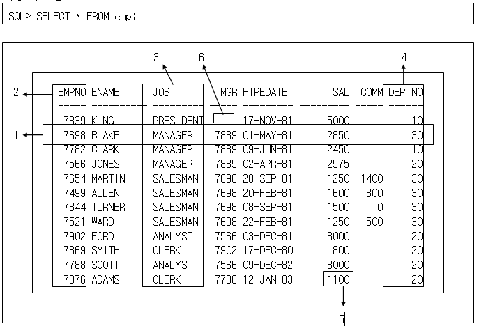

### [2019-04-24]

#### 1. Review
+ 지금까지 자바를 통해 프로그램 개발의 기초를 배워왔다.
+ 프로그램을 작성하는데, 필요한 데이터들은 메모리상에 올려 작동하는 형태.
+ 대량의 데이터를 사용자가 손쉽게 관리하는 전체적인 시스템을 "데이터페이스 시스템"이라고 한다.

#### 2. 데이터베이스(오라클) 개요
+ 한 조직의 응용 시스템에서 공유하기 위해서 통합되어 있고 저장된 운영 데이터의 집합.
  - 통합 데이터 : 최소한의 중복 허용
  - 저장되어진 데이터 : 자료구조를 가지고 있다.(일관성, 일치성, 강건성)
    - 저장되어진 데이터는 변경 시 관련되어진 작업영역에 동일 영향
  - 운용 데이터 : 자료의 조작, 정보의 산출
  - 공유 데이터 : 보안과 권한.

+ 데이타베이스(Database) : 한 조직의 응용 시스템에서 공유하기 위해서 통합되어 있고 저장된 운영 데이터의 집합(SW)

+ 용어설명
  - Table : RDBMS의 기본 Data 저장구조
  - Column : Table의 한 부분으로 Column명과 Data Type을 가지고 있음
  - Row : Table에 있는 필드집합의 하나(레코드의 동의어)
  - Primary key : Table에서 각 row를 유일하게 구분해주는 Column
  - Foreign key : 다른 table과 loin하기 위해 사용되어진 Column
  - Field : Table에서 row와 Column이 교차하는 곳에 있는 data
  - DBMS (Database Management System) : 데이타베이스의 자료를 저장할 구조를 만들고, 조작하고, 값의 일치성을 보장하기 위한  물적자원(하드웨어,소프트웨어)과 인적자원(관리자,분석가,설계가,프로그래머,DBA,OP등) 및  그 관리 체계를 통칭

##### [오라클 학습]
+ 1) 직접 tool을 사용하여 oracle서버에 접속하여 sql명령을 사용하여 db를 조작/운영
  - (1)기본제공 tool : sql*plus(SQL Command Line)  --- Text mode(CUI)
  - (2)외부 tool (다양) : sqldeveloper (그중 하나)  --- Window mode(GUI)
+ 2) Java Application에서의 사용
  - JDBC학습 --> java.sql 패키지의 다양한 클래스 사용

```
오라클을 설치한후 오라클데이타베이스 서버 작동구조
 ==================================================

 tool(sql*plus)            오라클 서버
사 ------------| SQL명령 ------>1)SQL 엔진         실제데이타를 저장/관리 하는 객체
용|		 | 	                            --------------------------------------------------------
자| 		 | <------결과---프로그램실행<--->|테이블(table), 인덱스(index), 시퀀스(sequence) ,.....   |
  |            |                        --------------------------------------------------------
   ------------|
   자체명령
   SQL명령  ==> 명령끝에 세미콜론(;)을 사용한다.
```

##### 명령어 사용
```
--------------------------------------------- sql*plus 자체명령
- SQL> CONNECT
- SQL> SHOW USER  ==> 현재 사용자 즉, 접속자명 보여주기
- SQL> CLEAR SCREEN ==> 화면지우기
- SQL> SET PAGESIZE 50
- SQL> SET LINESIZE 120 ==>화면에대한 설정
- SQL> DESC 테이블명      ==> 테이블 구조 보여주기
***SQL*PLUS자체명령은 앞4글자만 사용해도 된다.
---------------------------------------------- sql명령
- SQL> SELECT * FROM TAB;      ==> 현재 사용자가 사용할 수 있는 테이블 정보 보여달라.
- SQL> SELECT * FROM 테이블명;==> 해당 테이블의 내용을 보여달라
```

```
1.1 관계형 모델의 구성요소
1)	데이터를 저장하는 객체(object) 또는 관계(relation)들의 집합
2)	다른 관계를 생성하기 위해 관계에 가해지는 일련의 연산자 집합
3)	정확성과 일관성을 위한 데이터의 무결성(Integrity)

1.2 관계형 데이터베이스 기능
관계(relation)형 데이터베이스는 정보 저장을 위해 관계나 2차원 테이블을 이용한다.
1)	데이터의 저장을 관리한다.
2)	데이터에 대한 ACCESS을 통제한다.
3)	데이터를 검색 및 수정하기 위한 수단을 제공한다.
```

+ 관계형 모델의 3대 구성요소
  - 1) 자료구조(데이터 저장구조 및 다른 데이터와의 관계)
  - 2) 정보추출에 필요한 기능 ==> 연산자
  - 3) 결함이 없는 데이터 관리 ==> 무결성 제약조건


+ 관계형 데이터베이스의 정리
  - 1)E.F.Codd 박사는 1970년 데이터베이스 시스템용 관계형 모델을 제안
  - 2)제시한 관계형 모델은 관계형 데이터베이스 관리 시스템의 기본이 된다.
  - 3)관계형 모델링은 다음 구성요소를 포함하고 있다.
    - (1)객체(object) 또는 관계(relation)의 집합
    - (2)관계(relation)에 가해지는 연산의 집합
    - (3)정확성 및 일관성을 위한 데이터의 무결성
  - 4)관계형 데이터베이스는 2차원 테이블 형태로 구성된다.
  - 5)각 테이블은 Row와 Column으로 구성되어 있다.
  - 6)각 행의 데이터는 유일하다.
  - 7)각 column은 데이터 무결성을 유지한다.
  - 8)SQL 명령어를 실행함으로 행들의 데이터를 조작 가능하다.
```
[반드시 기억하자!!]
테이블에 데이터를 저장한다.
테이블은 행과 열로 구서되어 있다. (ROW, COLUMN)
행(ROW)은 1건의 논리적인 데이터를 의미한다.
1건의 데이터를 구성하는 개별 항목을 열(COLUMN)이라고 부른다.
모든 행은 식별성을 가지고 있어야 한다.(중복불가)

기본키(Primary Key : PK)
다른테이블과 연결되는 컬럼을 외래키(Foreign Key : FK)
NULL(널) 값 : 값이 없다. 값이 지정되지 않았다. (0아님)

데이터베이스에서 스키마(저장구조)
내부적인 상세한 구조 -- 내부 스키마(공개되지 않는다.)
외부적인 사용법에 필요한 구조 -- 외부 스키마(공개됨.)

테이블의 외부 스키마 ==> DESC 테이블명

SQL명령을 사용하여 DB관리에 필요한 모든 기능을 수행한다.
즉, 추가/수정/삭제/정렬/검색 등의 모든 명령
```

+ 오라클에서 사용되는 객체들
  - 1) 테이블(TABLE) : 핵심. ROW와 COLUMN으로 구성된 기본적인 저장 단위
  - 2) VIEW : 하나 이상의 TABLE로부터 논리적으로 데이터를 분류한 부분집합
  - 3) INDEX : 포인터를 사용하여 행의 검색 속도를 향상
  - 4) SEQUENCE : 자동적으로 ORACLE SERVER이 유일 번호를 생성
  - 5) WYNONYM : 객체에 대체 이름을 부여
  - 6) PROGRAM UNIT : SQL또는 PL/SQL 문으로 작성한 PROCEDURE, FUNCTION, PACKAGE
  - 7) SQL로 작성된 프로그램(변수, 제어문 ==> 함수, 프로시저, 패키지)

+ 현재의 TOOL에서 사용하는 명령어
  - 1) 자체명령어(CONNECT, DESC, SHOW USER, CLEAR SCREEN, SPOOL) - 오라클
  - 2) SQL명령(SELECT)

```
  [용어정리]
  1) SQL : 데이터페이스를 조작하는 명령
  2) sql*plus : 현재 사용하고 있는 tool 명칭(SQL Command Line)
    -----> 여기서 SQL명령을 작성하고 실행시키면 데이터베이스 서버로 명령을 넘겨준다.
          서버에서 명령을 해석하여 해당 기능을 작동시키고(SQL엔진), 그결과를 다시 tool에 전송.
          이 결과값을 보기 좋게 보여준다.
  3) PL/SQL : SQL명령을 사용하여 프로그램 작성가능. 이를 DB에 저장해 놓고 필요할때 호출사용.
```

+ SQL명령의 종류
  - 1) 검색/질의(Query) : SELECT
  - 2) DML(데이터 조작 명령) : 추가(INSERT), 수정(UPDATE), 삭제(DELETE)
  - 3) DDL(데이터저장구조) : 테이블/생성(CREATE TABLE), /구조변경(ALTER TABLE), /삭제(DROP TABLE)
  - 4) TCL(트랜잭션 관리) : COMMIT, ROLLBACK, SAVEPOINT
  - 5) DCL(권한, 보안) : GRANT, REVOKE

#### 3. SELECT문

```
1.특정 종업원에 대한 모든 데이터를 나타내는 단일 row(오라클) 또는 tuple 입니다.
  기본 키(primary key)에 의해 식별되어져야 합니다.

2.기본 키(primary key)인 종업원 번호를 포함하는 열(column) 또는 속성(attribute)입니다.
  종업원 번호는 EMP테이블에서 유일한(unique) 종업원을 식별합니다.

3.키 값이 아닌 열 입니다. 열은 테이블에서 한 종류의 데이터를 나타냅니다.

4.부서 번호를 포함하는 열은 외래 키(foreign key)입니다.
  외래 키는 테이블 간에 서로 어떻게 관련되었는가를 정의합니다.
  외래 키는 다른 테이블의 기본 키 또는 고유 키를 참조합니다.

5.필드(field) 는 행과 열의 교차되는 곳에 있습니다.

6.필드는 그 안에 값을 가지지 않을 수도 있습니다. 이것은 null value라 불립니다.
  EMP테이블에서 영업 사원인 종업원만이 COMM(commission)필드에서 값을 가집니다.
```

+ 자체명령과 SQL명령 구분 ==> 세미콜론(;)
+ 모든명령에서 keyword(예약어)는 대문자로 기술하자!! (관례적 규칙)
+ 사용자정의어(테이블명, 컬럼명)은 소문자로 기술하자!! (관례적 규칙)

+ 가장 기본적인 명령
  - 테이블에서 데이터를 검색하는 질의명령 ==> SELECT

+ SELECT
  - SELECT문을 사용하여 원하는 정보를 테이블에서 추출할 수 있다.
  - SELECT문은 내부적으로 (원하는 행추출 ==> selection 연산, 원하는 컬럼추출 ==> projection, 다른테이블과 연결하는 것 ==> join) 기능을 수행한다.
  - 사용법
    - ```SELECT {*,column명 [별칭],...} FROM 테이블명 [WHERE 조건] [ORDER BY {컬럼, 표현식}] [ASC|DESC]; ```

  - 현재 계정소유자가 사용할 수 있는 테이블 목록보기
    - ```SELECT * FROM TAB```
    - 원래 테이블명은 사용자가 지정하여 만든다. 단, 내부적으로 저장될때는 대문자로 저장된다.
    - 사용할때는 소문자로 테이블명을 기술하겠지만... 내부적으로 대문자로 저장되어 있음.(주의)

  - SELECT문의 결과값이 보여지는 순서는 ORDER BY절을 사용하지 않는이상 임의적이다(교재와 결과가 다를 수 있다.)

+ SET HEADING ON/OFF
  - 최상단의 구분행을 보여줄지 여부.
  - 사용법
    - ```SET HEADING OFF``` 또는 ```SET HEADING ON```

+ SQL명령을 사용할때 미리 알고 있어야 하는 테이블의 개략구조 알아보기
  - DESCRIBE(DESC) 테이블명
  - emp테이블의 구조
    - ```DESC emp```
    - 테이블에 저장될 값의 종류 ==> SQL 데이터 타입(자료형)
    - 대표적인 자료형
      + 문자 : 고정길이문자(CHAR), 가변길이문자(VARCHAR2)
      + 숫자 : 정수(NUMBER)or(NUMBER(자릿수)), 실수(NUMBER(전체자릿수,소숫점이하자릿수))
      + 날짜 : DATE(년월일시분초MS) ==> 내부적으로는 무조건 7byte사용

+ 현재의 날짜를 표현하는 예약어 ==> SYSDATE
+ 참고) literal 값을 직접 표현할때 숫자는 그대로, 문자는'가','JICA'

+ NULL값의 처리
  - NULL은 이용할 수 없고 할당되지 않고 알려져 있지않고 적용 불가한 값을 의미한다.
  - NULL이란 0나 공백(space)과 다르다.
  - 널 값을 포함한 산술 표현식 결과는 NULL이 된다.
  - column에 데이터 값이 없으면 그 값 자체가 널 또는 널 값을 포함하고 있다.
  - 널 값은 1바이트의 내부 저장 장치를 오버헤드로 사용하고 있으며 어떠한 datatype column들이라도 널 값을 포함할 수 있다.
  - NULL이면 0으로 처리되게 하는 함수(FUNCTION)이 ==> ```NVL(컬럼명,대체값)```이다.
    - ```SELECT empno, ename, sal, comm, sal*12+NVL(comm,0) FROM emp;```
  - SELECT문의 컬럼명을 대신하는 별칭을 만들어서 사용할 수 있다.
    - ```SELECT 컬럼명 AS 별칭```
    - ```SELECT 컬럼명 별칭```
    - 단, 공백을 포함한 별칭을 사용할때는 " "을 사용한다.
    - Oracle의 SQL명령에서 더블쿼테이션("")의 사용은 극히 드물다. 거의 이때만 사용.

+ SELECT문을 사용하면서, '자료형', '연산자', '함수' 등을 사용한다.

+ 중복행을 제거할때 DISTINCT를 사용한다.
  - EMP 테이블에서 담당하고 있는 업무의 종류를 출력 : ```SELECT DISTINCT job FROM emp;```
  - 부서별로 담당하는 업무를 한번씩 부서번호 오름차순 출력 : ```SELECT DISTINCT deptno, job FROM emp ORDER BY deptno;```


#### 4. 실습
#### 7. Summary / Close

-----------------------------------------------------------

### [2019-04-25]

#### 1. Review

#### 2. SQL문 실습
+ 조건을 기술할때 다양한 연산자를 사용할 수 있다.
  - ```SELECT * FROM emp WHERE sal >= 3000;```
  - INITCAP() : 괄호안의 정보에서 앞글자만 대문자로 변환

+ 연산자의 종류
  - 1) 산술연산자 : +, -, `*`, /, MOD()
  - 2) 비교연산자 : =, !=, <>, ^=, >, >=, <, <=
  - 3) 논리연산자 : AND, OR, NOT
  - 4) SQL연산자 : BETWEEN AND, IN, LIKE, IS NULL, NOT NULL
  - 5) 기타연산자 : DECODE, CASE WHEN

+ 날짜값(DATE)을 표현할때는 사용하는 지역과 언어에 따라 표현형식이 달라질수 있다.
  - SQL문장에서 문자데이터와 날짜데이터를 직접 기술할때는 반드시 단일 인용 부호('')사용.
  - 미국표현식으로...
    + ```ALTER SESSION SET NLS_DATE_FORMAT = 'DD-MON-YY';``` 날짜형식 변환
      - DD는 후에 4자리로 항상 검색해야됨.... RR을 쓰면 2자리로도 인식가능.
    + ```ALTER SESSION SET NLS_LANGUAGE = AMERICAN;``` 미국식으로 언어를 바꿈
    + ```SELECT empno, ename, job, sal, hiredate, deptno FROM emp WHERE hiredate >= '01-JAN-1982';``` 4자리 연도를 표시해야 인식됨.

  - 한국표현식으로...
    + ```ALTER SESSION SET NLS_DATE_FORMAT = 'RR/MM/DD';``` 2자리연도/월/날
    + ```ALTER SESSION SET NLS_LANGUAGE = KOREAN;``` 한국식으로 표기

+ 논리연산자(AND, OR, NOT)  ==> JAVA에서 &&, ||, !
  - AND연산자 : ```SELECT empno,ename,job,sal,hiredate,deptno FROM emp WHERE sal >= 1100 AND job = 'MANAGER';```
  - OR연산자 :  ```SELECT empno,ename,job,sal,hiredate,deptno FROM emp WHERE sal >= 1100 OR job = 'MANAGER';```
  - OR연산자 : ```SELECT * FROM emp WHERE job='MANAGER' OR job='CLERK' OR job='ANALYST';```
  - NOT연산자 :  ```SELECT * FROM emp WHERE NOT(job='MANAGER' OR job='CLERK' OR job='ANALYST');```

  - AND, OR, NOT의 연산자 사용법은 Java언어에서 &&,||,!의 사용법과 동일하다.

+ SQL에서만 사용하는 SQL연산자가 있다.
  - 1) BETWEEN AND ====> AND연산의 단순표현
    + ```SELECT * FROM emp WHERE sal >= 1250 AND sal <= 1500;```
    + 같은표현으로 ```SELECT * FROM emp WHERE sal BETWEEN 1250 AND 1500;```
    + AND연산으로 표현된 식의 결과 범위를 가지고 표현될때 BETWEEN a AND b 로 대치가능.

  - 2) IN ====> OR연산의 단순표현
    + ```SELECT * FROM emp WHERE empno=7902 OR empno=7788 OR empno=7566;```
    + 같은표현으로 ```SELECT * FROM emp WHERE empno IN(7902,7788,7566);```
    + OR연산으로 표현된 등가비교의 값이 여러개일때 IN연산자로 대치가능.

  - 3) LIKE
    + LIKE연산은 문자열의 값을 와일드카드(%,`_`)를 사용하여 패턴비교를 수행한다.
    + S로시작하는 검색...```SELECT * FROM emp WHERE ename LIKE 'S%';```
    + S로끝나는 검색...```SELECT * FROM emp WHERE ename LIKE '%S';```
    + S가(어디든)들어가는 검색...```SELECT * FROM emp WHERE ename LIKE '%S%';```
    + 와일드카드 ```%``` 한글자도 없거나 한글자이거나, 두글자이거나, 여러글자여도 상관없다.
    + 와일드카드 ```_``` 한글자만 의미하고 어느글자이든 상관없다.
    + 5번째가S인 검색...```SELECT * FROM emp WHERE ename LIKE '____S';```
    + 82년도 검색... ```SELECT * FROM emp WHERE hiredate LIKE '82%';```
    + 참고
      - name에 값이 X_Y가 포함되어 있는 문자열을 조회하고자 할 경우 Escape를 사용한다
      - ```WHERE name LIKE ‘%X\_Y%’ ESCAPE ‘\’;```

  - 4) IS NULL, NOT NULL
    + 추가수당이 없는(null)인사람...```SELECT * FROM emp WHERE comm IS NULL;```
    + 추가수당이 없지(null) 않은사람...```SELECT * FROM emp WHERE NOT comm IS NULL;```
      - 위와 같은 표현.... ```SELECT * FROM emp WHERE comm IS NOT NULL;```
    + 에러에 유의.... 'IS NULL' <> 'IS NOT NULL' 또는 'NOT 컬럼 IS NULL'

+ WHERE조건절에 산술연산, 비교연산, 논리연산, SQL연산(BETWEEN AND, IN, LIKE, IS NULL)사용가능.

+ 우선 순위 규칙
  - 괄호 > 모든 비교 연산자 > NOT > AND > OR
  - 연산자도 우선순위가 있지만, 직접 괄호를 사용하여 우선순위를 명시적으로 지정하는 것이 좋음.

+ ORDER BY절을 사용하여 출력순서를 결정하자(SORT ==> 오름차순 ASC/내림차순 DESC)
  - 이름으로 오름차순... ```SELECT * FROM emp ORDER BY ename (ASC);```
  - 이름으로 내림차순... ```SELECT * FROM emp ORDER BY ename DESC;```
  - 급여1500이상 오름차순...```SELECT * FROM emp WHERE sal > 1500 ORDER BY sal;```
  - 정렬의 순서
    + 작은숫자 < 빠른날짜 < A-Z-a-z < NULL

  - 같은표현 3가지
    + ```SELECT empno, ename, job, sal, sal*12 AS Annsal FROM emp ORDER BY Annsal;```
    + ```SELECT empno, ename, job, sal, sal*12 AS Annsal FROM emp ORDER BY sal*12;```
    + ```SELECT empno, ename, job, sal, sal*12 AS Annsal FROM emp ORDER BY 5;```

  - 여러개 기준정렬
    + ```SELECT deptno, empno, ename, job, sal FROM emp ORDER BY deptno, sal DESC;```

```
SELECT 컬럼
FROM 테이블명
WHERE 조건
ORDER BY 정렬기준
GROUP BY
HAVING
```
+ 먼저 함수를 학습해야 GROUP BY와 HAVING을 적용할때 용이하다.

#### 3. 단일행 함수
+ 함수 : 특정 기능을 수행하는 명령어들의 모임(JAVA언어에서 메서드와 비슷)

+ 함수의 종류
  - 1) 단일행 함수 : 각 행(row)별로 함수를 적용시켜 결과를 만든다.
    + 각 함수마다 리턴값이 정해져 있다.
    + (1) 문자형 함수 : 문자를 입력 받고 문자와 숫자 값 모두를 RETURN할 수 있다.
      - 해당 컬럼을 소문자로...```SELECT empno, ename, LOWER(ename), sal FROM emp;```
      - ```SELECT empno, ename FROM emp WHERE LOWER(ename)='smith';```
      - 해당 문자의 숫자계산...```SELECT LENGTH('Oracle') FROM DUAL;```
```
[대소문자변환]
SQL> SELECT empno, ename, LOWER(job), deptno FROM emp WHERE LOWER(ename)='scott';

     EMPNO ENAME                LOWER(JOB)             DEPTNO
---------- -------------------- ------------------ ----------
      7788 SCOTT                analyst                    20

SQL> SELECT empno, ename, job FROM emp WHERE ename=UPPER('scott');

     EMPNO ENAME                JOB
---------- -------------------- ------------------
      7788 SCOTT                ANALYST

[문자열의 첫글자만 대문자로 변환 : INITCAP]
SQL> SELECT 'ORACLE DATABASE', INITCAP('ORACLE DATABASE') FROM DUAL;

'ORACLEDATABASE'               INITCAP('ORACLEDATABASE')
------------------------------ ------------------------------
ORACLE DATABASE                Oracle Database


[두 문자열을 합치는 함수 ==> CONCAT()]
SQL> COL e_name FORMAT A15
SQL> COL e_empno FORMAT A15
SQL> COL e_job FORMAT A15
SQL> SELECT empno,ename,job,CONCAT(empno,ename) e_name,
  2  CONCAT(ename,empno) e_empno,
  3  CONCAT(ename,job) e_job
  4  FROM emp
  5  WHERE deptno = 10;

긴 문장일때는 파일(*.sql)을 만들어서 실행(@경로\파일.sql)
이때... 실행과정을 보려면, ( SQL> SET ECHO ON )으로 설정

\\\\\\\\\\\\\\\\\\\\\\\\\\\\\\\\\\\\\\\\\\\\\\\\\\\\\\\\\\\\\\\\\
[숫자와 문자를 합치도록 CONCAT()을 사용하면 내부적으로 자동현변환]
SQL> SELECT empno, ename, CONCAT(empno,ename), CONCAT(ename,empno) FROM emp;
---------------------------------------> 가독성이 없어서 수정이 필요함.
SQL> COL e_name FORMAT A15  -> 결과값으로 문자 15자리를 출력할수 있는 공간확보.


[SQL 자료형]
SQL> DESC emp
 Name                               Null?    Type
 --------------------------------- -------- --------------------------------------------
 EMPNO                             NOT NULL  NUMBER(4)
 ENAME                                       VARCHAR2(10)
 JOB                                         VARCHAR2(9)
 MGR                                         NUMBER(4)
 HIREDATE                                    DATE
 SAL                                         NUMBER(7,2)
 COMM                                        NUMBER(7,2)
 DEPTNO

CHAR(10) ==> 고정길이 문자열
VARCHAR2(10) ==> 가변길이 문자열
NUMBER(5) ==> 고정길이 정수
NUMBER ==> 가변길이 정수
============================================================
[SUBSTR() : 부분문자열 발췌함]
SQL> SELECT 'ORACLE JICA', SUBSTR('ORACLE JICA', 8, 4) FROM DUAL;

'ORACLEJICA'           SUBSTR('
---------------------- --------
ORACLE JICA            JICA
\\\\\\\\\\\\\\\\\\\\\\\\\\\\\\\\\\\\\\\\\\\\\\\\\\\\\\\\\\\\\\\\
SQL> SELECT * FROM emp WHERE SUBSTR(ename, 1,1) > 'K' AND SUBSTR(ename,1,1) < 'Y' ORDER BY ename;

EMPNO ENAME         JOB                MGR HIREDATE        SAL       COMM     DEPTNO
----- -------  ---------------- ---------- -------- ---------- ---------- ----------
7654 MARTIN        SALESMAN          7698 81-09-28       1250       1400         30
7934 MILLER        CLERK             7782 82-01-23       1300                    10
7788 SCOTT         ANALYST           7566 87-04-19       3000                    20
7369 SMITH         CLERK             7902 80-12-17        800                    20
7844 TURNER        SALESMAN          7698 81-09-08       1500          0         30
7521 WARD          SALESMAN          7698 81-02-22       1250        500         30

6 rows selected.
=============================================================

[LENGTH() 문자열의 길이 구하기]
SQL> SELECT LENGTH('전주'), LENGTH('jeonju') FROM DUAL;

LENGTH('전주') LENGTH('JEONJU')
-------------- ----------------
             2                6
LENGTH(문자열), LENGTH(숫자)-내부적으로 자동형변환(NUMBER->CHAR)
문자함수는 문자형을 매개변수로 사용하고 결과값을 문자값 혹은 숫자값을 리턴한다.


[INSTR() 문자열에서 지정한 문자열의 위치를 검색]
SQL> SELECT INSTR('DataBase', 'B') FROM DUAL;

INSTR('DATABASE','B')
---------------------
                    5
\\\\\\\\\\\\\\\\\\\\\\\\\\\\\\\\\\\\\\\\\\\\\\\\\\\\\\\\\\\\\\\\\\\\
SQL> SELECT INSTR('DataBase', 'a', 1, 3) FROM DUAL;

INSTR('DATABASE','A',1,3)
-------------------------
                        6
\\\\\\\\\\\\\\\\\\\\\\\\\\\\\\\\\\\\\\\\\\\\\\\\\\\\\\\\\\\\\\\\\\\\\
SQL> SELECT ename, INSTR(ename,'L') e_null,
  2                          INSTR(ename,'L',1,1) e_11,
  3                          INSTR(ename,'L',1,2) e_12,
  4                          INSTR(ename,'L',4,1) e_41,
  5                          INSTR(ename,'L',4,2) e_42
  6  FROM emp
  7  ORDER BY ename;

ENAME                    E_NULL       E_11       E_12       E_41       E_42
-------------------- ---------- ---------- ---------- ---------- ----------
ADAMS                         0          0          0          0          0
ALLEN                         2          2          3          0          0
BLAKE                         2          2          0          0          0
CLARK                         2          2          0          0          0
FORD                          0          0          0          0          0


===============================================================

[LPAD(), RPAD() : 지정한 문자열의 왼/오른쪽에 특정문자로 채움]
SQL> SELECT 'MILLER', LPAD('MILLER',10,'*'), RPAD('MILLER',10,'X') FROM DUAL;

'MILLER'     LPAD('MILLER',10,'*' RPAD('MILLER',10,'X'
------------ -------------------- --------------------
MILLER       ****MILLER           MILLERXXXX

================================================================

[LTRIM() : 왼쪽에서 지정문자제거]
SQL> SELECT 'MILLER', LTRIM('MILLER','M'), RTRIM('MILLER','R') FROM DUAL;

'MILLER'     LTRIM('MIL RTRIM('MIL
------------ ---------- ----------
MILLER       ILLER      MILLE

SQL> SELECT ename, job, LTRIM(job,'A'), sal, LTRIM(sal,'1') FROM emp;

==============================================================

[TRANSLATE, REPLACE ==> 다른 문자열로 대체]
SQL> SELECT TRANSLATE('MILLER','L','*') FROM DUAL;

TRANSLATE('M
------------
MI**ER
///////////////////////////////////////////////////////
SQL> SELECT TRANSLATE('MILLER','MLE','X*@') FROM DUAL;

TRANSLATE('M
------------
XI**@R
///////////////////////////////////////////////////////

TRANSLATE()는 지정한 글자를 새로운 문자로 변환

==================================================================

[REPLACE() : 원래 문자열(여러문자)을 새로운 문자열로 대체시킨다.]
SQL> SELECT REPLACE('JACK AND JUE', 'J', 'BL') FROM DUAL;

REPLACE('JACKANDJUE','J','BL
----------------------------
BLACK AND BLUE


오라클 내부에서는 한글한글자를 저장하기 위해 실제 사용하는 BYTE는 3byte
```
    + (2) 숫자형 함수 : 숫자를 입력 받고 숫자를 RETURN한다.
    + (3) 날짜형 함수 : 날짜형에 대해 수행하고 숫자를 RETURN하는 MONTHS_BETWEEN 함수를 제외하고 모두 날짜 데이터형의 값을 RETURN한다.
    + (4) 형변환함수 : 어떤 데이터형의 값을 다른 데이터형으로 변환한다.
    + (5) 기타함수

  - 2) 그룹 함수 : 여러행(전체행, GROUP지정행들)을 대상으로 하나의 결과를 만든다.
    + 그룹함수는 7개 밖에 없다.
    + ```SELECT deptno, COUNT(deptno) FROM emp GROUP BY deptno;```

```
SQL> SELECT 2*5 FROM dept;

       2*5
----------
        10
        10
        10
        10
```

+ 오라클 내부에 1개의 row를 가진 임시테이블이 있다. 이 테이블을 DUAL테이블이다.
```
SQL> SELECT 2*5 FROM DUAL;

       2*5
----------
        10
```
  - DUAL : 임의의 테이블, 가상테이블(dummy 테이블) ==> DUAL

+ 오라클 학습시 참고 사이트(http://www.gurubee.net/)
  - 키워드는 대문자로 하자
  - 사용자 정의어 즉, 테이블명, 컬럼명은 소문자로 기술하자
  - 함수명도 대문자로 작성하자  <=======관례적 규칙

  - 문자열 합치기 연산자 ==> ||

##### [오늘의 과제]
+ 3.doc 연습문제 풀기

#### 3. 실습
#### 4. Summary / Close

-----------------------------------------------------------


### [2019-04-26]

#### 1. Review
#### 2. 단일행 함수
+ 숫자함수 : 숫자데이터를 매개변수로 사용하여 결과값을 숫자로 가진다.
```
[ROUND() 반올림 함수]
SQL> SELECT 456.789, ROUND(456.789, 2) FROM DUAL;

   456.789 ROUND(456.789,2)
---------- ----------------
   456.789           456.79
=========================================================================
DUAL테이블 : 현재 계정사용자가 만들지 않았지만 사용가능한 테이블(DUMMY TABLE)

SQL> DESC DUAL
Name                               Null?    Type
-------------------------------- -------- -------------------------------------------
DUMMY                                                                      VARCHAR2(1)

SQL> SELECT * FROM DUAL;

DU
--
X
============================================================================
[TRUNC() 버림(절삭)함수]
SQL> SELECT TRUNC(456.789,2) FROM DUAL;

TRUNC(456.789,2)
----------------
          456.78

SQL> SELECT TRUNC(4567.678), TRUNC(45673.678,0), TRUNC(4567.678,2), TRUNC(4567.678, -2) FROM DUAL;

TRUNC(4567.678) TRUNC(45673.678,0) TRUNC(4567.678,2) TRUNC(4567.678,-2)
--------------- ------------------ ----------------- ------------------
           4567              45673           4567.67               4500
=============================================================================
[MOD() 자바언어의 %연산자와 동일하게 나머지를 구한다.]
- 자바에서는 정수끼리 여산을 하면 정수값을 구해주었다. SQL에서는 정수끼리 연산도 실수결과값을 나타낸다.
SQL> SELECT 10/3, MOD(10,3) FROM DUAL;

      10/3  MOD(10,3)
---------- ----------
3.33333333          1

SQL> SELECT TRUNC(10/3) FROM DUAL;

TRUNC(10/3)
-----------
          3
===============================================================================

[POWER(), SQRT(), SIGN()]
SQL> SELECT POWER(2,3), SQRT(4), SIGN(-100) FROM DUAL;

POWER(2,3)    SQRT(4) SIGN(-100)
---------- ---------- ----------
         8          2         -1
===============================================================================

[CHR(아스키코드값)->문자]
SQL> SELECT empno,ename,job,ename || CHR(10) || job FROM emp WHERE deptno=20;

     EMPNO ENAME                JOB                ENAME||CHR(10)||JOB
---------- -------------------- ------------------ ---------------------
      7369 SMITH                CLERK              SMITH
                                                   CLERK

      7566 JONES                MANAGER            JONES
                                                   MANAGER
```

+ 날짜함수
  - 날짜데이터를 대상으로 기능을 수행하여 날짜값을 리턴한다. (단, MONTHS_BETWEEN() 숫자리턴)
```
[DATE 내부적으로 7BYTE 사용, 세기 년/월/일/시/분/초/1/1000초]
- 현재 날짜와 시각 ==> SYSDATE
SQL> SELECT SYSDATE FROM DUAL;
SYSDATE
--------
19/04/26
////////////////////////////////////////////////////////////////////
- 기본적으로 정수 +,- 가능
SQL> SELECT SYSDATE, SYSDATE+1, SYSDATE-1, SYSDATE+30 FROM DUAL;

SYSDATE  SYSDATE+ SYSDATE- SYSDATE+
-------- -------- -------- --------
19/04/26 19/04/27 19/04/25 19/05/26
////////////////////////////////////////////////////////////////////
- 날짜끼리의 -(뺄셈)연산
- 형변환 함수(TO_DATE())가 필요하다.
SQL> SELECT SYSDATE-TO_DATE('19/03/11','RR/MM/DD') FROM DUAL;

SYSDATE-TO_DATE('19/03/11','RR/MM/DD')
--------------------------------------
                            46.4315625
///////////////////////////////////////////////////////////////////
[날짜표현 방법]
- ALTER SESSION SET NLS_DATE_FORMAT='RR/MM/DD';
- ALTER SESSION SET NLS_LANGUAGE='KOREAN';

<문제풀이>
SQL> SELECT ename,hiredate,SYSDATE,SYSDATE - hiredate "Total Days",
  2          TRUNC((SYSDATE - hiredate) / 7, 0) Weeks,
  3          ROUND(MOD((SYSDATE - hiredate), 7), 0) DAYS
  4  FROM emp
  5  ORDER BY SYSDATE - hiredate DESC;

ENAME                HIREDATE SYSDATE  Total Days      WEEKS       DAYS
-------------------- -------- -------- ---------- ---------- ----------
SMITH                80/12/17 19/04/26 14009.4433       2001          2
ALLEN                81/02/20 19/04/26 13944.4433       1992          0
WARD                 81/02/22 19/04/26 13942.4433       1991          5
JONES                81/04/02 19/04/26 13903.4433       1986          1


//////////////////////////////////////////////////////////////////////////////
[MONTHS_BETWEEN() 두날짜 사이의 월수를 계산]
SQL> SELECT MONTHS_BETWEEN(SYSDATE, TO_DATE('20150508','YYYYMMDD')) FROM DUAL;

MONTHS_BETWEEN(SYSDATE,TO_DATE('20150508','YYYYMMDD'))
------------------------------------------------------
                                            47.5950329

SQL> SELECT ename,hiredate,SYSDATE,MONTHS_BETWEEN(SYSDATE,hiredate) m_between,
  2          TRUNC(MONTHS_BETWEEN(SYSDATE,hiredate),0) t_between
  3  FROM emp
  4  WHERE deptno = 10
  5  ORDER BY MONTHS_BETWEEN(SYSDATE,hiredate) DESC;

ENAME                HIREDATE SYSDATE   M_BETWEEN  T_BETWEEN
-------------------- -------- -------- ---------- ----------
CLARK                81/06/09 19/04/26 454.562819        454
KING                 81/11/17 19/04/26 449.304755        449
MILLER               82/01/23 19/04/26 447.111206        447
//////////////////////////////////////////////////////////////////////
[ADD_MONTHS() 날짜에 월(개월수)을 더한다]
SQL> SELECT SYSDATE, ADD_MONTHS(SYSDATE, 5) FROM DUAL;

SYSDATE  ADD_MONT
-------- --------
19/04/26 19/09/26
/////////////////////////////////////////////////////////////////////
[NEXT_DAY() 돌아오는 요일을 계산]
- 요일지정 숫자 : 일요일(1), 월요일(2)....토요일(7)
SQL> SELECT SYSDATE, NEXT_DAY(SYSDATE, 2) FROM DUAL;

SYSDATE  NEXT_DAY
-------- --------
19/04/26 19/04/29

SQL> SELECT SYSDATE, NEXT_DAY(SYSDATE, '월요일') FROM DUAL;

SYSDATE  NEXT_DAY
-------- --------
19/04/26 19/04/29

<문제풀이>
SQL> SELECT ename,hiredate,NEXT_DAY(hiredate,'금요일') n_day,
  2                        NEXT_DAY(hiredate,6) n_6,
  3                        NEXT_DAY(hiredate,7) n_7
  4  FROM emp
  5  WHERE deptno = 10
  6  ORDER BY hiredate DESC;

ENAME                HIREDATE N_DAY    N_6      N_7
-------------------- -------- -------- -------- --------
MILLER               82/01/23 82/01/29 82/01/29 82/01/30
KING                 81/11/17 81/11/20 81/11/20 81/11/21
CLARK                81/06/09 81/06/12 81/06/12 81/06/13
/////////////////////////////////////////////////////////////////////

[LAST_DAY() 해당월의 마지막 날짜]
SQL> SELECT SYSDATE, LAST_DAY(SYSDATE) FROM DUAL;

SYSDATE  LAST_DAY
-------- --------
19/04/26 19/04/30

<문제풀이 23>
SQL> SELECT empno,ename,hiredate,LAST_DAY(hiredate) l_last,
  2                              LAST_DAY(hiredate) - hiredate l_day
  3  FROM emp
  4  ORDER BY LAST_DAY(hiredate) - hiredate DESC;

     EMPNO ENAME                HIREDATE L_LAST        L_DAY
---------- -------------------- -------- -------- ----------
      7698 BLAKE                81/05/01 81/05/31         30
      7902 FORD                 81/12/03 81/12/31         28
      7900 JAMES                81/12/03 81/12/31         28

=============================================================================

[날짜를 대상으로 한 반올림, 버림 ==> ROUND(), TRUNC()]

SQL> SELECT ename,hiredate,ROUND(hiredate,'MONTH') m_round,
  2  TRUNC(hiredate,'MONTH') m_trunc, ROUND(hiredate,'YEAR') y_round,
  3  TRUNC(hiredate,'YEAR') y_trunc
  4  FROM emp
  5  WHERE deptno = 10
  6  ORDER BY hiredate DESC;

ENAME      HIREDATE    M_ROUND     M_TRUNC    Y_ROUND     Y_TRUNC
---------- ----------- ----------- ---------- ----------- -----------
MILLER     23-JAN-82   01-FEB-82   01-JAN-82  01-JAN-82   01-JAN-82
KING       17-NOV-81   01-DEC-81   01-NOV-81  01-JAN-82   01-JAN-81
CLARK      09-JUN-81   01-JUN-81   01-JUN-81  01-JAN-81   01-JAN-81
```

+ 형변환함수 : TO_CHAR(), TO_NUMBER(), TO_DATE()
  - 오라클에서의 형변환은....자동형변환 / 강제형변환-> 형변환 함수를 명시적으로 사용.
```
[TO_CHAR(날짜, '형식문자')]
SQL> ALTER SESSION SET NLS_LANGUAGE='AMERICAN';
SQL> COL t_hiredate FORMAT a30
SQL> COL t_kor FORMAT a20
SQL> SELECT ename,hiredate,TO_CHAR(hiredate, 'fmDD Month YYYY') t_hiredate,
  2                        TO_CHAR(hiredate, 'YYYY"년" MM"월" DD"일"') t_kor
  3  FROM emp
  4  WHERE deptno = 10
  5  ORDER BY hiredate DESC;

ENAME                HIREDATE T_HIREDATE                     T_KOR
-------------------- -------- ------------------------------ --------------------
MILLER               82/01/23 23 January 1982                1982년 01월 23일
KING                 81/11/17 17 November 1981               1981년 11월 17일
CLARK                81/06/09 9 June 1981                    1981년 06월 09일
///////////////////////////////////////////////////////////////////////////////

[TO_CHAR(숫자, '형식지정자') 형식지정자를 통한 문자를 숫자로]
SQL> SELECT empno, ename, job, sal, TO_CHAR(sal,'L099,999') FROM emp;

EMPNO ENAME                JOB                       SAL TO_CHAR(SAL,'L099,999')
----- -------------------- ------------------ ---------- ---------------------------------
7369 SMITH                CLERK                     800         ￦000,800
7499 ALLEN                SALESMAN                 1600         ￦001,600
7521 WARD                 SALESMAN                 1250         ￦001,250
7566 JONES                MANAGER                  2975         ￦002,975
7654 MARTIN               SALESMAN                 1250         ￦001,250
//////////////////////////////////////////////////////////////////////////////

[TO_NUMBER('문자') 문자를 숫자로 바꿔줌]
SQL> SELECT TO_NUMBER('1234') FROM DUAL;

TO_NUMBER('1234')
-----------------
             1234


<문제풀이 27>
SQL> SELECT ename, job, TO_CHAR(hiredate, 'RR/MM/DD') t_hire FROM emp WHERE hiredate=TO_DATE('19810222','RR/MM/DD');

ENAME                JOB                T_HIRE
-------------------- ------------------ ----------------
WARD                 SALESMAN           81/02/22
```

+ 기타함수
  - NVL(), DECODE(), CASE WHEN
```
[DECODE() 조건적 조회 -> CASE/IF]
SQL> SELECT empno, ename, job, sal, DECODE(job, 'ANALYST', sal*1.1, 'CLERK', sal*1.15, 'MANAGER', sal*1.2) d_sal FROM emp ORDER BY sal DESC;

     EMPNO ENAME                JOB                       SAL      D_SAL
---------- -------------------- ------------------ ---------- ----------
      7839 KING                 PRESIDENT                5000
      7902 FORD                 ANALYST                  3000       3300
      7788 SCOTT                ANALYST                  3000       3300
      7566 JONES                MANAGER                  2975       3570
      7698 BLAKE                MANAGER                  2850       3420
      7782 CLARK                MANAGER                  2450       2940

[CASE WHEN()도 있다!!!]
SQL> SELECT empno, ename, deptno,
      CASE WHEN deptno=10 THEN 'ACCOUNTING'
           WHEN deptno=20 THEN 'RESEAECH'
           WHEN deptno=30 THEN 'SALES'
           WHEN deptno=40 THEN 'OPERATIONS'
      END
   FROM emp;

     EMPNO ENAME                    DEPTNO CASEWHENDEPTNO=10THE
---------- -------------------- ---------- --------------------
      7369 SMITH                        20 RESEAECH
      7499 ALLEN                        30 SALES
      7521 WARD                         30 SALES

///////////////////////////////////////////////////////////////////////
<문제풀이 28>
SQL> COL t_rpad format a20
SQL> COL r_r format a20
SQL> SELECT deptno,dname,RPAD(dname,20,'*') t_rpad,
  2                      RPAD(RTRIM(dname),20,'*') r_r,loc
  3  FROM dept;

DEPTNO DNAME          T_RPAD               R_R                  LOC
------ -------------- -------------------- -------------------- --------
    10 ACCOUNTING     ACCOUNTING********** ACCOUNTING********** NEW YORK
    20 RESEARCH       RESEARCH  ********** RESEARCH************ DALLAS
    30 SALES          SALES*************** SALES*************** CHICAGO
    40 OPERATIONS     OPERATIONS********** OPERATIONS********** BOSTON


SQL> SELECT deptno, dname || '|', loc FROM dept;

DEPTNO DNAME||'|'       LOC
------ ---------------- -----------
    10 ACCOUNTING|      NEW YORK
    20 RESEARCH  |      DALLAS
    30 SALES     |      CHICAGO
    40 OPERATIONS|      BOSTON
```

#### 3. 그룹함수

+ GROUP함수
  - 전체행이나 GROUP BY절에 의한 그룹에 적용하여 1개의 결과를 리턴하는 함수
  - COUNT(), SUM(), AVG(), MAX(), VARIANCE(), STDDEV()
```
[그룹 함수 사용]
SELECT		group_function(column) [,group_function(column), . . .]
    FROM		table_name
    [WHERE   	condition]
    [ORDER BY	column];

///////////////////////////////////////////
SQL> SELECT AVG(sal) FROM emp;

  AVG(SAL)
----------
2073.21429
///////////////////////////////////////////
SQL> SELECT SUM(sal) FROM emp;

  SUM(SAL)
----------
     29025
//////////////////////////////////////////
SQL> SELECT SUM(sal)/COUNT(*) FROM emp;

SUM(SAL)/COUNT(*)
-----------------
       2073.21429
/////////////////////////////////////////
SQL> SELECT MAX(sal) FROM emp;

  MAX(SAL)
----------
      5000
/////////////////////////////////////////
SQL> SELECT MIN(sal) FROM emp;

  MIN(SAL)
----------
       800
//////////////////////////////////////////
<문제풀이 1>
SQL> SELECT AVG(sal), MAX(sal), MIN(sal), SUM(sal) FROM emp WHERE job LIKE 'SAL%';

  AVG(SAL)   MAX(SAL)   MIN(SAL)   SUM(SAL)
---------- ---------- ---------- ----------
      1400       1600       1250       5600
///////////////////////////////////////////
<문제풀이 2>
SQL> SELECT MIN(ename), MAX(ename), MIN(hiredate), MAX(hiredate), MIN(sal), MAX(sal) FROM emp;

MIN(ENAME)           MAX(ENAME)           MIN(HIRE MAX(HIRE   MIN(SAL)   MAX(SAL)
-------------------- -------------------- -------- -------- ---------- ----------
ADAMS                WARD                 80/12/17 87/05/23        800       5000
//////////////////////////////////////////
COUNT() : 갯수 구하기
COUNT(*) : 전체 갯수 구하기
COUNT(컬럼명) : NULL값이 아닌 ROW의 갯수

<문제풀이 3>
SELECT COUNT(*) c_inwon, COUNT(comm) c_comm, AVG(comm) a_comm, AVG(NVL(comm,0)) n_comm, COUNT(deptno) c_dept, COUNT(DISTINCT deptno) c_dis FROM emp;
```

+ SELECT문의 COLUMN을 기술할때 그룹함수를 함께 사용할 수 없다.
```
SQL> SELECT COUNT(*), MAX(ename) FROM emp;

  COUNT(*) MAX(ENAME)
---------- --------------------
        14 WARD

SQL> SELECT ename, MAX(ename) FROM emp;
SELECT ename, MAX(ename) FROM emp
       *
ERROR at line 1:
ORA-00937: not a single-group group function
```

+ 단, GROUP BY절에서 사용한 컬럼명은 사용할 수 있다.
```
SQL> SELECT COUNT(*) FROM emp GROUP BY deptno;

  COUNT(*)
----------
         6
         5
         3
///////////////////////////////////////////////////////
SQL> SELECT deptno, COUNT(*) FROM emp GROUP BY deptno;

   DEPTNO   COUNT(*)
---------- ----------
       30          6
       20          5
       10          3
///////////////////////////////////////////////////////
SQL> SELECT job, COUNT(*) FROM emp GROUP BY job;

JOB                  COUNT(*)
------------------ ----------
CLERK                       4
SALESMAN                    4
PRESIDENT                   1
MANAGER                     3
ANALYST                     2
/////////////////////////////////////////////////////////
SQL> SELECT deptno, COUNT(*), AVG(sal) FROM emp GROUP BY deptno HAVING deptno>=20;

    DEPTNO   COUNT(*)   AVG(SAL)
---------- ---------- ----------
        30          6 1566.66667
        20          5       2175


SQL> SELECT deptno, COUNT(*), AVG(sal) FROM emp WHERE deptno>=20 GROUP BY deptno;

    DEPTNO   COUNT(*)   AVG(SAL)
---------- ---------- ----------
        30          6 1566.66667
        20          5       2175
////////////////////////////////////////////////////
SQL> SELECT deptno,COUNT(*),AVG(sal),MIN(sal),MAX(sal),SUM(sal) FROM emp WHERE sal>=1250 GROUP BY deptno ORDER BY deptno;

    DEPTNO   COUNT(*)   AVG(SAL)   MIN(SAL)   MAX(SAL)   SUM(SAL)
---------- ---------- ---------- ---------- ---------- ----------
        10          3 2916.66667       1300       5000       8750
        20          3 2991.66667       2975       3000       8975
        30          5       1690       1250       2850       8450

SQL> SELECT deptno,COUNT(*),AVG(sal),MIN(sal),MAX(sal),SUM(sal) FROM emp WHERE sal>=1250 GROUP BY deptno HAVING deptno>=20 ORDER BY deptno;

    DEPTNO   COUNT(*)   AVG(SAL)   MIN(SAL)   MAX(SAL)   SUM(SAL)
---------- ---------- ---------- ---------- ---------- ----------
        20          3 2991.66667       2975       3000       8975
        30          5       1690       1250       2850       8450
```
+ SELECT문의 작동순서
  - 1) FROM절에 의해 테이블 결정
  - 2) WHERE절이 없으면 모든 ROW, 있으면 조건에 부합하는 ROW
  - 3) 지정한 컬럼 추출
  - 4) GROUP BY에 의해 그룹 설정
  - 5) 그룹함수 적용
  - 6) 최종 결과로 포함시킬 그룹결정(HAVING절)
  - 7) ORDER BY에 의해 출력내용순서 결정

```
SQL> SELECT deptno, job, empno, ename, sal FROM emp ORDER BY deptno, job;

    DEPTNO JOB                     EMPNO ENAME                       SAL
---------- ------------------ ---------- -------------------- ----------
        10 CLERK                    7934 MILLER                     1300
        10 MANAGER                  7782 CLARK                      2450
        10 PRESIDENT                7839 KING                       5000
        20 ANALYST                  7788 SCOTT                      3000
        20 ANALYST                  7902 FORD                       3000
        20 CLERK                    7876 ADAMS                      1100
        20 CLERK                    7369 SMITH                       800
        20 MANAGER                  7566 JONES                      2975
        30 CLERK                    7900 JAMES                       950
        30 MANAGER                  7698 BLAKE                      2850
        30 SALESMAN                 7654 MARTIN                     1250
        30 SALESMAN                 7521 WARD                       1250
        30 SALESMAN                 7499 ALLEN                      1600
        30 SALESMAN                 7844 TURNER                     1500

```
+ 주의점) WHERE절에 GROUP함수를 사용할수 없다. 이유) WHERE절의 조건에 부합하는 ROW를 추출한후 그다음 그룹을 만들기 때문이다.
```
SQL> SELECT deptno, COUNT(*), SUM(sal) FROM emp WHERE COUNT(*)>4 GROUP BY deptno;
SELECT deptno, COUNT(*), SUM(sal) FROM emp WHERE COUNT(*)>4 GROUP BY deptno
                                                 *
ERROR at line 1:
ORA-00934: group function is not allowed here
```
+ 최종 결과물에 포함 여부는 HAVING절에서 기술한다.
```
SQL> SELECT deptno, COUNT(*), SUM(sal) FROM emp GROUP BY deptno HAVING COUNT(*)>=4;

    DEPTNO   COUNT(*)   SUM(SAL)
---------- ---------- ----------
        30          6       9400
        20          5      10875
/////////////////////////////////////////////////////////////////
SQL> SELECT job, AVG(sal), SUM(sal) FROM emp GROUP BY job;

JOB                  AVG(SAL)   SUM(SAL)
------------------ ---------- ----------
CLERK                  1037.5       4150
SALESMAN                 1400       5600
PRESIDENT                5000       5000
MANAGER            2758.33333       8275
ANALYST                  3000       6000

SQL> SELECT job, AVG(sal), SUM(sal) FROM emp GROUP BY job HAVING AVG(sal)>=3000;

JOB                  AVG(SAL)   SUM(SAL)
------------------ ---------- ----------
PRESIDENT                5000       5000
ANALYST                  3000       6000
```
+ 그룹함수를 중첩해서 사용할 수 있다.
```
SQL> SELECT deptno, AVG(sal) FROM emp GROUP BY deptno;

    DEPTNO   AVG(SAL)
---------- ----------
        30 1566.66667
        20       2175
        10 2916.66667

SQL> SELECT MAX(AVG(sal)) FROM emp GROUP BY deptno;

MAX(AVG(SAL))
-------------
   2916.66667
/////////////////////////////////////////////////////////////////////////
SQL> SELECT deptno, empno, ename, sal FROM emp ORDER BY deptno;

    DEPTNO      EMPNO ENAME                       SAL
---------- ---------- -------------------- ----------
        10       7782 CLARK                      2450
        10       7839 KING                       5000
        10       7934 MILLER                     1300
        20       7566 JONES                      2975
        20       7902 FORD                       3000
        20       7876 ADAMS                      1100
        20       7369 SMITH                       800

SQL> SELECT MIN(MIN(sal)) FROM emp GROUP BY deptno;

MIN(MIN(SAL))
-------------
          800
```

##### [오늘의 과제]
+ 4시 이후 5.doc의 연습문제 풀기

+ 1) SELECT <- SQL자료형, 연산자, 함수
+ 2) DML
+ 3) DDL  ================> 가장 간단한 DML, DDL명령을 사용할 것임.
+ 무결성제약조건


#### 4. DML명령
+ Java AWT에서 학습했던 Profile 내용을 테이블로 만들어서 데이터를 추가해 보자

+ DDL(Data Definition Language)명령
  - 테이블을 생성, 구조를 변경, 테이블을 삭제하는 명령
```
[테이블을 만들어보자]
성명 : name  CHAR(15)
나이 : age   NUMBER(3)
전화 : phone CHAR(13)
메일 : email VARCHAR2(20)
생년월일 : birthday DATE

SQL> CREATE TABLE profile(
  2  name CHAR(15),
  3  age NUMBER(3),
  4  phone CHAR(13),
  5  email VARCHAR2(20),
  6  birthday DATE
  7  );

SQL> SELECT * FROM TAB;

TNAME                                                        TABTYPE         CLUSTERID
------------------------------------------------------------ -------------- ----------
BONUS                                                        TABLE
DEPT                                                         TABLE
EMP                                                          TABLE
PROFILE                                                      TABLE
SALGRADE                                                     TABLE

SQL> DESC profile
Name                             Null?    Type
------------------------------- -------- --------------------------------------------
NAME                                      CHAR(15)
AGE                                       NUMBER(3)
PHONE                                     CHAR(13)
EMAIL                                     VARCHAR2(20)
BIRTHDAY                                  DATE

- 테이블에 데이터를 추가, 수정, 삭제하는 명령
- DML(Data Manuflation Language) 명령
  - 추가 : INSERT INTO
  - 수정 : UPDATE SET
  - 삭제 : DELETE FROM

SQL> INSERT INTO profile VALUES('김동민',27,'010-7245-1269','kdm9214@naver.com','');
SQL> INSERT INTO profile(name,age,phone) VALUES('서영곤',25,'010-8561-2763');

SQL> SELECT * FROM profile;                                                );

NAME           AGE PHONE              EMAIL                            BIRTHDAY
------------ ----- ------------------ -------------------------------- --------
김동민          27 010-7245-1269       kdm9214@naver.com                94/09/04
빈태욱          25 010-8441-2782
서영곤          25 010-8561-2763
///////////////////////////////////////////////////////////////////////

- 기존 데이터값을 수정
SQL> UPDATE profile SET email='qlsxodnr1@naver.com' WHERE name='빈태욱';
SQL> SELECT * FROM profile;
NAME           AGE PHONE              EMAIL                            BIRTHDAY
------------ ----- ------------------ -------------------------------- --------
김동민          27 010-7245-1269       kdm9214@naver.com                94/09/04
빈태욱          25 010-8441-2782       qlsxodnr@naver.com
서영곤          25 010-8561-2763

//////////////////////////////////////
SQL> UPDATE profile SET email='tjdudrhs26@naver.com', birthday=TO_DATE('19941201','YYYYMMDD') WHERE name='서영곤';

SQL> SELECT * FROM profile;
NAME           AGE PHONE              EMAIL                            BIRTHDAY
------------ ----- ------------------ -------------------------------- --------
김동민          27 010-7245-1269       kdm9214@naver.com                94/09/04
빈태욱          25 010-8441-2782       qlsxodnr@naver.com
서영곤          25 010-8561-2763       tjdudrhs26@naver.com             94/12/01

///////////////////////////////////////////////////////////////////////

- 기존 데이터(row)를 삭제하자
SQL> DELETE FROM profile WHERE name='김동민';
SQL> DELETE FROM profile WHERE SUBSTR(name,1,1)='김';

///////////////////////////////////////////////////////////////////

- 테이블 구조변경
SQL> ALTER TABLE profile MODIFY(email VARCHAR2(30));
Table altered.

SQL> UPDATE profile SET email='tjdydrhs2661@naver.com' WHERE name='서영곤';
1 row updated.

SQL> SELECT * FROM profile;                                              ';
NAME           AGE PHONE              EMAIL                            BIRTHDAY
------------ ----- ------------------ -------------------------------- --------
김동민          27 010-7245-1269       kdm9214@naver.com                94/09/04
빈태욱          25 010-8441-2782       qlsxodnr@naver.com
서영곤          25 010-8561-2763       tjdudrhs2661@naver.com           94/12/01

//////////////////////////////////////////////////////////////////

- 테이블 삭제 (DROP TABLE profile==> profile테이블이 삭제되고 데이타도 사라진다.)
SQL> DROP TABLE profile;
```

#### 5. 실습
#### 6. Summary / Close

-----------------------------------------------------------

### [2019-04-29]

#### 1. Review
+ DML명령 - 데이터 조작/운용
  - 추가 INSERT INTO
  - 수행 UPDATE SET
  - 삭제 DELETE FROM

+ DDL명령 - 데이터 제반구조
  - 생성 CREATE TABLE
  - 변경 ALTER TABLE, ADD MODIFY
  - 삭제 DROP TABLE

#### 2. 무결성 제약조건(constraint)
+ 관계형 모델의 3대 핵심개념
  - 1) 저장구조(row, column ==> 2차원 테이블 구조)
  - 2) 연산자(조건에 맞는 row추출, column추출, 다른테이블과 연결....)
  - 3) 제약조건(운용되는 데이터에 결함이 없어야 한다. ==> 무결성 제약조건)

+ 무결성 제약조건(constraint) : 데이터를 추가, 수정, 삭제하는 과정에서 무결성을 유지할수 있도록 제약을 주는 것(Table구조에.... TABLE생성시 지정).

+ 제약조건이 없는 테이블
```
SQL> CREATE TABLE emp01(empno NUMBER(4), ename VARCHAR2(10), job VARCHAR2(9), deptno NUMBER(2));

Table created.

SQL> DESC emp01
Name                     Null?    Type
------------------------ -------- --------------------------------------------
EMPNO                             NUMBER(4)
ENAME                             VARCHAR2(10)
 JOB                               VARCHAR2(9)
 DEPTNO                            NUMBER(2)

```

+ emp01테이블에 사원정보를 추가
```
SQL> INSERT INTO emp01 VALUES(NULL,NULL,'SALESMAN',30);

1 row created.

SQL> SELECT * FROM emp01;

     EMPNO ENAME                JOB                    DEPTNO
---------- -------------------- ------------------ ----------
                                SALESMAN                   30
+ 현재 추가된 row는 아무 의미도 없는 데이터이다.
+ 성명이 없고, 다른 다양한 검색에서 식별할 수 있는 방법이 없다.
+ 반드시 사원번호와 성명은 추가시 지정되어야 한다. 없으면 안됨.
+ 위 기능 정상작동? ==> 테이블생성시 empno, ename 컬럼의 제약조건으로 NOT NULL제약조건 지정.
```

+ 제약조건이 있는 emp02테이블 생성
```
SQL> CREATE TABLE emp02(empno NUMBER(4) NOT NULL, ename VARCHAR2(10) NOT NULL, job VARCHAR2(9), deptno NUMBER(2));

Table created.

SQL> DESC emp02
 Name                     Null?    Type
 ------------------------ -------- --------------------------------------------
 EMPNO                    NOT NULL NUMBER(4)
 ENAME                    NOT NULL VARCHAR2(10)
 JOB                               VARCHAR2(9)
 DEPTNO                            NUMBER(2)


+ DESC 명령은 제약조건 중 NOT NULL(NULL을 허용하지 않는다. 즉, 반드시 값이 있어야 한다)을 보여준다.
```

+ 제약조건이 있는 테이블에 사원정보 추가
```
SQL> INSERT INTO emp02 VALUES(8000,'홍길동','영업',30);

1 row created.

SQL> SELECT * FROM emp02;

     EMPNO ENAME                JOB                    DEPTNO
---------- -------------------- ------------------ ----------
      8000 홍길동               영업                       30

SQL> INSERT INTO emp02 VALUES(NULL,'장길산','기획',10);
INSERT INTO emp02 VALUES(NULL,'장길산','기획',10)
                         *
ERROR at line 1:
ORA-01400: cannot insert NULL into ("SCOTT"."EMP02"."EMPNO")

+ null이 허용되지 않기때문에 오류
+ empno, ename은 데이터 추가시 반드시 입력되어야 한다. NULL을 허용하지X.
```

+ Oracle에서 지원하는 무결성 제약조건의 종류
  - 1) 개체무결성 : 모든 row는 다른 row와 식별될수 있는 특성이 있어야 한다.
    + 기본키(Primary Key : PK)
  - 2) 참조무결성 : 관계를 가진 테이블간에 결함이 없어야 한다.
    + 참조키(외래키_Foreign Key : FK)
  - 3) 영역무결성 : 특정 컬럼 하나,하나는 자기 스스로의 역할이 있다. 그 역할에 부합하는 값만 가져야 한다.
    + 1. NOT NULL : 추가시 반드시 값이 있어야 한다.
    + 2. UNIQUE : 추가되는 값은 다른 row의 값과 중복되지 않아야 한다.
    + 3. CHECK : 지정된 값만 가질수 있다.
    + 4. 그외는 모두 사용자가 데이터운용시 해결(JDBC프로그램에서 Logic으로 처리).

+ 무결성 제약조건을 기술하는 방법
  - 테이블 생성시 지정
    + 1. 컬럼 level지정
      - CREATE TABLE 테이블명(컬럼명 자료형 제약조건, ....);
    + 2. 테이블 level지정
      - CREATE TABLE 테이블명(컬럼명 자료형,... 제약조건을 별도로 지정);

+ 제약조건에 대한 실습
+ NOT NULL : row추가시 반드시 값이 있어야 한다. NULL은 안된다.

+ 제약조건이 위배되면 에러가 발생한다. 이때 위배된 제약조건 몇칭은 특별히 생성시 지정않았다면 자동으로 부여되어 나타난다.    
```
SQL> CREATE TABLE emp021(empno NUMBER(4) CONSTRAINT emp02_empno_nn NOT NULL , ename VARCHAR2(10) CONSTRAINT emp02_ename_nn NOT NULL, job VARCHAR2(9), deptno NUMBER(2));

Table created.

SQL> DESC emp021
Name                                                              Null?    Type
----------------------------------------------------------------- -------- --------------------------------------------
EMPNO                                                             NOT NULL NUMBER(4)
ENAME                                                             NOT NULL VARCHAR2(10)
JOB                                                                        VARCHAR2(9)
DEPTNO                                                                     NUMBER(2)

INSERT INTO emp02 VALUES(NULL,'고주몽','기획',10);

+ NOT NULL제약조건만 에러발생시 제약조건명을 보여주지 않았다.
+ 나머지 제약조건(PK,FK,Unigue, Check)은 에러발생시 제약조건명을 보여준다.
```

+ UNIQUE 제약조건 : 이미 추가된 row의 값과 동일한 값은 입력할수 없다. 유일한 값만 추가.
  - 대부분의 경우 설계속성에 지정한다.
  - 원래 존재하는 값이 아니라 관리하기 위해 특별하게 지정한 값
  - 현재 emp테이블에서는 사원번호(empno)가 해당되는 특성이다. 동일한 사원번호를 가진 사원은 존재X.
```
SQL> CREATE TABLE emp03(empno NUMBER(4) UNIQUE, ename VARCHAR2(10) NOT NULL, job VARCHAR2(9), deptno NUMBER(2));

Table created.

SQL> INSERT INTO emp03 VALUES(8000,'홍길동','영업',30);

1 row created.

SQL> SELECT * FROM emp03;

     EMPNO ENAME                JOB                    DEPTNO
---------- -------------------- ------------------ ----------
      8000 홍길동               영업                       30
```

+ 사원번호가 같은 row를 추가해보자(에러발생)
```
SQL> INSERT INTO emp03 VALUES(8000,'장길산','기획',10);
INSERT INTO emp03 VALUES(8000,'장길산','기획',10)
*
ERROR at line 1:
ORA-00001: unique constraint (SCOTT.SYS_C007007) violated
==================================================================
+ 주의점) : UNIQUE 제약조건은 NULL은 허용한다.
SQL> INSERT INTO emp03 VALUES(NULL,'이순신','대표',20);;;););;;

1 row created.

SQL> INSERT INTO emp03 VALUES(8002,'장길산','영업',30);

1 row created.

SQL> SELECT * FROM emp03;                          20);

     EMPNO ENAME                JOB                    DEPTNO
---------- -------------------- ------------------ ----------
      8000 홍길동               영업                       30
      8001 장길산               기획                       10
           이순신               대표                       20
      8002 장길산               영업                       30
```
+ NOT NULL은 동일한 값이든 뭐든 무조건 값만 입력되면 된다.
+ UNIQUE는 동일한 값은 입력될수 없다. 단, NULL은 허용한다.
  - 그래서 두가지 특성... 즉, NOT NULL과 UNIQUE를 한꺼번에 가지는 대표속성을 설정하고 이를 기본키라고 부른다.(Primary Key)
```
SQL> CREATE TABLE emp04(empno NUMBER(4) PRIMARY KEY, ename VARCHAR2(10) NOT NULL, job VARCHAR2(9), deptno NUMBER(2));

Table created.

SQL> DESC emp04
 Name                  Null?    Type
 --------------------- -------- --------------------------------------------
 EMPNO                 NOT NULL NUMBER(4)
 ENAME                 NOT NULL VARCHAR2(10)
 JOB                            VARCHAR2(9)
 DEPTNO                         NUMBER(2)
```
+ emp04테이블에서 empno는 반드시 값을 입력해야 하고, 동일한 값은 입력할수 없는 기본키 특성을 가졌다.
```
SQL> INSERT INTO emp04 VALUES(8000,'홍길동','판매',30);

1 row created.

SQL> INSERT INTO emp04 VALUES(8001,'장길산','기획',10);

1 row created.

SQL> INSERT INTO emp04 VALUES(NULL,'이순신','연구',20);
INSERT INTO emp04 VALUES(NULL,'이순신','연구',20)
                         *
ERROR at line 1:
ORA-01400: cannot insert NULL into ("SCOTT"."EMP04"."EMPNO")


SQL> INSERT INTO emp04 VALUES(8002,'이순신','연구',20);

1 row created.

SQL> SELECT * FROM emp04;

     EMPNO ENAME                JOB                    DEPTNO
---------- -------------------- ------------------ ----------
      8000 홍길동               판매                       30
      8001 장길산               기획                       10
      8002 이순신               연구                       20
```

+ 테이블 생성시 지정된 제약조건은 별도의 테이블에 저장된다.
+ 실제사용시 테이블에는 데이터 즉, row만 저장된다.
  - 해당 테이블의 정보 즉, 테이블명, 컬럼명, 자료형, 제약조건 등은 자료사전(Data Dictionary)이라는 별도의 테이블에 정보가 저장된다.
  - SELECT * FROM TAB; 명령으로는 자료사전을 확인할수 없다.

+ 자료사전도 테이블이다.
  - 테이블명 ==> user_xxx로 정해져있다.
  - 1) 테이블 정보 자료사전 ==> user_tables
  - 2) 제약조건 정보 자료사전 ==> user_constraints
  - 3) 제약조건 컬럼 자료사전 ==> user_cons_columns
```
SQL> SELECT table_name, status FROM user_tables;

TABLE_NAME                                                   STATUS
------------------------------------------------------------ ----------------
DEPT                                                         VALID
EMP                                                          VALID
BONUS                                                        VALID
SALGRADE                                                     VALID
PROFILE                                                      VALID
EMP01                                                        VALID
EMP02                                                        VALID
EMP021                                                       VALID
EMP03                                                        VALID
EMP04                                                        VALID

10 rows selected.
```

+ 제약조건을 지정하면서 CONSTRAINT 키워드를 사용하여 [CONSTRAINT 제약조건명 제약조건종류(NOT NULL, UNIQUE, PRIMARY KEY)] 제약조건명을 지정할 수 있다.
+ CONSTRAINT 키워드를 사용하지 않았다면 제약조건명을 '오라클 시스템'에서 자동으로 부여했다.
  - SYS_CNNNN

+ 내부적으로 저장될때 제약조건 종류는
  - NOT NULL ==> C
  - UNIQUE ==> U
  - PRIMARY KEY ==> P
  - FOREIGN KEY ==> R
  - CHECK ==> C
```
SQL> SELECT table_name, constraint_name, constraint_type FROM user_constraints;

TABLE_NAME
------------------------------------------------------------
CONSTRAINT_NAME                                              CO
------------------------------------------------------------ --
EMP03
SYS_C007007                                                  U

EMP04
SYS_C007008                                                  C

EMP04
SYS_C007009                                                  P
```
+ 테이블 생성시 제약조건을 기술하면 그 내부정보는 자료사전에 저장되고, 이후 DML명령사용시 그 내용이 참조되어 데이터 조작(추가/수정/삭제)이 이루어지고... 이때 제약조건 위배여부를 판단한다.

+ 남은 제약조건
  - 두개 이상의 테이블을 연결하는 제약조건
  - 참조키 제약조건(Forein Key : FK)

+ PK : 한개의 테이블에서 각 row를 식별하는 특성
+ FK : 최소한의 중복을 허용하면서 통합된 데이터를 관리하기 위해 특정항목의 상세데이터는 다른 테이블에 분리하여 관리한다. 이 두테이블 정보를 연결시키는 것이 FK의 역할이다.

+ emp 테이블의 deptno는 부서코드만 가지고 있다. 상세부서정보는 deptno

+ SCOTT사원이 근무하는 부서명을 알고 싶다면?
```
SQL> SELECT * FROM emp WHERE ename='SCOTT';

     EMPNO ENAME                JOB                       MGR HIREDATE        SAL       COMM     DEPTNO
---------- -------------------- ------------------ ---------- -------- ---------- ---------- ----------
      7788 SCOTT                ANALYST                  7566 87/04/19       3000                    20

SQL> SELECT * FROM dept WHERE deptno=20;

    DEPTNO DNAME                        LOC
---------- ---------------------------- --------------------------
        20 RESEARCH                     DALLAS

+ 따로 검색할 수 밖에 없는 불편함...
```

+ 참조키로 연결되어진 여러테이블을 연결하여 정보를 얻는 방법
  - 1) Sub Query
  - 2) Join


+ 현재의 emp테이블과 dept테이블은, emp테이블의 deptno 컬럼에 의해 연결된다.
  - 이때 상세 데이터를 가진 테이블을 부모테이블이라고 부른다.
  - emp테이블이 자식테이블이고 dept테이블이 부모테이블이다.
  - 두 테이블을 연결시킬때, 자식테이블에 FK를 설정한다.
```
CREATE TABLE emp (컬럼정보들....  deptno NUMBER(2) REFERENCES dept(deptno));
```
  - FK를 설정할때는 반드시 부모테이블부터 먼저 만들어져 있어야 한다.
  - 이미 dept테이블이 만들어져 있다.(부모테이블)
  - 자식테이블 emp05를 만들면서 FK를 설정하자.
```
SQL> CREATE TABLE emp05(empno NUMBER(4) PRIMARY KEY, ename VARCHAR(10) NOT NULL, job VARCHAR2(9), dno NUMBER(2) REFERENCES dept(deptno));

Table created.
```

+ emp05테이블에 row를 추가할때 반드시 dno는 dept테이블에 존재하는 deptno만 가질수 있다.
```
SQL> INSERT INTO emp05 VALUES(8000,'홍길동','판매',30);

1 row created.

SQL> INSERT INTO emp05 VALUES(8001,'장길산','기획',40);

1 row created.

SQL> INSERT INTO emp05 VALUES(8002,'이순신','연구',50);
INSERT INTO emp05 VALUES(8002,'이순신','연구',50)
*
ERROR at line 1:
ORA-02291: integrity constraint (SCOTT.SYS_C007012) violated - parent key not found
```
+ 자식테이블(detail)에 row를 추가할때는 반드시 부모테이블(master)에 존재하는 값만 사용할수 있다.
+ 부모테이블의 row를 삭제할때 그 값을 참조하는 자식테이블의 row가 존재하면 삭제할 수 없다.
```
SQL> SELECT * FROM dept;

    DEPTNO DNAME                        LOC
---------- ---------------------------- --------------------------
        10 ACCOUNTING                   NEW YORK
        20 RESEARCH                     DALLAS
        30 SALES                        CHICAGO
        40 OPERATIONS                   BOSTON

SQL> DELETE FROM dept WHERE deptno=10;
DELETE FROM dept WHERE deptno=10
*
ERROR at line 1:
ORA-02292: integrity constraint (SCOTT.EMP_DEPTNO_FK) violated - child record found
```

+ 40부서를 삭제하려고 해도 삭제가 안된다. 이유)emp05테이블도 자식테이블이다.
```
SQL> SELECT * FROM emp05;

     EMPNO ENAME                JOB                       DNO
---------- -------------------- ------------------ ----------
      8000 홍길동               판매                       30
      8001 장길산               기획                       40

SQL> DELETE FROM dept WHERE deptno=40;
DELETE FROM dept WHERE deptno=40
*
ERROR at line 1:
ORA-02292: integrity constraint (SCOTT.SYS_C007012) violated - child record found
```

+ CHECK 제약조건(특정컬럼이 지정한 값만 가질수 있다.)
```
SQL> CREATE TABLE emp06 (empno NUMBER(4) PRIMARY KEY, ename VARCHAR2(10) NOT NULL, gender CHAR(1) CHECK(gender IN('M','F')));
Table created.

SQL> INSERT INTO emp06 VALUES(8000,'홍길동','F');
1 row created.

SQL> SELECT * FROM emp06;
EMPNO ENAME GE
----- ----- --
8000 홍길동  F                                             

SQL> INSERT INTO emp06 VALUES(8001,'이순신','M');
1 row created.

SQL> SELECT * FROM emp06;
EMPNO ENAME                GE
----- -------------------- --                                                            
8000 홍길동           F
8001 이순신           M

SQL> INSERT INTO emp06 VALUES(8002,'고주몽','A');
INSERT INTO emp06 VALUES(8002,'고주몽','A')
*
ERROR at line 1:
ORA-02290: check constraint (SCOTT.SYS_C007014) violated
```

+ 지금까지 제약조건을 지정한 방법이 가장 단순한 방법이다.
```sql
-- 가장 단순한 제약조건 기술 방법

CREATE TABLE emp07(
	empno NUMBER(4) PRIMARY KEY,
	ename VARCHAR2(10) NOT NULL,
	phone VARCHAR2(13) UNIQUE,
	gender CHAR(1) CHECK(gender IN('M','m','F','f')),
	deptno NUMBER(2) REFERENCES dept(deptno)
);


-- 제약조건명을 지정할 수 있다.
-- 제약조건명을 테이블명_걸럼명_제약조건종류약어와 같은 형태를 권장한다.
-- 제약조건 약어(PRIMARY KEY ==> PK, NOT NULL ==> NN, UNIQUE ==> UK, CHECK ==> CK, REFERENCES KEY ==> FK
CREATE TABLE emp07(
	empno NUMBER(4) CONSTRAINT emp07_empno_pk PRIMARY KEY,
	ename VARCHAR2(10) CONSTRAINT emp07_ename_nn NOT NULL,
	phone VARCHAR2(13) CONSTRAINT emp07_phone_uk UNIQUE,
	gender CHAR(1) CONSTRAINT emp07_gender_ck CHECK(gender IN('M','m','F','f')),
	deptno NUMBER(2) CONSTRAINT emp07_deptno_fk REFERENCES dept(deptno)
);

-- 위와 같이 제약조건을 기술할때 제약조건명도 기술하면,
-- 제약조건이 위배되었을때 제약조건명이 에러메세지와 함께 나타난다.
-- 우리는 이 정보를 확인하여 제약조건에 대한 정보를 얻을 수 있다.
```

+ 위의 제약조건 기술방법을 컬럼레벨 제약조건 기술이라고 한다.
+ 동일한 내용을 테이블레벨 제약조건으로 기술할 수도 있다.

+ 필요에 따라서 제약조건을 테이블레벨형태로 지정할수 있다.
  - 1) 복합키 사용시
  - 2) 제약조건 변경시..... 이때는 테이블레벨 형태로 지정해야 한다.

+ PK, UK, FK를 복합키로 지정할 수 있다.
  - 두개이상의 컬럼을 합쳐서 하나의 KEY로 지정하는 방법.
```sql
-- 간단한 우편번호 테이블
-- 현재는 5자리의 통합된 우편번호 코드를 사용한다.
-- 이전에는 3-3자리로 구성된 우편번호 체계를 사용했다.
CREATE TABLE post(
	post1 CHAR(3),
	post2 CHAR(3),
	sido  VARCHAR2(30) NOT NULL,
	gugun VARCHAR2(30) NOT NULL,
	dong  VARCHAR2(30) NOT NULL,
	PRIMARY KEY(post1,post2)
);

-- 우편번호 2개를 합쳐서 PRIMARY KEY로 설정
```
+ 이와같이 복합키 지정은 테이블레벨 지정방법만 가능하다!!!!!!!!
+ 또한

+ 테이블 레벨 제약조건 기술방법 실습
```sql
-- 테이블레벨 제약조건(NOT NULL 컬럼레벨 제약조건만 가능)
CREATE TABLE emp08(
  empno NUMBER(4),
  ename VARCHAR2(10) NOT NULL,
  phone VARCHAR2(13),
  gender CHAR(1),
  deptno NUMBER(2),
PRIMARY KEY(empno),
UNIQUE(phone),
CHECK(gender IN('M','m','F','f')),
FOREIGN KEY(deptno) REFERENCES dept(deptno)
);


-- 테이블 레벨 제약조건에 제약조건명을 지정할때 CONSTRAINT 키워드를 사용한다.
CREATE TABLE emp08(
empno NUMBER(4),
ename VARCHAR2(10) NOT NULL,
phone VARCHAR2(13),
gender CHAR(1),
deptno NUMBER(2),
CONSTRAINT emp08_empno_pk PRIMARY KEY(empno),
CONSTRAINT emp08_phone_uk UNIQUE(phone),
CONSTRAINT emp08_gender_ck CHECK(gender IN('M','m','F','f')),
CONSTRAINT emp08_deptno_fk FOREIGN KEY(deptno) REFERENCES dept(deptno)
);
```

+ 여기까지의 내용에서 컬럼레벨과 동일하게 테이블 레벨로 제약조건을 기술할 수 있다.
  - 주의점) NOT NULL은 반드시 컬럼레벨로만 지정할 수 있다.
  - 기능상에는 차이가 없으나....'복합키 지정'이나, '제약조건의 수정'은 컬럼레벨에서 지정할 수 없다.
===========================================================================
+ 지금까지는 교재를 참조하지 않고 제약조건을 설명함. 이제 실습 교재를 참고하여 실습해보자.

#### 3. DDL명령
+ DDL(Data Definition Language)
  - 테이블 생성, 구조변경, 테이블 삭제+무결성 제약조건

+ 테이블을 생성하면 해당 정보는 자료사전(Data Dictionary)에 저장된다. 또한 테이블 생성, 구조변경, 테이블 삭제 등의 명령(DDL)은 적접 데이터베이스에 영향을 미치고 그 내용은 복구할 수 없다.
  - 단, 새로운 데이터 추가, 수정, 삭제 명령(DML)은 임시작업영역에 영향을 미치고, 직접 데이터베이스에는 반영되지 않음으로 복구할 수 있다.
  - 참고사항) SQL명령이 동작하는 임시메모리 영역을 '커서'라고 부른다.
  - 결론적....DDL명령은 커서가 아닌 데이터베이스에 직접 영향을 주고, DML명령은 커서에 영향을 준다.

+ 테이블 생성 CREATE TABLE
```
CREATE  TABLE		[schema.]table_name
        ( column	datatype	  [DEFAULT  expr] [column_constraint],
        . . . . . . . .
         [table_constraint]);

schema			테이블의 소유자
table_name		생성하고자 하는 테이블 이름. 사용자 단위로 유일한 이름
column			테이블에서 사용하는 열 이름. 테이블 단위로 유일한 이름
datatype		열의 자료형
DEFAULT expr		INSERT문장에서 값을 생략시 기본적으로 입력되는 값을 명시
column_constraint 	열정의 부분에서 무결성 제약 조건을 기술
table_constraint	테이블 정의 부분에서 무결성 제약 조건을 기술


CREATE TABLE 테이블명(컬럼명 자료형 [제약조건],
  .....
  [제약조건]
);


[테이블명이나 컬럼명, 제약조건명은 규칙]
문자로 시작, 30글자이내, 영문자, 숫자, 특수기호(_,&,#)

[SQL에서의 자료형]
- VARCHAR2(n) : 가변길이 문자열(4000byte)
- CHAR(n) : 고정길이 문자열(2000byte)
- NUMBER, NUMBER(n), NUMBER(p,s) : 가변정수/정수/실수 (숫자를 나타냄)
- DATE : 내부적으로 7byte사용, 날짜와 시간정보 기술.
===================================================
- LONG : 가변길이 문자(2Gbyte)
- CLOB : 단일byte 가변길이 문자데이터 (4Gbyte)
- RAW(n), LONG RAW : 원시 이진 데이터
- BLOB : 가변길이 이진 데이터
- BFILE : 외부 파일 이진 데이터
=================================================================

[제약조건은 아니지만 DEFAULT키워드를 알아보자]

+ row(행) 추가시 명시적으로 NULL 입력하면 NULL이 추가된다.
+ 단, 암시적으로 입력하지 않으면... DEFAULT값이 적용된다.

SQL> CREATE TABLE dept01(
  2  deptno NUMBER(2) PRIMARY KEY,
  3  dname VARCHAR2(30) NOT NULL,
  4  loc VARCHAR2(20) DEFAULT '전주'
  5  );
Table created.

SQL> INSERT INTO dept01(deptno, dname) VALUES(30,'총무부');
1 row created.

SQL> SELECT * FROM dept01;                               );
    DEPTNO DNAME                    LOC
---------- ------------------------ ----------------------------------------
        10 영업부                   대구
        20 기획부
        30 총무부                   전주
```

+ NOT NULL은 테이블레벨 안된다!!!
```
-- 컬럼레벨 NOT NULL 제약조건 지정(ok)
CREATE TABLE NN_TAB1 (
	DEPTNO             NUMBER(2) CONSTRAINT UNI_TAB_DEPTNO_NN NOT NULL,
	DNAME              CHAR(14),
	LOC                CHAR(13)
);

-- 아래의 테이블레벨 NOT NULL 제약조건 지정은 error발생
CREATE TABLE NN_TAB2 (
	DEPTNO             NUMBER(2),
	DNAME              CHAR(14),
	LOC                CHAR(13),
-- NOT NULL은 테이블레벨로 지정할 수 없다.
CONSTRAINT UNI_TAB_DEPTNO_NN NOT NULL (DEPTNO)
);
```


+ CHECK(CK)
```
-- deptno컬럼에 값을 추가할때 반드시 10,20,30,40,50만 가질수 있도록
-- 컬럼레벨 제약조건 CHECK 지정
CREATE TABLE CK_TAB1 (
	DEPTNO  NUMBER(2) CONSTRAINT UNI_TAB_DEPTNO_CK CHECK (DEPTNO IN (10,20,30,40,50)),
	DNAME   CHAR(14),
	LOC     CHAR(13)
);

-- 테이블레벨로  제약조건 CHECK 지정
CREATE TABLE CK_TAB2 (
	DEPTNO  NUMBER(2),
	DNAME   CHAR(14),
	LOC     CHAR(13),
CONSTRAINT UNI_TAB_DEPTNO_CK CHECK (DEPTNO IN (10,20,30,40,50))
;
```

+ 실습한 내용을 종합하여 아래의 테이블 생성을 실습해 보자.
```sql
--테이블 생성은 자식 테이블부터 한다.
DROP TABLE member;
DROP TABLE post;

-- 테이블 생성은 부모 테이블부터 한다.
-- 우편번호 테이블 만들기(부모 테이블)
CREATE TABLE post(
	post1	CHAR(3),
	post2	CHAR(3),
	addr	VARCHAR2(180) CONSTRAINT post_addr_nn NOT NULL,
-- post1과 post2를 묶어서 pk로 지정
CONSTRAINT post_post12_pk PRIMARY KEY (post1,post2)
);

-- 우편번호 테이블에 연습용 데이터를 5개정도 입력해 보자
INSERT INTO post VALUES('137','070','서울시 서초구 서초동');
INSERT INTO post VALUES('137','071','서울시 서초구 서초2동');
INSERT INTO post VALUES('137','072','서울시 서초구 서초3동');
INSERT INTO post VALUES('063','070','전라북도 전주시 완산구 중노송동');
INSERT INTO post VALUES('063','071','전라북도 전주시 완산구 서노송동');


CREATE TABLE member(
	id	NUMBER(4) CONSTRAINT member_id_pk PRIMARY KEY,
	name	VARCHAR(30) CONSTRAINT member_name_nn NOT NULL,
	sex	CHAR(1) CONSTRAINT member_sex_ck CHECK ( sex IN ('1','2')),
	jumin1	CHAR(6),
	jumin2	CHAR(7),
	tel	VARCHAR2(15),
	post1	CHAR(3),
	post2	CHAR(3),
	addr	VARCHAR2(180),
CONSTRAINT member_jumin12_uk UNIQUE (jumin1,jumin2),
CONSTRAINT member_post12_fk FOREIGN KEY (post1,post2) REFERENCES post (post1,post2)
);


-- 회원정보 테이블에 연습용 데이터 추가
INSERT INTO member VALUES(1000,'홍길동','1','871214','1128136','010-1111-1111','063','070','대송빌라 B동 302호');
INSERT INTO member VALUES(1001,'장길산','2','880512','2128136','010-2222-2222','063','071','125번지');
INSERT INTO member VALUES(1002,'이순신','1','851111','1234124','010-3333-3333','137','070','영광 오피스텔 402호');


-- 데이터베이스에 DML 명령의 모든 내용을 반영시키시오.
COMMIT;
```
```
SQL> SELECT * FROM TAB;
TNAME                      TABTYPE         CLUSTERID
-------------------------- -------------- ----------
BONUS                      TABLE
DEPT                       TABLE
DEPT01                     TABLE
EMP                        TABLE
MEMBER                     TABLE
POST                       TABLE
SALGRADE                   TABLE


SQL> SELECT * FROM POST;
POST1  POST2
------ ------
ADDR
---------------------------------------------------------------------------------
137    070
서울시 서초구 서초동

137    071
서울시 서초구 서초2동

137    072
서울시 서초구 서초3동

063    070
전라북도 전주시 완산구 중노송동

063    071
전라북도 전주시 완산구 서노송동


SQL> SELECT * FROM member;
ID NAME                                                         SE JUMIN1       JUMIN2
-- ------------------------------------------------------------ -- ------------ ---------
TEL                            POST1  POST2
------------------------------ ------ ------
ADDR
------------------------------------------------------------------------------------------------------------------------
      1000 홍길동                                                       1  871214       1128136
010-1111-1111                  063    070
대송빌라 B동 302호

      1001 장길산                                                       2  880512       2128136
010-2222-2222                  063    071
125번지

      1002 이순신                                                       1  851111       1234124
010-3333-3333                  137    070
영광 오피스텔 402호


SQL> SELECT * FROM post WHERE post1='137' AND post2='070';

POST1  POST2
------ ------
ADDR
------------------------------------------------------------------------------------------------------------------------
137    070
서울시 서초구 서초동
```


+ 테이블 구조 변경 ALTER TABLE
+ 테이블 삭제 DROP TABLE


##### [오늘의 과제]
+ 복습, 프로젝트 기획 작업
+ 함수관련 연습문제(4.doc, 5.doc)풀어보기

#### 4. 실습
#### 5. Summary / Close


-----------------------------------------------------------

### [2019-04-30]

#### 1. Review
#### 2. 무결성 제약조건
#### 3. DDL명령(9.doc)
+ DESC명령으로는 NOT NULL 제약조건만 확인할 수 있다.
  - 나머지 제약조건은 자료사전(user_tables, user_constraints, user_cons_columns)을 살펴보아야 한다.

+ user_tables (현재 계정소유자가 가진 테이블의 다양한 내부정보를 저장하고 있다)

+ 테이블 생성하고 제약조건등을 지정하면 내부적으로 다양한 자료사전에 해당정보가 저장된다.
  - 1) user_tables
  - 2) user_constraints
  - 3) user_cons_columns
  - 4) user_objects
  - 5) user_catalog

+ 테이블 생성, 제약조건 지정 => CREATE TABLE
+ 테이블의 구조를 변경, 제약조건을 추가/수정/삭제 => ALTER TABLE

+ ALTER TABLE 테이블명
  - ADD(컬럼명 자료형) <- 컬럼추가
  - MODIFY(컬럼명 자료형) <- 기존컬럼의 크기, 자료형을 변경

+ 기존 데이터가 있을때와 없을때
```
SQL> DESC bonus
 Name                        Null?    Type
 --------------------------- -------- --------------------------------------------
 ENAME                                VARCHAR2(10)
 JOB                                  VARCHAR2(9)
 SAL                                  NUMBER
 COMM                                 NUMBER

SQL> SELECT * FROM bonus;
no rows selected

SQL> ALTER TABLE bonus ADD(etc VARCHAR2(5));
Table altered.

SQL> DESC bonus
 Name                        Null?    Type
 --------------------------- -------- --------------------------------------------
 ENAME                                VARCHAR2(10)
 JOB                                  VARCHAR2(9)
 SAL                                  NUMBER
 COMM                                 NUMBER
 ETC                                  VARCHAR2(5)


+ 우리의 실습환경에는 emp_30이 없다. 예제를 위해 만들어야 한다.

```
+ 컬럼 정보 수정(컬럼명은 변경불가. 자료형, 크기를 변경할 수 있다.)
  - ALTER TABLE 테이블명 MODIFY(컬럼명 자료형);
```
+ 테이블에 기존 데이터가 있을때 크기를 변경
(기존보다 크게 - ok, 기존보다 작게 - error)

SQL> SELECT * FROM emp_30;

     EMPNO ENAME                JOB                HIREDATE        SAL       COMM
---------- -------------------- ------------------ -------- ---------- ----------
      7499 ALLEN                SALESMAN           81/02/20       1600        300
      7521 WARD                 SALESMAN           81/02/22       1250        500
      7654 MARTIN               SALESMAN           81/09/28       1250       1400
      7698 BLAKE                MANAGER            81/05/01       2850
      7844 TURNER               SALESMAN           81/09/08       1500          0
      7900 JAMES                CLERK              81/12/03        950

6 rows selected.

SQL> ALTER TABLE emp_30 MODIFY(ename VARCHAR2(15));

Table altered.
```

+ 기존테이블에 데이타가 있을때 자료형의 변경은 불가능하다. 데이타가 없을때 자료형의 변경이 가능하다.
```
SQL> ALTER TABLE emp_30 MODIFY(empno CHAR(4));
ALTER TABLE emp_30 MODIFY(empno CHAR(4))
                          *
ERROR at line 1:
ORA-01439: column to be modified must be empty to change datatype
```

+ 데이터가 이미 존재하고 있다면, 컬럼의 자료형은 변경할 수 없다.
```
SQL> ALTER TABLE emp_30 MODIFY(job CHAR(9));

Table altered.

SQL> DESC emp_30;
 Name                Null?    Type
 ------------------- -------- --------------------------------------------
 EMPNO                        NUMBER(4)
 ENAME                        VARCHAR2(15)
 JOB                          CHAR(9)
 HIREDATE                     DATE
 SAL                          NUMBER(7,2)
 COMM                         NUMBER(7,2)
```
+ 단, VARCHAR2-CHAR간의 변경은 가능하다.

+ 제약조건도 추가하거나 변경할 수 있다.
  - 현재 emp테이블의 제약조건 확인
    + user_tables, user_constraints, user_cons_columns

+ 제약조건이 설정된 컬럼정보를 확인하려면 user_cons_columns 자료사전을 살펴보아야 한다.
```
SQL> SELECT constraint_name, table_name, column_name FROM user_cons_columns WHERE table_name='EMP';

CONSTRAINT_NAME
------------------------------------------------------------
TABLE_NAME
------------------------------------------------------------
COLUMN_NAME
------------------------------------------------------------
EMP_EMPNO_PK
EMP
EMPNO

EMP_DEPTNO_FK
EMP
DEPTNO
```

+ 참고사항) Data Dictionary에 정보가 저장될때 테이블명, 컬럼명, 제약조건명 등은 모두 대문자로만 저장된다.

+ 제약조건의 추가도 테이블의 컬럼정보의 추가방법과 동일하다.
```
ALTER TABLE emp ADD CONSTRAINT 테이블레벨 제약조건

SQL> ALTER TABLE emp ADD CONSTRAINT emp_ename_uk UNIQUE(ename);

Table altered.

SQL> SELECT * FROM emp;

EMPNO ENAME       JOB            MGR HIREDATE        SAL       COMM     DEPTNO
----- ----------- ------------------ ---------- -------- ---------- ---------- ----------
7369 SMITH        CLERK                    7902 80/12/17        800             20
7499 ALLEN        SALESMAN                 7698 81/02/20       1600 300         30
7521 WARD         SALESMAN                 7698 81/02/22       1250 500         30
7876 ADAMS        CLERK                    7788 87/05/23       1100             20
7900 JAMES        CLERK                    7698 81/12/03        950             30
7902 FORD         ANALYST                  7566 81/12/03       3000             20
7934 MILLER       CLERK                    7782 82/01/23       1300             10

14 rows selected.

SQL> INSERT INTO emp(empno,ename,job,deptno) VALUES(8000,'ADAMS','SALESMAN',30);
INSERT INTO emp(empno,ename,job,deptno) VALUES(8000,'ADAMS','SALESMAN',30)
*
ERROR at line 1:
ORA-00001: unique constraint (SCOTT.EMP_ENAME_UK) violated
```

+ 일시적으로 동일성명이 추가하도록 설정할 수 있다.(제약조건 비활성화)
  - 제약조건 삭제
  - ALTER TABLE 테이블명
  - DROP 제약조건
```
SQL> ALTER TABLE emp DROP CONSTRAINT emp_ename_uk;
Table altered.

SQL> INSERT INTO emp(empno,ename,job,deptno) VALUES(8000,'ADAMS','SALESMAN',30);
1 row created.

SQL> SELECT * FROM emp;

EMPNO ENAME        JOB              MGR HIREDATE        SAL       COMM     DEPTNO
----- ------------ --------- ---------- -------- ---------- ---------- ----------
8000 ADAMS         SALESMAN                                                   30
7369 SMITH        CLERK           7902 80/12/17        800                    20
7499 ALLEN        SALESMAN        7698 81/02/20       1600        300         30
7521 WARD         SALESMAN        7698 81/02/22       1250        500         30
7566 JONES        MANAGER         7839 81/04/02       2975                    20
7654 MARTIN       SALESMAN        7698 81/09/28       1250       1400         30
7698 BLAKE        MANAGER         7839 81/05/01       2850                    30
7782 CLARK        MANAGER         7839 81/06/09       2450                    10
```

+ EMP_EMPNO_PK 제약조건을 일시적으로 비활성화 시키자.
```
SQL> INSERT INTO emp(empno,ename,job,deptno) VALUES(7499,'홍길동','CLERK',20);
INSERT INTO emp(empno,ename,job,deptno) VALUES(7499,'홍길동','CLERK',20)
*
ERROR at line 1:
ORA-00001: unique constraint (SCOTT.EMP_EMPNO_PK) violated


SQL> ALTER TABLE emp DISABLE CONSTRAINT emp_empno_pk;
Table altered.

SQL> INSERT INTO emp(empno,ename,job,deptno) VALUES(7499,'홍길동','CLERK',20);
1 row created.

SQL> SELECT * FROM emp;                                                    
EMPNO ENAME        JOB                  MGR HIREDATE        SAL       COMM     DEPTNO
----- ------------ ------------------ ----- -------- ---------- ---------- ----------
8000 ADAMS         SALESMAN                                                       30
7499 홍길동        CLERK                                                           20
7369 SMITH         CLERK               7902 80/12/17        800                    20
7499 ALLEN         SALESMAN            7698 81/02/20       1600        300         30
```
+ 원래의 제약조건을 활성화 시켜보자
```
SQL> ALTER TABLE emp ENABLE CONSTRAINT emp_empno_pk;
ALTER TABLE emp ENABLE CONSTRAINT emp_empno_pk
*
ERROR at line 1:
ORA-02437: cannot validate (SCOTT.EMP_EMPNO_PK) - primary key violated
```
  - 다시 원래의 조건으로 돌려놓으면 당연히 오류.... 다시 돌아로려면 '삭제'가 답!!
```
SQL> DELETE FROM emp WHERE ename='홍길동';
1 row deleted.

SQL> ALTER TABLE emp ENABLE CONSTRAINT emp_empno_pk;
Table altered.
```
+ EMP테이블의 제약조건 조회
```
SQL> SELECT constraint_name,constraint_type,search_condition
  2  FROM user_constraints
  3  WHERE table_name = 'EMP';

CONSTRAINT_NAME                                              CO SEARCH_CONDITION
------------------------------------------------------------ -- ------------------------------
EMP_EMPNO_PK                                                 P
EMP_DEPTNO_FK                                                R
```
+ 컬럼 정보를 보고싶다.
```
SQL> SELECT constraint_name, column_name
  2  FROM user_cons_columns
  3  WHERE table_name = 'EMP';

CONSTRAINT_NAME
------------------------------------------------------------
COLUMN_NAME
------------------------------------------------------------------------------------------------------------------------
EMP_EMPNO_PK
EMPNO

EMP_DEPTNO_FK
DEPTNO
```
+ 테이블 이름변경
```
SQL> RENAME emp_30 TO emp_temp;

Table renamed.

SQL> SELECT * FROM TAB;

TNAME                                                        TABTYPE         CLUSTERID
------------------------------------------------------------ -------------- ----------
BIN$E59MTgJ5Qiqhhhlkf1jcyw==$0                               TABLE
BIN$H4l6l4DmT2uKjchEPzHuNg==$0                               TABLE
BONUS                                                        TABLE
DEPT                                                         TABLE
DEPT01                                                       TABLE
EMP                                                          TABLE
EMP_TEMP                                                     TABLE
MEMBER                                                       TABLE
POST                                                         TABLE
SALGRADE                                                     TABLE

10 rows selected.
```
+ 테이블의 모든 row를 삭제하고 싶다.
  - 1) DELETE FROM emp_temp;  <== DML명령 (복구할 수 있다.)
  - 2) TRUNCATE TABLE emp_temp; <== DDL명령 (복구할 수 없다.)
```
SQL> COMMIT;
Commit complete.

SQL> SELECT * FROM emp_temp;
EMPNO ENAME        JOB                HIREDATE        SAL       COMM
------- ------------ ------------------ -------- ---------- ----------
7499 ALLEN        SALESMAN           81/02/20       1600        300
7521 WARD         SALESMAN           81/02/22       1250        500
7654 MARTIN       SALESMAN           81/09/28       1250       1400
7698 BLAKE        MANAGER            81/05/01       2850
7844 TURNER       SALESMAN           81/09/08       1500          0
7900 JAMES        CLERK              81/12/03        950

SQL> DELETE FROM emp_temp;
6 rows deleted.

SQL> SELECT * FROM emp_temp;
no rows selected

SQL> ROLLBACK;
Rollback complete.

SQL> SELECT * FROM emp_temp;
EMPNO ENAME        JOB                HIREDATE        SAL       COMM
------- ------------ ------------------ -------- ---------- ----------
7499 ALLEN        SALESMAN           81/02/20       1600        300
7521 WARD         SALESMAN           81/02/22       1250        500
7654 MARTIN       SALESMAN           81/09/28       1250       1400
7698 BLAKE        MANAGER            81/05/01       2850
7844 TURNER       SALESMAN           81/09/08       1500          0
7900 JAMES        CLERK              81/12/03        950
```
```
SQL> TRUNCATE TABLE emp_temp;
Table truncated.

SQL> SELECT * FROM emp_temp;
no rows selected
```

+ 테이블 삭제 => DROP TABLE 테이블명;
  - 부모테이블의 삭제는 불가능.
  - 자식테이블의 row를 삭제해야 부모테이블 삭제가 가능.
```
SQL> DROP TABLE dept;
DROP TABLE dept
           *
ERROR at line 1:
ORA-02266: unique/primary keys in table referenced by enabled foreign keys

SQL> DROP  TABLE  dept  CASCADE  CONSTRAINT;
Table dropped.
```
  - 제약조건 때문에 삭제할수 없으므로 연관된 제약조건을 삭제하고 테이블을 지워야 함.

##### [4시 이후, 9.doc 연습문제 풀어보자.]

#### 4. DML명령(10.doc)
+ 데이터 조작(DML명령)과 트랜잭션 처리
  - 추가 INSERT INTO
  - 수정 UPDATE SET
  - 삭제 DELETE FROM
  - DML명령은 직접 물리적 데이터베이스에 반영되지 않고 임시 작업영역에 반영된다.
  - 일련의 작업 수행후 물리적 데이터베이스에 반영시키는 동작을 '트랜잭션(transaction)'이라고 한다.
    + COMMIT ==> 물리적 DB에 반영
    + 중도에 문제가 생겼다. ==> 예전상태로 복구 ROLLBACK
    + 복구 시점 설정 ==> SAVEPOINT
  - DML명령이 수행될때 사용되는 작업공간을 SQL에서는 커서(CURSOR)라고 부른다.


+ 데이터 추가
  - INSERT INTO 테이블명 VALUES(테이블생성시 추가한 컬럼순으로 모든 데이터 입력)
  - INSERT INTO 테이블명(컬럼명...) VALUES(왼쪽 컬럼순으로 데이터 입력)
  - 무결성 제약조건에 위배되면 추가되지 않는다.
```
SQL> INSERT INTO emp VALUES(1111,'YOONJB','',NULL,SYSDATE,3000,NULL,10);
1 row created.

SQL> INSERT INTO emp(empno,ename,hiredate,deptno) VALUES(2222,'홍길동',SYSDATE,10);
1 row created.
```

+ 함수를 이용하여 날짜를 좀더 명확하게 표현할수 있다. TO_DATE('날짜값','형식')
```
SQL> INSERT INTO emp(empno,ename,job,hiredate,deptno) VALUES(3334,'HONGKD','SALESMAN',TO_DATE('19920215','YYYYMMDDHH24MISS'),10);

1 row created.
```

+ 특정날짜값을 추가할때 (TO_DATE()함수 사용)
```
SQL> INSERT INTO emp(empno,hiredate,deptno)
  2  VALUES (5555,TO_DATE('1999','YYYY'),30);

  SQL> INSERT INTO emp(empno,hiredate,deptno)
    2  VALUES (6666,TO_DATE('99','YY'),20);
```

+ 치환변수 : sql*plus 툴에서 키보드로 입력한 값을 저장(추가)하는 방법
```
SQL> INSERT INTO dept(deptno,dname,loc) VALUES(&department_id,'&department_name','&location');
Enter value for department_id: 70
Enter value for department_name: EDUCATION
Enter value for location: ATLANTA
old   1: INSERT INTO dept(deptno,dname,loc) VALUES(&department_id,'&department_name','&location')
new   1: INSERT INTO dept(deptno,dname,loc) VALUES(70,'EDUCATION','ATLANTA')

1 row created.
```

+ emp테이블의 구조를 복사하여 emp_30테이블을 만들고, 부서번호가 30부서인 row를 복사하였다.
```
CREATE TABLE emp_30 AS SELECT * FROM emp WHERE deptno=30;
```
  - 위의 문장에서 SELECT문을 sub-query라고 부른다.
```
SQL> CREATE TABLE emp_10(id,name,salary,hiredate) AS SELECT empno,ename,sal,hiredate FROM emp WHERE 1=2;

Table created.

SQL> SELECT * FROM TAB;

TNAME                       TABTYPE         CLUSTERID
--------------------------- -------------- ----------
BONUS                       TABLE
DEPT                        TABLE
EMP                         TABLE
EMP_10                      TABLE
SALGRADE                    TABLE

SQL> DESC emp_10
Name                        Null?    Type
--------------------------- -------- --------------------------------------------
ID                                   NUMBER(4)
 NAME                                 VARCHAR2(10)
 SALARY                               NUMBER(7,2)
 HIREDATE                             DATE

SQL> DESC emp
 Name                        Null?    Type
 --------------------------- -------- --------------------------------------------
 EMPNO                       NOT NULL NUMBER(4)
 ENAME                                VARCHAR2(10)
 JOB                                  VARCHAR2(9)
 MGR                                  NUMBER(4)
 HIREDATE                             DATE
 SAL                                  NUMBER(7,2)
 COMM                                 NUMBER(7,2)
 DEPTNO                               NUMBER(2)

SQL> SELECT * FROM emp_10;
no rows selected
```

+ INSERT INTO문에서도 sub-query를 사용할 수 있다.
```
SQL> INSERT INTO emp_10 SELECT empno,ename,sal,hiredate FROM emp WHERE deptno=10;
8 rows created.

SQL> SELECT * FROM emp_10;
  ID NAME                     SALARY HIREDATE
------- -------------------- ---------- --------
7782 CLARK                      2450 81/06/09
7839 KING                       5000 81/11/17
7934 MILLER                     1300 82/01/23
1111 YOONJB                     3000 19/04/30
2222 홍길동                          19/04/30
3333 HONGKD                          92/02/21
3334 HONGKD                          92/02/15
3335 HONGKD                          92/02/15

8 rows selected.
```


+ 무결성 계약조건을 위배한 INSERT INTO 명령 예제
```
INSERT INTO emp
VALUES (7788,'YOON','MANAGER',NULL,SYSDATE,NULL,NULL,10);


INSERT INTO emp
VALUES (1144,'YOON','MANAGER',NULL,SYSDATE,NULL,NULL,91);


-- 아래의 명령은 mgr컬럼에 self-key제약조건이 설정되어 있을때 위배사항이다.
INSERT INTO emp
VALUES (1144,'YOON','MANAGER',1234,SYSDATE,NULL,NULL,10);


-- job항목에 NOT NULL제약조건이 설정되었다면 NOT NULL제약조건 위배
INSERT INTO emp (empno,ename,job)
VALUES (1144,'YOON','MANAGER');
```

+ 수정 : UPDATE SET
  - UPDATE 테이블명 SET 컬럼명=값, ...
  - WHERE 조건
```
SQL> UPDATE emp SET deptno=10 WHERE empno=7788;
1 row updated.


SQL> SELECT * FROM emp WHERE empno=7788;
EMPNO ENAME          JOB                MGR HIREDATE        SAL       COMM     DEPTNO
----- -------------- ------------------ --- -------- ---------- ---------- ----------
7788 SCOTT           ANALYST           7566 87/04/19       3000                    10

SQL> UPDATE emp SET deptno=20, sal=3500 WHERE empno=7788;
1 row updated.

SQL> SELECT * FROM emp WHERE empno=7788;
EMPNO ENAME          JOB                MGR HIREDATE        SAL       COMM     DEPTNO
----- -------------- ------------------ --- -------- ---------- ---------- ----------
7788 SCOTT           ANALYST           7566 87/04/19       3500                    10
```

+ UPDATE명령시 WHERE 조건을 사용하지 않으면 모든 row의 컬럼값이 바뀐다.
```
SQL> UPDATE emp SET deptno=10;

14 rows updated.

SQL> SELECT * FROM emp;

EMPNO ENAME          JOB           MGR HIREDATE        SAL       COMM     DEPTNO
----- -------------- ------------- --- -------- ---------- ---------- ----------
7369 SMITH          CLERK        7902 80/12/17        800                    10
7499 ALLEN          SALESMAN     7698 81/02/20       1600        300         10
7521 WARD           SALESMAN     7698 81/02/22       1250        500         10
7566 JONES          MANAGER      7839 81/04/02       
```

+ UPDATE시 무결성 제약 조건 ERROR
```
-- 자식테이블의 부모테이블이 없는 내용으로 바꾸는 경우...
SQL> UPDATE emp SET deptno=91 WHERE deptno=10;
UPDATE emp SET deptno=91 WHERE deptno=10
*
ERROR at line 1:
ORA-02291: integrity constraint (SCOTT.EMP_DEPTNO_FK) violated - parent key not found

-- 부모테이블의 내용을 바꾸는 경우...
SQL> UPDATE dept SET deptno=15 WHERE deptno=10;
UPDATE dept SET deptno=15 WHERE deptno=10
*
ERROR at line 1:
ORA-02292: integrity constraint (SCOTT.EMP_DEPTNO_FK) violated - child record found
```

+ 행 삭제 : DELETE FROM
  - DELETE FROM 테이블명 WHERE 조건;
  - WHERE을 쓰지 않으면 전부다 삭제....
```
SQL> DELETE FROM emp WHERE empno=7499;
1 row deleted.

SQL> DELETE emp WHERE TO_CHAR(hiredate,'YYYY')='1980';
1 row deleted.
```

+ 무결성 제약조건 ERROR
```
SQL> SELECT * FROM dept;

DEPTNO DNAME                        LOC
------ ---------------------------- --------------------------
    10 ACCOUNTING                   NEW YORK
    20 RESEARCH                     DALLAS
    30 SALES                        CHICAGO
    40 OPERATIONS                   BOSTON

SQL> DELETE dept WHERE dname='ACCOUNTING';
DELETE dept WHERE dname='ACCOUNTING'
*
ERROR at line 1:
ORA-02292: integrity constraint (SCOTT.EMP_DEPTNO_FK) violated - child record found
```
+ 여기까지가 단순 DML명령을 표현한 것이다.

+ 트랜잭션처리(TRANSACTION PROCESS)
  - 여러개의 DML명령이 결합되어 논리적인 작업단위를 이룰때 이를 트랜잭션이라고 한다.
  - COMMIT, SAVEPOINT, ROLLBACK 문장으로 TRANSACTION의 논리를 제어할 수 있다.

+ 1) COMMIT ==> 현재까지의 모든 DML작업내용을 물리적 DB에 반영시켜라.
+ 2) SAVEPOINT ==> 현재까지의 상태에 대한 복구시점 설정.
+ 3) ROLLBACK ==> 트랜잭션의 시작부분 or SAVEPOINT시점으로 복구시켜라.
```
-- 테이블을 생성하는 sql구문부터가 트랜젝션의 시작!!
SQL> UPDATE emp SET deptno=30 WHERE empno=7788;
1 row updated.

SQL> COMMIT;
Commit complete.

SQL> --여기서부터가 새로운 트랜잭션의 시작
SQL>
SQL> DELETE FROM emp;
14 rows deleted.

SQL> ROLLBACK;
Rollback complete.


-- 7788의 업무를 CLERK으로 변경
SQL> UPDATE emp SET job='CLERK' WHERE empno=7788;
1 row updated.

-- 현재의 시점을 복구시점으로 설정
SQL> SAVEPOINT p1;
Savepoint created.

-- 모든 row의 업무를 MANAGER로 변경
SQL> UPDATE emp  SET job='MANGER';
14 rows updated.

-- 업무가 MANGER로 바뀌기 전으로 롤백
SQL> ROLLBACK TO SAVEPOINT p1;
Rollback complete.
```
##### [4시 이후, 연습문제 풀이 10.doc]


+ 지금까지 SELECT, DML명령, DDL명령을 현재의 도구 즉, sql*plus에서 사용하였다. 이를 Java Program으로 변경시켜 사용해 보자 ==> JDBC Programming(java.sql패키지의 클래스를 사용)

#### 5. JDBC Programming소개(JDBC코딩절차)
+ JDBC Programming(JAVA Programming에서 데이터베이스 서버에 접속하여 SQL명령을 실행)

+ 1. Project 생성
  - Build-Path에서 외부라이브러리를 참조할수 있도록 설정
  - C:\oraclexe\app\oracle\product\11.2.0\server\jdbc\lib\ojdbc6.jar

+ 2. 코딩절차
  - 1) Oracle JDBC Driver load
  - 2) CONNECT

```java
//JDBCTest.java
package com.jica.jdbc;

import java.sql.Connection;
import java.sql.DriverManager;
import java.sql.ResultSet;
import java.sql.SQLException;
import java.sql.Statement;
import java.util.Date;

public class JDBCTest {
	static final String url = "jdbc:oracle:thin:@127.0.0.1:1521:xe";
	static final String id = "SCOTT";
	static final String password = "TIGER";

	public static void main(String[] args) throws SQLException {
		// jdbc프로그램

		// 1.jdbc Oracle 드라이버 로드
		try {
			Class.forName("oracle.jdbc.driver.OracleDriver");
		} catch (ClassNotFoundException e) {
			e.printStackTrace();
		}

		// 2.Oracle서버에 계정 로그인-서버접속
		Connection connection;
		connection = DriverManager.getConnection(url,id,password);

		// 3.connection객체를 이용하여 SQL명령을 실행시킬 수 있는 Statement객체 생성.
		//                             =======> Statement
		Statement statement = connection.createStatement();

		// 4.statement객체를 이용하여 SQL명령 실행
		// SQL명령 -- Query
		//         -- DML(INSERT, UPDATE, DELETE)
		//         -- DDL(CREATE TABLE, ALTER TABLE, DROP TABLE)

		String sql = "SELECT * FROM emp WHERE empno=7788";
		//SELECT명령의 결과값을 저장할 객체가 있어야 한다.
		ResultSet resultSet = null;

		//5.명령을 실행시켜 그 결과를 가져온다.
		//가져온 값을 사용한다.
		resultSet = statement.executeQuery(sql);
		//          statement.executeUpdate(sql); ==> DML명령
		//          statement.execute(sql);       ==> DDL명령  

		//명령수행 결과를 해석해서 화면에 보여준다.
		//emp테이블의 구조
		//      SQL자료형                        Java자료형
		//          =================================
		//1 EMPNO    NUMBER(4)           int
		//2 ENAME    VARCHAR2(10)        String
		//3 JOB      VARCHAR2(9)         String
		//4 MGR      NUMBER(4)           int
		//5 HIREDATE DATE                java.lang.Date
		//6 SAL      NUMBER(7,2)         double
		//7 COMM     NUMBER(7,2)         double
		//8 DEPTNO   NUMBER(2)           int
		// -------------------------------------------

		if (resultSet.next()) {
			int empno = resultSet.getInt(1);  //getInt("EMPNO")
			String ename = resultSet.getString(2); //getString("ENAME")
			String job = resultSet.getString(3); //getString("JOB")
			int mgr = resultSet.getInt(4);
			Date hiredate = resultSet.getDate(5);
			double sal = resultSet.getDouble(6);
			double comm = resultSet.getDouble(7);
			int deptno = resultSet.getInt(8);

			System.out.println(empno+","+ename+","+job+","+mgr+","+hiredate+","+sal+","+comm+","+deptno);
		}		

		//6. 모든 작업이 종료되었으므로, 연결종료.
		resultSet.close();
		statement.close();
		connection.close();
	}
}
```

#### 6. 실습
#### 7. Summary / Close


-----------------------------------------------------------

### [2019-05-01]

#### 1. Review
+ JDBC Programming (java.sql패키지)
  - 1. jdbc Library
  - 2. Driver load
```java
//C:\oraclexe\app\oracle\product\11.2.0\server\jdbc\lib\ojdbc6.jar
Class.forName("oracle.jdbc.driver.OracleDriver"); // Oracle
```
  - 3. 서버에 로그인(접속)
```java
Connection c = DriverManager.getConnection(url,id,password);
```
  - 4. SQL명령 작성/요청
```java
//connection객체를 이용하여 SQL명령을 실행시킬 수 있는 Statement객체 생성
Statement statement = connection.createStatement();
//SQL 명령문 작성
String sql = "SELECT * FROM emp WHERE empno=7788";
//SELECT명령의 결과값을 저장할 객체가 있어야 한다.
ResultSet resultSet = null;
```
  - 5. ResultSet활용
```java
//명령을 실행시켜 그 결과를 가져온다. 가져온 값을 사용한다.
resultSet = statement.executeQuery(sql);
```
  - 6. 모든 작업 닫기
```java
//모든 작업이 종료되었으므로, 연결종료.
resultSet.close();
statement.close();
connection.close();
```

+ 제약조건
  - PK : NOT NULL + UNIQUE
  - FK : FOREIGN KEY
  - NN : NOT NULL
  - UK
  - CK
  - 테이블 생성시 설정.... DML명령사용시 작동

+ 참고사항
  - `*.jar` ==> 압축파일, 컴파일된 자바 라이브러리 파일(`*.class`)
  - 자바설치폴더\bin\javac.exe, java.exe, jar.exe(압축)
  - `*.war` ==> Java로 작성된 웹용 서버프로그램을 배포할 때 사용(servlet/JSP)


+ 코딩절차(복습)
  - 1) Oracle JDBC DRIVER load
```java
  Class.forName("oracle.jdbc.driver.OracleDriver"); // Oracle
  Class.forName("com.microsoft.jdbc.sqlserver.SQLServerDriver"); //MS-SQL
  Class.forName("com.mysql.jdbc.Driver"); //MySQL
```
  - 2) URL
```java
  static final String url = "jdbc:oracle:thin:@127.0.0.1:1521:xe"; //Oracle
  static final String url = "jdbc:microsoft:sqlserver://localhost:1433"; //MS-SQL
  static final String url = "jdbc:mysql://localhost:"; //MySQL
```
  - 3) 서버접속
```java
Connection connection;
connection = DriverManager.getConnection(url,id,password);
```
  - 4) SQL명령을 실행시키기 위한 준비
```java
//connection객체를 이용하여 SQL명령을 실행시킬 수 있는 Statement객체 생성
Statement statement = connection.createStatement();
//SQL 명령문 작성
String sql = "SELECT * FROM emp WHERE empno=7788";
```
  - 5) SQL명령 실행
```java
ResultSet rs = statement.executeQuery(sql);
int n = statement.executeUpdate(sql);
statement.execute(sql);
```
  - 6) 객체 close
```java
//모든 작업이 종료되었으므로, 연결종료.
rs.close();
statement.close();
connection.close();
```


#### 2. Join
+ 두개 이상의 테이블에서 정보를 추출하는 방법
  - SELECT 컬럼
  - FROM 테이블1, 테이블2
  - WHERE 조인조건

+ JOIN이란
  - 두개 이상의 테이블을 결합하여 원하는 결과를 추출하는 방법
  - 테이블을 설계(생성)할때 PK,EK로

+ JONES사원의 근무지를 알고싶다.
```sql
SQL> SELECT empno,ename,deptno FROM emp WHERE ename='JONES';
EMPNO ENAME         DEPTNO
------- --------- ----------
7566 JONES             20

SQL> SELECT deptno,loc FROM dept WHERE deptno=20;
DEPTNO LOC
-------- --------------------------
    20 DALLAS
```
+ 위 두개의 SELECT문은 1개의 문장으로 해결할수 있는 방법
  - 1) JOIN
  - 2) Sub-Query

+ JOIN문의 작성법
```sql
SELECT 테이블명.컬럼명, ....
FROM 테이블1, 테이블2, ....
WHERE 조인조건
-------------------------------------------
SELECT		table1.column1 [,table2.column2, . . . . .]
 	FROM	table1, table2
 	WHERE	table1.column1 = table2.column2;
```

+ JOIN의 종류
  - 1) Cartesian Product ==> CROSS JOIN (실무에서 사용하지 않음)
  - 2) Equi-Join ==> 두테이블간의 FK를 사용하여 동등비교에 의한 결합(PK,FK)
  - 3) Non Equi-Join ==> 동등비교가 아닌, 두테이블간의 다른 조건의 결합 (등급,학점)
  - 4) Outer Join ==> 조건에 부합되지 않은 row도 함께 결합시킨다.
  - 5) Self Join ==> 하나의 테이블에서 Equi-Join
  - 6) Join관련 연산자 =>> Set Operators

+ CROSS JOIN : 무의미한 JOIN으로 각각테이블의 row갯수를 곱한 값
+ Equi-Join (FK에 의한 두테이블의 연결) => 실무에서 가장 많이 사용
  - 조인조건에 동등비교(=) 반드시 조건식에 사용한다.
  - Equi-Join을 ANSI 표준에서는 INNER JOIN(내부조인)이라고도 부른다.
```sql
SQL> SELECT e.empno, e.ename, d.deptno, d.loc
  2 FROM emp e,dept d
  3 WHERE e.deptno=d.deptno AND e.ename='JONES';

EMPNO ENAME            DEPTNO LOC
----- ------------ ---------- --------------------------
7566 JONES                20 DALLAS
```

+ Table에 Alias 사용 : 코딩시간 절약... 메모리 절약.
```sql
SQL> SELECT e.empno,e.ename,e.job,e.deptno,
  2  d.deptno,d.dname,d.loc
  3  FROM dept d,emp e
  4  WHERE d.deptno = e.deptno
  5  ORDER BY d.deptno;

EMPNO ENAME      JOB          DEPTNO    DEPTNO DNAME          LOC
----- ---------- --------- --------- --------- -------------- -------------
 7839 KING       PRESIDENT        10        10 ACCOUNTING     NEW YORK
 7782 CLARK      MANAGER          10        10 ACCOUNTING     NEW YORK
 7934 MILLER     CLERK            10        10 ACCOUNTING     NEW YORK
 7566 JONES      MANAGER          20        20 RESEARCH       DALLAS
 7788 SCOTT      ANALYST          20        20 RESEARCH       DALLAS
 7876 ADAMS      CLERK            20        20 RESEARCH       DALLAS
```

+ AND 연산자 사용 : SALESMAN사원만 사원번호, 이름, 급여, 부서명, 근무지 출력
```sql
SQL> SELECT e.empno,e.ename,e.sal,d.dname,d.loc
  2  FROM dept d,emp e
  3  WHERE d.deptno = e.deptno AND e.job = 'SALESMAN';

EMPNO ENAME            SAL DNAME          LOC
------- ---------- --------- -------------- ----------
 7654 MARTIN          1250 SALES          CHICAGO
 7499 ALLEN           1600 SALES          CHICAGO
 7844 TURNER          1500 SALES          CHICAGO
 7521 WARD            1250 SALES          CHICAGO
```

+ 3개 이상의 테이블을 연결시키는 JOIN
```sql
SQL> SELECT c.name,o.ordid,i.itemid,i.itemtot,o.total
  2  FROM customer c,ord o,item i
  3  WHERE c.custid = o.custid AND o.ordid = i.ordid
  4  AND c.name = 'TKB SPORT SHOP';

NAME                     ORDID    ITEMID   ITEMTOT     TOTAL
-------------------- --------- --------- --------- ---------
TKB SPORT SHOP             610         3        58     101.4
TKB SPORT SHOP             610         1        35     101.4
TKB SPORT SHOP             610         2       8.4     101.4
```

+  위까지가 제일 많이 사용하는 Equi-Join 예이다.

+ JOIN
  - 1) CROSS JOIN
  - 2) Equi-JOIN ...............> INNER JOIN
  - 3) NON Equi-JOIN

+ emp와 salgrade에서 특정사원의 급여 구간을 구하고 싶다면?
```sql
-- TURNER 사원의 급여 구간을 구하시오.
-- EMP 테이블에서 사원번호,이름,업무,급여,급여의 등급,하한값,상한값을 출력하여라.
SQL> SELECT e.empno,e.ename,e.job,e.sal,s.grade,s.losal,s.hisal
  2  FROM salgrade s,emp e
  3  WHERE e.sal BETWEEN s.losal AND s.hisal AND e.deptno = 10;

EMPNO ENAME      JOB             SAL     GRADE     LOSAL     HISAL
------- ---------- --------- --------- --------- --------- ---------
 7839 KING       PRESIDENT      5000         5      3001      9999
 7782 CLARK      MANAGER        2450         4      2001      3000
 7934 MILLER     CLERK          1300         2      1201      1400
```

+ INNER JOIN과 OUTER JOIN
  - Equi-JOIN을 INNER JOIN이라고 부른다.(결과값이 등가비교에 의해 일치하는 자료만.)
  - OUTER JOIN(결과값이이 일치하지 않는 자료도 보여줌.)

+ 모든 사원의 부서명도 함께 출력하시오.
```sql
SQL> SELECT e.empno,e.ename,e.job,e.deptno,d.deptno,d.dname FROM emp e, dept d WHERE e.deptno=d.deptno;

EMPNO ENAME            JOB                 DEPTNO     DEPTNO DNAME
----- ---------------- --------------- ---------- ---------- ------------------
7369 SMITH             CLERK                   20         20 RESEARCH
7499 ALLEN             SALESMAN                30         30 SALES
7521 WARD              SALESMAN                30         30 SALES
7566 JONES             MANAGER                 20         20 RESEARCH
7654 MARTIN            SALESMAN                30         30 SALES
7698 BLAKE             MANAGER                 30         30 SALES
7782 CLARK             MANAGER                 10         10 ACCOUNTING
7788 SCOTT             ANALYST                 20         20 RESEARCH
7839 KING              PRESIDENT               10         10 ACCOUNTING
7844 TURNER            SALESMAN                30         30 SALES
7876 ADAMS             CLERK                   20         20 RESEARCH
7900 JAMES             CLERK                   30         30 SALES
7902 FORD              ANALYST                 20         20 RESEARCH
7934 MILLER            CLERK                   10         10 ACCOUNTING

14 rows selected.
-- 결과를 잘 분석해보면 dept테이블에는 10,20,30,40 부서코드의 row가 있다.
-- emp테이블에 40부서에 속한 사원이 없기대문에 결과값에 40부서정보는 한번도 출력되지 않았다.
```
+ FK에 의한 자식테이블과 부모테이블의 Eaui-JOIN에서 자식 테이블에 값이 조재하지 않으면 부모테이블의 일치하지 않는 값은 나타나지 않으므로 NON Equi-JOIN을 사용하여 일치하지 않은는 값도 확인하게 한다.
```sql
SQL> SELECT e.empno,e.ename,e.job,e.deptno,d.deptno,d.dname FROM emp e, dept d WHERE e.deptno(+)=d.deptno;

EMPNO ENAME            JOB                 DEPTNO     DEPTNO DNAME
----- ---------------- --------------- ---------- ---------- ------------------
7369 SMITH             CLERK                   20         20 RESEARCH
7499 ALLEN             SALESMAN                30         30 SALES
7521 WARD              SALESMAN                30         30 SALES
7566 JONES             MANAGER                 20         20 RESEARCH
7654 MARTIN            SALESMAN                30         30 SALES
7698 BLAKE             MANAGER                 30         30 SALES
7782 CLARK             MANAGER                 10         10 ACCOUNTING
7788 SCOTT             ANALYST                 20         20 RESEARCH
7839 KING              PRESIDENT               10         10 ACCOUNTING
7844 TURNER            SALESMAN                30         30 SALES
7876 ADAMS             CLERK                   20         20 RESEARCH
7900 JAMES             CLERK                   30         30 SALES
7902 FORD              ANALYST                 20         20 RESEARCH
7934 MILLER            CLERK                   10         10 ACCOUNTING
                                                          40 OPERATIONS
15 rows selected.

-- Equi-JOIN시 자식 테이블의 컬럼에 (+)붙여야 OUTER JOIN의 효과가 있다.
```

+ SELF-JOIN : 동일한 테이블의 다른 컬럼과 연결시키는 JOIN이다.
```sql
-- emp테이블에서 mgr은 직속상사 사원번호이다.
-- emp테이블에서 직속상사의 성명을 출력하시오
--같은 테이블에서의 JOIN은 FROM절에 사용할 테이블을 동일하게 사용하고 별칭만 다르게 주어 구한다.

SQL> SELECT e.empno,e.ename,e.job,e.mgr,m.ename FROM emp e, emp m WHERE e.mgr=m.empno;

EMPNO ENAME                JOB                       MGR ENAME
----- -------------------- ------------------ ---------- --------------------
7902 FORD                 ANALYST                  7566 JONES
7788 SCOTT                ANALYST                  7566 JONES
7900 JAMES                CLERK                    7698 BLAKE
7844 TURNER               SALESMAN                 7698 BLAKE
7654 MARTIN               SALESMAN                 7698 BLAKE
7521 WARD                 SALESMAN                 7698 BLAKE
7499 ALLEN                SALESMAN                 7698 BLAKE
7934 MILLER               CLERK                    7782 CLARK
7876 ADAMS                CLERK                    7788 SCOTT
7782 CLARK                MANAGER                  7839 KING
7698 BLAKE                MANAGER                  7839 KING
7566 JONES                MANAGER                  7839 KING
7369 SMITH                CLERK                    7902 FORD

13 rows selected.
```

+ EMP 테이블에서 Self join하여 관리자를 출력하여라.
```sql
SQL> SELECT worker.ename || '의 관리자는 ' || manager.ename || '이다'
  2  FROM emp worker, emp manager
  3  WHERE worker.mgr = manager.empno;

WORKER.ENAME||'의관리자는'||MANAGER.
------------------------------------
BLAKE의 관리자는 KING이다
CLARK의 관리자는 KING이다
. . . . . . . . .
13 rows selected.
```

+ SET OPERATERS : 연산자
  - SET 연산자 => 집합 연산자

+ 합집합(UNION, UNION ALL)
```sql
SQL> SELECT deptno FROM emp UNION SELECT deptno FROM dept;
DEPTNO
--------
    10
    20
    30
    40

SQL> SELECT deptno FROM emp UNION ALL SELECT deptno FROM dept;
DEPTNO
--------
    20
    30
    30
    20
    30
    30
    10
    20
    10
    30
    20
    30
    20
    10
    10
    20
    30
    40

18 rows selected.
```

+ A집합 10,20,30... B집합 10,20,30,40  ==> 합집합(UNION) => 10,20,30,40
+ A집합 10,20,20,30...20 B집합 10,20,40  ==> 합집합(UNION ALL) => 10,20,20,30,40


+ 교집합(INTERSECT)
```sql
SQL> SELECT deptno FROM dept INTERSECT SELECT deptno FROM dept;

DEPTNO
--------
    10
    20
    30
    40
```

+ 차집합(MINUS)
```sql
SQL> SELECT deptno FROM dept MINUS SELECT deptno FROM emp;

DEPTNO
--------
    40
```

+ 6.doc연습문제를 풀어봅시다.


#### 3. Sub-Query(서브쿼리)
+ SELECT문이나 DML, DDL 문장내부에 존재하는 SELECT문을 지칭합니다.
+ 알려지지 않은 기준에 의한 데이터 검색을 위한 NESTED SUBQUERY와 데이터 조작 문장에 SUBQUERY를 사용.

+ ALLEN 사원의 부서명을 알고싶다면...
```sql
SQL> SELECT deptno FROM emp WHERE ename='ALLEN';
DEPTNO
--------
    30

SQL> SELECT dname FROM dept WHERE deptno=30;
DNAME
----------------------------
SALES

-- 위의 2가지 SELECT문을 하나의 문장으로 표현하자 ==> Sub-Query
SQL> SELECT dname
2 FROM dept
3 WHERE deptno=(SELECT deptno FROM emp WHERE ename='ALLEN');

DNAME
----------------------------
SALES
```

+ 서브쿼리의 결과값
  - 1) 단일값
  - 2) 단일행 여러컬럼
  - 3) 여러행 단일컬럼
  - 4) 여러행 여러컬럼(다중)
  - 단일값을 나타내는 서브쿼리는 지금까지 사용한 비교연산자(=,!=,>,>=,<,<=) 사용.
  - 다중컬럼, 다중행 서브쿼리일때는 비교연산자 사용X. => 별도의 연산자 사용.

+ 서브쿼리 사용시 주의점
  - 1) 반드시 괄호()로 묶어야 한다.
  - 2) 단일행 단일컬럼의 결과값일때 연산자(기존동일)
  - 3) 여러행, 여러컬럼일때 사용하는 연산자(복수행연산자)
    + IN, NOT IN, ANY, ALL, EXISTS
  - 4) 서브쿼리는 메인쿼리의 조건식에서 연산자 오른쪽에 위치해야 한다.


+ 단일행 서브쿼리
```sql
SQL> SELECT empno,ename,job,sal FROM emp WHERE sal>(SELECT sal FROM emp WHERE ename='WARD');

EMPNO ENAME                JOB                       SAL
----- -------------------- ------------------ ----------
7499 ALLEN                SALESMAN                 1600
7566 JONES                MANAGER                  2975
7698 BLAKE                MANAGER                  2850
7782 CLARK                MANAGER                  2450
7788 SCOTT                ANALYST                  3000
7839 KING                 PRESIDENT                5000
7844 TURNER               SALESMAN                 1500
7902 FORD                 ANALYST                  3000
7934 MILLER               CLERK                    1300

9 rows selected.
```

+ EMP 테이블에서 사원번호가 7521의 업무와 같고 급여가 7934보다 많은 사원의 정보를 사원번호,이름,담당업무,입사일자,급여를 출력하여라.
```sql
-- 업무가 SALESMAN이고 급여가 1300달러보다 많이 받는 사원정보를 출력
SQL> SELECT empno,ename,job,hiredate,sal FROM emp WHERE job='SALESMAN' AND sal>1300;

EMPNO ENAME                JOB                HIREDATE        SAL
------- -------------------- ------------------ -------- ----------
7499 ALLEN                SALESMAN           81-02-20       1600
7844 TURNER               SALESMAN           81-09-08       1500

SQL> SELECT empno,ename,job,hiredate,sal FROM emp WHERE job=(SELECT job FROM emp WHERE empno=7521) AND sal>(SELECT sal FROM emp WHERE empno=7934);

EMPNO ENAME                JOB                HIREDATE        SAL
------- -------------------- ------------------ -------- ----------
7499 ALLEN                SALESMAN           81-02-20       1600
7844 TURNER               SALESMAN           81-09-08       1500
```

+ 서브쿼리에서 그룹함수를 사용할 수 있다.``(COUNT(*), SUM(), AVG(), MIN(), MAX())``
```sql
-- EMP 테이블에서 급여의 평균보다 적은 사원의 정보를 사원번호,이름,담당업무,급여,부서번호를 출력하여라
-- 평균급여보다 적게 급여를 받는 사원정보를 출력하시오.
SQL> SELECT AVG(sal) FROM emp;

  AVG(SAL)
----------
2073.21429

SQL> SELECT empno,ename,job,sal FROM emp WHERE sal<(SELECT AVG(sal) FROM emp);
EMPNO ENAME                JOB                       SAL
------- -------------------- ------------------ ----------
7369 SMITH                CLERK                     800
7499 ALLEN                SALESMAN                 1600
7521 WARD                 SALESMAN                 1250
7654 MARTIN               SALESMAN                 1250
7844 TURNER               SALESMAN                 1500
7876 ADAMS                CLERK                    1100
7900 JAMES                CLERK                     950
7934 MILLER               CLERK                    1300

8 rows selected.
```

+ HAVING절에서도 SUB-QUERY를 사용할수 있다.
```sql
-- EMP 테이블에서 20번 부서의 최소 급여보다 많은 모든 부서를 출력하여라.
SQL> SELECT deptno,MIN(sal)
  2  FROM emp
  3  GROUP BY deptno
  4  HAVING MIN(sal) > (SELECT MIN(sal)
  5  			FROM emp
  6  			WHERE deptno = 20);

DEPTNO  MIN(SAL)
------- ---------
   10      1300
   30       950

```

+ 업무별 평균급여가 업무별 평균최소급여보다 큰 업무와 평균급여를 출력하시오.
```sql
-- 업무별 평균급여
SQL> SELECT job,AVG(sal) FROM emp GROUP BY job;

JOB                  AVG(SAL)
------------------ ----------
CLERK                  1037.5
SALESMAN                 1400
PRESIDENT                5000
MANAGER            2758.33333
ANALYST                  3000


SQL> SELECT job,AVG(sal)
  2  FROM emp
  3  GROUP BY job
  4  HAVING AVG(sal) > (SELECT MIN(AVG(sal))
  5                          FROM emp
  6                          GROUP BY job);

JOB                  AVG(SAL)
------------------ ----------
SALESMAN                 1400
PRESIDENT                5000
MANAGER            2758.33333
ANALYST                  3000
```


+ 여기까지는 서브쿼리의 결과값이 단일행 단일값이다.


+ 이제는 서브쿼리의 결과값이 다중행이거나 다중컬럼일때를 살펴보자
  - 이때 사용하는 연산자가 따로 정해져 있다.
  - IN, NOT IN, ANY, ALL, EXISTS


+ 다중행, 다중컬럼
```sql
-- 3개의 값중 1개라도 같으면 참으로 판단 ==> sal IN(950, 800, 1300)
-- IN(), NOT IN() 사용
SQL> SELECT empno,ename,job,hiredate,sal,deptno
  2  FROM emp
  3  WHERE sal IN (SELECT MIN(sal)
  4  			FROM emp
  5  			GROUP BY deptno);

EMPNO ENAME      JOB       HIREDATE                 SAL    DEPTNO
------- ---------- --------- ------------------ --------- ---------
 7369 SMITH      CLERK     17-DEC-80                800        20
 7900 JAMES      CLERK     03-DEC-81                950        30
 7934 MILLER     CLERK     23-JAN-82               1300        10
```
+ 결국 IN()연산자는 하나라도 값이 일치하면 참이다.
```sql
SQL> SELECT * FROM emp WHERE sal IN(SELECT MIN(sal) FROM emp GROUP BY job);

EMPNO ENAME         JOB             MGR HIREDATE       SAL      COMM     DEPTNO
------- ------------- ------------------- ------- -------------------- --------
7369 SMITH         CLERK          7902 80-12-17       800                   20
7521 WARD          SALESMAN       7698 81-02-22      1250       500         30
7654 MARTIN        SALESMAN       7698 81-09-28      1250      1400         30
7782 CLARK         MANAGER        7839 81-06-09      2450                   10
7788 SCOTT         ANALYST        7566 87-04-19      3000                   20
7839 KING          PRESIDENT           81-11-17      5000                   10
7902 FORD          ANALYST        7566 81-12-03      3000                   20
```

+ ANY()연산자
  - 서브쿼리의 결과가 여러값일때, 1개라도 일치하면(같으면) ==> IN(서브쿼리)
  - 서브쿼리의 결과가 여러값일때, >,>=,<,<=,=,!=, ANY
```sql
--EMP 테이블에서 30번 부서의 최소 급여를 받는 사원 보다 많은 급여를 받는 사원의 정보를 사원번호,이름,업무,입사일자,급여,부서번호를 출력하여라. 단 30번은 제외

-- 30번 부서의 최소급여
SQL> SELECT MIN(sal) FROM emp GROUP BY deptno HAVING deptno=30;

MIN(SAL)
---------
     950


SQL> SELECT empno,ename,job,hiredate,sal,deptno
  2  FROM emp
  3  WHERE deptno != 30 AND sal > ANY (SELECT sal
  4  					FROM emp
  5  					WHERE deptno = 30);

EMPNO ENAME      JOB       HIREDATE                 SAL    DEPTNO
---- ---------- --------- ------------------ --------- ---------
7839 KING       PRESIDENT 17-NOV-81               5000        10
7782 CLARK      MANAGER   09-JUN-81               2450        10
7566 JONES      MANAGER   02-APR-81               2975        20
7902 FORD       ANALYST   03-DEC-81               3000        20
7788 SCOTT      ANALYST   09-DEC-82               3000        20
7876 ADAMS      CLERK     12-JAN-83               1100        20
```

+ ALL 연산자도 동일하게 사용한다. 그러나 의미는 다른다.
  - ANY(값들) -> 값들 중 MIN의 의미
    - val > ANY(10,76,28,30,95) ==> val의 값이 어느값이라도 한개라도 큰 값. 즉, 가장 작은 값보다 크면 된다.
  - ALL(값들) -> 값들 중 MAX의 의미
    - val > ALL(10,76,28,30,95) ==> val의 값이 모든 값보다 커야 한다. 즉 가장 큰값보다 크면 된다.
```sql
SQL> SELECT * FROM emp WHERE deptno!=30 AND sal>ALL(SELECT sal FROM emp WHERE deptno=30);

EMPNO ENAME       JOB              MGR HIREDATE     SAL    COMM     DEPTNO
---------- -------------------- ------------------ ---------- -------- --------
7566 JONES       MANAGER         7839 81-04-02    2975                 20
7788 SCOTT       ANALYST         7566 87-04-19    3000                 20
7902 FORD        ANALYST         7566 81-12-03    3000                 20
7839 KING        PRESIDENT            81-11-17    5000                 10

SQL> SELECT * FROM emp WHERE deptno!=30 AND sal>2850;

SQL> SELECT * FROM emp WHERE deptno!=30 AND sal>ALL(950,1250,1500,1600,2850);
```

+ EXISTS 연산자
```sql
--EMP 테이블에서 적어도 한명의 사원으로부터 보고를 받을 수 있는 사원의 정보를 사원번호,이름,업무,입사일자,급여를 출력하여라. 단 사원번호 순으로 정렬하여라.

-- 말단사원이 아닌 사원정보를 출력하시오.
-- emp테이블에서 mgr에 한번이라도 나타나는 사원을 출력하시오.

SQL> SELECT empno,ename,job,hiredate,sal,deptno
  2  FROM emp e
  3  WHERE EXISTS (SELECT *
  4                 FROM emp
  5                 WHERE e.empno = mgr)
  6  ORDER BY empno;

EMPNO ENAME      JOB       HIREDATE                 SAL    DEPTNO
------ ---------- --------- ------------------ --------- ---------
7566 JONES      MANAGER   02-APR-81               2975        20
7698 BLAKE      MANAGER   01-MAY-81               2850        30
7782 CLARK      MANAGER   09-JUN-81               2450        10
7788 SCOTT      ANALYST   09-DEC-82               3000        20
7839 KING       PRESIDENT 17-NOV-81               5000        10
7902 FORD       ANALYST   03-DEC-81               3000        20
```

+ 다중 열 SUBQUERY : 서브쿼리의 결과가 다중일때
```sql
--EMP 테이블에서 급여와 보너스가 부서 30에 있는 어떤 사원의 보너스와 급여에 일치하는 사원의 이름,부서번호,급여,보너스를 출력하여라.

SQL> SELECT ename,deptno,sal,comm
  2  FROM emp
  3  WHERE sal IN (SELECT sal
  4  			FROM emp
  5  			WHERE deptno = 30)
  6  AND NVL(comm,-1) IN (SELECT NVL(comm,-1)
  7  			FROM emp
  8  			WHERE deptno = 30);

ENAME         DEPTNO       SAL      COMM
---------- --------- --------- ---------
JAMES             30       950
BLAKE             30      2850
TURNER            30      1500         0
MILLER            10      1500       300
ALLEN             30      1600       300
WARD              30      1250       500
MARTIN            30      1250      1400
```

+ 서브쿼리에 필요에 따라 다중컬럼을 리턴하는 문장도 필요하다.

#### 4. 실습
#### 5. Summary / Close


-----------------------------------------------------------

### [2019-05-02]

#### 1. Review
#### 2. 단일행 다중열을 리턴하는 SUBQUERY
+ EMP 테이블에서 급여와 보너스가 부서 30에 있는 어떤 사원의 보너스와 급여에 일치하는 사원의 이름,부서번호,급여,보너스를 출력하여라.
```sql
-- 급여와 보너스를 쌍으로 한꺼번에 같은지 비교하고 싶은데,
-- 단일행 서브쿼리를 사용하면 쌍으로 비교하지 못하여 원하는 결과가 나오지 않는다.

SQL> SELECT ename,deptno,sal,comm
  2  FROM emp
  3  WHERE sal IN (SELECT sal
  4  			FROM emp
  5  			WHERE deptno = 30)
  6  AND NVL(comm,-1) IN (SELECT NVL(comm,-1)
  7  			FROM emp
  8  			WHERE deptno = 30);

ENAME         DEPTNO       SAL      COMM
---------- --------- --------- ---------
JAMES             30       950
BLAKE             30      2850
TURNER            30      1500         0
MILLER            10      1500       300
ALLEN             30      1600       300
WARD              30      1250       500
MARTIN            30      1250      1400
```

+ 업무별로 최소 급여를 받는 사원의 정보를 사원번호,이름,업무,부서번호를 출력하여라. 단 업무별로 정렬하여라.
```sql
-- 아래처럼 여러행 단일컬럼 서브쿼리로 수행하면 잘못된 결과
-- 즉 업무별 최소급여와 급여액이 같은 사원은 모두 출력된다.
SQL> SELECT empno,ename,job,sal,deptno
  2  FROM emp
  3  WHERE sal IN (SELECT MIN(sal)
  4                        FROM emp
  5                        GROUP BY job)
  6  ORDER BY job;

EMPNO ENAME                JOB                       SAL     DEPTNO
------- -------------------- ------------------ ---------- ----------
7788 SCOTT                ANALYST                  3000         20
7902 FORD                 ANALYST                  3000         20
7369 SMITH                CLERK                     800         20
7900 JAMES                CLERK                    2450         30
7782 CLARK                MANAGER                  2450         10
7839 KING                 PRESIDENT                5000         10
7521 WARD                 SALESMAN                 1250         30
7654 MARTIN               SALESMAN                 1250         30
8 rows selected.


-- 실제로 수행되는 내용이다.
SQL> SELECT empno,ename,job,sal,deptno
  2  FROM emp
  3  WHERE sal IN (800,1250,5000,2450,3000)
  4  ORDER BY job;

EMPNO ENAME                JOB                       SAL     DEPTNO
------- -------------------- ------------------ ---------- ----------
7788 SCOTT                ANALYST                  3000         20
7902 FORD                 ANALYST                  3000         20
7369 SMITH                CLERK                     800         20
7900 JAMES                CLERK                    2450         30
7782 CLARK                MANAGER                  2450         10
7839 KING                 PRESIDENT                5000         10
7521 WARD                 SALESMAN                 1250         30
7654 MARTIN               SALESMAN                 1250         30
8 rows selected.


-- 이것에 대한 해결책으로 12번문제 답으로 나타낼수 있다.
SQL> SELECT empno,ename,job,sal,deptno
  2  FROM emp
  3  WHERE (job,sal) IN (SELECT job,MIN(sal)
  4                       FROM emp
  5                       GROUP BY job)
  6  ORDER BY job;

EMPNO ENAME                JOB                       SAL     DEPTNO
------- -------------------- ------------------ ---------- ----------
7788 SCOTT                ANALYST                  3000         20
7902 FORD                 ANALYST                  3000         20
7369 SMITH                CLERK                     800         20
7782 CLARK                MANAGER                  2450         10
7839 KING                 PRESIDENT                5000         10
7521 WARD                 SALESMAN                 1250         30
7654 MARTIN               SALESMAN                 1250         30

7 rows selected.
```

+ 서브쿼리에서 NULL값 비교
```sql
-- 말단사원이 아닌 사원을 구하는 쿼리문장(잘못된문장)
SQL> SELECT e.empno,e.ename,e.job,e.sal
  2  FROM emp e
  3  WHERE e.empno NOT IN (SELECT m.mgr
  4                         FROM emp m);

-- 위의 표현에서 서브쿼리의 결과값에 NULL이 포함되어 있어 발생한 문제이다.
```

+ FROM절에서의 SUBQUERY
```sql
SQL> SELECT e.ename,e.job,d.dname,d.loc
2 FROM dept d,emp e
2 WHERE job='MANAGER' AND e.deptno=d.deptno;

ENAME       JOB          DNAME            LOC
----------- ------------ ---------------- --------------------------
JONES       MANAGER      RESEARCH         DALLAS
BLAKE       MANAGER      SALES            CHICAGO
CLARK       MANAGER      ACCOUNTING       NEW YORK


SQL> SELECT e.ename,e.job,d.dname,d.loc
  2  FROM (SELECT ename,job,deptno
  3         FROM emp
  4         WHERE job = 'MANAGER') e, dept d
  5  WHERE e.deptno = d.deptno;

ENAME      JOB       DNAME          LOC
---------- --------- -------------- -------------
BLAKE      MANAGER   SALES          CHICAGO
CLARK      MANAGER   ACCOUNTING     NEW YORK
JONES      MANAGER   RESEARCH       DALLAS
```

#### 4. Eclipse에서 SQL
+ JDBC Programming
  - 일반적으로 Java 프로그램 코드에서는 여러가지 기능을 수행해야 하므로, JDBC 관련기능을 수행하는 독립적인 클래스를 만들어서 작업하는 것이 일반적이다.
  - 이러한 기능을 수행하는 클래스 및 객체를 Data Access Object라고 부른다.(DAO)
  - 연습용으로 우선 emp 테이블에서 SELECT, INSERT INTO, UPDATE SET, DELETE FROM, CREATE TABLE 정도를 테스트 해보자.
  - ===> EmpDao 클래스를 만들자.

+ 오라클 서버에 접속하면, Connection객체가 만들어진다. 이를 이용하여 모든 작업이 이루어진다.
+ 접속을 종료하면 Connection객체가 소멸된다. 그런데 데이터베이스는 서버이므로 다수의 사용자가 접속하여 동시에 작업하는게 일반적으로... 서버에 부담을 줄이기 위해 한번 접속했을때 작업수행을 마치고 곧장 접속을 해제하기를 권장한다.


+ 날짜와 시간을 관리할때 다음의 클래스를 사용한다.
```
java.lang.Date
  java.util.Date

단점으로 Deprecated된 메서드가 많아서...
Calendar, GregorianCalendar를 많이 사용한다.
```
  - Jva교재 2권의 chapter 10에 유용한 날짜관련기능들(달력만들기 포함)이 있으므로 필요한 시점에 학습해주세요.

+ sql*plus에서는 특정항목을 변경하는 것이 일반적이지만, java에서는 해당 row 전체를 바꿔야 한다.

```
----------------------------EmpDao-----------------------
getConnet()
close()

[ 기능별 메서드 ]
Emp query(int empno)                    사원번호(PK)로 검색
ArrayList<Emp> query()                  모든사원 검색
Emp query(String ename)                 사원명으로 검색
ArrayList<Emp> queryByDept(int eDept)   부서별로 검색
...필요하다면 다양하게 메서드를 만든다.

int insert(Emp)                         데이터추가
int update(int empno, int sal)          사원번호로(PK) 검색해서 수정
int update(Emp)                         사원번호로 검색해서 모든 컬럼수정

int delete(int empno)                   사원번호(PK)로 삭제
----------------------------------------------------------
위의 코드중에서는 유사한 기능을 수행하는 코드들이 각 메서드에
반복으로 나타나는 경우가 많으므로 이를 다듬을 필요가 있다(여러분들 몫)
```

##### [오늘의 과제]
+ 1. JOIN, Sub-Query 교재 연습문제 풀기(화요일까지 작성해서 제출)
+ 2. 오늘 작성한 코드를 분석해보는것
  - (0502프로젝트의 JDBCTest.java, EmpDao.java,Emp.java)


#### 4. 실습
#### 5. Summary / Close


-----------------------------------------------------------

### [2019-05-03]

#### 1. Review
#### 2. AWT학습시 작성했던 Profile관리 프로그램과 JDBC기능을 결합
```
com.jica.profile
   AWTProfile.java
com.jica.prifile.ui
   AddDialog.java
   DeleteDialog.java
```

+ profile테이블 생성
```
CREATE TABLE profile(
  name VARCHAR2(15) CONSTRAINT profile_name_pk PRIMARY KEY,
	age NUMBER(3),
  phone CHAR(13),
  email VARCHAR2(30)
);
```

+ ProfileDao클래스
  - 오라클 서버에서 수행할 sql명령어를 처리하는 메서드들을 작성

+ PreparedStatement
  - Statement객체를 이용하여 sql 명령을 실행시켰다.
  - 단점이... sql문장을 작성할때, 숫자형은 ''없이 사용하고 문자형과 날짜형은 ''을 사용하여 변수의 값을 설정할때 (노가다;;;)어려움이 있다.
  - 그래서 미리 컴파일 된 sql문장을 이용하여 손쉽게 작성하도록 할수 있다. => PreparedStatement
```java
//PreparedStatement 객체생성전에... sql문을 만들어야 한다!!!
String sql = "sql명령을 작성하면서 ?을 사용하여 값을 비워둔다";
PreparedStatement p = connection.PreparedStatement(sql);
p.setXXX(index,"값");
p.executeSql();
```

+ 참고) CallableStatement도 있다. ==> PL/SQL문을 호출할때 사용.

##### [오늘의 과제]
+ 1. 6.doc, 7.doc 연습문제 풀기
+ 2. 오늘 작성한 예제 복습(예제코드를 분석)

#### 3. 실습
#### 4. Summary / Close


-----------------------------------------------------------

### [2019-05-07]

#### 1. Review
+ 1) SQL명령 (JDBC Programming을 사용)
  - TABLE/VIEW, INDEX, SEQUENCE
+ 2) JBBC Programming
+ 3) PL/SQL : 저장프로시저(실행코드)
  - FUNCTION/PROCEDURE ==> PACKAGE
  - 이름이 없는 프로시저

+ 12장, 13장, 14장 ==> VIEW, INDEX, 보완관련명령(스스로학습)
+ 11장 시퀀스(SEQUENCE)

#### 2. PL/SQL 개요
+ 시퀀스(SEQUENCE) : 자동순번을 관리하는 객체
  - emp테이블의 사원번호, dept테이블의 부서번호를 자동관리한다면?
  - 시퀀스를 생성하면 자료사전 user_sequences에 정보가 저장된다.

+ 실습용 테이블 만들기
```sql
CREATE TABLE emp01 AS SELECT empno,ename,hiredate FROM emp WHERE 1=0;
```
  - 기존 emp테이블의 일부컬럼구조를 복사하고 row는 가져오지 않는다.
  - empno를 자동으로 관리하겠다. 즉, 시퀀스(만들어서)로 관리할 것이다.
```sql
CREATE SEQUENCE emp01_seq START WITH 8000 INCREMENT BY 1 MAXVALUE 10000;
-- 8000번부터 시작해서... 1씩 증가하여.... 10000번까지만 시퀀스(emp01_seq) 생성
```
+ emp01테이블에 row추가
```sql
SQL> DESC emp01
 Name           Null?    Type
 -------------- -------- --------------------------------------
 EMPNO                   NUMBER(4)
 ENAME                   VARCHAR2(10)
 HIREDATE                DATE

SQL> INSERT INTO emp01 VALUES(emp01_seq.NEXTVAL,'JULIA',SYSDATE);
1 row created.

SQL> SELECT * FROM emp01;
EMPNO ENAME                HIREDATE
----- -------------------- --------
 8000 JULIA                19/05/07
```
  - 시퀀스는 최초 생성후 시퀀스명.NEXTVA를 사용해야 첫값이 만들어진다. 이후에 시퀀스.CURRVAL을 사용할수 있다.
```sql
SQL> SELECT emp01_seq.CURRVAL FROM DUAL;
   CURRVAL
----------
      8000
```

+ 지금부터 dept테이블의 부서번호 시퀀스를 사용하여 관리하자.
```sql
SQL> CREATE SEQUENCE dept_deptno_seq INCREMENT BY 10 START WITH 50 MAXVALUE 100;
Sequence created.

SQL> SELECT dept_deptno_seq.CURRVAL  ==> 오류... NEXTVAL를 사용하지X
```

+ dept테이블에 row추가(dept_deptno_seq)
```sql
SQL> INSERT INTO dept VALUES(dept_deptno_seq.NEXTVAL, '영업부','분당구');
1 row created.

SQL> SELECT * FROM dept;                                           
DEPTNO DNAME                        LOC
------ ---------------------------- --------------------------
    10 ACCOUNTING                   NEW YORK
    20 RESEARCH                     DALLAS
    30 SALES                        CHICAGO
    40 OPERATIONS                   BOSTON
    50 영업부                       분당구
```

+ 시퀀스 수정
```sql
ALTER SEQUENCE dept_deptno_seq INCREMENT BY 5;
-- 생성시 사용한 START WITH 이외 값들 변경이 가능하다.
INSERT INTO dept VALUES(dept_deptno_seq.NEXTVAL, '자재부','강남구');
```

+ 시퀀스 삭제
```sql
DROP SEQUENCE 시퀀스명;


SQL> SELECT * FROM user_sequences;

SEQUENCE_NAME         MIN_VALUE  MAX_VALUE INCREMENT_BY CY OR CACHE_SIZE
--------------------- ---------- ---------- ------------ -- -- ----------
LAST_NUMBER
-----------
DEPT_DEPTNO_SEQ                                                       1        100            5 N  N          20
        105

EMP01_SEQ                                                             1      10000            1 N  N          20
       8020


SQL> DROP SEQUENCE dept_deptno_seq;
Sequence dropped.

SQL> SELECT * FROM user_sequences;
SEQUENCE_NAME        MIN_VALUE  MAX_VALUE INCREMENT_BY CY OR CACHE_SIZE
-------------------- ---------- ---------- ------------ -- -- ----------
LAST_NUMBER
-----------
EMP01_SEQ             1      10000            1 N  N          20
8020
```


+ PL/SQL(Oracle's Procedual Language extension to SQL)
  - 프로그램이 가능하도록 SQL을 확장한 것
  - PL/SQL ==> SQL문장 + 변수 + 제어문을 블럭구조로 표시

```sql
-- REMARK = rem
REM PL/SQL 소개 예제

-- 입력한 값 중복 출력금지
SET VERIFY OFF
-- 출력문 화면에 띄위기
SET SERVEROUTPUT ON

-- 아래의 문장은 sql*plus tool명령으로 키보드로 값을 입력받아
-- 자체변수에 입력된 값을 저장한다.
ACCEPT  p_name   PROMPT  ' 이    름: '

-- 여기서부터가 PL/SQL이다.
-- PL/SQL은 블럭(BLOCK)구조로 이루어져 있다.
-- 선언절
-- 실행절
-- 예외처리절(부)

-- 아래의 코드는 이름이 없는 블럭럭이다.(일시적으로만 한번 실행되는 PL/SQL문)
-- 이름이 있는 블럭은 서버 내부에 코드를 저장하여 필요할때 호출하여 사용한다.
-- CREATE FUNCTION 프로시저명

DECLARE
	-- 변수 선언 및 초기화
	-- 변수명 자료형 [:= 초기값];
	v_empno	emp.empno%TYPE;
	v_name	emp.ename%TYPE := UPPER('&p_name');
	v_sal	emp.sal%TYPE;
	v_job	emp.job%TYPE;
BEGIN
	-- 실행문장을 작성(SQL문, 변수사용, 제어문, 함수)
	-- PL/SQL내부에서 SELECT문은 그 결과값을 변수에 저장한다.(INTO절을 사용한다)
	-- PL/SQL내부에서 SELECT문은 그 결과 row없으면 예외발생, 여러개의 row가 있어도 예외발생.
	-- 1건의 row만 발생할때 정상처리
	SELECT empno,job,sal
		INTO v_empno,v_job,v_sal
		FROM emp
		WHERE ename = v_name;

	-- 조건문
	IF v_job IN ('MANAGER','ANALYST') THEN
		v_sal := v_sal * 1.5;
	ELSE
		v_sal := v_sal * 1.2;
	END IF;

	-- DML명령
	UPDATE emp
		SET sal = v_sal
		WHERE empno = v_empno;

	-- 직전의 SQL명령의 결과값이 있으면(SQL 커서의 상태값 참조)
	IF SQL%FOUND THEN
		-- 처리결과를 화면에 보여주기
		DBMS_OUTPUT.PUT_LINE(SQL%ROWCOUNT||'개의 행이 갱신되었습니다.');
	ELSE
		DBMS_OUTPUT.PUT_LINE('갱신된 자료가 없습니다.');
	END IF;

-- 예외처리절
EXCEPTION
	-- 위의 BEGIN내부의 실행문장에 오류가 발생하면 자동 점프되어 실행.
	WHEN NO_DATA_FOUND THEN
		DBMS_OUTPUT.PUT_LINE(v_name || '는 자료가 없습니다.');		
	WHEN TOO_MANY_ROWS THEN
		DBMS_OUTPUT.PUT_LINE(v_name || '는 동명 이인입니다.');		
	WHEN OTHERS THEN
		DBMS_OUTPUT.PUT_LINE('기타 에러가 발생 했습니다.');		
END;
/

-- 입력값 중복출력 복귀
SET VERIFY ON
-- 출력화면 끄기
SET SERVEROUTPUT OFF
```

+ 프로그램 개발의 모듈화
  - 1)	블록 내에서 논리적으로 관련된 문장들의 그룹화할 수 있다.
  - 2)	강력한 프로그램을 작성하기 위해 서브 블록들을 큰 블록에 포함할 수 있다.
  - 3)	복잡한 문제에 대한 프로그래밍이 적절히 나뉘어진 모듈들의 집합으로 구성된다.
    - 프로시저(PROCEDURE), 함수(FUNCTION)을 만들어서 저장한 후 호출하여 사용가능

+ 식별자 선언
  - 1)	변수, 상수 등을 선언하고 SQL과 절차적인 프로그램에서 사용한다.
  - 2)	데이터베이스의 테이블과 Record를 기반으로 하는 dynamic한 변수 선언이 가다.
  - 3)	단일형 데이터 타입과 복합형 데이터 타입을 선언할 수 있다.

+ 절차적 언어 구조로 된 프로그램 작성
  - 1)	IF문은 조건에 따라 일련의 문장을 실행한다.
  - 2)	LOOP문을 사용하여 일련의 문장을 반복적으로 실행한다.
  - 3)	Explicit Cursor를 이용한 Multi-row 질의 처리한다.

+ ERROR 처리
  - 1)	Exception 처리 루틴을 이용하여 Oracle8 Server 에러를 처리한다.
  - 2)	사용자 정의 에러를 선언하고 Exception 처리 루틴으로 처리 가능하다.

+ PL/SQL 블럭의 구조
```sql
DECLARE
  변수선언 및 초기화
  variables, cursor, user_defined, exception
BEGIN
  실행문장(SQL, 변수, 제어문)
  SQL,PL/SQL statements;
EXCEPTION
  제어처리
  actions to perform when errors occur
END;
```

+ 참고사항
  - 1)	PL/SQL Block내에서는 한 문장이 종료할 때마다 세미콜론(;)을 기술한다.
  - 2)	END뒤에 세미콜론(;)을 사용하여 하나의 Block이 끝났다는 것을 명시한다.
  - 3)	PL/SQL Block의 작성은 편집기를 통해 파일로 작성할 수 있고 SQL*Plus에서 바로 작성할 수 있다.
  - 4)	SQL Buffer에서 PL/SQL을 실행하기 위해 “/”을 사용하며 성공적으로 실행 된다면 PL/SQL procedure successfully completed라는 Message가 출력된다.


+ 블럭의 종류
  - 1) 이름이 없는 블럭(별도의 외부파일이나 버퍼에 작성한 실행문장)
  - 2) 이름이 있는 블럭(데이터베이스 내부에 PL/SQL문에 이름을 부여하여 저장하여 필요시 호출하여 사용하는 블럭)
    - 프로시저(PROCEDURE), 함수(FUNCTION)  ==>  PACKAGE


#### 3. 변수
+ PL/SQL에서의 변수사용
  - 1) 반드시 선언부에 선언후에 사용할수 있다.
  - 2) 형식 ==> 변수명 자료형 [:=초기값];   대입연산자 ==> :=
  - 3) 자료형의 종류
    + 1. 단일값(CHAR, VARCHAR2, NUMBER, DATE, BOOLEAN, BINARY_INTEGER,....) ==> 스칼라(Scalar)
    + 2. 복합형(자바언어의 배열과 유사 ==> TABLE형, RECORD형) <- 사용자가 만드는 자료형
    + 3. 이미 존재하는(테이블에 존재하는) 자료형을 그대로 사용(참조형)
    + 4. BLOB(큰 이진데이터 즉, 사진/음원/동영상)

```sql
--현재 SCOTT계정이 소유하고 있는 SEQUENCE알아보기
SELECT * FROM user_sequences;
--empno_sequences 시퀀스 만들기
CREATE SEQUENCE empno_sequences START WITH 8000 INCREMENT BY 1;

--emp테이블에 성명, 급여, 부서번호를 입력하여 row를 추가하는 PL/SQL문장 실행
@C:\SCWork\OracleWork\0507\chap15_1.sql
```

#### 4. 자료형
+ 스칼라자료형
```
  - 단일값을 가지는 변수에 사용
   ==> NUMBER, NUMBER(n), NUMBER(p,s), CHAR(n), VARCHAR2(n),
    BOOLEAN ==> TRUE, FALSE, NULL, BINARY_INTEGER

  - 참조형
   ==> 테이블명%ROWTYPE, 테이블명.컬럼명%TYPE
   ===========================================================

  - 복합형 사용자가 만들어서 사용하는 자료형
    1) 배열형 ==> 테이블형
    2) RECORD형 ==> 여러항목의 묶음

- 배열형  ==> TABLE TYPE
- JAVA언어에서 동일한 자료형의 기억장소 모임 ==> 배열 int arr[]={10,20,30,40,50}

- 배열형선언
  - TYPE 자료형
  - TYPE score_table_type IS TABLE OF NUMBER(3) INDEX BY BINARY_INTEGER;
- 배열변수선언
  - score_table score_table_type;
  - i BINARY_INTEGER := 0;
- 배열사용
  - score_table(0) := 10;
  - score_table(1) := 20;
  - score_table(i+2) := 30;
```

```sql
REM 문제2) TABLE 변수를 사용하여 EMP 테이블에서 이름과 업무를 출력하여라.

SET SERVEROUTPUT ON

DECLARE
	-- 변수선언형식
	-- 변수명 자료형 [:=초기값];

	-- TABLE TYPE 선언
	TYPE  ename_table_type IS TABLE OF emp.ename%TYPE
		INDEX BY BINARY_INTEGER;

	-- TABLE TYPE 선언
	TYPE  job_table_type IS TABLE OF emp.job%TYPE
		INDEX BY BINARY_INTEGER;

	-- TABLE 변수, 선언 및 생성
	ename_table	ename_table_type;
	job_table	job_table_type;
	i		BINARY_INTEGER := 0;


BEGIN
	-- 아직 반복문을 학습하지 않았는데 사용한 코딩
	-- 아직 RECORD형변수도 학습하지 않았다.
	FOR  k IN (SELECT ename,job FROM emp) LOOP
		i := i + 1;
		ename_table(i) := k.ename;
		job_table(i) := k.job;
	END LOOP;
	FOR j IN 1..i LOOP
		DBMS_OUTPUT.PUT_LINE(RPAD(ename_table(j),12) ||
			RPAD(job_table(j),9));
	END LOOP;

END;
/
SET SERVEROUTPUT OFF
```


+ RECORD형 : 배열형 즉, TABLE TYPE이 한가지 종류의 값만 여러개 저장할 수 있는 자료형.
  - RECORD TYPE은 여러가지 종류의 값을 저장할 수 있는 자료형이다.
  - 1) 형선언
  - 2) 변수 선언
  - 3) 변수 사용

+ 현재 emp테이블의 EMPNO와 ENAME, JOB을 저장할 수 있는 변수를 만들어보자
```sql
--1) 형선언
TYPE emp_rec1 IS RECORD(empno NUMBER(4), ename VARCHAR2(10), job VARCHAR2(9));

--2) RECORD형 변수선언
myrec emp_rec1;

--3) RECORD형 변수사용
myrec.empno=7788;
myrec.ename='홍길동';
myrec.job='영업';
```


```sql
SQL> SELECT empno,ename,sal,deptno FROM emp WHERE ename='FORD';

EMPNO ENAME                       SAL     DEPTNO
----- -------------------- ---------- ----------
 7902 FORD                       3000         20
```
+ RECORD TYPE을 사용하여 위의 결과를 만드시오. (사용할수 있는 방법전체)
  - 1) 4개의 변수사용
  - 2) 위의 4개값만 표현할수 있는 RECORD TYPE을 선언하여 사용

+ 필요에 따라 개별변수를 사용하거나, TABLE TYPE, RECORD TYPE 등을 사용할 수 있다.


+ 바인드 변수 or HOST변수
  - PL/SQL에서 항상 사용하는 것이 아니라, PL/SQL문장을 sql*plus TOOL에서 사용할때, 변수에 값을 저장한 후 이용하는 기법을 말한다.
  - 키보드로 입력받는것
```sql
ACCEPT p_name PROMPT '안내문구'
&v_name

--VAR(IABLE) 변수명 표현으로 변수를 선언하여 사용할 수 있다.
VARIABLE return_code NUMBER := 5
--초기값 지정은 PL/SQL 내부변수 선언시만 사용한다.
VARIABLE return_code NUMBER
--host변수 return_code를 선언하였다. 단, 값이 지정되지 않았다.
-- 이 값(return_code)을 출력하고 싶다면, PRINT를 사용한다.
PRINT return_code
--이러한 host변수의 값은, 필요에 따라 PL/SQL문장에서 사용할 수 있다.
--단 :host변수명 형태를 사용한다.
--억지스럽지만.... 어쩔수 없이 PL/SQL문장 작성
DECLARE
 BEGIN
  :return_code := 500;
END;
/
--결론
--PL/SQL문장 내부에서 sql*plus에서 VAR표현으로 만들어 놓은 변수 즉, HOST변수를
--참조하고 싶다면 :HOST변수명 을 이용하면 된다.

--참고 ACCEPT로 입력받는 변수값을 참고하고 싶을때는 ==> %변수명, '&변수명'
--여기까지가 자료형에 대한 학습이었다.
```

+ 관심있는 사람만 15.doc, 16.doc 연습문제 풀어보기

#### 5. 실습
#### 6. Summary / Close


-----------------------------------------------------------

### [2019-05-08]

#### 1. Review
+ 1) 형선언
  - TYPE emp_rec1 IS RECORD(empno NUMBER(4), ename VARCHAR2(10), job VARCHAR2(9));

+ 2) RECORD형 변수선언
  - myrec emp_rec1;

+ 3) RECORD형 변수사용
  - myrec.empno=7788;
  - myrec.ename='홍길동';
  - myrec.job='영업';

+ 단일값을 가지는 변수에 사용
   ==> NUMBER, NUMBER(n), NUMBER(p,s), CHAR(n), VARCHAR2(n),
    BOOLEAN ==> TRUE, FALSE, NULL, BINARY_INTEGER

+ 참조형
   ==> 테이블명%ROWTYPE, 테이블명.컬럼명%TYPE

#### 2. PL/SQL에서의 SQL문장 (17.doc)
+ SELECT문의 결과값은 변수에 저장한다.
  - 그래서 SELECT문에 INTO절이 필요하다.
  - 커서(CURSOR) : SQL문장이 실행되는 임시메모리 영역을 총칭하는 용어.
  임시적커서와 명시적 커서가 있다.  ---> 커서변수를 우리가 만들어서 사용
  - 임시적커서의 대표적인 상태값을 알려주는 표현들이 있다.
      - SOL%NOTFOUND, SOL%ROWCOUNT

+ PL/SQL내부에서는 SELECT문과 DML문장, TRANSACTION문장만 지원된다.
  - PL/SQL에서는 DDL, DCL문장은 사용할 수 없다.

+ SELECT문 사용법
  - SELECT문의 결과값을 변수에 저장하기 위해 INTO절을 사용한다.
  - 결과값이 없거나 여러 ROW가 리턴되면 예외발생(암시적 커서)
  - 변수로 단일변수 여러개나, RECORD변수 여러개

+ 문제2) 부서번호를 입력받아 급여의 합을 출력하는 SCRIPT를 작성하여라.
```sql
SET VERIFY OFF
SET SERVEROUTPUT ON
ACCEPT p_deptno PROMPT '부서번호를 입력하시오(급여의 합을 구함) : '
DECLARE
	-- v_deptno emp.deptno%TYPE := &p_deptno;
	v_sal_total	NUMBER;
BEGIN
	SELECT SUM(sal)
		INTO v_sal_total
		FROM emp
		WHERE deptno = &p_deptno;
	DBMS_OUTPUT.PUT_LINE(&p_deptno || '번 부서 급여의 합 : ' ||
		LTRIM(TO_CHAR(v_sal_total,'$99,999,999')));
END;
/
SET VERIFY ON
SET SERVEROUTPUT OFF
```
+ Guidelines
  - 1)	세미콜론(;)으로 개별 SQL문장을 종료한다.
  - 2)	SELECT문장이 PL/SQL에 내장될 때 INTO절을 사용한다.
  - 3)	WHERE절은 선택적이며 입력변수, 상수, 리터럴, 또는 PL/SQL의 표현식을 지정하기 위해 사용될 수 있다.
  - 4)	SELECT절에서의 데이터베이스 열과 INTO절에서의 출력 변수의 수를 동일하게 좌측부터 1대1대응되게 지정해야 한다.
  - 5)	식별자의 데이터형과 열의 데이터형을 갖도록 보증하기 위해 %TYPE 속성을 사용합니다. INTO절의 변수의 데이터형과 변수의 수는 SELECT에서 기술한 Column의 수와 일치하여야 합니다.
  - 6)	그룹 함수는 테이블의 행 그룹에 적용되기 때문에 SUM같은 그룹 함수는 SQL에서 사용합니다.


  + DML명령사용시 주의점(INSERT INTO, UPDATE SET, DELETE)
  ```sql
  REM 문제3) 초기값이 8000부터 9999까지 1씩 증가하는 SEQUENCE(EMPNO_SEQUENCE)를
  REM 생성하여 EMP 테이블에 등록하는 SCRIPT를 작성하여라.
  REM 단 이름은 JONG, 업무는 MANAGER,부서번호는 10이다.

  --SQL> CREATE SEQUENCE empno_sequence
  --  2  INCREMENT BY 1
  --  3  START WITH 8000
  --  4  MAXVALUE 9999
  --  5  NOCYCLE
  --  6  NOCACHE;

  SET VERIFY OFF
  SET SERVEROUTPUT ON
  DECLARE
        v_empno       emp.empno%TYPE;
  BEGIN
  	  --아래의 코드는 시퀀스의 값을 v_empno에 저장하기 위해 사용했다.
        /*SELECT empno_sequence.NEXTVAL
               INTO v_empno
               FROM DUAL;
  		INSERT INTO emp(empno,ename,job,deptno)
               VALUES (v_empno,'JONG','MANAGER',10);
  	  */
        INSERT INTO emp(empno,ename,job,deptno)
               VALUES (empno_sequence.NEXTVAL,'JOENJU','MANAGER',20);

  	  --아래의 SQL%ROWCOUNT는 암시적커서의 상태값을 나타낸다.
  	  DBMS_OUTPUT.PUT_LINE(SQL%ROWCOUNT || ' 개의 행이 추가되었습니다.');
   END;
  /
  SET VERIFY ON
  SET SERVEROUTPUT OFF
  ```

  + PL/SQL내부에서 DML명령의 영향을 받은 ROW의 갯수를 알수있는 방법
    - 암시적 커서의 상태값을 SQL%ROWCOUNT

  + 문제4) 사원번호가 7369인 사원의 급여에 1000을 더하여 갱신하여라
  ```sql
  SET VERIFY OFF
  SET SERVEROUTPUT ON

  DECLARE
  	v_sal	emp.sal%TYPE := 1000;
  BEGIN
  	/*
  	UPDATE emp
  		SET sal = sal + v_sal
  		WHERE empno = 7369;
  	*/
  	UPDATE emp
  		SET sal = NVL(sal,0) + v_sal
  		WHERE deptno = 10;
  	DBMS_OUTPUT.PUT_LINE(SQL%ROWCOUNT || ' 개의 행이 추가되었습니다.');
  END;
  /
  SET VERIFY ON
  SET SERVEROUTPUT OFF
  ```

  + 문제5) 사원번호가 7654인 사원의 정보를 삭제하여라
  ```sql
  DECLARE
  	v_empno	emp.empno%TYPE := 7654;
  BEGIN
  	DELETE emp
  		WHERE empno = v_empno;
  	--SELECT문은 결과값의 ROW가 없거나, 여러건이면 예외를 발생시키지만
  	--DML문장은 영향받은 ROW가 없어도, 여러건이어도 예외를 발생시키지 않는다.
  END;
  /
  ```

  + COMMIT또는 ROLLBACK SQL문장으로 트랜잭션 논리를 제어
  ```sql
  DECLARE
  	v_empno	emp.empno%TYPE := 7934;
  BEGIN
  	DELETE emp
  		WHERE empno = v_empno;

  	--PL/SQL문장 내부에서도 트랜잭션명령어를 사용할수 있다.
      COMMIT;
  END;
  /
  ```


```sql
REM 문제6) ITEM 테이블에서 ORDID가 605인 자료를 모두 삭제하여라.

--sql*plus에서 자체로 만드는 host변수
--host변수값을 PL/SQL내부에서 참조할때는 :host변수  형태로 참조할수 있다.
VARIABLE  rows_deleted VARCHAR2(60)

--PL/SQL문장
DECLARE
	v_ordid		NUMBER := 605;
BEGIN

	DELETE FROM item
		WHERE  ordid = v_ordid;
	--위의 DELETE명령실행시 암시적 커서가 사용된다.

	IF SQL%FOUND THEN
		:rows_deleted := SQL%ROWCOUNT || ' rows deleted.';
	ELSE
		:rows_deleted := '삭제한 자료가 없습니다.';
	END IF;
END;
/
--sql*plus 자체명령으로 host변수의 값을 출력한다.
PRINT rows_deleted
```


#### 3. 제어문
+ PL/SQL에서 사용하는 선택문, 반복문에 대하여 학습(18.doc)
  - JAVA언어(if, if else, else if, switch case, for, while, do while)
  - PL/SQL

+ PL/SQL에서의 선택문
  - 1.단순조건
```java
if(조건) {
  실행문;
}
```
```sql
IF 조건 THEN
  실행문장;
END IF;
```

  - 2.양자택일조건
```java
if(조건) {
  실행문1;
} else {
  실행문2;
}
```
```sql
IF 조건 THEN
  실행문장1;
ELSE
  실행문장2;
END IF;
```
+ 실습
```sql
REM 문제1) 이름,급여,부서번호를 입력받아 EMP 테이블에 자료를 등록하는 SCRIPT를 작성하여라.
REM 단 10번 부서일 경우 입력한 급여의 20%를 추가하고 초기값이 9000부터 9999까지 1씩
REM 증가하는 SEQUENCE(EMP_EMPNO_SEQ)작성하여 사용하고 아래의 표를 참고하여라.

SET VERIFY OFF
--sql*plus자체에서 host변수에 추가할 데이터입력
ACCEPT  p_name   PROMPT  ' 이    름: '
ACCEPT  p_sal    PROMPT  ' 급    여: '
ACCEPT  p_deptno PROMPT  ' 부서번호: '

--여기서부터가 PL/SQL문장
DECLARE
	--host변수의 값을 초기값으로 가지는 PL/SQL변수선언
	v_name		VARCHAR2(10) := UPPER('&p_name');
	v_sal		NUMBER(7,2) := &p_sal;
	v_deptno	NUMBER(2) := &p_deptno;

BEGIN
	IF v_deptno = 10 THEN
		v_sal := v_sal * 1.2;
	END IF;

	INSERT INTO emp(empno,ename,sal,deptno)
		VALUES (emp_empno_seq.NEXTVAL,v_name,v_sal,v_deptno);
	COMMIT;
END;
/
SET VERIFY ON

///////////////////////////////////////////////////////////////////

REM 문제2) 이름을 입력받아 그 사람의 업무가 MANAGER','ANALYST'이면
REM 급여의 50%를 가산하여 갱신하고 업무가 MANAGER','ANALYST'이 아니면
REM 20%를 가산하는 SCRIPT를 작성하여라.

SET VERIFY OFF
SET SERVEROUTPUT ON
ACCEPT  p_name   PROMPT  ' 이    름: '


DECLARE
	v_empno	emp.empno%TYPE;
	v_name	emp.ename%TYPE := UPPER('&p_name');
	v_sal	emp.sal%TYPE;
	v_job	emp.job%TYPE;

BEGIN
	SELECT empno,job,sal
		INTO v_empno,v_job,v_sal
		FROM emp
		WHERE ename = v_name;
	--위의 문장에서 입력된 성명과 동일한 사원이 있으면
	--v_empno, v_job, v_sal에 사원번호와 업무,급여가 저장된다.
	--없으면 예외발생
	IF v_job IN ('MANAGER','ANALYST') THEN
		v_sal := v_sal * 1.5;
	ELSE
		v_sal := v_sal * 1.2;
	END IF;

	UPDATE emp
		SET sal = v_sal
		WHERE empno = v_empno;
	DBMS_OUTPUT.PUT_LINE(SQL%ROWCOUNT || '개의 행이 갱신되었습니다.');

EXCEPTION
	WHEN NO_DATA_FOUND THEN
		DBMS_OUTPUT.PUT_LINE(v_name || '는 자료가 없습니다.');
	WHEN TOO_MANY_ROWS THEN
		DBMS_OUTPUT.PUT_LINE(v_name || '는 동명 이인입니다.');
	WHEN OTHERS THEN
		DBMS_OUTPUT.PUT_LINE('기타 에러가 발생 했습니다.');
END;
/
SET VERIFY ON
SET SERVEROUTPUT OFF
```

  - 3.다중선택(else if, switch case)
```java
if(조건) {
    실행문1;
  } else if(조건){
    실행문2;
  } else if(조건){
    실행문3;
}
```
```sql
IF 조건 THEN
  실행문장1;
ELSEIF 조건
  실행문장2;
ELSEIF 조건
  실행문장3;
END IF;
```
+ 실습
```sql
REM 문제3) 이름을 입력받아 업무를 조회하여 업무별로 급여를 갱신하는 SCRIPT를 작성하여라.
REM 단 PRESIDENT:10%,MANAGER:20%,ANALYST:30%,
REM SALESMAN:40%,CLERK:50%를 적용한다.

SET VERIFY OFF
SET SERVEROUTPUT ON

ACCEPT  p_name   PROMPT  ' 이    름: '

DECLARE
	v_empno	emp.empno%TYPE;
	v_name	emp.ename%TYPE := UPPER('&p_name');
	v_sal	emp.sal%TYPE;
	v_job	emp.job%TYPE;

BEGIN
	SELECT empno,job
		INTO v_empno,v_job,v_sal
		FROM emp
		WHERE ename = v_name;
	IF v_job = 'PRESIDENT' THEN
		v_sal := v_sal * 1.1;
	ELSIF v_job = 'MANAGER' THEN
		v_sal := v_sal * 1.2;
	ELSIF v_job = 'ANALYST' THEN
		v_sal := v_sal * 1.3;
	ELSIF v_job = 'SALESMAN' THEN
		v_sal := v_sal * 1.4;
	ELSIF v_job = 'CLERK' THEN
		v_sal := v_sal * 1.5;
	ELSE
		v_sal := NULL;
	END IF;

	UPDATE emp
		SET sal = v_sal
		WHERE empno = v_empno;
	DBMS_OUTPUT.PUT_LINE(SQL%ROWCOUNT || '개의 행이 갱신되었습니다.');

EXCEPTION
	WHEN NO_DATA_FOUND THEN
		DBMS_OUTPUT.PUT_LINE(v_name || '는 자료가 없습니다.');
	WHEN TOO_MANY_ROWS THEN
		DBMS_OUTPUT.PUT_LINE(v_name || '는 동명 이인입니다.');
	WHEN OTHERS THEN
		DBMS_OUTPUT.PUT_LINE('기타 에러가 발생 했습니다.');
END;
/
SET VERIFY ON
SET SERVEROUTPUT OFF
```

+ 반복문 ==> PL/SQL에서는 LOOP문
```java
for(제어변수초기화; 종료조건; 제어변수증감) {
}

while(반복조건) {
}

do{
}while(조건){
}
```

  - 1)기본LOOP문
```sql
LOOP
  ...
  IF 조건 THEN => 단순하게 EXIT WHEN 조건;
    EXIT;
  END IF;
  ...
END LOOP;
/////////////////////////////////////////////////
REM 문제4) LOOP문으로 아래와 같이 출력하는 SCRIPT를 작성하여라.
/*
*
**
***
****
*****
*/


SET SERVEROUTPUT ON

DECLARE
	v_cnt	NUMBER := 1;
	v_str	VARCHAR2(20) := NULL;
BEGIN
	LOOP
		v_str := v_str || '*';
		DBMS_OUTPUT.PUT_LINE(v_str);
		v_cnt := v_cnt + 1;
		IF v_cnt >= 20 THEN
			EXIT;
		END IF;
	END LOOP;
END;
/
SET SERVEROUTPUT OFF
//////////////////////////////////////////////////
REM 1부터 100까지 합계를 계산하시오.

SET SERVEROUTPUT ON
DECLARE
	v_number NUMBER := 1;
	v_sum    NUMBER := 0;

BEGIN
	--가장 간단한 반복문(BASIC LOOP문)
	LOOP
		v_sum := v_sum + v_number;
		/*
		IF v_number >= 100 THEN
			EXIT;
		END IF;
		*/
		EXIT WHEN v_number>=100;

		v_number := v_number+1;
	END LOOP;

	DBMS_OUTPUT.PUT_LINE('합계 : '||v_sum);
END;
/
SET SERVEROUTPUT OFF
///////////////////////////////////////////////////

REM 문제5) even_odd(id:NUMBER(4) gubun:VARCHAR2(6)) 테이블을 작성하여
REM START숫자와 END 숫자를 입력 받아 그사이의 숫자를 ID에
REM ID의 숫자가 짝수이면 GUBUN에 “짝수”를 홀수이면 GUBUN에 “홀수”라고 입력하는
REM SCRIPT를 LOOP문으로 작성하여라.


--PL/SQL에서는 DDL문장을 지원하지 않으므로 직접 명령을 작성
DROP TABLE even_odd;

CREATE TABLE even_odd(
id      NUMBER(4) CONSTRAINT even_odd_id_pk PRIMARY KEY,
gubun   VARCHAR2(6)
);


SET VERIFY OFF
SET SERVEROUTPUT ON
ACCEPT  p_start PROMPT ' START 숫자를 입력하시오 : '
ACCEPT  p_end   PROMPT '  END  숫자를 입력하시오 : '


--여기서부터가 PL/SQL문장
DECLARE
	v_start	even_odd.id%TYPE := &p_start;
	v_end	even_odd.id%TYPE := &p_end;

BEGIN
	IF &p_start > &p_end THEN
		DBMS_OUTPUT.PUT_LINE('START가 END보다 큼니다.');
	ELSE
		--DML문장이므로 PL/SQL에서 가능
		DELETE FROM even_odd;

		LOOP
			IF MOD(v_start,2) = 0 THEN
				INSERT INTO even_odd
					VALUES (v_start,'짝수');
			ELSE
				INSERT INTO even_odd
					VALUES (v_start,'홀수');
			END IF;
			v_start := v_start + 1;
			EXIT WHEN v_start > v_end;
		END LOOP;

		DBMS_OUTPUT.PUT_LINE(&p_start ||'부터 ' || &p_end || '까지 ' ||
			TO_CHAR(&p_end - &p_start + 1) ||
                          '건의 자료가 입력되었습니다.');
	END IF;
END;
/
SET VERIFY ON
SET SERVEROUTPUT OFF
```


  - 2)FOR 반복문
```java
for(i=5; i<=50; i++){
}

for(i=50; i>=5; i--){
}
```
```sql
FOR i IN 5..50 LOOP

END LOOP;
/////////////////////
FOR i IN REVERSE 5..50 LOOP

END LOOP;
///////////////////////////////////////////////
FOR 반복제어변수 IN 시작값..종료값 LOOP
  반복내용
END LOOP;
//////////////////////////////////////////////
FOR RECORD변수 IN SELECT문 LOOP
  반복내용
END LOOP;
///////////////////////////////////
REM 문제6) FOR문으로 아래와 같이 출력하는 SCRIPT를 작성하여라.
/*
*
**
***
****
*****
*/

SET SERVEROUTPUT ON
DECLARE
	v_str	VARCHAR2(20) := NULL;
BEGIN
	FOR i_idx IN 1..20 LOOP
		v_str := v_str || '*';
		DBMS_OUTPUT.PUT_LINE(v_str);
	END LOOP;
END;
/
SET SERVEROUTPUT OFF
////////////////////////////////////////////////////////
REM 문제7) EVEN_ODD(ID:NUMBER(4) GUBUN:VARCHAR2(6)) 테이블을 작성하여
REM START숫자와 END 숫자를 입력 받아 그사이의 숫자를 ID에 ID의 숫자가 짝수이면
REM GUBUN에 “짝수”를 홀수이면 GUBUN에 “홀수”라고 입력하는 SCRIPT를 FOR문으로 작성.

DROP TABLE even_odd;
CREATE TABLE even_odd(
id       NUMBER(4) CONSTRAINT even_odd_id_pk PRIMARY KEY,
gubun    VARCHAR2(6));

SET VERIFY OFF
SET SERVEROUTPUT ON
ACCEPT  p_start PROMPT ' START 숫자를 입력하시오 : '
ACCEPT  p_end   PROMPT '  END  숫자를 입력하시오 : '

DECLARE
	v_start NUMBER(4) := &p_start;
	v_end NUMBER(4) := &p_end;

BEGIN
	IF v_start > v_end THEN
		DBMS_OUTPUT.PUT_LINE('START가 END보다 큼니다.');
	ELSE
		DELETE FROM even_odd;

		FOR i_idx IN REVERSE v_start .. v_end LOOP
			IF MOD(i_idx,2) = 0 THEN
				INSERT INTO even_odd
					VALUES (i_idx,'짝수');
			ELSE
				INSERT INTO even_odd
					VALUES (i_idx,'홀수');
			END IF;
		END LOOP;
		DBMS_OUTPUT.PUT_LINE(&p_start ||'부터 ' || &p_end || '까지 ' ||
		         TO_CHAR(&p_end - &p_start + 1) ||
                          '건의 자료가 입력되었습니다.');
	END IF;
END;
/
SET VERIFY ON
SET SERVEROUTPUT OFF
```

  - 3)WHILE LOOP문
```sql
WHILE 조건 LOOP
  반복내용
END LOOP;
//////////////////////////////////////////////
REM 문제8) WHILE문으로 아래와 같이 출력하는 SCRIPT를 작성하여라.
/*
*
**
***
****
*****
*/

SET SERVEROUTPUT ON

DECLARE
	v_cnt	NUMBER := 1;
	v_str	VARCHAR2(20) := NULL;
BEGIN
	WHILE v_cnt <= 20 LOOP
		v_str := v_str || '*';
		DBMS_OUTPUT.PUT_LINE(v_str);
		v_cnt := v_cnt + 1;
	END LOOP;
END;
/
SET SERVEROUTPUT OFF
////////////////////////////////////////////

REM 문제9) EVEN_ODD(ID:NUMBER(4) GUBUN:VARCHAR2(6)) 테이블을 작성하여
REM START숫자와 END 숫자를 입력 받아 그사이의 숫자를 ID에 ID의 숫자가 짝수이면
REM GUBUN에 “짝수”를 홀수이면 GUBUN에 “홀수”라고 입력하는
REM SCRIPT를 WHILE문으로 작성하여라.


DROP TABLE even_odd;
CREATE TABLE even_odd(
id      NUMBER(4) CONSTRAINT even_odd_id_pk PRIMARY KEY,
gubun   VARCHAR2(6));


SET VERIFY OFF
SET SERVEROUTPUT ON
ACCEPT  p_start PROMPT ' START 숫자를 입력하시오 : '
ACCEPT  p_end   PROMPT '  END  숫자를 입력하시오 : '

DECLARE
	v_start		even_odd.id%TYPE := &p_start;
	v_end		even_odd.id%TYPE := &p_end;

BEGIN
	IF v_start > v_end THEN
		DBMS_OUTPUT.PUT_LINE('START가 END보다 큼니다.');
	ELSE
		DELETE FROM even_odd;
		WHILE v_start <= v_end LOOP
			IF MOD(v_start,2) = 0 THEN
				INSERT INTO even_odd
					VALUES (v_start,'짝수');
			ELSE
				INSERT INTO even_odd
					VALUES (v_start,'홀수');
			END IF;
			v_start := v_start + 1;
		END LOOP;
		DBMS_OUTPUT.PUT_LINE(&p_start ||'부터 ' || &p_end || '까지 ' ||
			TO_CHAR(&p_end - &p_start + 1) ||
                         '건의 자료가 입력되었습니다.');
	END IF;
END;
/
SET VERIFY ON
SET SERVEROUTPUT OFF
```


#### 4. 커서
+ 커서(CURSOR) : PL/SQL에서 SQL명령을 오라클서버에서 실행시킬때 사용하는 메모리영역을 지칭하는 용어.
+ 특별히 커서변수를 사용하지 않으면 암시적 커서가 사용된다고 말한다. 암시적 커서에서 SELECT명령은 1건의 row가 결과로 도출되어야만 정상적으로 정보를 저장할수 있다. 그래서 결과가 없거나 여러건이면 예외를 발생시키는 것이다.
+ 만일 여러건을 대상으로한 SELECT명령을 사용하려면 명시적 커서변수를 선언하여 이를 사용하여야 한다.

+ 암시적 커서의 상태값중 PL/SQL에서 최소한의 정보를 접근할수 있도록 커서명칭을 정해놓았다.
  - 커서명칭 ==> SQL%
  - 최소한 속성명을 지칭하는 용어 ==> NOT_FOUND, FOUND, ISOPEN, ROWCOUNT
  - SQL%NOT_FOUND, SQL%FOUND, SQL%ROWCOUNT, SQL%ISOPN ==> 항상 TRUE

+ 암시적 커서는 SQL문장이 작동하는 동안을 OPEN되어 있고 1개의 문장이 끝나면 CLOSE된다. 우리는 SQL문장 이후에 암시적커서의 속성값을 사용하므로 SQL%ISOPEN은 항상 FALSE이다.


##### [여러건 SELECT명령 사용]
+ 명시적 커서(CURSOR)
  - 다중 행 SELECT 문장에 의해 RETURN되는 각 행을 개별적으로 처리하기 위해 명시적 CURSOR를 사용.

+ 다중행을 리턴하는 SELECT문이 예외를 발생시키지 않고 정상적으로 작동하려면 반드시 명시적 커서를 변수로 선언하고 사용해야 한다.

+ 명시적 커서 사용법
  - 1) 커서 변수 선언
```sql
CURSOR 커서명 IS 수행할 SELECT문장;

DECLARE
  CURSOR emp_cursor IS	SELECT empno,ename,sal
		FROM emp
		WHERE deptno = v_deptno
		ORDER BY empno;
```

  - 2) 커서 OPEN => CURSOR변수의 SELECT문장을 실행시키는 것
```sql
OPEN 커서명;

BEGIN
  OPEN emp_cursor;
  -- ==> 커서변수의 SELECT문장이 실행되고 그결과값이 저장된 공간을 커서명으로 접근할수 있도록 준비된다.
```

  - 3) SELECT문의 결과값에서 1건의 ROW를 추출하는 명령
```sql
--커서명으로 접근하여 SELECT문의 결과값중 1개 row를 추출
FETCH 커서명 INTO 결과저장 변수들,...;
EXIT WHEN 커서명%NOTFOUND;

BEGIN
  FETCH emp_cursor INTO v_empno,v_ename,v_sal;
  EXIT WHEN emp_cursor%NOTFOUND;
```

  - 4) 커서 CLOSE
```sql
CLOSE 커서명;

BEGIN
  CLOSE emp_cursor;
```

+ 명시적 CURSOR의 제어
  - 명시적 CURSOR를 사용하기 위해서는 4가지 단계를 거처야 한다.
  - 1)	수행되기 위한 질의의 구조를 정의하고 이름을 지정함으로써 CURSOR를 선언한다.
  - 2)	CURSOR를OPEN한다. OPEN문장은 질의를 실행하고 참조되는 임의의 변수를 바인드 합니다. 질의에 의해 식별된 행을 active set이라 불리고 인출(FETCH) 가능합니다.
  - 3)	CURSOR에서 데이터를 인출(FETCH)합니다. FETCH문장은 CURSOR에서 변수로 현재 행을 로드합니다. 각 인출(FETCH)은 활성 셋(active set)에서 다음 행으로 그 포인터를 이동하도록 합니다.
  - 4)	CURSOR를 CLOSE합니다. CLOSE 문장은 행의 할성 셋(active set)을 해제 합니다. 이제 새로운 할성 셋(active set)을 생성하기 위해 CURSOR를 다시 OPEN할 수 있습니다.


+ 지금까지는 명시적커서에서 FETCH(인출)한 값을 단일변수에 저장했다. 이제 RECORED 변수에 저장해 보자.

```sql
--문제1) 부서번호를 입력받아 사원번호,이름,급여를 출력하는 SCRIPT를 작성하여라.
--      10 부서 ==> 3건, 20 부서 ==> 5건,  30부서 == 6건

SET VERIFY OFF
SET SERVEROUTPUT ON

ACCEPT  p_deptno PROMPT ' 부서번호를 입력하시오 : '

DECLARE
	v_deptno 	emp.deptno%TYPE := &p_deptno;
	--RECORD TYPE 선언
	TYPE emp_record_type IS RECORD (
		empno emp.empno%TYPE,
		ename emp.ename%TYPE,
		sal emp.sal%TYPE
	);

	--emp_record_type변수 선언
	emp_record emp_record_type;

	v_sal_total	NUMBER(10,2) := 0;

	--명시적 커서의 사용
	--1) 커서변수 선언
	--아래처럼 실행하고 싶은 SELECT문장과 함께 CURSOR(커서)변수를 선언한다.
	--이때 내부의 SELECT문장이 실행되는 것은 아니다.
	CURSOR emp_cursor IS
		SELECT empno,ename,sal
			FROM emp
			WHERE deptno = v_deptno
			ORDER BY empno;


BEGIN
	--2) 커서 OPEN ==> 커서변수의 SELECT문을 실행시키고 그 결과값을 저장한 공간을
	--                커서변수명으로 접근할수 있도록한다.
	OPEN emp_cursor;

	DBMS_OUTPUT.PUT_LINE('사번    이 름         급   여');
	DBMS_OUTPUT.PUT_LINE('----  ----------  ----------------');

	LOOP
	    -- 3) SELECT문의 결과값에서 1건의 ROW를 추출하는 명령
		FETCH emp_cursor INTO emp_record;
		-- EXIT WHEN emp_cursor%NOTFOUND;
		IF emp_cursor%NOTFOUND THEN
		  EXIT;
		END IF;  

		v_sal_total := v_sal_total + emp_record.sal;
		DBMS_OUTPUT.PUT_LINE(RPAD(emp_record.empno,6) ||
		                     RPAD(emp_record.ename,12) ||
							 LPAD(TO_CHAR(emp_record.sal,'$99,999,990.00'),16));
	END LOOP;
	DBMS_OUTPUT.PUT_LINE('----------------------------------');
	DBMS_OUTPUT.PUT_LINE(RPAD(TO_CHAR(v_deptno),2) || '번 부서의 합    ' ||
		                 LPAD(TO_CHAR(v_sal_total,'$99,999,990.00'),16));
    -- 4) 커서 CLOSE : 내부적으로 사용했던 모든 메모리공간 제거						 
	CLOSE emp_cursor;
END;
/
SET VERIFY ON
SET SERVEROUTPUT OFF

```


```sql
REM 문제2) DEPT 테이블의 내용을 조회하는 SCRIPT을 작성하여라. 단 %ROWTYPE을 사용하여라.


SET SERVEROUTPUT ON
DECLARE
	--dept테이블과 동일한 구조를 가진 record변수를 손쉽게 선언하는 방법
	dept_record	dept%ROWTYPE;

	--커서변수 선언
	CURSOR dept_cursor IS
		SELECT *
			FROM dept
			ORDER BY deptno;

BEGIN
	--커서 open
	OPEN dept_cursor;
	DBMS_OUTPUT.PUT_LINE('부서번호    부 서 명       위    치');
	DBMS_OUTPUT.PUT_LINE('--------  -------------  ------------');

	LOOP
		--FETCH(1건의 row를 추출)
		FETCH dept_cursor INTO dept_record;
		EXIT WHEN dept_cursor%NOTFOUND;
		DBMS_OUTPUT.PUT_LINE(LPAD(dept_record.deptno,2) || '        '
 		|| RPAD(dept_record.dname,15) || RPAD(dept_record.loc,12));
	END LOOP;

	--커서 close
	CLOSE dept_cursor;
END;
/
SET SERVEROUTPUT OFF
```

```sql
REM 문제3) DEPT 테이블의 내용을 조회하는 SCRIPT을 작성하여라. 단 RECORD TYPE을 선언하여 사용하여라.

SET SERVEROUTPUT ON

DECLARE
	--RECORD TYPE 선언
	TYPE dept_record_type IS RECORD
		(v_deptno	dept.deptno%TYPE,
		v_dname		dept.dname%TYPE,
		v_loc		dept.loc%TYPE
	);

	--RECORD변수 선언
	dept_record	dept_record_type;

	--CURSOR변수 선언
	CURSOR dept_cursor IS
		SELECT *
			FROM dept
			ORDER BY deptno;

BEGIN
	--CURSOR OPEN
	OPEN dept_cursor;

	DBMS_OUTPUT.PUT_LINE('부서번호    부 서 명       위    치');
	DBMS_OUTPUT.PUT_LINE('--------  -------------  ------------');
	LOOP
		FETCH dept_cursor INTO dept_record;
		EXIT WHEN dept_cursor%NOTFOUND;
		DBMS_OUTPUT.PUT_LINE(LPAD(dept_record.v_deptno,2) || '        '
                         || RPAD(dept_record.v_dname,15) ||
                         RPAD(dept_record.v_loc,12));
	END LOOP;

	--CURSOR CLOSE
	CLOSE dept_cursor;
END;
/
SET SERVEROUTPUT OFF

```


+ FOR문장에서 좀더 간편하게 CURSOR를 사용할 수 있다.
```sql
FOR 레코드변수 IN 커서 LOOP
  수행할문장
END LOOP;
```

  - 커서변수 선언으로~
```sql
REM 문제4) CURSOR FOR LOOP를 사용하여 DEPT 테이블의 자료를 조회하여라.

SET SERVEROUTPUT ON

DECLARE
	--커서변수 선언
	CURSOR dept_cursor IS
		SELECT *
			FROM dept
			ORDER BY deptno;

BEGIN
	DBMS_OUTPUT.PUT_LINE('부서번호    부 서 명       위    치');
	DBMS_OUTPUT.PUT_LINE('--------  -------------  ------------');

	--아래의 FOR문장을 작동시키면 내부적으로
	--1) dept_cursor를 OPEN한다.
	--2) FETCH시켜 그결과를 dept_record라는 RECORD변수를 스스로 만든다.
	--3) FETCH된 값이 있으면 반복문 내부를 실행시킨다.
	--4) FETCH된 값이 없으면 반복문을 탈출한다.
	--5) 반복문이 탈출되면 스스로 CURSOR를 CLOSE한다.
	FOR dept_record IN dept_cursor LOOP
		DBMS_OUTPUT.PUT_LINE(LPAD(dept_record.deptno,2) || '        '
			                || RPAD(dept_record.dname,15)
							|| RPAD(dept_record.loc,12));
	END LOOP;
END;
/
SET SERVEROUTPUT OFF
```


  - 커서변수 선언없이~ (이름이 없는 커서변수)
```sql
REM 문제4) CURSOR FOR LOOP를 사용하여 DEPT 테이블의 자료를 조회하여라.

SET SERVEROUTPUT ON

DECLARE

BEGIN
	DBMS_OUTPUT.PUT_LINE('부서번호    부 서 명       위    치');
	DBMS_OUTPUT.PUT_LINE('--------  -------------  ------------');

	--아래의 FOR문장을 작동시키면 내부적으로
	--0) Sub-Query 즉, SELECT문을 사용하여 내부적으로 커서변수를 만든다.
	--1) 이름이 없는 커서를 OPEN한다.
	--2) FETCH시켜 그결과를 dept_record라는 RECORD변수를 스스로 만든다.
	--3) FETCH된 값이 있으면 반복문 내부를 실행시킨다.
	--4) FETCH된 값이 없으면 반복문을 탈출한다.
	--5) 반복문이 탈출되면 스스로 CURSOR를 CLOSE한다.
	FOR dept_record IN (SELECT * FROM dept ORDER BY deptno)	LOOP
		DBMS_OUTPUT.PUT_LINE(LPAD(dept_record.deptno,2) || '        '
			                || RPAD(dept_record.dname,15)
							|| RPAD(dept_record.loc,12));
	END LOOP;
END;
/
SET SERVEROUTPUT OFF
```


+ 커서에서 아직 남아있는 문법이 있다.
 - 커서에 매개변수를 전달하는 방법...20.doc

+ 여기까지의 모든 문법을 적용하여 PL/SQL문법을 데이터베이스 내부에 저장해보자(저장프로시져 ==> PROCEDURE, FUNCTION)


#### 5. 실습
#### 6. Summary / Close


-----------------------------------------------------------

### [2019-05-09]

#### 1. Review
#### 2. 프로시저(PROCEDURE), 함수(FUNCTION)

#### 4. 실습
#### 5. Summary / Close


-----------------------------------------------------------

### [2019-05-10]

#### 1. Review

#### 4. 실습
#### 5. Summary / Close


-----------------------------------------------------------

### [2019-05-13]

#### 1. Review

#### 4. 실습
#### 5. Summary / Close
