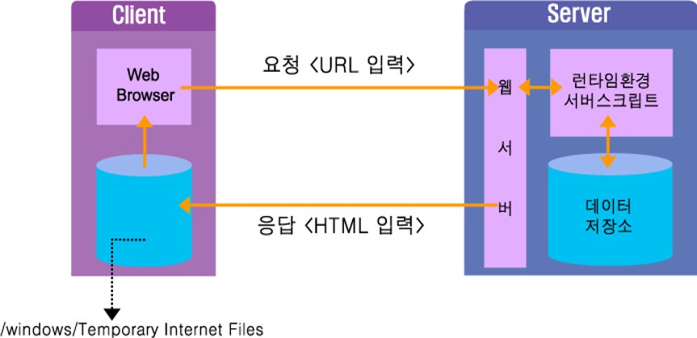
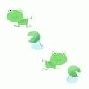
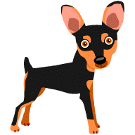
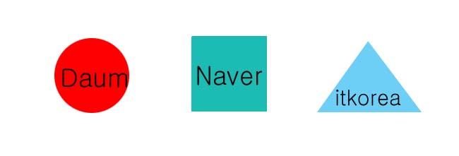

### [2019-05-10]

#### 1. Prolog
+ 3가지 구성요소
  - 1) IP : 컴퓨터를 식별하는 값
    - 의미있는 문자열로 만들어 명칭을 등록하여 사용.
  - 2) Port 번호 : PROCESS를 식별하는 번호(0~65535)
    - 127.0.0.1 or localhost.... 자신(컴퓨터)을 지칭하는 말.
    - 특정프로그램에 대하여 정해진 번호가 있음 (0~1024)
    - 사용자가 작성하는 Network Program에서 포트를 결정 or 임의(1024~65535)
  - 3) 통신규약(Protocol)
    - TCP
    - UDP
    - HTTP

+ 클라이언트(Client) : html, javascript  <- 디자이너 + 프로그래머
+ 서버(Server) : php, Servlet, Jsp  <- 프로그래머


#### 2. Network Programming
+ 1) Network ==> 두대이상의 컴퓨터를 케이블(유/무선)로 연결한 망
+ 2) Network Program ==> 두대 이상의 컴퓨터에서 데이터를 주고/받는 프로그램
+ 3) 3대 필수요소
  - (1) IP : 컴퓨터 주소(address) ==> 컴퓨터를 식별하기위해 부여한 명칭
    - Ipv4 : 4byte를 이용하여 주소부여
      - 1byte에 표현할 수 있는 숫자값(-128~0~127 ==양수 ==> 0~255)
      - 정수숫자배열 byte[] <== 내부적으로 저장된 값
      - "192.168.20.27" ----> DNS(도메인서버)에 손쉬운 문자열로 등록사용 => 웹사이트주소(www.jica.kr) => 웹프로그램
    - Ipv6 : 6byte를 이용하여 주소부여
  - (2) Port번호 : 컴퓨터 내에 동작중인 네트워크 프로그램을 식별하기 위한 Process 번호(id)
    - 0~65535
      - 1) 0~1024 : 잘 알려진 port번호(특정 프로그램에 할당되어 있다)
      - 2) 1025~65535 : 우리가 작성하는 프로그램에 부여되는 번호

  - (3) Protocol(통신규약) : 네트워크로 연결된 컴퓨터끼리 데이터를 주고받는 약속
    - TCP/IP : 연결된 상태에서만 데이터를 주고 받는다. (전화)
      - Socket, ServerSocket
    - UDP    : 연결되지 않은 상태에서도 데이터를 전송할수 있다. (문자메세지/메일)
      - DatagramSocket, DatagramPacket
    - HTTP   : html문서를 주고받는 통신규약
```
client  ---request-----> server(웹서버)
        <--response-----      서버프로그램(Servlet/JSP) --실행
          (html문서)
-front end----------------back end---------------------
 html                     Servlet/Jsp
 javaScript/jQuery
                          ASP
                          PHP
```
    - Java 언어에서는 java.net패키지에서 위의 클래스들을 지원하고 있다
      - 1) 웹브라우저
      - 2) URL, URL Connection <== http 프로토콜을 사용하는 java의 클래스들

    - TCP/IP, UDP = Socket Program..... HTTP = Web Program

+ 현재 프로그램이 동작하는 컴퓨터 자체의 IP를 지칭하는 표현하는 방법
  - 1) "127.0.0.1"
  - 2) "localhost"
  - 3) "192.168.20.27"

+ 웹(Web)프로그램에서 원하는 정보가 있는 상세한 위치정보를 표현 => URL(Uniform Resource Locator)
  - 원하는 정보 ===> html문서, 사진, 동영상... <-- 다른표현으로 resource라고 한다.
```
http://www.jica.or.kr:80/2016/inner.php?sMenu=A2000&mode=view&no=164
----  --------------- -- ----- -------- ----------------------------
protocol  ip          port path 웹컴퍼넌트 필요한정보(쿼리+참조)
```

```java
//NetworkEx1.java
import java.util.Arrays;

class NetworkEx1 {
	public static void main(String[] args)
	{
		InetAddress ip = null;
		InetAddress[] ipArr = null;

		try {
			//우리가 웹프로그램에서 많이 사용하는 포털사이트의 주소라고 칭하는 명칭
			//Domain Name
			ip = InetAddress.getByName("www.naver.com");
			System.out.println("getHostName() :"   +ip.getHostName());
			System.out.println("getHostAddress() :"+ip.getHostAddress());
			System.out.println("toString() :"      +ip.toString());

			byte[] ipAddr = ip.getAddress();
			System.out.println("getAddress() :"+Arrays.toString(ipAddr));

			String result = "";
			for(int i=0; i < ipAddr.length;i++) {
				result += (ipAddr[i] < 0) ? ipAddr[i] + 256 : ipAddr[i];
				result += ".";
			}
			result += result.length()-1;
			System.out.println("getAddress()+256 :"+result);
			System.out.println();
		} catch (UnknownHostException e) {
			e.printStackTrace();
		}

		try {
			ip = InetAddress.getLocalHost();
			System.out.println("getHostName() :"   +ip.getHostName());
			System.out.println("getHostAddress() :"+ip.getHostAddress());
			System.out.println();
		} catch (UnknownHostException e) {
			e.printStackTrace();
		}


		try {
			ipArr = InetAddress.getAllByName("www.naver.com");

			for(int i=0; i < ipArr.length; i++) {
				System.out.println("ipArr["+i+"] :" + ipArr[i]);
			}			
		} catch (UnknownHostException e) {
			e.printStackTrace();
		}

	} // main
}
```

```java
//NetworkEx2.java
package com.jica.net;
import java.net.URL;

class NetworkEx2 {
	public static void main(String args[]) throws Exception {
		URL url = new URL("http://www.codechobo.com:80/sample/"+"hello.html?referer=javachobo#index1");
//		URL url = new URL("https://docs.oracle.com/javase/9/docs/api/java/net/URL.html");

		System.out.println("url.getAuthority():"+ url.getAuthority());
//		System.out.println("url.getContent():"+ url.getContent());
		//실제로 접속해서 요청정보를 가져오려고 한다. 이때 존재하지 않는 웹 컴퍼넌트이므로
		//예외발생
		System.out.println("url.getDefaultPort():"+ url.getDefaultPort());
		System.out.println("url.getPort():"+ url.getPort());
		System.out.println("url.getFile():"+ url.getFile());
		System.out.println("url.getHost():"+ url.getHost());
		System.out.println("url.getPath():"+ url.getPath());
		System.out.println("url.getProtocol():"+ url.getProtocol());
		System.out.println("url.getQuery():"+ url.getQuery());
		System.out.println("url.getRef():"+ url.getRef());
		System.out.println("url.getUserInfo():"+ url.getUserInfo());
		System.out.println("url.toExternalForm():"+ url.toExternalForm());
		System.out.println("url.toURI():"+ url.toURI());
	}
}
```

+ 안드로이드에서는 URL과 이를 좀 더 상세하게 표현하도록 만든 URI도 사용한다.

+ 우리 입장에서의 URL은 웹프로그램(웹브라우저를 이용하는)에서 사용하는 것이 아니라 일반 JAVA프로그램에서 웹상의 정보를 요청/응답받을때 주로 사용할 것이다.(안드로이드 프로그램)


+ NetworkEx3.java
```java
package com.jica.net;

import java.net.URL;
import java.net.URLConnection;

public class NetworkEx3 {
	public static void  main(String args[]) {
		URL url = null;
		String address = "http://www.naver.com:80/index.html";
		String line = "";

		try {
			url = new URL(address);
			//아래처럼 URLConnection객체가 만들어지면 내부적으로
			//해당 URL에 접속하여 응답을 받아왔다.
			URLConnection conn = url.openConnection();

			System.out.println("conn.toString():"+conn);
			System.out.println("getAllowUserInteraction():"+conn.getAllowUserInteraction());
			System.out.println("getConnectTimeout():"+conn.getConnectTimeout());
			System.out.println("getContent():"+conn.getContent());
			System.out.println("getContentEncoding():"+conn.getContentEncoding());
			System.out.println("getContentLength():"+conn.getContentLength());
			System.out.println("getContentType():"+conn.getContentType());
			System.out.println("getDate():"+conn.getDate());
			System.out.println("getDefaultAllowUserInteraction():"+conn.getDefaultAllowUserInteraction());
			System.out.println("getDefaultUseCaches():"+conn.getDefaultUseCaches());
			System.out.println("getDoInput():"+conn.getDoInput());
			System.out.println("getDoOutput():"+conn.getDoOutput());
			System.out.println("getExpiration():"+conn.getExpiration());
			System.out.println("getHeaderFields():"+conn.getHeaderFields());
			System.out.println("getIfModifiedSince():"+conn.getIfModifiedSince());
			System.out.println("getLastModified():"+conn.getLastModified());
			System.out.println("getReadTimeout():"+conn.getReadTimeout());
			System.out.println("getURL():"+conn.getURL());
			System.out.println("getUseCaches():"+conn.getUseCaches());
		} catch(Exception e) {
			e.printStackTrace();
		}
	} // main
}
```
```
conn.toString():sun.net.www.protocol.http.HttpURLConnection:http://www.naver.com:80/index.html
getAllowUserInteraction():false
getConnectTimeout():0
getContent():sun.net.www.protocol.http.HttpURLConnection$HttpInputStream@53d8d10a
getContentEncoding():null
getContentLength():-1
getContentType():text/html
getDate():1557457235000
getDefaultAllowUserInteraction():false
getDefaultUseCaches():true
getDoInput():true
getDoOutput():false
getExpiration():0
getHeaderFields():{Transfer-Encoding=[chunked], null=[HTTP/1.1 302 Moved Temporarily], Server=[NWS], Connection=[keep-alive], Vary=[Accept-Encoding,User-Agent], Date=[Fri, 10 May 2019 03:00:35 GMT], Location=[https://www.naver.com/index.html], Content-Type=[text/html]}
getIfModifiedSince():0
getLastModified():0
getReadTimeout():0
getURL():http://www.naver.com:80/index.html
getUseCaches():true
```

+ NetworkEx4.java
```java
package com.jica.net;

import java.io.BufferedReader;
import java.io.InputStreamReader;
import java.net.URL;

public class NetworkEx4 {
	public static void  main(String args[]) {
		URL url = null;
		BufferedReader input = null;
		//정확한 URL이면 해당 파일내용을 읽어올수 있다.(text문서일때)
		String address = "http://www.hani.co.kr/";
		String line = "";

		try {
			url = new URL(address);
		    input = new BufferedReader(new InputStreamReader(url.openStream()));
			while((line=input.readLine()) !=null) {
				System.out.println(line);
			}
			input.close();
		} catch(Exception e) {
			e.printStackTrace();
		}
	}
}
```

+ NetworkEx5.java
```java
package com.jica.net;

import java.io.FileOutputStream;
import java.io.InputStream;
import java.net.URL;

public class NetworkEx5 {
	public static void  main(String args[]) {
		URL url = null;
		InputStream in = null;
		FileOutputStream out = null;
	    String address = "http://t1.daumcdn.net/news/201905/10/SpoChosun/20190510082017649zoij.jpg";

		int ch = 0;

		try {
			url = new URL(address);
			in = url.openStream();
			out = new FileOutputStream("20190510082017649zoij.jpg");

			while((ch=in.read()) !=-1) {
				out.write(ch);
			}
			in.close();
			out.close();
		} catch(Exception e) {
			e.printStackTrace();
		}
	} // main
}
```

+ TCP/IP를 사용한 채팅프로그램 ==> 소켓 프로그램

+ 소켓(Socket) : 프로세스간에 통신에 사용되는 양쪽 끝단(endpoint)
```
A사람                     B사람
    <----전화통화-------->
전화기                    전화기   --- 전화번호
-----------------------------
 A컴퓨터                  B컴퓨터
    <------통신---------->  
소켓                       소켓   --- IP:PORT
```

+ TCP방식 : 연결지향
  - 1:1, 1:(서버)다수
  - 데이터길이가 자유롭다.
  - 신뢰성을 기반
  - ---------------------ServerSocket, Socket

+ UDP방식 : 비연결지향
  - 1:1, 1:(서버)다수, 다수:다수
  - 패킷단위의 전송-관리
  - 비신뢰성(반대개념X, 자료손실or순서바뀜이 혹시라도 있을수 있는...)
  - ---------------------DatagramSocket, DatagramPacket


+ 채팅프로그램을 실습해보자
```
    Client                      Server
(1) 접속요청------------------->ServerSocket
(2)(Socket) <----------------> (Socket)
TcpIpClient.java              TcpIpServer.java
```
  - 0) 서버소켓생성
```java
ServerSocket ss = new Socket(7777);
```
  - 0-1) 클라이언트의 접속대기
```java
//서버로 연결요청이 들어오면...
Socket s = ss.accept(); //accept내부에서 응답(Socket::s)
```
  - 1) 소켓생성
```java
Socket s = new Socket("127.0.0.1",7777);
// 여기까지가 "연결확보""
```
```
     Socket::s ===========연결확보==========  Socket::s
dis<-InputStream <------------------------ OutputStream <----- dos
     OuputStream ------------------------> InputStream   
```

  - 2) Socket으로부터 IO stream을 얻어서 데이터를 송수신할 준비를 한다.
```java
DataInputStream dis = new DataInputStream(s.getInputStream()); //Client
DataOutputStream dos = new DataOutputStream(s.getOutputStream()); //Server
```

  - 3) 데이터 송수신
```java
dis.readUTF();  //클라이언트-수신대기
System.out.println(message);

dos.writeUTF("메세지") //서버-송신
```

  - 4) Socket Close = 연결해제
```java
s.close() //클라이언트
s.close() //서버
```


+ TcpIpClient.java
```java
package com.jica.tcp;

import java.io.DataInputStream;
import java.io.IOException;
import java.io.InputStream;
import java.net.ConnectException;
import java.net.Socket;

public class TcpIpClient {
	public static void main(String args[]) {
		try {
			//자신의 컴퓨터를 서버로 사용
			String serverIp = "192.168.20.27";
//			String serverIp = "127.0.0.1";

			System.out.println("서버에 연결중입니다. 서버IP :" + serverIp);
			// 클라이언트에서는 소켓을 생성하는 코드 자체가 서버에게 접속요청을 하는 것이다.
			// 생성자가 종료해서 Socket객체가 만들어지면 서버와 정상연결이 된것이다.

			// 소켓을 생성하여 연결을 요청한다.
			// 이때 서버쪽 프로그램은 이미 실행되어 있어야 한다.
			Socket socket = new Socket(serverIp, 7777);

			//아래의 코드가 실행된다는 것은 정상적으로 서버와 연결이 되었다는 뜻이다.
			// 소켓의 입력스트림을 얻는다.
			InputStream in = socket.getInputStream();
			DataInputStream dis = new DataInputStream(in);

			// 소켓으로 부터 받은 데이터를 출력한다.
			System.out.println("서버로부터 받은 메시지 :"+dis.readUTF());      
			System.out.println("연결을 종료합니다.");

			// 스트림과 소켓을 닫는다.
			dis.close();
			socket.close();
			System.out.println("연결이 종료되었습니다.");
		} catch(ConnectException ce) {
			ce.printStackTrace();
		} catch(IOException ie) {
			ie.printStackTrace();
		} catch(Exception e) {
			e.printStackTrace();  
		}  
	} // main
} // class

```

+ TcpIpServer4.java
```java
package com.jica.tcp;

import java.io.DataOutputStream;
import java.io.IOException;
import java.io.OutputStream;
import java.net.ServerSocket;
import java.net.Socket;
import java.text.SimpleDateFormat;
import java.util.Date;

public class TcpIpServer4 implements Runnable {
	ServerSocket serverSocket;
	//클라이언트가 접속할때마다 통신을 할수있도록 쓰레드를 만들어서 처리하자
	//쓰레드객체 배열
	Thread[] threadArr;

	public static void main(String args[]) {
		// 5개의 쓰레드를 생성하는 서버를 생성한다.
		TcpIpServer4 server = new TcpIpServer4(5);
		server.start();
	} // main

	public TcpIpServer4(int num) {
		try {
			// 서버소켓을 생성하여 7777번 포트와 결합(bind)시킨다.
			serverSocket = new ServerSocket(7777);

			System.out.println(getTime()+"서버가 준비되었습니다.");

			//미리 쓰레드객체를 5개 준비한다. 단, 쓰레드는 아직 생성되지 않았다.
			threadArr = new Thread[num];
		} catch(IOException e) {
			e.printStackTrace();
		}
	}

	public void start() {
		for(int i=0; i < threadArr.length; i++) {
			threadArr[i] = new Thread(this);
			threadArr[i].start();
		}
	}

	public void run() {
		while(true) {
			try {
				//현재 작동하는 쓰레드를 출력해보자
				Thread curThread = Thread.currentThread();
				System.out.println(curThread+" "+getTime()+ "가 연결요청을 기다립니다.");

				Socket socket = serverSocket.accept();
				System.out.println(getTime()+ socket.getInetAddress() + "로부터 연결요청이 들어왔습니다.");

				// 소켓의 출력스트림을 얻는다.
				OutputStream out = socket.getOutputStream();
				DataOutputStream dos = new DataOutputStream(out);

				// 원격 소켓(remote socket)에 데이터를 보낸다.
				dos.writeUTF("[Notice] Test Message1 from Server.");
				System.out.println(getTime()+"데이터를 전송했습니다.");

				// 스트림과 소켓을 닫아준다.
				dos.close();
				socket.close();
		    } catch (IOException e) {
				e.printStackTrace();
			}
		} // while
	} // run

	// 현재시간을 문자열로 반환하는 함수
	static String getTime() {
		String name = Thread.currentThread().getName();
		SimpleDateFormat f = new SimpleDateFormat("[hh:mm:ss]");

		return f.format(new Date()) + name ;
	}
} // class

```
##### [1:1 Chat]
```
-------------------1대 1 채팅 프로그램 -------------------------------
client                                    Server

Socket s = new Socket("192.168.20.7",7777);
           ---------------------------------> Socket s = ss.accept();       
====================================================================
Socket::s                                Socket::s
|---- InputStream <--------------------------OutputStream <----|
| |-->OuputStream -------------------------->InputStream ----| |
| |                                                          | |
| |---Sender쓰레드                          Receiver쓰레드<---| |
|---> Receiver쓰레드                       Sender쓰레드 --------|
```
+ TcpIpClient5.java
```java
package com.jica.tcp;

import java.io.IOException;
import java.net.ConnectException;
import java.net.Socket;

public class TcpIpClient5 {
	public static void main(String args[]) {
		try {
			String serverIp = "192.168.20.27";
//			String serverIp = "127.0.0.1";

			// 소켓을 생성하여 연결을 요청한다.
			Socket socket = new Socket(serverIp, 7777);

			System.out.println("서버에 연결되었습니다.");
			//서버로 메세지를 보내는 기능 즉, 키보드로 채팅메세지를 입력받아 전송하는 쓰레드
			Sender sender = new Sender(socket);
			//언제 상대방으로부터 메세지가 올지 모르므로 메세지를 대기하고 있는 수신 쓰레드
			Receiver receiver = new Receiver(socket);

			sender.start();
			receiver.start();
		} catch(ConnectException ce) {
			ce.printStackTrace();
		} catch(IOException ie) {  
			ie.printStackTrace();
		} catch(Exception e) {
			e.printStackTrace();  
		}  
	} // main
} // class
```

+ TcpIpServer5.java
```java
package com.jica.tcp;

import java.io.DataInputStream;
import java.io.DataOutputStream;
import java.io.IOException;
import java.net.ServerSocket;
import java.net.Socket;
import java.util.Scanner;

public class TcpIpServer5 {
	public static void main(String args[]) {
		ServerSocket serverSocket = null;
		Socket socket = null;

		try {
			// 서버소켓을 생성하여 7777번 포트와 결합(bind)시킨다.
			serverSocket = new ServerSocket(7777);
			System.out.println("서버가 준비되었습니다.");

			socket = serverSocket.accept();

			Sender   sender   = new Sender(socket);
			Receiver receiver = new Receiver(socket);

			sender.start();
			receiver.start();
		} catch (Exception e) {
			e.printStackTrace();
		}
	} // main
} // class

class Sender extends Thread {
	Socket socket;
	DataOutputStream out;  //출력스트림
	String name;

	Sender(Socket socket) {
		this.socket = socket;
		try {
			out = new DataOutputStream(socket.getOutputStream());
			name = "["+socket.getInetAddress()+":"+socket.getPort()+"]";
		} catch(Exception e) {}
	}

	public void run() {
		//키보드로 입력받아 상대편에게 전송
		Scanner scanner = new Scanner(System.in);
		while(out!=null) {
			try {
				out.writeUTF(name+scanner.nextLine());		
			} catch(IOException e) {}
		}
	} // run()
}

class Receiver extends Thread {
	Socket socket;
	DataInputStream in;

	Receiver(Socket socket) {
		this.socket = socket;
		try {
			in = new DataInputStream(socket.getInputStream());
		} catch(IOException e) {}

	}

	public void run() {
		while(in!=null) {
			try {
				System.out.println(in.readUTF());
			} catch(IOException e) {}
		}
	} // run
}
```


##### [Multi Chat]
```
-------------------다 대 대 채팅프로그램 ----------------------------------------
client                                    Server
                                         ServerSocket ss = new ServerSocket(8000);
      A                                  while(true){
Socket s = new Socket(ip,8000) -------->Socket s = ss.accept();
                                    |        s로 Thread만든다.
                                    |        쓰레드 시작
      B                             |        쓰레드 정보저장
Socket s = new Socket(ip,8000)------|
                                    |     }
      C                             |
Socket s = new Socket(ip,8000)------|
```

+ TcpIpMultichatClient.java
```java
package com.jica.tcpchat;

import java.net.*;
import java.io.*;
import java.util.Scanner;

public class TcpIpMultichatClient {
	public static void main(String args[]) {

		try {
      // 채팅서버에 접속
  		String serverIp = "192.168.20.27";  //강사컴
      //String serverIp = "127.0.0.1";
      // 소켓을 생성하여 연결을 요청한다.
			Socket socket = new Socket(serverIp, 8888);

			System.out.println("서버에 연결되었습니다.");
			Thread sender   = new Thread(new ClientSender(socket, "강사"));
			Thread receiver = new Thread(new ClientReceiver(socket));

			sender.start();
			receiver.start();
		} catch(ConnectException ce) {
			ce.printStackTrace();
		} catch(Exception e) {}
	} // main

	static class ClientSender extends Thread {
		Socket socket;
		DataOutputStream out;
		String name;

		ClientSender(Socket socket, String name) {
			this.socket = socket;
			try {
				out = new DataOutputStream(socket.getOutputStream());
				this.name = name;
			} catch(Exception e) {}
		}

		public void run() {
			Scanner scanner = new Scanner(System.in);
			try {
				if(out!=null) {
					out.writeUTF(name); // 최초 접속시 접속자 명을 전송한다.
				}

				while(out!=null) {
					out.writeUTF("["+name+"]"+scanner.nextLine());					}
			} catch(IOException e) {}
		} // run()
	} // ClientSender

	static class ClientReceiver extends Thread {
		Socket socket;
		DataInputStream in;

		ClientReceiver(Socket socket) {
			this.socket = socket;
			try {
				in = new DataInputStream(socket.getInputStream());
			} catch(IOException e) {}
		}

		public void run() {
			while(in!=null) {
				try {
					System.out.println(in.readUTF());
				} catch(IOException e) {}
			}
		} // run
	} // ClientReceiver
} // class

```

+ TcpIpMultichatServer.java
```java
package com.jica.tcpchat;

import java.net.*;
import java.io.*;
import java.util.*;

public class TcpIpMultichatServer {
	//현재 접속된 클라이언트의 정보 (OutputStream 저장)
	HashMap clients;

	TcpIpMultichatServer() {
		clients = new HashMap();
		//동기화 코드
		Collections.synchronizedMap(clients);
	}

	public void start() {
		ServerSocket serverSocket = null;
		Socket socket = null;

		try {
			serverSocket = new ServerSocket(8888);
			System.out.println("서버가 시작되었습니다.");

			while(true) {
				socket = serverSocket.accept();
				System.out.println("["+socket.getInetAddress()+":"+socket.getPort()+"]"+"에서 접속하였습니다.");

				//접속자가 서버로 전송하는 데이타를 읽는 수신 쓰레드를 만든다.
				ServerReceiver thread = new ServerReceiver(socket);
				thread.start();
			}
		} catch(Exception e) {
			e.printStackTrace();
		}
	}
	//                        Socket을가진 쓰레드
	//                      |-->[[홍길동,out],[장길산,out],[임꺽정,out]]  
  //              clients |
	//tms 0x100 ---------[0x200]
	void sendToAll(String msg) {
		Iterator it = clients.keySet().iterator();

		while(it.hasNext()) {
			try {
				DataOutputStream out = (DataOutputStream)clients.get(it.next());
				out.writeUTF(msg);
			} catch(IOException e){}
		} // while
	} // sendToAll

	public static void main(String args[]) {
		//	new TcpIpMultichatServer().start();
		TcpIpMultichatServer tms = new TcpIpMultichatServer();
		tms.start();
	}

	class ServerReceiver extends Thread {
		Socket socket;
		DataInputStream in;
		DataOutputStream out;

		ServerReceiver(Socket socket) {
			this.socket = socket;
			try {
				in  = new DataInputStream(socket.getInputStream());
				out = new DataOutputStream(socket.getOutputStream());
			} catch(IOException e) {}
		}

		public void run() {
			String name = "";
			try {
				name = in.readUTF();
				sendToAll("#"+name+"님이 들어오셨습니다.");

				clients.put(name, out);
				System.out.println("현재 서버접속자 수는 "+ clients.size()+"입니다.");

				while(in!=null) {
					sendToAll(in.readUTF());
				}
			} catch(IOException e) {
				// ignore
			} finally {
				sendToAll("#"+name+"님이 나가셨습니다.");
				clients.remove(name);
				System.out.println("["+socket.getInetAddress() +":"+socket.getPort()+"]"+"에서 접속을 종료하였습니다.");
				System.out.println("현재 서버접속자 수는 "+ clients.size()+"입니다.");
			} // try
		} // run
	} // ReceiverThread
} // class
```

#### 3. 실습
#### 4. Summary / Close


-----------------------------------------------------------

### [2019-05-13]

#### 1. Review
+ Java ---> Network(IP,Port,Protocol)
  - Protocol(TCP:전화, UDP:편지, HTTP:)
  - Socket Program(TCP,UDP)
  - Web Program(HTTP)

+ Oracle
+ Web Program
  - 인터넷(www)
  - 정보제공자(웹서버) - Tomcat, Begin,...

#### 2. Web Program / 개발환경설치(웹서버)
##### 웹 프로그램 개발환경 설정
+ 0. 교재에서의 웹환경
```
cmd mode에서 실행        웹서버(Tomcat)
웹브라우저               웹어플리케이션(직접작성)
         ---request--->    html, *.java, *jsp
         <--response----
```

+ 1. 우리의 실습 웹환경
```
cmd mode에서 실행        웹서버(Tomcat)
웹브라우저               웹어플리케이션(직접작성)
         ---request--->    프로젝트 단위 -- html, *.java, *jsp
         <--response----
```
  - 0) Jdk 설치
  - 1) Eclipse EE 설치
  - 2) Tomcat설치  -- 주의)http/1.1 port 8088로 변경했음.
    - 실행방법(우측하단 트레이, cmd mode에서 직접실행)
    - 우리가 사용할 방법(Eclipse EE 내부에 Tomcat서버를 복사하여 내부에서 실행)

    - 환경변수 설정을 권장
      + (1) PATH -- cmd모드의 어느곳에서든 Tomcat8이라고 입력하면 Tomcat이 기동되도록
        - ```C:\tomcat85\bin```
      + (2) CLASS PATH 추가 -- JAVA프로그램 컴파일시 기본 라이브러리뿐만아니라 추가 라이브러리를 자동인식할수 있도록 설정(Java프로그램==>Servlet, JSP)
        - ```C:\tomcat85\lib\servlet-api.jar```
      + (3) TOMCAT_HOME 설정
        - ```C:\tomcat85```
      + (4) CATALINA_HOME 설정
        - ```C:\tomcat85```
      + 위 설정내용을 교제 cmd mode에서 웹어플리케이션을 사용할때 반드시 설정해야 한다. 우리 Eclipse EE 내부에서 톰킷을 사용하므로 설정하지 않아도 무방하다.

  - 3) Eclipse EE내부에서 웹서버로 Tomcat85를 연동시키자.	 - 서버 생성
    + 이클립스 화면구성 - 좌측(window - show view - general - Project Explorer)


+ 웹어플리케이션의 구조(이클립스 내부에서 보여지는 구조)
  - Eclipse EE에서의 프로젝트 구조(File/New/Dynamic Web Project, "html")
  - html <== 웹어플리케이션 명칭
  - html\Java Resources\src\패키지단위의 Servlet코드(`*.java`)
  - html\build\패키지단위로 컴파일된 Servlet코드(`*.class`)
  - html\WebContent\html문서(`*.html`), javaScript코드(`*.js`), JSP코드(`*.jsp`), 기타 다양한 resource(`*.gif, *.jpg, *.avi`)... 필요하다면 하위폴더를 만들어서 저장.
    - 실행시에는 Servlet으로 작동


#### 3. HTML과 Servlet/JSP

+ 실습으로... 가장 기본적인 html문서를 작성해보자.
  - WebContent\jica.html
  - 웹브라우저에서 jica.html이 작동하게된 작업절차
    - 1) 웹브라우저의 주소표시줄 : http://localhost:8088/html/jica.html
      - 웹브라우저가 http프로토콜의 형식(Get방식의 요청정보)을 준수하여 서버로 요청정보를 보낸다.
    - 2) 웹서버(Tomcat8.5)
      - 웹컨테이너 프로그램이 요청정보를 해석하여, 자신이 관리하는 웹어플리케이션의 내부구조에서 요청한 html문서를 찾는다.(정적인 구성요소의 요청)
      - http프로토콜 형식에 맞추어 응답정보에 해당 파일 내용도 담아서 응답한다.
    - 3) 웹브라우저는 응답내용중 html문서내용을 추출하여 그 내용을 해석(메모리에 DOM을 만들어)하여 태그형식에 맞추어 정보를 보여준다.

    - HTML문서가 파일의 형태로 저장되어 있다면... 정적인 웹컴퍼넌트다. 즉, 항상 동일한 내용만 응답해준다.
    - 그래서 동적으로 결과를 만들어내기 위해, Servlet과 JSP를 사용한다.
    - 클라이언트(웹브라우저)의 요청이 왔을때, 웹컨테이너가 정보를 해석하여 동적인 웹컴퍼넌트가 실행되어 HTML형식을 만들어 응답한다.


+ Servlet 실습으로... 1부터 100까지 합계를 구하는 서블릿
```
일반 Logic은 Java프로그램으로 작성하고 프로그램 실행결과를 html 태그로 작성한다.
```
  - Eclipse EE 내부에서의 Project구조와 탐색기의 구조, 실제 Tomcat웹서버에서 인식하는 Project구조는 다른다.
```
html/WEB-INF/web.xml  <== 현재 Web Application의 모든 구성요소
            /classes/패키지단위의 컴파일된 서블릿코드(*.class)
            /lib/서블릿에서 사용하는 외부라이브러리파일(*.jar)
    /html파일, 기타 다양한 resource(*.gif, *.wav, *.jpg,...)
    jsp파일
```

  - 서블릿의 구성 => Java코드가 중심이고 + html코드는 결과를 만들어내기위한 보조벅인 작업

  - 서블릿 객체는 클라이언트의 최초 요청시 Tomcat웹서버에 의해 생성되고, 이후부터의 요청은 쓰레드 처리에 의해 doGet()/doPost()의 메서드가 실행되어 그 결과값이 응답된다.

  - html 호출시는 http://localhost:8088/html/jica.html
  - 서블릿 호출시는 http://localhost:8088/html/HundredServlet
  - jsp 호출시는 http://localhost:8088/html/Hundred.jsp


  - JSP(Java Server Page) ==> HTML태그가 중심이고 + 필요할때 Java코드를 호출하여 사용.
  - jsp(Hundred.jsp)코드도 실행될때는 웹서버에 의한 Servlet(Hundred_jsp.java --> Hundred_jsp.class)으로 변환되고 변환된 JSP에서는 다음의 구성요소를 자유롭게 사용한다.
    - 1) html 태그
    - 2) jsp 태그 및 추가 라이브러리
    - 3) java코드를 호출하여 사용
    - 4) EL 및 JSTL등의 외부라이브러리


##### [오늘의 과제]
+ 1) 실습내용 이해
+ 2) 수업참고자료 "서블릿_JSP개요.ppt" 읽어볼것
+ 3) 교재1장 읽어볼것


#### 4. 실습
#### 5. Summary / Close


-----------------------------------------------------------

### [2019-05-14]

#### 1. Review
```
Network - Socket(TCP,UDP)
        - Web Program(HTTP)
```
+ client(사용자)
  1) HTML문서를 해석/표현
  2) 사용자에반응 -> 자체(javaScript)
  3) 서버에 요청

+ server(정보제공자)
  1) 웹사이트 - 웹어플리케이션
  2) html, jpg, JSP, PHP...


+ 개발환경설치
  1. Eclipse EE - 웹 어플리케이션
  2. 웹서버에서 동작 - Tomcat8.5

```
웹어플리케이션명 /html문서, 기타 resource
                /WZB-inf/web.xml
                /classes/패키지단위
                /lib/*.jar
```

+ 향후 웹프로그램 학습순서
  1) HTML 태그
  2) JavaScript
  3) Servlet
  4) JSP
    html태그, JavaScript, JSP태그, [자바코드]
    자바코드를 전혀 사용하지 않고 작성(외부 라이브러리 사용...EL, JSTL)
```
  MVC패턴적용(모델1)   
  -----request--------->서블릿작동(Logic처리)
                           |
                           |
                           V
 <-----response----------  JSP(Presentation-View처리)
```

#### 2. HTML(HyperText Markup Language)태그
+ HTML의 정의와 특징
  - 모든 월드 와이드 웹 문서(웹브라우저)를 작성하는데 쓰이는 표준 파일 형식
  - 파일 확장자는 `*.htm` 또는 `*.html`
  - 웹 브라우저는 확장자에 의해 HTML문서로 인식
  - HTML은 대소문자 구분을 하지 않음
  - 태그로 구성되어 있다.
    - 기본형식 : <태그명 속성=값,...>   </태그명>
    - 기본형식 : <태그명 속성=값,.../>



+ 태그?
  - HTML 문서의 모양과 행동 양식을 정해주는 하나의 명령어
  - 시작 태그;<>와 종료 태그;</>가 짝을 이뤄 사용되는 것이 일반적임(짝없는것도!)
  - 태그들은 서로 중복 사용될 수 없다
  - 태그의 속성값을 기술할때 ""을 사용할수도 있고 안할수도 있다.
  - 특정 리소스(이미지,음원)를 접근할때는 상대경로와 절대경로로 접근할수 있다.
```html
<html>
  <head>
      <title>Document</title>
  </head>
  <body>

  </body>
</html>
```


#### 3. 기본태그

+ [first.html](./first.html)
```html
<!DOCTYPE HTML>
<html>
 <head>
  <title> 기본 태그 연습 </title>
 </head>

 <body>
  안녕하세요.<br><br><br><br>
  처음으로 HTML을 학습합니다.<br>
  전주정보문화산업진흥원의 스마트폰 개발자 과정! 화 이   팅!<br><br>
  화 이 &nbsp;&nbsp;&nbsp;&nbsp;&nbsp;팅!<br><br>
  지금까지는 기본 태그만 사용하여 본문을 작성하고 있습니다.<br>
  화일 저장시 확장자는 *.html, *.htm으로 저장해야 합니다.<br>
  <!-- 주석표시 입니다. <br> 태그는 줄바꿈기능을 수행합니다. -->
  위의 내용은 주석표시입니다.
  <p>
  열심히 공부합시다.<br>
  <!-- <P> 태그는 문단의 단락을 표현하는 태그입니다. -->
  </p>
  HTML과 JavaScript는 웹프로그램의 기본구성요소입니다.
 </body>
</html>
```


#### 4. Link iamge 태그

+ [second.html](./second.html)
```
<!DOCTYPE HTML PUBLIC "-//W3C//DTD HTML 4.01 Transitional//EN" "http://www.w3.org/TR/html4/loose.dtd">
<html>
 <head>
  <title> HTML 기본태그 연습 </title>
  <meta name="Generator" content="EditPlus">
  <meta name="Author" content="argus">
  <meta name="Keywords" content="HTML 기본태그">
  <meta name="Description" content="HTML 기본태그 학습">
  <script>
  	//javaScript문법에 맞는 표현을 사용하여 코딩
  	//인터프리터 언어(변수,연산자,제어문,다양한 형태의 객체, 함수-function)
  </script>
  <style>
  	<!-- 본문에서 사용되는 다양한 태그들의 속성값을 정의해 놓고 편리하게 사용 -->  	
  </style>

  <!-- HEAD 태그에 기술되는 내용
    0) 문서 제목 - TITLE 태그
	1) 문서의 정보를 검색엔진에게 제공 - META 태그
	2) JavaScript 코드 : 이곳에 작성하기를 권장
	3) css : 문서의 스타일 쉬트
  -->
 </head>

<!--
	상대경로 : 현재위치를 기준으로 위치 지정  "bg.gif"
	절대경로 : 웹어플리케이션을 기준으로 경로지정  "./image/bg.gif"
													"/html/image/bg.gif"
													"http://localhost:8088/html/image/bg.gif"													
 -->
 <body BGCOLOR="00FF00" TEXT="#FF0000" BACKGROUND="./image/bg.gif">
  <!-- BODY 태그에 기술되는 내용
    다양한 종류의 태그를 사용하여 정보를 표현한다.
 *  0) 글자 및 이미지 태그
	2) 문장 장식 태그, 움직이는 글자
	3) 테이블 태그
 *  4) 링크 태그
	5) 프래임 태그(영역구분) -- <div> 태그 사용을 권장
 *  6) 사용자와 상호작용하는 태그(정보의 입력, 선택) -- <form>
  -->
  
  <BR>
	아래의 참고사이트는 여러분들이 학습할때 방문하여 정보를 얻으세요.<br>
	아주 유용한 사이트입니다.<br>
  <h2>참고사이트</h2>
  <a href="http://www.trio.co.kr">트리오 사이트</a><br>
  <a href="http://www.w3schools.com">W3 학습 사이트</a><br>
 </body>
</html>
```


+ 상대경로
```
  - 현재경로에 같은 파일(이미지) : `*.jpg`
```

+ 절대경로
```
  - ./ : 현재경로
  - ../ : 부모경로
```


+ 글자태그
```
  - <h1> ~ </h>
  - <font color="rgb값이 색상문자열"> 글자 </font>
  - argb : Alpha(투명도:0~255, 0 완전투명, 255 완전불투명)
  - 삼원색(Red,Green,Blue)
  - <b>
  - <i>
  - <sup>
  - <sub>
```


+ [third.html](third.html)
```html
<!DOCTYPE HTML PUBLIC "-//W3C//DTD HTML 4.01 Transitional//EN" "http://www.w3.org/TR/html4/loose.dtd">
<html>
 <head>
  <title> 글자 태그 </title>
 </head>

 <body>
  <!-- 글자의 크기를 지정하는 헤드라인 태그 -->
  <h1>문서의 제목 1</h1>
  <h2>문서의 제목 1</h2>
  <h3>문서의 제목 1</h3>
  <h4>문서의 제목 1</h4>
  <h5>문서의 제목 1</h5>
  <h6>문서의 제목 1</h6>

  <p> FONT 태그 연습 -- 글자의 속성(글꼴, 크기, 색상등)	</p>

  전주정보문화산업진흥원 JICA jica 보통글씨<br>
  <hr>
  <font COLOR="FF0000" >전주정보문화산업진흥원 JICA jica</font><br>
  <font COLOR="CCCCCC" >전주정보문화산업진흥원 JICA jica</font><br>
  <font COLOR="GOLD" >전주정보문화산업진흥원 JICA jica</font><br>
  <font COLOR="BLUE" >전주정보문화산업진흥원 JICA jica</font><br>

  <hr>
  <font SIZE="1">전주정보문화산업진흥원 JICA jica</font><br>
  <font SIZE="3">전주정보문화산업진흥원 JICA jica</font><br>
  <font SIZE="5">전주정보문화산업진흥원 JICA jica</font><br>
  <font SIZE="7">전주정보문화산업진흥원 JICA jica</font><br>

  <hr>
  <font FACE="궁서">전주정보문화산업진흥원 JICA jica</font><br>
  <font FACE="바탕">전주정보문화산업진흥원 JICA jica</font><br>
  <font FACE="Comic Sans MS">전주정보문화산업진흥원 JICA jica</font><br>
  <font FACE="Impact">전주정보문화산업진흥원 JICA jica</font><br>

  <!-- 수평선 긋기 -->
  <hr>
  수평으로(Horizental)으로 선을 긋는다.
  <hr width="50%" align=left>
  <hr width="50">
  <hr width="50%" size=4 color=silver>
  <hr width="50%" size=1 align=right>

  <!-- 특수기능을 가진 특수문자 -->  
  &lt; 혹은 &#60; : (<)의 문자기호 <br>
  &gt; 혹은 &#62; : (>)의 문자기호 <br>
  &amp; 혹은 &#38; : (&)의 문자기호 <br>
  &nbsp; 혹은 &#160; : ( ) 공백의 문자기호<br>
  &copy; 혹은 &#169; : () 저작권의 문자기호<br>

  &int; 혹은 &#8747; : 인터그랄<br>
  &sum; 혹은 &#8721; : 합계기호<br>
  &Aring; 혹은 &#197; :
 </body>
</html>

```


+ [forth.html](./forth.html)
```html
<!DOCTYPE HTML PUBLIC "-//W3C//DTD HTML 4.01 Transitional//EN" "http://www.w3.org/TR/html4/loose.dtd">
<html>
 <head>
  <title> 글자 장식태그 </title>
 </head>

 <body>
  스타일 태그 - 장식 태그<br>
  <font SIZE="4" COLOR="#000000">전주정보문화산업진흥원!</font><br>
  <b>안드로이드 개발자반 화이팅!</b><br>
  <i>전주(Jeonju)</i><br>
  <s>정보문화(취소선)</s><br>
  <u>산업진흥원</u><br>
  x<sup>2</sup> 1og<sub>10</sub> 윗첨자와 아래첨자<br>
  <tt>스마트폰(smart phone)</tt><br>
  <small>스마트폰</small><br>
  <big>스마트폰</big><br>

  <hr>
  <pre>
  html문서내용에서는 기본으로 공백,탭(1번만 적용)하고 엔터기호는 무시된다.
  pre태그는 공백,탭,엔터기호를 그대로 인식하도록 표현하는 태그이다.
  HTML 태그를 주마간산 형식으로 살펴보고 있   습   니  다.   쭉~

             안녕!
  복습한다 생각하고 살펴봅시다.
  </pre>
  <hr>
  점심시간!<br>
  <center>내용을 수평 중앙에 포시합니다.  속성은 없습니다.</center>
  단, center태그는 HTML5에서 권장하지 않는다. 이제 식사하러 갑시다<br>

  <center> <h4>중앙 위치</h4> </center>

  <hr>
  <hr width="70%" align="left" size="1" >
  <hr width="70%" align="center" size="2" >
  <hr width="70%" align="right" size="3" >
  <hr width="70%" align="right" size="4" >
 </body>
</html>

```


+ 목록태그 : 여러개의 항목을 보여주는 태크

+ [list.html](./list.html)
```html
<!DOCTYPE HTML PUBLIC "-//W3C//DTD HTML 4.01 Transitional//EN" "http://www.w3.org/TR/html4/loose.dtd">
<html>
 <head>
  <title> 목록(리스트) 태그 사용법 </title>
 </head>

 <body>
	<marquee WIDTH="200" SCROLLAMOUT="10" BEHAVIOR="ALTERNATE" >목록 태그 사용법</marquee><br>

	<pre>
	리스트 태그는 상위와 하위가 있는 체계화된 목록을 만들때 사용되며
	그 종류는 다음과 같다.
		    1. 정의목록(DL:definition List),
	        2. 번호가 없는 목록(UL:unordered List),
			3. 번호가 있는 목록(OL:ordered List)의 세가지가 있다.

    정의목록(DL) 태그는 그내용으로 다음 두가지 요소(Element)를 갖는다.
	    1. 정의목록 제목(DT:definition title).
		2. 정의목록 데이타(DD:definition data).

    번호가 없는 목록(UL) 태그는 그내용으로 갖는 Element는
	    LI(List Item)을 사용한다.
		UL혹은 LI모두 type 속성을 이용하여 그 모양을 설정한다.
		type속성은(disc:꽉찬 원, circle:테두리 원, square:네모모양)

    번호가 있는 목록(OL) 태그도 마찬가지로 LI을 사용한다.
	    OL, LI 모두 type속성을 사용한다.
		typ속성은("a", "A", "i", "I")
	</pre>
	<hr>

	<dl>
	<dt>언어 수업내용
		<dd> JAVA Language
		<dd> Web Programming
    <dt>취업분야
		<dd> 기본 Web 프로그램 작성분야
		<dd> 안드로이드 APP 개발분야
	</dl>

	<hr>
	<ul type="disc" >
		<li> Review
		<li> HTML 개요
		<li> 태그작성 연습1
		     <ul type="circle">
			     <li> 글자와 문자태그
				 <li> 이미지 태그
			 </ul>
		<li> 태그작성 연습2
			 <ul type="square">
				 <li> 테이블 태그
				 <li> form 태그
			 </ul>
	</ul>
	<hr>

	<ol type="A">
		<li> JAVA언어 학습
		<li> Oracle
		<li> WEB Programming
			<ol type="I">
				<li> HTML
				<li> JavaScript
				<li> Servlet
				<li> JSP
				<li> Framework
			</ol>
        <li> Android
		    <ol type="a" start="3">
				<li> 기본 Widget 사용법
				<li> 고급 Widget 사용법
			</ol>
	</ol>
 </body>
</html>
```


+ 이미지 태그

+ [image.html](./image.html)
```html
<!DOCTYPE HTML PUBLIC "-//W3C//DTD HTML 4.0 Transitional//EN">
<HTML>
<HEAD>
<TITLE> 이미지 태그 연급 </TITLE>
</HEAD>

<BODY>
<PRE>
	IMG태그 : ""
	SRC = 이미지 화일명과 경로: URL 설명을 참조하라.
	WIDTH = LENGTH: 이미지의 너비를 픽셀로 지정한다.
	HEIGHT = LENGTH: 이미지의 높이를 픽셀로 지정한다.
	BORDER = PIXELS: 테두리(BORDER)의 폭을 픽셀(PIXEL)로 지정한다.
	ALT = TEXT 이미지을 디스플레이 할 수 없는 사용도구에서,
		이 애트리뷰트는 설명을 제공하는 대체 텍스트를 지정한다.
		또한 마우스를 올려 놓을때 대체 텍스트가 나타난다.
	ALIGN = "LEFT","RIGHT","TOP","MIDDLE","BOTTOM"
</PRE>
<HR>
	<ul>
		<li> 현재 html문서내의 폴더에 파일이 있다. 파일명만 기술</li>
		<li> 현재 html문서의 하위 폴더에 있다.     폴더/파일명</li>
		<li> 현재 html문서의 상위폴더를 지칭할때 ../하위폴더/파일명</li>
	</ul>
	<pre>
		/home/image/log.gif
			 /doc/index.html
			 /index.html
	</pre>
<hr>
<br> <!-- 상대경로 -->
내용이 없다면
<HR>
<br>
<br>
<P>
<P>

<BR>
진돗개2<BR>
이미지를 보여주고 텍스트를 기술합니다.<br>
내용이 많으면 어떻게<BR>
기술될까요<BR>
<P>
<HR>

<P>
진돗개43<BR>
진돗개3<BR>
이미지를 보여주고 텍스트를 기술합니다.<BR>
내용이 많으면 어떻게<BR>
기술될까요<BR>
</P>
<HR>
<CENTER>삽살개<BR></CENTER>
<HR>
진돗개4<BR><BR>
<HR>
진돗개5<BR><BR>
<HR>
진돗개6<BR><BR>
<HR>
<FONT SIZE = "5">bibi1004의 도트캐릭터</FONT><BR><BR>
<!-- 외부사이트의 이미지를 가져 올수도 있다-->


</BODY>
</HTML>
```


#### 5. 테이블 태그
+ CELLPADDING 하나의 셀 내용값이 경계와의 거리(위,왼쪽,오른쪽,아래)
+ CELLSPACING 셀과 셀끼리의 간격

+ [table1.html](./table1.html)
```html
<!DOCTYPE HTML PUBLIC "-//W3C//DTD HTML 4.0 TRANSITIONAL//EN">
<HTML>
<HEAD>
<TITLE> 테이블 만들기 연습 </TITLE>

</HEAD>

<BODY>

<TABLE BORDER = "1" WIDTH = "70%">
	<TR><TH>제목1</TH><TH>제목2</TH></TR>
	<TR><TD></TD><TD>셀2</TD></TR>
	<TR><TD>&nbsp;</TD><TD>셀4</TD></TR>
</TABLE>
<BR>

BORDER: 테두리의 두께
<TABLE WIDTH = "300" BORDER="4" ALIGN = "CENTER">
<CAPTION>테이블의 구성 </CAPTION>
<TR>
	<TH>제목1</TH><TH>제목2</TH><TH>제목3</TH>
</TR>
<TR ALIGN = "CENTER">
	<TD>1번</TD><TD>2번</TD><TD>3번</TD>
</TR>
<TR>
	<TD>4번</TD><TD>5번</TD><TD>6번</TD>
</TR>
</TABLE>
<BR>

<P>&LT;TABLE <FONT COLOR=BLUE><B>BORDER=10</B></FONT> CELLPADDING=0 CELLSPACING=0 BGCOLOR=FFBBBB WIDTH=80%&GT;</P>
<TABLE BORDER=10 CELLPADDING=0 CELLSPACING=0 BGCOLOR=FFBBBB WIDTH=80%>
<TR BGCOLOR=FFFF00>
	<TD>1번 줄 - 1번 칸</TD>
	<TD>1번 줄 - 2번 칸</TD>
	<TD>1번 줄 - 3번 칸</TD>
</TR>
<TR BGCOLOR=FF0000>
	<TD>2번 줄 - 1번 칸</TD>
	<TD>2번 줄 - 2번 칸</TD>
	<TD>2번 줄 - 3번 칸</TD>
</TR>
<TR>
	<TD>3번 줄 - 1번 칸</TD>
	<TD>3번 줄 - 2번 칸</TD>
	<TD>3번 줄 - 3번 칸</TD>
</TR>
<TR>
	<TD>4번 줄 - 1번 칸</TD>
	<TD>4번 줄 - 2번 칸</TD>
	<TD>4번 줄 - 3번 칸</TD>
</TR>
</TABLE>

<P><B>BORDER</B>: 테두리의 두께</P><BR>

<P>&LT;TABLE BORDER=1 <FONT COLOR=BLUE><B>CELLPADDING=10</B></FONT> CELLSPACING=0 BGCOLOR=FFBBBB WIDTH=80%&GT;</P>
<TABLE BORDER=1 CELLPADDING=10 CELLSPACING=0 BGCOLOR=FFBBBB WIDTH=80%>
<TR BGCOLOR=FFFF00>
	<TD BGCOLOR=0000FF>1번 줄 - 1번 칸</TD>
	<TD BGCOLOR=0000FF>1번 줄 - 2번 칸</TD>
	<TD >1번 줄 - 3번 칸</TD>
</TR>
<TR BGCOLOR=FFFF00>
	<TD>2번 줄 - 1번 칸</TD>
	<TD>2번 줄 - 2번 칸</TD>
	<TD>2번 줄 - 3번 칸</TD>
</TR>
</TABLE>

<P><B>CELLPADDING</B>: 테두리와 내용(글자)와의 거리
</P><BR>

<P>&LT;TABLE BORDER=1 CELLPADDING=0 <FONT COLOR=BLUE><B>CELLSPACING=10</B></FONT> BGCOLOR=FFBBBB WIDTH=80%&GT;</P>
<TABLE BORDER=1 CELLPADDING=0 CELLSPACING=10 BGCOLOR=FFBBBB WIDTH=80%>
<TR BGCOLOR=FFFF00>
	<TD>1번 줄 - 1번 칸</TD>
	<TD>1번 줄 - 2번 칸</TD>
	<TD>1번 줄 - 3번 칸</TD>
</TR>
<TR BGCOLOR=FFFF00>
	<TD>2번 줄 - 1번 칸</TD>
	<TD>2번 줄 - 2번 칸</TD>
	<TD>2번 줄 - 3번 칸</TD>
</TR>
</TABLE>
<P><B>CELLSPACING</B>: 칸과 칸의 공간 거리</P><BR>

<P>&LT;TABLE BORDER=10 <FONT COLOR=BLUE><B>CELLPADDING=10 CELLSPACING=10</B></FONT> BGCOLOR=FFBBBB WIDTH=80%&GT;</P>
<TABLE BORDER=10 CELLPADDING=10 CELLSPACING=10 BGCOLOR=FFBBBB WIDTH=80%>
<TR BGCOLOR=FFFF00>
	<TD>1번 줄 - 1번 칸</TD>
	<TD>1번 줄 - 2번 칸</TD>
	<TD>1번 줄 - 3번 칸</TD>
</TR>
<TR BGCOLOR=FFFF00>
	<TD>2번 줄 - 1번 칸</TD>
	<TD>2번 줄 - 2번 칸</TD>
	<TD>2번 줄 - 3번 칸</TD>
</TR>
</TABLE><BR>

<TABLE CELLPADDING = "20" BGCOLOR ="#FFFFAA" BORDER = "1" BORDERCOLORLIGHT = "#FF2400" BORDERCOLORDARK= "#660033">
<TR>
	<TD>1번</TD><TD>2번</TD><TD>3번</TD>
</TR>
</TABLE>
<BR>

<TABLE CELLSPACING = "20" BACKGROUND = "./image/bg.gif" BORDER = "1" BORDERCOLORLIGHT = "#FF2400" BORDERCOLORDARK= "#660033">
<TR>
	<TD>1번</TD><TD>2번</TD><TD>3번</TD>
</TR>
</TABLE>

</BODY>
</HTML>
```


```
필요에 따라 행(줄) <TR>
           열(칸) <TD> 을 병합할 수 있다.
```

+ [table2.html](table2.html)
```html
<!DOCTYPE HTML PUBLIC "-//W3C//DTD HTML 4.0 Transitional//EN">
<HTML>
<HEAD>
<TITLE> 테이블 만들기 2 </TITLE>
</HEAD>

<BODY>
<TABLE BORDER="1" WIDTH="300">
    <TR>
		<TH>제목1</TH>
		<TH>제목2</TH>
    </TR>
    <TR>
		<TD COLSPAN="2" BGCOLOR="GRAY">COLSPAN="2"</TD>
    </TR>
    <TR>
		<TD ROWSPAN="2" BGCOLOR="GREEN">ROWSPAN="2"</TD>
		<TD>셀4</TD>
    </TR>
    <TR>
		<TD>셀6</TD>
    </TR>
</TABLE>

<P>
<TABLE BORDER="1" CELLSPACING="10" WIDTH="300">
    <TR>
		<TD>셀1</TD>
		<TD>셀2</TD>
    </TR>
    <TR>
		<TD>셀3</TD>
		<TD>셀4</TD>
    </TR>
</TABLE>
</P>

<P>
<TABLE BORDER="1" CELLSPACING="5" CELLPADDING="10" WIDTH="300">
    <TR>
		<TD>셀1</TD>
		<TD>셀2</TD>
    </TR>
    <TR>
		<TD>셀3</TD>
		<TD>셀4</TD>
    </TR>
</TABLE>
</P>

<P>
<TABLE BORDER="1" WIDTH="300" HEIGHT="50%">
    <TR>
	<TD>셀1</TD>
	<TD>셀2</TD>
    </TR>
</TABLE>

<TABLE BORDER="1" WIDTH="50%" HEIGHT="100">
    <TR>
	<TD>셀1</TD>
	<TD>셀2</TD>
    </TR>
</TABLE>
</P>

<P>
<TABLE BORDER="1" WIDTH="300">
    <TR>
		<TD ALIGN="LEFT">셀1(LEFT)</TD>
    </TR>
    <TR>
		<TD ALIGN="CENTER">셀2(CENTER)</TD>
    </TR>
    <TR>
		<TD ALIGN="RIGHT">셀3(RIGHT)</TD>
    </TR>
</TABLE>
</P>

<P>
<TABLE BORDER="1" WIDTH="300" HEIGHT="300">
    <TR>
		<TD VALIGN="TOP">셀1(TOP)</TD>
		<TD VALIGN="MIDDLE">셀2(MIDDLE)</TD>
		<TD VALIGN="BOTTOM">셀3(BOTTOM)</TD>
    </TR>
</TABLE>
</P>

<P>
<TABLE BORDER="1" WIDTH="300" HEIGHT="300" BGCOLOR="#2B2B2B">
    <TR>
		<TD VALIGN="TOP" BGCOLOR="RED">셀1(LEFT)</TD>
		<TD VALIGN="MIDDLE">셀2(CENTER)</TD>
		<TD VALIGN="BOTTOM">셀3(RIGHT)</TD>
    </TR>
</TABLE>

</P>
</BODY>
</HTML>
```


+ [table3.html](table3.html)
```html
<!DOCTYPE HTML PUBLIC "-//W3C//DTD HTML 4.0 Transitional//EN">
<HTML>
<HEAD>
<TITLE> 테이블 병합2 </TITLE>
</HEAD>

<BODY>
<TABLE WIDTH = "300" BORDER ALIGN = "CENTER">
<CAPTION>테이블 좌우 합치기 </CAPTION>
<TR>
	<TD COLSPAN = "2">1번2번</TD>
	<TD>3번</TD>
</TR>
<TR>
	<TD>4번</TD>
	<TD>5번</TD>
	<TD>6번</TD>
</TR>
<TR>
	<TD>7번</TD>
	<TD COLSPAN = "2">8번9번</TD>
</TR>
</TABLE>

<HR>
<TABLE WIDTH = "300" HEIGHT = "200" BORDER ="1" ALIGN = "CENTER">
<CAPTION>셀의 간격</CAPTION>
<TR>
	<TD WIDTH = "100">1번</TD>
	<TD WIDTH = "200">2번</TD>
	<TD WIDTH = "100">3번</TD>
</TR>
<TR>
	<TD WIDTH = "100">4번</TD>
	<TD WIDTH = "100">5번</TD>
	<TD WIDTH = "100">6번</TD>
</TR>
</TABLE>
<HR>
<TABLE WIDTH = "300" HEIGHT = "200" ALIGN = "CENTER">
<TR>
	<TD WIDTH = "100" ALIGN = "LEFT">1번</TD>
	<TD WIDTH = "100" ALIGN = "CENTER">2번</TD>
	<TD WIDTH = "100" ALIGN = "RIGHT">3번</TD>
</TR>
<TR>
	<TD VALIGN = "TOP" ALIGN = "CENTER">4번</TD>
	<TD VALIGN = "MIDDLE">5번</TD>
	<TD VALIGN = "BOTTOM">6번</TD>
</TR>
</TABLE>

</BODY>
</HTML>
```


+ link태그
  1) 다른 페이지와 연결
  2) 현재 페이지에서의 화면 이동
  `<a href="연결될페이지">글자나 그림</a>`


+ 예제1 - [main.html](main.html)
```html
<HTML>
<HEAD>
	<TITLE> 페이지 링크1 </TITLE>
</HEAD>

<BODY>
	<a href="#" name="top" />
	<A href="page_1.html">페이지1 가기</A>로가기<BR>
	<A HREF="page_2.html">페이지2 가기</A><BR>
	<A HREF="page_3.html">페이지3 가기</A><BR><BR><BR>

	<A HREF="http://www.daum.net">다음사이트로 이동...<P></A>
</BODY>
</HTML>
```

+ 예제2 - [Home.html](Home.html)
```html
<HTML>
<HEAD>
	<TITLE> Home </TITLE>
</HEAD>

<BODY>
	<TABLE border="0" width="100%" cellspacing="0" cellpadding="4"
	  style="border:1px solid gray;margin-bottom:5px">
	  <TR>
		<TD width="100%" height="50" class="fontbasic">
		  <A href="http://www.daum.net"></A>
		</TD>
	  </TR>
	  <TR>
		<TD width="100%" style="border-top:1px solid lightgrey" class="topmenu">
		  <A HREF="Home.html">처음으로</A> |
		  <A HREF="HtmlPage.html">HTML</A> |
		  <A HREF="JScriptPage.html">JScript</A> |
		  <A HREF="StyleSheetPage.html">StyleSheet</A> |
		  <A HREF="JSPPage.html">JSP</A> |
		</TD>
	  </TR>
	</TABLE>
	<!-- Homl.html의 구체적인 화면구성 Tag를 표현 -->
	Home.html
</BODY>
</HTML>

```

+ 예제3 - [imgMapTest.html](imgMapTest.html)
```html
<!-- imgMapTest.html -->
<HTML>
<HEAD>
	<TITLE>이미지맵</TITLE>
</HEAD>
<BODY>
	
	<MAP name="myimg">
		<!-- 원 모양 : 중심점 반지름 X,Y,R-->
		<AREA shape="circle" coords="130,110,52" href="https://www.daum.net/" target="_blank">
		<!-- 사각 모양 : 시작좌표, 마지막좌표, x1,y1,x2,y2-->
		<AREA shape="rect" coords="270,51,377,158" href="https://www.naver.com/" target="_blank">
		<!-- 각 꼭지점의 좌표들..-->
		<AREA shape="poly" coords="520,60,450,160,597,158" href="http://www.itkor.co.kr/" target="_blank">
	</MAP>
</BODY>
</HTML>
```

+ fram, iframe ==> <div>, <span>

+ form태그 - 사용자로부터 선택받거나 입력받은 데이터를 서버로 전송하는 기능.
  - JavaScript와 밀접한 관련이 있다.

#### 6. 실습
#### 7. Summary / Close


-----------------------------------------------------------

### [2019-05-15]

#### 1. Review
+ 한글이 깨질때
```html
<META CHARSET="EUC-KR">
<!--또는-->
<META CHARSET="UTF-8">
```


#### 2. FRAME 태그
+ 프레임을 상하로 나눌때
```html
<frameset rows=“”>
    <frame src=“” name=“”>
    …
</frameset>

```

+ 프레임을 좌우로 나눌때
```html
<frameset cols=“”>
    <frame src=“” name=“”>
    …
</frameset>
```


#### 3. FORM 태그
+ 사용자로부터 선택받거나 입력받은 데이터를 서버로 전송하는 기능

+ html5에서 좀더 추가된 많은 form 내부 태그가 있다.
+ html에서는 form태그의 기능적인 측면을 살펴보고 JavaScript에서 이벤트처리와 관련된 내용을 보자.

```html
<form action="http://localhost:8088/html/Hundred" method="get">
  <!--다양한 내부태그-->
</form>
```

+ get 방식은 주소창에 모든것이 들어나지만.... post 방식은 노출되지 않는다.
```html
<form id="식별자" class="분류기준" name="명칭" action="http://localhost:8088/html/Hundred" method="post">
  <!--다양한 내부태그-->
</form>
```

+ multipart/form-data를 이요하여, 사진이나 기타 미디어를 전송하게 한다.
```html
<form action="http://localhost:8088/html/Hundred"
                  method="post" enctype="multipart/form-data">
  <!--다양한 내부태그-->
</form>
```

+ form태그의 action속성 : 서버의 어느 동적웹컴퍼넌트(서블릿,JSP)에 사용자가 입력한 데이터를 진송할 것인가를 지정.
  - method : 데이터잔송하는 http프로토콜의 내부형식을 지정.
    - get => 데이터 노출
    - post => 데이터 노출X

    - enctype => 사진과 같은 파일을 서버로 전송할때 필요한 옵션


+ form태그에서 실제 데이터를 선택하거나 입력하는 기능을 수행하는 기능
  - 내부태그는 name속성
  - 한줄로 문자열을 입력받는다.
    1) `<input type="text">`
    2) `<input type="password">`
  - 여러줄로 문자열을 입력받는다.
    3) `<textarea rows="줄수" col="칸수">초기문자열</textarea>`
  - 여러항목중 한개의 항목만 선택하는 radio button
    4) `<input type="radio" name="fruit" value="yes">사과`
       `<input type="radio" name="fruit" value="포도" checked>포도`
       `<input type="radio" name="fruit" value="메론">메론`
  - 여러개 항목을 선택할 수 있는 checkbox
    5) `<input type=checkbox name="text" value="value">명칭`
  - 목록에서 항목을 선택할수 있는 select
    6) `<select name="text">`
      `<option value="text">text name`
      `</select>`
    - size속성을 사용하면 리스트형식으로 동작.
    7) `<select name="text" size="number">`
      `<option value="text">text name`
      `</select>`
    - multiple속성을 사용하면 복수(여러항목_ctrl)선택 가능으로 동작.
    8) `<select name="text" size="number" multiple>`
      `<option value="text">text name`
      `</select>`
  - form작업을 마무리하고 선택/입력
    9) `<input type="submit" value="전송하기">`
      `<input type="reset" value = "다시쓰기">`
      `<input type="image" name="submit" src="button1.gif" border="0">`

+ [Form.html](Form.html)
```html
<!DOCTYPE HTML PUBLIC "-//W3C//DTD HTML 4.0 Transitional//EN">
<HTML>
 <HEAD>
  <TITLE> 폼태그 연습 </TITLE>
  <META NAME="Generator" CONTENT="EditPlus">
  <META NAME="Author" CONTENT="">
  <META NAME="Keywords" CONTENT="">
  <META NAME="Description" CONTENT="">
 </HEAD>

 <BODY>

  <FORM action="서버url" method="get" enctype="">
     <!-- TEXT 입력 -->
	 이 름 <INPUT type="text" name="id" size="10"><BR>  
 	 주 소 <INPUT type="text" name="addr" size="50" value="강원도 춘천시 교동"><BR>
 	 전화번호<INPUT type="text" name="phone" size="14" maxlength="14"><BR>
     E-Mail <INPUT type="text" name="email" value="argus10@hanmail.net" readonly><BR>
     <BR><BR>

     나 이 <INPUT type="text" name="age" size="20">
	 <BR><BR>

     <!-- 암호 입력 -->
	 암 호 <INPUT TYPE="password" NAME="pass">
	 <BR><BR>

	 <!-- 여러줄 입력 -->
	 자기소개<BR>
	 <TEXTAREA NAME="memo" ROWS="5" COLS="40">자기소개를 입력하세요</TEXTAREA>
	 <BR><BR>
	 <HR>

 	 <!-- radio box-->
     <INPUT type="radio" name="fruit" value="yes">사과 &nbsp;&nbsp;
     <INPUT type="radio" name="fruit" value="포도" checked>포도&nbsp;&nbsp;
     <INPUT type="radio" name="fruit" value="메론">메론<br>
	 <BR><BR>

 	 <!-- check box-->
	가보고 싶은 곳은?<BR>
	<INPUT type=checkbox name="city" value="Roma">Roma<BR>
	<INPUT type=checkbox name="city" value="Paris" checked>Paris<BR>
	<INPUT type=checkbox name="city" value="London">London<BR>
	<INPUT type=checkbox name="city" value="NewYork">New York
     <BR><BR>
	 <HR>

    <SELECT name="favorite1">
	    <OPTION value="사과">사과</OPTION>
		<OPTION value="포도">포도</OPTION>
	    <OPTION value="복숭아">복숭아</OPTION>
		<OPTION value="수박">수박</OPTION>
	    <OPTION value="바나나" selected>바나나</OPTION>
    </SELECT>
	<BR><BR><BR>

	<SELECT name="favorite2" size="10" multiple>
		<OPTION value="사과">사과</OPTION>
	    <OPTION value="포도">포도</OPTION>
	    <OPTION value="복숭아">복숭아</OPTION>
	    <OPTION value="수박">수박</OPTION>
	    <OPTION value="바나나" selected>바나나</OPTION>
	    <OPTION value="감" selected>감</OPTION>
	    <OPTION value="귤" selected>귤</OPTION>
	    <OPTION value="파인애플" >파인애플</OPTION>
	 </SELECT>
	 <BR><BR>
	 <HR>

	 <!-- 버튼 - TEXT -->
	<INPUT TYPE="submit" value="전송하기">&nbsp;&nbsp;<INPUT TYPE="reset" value = "다시쓰기">
	 <BR><BR>
	 <HR>

	<!-- 버튼 - 이미지 -->
	<INPUT type="image" name="submit" src="button1.gif" border="0">&nbsp;
	<INPUT type="image" name="reset" src="button2.gif" border="0">
	<BR><BR>
    <HR>

	<!-- hidden 화면에 보여지지 않지만 전송버튼(submit)에 의해서
	action에서 지정한 서버프로그램으로 데이타는 전송된다.-->
	<INPUt type="hidden" name="key" value="ABC">
	<BR><BR>
	<HR>

	<!-- file -->
	파일첨부 : <input type="file" name="file" size="13">
	<BR><BR>
	<HR>

  </FORM>
 </BODY>
</HTML>
```

+ 이미지 버튼을 만들때, reset활용
  - onclick : 클릭했을때 수행하는 명령
  - document.form[0] : 현재 띄워진 문서
  - .reset() : 리셋 명령어
  - return false : 서버로 전송하지 않도록 명령...(;는 추가 명령시...)
```html
<INPUT type="image" name="submit" src="button1.gif" border="0">&nbsp;
<INPUT type="image" name="reset" src="button2.gif" border="0" onclick="document.forms[0].reset();return false">
```


+ 화면에는 보이지 않지만 서버로 전송되는 데이터
```html
<input type="hidden" name="식별자" value="값" >
```
  - 프로그램 로직과 연관시켜서 많이 사용된다. -> 쿠키,세션관리처리에서 사용


+ 서버로 파일을 전송하고 싶다면
```html
<input type="file" name="file" size="">
```
  - 단, 파일명뿐만아니라 파일내용도 서버로 전송하려면 <form ... enctype="multipart/form-data"를 적용해야한다.


#### 4. JavaScript 개요
+ HTML에서 동작하는 인터프리터 언어
+ 웹브라우저에서 자체반응하는 기능을 수행
  - 즉, 서버로 요청을 보내지 않고 웹브라우저 자체에서 HTML문서의 내용을 검색/편집하는 기능을 수행하여 결과적으로 사용자에게 보여지는 내용이 달라지도록(반응하도록) 한다.

+ 언어이므로 자료형/벼수, 연산자, 제어문, 객체도 존재
+ 함수(Function)를 많이 사용

+ 메서드(method)는 객체의 멤버로서 존재하는 실행코드이다.
  그러나!!! 함수(function)는 독자적으로 존재하는 실행코드의 모음.
```
Java언어                  JavaScript언어
객체.멤버변수              객체.property, arribute
객체.메서드()              객체.메서드()
```

+ 변수사용
```
<Java 언어(인터프리터)>
int a = 10;
1) a는 프로그램시작부터 끝까지 정수값만 저장하여 사용할수 있다.
2) 반드시 선언후에 사용해야한다.
3) 선언시 반드시 자료형을 명시해야 한다.

a = "abc"; //error
b = 3.14;  //error


<JavaScript 언어(스크립트)>
var a = 10;  //ok
b = "3.14";   //ok
...
a = "abc";    //ok
```

+ 대소문자를 구분한다. (A != a)


+ JavaScript코드는
  1) html 문서 내부에 script태그 내부에 작성한다.
```javascript
  <script>
    JS코드
  </script>
```
  2) 별도의 독자적인 파일 형태로 코드가 존재할수 있다.
```javascript
<script src="chek.js">
</script>
```

  3) script태그는 html문서 내부에서 여러번 사용할 수 있다.
  - [script1.html](script1.html)
```javascript
<!DOCTYPE HTML PUBLIC "-//W3C//DTD HTML 4.01 Transitional//EN" "http://www.w3.org/TR/html4/loose.dtd">
<html>
 <head>
  <title> JavaScript 개요 </title>
  <!-- HTML문서가 웹브라우저에 의해 해석되기 시작하면
       1) 자동으로 window객체가 자동으로 만들어진다.
       document객체
		   location객체
		   history객체
		   navigator 개체
		   event 객체
		   screen 객체
		   --------------------------------
		   window.document
		   window.location
		   window.history
		   window.event
		   window.screen
		   window.navigator
       2) html화일의 내부 구성요소 즉, 태그들을 하나하나 읽으면서
	      그 구성요소에 따라서 documnet객체의 내부 구성요소로
		  해석되어 객체로 표현되어진다.
		  DOM(Document Object Model) ==> 이진 Tree 구조
       3) 사용자의 행위에 따라 발생하는 이벤트 처리 코드를
	      JavaScript를 이용하여 작성하고 사용하게 된다.
		  ==> 동적인 처리를 지원한다.
	-->
   <script LANGUAGE="javascript">
		var test;  //변수선언 --> 자료형을 결정하지 않는다.

		//아래의 코드가 자동으로 만들어진 window객체의 메서드를 호출한 표현이다.
		window.document.write("자바 스크립트 입니다.<br>");
		//window객체의 속성을 사용할때는 window를 생략할 수 있다.
		document.write("<h2> 예제 1 : 이것이 기본 태그입니다.</h2>");
   </script>

   <script type="text/javascript">
		window.document.write("<h2> 예제2 : language속성에는 스트립트 언어의 종류를 기술합니다. </h2>");
   </script>

   <script type="text/javascript" src="first.js" charset="utf-8">
   		//src속성을 사용했을때 내부코드는 무시된다.
		window.document.write("외부의 스크립트 화일을 참조할 때는 스크립트 태그 내부의 문장은 작동하지 않습니다.<br>");
   </script>

   <script type="text/javascript">
   		//윈도우 화면에 경고창을 보여주세요.
		window.alert("스크립트도 독립된 프로그래밍 언어입니다.");
   </script>

   <script type="text/javascript">
		function test(){
			//html문서가 최초 load되어 한번 작동한 이후에
			//document의 write()메서드를 사용하면 이전내용은 모두 지워진다.
			document.write("함수는 호출될때만 작동합니다.<br>");
			window.alert("함수 호출에의해 동작했습니다.");
		}
   </script>
 </head>

 <body>
	<br>자바 스크립트의 작동구조를 이해하는 것이 중요합니다.<br>
	<script type="text/javascript">
		// 스크립트는 <head>태그 내부에 작성하기를 권장하지만
		// 상황에 따라 <body>태그 내부에 작성 할 수도 있다.
		document.write(" body 태그 내부에서 스크립트를 실행합니다.");
	</script>
	<form>
		<input type="button" value="함수호출" onClick="test()"/>
	</form>
 </body>
</html>

```

+ [script2.html](script2.html)
  - 지역변수와 전역변수
  - 함수 안에서 변수를 선언했어도...var로 선언하면 함수 내에서만 사용가능한 지역변수, 그냥 문자로 선언하면 어디서든 쓸수 있는 전역변수로 사용된다.
```javascript
<!DOCTYPE HTML PUBLIC "-//W3C//DTD HTML 4.0 Transitional//EN">
<HTML>
 <HEAD>
  <TITLE> 자바 스크립트 자료형과 변수 </TITLE>
  <SCRIPT LANGUAGE="JavaScript">
	document.write(" 조금있으면 자율학습시간 입니다.");
	// 변수 선언 :
	// 함수밖에 선언되거나 직접 사용한 모든 변수는 전역변수 이다.
	var i;           //초기값 지정이 없다(undefined)
	var j = 20;      //초기값 지정
	i = 10;
	k = 30; // 선언 없이 변수에 값을 직접 치환했다.
	document.write("<p>");
	document.write(i+j);
	document.write("</p>");

	document.bgColor = "yellow";

	// 경고창 띄우기
	window.alert("자바스크립트의 변수사용방법입니다.");

	document.write(k + "<BR>");

	// 자바스크립트의 함수 기본 형태
	function test(){
		var l = 50;		// 지역변수 선언
		g = 30;			// 함수안에서 선언없이
						// 값을 직접 치환하면 g는 전역변수가 된다.
		document.write("test()가 호출되었습니다.<BR>");
		document.write(l + " " + g + "<BR>");
	}

	function test2(){
		document.write("test2()가 호출되었습니다.<BR>");
		//i,j,k는 함수밖에서 선언하거나 확보했으므로 전역변수이다.
		//g는 함수내부에서 선언했지만 var가 없으므로 전역변수이다.
		//l은 test()함수 내부에서 var과 함께 선언했으므로 test()에서만 사용할 수 있는 지역변수이다.
		//document.write(i+" " + j + " " + k + " " + g + " " + l);
		document.write(i+" " + j + " " + k + " " + g );
	}
  </SCRIPT>
 </HEAD>

 <BODY>
  <SCRIPT LANGUAGE="JavaScript">
	document.bgColor = "blue";
	document.write((i+j+k) + "<BR>" );

	//자바스크립트에서 Java언어와 마찬가지로
	//객체를 사용할때 속성(property)과 메서드(method)를 사용한다.

	// 함수 호출
	test();
	test2();
  </SCRIPT>
 </BODY>
</HTML>

```

```
class Test{
  int age; //단일값 속성
  Date today; //개체 속성
  Profile profiles[] = new Profile[5];  //컬렉션 속성
}

속성
  1) 단일값 속성
  2) 개체 속성
  3) 컬렉션 속성
	4) 이벤트 속성 (onXXX = "실행코드 혹은 함수명/메서드명")

메서드
  1) 일반메서드 (자유롭게 호출하여 사용)
  2) 이벤트처리와 관련된 메서드
```


##### [오늘의 과제]
+ html태그중 <form>관련 태그를 웹상에서 찾아보기


#### 5. 실습
#### 6. Summary / Close


-----------------------------------------------------------

### [2019-05-16]

#### 1. Review
+ JavaScript -> HTML 내부의 인터프리터 언어
+ `var`를 쓰면 지역변수로 사용
+ 단독으로 변수를 선언하면 전역변수로 사용

+ 함수(function) : 명령어의 모임
+ 객체(개체) : 상태(속성-property) - 메서드
  1. 단일값 속성
  2. 객체 속성
  3. 컬렉션 속성 - 객체배열

+ HTML의 태그 : 기능/표현
+ JavaScript : HTML의 모든 태그가 객체(개체)로 만들어 진다.
	- DOM(Document Object Model)
```
window.document    :  document객체
window.location    :  location객체
window.history     :  history객체
window.event       :  event 객체
window.screen      :  screen 객체
window.navigator   :  navigator 개체

자주 많이 사용하는 객체(개체)들은.... 'window'를 배고 바로 사용가능.
```


#### 2. 변수
```
	함수안에서의 변수 선언과 사용
	1) var 변수명 = 값;	  	지역변수
	2) 변수명 = 값;		    전역변수

	함수밖에서의 변수 선언과 사용
	1) var 변수명 = 값      전역변수
  2) 변수명 = 값;         전역변수  
```
+ JavaScript의 변수사용
	1) var 변수명 [=초기값];
   	- 변수가 선언되고 치기값이 설정되었다.
	2) var 변수명;
   	- 변수가 선언되고 아직 값이 지정되지 않았다. 이때 변수의 값을 사용하면 undefined가 나온다.
	3) 변수명 = 값;
   	- 선언없이 직접 값을 할당하는 표현도 가능하다 -- 무조건 전역변수가 된다.
	
	참고) 객체를 사용할때 객체에 값이 지정되지 않았다는 의미로 null을 사용할수 있다.


+ 변수를 선언도 하지않고 사용하면 내부적으로는 에러가 발생되고 해당문장은 무시된다.

+ 변수의 종류
  + 전역변수(global variable)과 지역변수(local variable)
  1) 전역변수는 실행된 이후에는 모든 곳에서(함수포함) 자유롭게 사용하는 변수
  2) 지역변수는 함수내부에 var로 선언된 변수로 해당 함수가 호출되었을때만 사용하는 변수 (다른곳 즉, 다른 함수에서는 사용할수 없다.)


+ [scpript3.html](scpript3.html)
```javascript
<!DOCTYPE HTML PUBLIC "-//W3C//DTD HTML 4.0 Transitional//EN">
<HTML>
 <HEAD>
  <TITLE> 변수선언과 사용 </TITLE>
	<!--
	함수안에서의 변수 선언과 사용
	1) var 변수명 = 값;	  	지역변수
	2) 변수명 = 값;		    전역변수

	함수밖에서의 변수 선언과 사용
	1) var 변수명 = 값      전역변수
    2) 변수명 = 값;         전역변수       
	-->
	<SCRIPT LANGUAGE="JavaScript">
		var Temp;	// 전역변수 선언

		temp = 10;	// 전역변수 할당 및 값지정
		document.write("temp : " + temp + "<BR>");
		temp = "전주정보문화산업진흥원";  // Ok
		document.write("temp : " + temp + "<BR>");

		document.write("<HR>");
		document.write("Temp : " + Temp + "<BR>"); 
		// undefinded 선언했지만 값을 한번도 지정하지 않았다.
		// null  아직 유효한 값을 정하지못했다는 의미로 지정한 값

		var temp1 = 100, temp2 = 200;
		document.write("temp1:" + temp1 + " temp2:" + temp2 + "<BR>");
		document.write("<HR>");

		document.write("Temp : " + Temp2 + "<BR>"); 
		//위의 코드에서 Temp2는 선언도 하지않고 사용했으므로 에러가 발생한다.
		//이때 웹브라우저의 설정상태에 따라 경고메세지가 보이기도 하고
		//에러가 무시되기도 한다.
		//------------------------------------------------------
		myName = "argus"; // 전역변수 myName을 할당함과 동시에 값지정
		var myAge = 35;
		var yourName = "홍길동";
		yourAge = 40;	  // 전역변수 yourAge를 할당함과 동시에 값지정  
		yourAge = 25;	  // 값을 치환한것이다.
		
		var ourAge = 25;
		var zero1;
		
		//null을 값으로 가지면 자동으로 객체로 인식된다.
		var zero2 = null;

	</SCRIPT>
 </HEAD>

 <BODY>
 	자바 스크립트는 인터프리터 언어이므로 변수의 사용법이<br>
 	java 언어와 다르다.
 </BODY>
</HTML>

```


+ [scpript4.html](scpript4.html)
```javascript
<!DOCTYPE HTML PUBLIC "-//W3C//DTD HTML 4.0 Transitional//EN">
<HTML>
 <HEAD>
  <TITLE> 버튼을 클릭하여 자바스크립트 함수 호출하기 </TITLE>
	<SCRIPT LANGUAGE="JavaScript">
	    
		var global1 = "(함수 밖) 전역변수1";
		
		function thisFunction(){
			var local1 = "(함수 안) 지역변수1";
			global2 = "(함수 안) 전역변수2";
			var local2 = "(함수 안) 지역변수2";

			window.alert(global1 + "\n" + global2 + "\n" + local1 + "\n" + local2);
		}

		var a;
		var test = "Jeonju";
		test = 15;
		test = 3.14;
		document.write("test :  " + test + "<BR>");

	</SCRIPT>
 </HEAD>

 <BODY>
    <FORM> 
    	<!-- 아래의 버튼클릭시 이벤트처리코드를 설정(직접 js코드를 길게 작성할수도 있고,
    	 함수를 호출하도록 표현할수도 있다. -->
		<INPUT TYPE="button" VALUE="함수호출1" onClick="a = 3; thisFunction(); window.alert(global1); window.alert(global2); window.alert(a);"><BR>

		<SCRIPT LANGUAGE="JavaScript">
			thisFunction();
		</SCRIPT>

		<INPUT TYPE="button" VALUE="함수호출2" onClick="thisFunction()"><BR>
		<!-- 링크태그에서 href에 설정하는 값들은
			1) html파일명
			2) 동적웹컴퍼넌트(servlet,jsp)의 url
			3) 이벤트 처리 코드(함수호출) -->
		<A HREF="JavaScript:thisFunction()">클릭해주세요</A><BR>
		<A HREF="#" onClick="thisFunction()">나도 클릭해주세요.</A><BR>
		<HR>
		<INPUT TYPE="button" VALUE="함수호출3" onClick="window.alert(a);">
	</FROM>
 </BODY>
</HTML>
```


+ JavaScript에서의 자료형
	- 숫자         number  : 정수값이나 실수값
	- 문자,문자열  string  : 문자열
	- 논리형       boolean : 논리값(true,false)
	- 객체형       object  : 객체(객체는 new를 이용하여 생성할수 있다.)
	- core 내장객체----[배열(array), 문자열(string), 날짜형(Date), 수학기능(Math)]

	- 함수형       function: 함수명도 자료형으로 표현될수 있다.	

+ 변수를 선언하거나 할당할때 자료형을 지정하지 않으므로 해당변수의 자료형을 알고 싶다면 `typeof(변수나 값)`을 사용한다.


+ [script5.html](script5.html)
```javascript
<!DOCTYPE HTML PUBLIC "-//W3C//DTD HTML 4.0 Transitional//EN">
<HTML>
 <HEAD>
  <TITLE> 자바스크립트의 자료형 </TITLE>
 </HEAD>
	 <SCRIPT LANGUAGE="JavaScript">
		function testFunction(){
		}

		// typeof() 함수를 사용하여 자료형을 판단할 수 있다.
		// -- 기본자료형
		// -- number  : 정수, 실수
		// -- string  : 문자열
		// -- boolean : 논리값(true,false)
		var age = 20;
		var str = "전주정보문화진흥원";
		var weight = 72.8;
		var flag = true;
		var test1;

		// -- 객체형 : object
		// -- 배열
		// -- 내장객체(Date, String, ...)
		
		// 상태(인스턴스변수) ->프로퍼티(property, attribute):속성 
		// 행위(메서드)       ->함수,메서드
		
		var test2 = null;
		var arr = [10,20,30,40,50];	// 배열
		var arr2 = new Array(10,20,30,40,50);
		
		var today = new Date();
		var myName = new String("홍길동");

		document.write( typeof(10) + "<BR>");
		document.write( typeof(age)+ "<BR>");
		document.write( typeof(str)+ "<BR>");
		document.write( typeof(weight)+ "<BR>");
		document.write( typeof(flag)+ "<BR>");
		document.write( typeof(test1)+ "<BR>");
		document.write("<HR>");
		document.write( typeof(test2)+ "<BR>");
		document.write( typeof(arr)+ "<BR>");
		// 함수명도 자료형으로 나타낸다 : function
		document.write( typeof(testFunction)+ "<BR>");
		document.write( typeof(today)+ "<BR>");
		document.write( typeof(myName)+ "<BR>");
		document.write("<hr>");
		
		document.write( arr[0] + " " + arr[2] + " " + arr[4] + "<BR>");

		var arr2 = [10, "홍길동", true, 3.14, new Date()];
		for(var i=0; i<arr2.length; i++){
			document.write(arr2[i] + "<BR>");
		}
	 </SCRIPT>

 <BODY>
  
 </BODY>
</HTML>

```


#### 3. 제어문
+ 자바스크립트에서의 연산자와 제어문 - Java언어와 99%동일하다.
  1) Variables., Operatiors
      1. 변수의 선언 및 규칙
      2. 연산자(산술, 관계, 논리)

  2) Statement
      1. 제어문(if, switch문)
      2. 반복문(for문, while문, do while문)

  3) JavaScript function
      1. 함수의 기본 형식
      2. window객체의 유용한 Method
      3. 내장함수


+ [script6.html](script6.html)
```javascript
<!DOCTYPE HTML PUBLIC "-//W3C//DTD HTML 4.0 Transitional//EN">
<HTML>
 <HEAD>
  <TITLE> 자바스크립트의 연산자와 제어문 </TITLE>
	<SCRIPT LANGUAGE="JavaScript">
		// 선택문 : if, if else, if else if, switch case
		var score = 40;
		var scroe2 = 80;

		if( score == 40){
			document.write("40점이군요.<BR>"); 
		}
		
		
		if (score < 40) {
			document.write("40점보다 작습니다.<br>")
		} else {
			document.write("40점과 같거나 큽니다.<br>")
		}
		

		var point = 55;
		if( (point >= 90) && (point <= 100)){
			document.write("A학점 입니다.<BR>");
		}else if( (point < 60) && (point > 0)){
			document.write("F학점 입니다.<BR>");
		}else {
			document.write("평범한 학점 입니다.<BR>");
		}

		var bloodtype = 1.5;
		document.write("당신의 혈액형은 ");
		switch (bloodtype){
		case "A" : document.write("A형 이군요 <BR>");break;
		case 3 : document.write("B형 이군요 <BR>");break;
		case 1.5 : document.write("AB형 이군요 <BR>");break;
		case true : document.write("O형 이군요 <BR>");break;
		default : document.write(" 엥~ 당신은 외계인?! <BR>");break;
		}
	</SCRIPT>
 </HEAD>

 <BODY>
  
 </BODY>
</HTML>

```


+ [script7.html](script7.html)
```javascript
<!DOCTYPE HTML PUBLIC "-//W3C//DTD HTML 4.0 Transitional//EN">
<HTML>
 <HEAD>
  <TITLE> 자바스크립트의 반복문 </TITLE>
	<SCRIPT LANGUAGE="JavaScript">
		// 구구단을 출력해 보자
		for( i=2; i <= 9; i++){
			document.write("<BR> " + i + " 단 <BR>");
			for(j=1; j<=9; j++){
				document.write(i + " * " + j + " = " + (i*j) + "<BR>");
			}
			document.write("--------------\n");
		}

		var i = 1;
		var total = 0;
		while( i <= 100){
			total += i;
			i++;
		}
		document.write("<HR>");
		document.write("1부터 100까지의 합은 " + total + " 입니다.<BR>");

		i = 0;
		total = 0;
		do{
			i++;
			total += i;
		}while(i<100);
		document.write("1부터 100까지의 합은 " + total + " 입니다.<BR>");
	</SCRIPT>
 </HEAD>

 <BODY>
  
 </BODY>
</HTML>

```


+ 자바스크립트에서 간단한 대화상자를 보여주는 3가지 방법
  + 1) window.alert() 경고창 -- 확인
  + 2) window.prompt()  사용자로부터 값을 입력받는다.
  + 3) window.confirm() 사용자의 선택 -- 확인/취소


+ 참고)JavaScript실행시 오류가 발생할 수 있다.
  + 기본적으로는 오류를 무시하고 실행하도록 웹브라우저에 설정되어 있다. 설정을 변경하면 오류내용을 확인할 수 있다.
  + 1) 인터넷 익스프롤러 : 설정메뉴/인터넷옵션/고급/스크립트 디버깅사용안함(체크해지)
  + 2) 크롬 웹브라우저 : 기본기능에서는 제공하지 않음
    + 1) F12키를 눌러서 오류를 확인
    + 2) 확장 프로그램설치 -- 웹스토어에서 검색(javaScript Errors Notifier) 하여 설치한다.


+ [script8.html](script8.html)
```javascript
<!DOCTYPE HTML PUBLIC "-//W3C//DTD HTML 4.0 Transitional//EN">
<HTML>
 <HEAD>
  <TITLE> window객체의 3가지 대화상자 </TITLE>
	<SCRIPT LANGUAGE="JavaScript">
		var age;
		// 입력을 받을수 있는 대화상자
		age = window.prompt("당신의 나이는?", "나이 입력");
		document.write("age : " + age + " typeof(age): " + typeof(age) + "<BR>");
		intage = age * 3; // age가 숫자문자열이면 숫자형으로 형변환을 
						  // 수행한후 곱하기를 수행함
						  // age가 숫자문자열이 아니면 연산을 수행하지 않고
						  // NaN 이라는 값을 intage에 저장한다.
		document.write("intage : " + intage + " typeof(intage): " + typeof(intage));
		
		// 알려주기만 하는 대화상자
		window.alert("나이 : " + age );

		// 사용자의 확인을 요구하는 대화상자(확인-->true, 취소-->false);
		isOk = window.confirm("모든 내용이 맞습니까?");
		if (isOk){
			window.alert("확인 되었습니다.");
		}else{
			window.alert("취소 되었습니다.");
		}
	</SCRIPT>
 </HEAD>

 <BODY>
  
 </BODY>
</HTML>

```


#### 4. 함수

+ 자바스크립트에서는 사용자가 필요시 직접호출하여 사용할 수 있는 내장함수들이 있다.
  1) eval(표현식)  ----   표현식을 직접컴파일하여 실행시키고 그 결과를 리턴한다.
  2) parseFloat("문자열숫자"); ---- 명시적으로 문자열을 실수형으로 변환
  	 parseInt("문자열숫자",[8,10,16]); ---- 명시적으로 문자열을 정수형으로 변환
  3) escape("문자") ---- 해당표현에 대한 ascii코드값을 구해준다.
		단, 문자('A'~'Z', 'a'~'z', +, -, %, / 제외)
  1) isNaN(변수명이나 표현) ---- 숫자자료형아 아니면 참, 숫자자료형이면 거짓.
		변수에 숫자결과값을 저장해야 하는데 문장을 실행시켰을때의 결과값이 숫자가 아닐때 저장되는값(NaN)


+ [script9.html](script9.html)
```javascript
<!DOCTYPE HTML PUBLIC "-//W3C//DTD HTML 4.0 Transitional//EN">
<HTML>
 <HEAD>
  <TITLE> 기본 내장 함수 </TITLE>
	<SCRIPT LANGUAGE="JavaScript">
		var word, num;
		
		word = "3 * 5";	//문자열
		document.write("typof(word) : " + typeof(word) + "<BR>");
				num = 3 * 5;	//숫자형
		document.write("typof(num) : " + typeof(num) + "<BR>");
		
		// eval(표현식)
		result = eval(word);  //word의 문자열표현식을 실행시켜라
		document.write("typeof(result) : " + typeof(result) + " " + result+"<BR>");

		eval("var result2 = 15");  // var result2 = 15;와 동일한 효과
		document.write("typeof(result2) : " + typeof(result2) + " " + result2+"<BR>");
		document.write("<HR>");

		
		// 자료형 변환함수
		var num1, num2, num3, num4;
		num1 = "15.5" + 15.3;		// "15.515.3" 문자열 + 숫자 ==> 문자열
		document.write("num1 : " + num1 +"<BR>");
		//parseFloat() 를 사용하여 숫자문자열을 숫자로 형변환시킨다.
		num2 = parseFloat("15.5") + 15.3;
		document.write("num2 : " + num2+"<BR>");
		num3 = parseFloat("'15.5' + 15.3"); //parseFloat("15.515.3")
		//num3 = parseFloat(".1z5.a5p");  //<----표현됨
		//숫자+문자 ==> Ok ............ 문자+숫자만 ==> Error
		document.write("num3 : " + num3 + " typeof(num3): " + typeof(num3) + "<BR>");
		document.write(parseFloat("AB5") + "<BR>");
		document.write("<HR>");


		//parseInt() 정수형은 진법을 지정할 수 있다.
		//parseInt("15"); --> 15;
		//  15(8)
    //  001101   ==> 8+4+1	
		//  15(16)
		//  00010101  ==>  16 + 4 + 1
		num1 = parseInt("15" ,8); //8진수 문자열 "15" 를 10진수로 표현
		num2 = parseInt("15", 10); //10진수 문자열 "15" 를 10진수로 표현
		num3 = parseInt("15", 16); //16진수 문자열 "15" 를 10진수로 표현
		document.write("num1 : " + num1 + "<BR>");  // 13
		document.write("num2 : " + num2 + "<BR>");  // 15
		document.write("num3 : " + num3 + "<BR>");  // 21 
		num4 = parseInt("20", 10) * 5;
		document.write("num4 : " + num4 + "<BR>");  // 100 
		document.write( parseInt("15.23") + "<BR>");  // 15 
		document.write( parseInt("AB5") + "<BR>");  // NaN
		document.write("<HR>");
		//---------------------------------------------------------

		num1 = "$"; //36   16진수로 표현 24
		num2 = "&"; //38                 26
		num3 = "+"; //43                 2B 적용안됨(사칙연산기호 제외)
		num4 = " "; //32                 20
		num5 = "a"; //97                 61 적용안됨(문자는 제외)

		//escape() 함수를 이용하여 ascii 코드값을 얻는다.
		document.write(escape(num1) + "<BR>");		// %24
		document.write(escape(num2) + "<BR>");		// %26
		document.write(escape(num3) + "<BR>");		//  +
		document.write(escape(num4) + "<BR>");		// %20	
		document.write(escape(num5) + "<BR>");		//  a
		document.write("<HR>");

		// isNaN() 숫자자료형이 아님면 참, 숫자자료형이면 거짓
		num1 = "argus10";
		num2 = 400;
		num6 = null;
		document.write(isNaN(num1) + "<BR>");	// true
		document.write(isNaN(num2) + "<BR>");   // false
		document.write(typeof num1  + "<BR>");   // string
		document.write(typeof num2  + "<BR>");   // number
		document.write(typeof num6  + "<BR>");   // object
		document.write(typeof true  + "<BR>");   // boolean
	</SCRIPT>
 </HEAD>

 <BODY>
  
 </BODY>
</HTML>

```

+ [JavaScript에서 쓰이는 `==`, `===`, `if()`에 관한 정리표](https://dorey.github.io/JavaScript-Equality-Table/)
  
+ JavaScript에서 동동비교시에는 `===`사용하자!!!


+ 자바스크립트에서 함수를 생성하여 사용하기
  1) 함수 정의하기
  2) 함수명은 자료형으로 취급되고 필요하다면 변수에 함수명을 대입할수도 있다.
  3) 함수호출시 전달하는 인자의 갯수는 가변적일수 있다. 또한 함수 내부에 인자값을 저장하는 속성(property)이 있다.
     1) 함수호출은 명시적으로 필요할때 호출할수도 있고
     2) html태그의 onXXX 속송에 함수호출표현을 담아 해당 태그에 지정한 이벤트발생시 자동으로 호출되도록 지정할수도 있다.
```
	function 함수명([인자명]) {
		변수를 선언하거나 초기화;
		실행문장들....;
		[return 값;]
	}
	
	<자바에서는 리턴이 있다.>
	int m1() {
		...
		return 5;
	}
```
  + HTML(JavaScript)에서는 마우스나 키패드등 사용자에 의한 어떤 행위가 발생하면 그 행위 자체를 이벤트(Event)라고 부르고 그때 부가적으로 발생한 데이터를 window.event 객체에 특정 속성에 자동으로 값이 저장된다.
  
	+ 함수자체도 객체로 인식한다. 객체는 속성값이 있다.
  	+ 인자값을 전달하는 속성이 있는데, 그 명칭이 arguments이고 이것은 배열[] 이다.


+ [script10.html](script10.html)
```javascript
<!DOCTYPE HTML PUBLIC "-//W3C//DTD HTML 4.0 Transitional//EN">
<HTML>
 <HEAD>
  <TITLE> 자바 스트립트에서의 사용자정의 함수의 특성 </TITLE>
  <SCRIPT LANGUAGE="JavaScript">

	function myFunction(){
		var methodUdf = myFunction;      // 함수명을 변수에 대입했다. ?
		var methodObj = document.write;  // document객체의 메서드를 변수에 대입했다.
		var refDocument = document; // document객체를 변수에 대입했다.

		document.write("methodUdf : " +  typeof(methodUdf) + "<BR>");
		document.write("methodObj : " +  typeof(methodObj) + "<BR>");
		document.write("refDocument : " +  typeof(refDocument) + "<BR>");
	}

	function test(a,b){
		var c;
		c = a + b;
		return c;
	}
	
	// 인자전달이 없는 함수라고 할지라도 사용자가 인자를 전달할 수 있다.
	function calc(){
		// 자바스크립트에서는 함수도 객체로 취급한다(function 객체)
		// 호출될때 전달되는 인자값을 저장한 속성(Property)를 가지고 있다.
		// 이 속성이 arguments라는 배열이다.
		// 모든함수는 함수가 호출되자마자 전달되는 인자값을 해당함수의
		// arguments에 저장하고 있다.
		// calc.arguments[0], [1], [2], ...
		document.write("typof(calc) : " + typeof(calc) +"<BR>");
		document.write("인자의 갯수 : " + calc.arguments.length + "<BR>");
		document.write(calc.arguments[0] + "<BR>");
		document.write(calc.arguments[1] + "<BR>");
		document.write(calc.arguments[2] + "<BR>");
		document.write(calc.arguments[3] + "<BR>");
		document.write(calc.arguments[4] + "<BR>");
		if (typeof(calc.arguments[5]) == "undefined"){
			document.write("6번째 인자는 없습니다. <BR>");
		}
	}

	// phoneCheck1()이 호출되었다는것은 TEXT에서 입력했다는 뜻이다.
	// 이때를 이벤트가 발생했다고 한다.  이벤트가 발생하면 발생된 이벤트에 대한
	// 정보를 자바스크립트는 내부적으로 event라는 객체를 생성해서 정보를
	// 저장하고 있다.
	function phoneCheck1(){
		//window.alert(window.event.keyCode+" 키를 눌렀습니다.");
		//사용자가 누른 키 값을 확인
		if (window.event.keyCode==45) {
			return;
		}
		
		if((window.event.keyCode < 48) || (window.event.keyCode > 57)){
			window.alert("전화번호는 숫자만 입력가능합니다.");
			//event.returnValue = true;	// 입력값이 나타난다.
			event.returnValue = false;  // 입력값이 나타나지 않는다.
		}
	}

	function phoneCheck2(){
		// TEXT phone2에 현재 입력되어진 값을 얻어오고 싶다.
		// FORM 개체
		// String.fromCharCode(아스키코드) ==> 아스키코드값에 해당하는 문자
		
		//html태그에서 name속성을 지정하면 java script에서 
		//해당 태그가 객체로 만들어진것을 접근(식별)할수 있다.
		
		//window.document.forms[0]
		if( isNaN(frmPhone.phone2.value + String.fromCharCode(event.keyCode))){
			window.alert("전화번호는 숫자만 입력가능");
			frmPhone.phone2.value = "";			
			frmPhone.phone2.focus();
			event.returnValue = false;
		}
		
	}
  </SCRIPT>
 </HEAD>

 <BODY>
	<FORM NAME="frmPhone" METHOD="POST" ACTION="">
		전화번호1 <INPUT TYPE="text" NAME="phone1" SIZE=13 onKeyPress="phoneCheck1();"><BR>
		전화번호2 <INPUT TYPE="text" NAME="phone2" SIZE=11 onKeyPress="phoneCheck2();"><BR>
		<INPUT TYPE="button" VALUE="확인" onClick="calc(2,999,'Android','자바스크립트',0.5);">
		<INPUT TYPE="button" VALUE="확인2" ONCLICK="myFunction();">
	</FORM>
	<SCRIPT LANGUAGE="JavaScript">
		document.write("함수호출 결과1 : " + test(3,4) + "<BR>");
		document.write("함수호출 결과2 : " + test("전주","정보문화산업진흥원") + "<BR>");
		document.write("함수호출 결과3 : " + test() + "<BR>");
	</SCRIPT>
	<pre>
		위의 FORM태그는 객체로 만들어지고 그 객체를 식별하는 명칭을 frmPhone가 사용된다.
		또한 INPUT TYPE="TEXT"태그 또한 객체로 만들어져지고 phone1명칭으로 식별된다.
		그리고 form객체에 text의 관계는 포함관계가 된다.
	</pre>
  
 </BODY>
</HTML>

```


```javascript
```


#### 5. 객체
+ core내장객체는 자바언어처럼
  + JavaScript에서 제공되는 미리 준비된 클래스(proto type)를 사용하여 만들어지는 객체를 의미한다.


+ core내장객체 : 생성할때는 new 키워드를 사용할 수 있다.(권장)
  + String이나 Array는 new를 사용하지 않아도 표현가능.(비추)
  + 생성시 작동하는 메서드를 생성자(constructor)라고 부른다.
  0) 배열    Array
     1) var arr = [10,20,30,40,50];
     2) 동일한 표현으로 var arr2 = new Array(10,20,30,40,50);

  1) 문자열  String
     1) var str = "JICA";         //typeof(str) ==> string
     2) 동일한 표현으로 var str2 = new String("JICA");   //typeof(str) ==> object

  2) 날짜    Date

  3) 함수    Function
     1) var fn = new Function();

  4) 수학관련기능 Math

  5) 숫자 Number


+ core내장객체는 html태그에 의해서 생성되는 객체가 아니라, 사용자가 특정 로직을 구현할대 필요에 의해서 생성하는 객체이다.


+ 배열(array) ==> 여러개의 데이터를 모아놓고 인덱스(첨자)를 사용하여 접근한다.
  - Java언어에서의 배열과 유사하나, 몇가지 차이점이 있다.
  - 차이점)
    - 0) 요소값의 자료형이 각기 다를수도 있다.
    - 1) 최초생성시 요소의 갯수를 지정하지 않을 수 있다. 또한 최초생성시 요소의 갯수가 결정되어 있어도 사용시 변경할 수 있다.
    - 2) Java에서는 배열의 크기를 접근하는 length는 사용자가 변경할수 없었다. 그런데 JavaScript에서는 가능하다.
    - 3) 배열크기를 넘어선 요소값을 표현을 하면 undefinded값이 표출된다.

    - Array도 Object 자료형이므로 속성과 메서드가 있다.
      - 속성 : length (변경하면 배열의 크기가 바뀐다.) => ok
      - 메서드 : 다양한 메서드가 제공된다.
 

+ [array.html](array.html)
```html
<!DOCTYPE HTML PUBLIC "-//W3C//DTD HTML 4.0 Transitional//EN">
<HTML>
 <HEAD>
  <TITLE> 내장 객체 -- Array </TITLE>
  <SCRIPT LANGUAGE="JavaScript">
	// 기본형으로 배열 
	// var myArray = ["전북", "전주시", "정보문화산업진흥원", 2014];
	// var myArray = new Array("전북", "전주시", "정보문화산업진흥원", 2014);
	var myArray = new Array();
	myArray[0] = "전북";
	myArray[1] = "전주시";
	myArray[2] = "정보문화산업진흥원";
	myArray[3] = 2014;
	myArray[7] = 200.2;	// error ?
	
	var size = myArray.length;
	document.write(size + "<BR>");
	for( i=0; i<size; i++){
		document.write(myArray[i] + "<BR>");
	}
	document.write("<hr>");
	
	
	myArray.length = 3; //? 에러가 발생하지 않고 배열의 크기를 3으로 줄인다.
	for( i=0; i<myArray.length; i++){
		document.write(myArray[i] + "<BR>");
	}
	document.write(myArray[j]);
  </SCRIPT>	
 </HEAD>

 <BODY>
  
 </BODY>
</HTML>
```

+ [array2.html](array2.html)
```html
<!DOCTYPE HTML PUBLIC "-//W3C//DTD HTML 4.0 Transitional//EN">
<HTML>
 <HEAD>
  <TITLE> 내장 객체 -- Array </TITLE>
  <SCRIPT LANGUAGE="JavaScript">
	var myArray = new Array();
	myArray.length = 5;
	myArray[0] = "전북";
	myArray[1] = "전주시";
	myArray[2] = "정보문화산업진흥원";
	myArray[3] = 2014;
	myArray[4] = 200.2;
	
	var size = myArray.length;
	document.write(size + "<BR>");
	for( i=0; i<size; i++){
		document.write(myArray[i] + "<BR>");
	}
	document.write("<HR>");
	
	// 배열에 적용할 수 있는 메서드
	// join : 배열의 요소값들은 모두 결합시켜 하나의 문자열을 만든다.
	var myJoinString = myArray.join("/");
	document.write(myJoinString + " typeof(myJoinString) : " + typeof(myJoinString) +"<BR>");
	document.write("<HR>");

	// myArray      --->["전북","전주시","정보문화산업진흥원",2014,200.2]
	// mySliceArray --->["완주","정보문화산업진흥원"]
	
	// slice() : 현재의 배열의 요소를 분할하여 독립된 배열을 생성 기능을 수행
	var mySliceArray = myArray.slice(1,3);  
	// 위의 코드는 myArray의 1번째요소부터 3이전 즉, 2번째 요소까지 
	// 추출하여 별도의 배열을 만들어라

	size = mySliceArray.length;
	document.write(size + "<BR>");
	for( i=0; i<size; i++){
		document.write(mySliceArray[i] + "<BR>");
	}
	mySliceArray[0] = "완주";
	
	size = mySliceArray.length;
	document.write(size + "<BR>");
	for( i=0; i<size; i++){
		document.write(mySliceArray[i] + "<BR>");
	}

	size = myArray.length;
	document.write(size + "<BR>");
	for( i=0; i<size; i++){
		document.write(myArray[i] + "<BR>");
	}
	document.write("<HR>");

	// concat() : 두 배열을 결합시키는 기능을 수행
	// myArray  --->["전북","전주시","정보문화산업진흥원",2014,200.2]
    // myArray2 --->["스마트폰과정", "Android"]
    // myArray3 --->["전북","전주시","정보문화산업진흥원",2014,200.2,"스마트폰과정", "Android"]
	var myArray2 = new Array("스마트폰과정", "Android");
	var myArray3 = myArray.concat(myArray2);
	size = myArray3.length;
	document.write(size + "<BR>");
	for( i=0; i<size; i++){
		document.write(myArray3[i] + "<BR>");
	}
	document.write("<HR>");

	// myArray        --->["전북","전주시","정보문화산업진흥원",2014,200.2]
    // myReverseArray --->[200.2,2014","정보문화산업진흥원","전주시", "전북"]
		
	// reverse() : 요소들을 역순으로 배열하는 기능
	var myReverseArray = myArray.reverse();
	size = myReverseArray.length;
	document.write(size + "<BR>");
	for( i=0; i<size; i++){
		document.write(myReverseArray[i] + "<BR>");
	}
	document.write("<HR>");

	// sort() : 배열요소들을 정렬하는 기능
	// 오름차순으로  ==> 정수,실수,문자열순으로 정렬하여 배치한다.
	var myArray4 = new Array("ABC", 20, "AB", 3.15, 10, "A");
	var mySortedArray = myArray4.sort();
	size = mySortedArray.length;
	document.write(size + "<BR>");
	for( i=0; i<size; i++){
		document.write(mySortedArray[i] + "<BR>");
	}
	document.write("<HR>");
	document.write("pop하기 전의 myArray 요소값들-------<br>");
	size = myArray.length;
	document.write(size + "<BR>");
	for( i=0; i<size; i++){
		document.write(myArray[i] + "<BR>");
	}
	//배열을 스택으로 사용할때 pop,push메서드
	var value = myArray.pop();
	document.write("pop된 요소값 : " + value +"<BR>");

	var size = myArray.length;
	document.write(size + "<BR>");
	for( i=0; i<size; i++){
		document.write(myArray[i] + "<BR>");
	}
	document.write("<HR>");
  </SCRIPT>	
 </HEAD>

 <BODY>
  
 </BODY>
</HTML>

```

#### 6. 실습
#### 7. Summary / Close


-----------------------------------------------------------

### [2019-05-17]

#### 1. Review

#### 2. core 내장객체(어제에 이어서...)
##### String 객체
```
문자열 리터럴값은 '',"" 내부에 표현한다.

  0) var str = "jica";   typeof(str)  ==> string(기본형)
	   var str2 = new String('jica');   typeof(str)  ==> object(객체형)
		실제사용시는 str, str2 모두 객체로 상요되므로 속성이나 메서드를 모두 적용할수 있다.

		속성 : length 문자열의 길이
		메서드 : 
			1) 글꼴관련메서드 <font> <b> <i>... ==> 메서드로 제공
			2) 링크관련메서드
				html태그중 <a href = "url"> 글자나 이미지태그 </a>
									 <a name = "top"></a> ==> 한화면의 내용이 많을때 위치를 지정하여 사용
									 <a href = "#top>처음으로</a>
									 				==> anchor()메서드
				문자열.link
			3) 문자열 조작 메서드
			4) 문자열 조작관련 메서드
```

+ [string1.htm](string1.htm)
```javascript
<HTML>
<HEAD>
	<TITLE>String 객체의 length 프로퍼티</TITLE>
</HEAD>

<BODY BACKGROUND="bg29.gif">
	<BR><BR>

	<SCRIPT LANGUAGE="Javascript">
	//아래의 특수한 형태의 주석은 JavaScript가 지원되지 않는 웹브라우저에서는 
	//JavaScript 코드를 주석으로 인식하게하는 표현이다.(예전방식)
	<!--
	//-->


	<!--
	str = "전주"; 
	str2 = new String("정보문화산업진흥원");
	document.write("typeof(str) : " + typeof(str) + "<br>");
	document.write("typeof(str2) : " + typeof(str2) + "<br>");
	document.write("<hr>");

	do{
		yourText = window.prompt("4자 이상 8자 이하로 텍스트를 입력하세요. (한글가능) : ", "안녕하세요?");
		len = yourText.length;    
	} while(len <4 || len > 9);

	document.write("<CENTER>")
	document.write("<BR><BR>")
	document.write("입력하신 텍스트는 <FONT COLOR=blue SIZE=+1><B>" + yourText + "</B></FONT>이고 <BR><BR>")
	document.write("텍스트의 길이는 <FONT COLOR=blue SIZE=+1><B>" + len + "</B></FONT>입니다.</CENTER>")
	
	var title = "JICA 전주 안드로이드";
	var title2 = new String("JICA 전주 안드로이드");
	document.write("title.length ==>" + title.length + "<br>");
	document.write("title2.length ==>" + title2.length + "<br>");
	//-->
	</SCRIPT>
	<hr>
	String형이나 String객체 모두 속성과 메서드를 사용할 수 있다.<br>
	length속성은 문자열의 길이를 알려주는데 한글, 영문 상관없이 한글자를 1로 취급한다.

</BODY>
</HTML> 
```


+ [string2.htm](string2.htm)
```javascript
<HTML>
<HEAD>
<TITLE>String 객체의 글꼴 관련 메서드</TITLE>
</HEAD>
<BODY>
	<SCRIPT LANGUAGE="Javascript">
	
	myText = "전주정보문화산업진흥원"
	
	document.write("<CENTER>원래 텍스트 : " + myText + "</CENTER><BR>")
	
	document.write("fontcolor(\"red\")를 적용하면 : " + myText.fontcolor("red") + "<BR>")
	document.write("fontsize(1)를 적용하면 : " +myText.fontsize(1) + "<BR>")
	document.write("fontsize(5)를 적용하면 : " +myText.fontsize(5) + "<BR>")
	document.write("bold()를 적용하면 : " +myText.bold() + "<BR>")
	document.write("italics()를 적용하면 : " +myText.italics() + "<BR>")
	document.write("fixed()를 적용하면 : " +myText.fixed() + "<BR>")
	document.write("strike()를 적용하면 : " +myText.strike() + "<BR>")
	document.write("sup()와 sub()를 적용하면 : " +myText.sup() + "/" + myText.sub() + "<BR>")
	document.write("big()를 적용하면 : " +myText.big()+"<BR>")
	document.write("small()를 적용하면 : " +myText.small()+"<BR>")
	document.write("blink()를 적용하면 : " +myText.blink())
	
	</SCRIPT>

</BODY>
</HTML> 
```


+ [link.html](link.html)


+ [string3.htm](string3.htm)
```javascript
<HTML>
<HEAD>
<TITLE>String 객체의 링크 관련 메서드</TITLE>
</HEAD>
<BODY BACKGROUND="bg32.jpg">
	<H2>내맘대로 뽑은 추천 도서</H2>
	<BR><BR>
	<SCRIPT LANGUAGE="Javascript">
	//아래코드의 특이점 --> 한명령어가 끝났을때 세미콜론(;)을 사용하지 않았다.
	var store1 = "교보문고"
	store1.anchor("top")
	//store1이 출력되는 위치를 top이라는 명칭으로 지정
	//교보문고 <a name="top"></>
	var store2 = "영풍문고"
	var store3 = "예스24"

	var book = new Array()
	book[0] = "◎ 모리와 함께 한 화요일"
	book[1] = "◎ 틱낫한의 평화로움"
	book[2] = "◎ 한강(1~10)"
	book[3] = "◎ 김수영 평전"
	book[4] = "◎ 셜록 홈즈 전집"
	book[5] = "◎ 더불어 숲"

	document.write(store1.link("http://www.kyobobook.co.kr") + " | ")
	//위의 코드는 아래의 html태그와 동일하다
	//<a href="http://www.kyobobook.co.kr">교보문고</a>
	
	document.write(store2.link("http://www.ypbooks.co.kr") + " | ")
	document.write(store3.link("http://www.yes24.com"))
	document.write("<HR>")
	document.write("<BR><BR>")
	for (i=0; i<6; i++)
	{
		document.write("<FONT COLOR=blue><B>" + book[i]+"</B></FONT><BR><BR>")
	}
	document.write("<BR><BR>")
	var goToTop = "맨 위로"
	document.write(goToTop.link("#top"))
	
	</SCRIPT>
	
</BODY>
</HTML> 
```


+ [string4.htm](string4.htm)
```javascript
<HTML>
<HEAD>
	<TITLE>String 객체의 문자열 관련 메서드</TITLE>
</HEAD>
<BODY BACKGROUND="bg20.gif">
	
	<BR><BR>
	<SCRIPT LANGUAGE="Javascript">
	
		var subject = "태양처럼 뜨거운, 바람처럼 자유로운 영혼의 종마"

		document.write(subject.bold()+"<BR><BR>");
		
		//문자열 조작 메서드 사용법
		myChar1 = subject.charAt(5);
		document.write("charAt(5)의 값은 <FONT COLOR=red>" + myChar1+"</FONT><BR><BR>");

		document.write("indexOf(\"처럼\")의 값은 <FONT COLOR=red>" + subject.indexOf("처럼") + "</FONT><BR><BR>");

		document.write("indexOf(\"처럼\", 5)의 값은 <FONT COLOR=red>" + subject.indexOf("처럼", 5) + "</FONT><BR><BR>");

		document.write("lastIndexOf(\"운\")의 값은 <FONT COLOR=red>" + subject.lastIndexOf("운") + "</FONT>");
	
	</SCRIPT>
</BODY>
</HTML> 
```


+ [string5.htm](string5.htm)
```javascript
<HTML>
<HEAD>
<TITLE>String 객체의 문자열 관련 메서드</TITLE>
</HEAD>
<BODY BACKGROUND="bg20.gif">

<BR><BR>
	<SCRIPT LANGUAGE="Javascript">
	
	var subject = "태양처럼 뜨거운, 바람처럼 자유로운 영혼의 종마";

	document.write(subject.bold()+"<BR><BR>");

	document.write("slice(5, 20)의 값은 <FONT COLOR=red>" + subject.slice(5,20) + "</FONT><BR><BR>");

	document.write("substring(10, 23)의 값은 <FONT COLOR=red>" + subject.substring(10,23) + "</FONT><BR><BR>");

	document.write("substr(10, 13)의 값은 <FONT COLOR=red>" + subject.substr(10,13) + "</FONT>이므로 substring(10,23)일 때와 같군요.")
	
	</SCRIPT>
</BODY>
</HTML> 
```


###### Date 객체
```
  1) Date
		today = new Date();
```


+ [date1.html](date1.html)
```javascript
<!DOCTYPE HTML PUBLIC "-//W3C//DTD HTML 4.0 Transitional//EN">
<HTML>
 <HEAD>
  <TITLE> 날짜 객체 -- Date </TITLE>
	<SCRIPT LANGUAGE="JavaScript">
		var now = new Date(); 

		var nowHour = now.getHours();
		var ampm;

		if(nowHour >=7 && nowHour <13){
			ampm = "오전";
		}else if(nowHour >=13 && nowHour <19){
			ampm = "오후";
			nowHour = nowHour - 12;
		}else if(nowHour >=19 && nowHour <24){
			ampm = "저녁";
			nowHour = nowHour - 12;
		}else{
			ampm = "새벽";
		}

		document.write("<CENTER><B><FONT size=4 color=blue>오늘은 ");
		document.write((now.getYear() + 1900) + "년 ");
		document.write((now.getMonth()+1) + "월 ");
		document.write(now.getDate() + "일 이고<BR> ");
		document.write("현재 시간은 " + ampm);
		document.write(nowHour + "시 ");
		document.write(now.getMinutes() + "분 ");
		document.write(now.getSeconds() + "초 입니다.</FONT></B></CENTER> ");
		
		//--------------------------------------------------------------
		//날짜 혹은 시간단위의 연산이 가능하다.
		var now = new Date();
		var firstDay = new Date(1987,10,15,0,0,0);

		
		toNow = now.getTime();
		toFirst = firstDay.getTime();
		document.write("<HR>");
		document.write("toNow : " + toNow + "<BR>");
		document.write("toFirst : " + toFirst + "<BR>");
		
		pass = (toNow - toFirst) / (1000*60*60*24);
		pass = Math.round(pass);
		document.write("그 사람과 만난지 오늘로 " + pass + " 일째입니다.<BR>");
		document.write("그 사람과 만난지 오늘로 " + Math.floor(pass/365) + "년, "+ pass%365 + " 일째입니다.<BR>");
	</SCRIPT>
 </HEAD>

 <BODY>
  
 </BODY>
</HTML>

```


+ [date2.html](date2.html)
```javascript
<!DOCTYPE html PUBLIC "-//W3C//DTD HTML 4.01 Transitional//EN" "http://www.w3.org/TR/html4/loose.dtd">
<html>
<head>
<meta http-equiv="Content-Type" content="text/html; charset=EUC-KR">
<title>요일구하기</title>
</head>
<body>
	<SCRIPT>
		var weekstr = '일월화수목금토'; // 요일 스트링
		now = new Date(); // 현재시간 가져오기
		year = now.getYear()+1900; // 년도 가져오기
		month = now.getMonth(); // 월 가져오기 (+1)
		date = now.getDate(); // 날짜 가져오기
		hour = now.getHours(); // 시간 가져오기
		min = now.getMinutes(); // 분 가져오기
		sec = now.getSeconds(); // 초 가져오기
		mils = now.getMilliseconds(); // 밀리초 가져오기
		wkday = now.getDay(); // 요일수치 가져오기 0=일, 1=월,...4=목, 5=금
		
		document.write(year + '년 ' + (month + 1) + '월 ' + date + '일('
				+ weekstr.substr(wkday, 1) + ') ');
		document. write(hour + '시 ' + min + '분 ' + sec + '초:' + mils + 'ms'); // 스트링으로 결합하여 출력하기
	</SCRIPT>
</body>
</html>
```


+ [date3.html](date3.html)
```javascript
<!DOCTYPE html PUBLIC "-//W3C//DTD HTML 4.01 Transitional//EN" "http://www.w3.org/TR/html4/loose.dtd">
<html>
<head>
<meta http-equiv="Content-Type" content="text/html; charset=EUC-KR">
<title>일자 계산하기</title>
</head>
<body>
	<SCRIPT>
		var weekstr = '일월화수목금토'; // 요일 스트링
		daygap = 2000; // 설정된 일자 차이
		
		now = newDay = new Date(); // 현재시간 가져오기
		
		//2000일 이후의 날짜로 변경
		newDay.setDate(now.getDate() + daygap); // 현재 일자에서 날짜를 가져다 간격일수 만큼 더해서 새로운 일자에 넣음
		newyy = newDay.getYear()+1900; // 새로운 일자에서 년도 가져오기
		newmm = newDay.getMonth() + 1; // 새로운 일자에서 월 가져오기 (+1)
		newdd = newDay.getDate();// 새로운 일자에서 날짜 가져오기
		newww = weekstr.substr(newDay.getDay(), 1); // 요일수치 가져와서(0=일, 1=월,...) 해당 스트링으로 환산
		document.write('현재부터 ' + daygap + '일 후는' + newyy + '년 ' + newmm + '월 '
				+ newdd + '일(' + newww + '요일)<BR>');
		// 스트링으로 결합하여 출력하기
	</SCRIPT>
</body>
</html>
```


###### Math 객체
```
  2) 수학관련 기능을 제공하는 내장객체
			Math ==> 객체를 생성하지 않고 Math.속성
              Math.메서드() 의 표현을 사용한다.
```


+ [math1.htm](math1.htm)
```javascript
<HTML>
<HEAD>
	<TITLE>Math 객체의 프로퍼티</TITLE>
</HEAD>
<BODY BGCOLOR="#ECD8F0">
	<BR><BR>
	<SCRIPT LANGUAGE="Javascript">
	
	document.write("원주율(π)의 값은 " + Math.PI + "<BR><BR>")
	document.write("log2의 값은 " + Math.LN2 + "<BR><BR>")
	document.write("log10의 값은 " + Math.LN10 + "<BR><BR>")
	document.write("√2의 값은 " + Math.SQRT2)
	
	</SCRIPT>
</BODY>
</HTML>  
```


+ [math2.htm](math2.htm)
```javascript
<HTML>
<HEAD>
	<TITLE>Math 객체의 메서드</TITLE>
</HEAD>
<BODY BACKGROUND="bg23.gif">
	
	<BR><BR>
	<SCRIPT LANGUAGE="Javascript">
	
	var x = -20;
	var y = 100;
	var z = 32.75;

	document.write(x + "의 절대값은 " + Math.abs(x) + "입니다. <BR><BR>");
	document.write(z + "를 반올림하면 " + Math.round(z) + "이고 <BR>");
	document.write("아예 소수점 이하를 버리면 " + Math.floor(z) + "입니다.<BR><BR>");
	document.write(x + "와 " + y + "중 큰 값은 " + Math.max(x, y) + "입니다. <BR><BR>");

	</SCRIPT>
</BODY>
</HTML> 
```


+ [math3.htm](math3.htm)
```javascript
<HTML>
<HEAD>
<TITLE>배열의 length 속성</TITLE>
</HEAD>
<BODY BGCOLOR="#000000" TEXT="#FFFFFF">
	<SCRIPT LANGUAGE="Javascript">
		var myImage = new Array();

		myImage[0] = "harry1.jpg";
		myImage[1] = "harry2.jpg";
		myImage[2] = "harry3.jpg";
		myImage[3] = "harry4.jpg";
		myImage[4] = "harry5.jpg";
		myImage[5] = "harry6.jpg";

		var num = myImage.length;
		var imgSrc = Math.floor(Math.random() * num);

		document.write("<CENTER></CENTER>")
	</SCRIPT>
</BODY>
</HTML>

```


###### Number 객체
```
  3) 숫자형 Number
```

+ [number2.htm](number2.htm)
```javascript
<HTML>
<HEAD>
<TITLE>Number 객체</TITLE>
</HEAD>
<BODY BACKGROUND="bg23.gif">
	<BR><BR>
	<SCRIPT LANGUAGE="Javascript">
	

	var x = "2012"
	var y = "한일 월드컵"
	var num1 = new Number(2012);
	var num2 = new Number("2012");
    
	nextWorldCup = Number(x) + 4
	nnextWorldCup = nextWorldCup + 4
	result = parseInt(y)

	document.write("다음 월드컵은 " + nextWorldCup + "년에 열립니다.<BR><BR>")
	document.write("다음다음 월드컵은 " + nnextWorldCup + "년에 열립니다.<BR><BR>")
	document.write("자바스크립트에서 표현할 수 있는 가장 큰 수는 " + Number.MAX_VALUE + "이고 <BR><BR>")
	document.write(result)
	
	</SCRIPT>
<BR><BR>

</BODY>
</HTML> 
```


###### Function 객체
```
  1) 자바스크립트에서는 함수를 변수에 대입할수 있다.
	2) function 함수명() {
		실행코드
		}
		위처럼 함수를 정의한다.
		또한 new Function() 표현을 사용하여 간단한 함수를 정의할수도 있다.
	3) 함수를 사용하여 사용자 정의 객체를 만들수 있다.
		Java언어처럼 클래스를 만들고 ==> 객체를 생성
```


+ [function.htm](function.htm)
```javascript
<HTML>
<HEAD>
<TITLE>Function 객체</TITLE>
</HEAD>
<BODY BACKGROUND="bg27.gif">
	<SCRIPT LANGUAGE="Javascript">
	
	//함수정의 방법1)
	//function average(num1, num2)
	//{
	//	return ((num1+num2)/2);
	//}

	//함수정의 방법2)
	average = new Function("num1", "num2", "return((num1+num2)/2)" );
	document.write("typeof(average) : " + typeof(average) + " <BR>");
	document.write("Function 객체를 사용해서 20과 30의 평균을 구하면<BR> ")
	document.write(average(20, 30) + "입니다.")
	document.write("<hr>")
	
	//함수명을 변수에 대입했다.
	var myFuntion = average;
	document.write(myFuntion(200,300) + "입니다.")
	
	</SCRIPT>
</BODY>
</HTML>
```


+ [userObject.html](userObject.html)
```javascript
<!DOCTYPE HTML PUBLIC "-//W3C//DTD HTML 4.0 Transitional//EN">
<HTML>
<HEAD>
<TITLE> 사용자 정의 객체 </TITLE>
	<SCRIPT LANGUAGE="JavaScript">
		//아래의 코드는 평범한 함수를 나타내는 용도가 아니라
		//Java언어에서 클래스를 만드는 것과 같은 역할의 코드이다.
		function student(name, age, gender)
		{
			// Java와 같은 프로그램언어에서 클래스를 만들때
			// 멤버변수를 선언하는 역활
			this.name = name;
			this.age = age;
			this.gender = gender;
			
			// 멤버변수에 함수명을 대입하면
			// 아래의 display가 메서드 역활
			this.display = dispInfo;  //함수명을 대입
		}

		function dispInfo()
		{
			var result = "";
			result += this.name +" 은 " + this.age + " 세 입니다<BR>";
			result += "성별은 " + this.gender + " 입니다.<BR>";
			document.write(result);
		}
		//-----------------------------------------------------------
		//위까지가 클래스를 만드는 개념
		
		//객체생성		
		var student1 = new student("홍길동", 25, "남자");
		var student2 = new student("신윤복", 30, "남자");
		
		document.write("<HR>");
		
		//멤버변수 즉, property사용
		var message = "";
        message = student1.name +" 은 " + student1.age + " 세 입니다"
		window.alert(message);
        
        //메서드 호출
		student1.display();
		student2.display();
        document.write("<HR>");
		
        //특이사항으로 실행중 멤버변수(property) 추가
		student1.avg = 95;
		window.alert(student1.avg);
		document.write("평균이 추가되었습니다 : "+student1.avg);
		document.write("<HR>");

	
	</SCRIPT>

</HEAD>

<BODY>

</BODY>
</HTML>

```


#### 3. 브라우저 내장객체
+ 웹브라우저 html문서를 읽기시작할때 자동으로 만들어지는 객체들
```
window
	속성 - 단일값
			 - 객체
			 		document
					location
					history
					event
					screen
					navigator
			 - 객체배열(컬렉션)
					frames
			 - 이벤트속성(자바실행코드 혹은 함수명)
			 		omXXX
					....

	메서드
		windows.alert()
		windows.prompt()
		windows.confirm()
		...
```


###### window 객체
```
  1) open() : 새로운 탭을 만들거나 독자적인 창을 만들때
	2) close() : 윈도우를 닫는다.
	3) moveBy(xStep, yStep), moveTo(x,y)
		 resizeTo(폭,넓이)
	4) 타이머식별자 = setTimeOut(함수명,시간간격) --> 지정된 시간 간격후에 특정메서드를 실행시키도록 설정
     clearTimeout(타이머식별자)
```

+ [1_winsize.htm](browser/window/1_winsize.htm)
```javascript
<HTML>
<HEAD>
<TITLE>브라우저 화면의 크기는?</TITLE>
	<META HTTP-EQUIV="Content-Type" CONTENT="text/html; charset=EUC-KR">
</HEAD>
<BODY BACKGROUND="bg24.gif">
<BR><BR>
	<!-- window 개체 : 최상위 객체이다.
	           property - classes
			            - closed
						- defaultStatus
					*   - document
					*	- event
					*	- frames
					*	- history
						- location
						- length
						- name
						- opener
						- parent
						- self
						- screen
						- status
						- top
			  method - open()
			         - close();
					 - resizeby()
					 .....
	-->
	<SCRIPT LANGUAGE="Javascript">
	document.write("현재 열려있는 웹브라우저의 현재 크기정보<br><br>")
	document.write("■ 현재 화면의 바깥쪽 높이 : " + window.outerHeight + "<BR><BR>")
	document.write("■ 현재 화면의 바깥쪽 너비 : " + window.outerWidth + "<BR><BR>")
	document.write("■ 현재 화면의 안쪽 높이 : " + window.innerHeight + "<BR><BR>")
	document.write("■ 현재 화면의 안쪽 너비 : " + window.innerWidth + "<BR><BR><br><br>")
	document.write("<hr>");
	document.write("웹브라우저와 상관없이 화면의 해상도 정보<br><br>")
	document.write("■ 현재 화면의 바깥쪽 높이 : " + screen.height  + "<BR><BR>")
	document.write("■ 현재 화면의 바깥쪽 너비 : " + screen.width + "<BR><BR>")
	document.write("■ 현재 화면의 안쪽 높이 : " + screen.availHeight + "<BR><BR>")
	document.write("■ 현재 화면의 안쪽 너비 : " + screen.availWidth + "<BR><BR>")
	</SCRIPT>
</BODY>
</HTML> 
```

+ [2_status.htm](browser/window/2_status.htm)
```javascript
<HTML>
	<HEAD>
		<TITLE>환영합니다</TITLE>
		<SCRIPT LANGUAGE="Javascript">
			function myLoad() {
				//window.defaultStatus = "4월 8일 한주의 시작일입니다."
				window.status = "오늘은 5월 17일 입니다....";
			}
		</SCRIPT>
	</HEAD>
	
	<BODY BACKGROUND="bg3.gif" onLoad="myLoad()">
		<CENTER>
			
		</CENTER>
		<INPUT type=button value="마우스를 올리고 상태바를 보라" onMouseOver="window.status='상태 메세지'" onMouseOut="window.status=''">
		<BR>
		<BR>
	</BODY>
</HTML>


<!-- 또는 onLoad를 아래와 같이 할 수 있다. -->


<HTML>
	<HEAD>
		<TITLE>환영합니다</TITLE>
		<SCRIPT LANGUAGE="Javascript">
			function myLoad() {
				//window.defaultStatus = "4월 8일 한주의 시작일입니다."
				window.status = "오늘은 5월 17일 입니다....";
			}
			
			//윈도우 객체의 이벤트속성 onLoad에 함수명을 대입하면
			//body태그의 onLoad속성에 코드를 작성한 것과 동일하게 동작한다.
			window.onload = myLoad;
		</SCRIPT>
	</HEAD>
	<!-- onLoad="myLoad()" -->
	<BODY BACKGROUND="bg3.gif" >
		<CENTER>
			
		</CENTER>
		<INPUT type=button value="마우스를 올리고 상태바를 보라" onMouseOver="window.status='상태 메세지'" onMouseOut="window.status=''">
		<BR>
		<BR>
	</BODY>
</HTML>

```


##### open()

+ 3_poem1.htm
```javascript
<HEAD>
	<meta charset="EUC-KR" />
	<TITLE>▦ 친구에게 ▦</TITLE>
</HEAD>

<BODY onLoad="self.focus()">
	<CENTER><BR><BR></CENTER>
</BODY>
</HTML> 
```

+ 3_pop1.htm
```javascript
<HTML>
<HEAD>
	<TITLE>환영합니다</TITLE>
</HEAD>
	
<BODY BACKGROUND="bg3.gif">
<!-- 
	<SCRIPT LANGUAGE="Javascript">
	   //window.open("팝업창에표시할화일이름","윈도우 이름","윈도우의스타일")
	   //3번째 인자에서 윈도우의 스타일을 지정하지 않으면 새로운탭으로 오픈된다.
	   window.open("3_poem1.htm", "", "")  
	</SCRIPT>
-->
	
	<script type="text/javascript">
		function userOpen() {
			window.open("3_poem1.htm","","")
		}
	</script>
	
	<CENTER></CENTER>
	<input type="button" value="새탭 만들기" onclick="userOpen()">
	<BR><BR>
</BODY>
</HTML> 
```


+ 4_pop2.htm
```javascript
<HTML>
<HEAD>
	<TITLE>이벤트 핸들러와 팝업 창</TITLE>
</HEAD>
<BODY BACKGROUND="bg13.jpg">
	<BR><BR>
	img태그의 onMouseOver 이벤트속성을 이용하여 마우스가 이미지위에 올라오면 작동하는 코드<br>
	
	
	<BR><BR>
	문자 링크를 클릭하면 윈도우 open<br> 
	<A HREF="#" onClick="window.open('4_poem2.htm', '','')">그런 사람이 있었습니다</A>
	
	<BR><BR>	
	<FORM>
		<INPUT TYPE="button" VALUE="친구에게" onClick="window.open('3_poem1.htm', '','')">
	</FORM>
</BODY> 
</HTML>
```


+ 5_pop3.htm
```javascript
<HTML>
<HEAD>
	<TITLE>이벤트 핸들러와 팝업 창</TITLE>
</HEAD>
<BODY BACKGROUND="bg13.jpg">
	<BR><BR>
	 
	<BR><BR>
	<A HREF="#" onClick="javascript:window.open('4_poem2.htm', 'pop2','')">그런 사람이 있었습니다</A>
	<BR><BR>
	<FORM><INPUT TYPE="button" VALUE="친구에게" onClick="javascript:window.open('3_poem1.htm', 'pop3','')"> </FORM>
</BODY>
</HTML> 
```


+ 6_popwin.htm (독립된 오픈창)
```javascript
<HTML>
<HEAD>
	<TITLE>팝업 창을 내 스타일대로</TITLE>

	<SCRIPT LANGUAGE="Javascript">
	  function popupWin(fName, winName) {
		 //위치와 크기(x,y,w,h)
		 //         left,top,width,height
	     window.open(fName, winName, "left=300,top=200,width=400, height=500, top status=1, menubar=0, location=0, directiories=0, scrollbars=0")
	  }
	</SCRIPT>
</HEAD>
<BODY BACKGROUND="bg2.gif">
	<BR><BR>
	 
	<BR><BR>
	<A HREF="#" onClick="popupWin('4_poem2.htm', 'pop2')">그런 사람이 있었습니다</A>
	<BR><BR>
	<FORM><INPUT TYPE="button" VALUE="친구에게" onClick="popupWin('3_poem1.htm', 'pop3')"> </FORM>
</BODY>
</HTML> 
```


+ 7_center.htm
```javascript
<HTML>
<HEAD>
	<meta charset="EUC-KR" />
	<TITLE>팝업 창을 화면 가운데로</TITLE>
	<SCRIPT LANGUAGE="Javascript">
	function openWin(fName)	{
		var wName = "pop2";
		// 생성할 윈도우의 폭과 높이
		var winW = 230;
		var winH = 300;
		
		//현재 화면 해상도의 폭과 높이와 윈도우의 폭과높이를 이용하여 x(newWinW),y좌표(newWinH) 계산
		var newWinW = (screen.width - winW) / 2;
		var newWinH = (screen.height - winH) / 2;
		var options = 'width=' + winW + ', height=' + winH + ', left=' + newWinW + ', top = ' + newWinH;
		window.open(fName, wName, options);
	}
	</SCRIPT>
</HEAD>
<BODY BACKGROUND="xmas1.gif">
	<BR><BR>
	<CENTER>
	<FORM>
		<INPUT TYPE="button" VALUE="기본 위치에 열기" onClick="window.open('7_model3.htm', 'pop3', 'width=245, height=305')"> 
		<BR><BR>
		<INPUT TYPE="button" VALUE="화면 가운데 열기" onClick="openWin('7_model3.htm')"> 
	</FORM>
	</CENTER>
</BODY>
</HTML> 

```


+ 8_fullscreen.htm
```javascript
<HTML>
<HEAD>
	<TITLE>전체 화면으로 보여주세요</TITLE>
	<SCRIPT LANGUAGE="Javascript">
		function fullScreen(fName)	{
			window.open(fName, '', 'fullscreen=yes');
		}

		function channelMode(fName)	{
			window.open(fName, '', 'channelmode=yes')
		}
	</SCRIPT>
</HEAD>
<BODY>
	<BR><BR>
	<CENTER>
	<H2>※ 주의하세요 ※</H2>
	<BR>전체 화면 창을 닫으려면<BR>
	화면 오른쪽 아래의 [닫기] 버튼을 클릭하거나<BR>
	[Alt]+[F4]를 누르세요 <BR><BR>
	<FORM>
	   <INPUT TYPE="button" VALUE="전체 화면으로 열기" onClick="fullScreen('8_card1.htm')">
		<BR><BR>
	   <INPUT TYPE="button" VALUE="채널 모드로 열기" onClick="channelMode('8_card2.htm')">
	</FORM>
	</CENTER> 
</BODY>
</HTML>
```


+ 9_modified-poem1.htm
```javascript
<HTML>
<HEAD>
	<TITLE>▦ 친구에게 ▦</TITLE>
</HEAD>
<BODY onLoad="self.focus()">
	<CENTER>
	<BR><BR>
	<FORM>
	<INPUT TYPE="button" VALUE="창 닫기" onClick="javascript:window.close()">
	</FORM>
	</CENTER>
</BODY>
</HTML> 
```


+ 10_popclose.htm
```javascript
<HTML>
<HEAD>
<TITLE>팝업 창은 내가 닫는다</TITLE>
	<SCRIPT LANGUAGE="Javascript">
	function openWin(fName)	{
		// 아래의 myWindow 변수는 window객체를 가리키는 참조변수이고 
		// 전역변수이다.
		myWindow = window.open(fName, '', 'width=350, height=450, resizable=1');
	}

	function closeWin(){
		myWindow.close();
	}
	</SCRIPT>
</HEAD>
<BODY BACKGROUND="xmas1.gif">
<BR><BR>
	<CENTER>
	<FORM>
	<INPUT TYPE="button" VALUE="팝업 창 열기" onClick="openWin('10_model.htm')"> <BR><BR>
	<INPUT TYPE="button" VALUE="팝업 창 닫기" onClick="closeWin()"> 
	</FORM>
	</CENTER>
</BODY>
</HTML> 
```


##### moveBy(xStep, yStep), moveTo(x,y)

+ 11_movewin.htm
```javascript
<HTML>
<HEAD>
<TITLE>어라~ 움직이네</TITLE>
	<SCRIPT LANGUAGE="Javascript">
	function moveWin(id, size){
	   switch(id) {
		case "up" : window.moveBy(0, -size); break;
		case "down" : window.moveBy(0, size); break;
		case "left" : window.moveBy(-size, 0); break;
		case "right" : window.moveBy(size, 0); break;
		case "to" : window.moveTo(300,400); break;
	   }
	}
	</SCRIPT>
</HEAD>
<BODY>
	<CENTER>
	<FORM>
	  <INPUT TYPE="button" VALUE="위로 10픽셀" onClick="moveWin('up', 10)"><BR>
	  <INPUT TYPE="button" VALUE="왼쪽으로 20픽셀" onClick="moveWin('left', 20)">&nbsp;&nbsp;
	  <INPUT TYPE="button" VALUE="오른쪽으로 20픽셀" onClick="moveWin('right', 20)"><BR>
	  <INPUT TYPE="button" VALUE="아래로 10픽셀" onClick="moveWin('down', 10)"><br>
	  <hr>
	  <INPUT TYPE="button" VALUE="300,400으로 이동" onClick="moveWin('to', 10)">
	</FORM>
	<BR>
	
	</CENTER>
</BODY>
</HTML> 
```


+ 12_fixedwin.htm
```javascript
<HTML>
<HEAD>
	<TITLE>언제나 같은 크기로 열립니다</TITLE>
	<SCRIPT LANGUAGE="Javascript">
	function fixedWin()
	{
	  window.moveTo(0,0)
	  window.resizeTo(490, 630)
	}

	</SCRIPT>
</HEAD>
<BODY onLoad="fixedWin()">
	<CENTER></CENTER>
</BODY>
</HTML>  
```


+ 13_noresize.htm
```javascript
<HTML>
<HEAD>
	<TITLE>언제나 같은 크기로 열립니다</TITLE>
</HEAD>
<BODY onLoad="window.resizeTo(490, 630)" onresize="window.resizeTo(490, 630)">
	<CENTER>
	
	</CENTER>
</BODY>
</HTML> 
```


+ 14_resizewin.htm
```javascript
<HTML>
<HEAD>
<TITLE>어라~ 움직이네</TITLE>
	<SCRIPT LANGUAGE="Javascript">
	function expandWin(){
		  speedx = 10
		  speedy = 10
		  
		  //현재 화면 해상도만큼 폭,높이값 지정
		  winHeight = screen.availHeight
		  winWidth = screen.availWidth
		  
		  window.moveTo(0,0)
		  for (x=1; x<winWidth; x+=speedx)
			window.resizeTo(x, 1)
		  for (y=1; y<winHeight; y+= speedy)
			window.resizeTo(x, y)
			
		  window.resizeTo(screen.availWidth, screen.availHeight)
	}
	</SCRIPT>
</HEAD>
<BODY>
<CENTER>
<FORM>
  <INPUT TYPE="button" VALUE="클릭해 보세요" onClick="expandWin()">
</FORM>
<BR>

</CENTER> 
</BODY>
</HTML> 
```


+ 15_perfive.htm
```javascript
<HTML>
<HEAD>
	<TITLE>setTimeout() 메서드와 clearTimeout() 메서드</TITLE>
	<SCRIPT LANGUAGE="Javascript">
		function displayAlert()	{
		  window.alert("이 창은 5초마다 나타납니다.")
		  //타이머 설정(5초후에 수행할 기능을 설정)
		  timerID = setTimeout("displayAlert()",5000)
		}
	</SCRIPT>
</HEAD>
<BODY BACKGROUND="bg29.gif">
<FORM>
	[시작] 버튼을 클릭하면 5초마다 경고 창이 나타납니다.<BR>
	멈추고 싶다면 [멈춤] 버튼을 클릭하세요.<BR><BR>
	<INPUT TYPE="button" VALUE="시작" onClick="displayAlert()">
	<INPUT TYPE="button" VALUE="멈춤" onClick="clearTimeout(timerID)">
</FORM>
</BODY>
</HTML>
```


###### setTimeOut() 

+ 16_perfive.htm
```javascript
<HTML>
<HEAD>
	<TITLE>setTimeout() 메서드와 clearTimeout() 메서드</TITLE>
	<SCRIPT LANGUAGE="Javascript">
		function displayAlert()	{
		  window.alert("이 창은 5초마다 나타납니다.")
		  //타이머 설정(5초후에 수행할 기능을 설정)
		  timerID = setTimeout("displayAlert()",5000)
		}
	</SCRIPT>
</HEAD>
<BODY BACKGROUND="bg29.gif">
<FORM>
	[시작] 버튼을 클릭하면 5초마다 경고 창이 나타납니다.<BR>
	멈추고 싶다면 [멈춤] 버튼을 클릭하세요.<BR><BR>
	<INPUT TYPE="button" VALUE="시작" onClick="displayAlert()">
	<INPUT TYPE="button" VALUE="멈춤" onClick="clearTimeout(timerID)">
</FORM>
</BODY>
</HTML>
```

#### 4. 실습
#### 5. Summary / Close


-----------------------------------------------------------

### [2019-05-20]

#### 1. Review
```
  window.속성
				.메서드()

				.location
				.history
				.event
				.stream
				.navigator
```

#### 2. 브라우저 객체

###### window.document 객체
+ html태그를 읽어서 객체로 변화시켜 정보를 유지한다.(DOM)

+ 내부의 객체들을 이요하는 방법
	1) 속성들을 사용
	2) 태그의 name속성 ==> 객체명
	3) document객체의 메서드로 검색
   	getElementById()
		getElementByName()
		getElementByTagName()
		createElement()

```
	document.속성
					.all
					.anchors  <a name="top" >  (컬렉션 속성=배열)
					.forms    <form id="식별자명" name="inputForm">...</form>
					.links    <a href="url"> </a>  (컬렉션 속성=배열)
					.images   
					....
	
	document.메서드()
	-------------------------

	document.bgColor
					.fgColor
					.title
					.url ==> window.location

```

+ [1_changecolor.htm](browser/document/1_changecolor.htm)
```javascript
<HTML>
<HEAD>
<TITLE>배경색과 글자색 바꾸기</TITLE>
</HEAD>
<BODY BGCOLOR="#FFFFFF" TEXT="#000000">
	<SCRIPT language="Javascript">
	function changeBackground(hexNumber) {
	 document.bgColor=hexNumber;
	}

	function changeText(hexNumber) {
	  document.fgColor=hexNumber;
	}
	</SCRIPT> 
<CENTER>
배경색이 바뀌면 글자색도 거기에 맞춰 바뀌어야겠죠?
<BR>
<FORM method="post" name="background">
  <INPUT type="button" value="red" onclick="changeBackground('#CC0000');changeText('#FFFFFF')">
  <INPUT type="button" value="green" onclick="changeBackground('#006600');changeText('#FFFFFF')">
  <INPUT type="button" value="yellow" onclick="changeBackground('#FFFF99');changeText('#0000FF')">
  <INPUT type="button" value="white" onclick="changeBackground('#FFFFFF');changeText('#000000')">
  <INPUT type="button" value="black" onclick="changeBackground('#000000');changeText('#FFFFFF')";>
  <INPUT type="button" value="blue" onclick="changeBackground('#0000FF');changeText('#FFFF00')">
</FORM>
<BR><BR>

</CENTER> 
</BODY>
</HTML>
```


+ [2_changeinfo.htm](browser/document/2_changeinfo.htm)
```javascript
<HTML>
<HEAD>
	<TITLE>문서 정보 바꾸기</TITLE>
</HEAD>
<BODY BGCOLOR="#000000" TEXT="#FFFFFF">
	<H2> 현재 문서의 정보 </H2>
	<SCRIPT LANGUAGE="Javascript">
	   document.write("<B> 문서의 최종 수정일 : </B> " + document.lastModified + "<BR><BR>")
	   document.write("<B> 문서의 현재 주소  : </B> " + document.URL + "<BR><BR>")
	   document.write("<B> 문서의 제목 : </B>" + document.title + "<BR><BR>")
	   
	   function changeURL(url){
		   //document.URL = url;  // 도움말 문서와 달리 작동하지 않음
		   location.href = url;
	   }
	</SCRIPT>
	<FORM method="post" name="background">
	  <INPUT type="button" value="길벗 홈페이지로 가기" onclick="document.location ='http://www.gilbut.co.kr'">
	  <INPUT type="button" value="길벗 홈페이지로 가기2" onclick="changeURL('http://www.gilbut.co.kr')">	  
	  <INPUT type="button" value="문서 제목 좀 바꿔봐~" onclick="document.title = '▒거의다 끝났어요. 졸지마삼~  ▒'"> 
	</FORM>
	<BR><BR>
	
	</CENTER>
</BODY> 
</HTML> 
```


+ [3_create.htm](browser/document/3_create.htm)
```javascript
<HTML>
<HEAD>
	<TITLE>자바스크립트로 웹 문서 만들기</TITLE>
</HEAD>
<BODY BGCOLOR="#FFFFFF" TEXT="#000000">
	<BR><BR>
	[만들기] 버튼을 클릭하면 새 브라우저 창이 열리고 문서가 만들어지며 <BR>
	[닫기] 버튼을 클릭하면 새 브라우저 창의 문서가 지워지면서 닫힙니다.<BR><BR>

	<SCRIPT LANGUAGE="Javascript">
	//비어있는 윈도우가 만들어진다.
	//함수내부의 표현이 아니므로 생성된 윈도우를 참조하는 변수 special은 전역변수로 작동.
	special = window.open("", "", "width=350, height=500")
   
	function newOpen(){  
	   special = window.open("", "", "width=350, height=500")
	   special.document.open()
	   special.document.bgColor = "purple"
	   special.document.fgColor = "white"
	   special.document.write("<B>자바스크립트로 만드는 문서입니다</B><BR><BR>")
	   special.document.write("")
	   special.document.write("<FORM><INPUT TYPE='button' VALUE='닫기' onClick='window.close()'></FORM>")

	}

	function newClear(){
	  special.document.open()
	  special.document.clear()
	   //special.clear()
	}

	function newClose(){
	   special.close()
	}
	</SCRIPT>
	<FORM>
		<INPUT TYPE="button" VALUE="만들기" onClick="newOpen()">&nbsp;&nbsp;
		<INPUT TYPE="button" VALUE="지우기" onClick="newClear()">&nbsp;&nbsp;
		<INPUT TYPE="button" VALUE="닫기" onClick="newClose()">
	</FORM>
	
</BODY>
</HTML>

```


+ [4_write.htm](browser/document/4_write.htm)
```javascript
<HTML>
<HEAD>
	<TITLE>write()와 writeln()</TITLE>
</HEAD>
<BODY BACKGROUND="bg25.jpg">
	<BR><BR>
	<CENTER>
	<SCRIPT Language="Javascript">
		  document.write("Whose Baby ")
		  document.write("Am I?")
		  document.writeln("")
	</SCRIPT>
	<PRE>
		<SCRIPT Language="Javascript">
		  document.writeln("<FONT COLOR='blue'><B>I am")
		  document.writeln("Elephant's")
		  document.writeln("Baby.</B></FONT>")
		</SCRIPT>
	</PRE> 
	</CENTER>
</BODY>
</HTML>
```


+ [5_anchor.htm](browser/document/5_anchor.htm)
```javascript
<HTML>
<HEAD>
	<TITLE> anchor 객체 </TITLE>
</HEAD>
<BODY BGCOLOR="#EBEBFD">
	<A NAME="top"></A>
	<BR>
	[<A HREF="#music1">비오는 압구정</A>]&nbsp;&nbsp;[<A HREF="#music2">점점</A>]&nbsp;&nbsp;[<A HREF="#music3">떠나지마
	</A>]
	<HR>
	<A NAME="music1"></A>
	<H3>비오는 압구정</H3>
	<FONT COLOR="blue">
	비오는 압구정 골목길에서 <BR>
	그댈 기다리다가 <BR>
	나 혼자 술에 취한 밤 <BR>
	혹시나 그댈 마주칠까봐 두 시간 지나도록 <BR>
	마냥 기다리네 <BR>
	~ 중략 ~ </FONT><BR>
	<A HREF="#top">맨 위로</A>
	<BR><BR>
	<A NAME="music2"></A>
	<H3>점점</H3>
	<FONT COLOR="blue"> 
	점점 넌 멀어지나봐 웃고 있는 날 봐 <BR>
	때론 며칠씩 편하게 지내 <BR>
	점점 널 잊는 것 같아 먼일처럼<BR> <BR>
	점점 넌 떠나가나 봐 하루는 미치고 <BR>
	다음 날이면 괜찮아졌어 <BR>
	다만 슬픔에 익숙해질 뿐인걸<BR>
	~ 중략 ~ </FONT><BR>
	<A HREF="#top">맨 위로</A>
	<BR><BR>
	<A NAME="music3"></A>
	<H3>떠나지마</H3>
	<FONT COLOR="blue">
	뭐라고 말을 하나 그 사람을 위해서 <BR>
	어떻게 달래주나 울고 있는 너에게<BR>
	그렇게 눈물지면 내 마음 아프잖아<BR>
	하고픈 말은 많은데 건넬 수가 없잖아<BR>
	~ 중략 ~</FONT><BR>
	<A HREF="#top">맨 위로</A>
	
	<BR><BR>
	<HR>
	
	<SCRIPT LANGUAGE="Javascript">
	//html태그가 객체로 만들어져 document객체의 속성에 해당정보가 저장되어 있다.
	  num = document.anchors.length
	  document.write("이 문서에는 모두 " + document.anchors.length + "개의 앵커가 있습니다.<BR><BR>")
	  for (i=0; i<num; i++){
		document.write("<B>anchors[" + i + "] :</B> " + document.anchors[i].name + "<BR>")
	  }
	</SCRIPT>
</BODY>
</HTML>
```

+ [6_link.htm](browser/document/6_link.htm)
```javascript
<!DOCTYPE html PUBLIC "-//W3C//DTD HTML 4.01 Transitional//EN" "http://www.w3.org/TR/html4/loose.dtd">

<HTML>
<HEAD>
	<TITLE> link 객체 </TITLE>
</HEAD>
<BODY BACKGROUND="bg33.gif">
	<CENTER>
	<BR><BR>
	<A HREF="7_image.htm" TARGET="_blank"></A>
	<BR><BR>
	<A HREF="http://www.daum.net" TARGET="_self"> 다음(daum.net) 사이트로 </A>
	<BR><HR>
	<SCRIPT LANGUAGE="Javascript">
	  num = document.links.length
	  document.write("이 문서에는 모두 " + num + "개의 링크가 있습니다.<BR><BR>")

	  for (i = 0; i < num; i++) {
		 document.write("links[" + i + "]의 href는 " + document.links[i].href )
		 document.write("<BR>")
		 document.write("links[" + i + "]의 target은 " + document.links[i].target)
		 document.write("<BR><BR>")
	  }

	</SCRIPT>
	</CENTER>
</BODY> 
</HTML>
```


+ [7_image.htm](browser/document/7_image.htm)
```javascript
<!DOCTYPE html PUBLIC "-//W3C//DTD HTML 4.01 Transitional//EN" "http://www.w3.org/TR/html4/loose.dtd">

<HTML>
<HEAD>
<TITLE> images 객체 </TITLE>
</HEAD>
<BODY BGCOLOR="#DDE168">
<BR><BR>
<TABLE WIDTH="620">
  <TR>
    <TD WIDTH="300">
       
    </TD>
    <TD WIDTH="20">&nbsp;</TD>
    <TD WIDTH="300">
       
    </TD>
  </TR>
  <TR COLSPAN="3">
    <SCRIPT LANGUAGE="Javascript">
    //getElementsByName("img2");
    //getElementsById("id명");
    //getElementsByTagName("태그명");
    
    num = document.images.length
    document.write("이 문서에는 모두 " + num + "개의 이미지가 있습니다.<BR><BR>")

    for (i = 0; i < num; i++) {
       document.write("<B>images[" + i + "]</B><BR>")
       document.write(" &nbsp;&nbsp;&nbsp;SRC : "+ document.images[i].src+"<br>")
       document.write(" &nbsp;&nbsp;&nbsp;WIDTH : " + document.images[i].width)
       document.write(" &nbsp;&nbsp;&nbsp; HEIGHT : "+ document.images[i].height + "<BR>")
       document.write(" &nbsp;&nbsp;&nbsp;BORDER : "+ document.images[i].border)
       document.write(" &nbsp;&nbsp;&nbsp;NAME : " + document.images[i].name)
       document.write(" &nbsp;&nbsp;&nbsp;ALIGN : " + document.images[i].align)
       document.write("<BR><BR>")
    }
    //-->
    </SCRIPT>
  </TR>
</TABLE>
</BODY>
</HTML>
```


###### window.location 객체
+ 주소표시줄 즉, url을 입력하는 영역
```
  다른표현 window.document.location

	location.href 속성
	location.reload()
```

+ [2_main.htm](browser/location/2_main.htm)
```javascript
<HTML>
<HEAD>
<TITLE>location 객체 활용하기</TITLE>
<SCRIPT>
	//팝업창을 띄운다. 그리고 새로만들어진 팝업창을 참조할수 있는 window객체변수를
	//newWin으로 설정했다.
	newWin = window.open("2_popup.htm","","width=485,height=70");
	
	//팝업창을 가리키는 참조변수의 속성값에 현재 윈도우가 팝업창을 만든 윈도우라고 설정한다.
	newWin.creator = this; 
</SCRIPT> 
</HEAD>
<BODY BACKGROUND="bg30.gif">
	<CENTER>
	<H1> 이 창은 팝업 창을 호출한 메인 화면입니다 </H1>
	</CENTER>
</BODY>
</HTML>
```


+ [2_popup.htm](browser/location/2_popup.htm)
```javascript
<HTML>
<HEAD>
	<TITLE>location 객체 활용하기</TITLE>
	<SCRIPT LANGUAGE="Javascript"> 
	function loadURL(url){ 
	  //window.creator.location=url 
	  window.opener.location=url;
	  window.close();
	} 
	</SCRIPT> 
</HEAD>
<BODY>
	<CENTER> 
	<A HREF="magazine1.htm" onClick="loadURL(this.href)"> 잡지 표지 그림 </A> 
	</CENTER>
</BODY>
</HTML> 
```


+ [4_reload.htm](browser/location/4_reload.htm)
```javascript
<!DOCTYPE html PUBLIC "-//W3C//DTD HTML 4.01 Transitional//EN" "http://www.w3.org/TR/html4/loose.dtd">

<HTML>
<HEAD>
	<TITLE>지금 몇 시죠?</TITLE>
</HEAD>
<BODY>
<CENTER> 
	<FORM>
		<INPUT TYPE="button" VALUE="지금 몇 시죠?" onClick="javascript:location.reload()">
		<BR>
	</FORM>
	<SCRIPT LANGUAGE="Javascript">
	  var now = new Date()
	  var display = now.toLocaleString()

	  document.write("<FONT COLOR=red>" + display + "</FONT>")
	</SCRIPT>
	<BR><BR>
	
</CENTER>
</BODY>
</HTML> 
```


+ [location.html](browser/location/location.html)
```javascript
<!DOCTYPE html PUBLIC "-//W3C//DTD HTML 4.01 Transitional//EN" "http://www.w3.org/TR/html4/loose.dtd">
<html>
<head>
<meta http-equiv="Content-Type" content="text/html; charset=EUC-KR">
<title>Insert title here</title>
</head>
<body>
	location내장객체는 window.location이다.<br>
	현재 웹브라우저에서 보여주는 주소를 관리한다.<br>
	
	<script>
	document.write("<span>location.href : </span>" + location.href+"<br><br>")
	document.write("<span>location.host : </span>" + location.host+"<br><br>")
	document.write("<span>location.hostname : </span>" + location.hostname + "<br><br>")
	document.write("<span>location.port : </span>" + location.port + "<br><br>")
	document.write("<span>location.pathname : </span>" + location.pathname + "<br><br>")
	document.write("<span>location.protocol : </span>" + location.protocol)
	</script>
</body>
</html>
```


###### window.history 객체
+ 방문한 url정보를 관리
```
  window.history ==> 방문한 url정보를 관리

	웹브라우저 자체의 버튼을 사용할 수도 있지만, 웹컨텐츠 성격상 사용자에 의해 이전, 다음, 홈 등으로 이동하는 것은 자체적으로 해결하고 싶을때 history 객체의 정보를 이용할 수 있다. 

	history.back()
				 .forward()
				 .go()
				 .length 속성
```


+ [first.htm](browser/history/first.htm)
```javascript
<HTML>
	<HEAD>
		<TITLE>history 객체</TITLE>
	</HEAD>
	<BODY BACKGROUND="bg23.gif">
		<CENTER>
		<H2> 첫 번째 페이지입니다 </H2>
		<A HREF="second.htm"></A>
		</CENER>
	</BODY>
</HTML>
```


+ [second.htm](browser/history/second.htm)
```javascript
<HTML>
<HEAD>
<TITLE>history 객체</TITLE>
</HEAD>
<BODY BACKGROUND="bg24.gif">
<CENTER>
<H2> 두 번째 페이지입니다 </H2>
<A HREF="third.htm"></A>
</CENER>
</BODY>
</HTML>
```

+ [third.htm](browser/history/third.htm)
```javascript
<HTML>
<HEAD>
<TITLE>history 객체</TITLE>
</HEAD>
<BODY BACKGROUND="bg17.gif">
<CENTER>
<H2> 세 번째 페이지입니다 </H2>
<A HREF="fourth.htm"></A>
<BR><BR>
<A HREF="javascript:history.back()"></A>
&nbsp;&nbsp;&nbsp;
<A HREF="javascript:history.go(1)"></A>
&nbsp;&nbsp;&nbsp;
<A HREF="javascript:history.forward()"></A>
<BR><BR>
</CENER>
</BODY>
</HTML> 
```


+ [fourth.htm](browser/history/fourth.htm)
```javascript
<HTML>
<HEAD>
<TITLE>history 객체</TITLE>
</HEAD>
<BODY>
<CENTER>
<H2> 네 번째 페이지입니다 </H2>

<BR><BR>
<A HREF="javascript:history.back()"></A>
&nbsp;&nbsp;&nbsp;
<A HREF="javascript:history.go(-3)"></A>
&nbsp;&nbsp;&nbsp;
<A HREF="javascript:history.forward(-1)"></A>
</CENER>
</BODY>
</HTML>
```


###### window.navigator 객체
```
  window.navigator ==> 현재 웹브라우저의 정보를 관리하는 객체

	javaScript에서도 필요할때 사용할 수 있고, 서버로 요청정보를 보낼때 내부적으로 요청헤더에 정보가 담겨서 전달된다.
```

+ [navigator.htm](browser/window/navigator.htm)
```javascript
<HTML>
<HEAD>
<TITLE>브라우저 정보 캐내기</TITLE>
<META HTTP-EQUIV="Content-Type" CONTENT="text/html; charset=euc-kr">


</HEAD>
<BODY BACKGROUND="bg30.gif">


<script type="text/javascript">
//접속 브라우저를 확인합니다(html5 지원하지 않을 경우 경고문을 출력하기 위해 사용)
function isBrowserCheck(){ 
	var agt = navigator.userAgent.toLowerCase();
	if (agt.indexOf("chrome") != -1) return 'Chrome';
	if (agt.indexOf("opera") != -1) return 'Opera';
	if (agt.indexOf("staroffice") != -1) return 'Star Office';
	if (agt.indexOf("webtv") != -1) return 'WebTV';
	if (agt.indexOf("beonex") != -1) return 'Beonex';
	if (agt.indexOf("chimera") != -1) return 'Chimera';
	if (agt.indexOf("netpositive") != -1) return 'NetPositive';
	if (agt.indexOf("phoenix") != -1) return 'Phoenix';
	if (agt.indexOf("firefox") != -1) return 'Firefox';
	if (agt.indexOf("safari") != -1) return 'Safari';
	if (agt.indexOf("skipstone") != -1) return 'SkipStone';
	if (agt.indexOf("netscape") != -1) return 'Netscape';
	if (agt.indexOf("mozilla/5.0") != -1) return 'Mozilla';
	if (agt.indexOf("msie") != -1) {
		// 익스플로러 일 경우 
		var rv = -1; 
		if (navigator.appName == 'Microsoft Internet Explorer') {
			var ua = navigator.userAgent; 
			var re = new RegExp("MSIE ([0-9]{1,}[\.0-9]{0,})");
			if (re.exec(ua) != null) rv = parseFloat(RegExp.$1);
		}
		return 'Internet Explorer '+rv;
	}
}
</script>

<--script>
 if (navigator.userAgent.indexOf('MSIE') !== -1 || navigator.appVersion.indexOf('Trident/') > 0) {
		var rv = 0; var ua = navigator.userAgent;
		var re = new RegExp("MSIE ([0-9]{1,}[\.0-9]{0,})");
		if (re.exec(ua) != null) rv = parseFloat(RegExp.$1);
		if (rv != 0 && rv <= 8) {
			alert("Internet Explorer 10 부터 지원합니다.\n Internet Explorer를 업그레이드 해주세요.");
		}
	}
<--/script>


<SCRIPT LANGUAGE="Javascript">
 document.write(isBrowserCheck()+"<br><br><br><br><br><br><br><br><br><br><br><br>");
 
 document.write("<B> 브라우저 코드명 : </B>", navigator.appCodeName + "<BR><BR>")
 document.write("<B> 브라우저 종류 : </B>", navigator.appName + "<BR><BR>")
 document.write("<B> 브라우저 버전 : </B>", navigator.appVersion + "<BR><BR>")
 document.write("<B> 브라우저  플랫폼 :  </B>", navigator.platform + "<BR><BR>")
 document.write("<B> 브라우저  에이전트: </B>", navigator.userAgent )

</SCRIPT>
</BODY>
</HTML> 
```


###### window.event 객체
```
	window.event ==> 웹브라우저에서 사용자에 의해 어떠한 행위가 발생하면
		(키보드, 마우스) 그 정보를 저장하여 가지고 있다.
  이벤트 ==> 사용자 행위 + 내부적으로 약속된 것.
```

+ [1_event.htm](browser/event/1_event.htm)
```javascript
<HTML>
<HEAD>
	<TITLE>아무 키나 눌러보세요 :: 익스플로러 전용 ::</TITLE>
</HEAD>
<BODY BACKGROUND="bg12.jpg">
	<SCRIPT LANGUAGE="Javascript">
	function keyDown() {
	  var key = window.event.keyCode;  // 65
	  var realKey = String.fromCharCode(key) // 'A'

	  alert("누른 키 : " + realKey + "\n코드 값 : " + key)
	}
	
	// 웹브라우저 내장객체인 window.document.onkeydown이라는 
	// 멤버변수 즉, property가 있다.
	// 이곳에 함수를 지정해주면 키를 누를때마다 자동으로 해당함수가
	// 호출된다.
	document.onkeydown = keyDown
	//-->
	</SCRIPT>
	<H2>키보드에서 아무 키나 눌러보세요</H2>
	
</BODY>
</HTML>
```


+ [2_position.htm](browser/event/2_position.htm)
```javascript
<HTML>
<HEAD>
	<TITLE> 현재 마우스 커서의 좌표는? </TITLE>
	<META HTTP-EQUIV="Content-Type" CONTENT="text/html; charset=euc-kr">
	<SCRIPT LANGUAGE="Javascript">
	function mouseDown() {
		  var x = window.event.x;
		  var y = window.event.y;
		  window.status = "x : " + x + ", y : " + y;
		  //window.defaultStatus = "x : " + x + ", y : " + y;
		  return true;
	}
	document.disable_window_status_change = true;
	// document의 멤버변수 즉, property를 이용하여 
	// 마우스 이벤트 핸들러를 사용한다.
	document.onmousedown = mouseDown;
	document.onmousemove = mouseDown;
	//if(!ie) document.captureEvents(Event.MOUSEDOWN);
	//-->
	</SCRIPT>
</HEAD>
<BODY BACKGROUND="window.jpg">
 <INPUT type=button value="마우스를 올리고 상태바를 보라" onMouseOver="window.defaultStatus='디폴트 상태바 메세지'" onMouseOut="window.defaultStatus=''">
</BODY>
</HTML> 
```


+ [3_load.html](browser/event/3_load.html)
```javascript
<html>
    <head>
	<script language="javascript">
		function Start()    {
				window.alert("OnLoad Event 발생\n반갑습니다");
			}
	</script>
    </head>
<body OnLoad="Start()">
	본문 내용..
</body>
</html>
```


+ [4_unload.html](browser/event/4_unload.html)
```javascript
<html>
<head>
	<script language="javascript">
		function End()    {
				alert("OnUnLoad Event 발생\n 안녕히가세요.");
		}
	</script>
</head>
<body OnUnLoad="End()">
	본문 내용..
</body>
</html>
```


+ [5_keydown.html](browser/event/5_keydown.html)
```javascript
<html>
<head>
	<script language="javascript">
	function KeyDown() 
	{
			alert("OnKeyDown Event 발생");
	}
	</script>
</head>
	<body>
		<input type="text" OnKeyDown="KeyDown()">
	</body>
</html>
```


+ [6_change.html](browser/event/6_change.html)
```javascript
<html>
    <head>
	<script language="javascript">
		function Change()   {
			alert("OnChange Event 발생");
			// ? 작동하지 않음
		}
	</script>
    </head>
<body>
<input type="text" value = "홍길동" onChange="Change();">
</body>
</html>
```


+ [7_mousedown.html](browser/event/7_mousedown.html)
```javascript
<html>
    <head>
	<script language="javascript">
    function PictureClick()   
	{
	        alert("OnMouseDown Event 발생");
	}
	</script>
    </head>
<body>
	
</body>
</html>
```


+ [8_mouseover.html](browser/event/8_mouseover.html)
```javascript
<html>
    <head>
<script language="javascript">
    function PictureOver()    {
	        alert("OnMouseOver Event 발생");
	    }
</script>
    </head>
<body>

</body>
</html>
```


+ [9_noright.htm](browser/event/9_noright.htm)
```javascript
<HTML>
<HEAD>
<TITLE>오른쪽 단추는 안 돼요~</TITLE>
<META HTTP-EQUIV="Content-Type" CONTENT="text/html; charset=euc-kr">
</HEAD>
<BODY>
<SCRIPT LANGUAGE="Javascript">

ie = (document.all) ? 1 : 0

function noRight(e)
{
	//마우스가 눌리워졌을때 호출되었으므로
  if (event.button == 2 || event.button == 1+2 || event.button == 2+1)
    alert("오른쪽 단추는 사용할 수 없습니다")
}

document.onmousedown = noRight;

//-->
</SCRIPT>
<CENTER>
<H2>이미지를 저장할 수 있을까요?</H2>

</CENTER>
</BODY>
</HTML>  
```

###### 오후부터는 Servlet학습을 시작합니다. 이때 form 태그로 입력한 내용을 서버로 전성하여 서버에서 치라하는 내용에 집중하여 학습한다.

###### 지금 예제로 준비한 browser/form1, form2의 예제들은 서버로 전송하기 전 유효한 데이터를 검증하는 javascript 코드이다. 이도 참고로 학습해 두면 도움이 된다.


#### 3. Servlet 객체
```
client                   웹서버(Tomcat-웹컨테이너)

					최초요청       0) 요청정보를 해석했을때 존재하지 않고 웹컴포넌트
A ---------request-----> 1) 서블릿객체가 메모리에 있는지 검사.
												 2) 서블릿객체 생성 - 생성자, 초기화작업수행
												 ====쓰레드처리===================================
												 3) 실제 로직을 수행(service() --> doGet, doPost)
	<--------response----- 4) 작업결과를 응답해준다.
												 =================================================
	이후요청처리는 ---- [쓰레드처리]로 간다!!
												 5) 유지보수가 필요할때 소스를 수정하면 이때, 서블릿 객체가 소멸되기 직전의 마무리코드로 destory()메소드를 실행시킨 후 객체 소멸.
 반드시 HttpServlet을 상속받아 UserServlet을 작성한다.												 

웹컨테이너(web container) : 클라이언트의 요청정보를 해석하여
	동적웹컴퍼넌트(서블릿,jsp)를 실행시켜 그 결과값을 리턴해주는 역할수행.
```

+ 과거에는 클라이언트의 요청만큰 프로세서(객체)를 생성하여 처리하기 때문에 한계.
+ 그러나 요즘에는!!
  + 처음 클라이언트의 요청에 따라 라이브러리를 메모리에 로딩한 후, 클라이언트의 요청을 처리하는 방식.... 메모리가 효율적이고 빠르다.


+ 우리가 상속받아 사용해야하는 HttpSerbvle클래스의 상속계층구조
```
클래스                    인터페이스(interface)
===================       ------------------------------------
Object                    Serializagle, Servlet, ServletConfig
GenericServlet
HttpServlet
      ^
			|
UserServlet
```


+ 서블릿 작성시 지켜야할 작업순서
	1) HttpServlet을 상속받는다.
	2) 요청방식에 따라 작동할 doGet(), doPost() 메서드를 재정의 한다.
	3) 작성한 서블릿이 웹서버에서 올바르게 인식되려면 2가지 방법중 1가지를 사용하여 설정한다.
   	1) WebSerbvle Anotation 사용(요즘 자주 사용하는 방식)
   	2) web.xml에 서블릿을 등록(예전 방식)
	```html
	<!-- web.xml -->
	<servlet>
		<servlet-name>GetData</servlet-name>
		<servlet-class>com.jica.chap02.GetData</servlet-class>
	</servlet>
	<servlet-mapping>
		<servlet-name>GetData</servlet-name>
		<url-pattern>/GetData</url-pattern>
	</servlet-mapping>
	``` 
  1) 서블릿을 웹서버에 추가했을때는 반드시 웹서버를 다시 켜야 한다.(html,jsp는 상관X)
	4) 서브릿에 인스턴스 멤버변수를 추가하면 여러 요청에서 공유하게 된다.


+ 요청방식
  1) get방식
    - <form action="http://localhost:8088/chap02/GetData" method="get">
      - 다양한 내부 태그
    - 주소표시줄에 url입력후 엔터
    - <a href="url">
	2) post방식
   	- <form action="url" >


+ 만일 요청 url의 정보에 부합하는 웹컴퍼넌트(HTML,서블릿/JSP)가 없다면, 웹서버는 404번 응답코드를 보낸다(잘못된 요청).
+ 동적웹컴퍼넌트 즉, 서블릿을 호출했을때 get,post방식의 요청에 부합되는 메서드가 없을때, 405번 응답코드를 보낸다.

+ 서버로의 요청에 이상이 없이 정상처리를 했다면 200번 응답코드를 보낸다.(정상)
  + 만약 요청에 대한 응답코드가 500번대 숫자이면, 서버내부에서의 코딩에러이므로 프로그래머잘못.

+ 서블릿의 응답 html에서 한글코드가 깨질때 Server의 server.xml내용을 변경
  + CONNECTOR부분에 URIEncoding="EUC-KR" 추가....

+ 서블릿 소스를 고쳤을때 서버에서 고친내용을 자동참조할수 있도록 설정(Ccndtext.xml)
  + <Context reloadable="true">로 변경....


##### [오늘의 과제]
+ 오늘 서블릿 학습내용 복슴
+ 교재 2장 97page까지 읽어보기
+ JavaScript의 예제중 browser/form1.... /form2의 내용을 실행시켜보고 이해해 보기


#### 4. 실습
#### 5. Summary / Close


-----------------------------------------------------------

### [2019-05-21]

#### 1. Review
#### 2. Form Data 전송
#### 3. Htt(get/post)
#### 4. 서블릿관련 주요클래스
#### 5. 실습
#### 6. Summary / Close


-----------------------------------------------------------

### [2019-05-22]

#### 1. Review


#### 4. 데이터 전송( Data)
#### 5. Get방식 / Post방식

#### 4. 실습
#### 5. Summary / Close