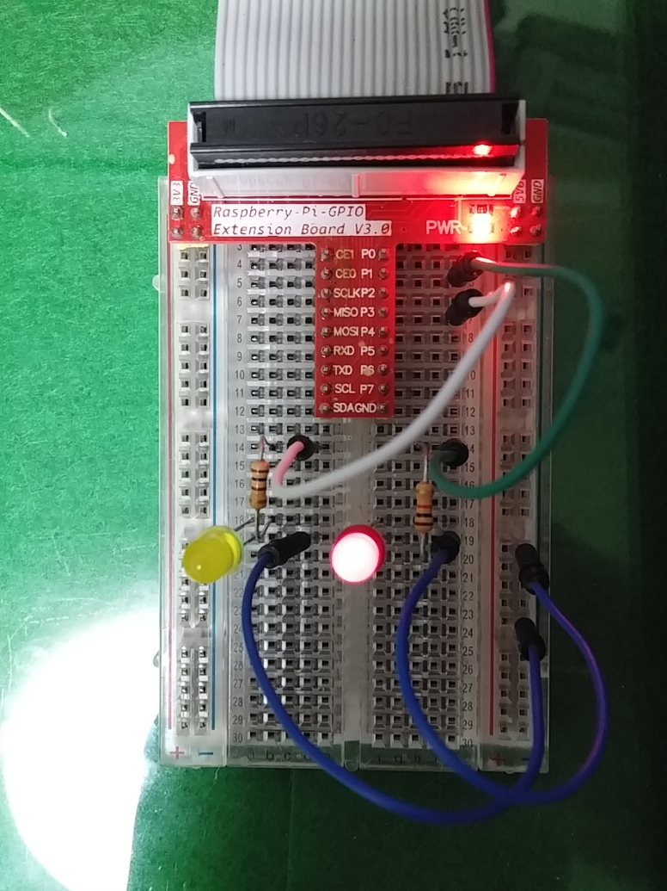

Raspberry PI + PI4J + led blink test
URL : http://pi4j.com/install.html

1. 설치 (쉬운 설치)
```
pi@was02 ~ $ curl -s get.pi4j.com | sudo bash
====================================================
INSTALLING Pi4J GPG PUBLIC KEY
====================================================
% Total    % Received % Xferd  Average Speed   Time    Time     Time  Current
Dload  Upload   Total   Spent    Left  Speed
100  1761  100  1761    0     0   3070      0 –:–:– –:–:– –:–:–  5792
OK
====================================================
ADDING Pi4J APT REPOSITORY
====================================================
–2015-07-05 11:06:55–  http://get.pi4j.com/pi4j.list
Resolving get.pi4j.com (get.pi4j.com)… 54.231.112.122
Connecting to get.pi4j.com (get.pi4j.com)|54.231.112.122|:80… connected.
HTTP request sent, awaiting response… 200 OK
Length: 42 [application/octet-stream]
Saving to: `/etc/apt/sources.list.d/pi4j.list’

100%[=========================================================>] 42          –.-K/s   in 0s

2015-07-05 11:06:55 (394 KB/s) – `/etc/apt/sources.list.d/pi4j.list’ saved [42/42]

====================================================
UPDATING APT REPOSITORIES
====================================================
Get:1 http://repository.pi4j.com wheezy Release.gpg [514 B]
Get:2 http://repository.pi4j.com wheezy Release [1,778 B]
Get:3 http://repository.pi4j.com wheezy/rpi armhf Packages [377 B]
Ign http://repository.pi4j.com wheezy/rpi Translation-en_GB
Ign http://repository.pi4j.com wheezy/rpi Translation-en
Fetched 2,669 B in 4s (581 B/s)
Reading package lists… Done
====================================================
INSTALLING Pi4J
====================================================
Reading package lists… Done
Building dependency tree
Reading state information… Done
The following NEW packages will be installed:
pi4j
0 upgraded, 1 newly installed, 0 to remove and 113 not upgraded.
Need to get 616 kB of archives.
After this operation, 919 kB of additional disk space will be used.
Get:1 http://repository.pi4j.com/ wheezy/rpi pi4j all 1.0 [616 kB]
Fetched 616 kB in 3s (162 kB/s)
Selecting previously unselected package pi4j.
(Reading database … 74928 files and directories currently installed.)
Unpacking pi4j (from …/apt/archives/pi4j_1.0_all.deb) …
Setting up pi4j (1.0) …
====================================================
Pi4J INSTALLATION COMPLETE
====================================================

The Pi4J JAR files are located at:
/opt/pi4j/lib

Example Java programs are located at:
/opt/pi4j/examples

You can compile the examples using this script:
sudo /opt/pi4j/examples/build

Please see http://www.pi4j.com for more information.

pi@was02 ~ $

PI4J 라이브러리 위치 : /opt/pi4j/lb
PI4J 샘플 : /opt/pi4j/examplesPI4J 샘플 실행 : sudo /opt/pi4j/examples/build
```


2. 샘플빌드
```
pi@was02 /opt/pi4j/examples $ ./build
———————————————————
[01 of 34] … compiling : BlinkGpioExample.java
[02 of 34] … compiling : BlinkTriggerGpioExample.java
[03 of 34] … compiling : ComputeModuleGpioExample.java
[04 of 34] … compiling : ControlGpioExample.java
[05 of 34] … compiling : CylonGpioExample.java
[06 of 34] … compiling : DebounceGpioExample.java
[07 of 34] … compiling : FrequencyGpioExample.java
[08 of 34] … compiling : I2CWiiMotionPlusExample.java
[09 of 34] … compiling : ListenGpioExample.java
[10 of 34] … compiling : ListenMultipleGpioExample.java
[11 of 34] … compiling : MCP23017GpioExample.java
[12 of 34] … compiling : MCP23S17GpioExample.java
[13 of 34] … compiling : MCP4725GpioExample.java
[14 of 34] … compiling : MultipurposePinGpioExample.java
[15 of 34] … compiling : OlimexGpioExample.java
[16 of 34] … compiling : PCF8574GpioExample.java
[17 of 34] … compiling : PCA9685GpioExample.java
[18 of 34] … compiling : PCA9685GpioServoExample.java
[19 of 34] … compiling : PibrellaExample.java
[20 of 34] … compiling : PiFaceExample.java
[21 of 34] … compiling : PiFaceGpioExample.java
[22 of 34] … compiling : SerialExample.java
[23 of 34] … compiling : ShutdownGpioExample.java
[24 of 34] … compiling : SpiExample.java
[25 of 34] … compiling : StepperMotorGpioExample.java
[26 of 34] … compiling : SystemInfoExample.java
[27 of 34] … compiling : TriggerGpioExample.java
[28 of 34] … compiling : UsageGpioExample.java
[29 of 34] … compiling : WiringPiGpioExample.java
[30 of 34] … compiling : WiringPiGpioInterruptExample.java
[31 of 34] … compiling : WiringPiGpioInterruptExample2.java
[32 of 34] … compiling : WiringPiSerialExample.java
[33 of 34] … compiling : WiringPiSoftPWMExample.java
[34 of 34] … compiling : WiringPiSPIExample.java
———————————————————
sudo java -classpath .:classes:/opt/pi4j/lib/’*’ BlinkGpioExample
```

3. 소스코드
```java
import com.pi4j.io.gpio.GpioController;
import com.pi4j.io.gpio.GpioFactory;
import com.pi4j.io.gpio.GpioPinDigitalInput;
import com.pi4j.io.gpio.GpioPinDigitalOutput;
import com.pi4j.io.gpio.PinPullResistance;
import com.pi4j.io.gpio.RaspiPin;
import com.pi4j.io.gpio.event.GpioPinDigitalStateChangeEvent;
import com.pi4j.io.gpio.event.GpioPinListenerDigital;

/**
* This example code demonstrates how to perform simple
* blinking LED logic of a GPIO pin on the Raspberry Pi
* using the Pi4J library.
*
* @author Robert Savage
*/
public class BlinkGpioExample {

public static void main(String[] args) throws InterruptedException {

System.out.println("<--Pi4J--> GPIO Blink Example ... started.");

// create gpio controller
final GpioController gpio = GpioFactory.getInstance();

// provision gpio pin #01 & #03 as an output pins and blink
final GpioPinDigitalOutput led1 = gpio.provisionDigitalOutputPin(RaspiPin.GPIO_01);
final GpioPinDigitalOutput led2 = gpio.provisionDigitalOutputPin(RaspiPin.GPIO_03);

// provision gpio pin #02 as an input pin with its internal pull down resistor enabled
final GpioPinDigitalInput myButton = gpio.provisionDigitalInputPin(RaspiPin.GPIO_02, PinPullResistance.PULL_DOWN);

// create and register gpio pin listener
myButton.addListener(new GpioPinListenerDigital() {
@Override
public void handleGpioPinDigitalStateChangeEvent(GpioPinDigitalStateChangeEvent event) {
// when button is pressed, speed up the blink rate on LED #2
System.out.println("event.getState().isHigh() => " +event.getState().isHigh());
if(event.getState().isHigh()){
led2.blink(200);
}
else{
led2.blink(1000);
}
}
});

// continuously blink the led every 1/2 second for 15 seconds
led1.blink(500, 15000);

// continuously blink the led every 1 second
led2.blink(500);

System.out.println(" ... the LED will continue blinking until the program is terminated.");
System.out.println(" ... PRESS <CTRL-C> TO STOP THE PROGRAM.");

// keep program running until user aborts (CTRL-C)
for (;;) {
Thread.sleep(500);
}

// stop all GPIO activity/threads
// (this method will forcefully shutdown all GPIO monitoring threads and scheduled tasks)
// gpio.shutdown();   <--- implement this method call if you wish to terminate the Pi4J GPIO controller
}
}
```


4. 회로도

